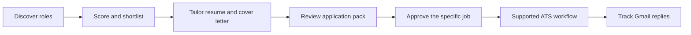

# ApplyMate AI

[](https://github.com/YuanshuoDu/applymate-jobcopilot/actions/workflows/ci.yml)
[](https://nextjs.org/)
[](https://react.dev/)
[](https://www.typescriptlang.org/)
[](https://www.prisma.io/)
[](https://developer.chrome.com/docs/extensions/)

> **AI job-search copilot for the European market.**
>
> Discover relevant roles, understand your fit, tailor application materials,
> complete supported application workflows, and track replies in one reviewable
> workspace.

[Live app](https://applymate.site) · [Preview](https://preview.applymate.site) · [Documentation](docs/README.md) · [Issues](https://github.com/YuanshuoDu/applymate-jobcopilot/issues)

## Contents

- [Why ApplyMate](#why-applymate)
- [End-to-end workflow](#end-to-end-workflow)
- [Capabilities](#capabilities)
- [Product surfaces](#product-surfaces)
- [Current capability map](#current-capability-map)
- [Safety and user control](#safety-and-user-control)
- [Technology](#technology)
- [Repository layout](#repository-layout)
- [Getting started](#getting-started)
- [Documentation](#documentation)
- [Deployment](#deployment)
- [Roadmap](#roadmap)
- [Contributing](#contributing)

## Why ApplyMate

Job searching is fragmented across job boards, company career sites, applicant
tracking systems, document editors, and email. ApplyMate brings the most useful
parts of that loop together without hiding the decision that matters most: the
candidate approves each application before final submission.

The project is designed for people applying across European markets, where role,
location, language, ATS, and follow-up requirements vary from one application to
the next.

## End-to-end workflow



The workflow is intentionally reviewable. ApplyMate can prepare information,
generate documents, and run supported workflow steps, but login, MFA, CAPTCHA,
missing answers, and other candidate-only steps remain explicit handoffs.

## Capabilities

### Job discovery and matching

- Search public job sources and company ATS portals from one workspace.
- Normalize job records so titles, locations, descriptions, and application links
  can be compared consistently.
- Score roles against a candidate profile and extract important requirements and
  keywords for faster review.
- Keep a shortlist of relevant opportunities instead of treating every search
  result as an application candidate.
- Use source-aware pacing and stale-result checks so discovery remains useful as
  listings change.

### Resume and profile workspace

- Upload and parse PDF or DOCX resumes into structured profile information.
- Keep a reusable base resume while creating job-specific tailored versions.
- Preserve version history so an earlier resume can be restored when needed.
- Generate downloadable application packs containing the selected resume,
  cover letter, and supporting materials.

### Tailored application materials

- Compare a role description with the candidate profile before writing.
- Generate a cover letter that reflects the specific role rather than a generic
  template.
- Suggest targeted keywords and phrasing while keeping the candidate's source
  information as the basis for the application.
- Review the generated material before it is used in an application workflow.

### Application workflows

- Move a shortlisted job through review, approval, preparation, and application
  states in the web workspace.
- Use the Chrome Extension to capture jobs from supported career pages, keep
  saved jobs synchronized, preview application material, and assist with form
  fields in the current browser tab.
- Run queue-backed tasks for discovery, agent work, and supported ATS flows.
- Pause and resume when a workflow needs approval, a candidate answer, login,
  MFA, CAPTCHA, or another human action.

### Gmail tracking

- Connect Google through OAuth when email tracking is enabled.
- Track job-related messages, unread counts, and application-status signals.
- Surface useful follow-up context for interviews, offers, rejections, and
  recruiter replies.
- Prepare follow-up drafts for the user to review and send.

### Supported ATS workflows

The Worker currently contains workflow modules for:

- Workday
- Greenhouse
- Lever
- SmartRecruiters
- Personio

Coverage is deliberately explicit: a supported workflow can still pause when a
site presents a candidate-only step or a form requires information that is not
available in the profile.

## Product surfaces

| Surface | What it is for |
| --- | --- |
| **Web app** | Job discovery, profile and resume management, tailoring, application review, approvals, Gmail tracking, and run history. |
| **Chrome Extension** | In-page job capture, saved-job synchronization, application-material preview, and assisted form filling. |
| **Worker** | Queue-backed discovery, agent runs, checkpoints, pacing, and supported ATS workflows. |
| **Shared packages** | Reusable types, UI primitives, and prompt utilities used across the monorepo. |

## Current capability map

| Capability | Status | What to expect |
| --- | --- | --- |
| Job discovery and scoring | Available | Search, normalize, score, and shortlist roles. |
| Resume parsing and tailoring | Available | Build reusable and job-specific application materials. |
| Cover-letter generation | Available | Generate and review role-specific drafts. |
| Gmail reply tracking | Available when connected | Track relevant replies and prepare follow-up drafts. |
| Chrome-assisted form filling | Assisted | The candidate remains present and controls the final submission. |
| Supported ATS workflows | Available for listed ATSes | Queue-backed workflows with explicit pauses and handoffs. |
| Fully unattended final submission | Deliberately bounded | Not claimed as a universal capability; account access and candidate-only steps remain user-controlled. |

## Safety and user control

- Final submission requires explicit approval for the specific job.
- Login, MFA, CAPTCHA, and other challenge steps are not silently treated as
  completed.
- Connected accounts and application data are scoped to the owning candidate.
- Production OAuth credentials are protected with an Azure Key Vault RSA key.
- Secrets, OAuth values, and provider credentials belong in environment variables,
  never in source control or public issue comments.

## Technology

| Area | Technology |
| --- | --- |
| Web application | Next.js App Router, React, TypeScript, Tailwind CSS |
| Browser Extension | Vite, React, Chrome Manifest V3 |
| Data layer | PostgreSQL, Prisma |
| Background jobs | Node.js, BullMQ, Redis |
| Browser workflows | Playwright-compatible automation and ATS-specific flow modules |
| Authentication | Auth.js / NextAuth, Google OAuth |
| AI integration | ModelRouter with configurable provider adapters |
| Production deployment | Vercel web deployment plus a separate Worker deployment |
| Credential protection | Azure Key Vault |

## Repository layout

```text
applymate-jobcopilot/
├── apps/
│   ├── web/          # Next.js web app and API routes
│   ├── extension/    # Chrome Extension
│   └── worker/       # Queue workers and ATS workflows
├── packages/
│   ├── shared/       # Shared types and utilities
│   ├── ui/           # Shared UI components
│   └── ai-prompts/   # Versioned prompt templates
├── docs/             # Architecture, API, runbooks, and contributor docs
└── e2e/              # Playwright end-to-end tests
```

## Getting started

### Prerequisites

- Node.js 20 or later
- pnpm 10 or later
- PostgreSQL
- Redis for queue-backed features
- Google OAuth credentials for Gmail and sign-in flows
- An AI provider configuration for scoring and document generation

### Install

```bash
git clone https://github.com/YuanshuoDu/applymate-jobcopilot.git
cd applymate-jobcopilot
pnpm install
```

### Configure the web app

Copy the environment template and fill in the values for your local setup:

```bash
cp apps/web/.env.example apps/web/.env.local
```

At minimum, local development normally needs `DATABASE_URL`, `AUTH_SECRET`,
Google OAuth credentials, an AI provider key, and `REDIS_URL`. Never commit
`.env.local` or provider credentials.

Production OAuth credential persistence additionally requires the Azure Key Vault
configuration below:

```env
AZURE_KEY_VAULT_URL=
AZURE_KEY_NAME=applymate-credential-key
AZURE_TENANT_ID=
AZURE_CLIENT_ID=
AZURE_CLIENT_SECRET=
```

The Azure application needs the appropriate crypto role on the Key Vault.
`CREDENTIAL_ENCRYPTION_KEY` is a local development/test fallback and is not a
replacement for production Key Vault protection.

### Prepare the database and start the web app

```bash
pnpm --filter @jobcopilot/web db:push
pnpm dev
```

The web app runs on `http://localhost:3000`.

### Build the Chrome Extension

```bash
pnpm --filter @jobcopilot/extension build
```

Then open `chrome://extensions`, enable **Developer mode**, choose **Load
unpacked**, and select `apps/extension/dist`.

### Run checks

```bash
pnpm lint
pnpm typecheck
pnpm test
pnpm build
```

For Extension changes, also run the Extension build and its targeted tests. For
Worker or browser changes, run the targeted integration and Playwright checks
described in the relevant documentation.

## Documentation

- [Documentation index](docs/README.md)
- [API reference](docs/api-reference.md)
- [Scraping and auto-apply design](docs/scraping-autoapply-design.md)
- [Scraping and auto-apply developer guide](docs/scraping-autoapply-dev-guide.md)
- [Runbook](docs/runbook.md)

## Deployment

The web app is deployed on [applymate.site](https://applymate.site), with a
branch-linked preview at [preview.applymate.site](https://preview.applymate.site).
The Worker runs as a separate deployment and consumes the shared queue and
workflow configuration described by the environment template.

## Roadmap

- Broader direct ATS and source coverage.
- Deeper Extension-to-Worker handoff for supported application workflows.
- Better handling for forms and job descriptions that cannot be parsed reliably
  as text, including screenshot and OCR-assisted inputs.
- More resilient approval, account-isolation, and user-handoff experiences as
  supported automation coverage expands.

## Contributing

1. Create a focused feature branch.
2. Add tests for new behavior and keep user-facing boundaries explicit.
3. Run the relevant lint, typecheck, test, and build commands.
4. Describe user-facing behavior, security considerations, and known limitations
   in the pull request.

See the [developer guide](docs/scraping-autoapply-dev-guide.md) before changing
discovery or application workflow code.
