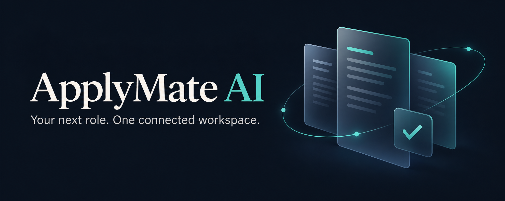
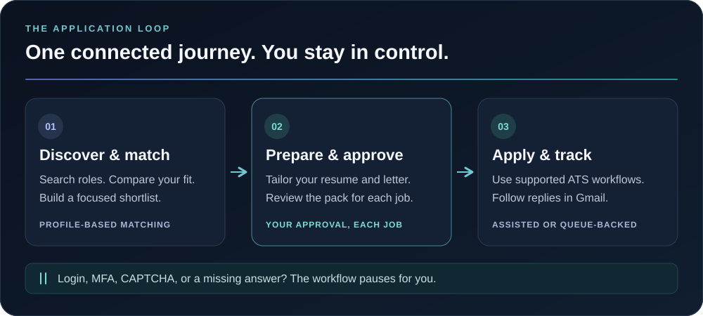

# ApplyMate AI

<p align="center">
  
</p>

<p align="center">
  <strong>An AI job-search copilot for the European market.</strong><br />
  Discover relevant roles, tailor your application, and follow every opportunity in one workspace.
</p>

<p align="center">
  <a href="https://applymate.site"><strong>Open ApplyMate</strong></a> ·
  <a href="https://preview.applymate.site">Preview</a> ·
  <a href="docs/README.md">Documentation</a> ·
  <a href="https://github.com/YuanshuoDu/applymate-jobcopilot/issues">Issues</a>
</p>

<p align="center">
  <a href="https://github.com/YuanshuoDu/applymate-jobcopilot/actions/workflows/ci.yml"></a>
  <a href="https://nextjs.org/"></a>
  <a href="https://react.dev/"></a>
  <a href="https://www.typescriptlang.org/"></a>
</p>

<p align="center">
  <a href="#the-application-loop">Workflow</a> ·
  <a href="#what-you-can-do">Capabilities</a> ·
  <a href="#architecture">Architecture</a> ·
  <a href="#quick-start">Quick start</a> ·
  <a href="#documentation">Developer docs</a>
</p>

---

## Why ApplyMate

Job searching spreads your work across job boards, career portals, document
editors, and email. ApplyMate connects discovery, application preparation, and
follow-up so you can keep the role, your materials, and the next step together.

Built for candidates applying across European markets, where location, language,
and application requirements vary. **You review the materials and approve each
job before final submission.**

## The application loop



1. **Discover and match** — search roles, compare them with your profile, and build a shortlist.
2. **Prepare and approve** — tailor your resume and cover letter, review the application pack, and approve the specific job.
3. **Apply and track** — use assisted filling or a supported ATS workflow, then follow replies in Gmail.

## What you can do

| Capability | In the workspace | Availability |
| --- | --- | --- |
| **Discover & shortlist** | Search job sources and ATS portals; compare normalized descriptions, locations, fit scores, and keywords. | Source-dependent coverage |
| **Manage your resume** | Parse PDF or DOCX files, maintain a reusable profile, and keep tailored versions with history. | Web app |
| **Tailor your application** | Create role-specific resumes and cover letters; review and download application packs. | AI provider configuration required |
| **Use the Chrome Extension** | Capture career-page jobs, synchronize saved jobs, preview materials, and assist with form fields. | Candidate present in the browser |
| **Run supported ATS workflows** | Queue application tasks with checkpoints, approvals, and explicit human handoffs. | Coverage varies by form and account |
| **Follow replies** | Track job-related messages and status signals; prepare follow-up drafts for review. | Gmail connection required |

### ATS workflow coverage

The Worker includes flow modules for **Workday · Greenhouse · Lever ·
SmartRecruiters · Personio**. These are supported integrations, with coverage
depending on the employer's form, account access, and available profile data.

A workflow can pause for a missing answer, login, MFA, or CAPTCHA. Final
submission always remains subject to approval for the specific job.

## Your control, throughout

| Boundary | How ApplyMate handles it |
| --- | --- |
| **Application approval** | Requires explicit approval for the specific job before final submission. |
| **Candidate-only steps** | Login, MFA, CAPTCHA, and missing answers remain visible handoffs. |
| **Account ownership** | Connected accounts and application data are scoped to the owning candidate. |
| **Credentials** | Production OAuth credentials use an Azure Key Vault RSA key; secrets stay outside source control. |

## Architecture

Three product surfaces share one application workflow:

| Surface | Responsibility | Code |
| --- | --- | --- |
| **Web app** | Discovery, profiles, tailoring, approvals, Gmail tracking, and run history. | [apps/web](apps/web) |
| **Chrome Extension** | In-page job capture, saved-job sync, material preview, and assisted filling. | [apps/extension](apps/extension) |
| **Worker** | Queue-backed tasks, browser workflows, checkpoints, and pacing. | [apps/worker](apps/worker) |

**Agent Harness V2 is the canonical production agent path.** New agent features
use typed session, turn, event, and tool contracts. Legacy paths remain read-only
or fail-closed emergency compatibility until the documented GA gate and rollback
evidence are complete. See the [V2 technical design](docs/agent-harness-v2-technical-design.md)
and [development roadmap](docs/agent-harness-v2-development-roadmap.md).

### Technology

| Layer | Stack |
| --- | --- |
| Web | Next.js App Router · React · TypeScript · Tailwind CSS |
| Extension | Vite · React · Chrome Manifest V3 |
| Data & queues | PostgreSQL · Prisma · BullMQ · Redis |
| Browser workflows | Playwright-compatible automation · ATS-specific flow modules |
| Identity & credentials | Auth.js / NextAuth · Google OAuth · Azure Key Vault |
| AI | ModelRouter with configurable provider adapters |
| Deployment | Vercel web app · separate Worker service |

<details>
<summary><strong>Explore the repository</strong></summary>

```text
applymate-jobcopilot/
├── apps/
│   ├── web/              # Web app and API routes
│   ├── extension/        # Chrome Extension
│   └── worker/           # Queue workers and ATS workflows
├── packages/
│   ├── agent-model/      # Shared model integration
│   ├── agent-policy/     # Shared agent policy
│   ├── agent-protocol/   # Typed runtime contracts
│   └── shared/           # Shared types and utilities
├── docs/                 # Architecture, API, and runbooks
└── e2e/                  # Playwright end-to-end tests
```

</details>

## Quick start

### 1. Install

Use **Node.js 20+**, **pnpm 10.33.2** (the version pinned by this repository),
and a local development **PostgreSQL** database.

```bash
git clone https://github.com/YuanshuoDu/applymate-jobcopilot.git
cd applymate-jobcopilot
pnpm install --frozen-lockfile
```

### 2. Configure

Copy [apps/web/.env.example](apps/web/.env.example) to
`apps/web/.env.local` and fill in the values for your local environment.

| Configuration | Used for |
| --- | --- |
| `DATABASE_URL`, `AUTH_SECRET` | Database access and authentication |
| Google OAuth credentials | Google sign-in and connected Gmail features |
| AI provider configuration | Scoring, parsing, and document generation |
| `REDIS_URL` | Queue-backed features |
| [Worker environment template](apps/worker/.env.example) | Running the separate Worker service |

Keep local environment files and provider credentials outside Git.

### 3. Prepare the database and run

Use a local development database for these commands:

```bash
pnpm --filter @jobcopilot/web db:generate
pnpm --filter @jobcopilot/web db:push
pnpm --filter './packages/*' build
pnpm --filter @jobcopilot/web dev
```

Open [localhost:3000](http://localhost:3000).

<details>
<summary><strong>Build and load the Chrome Extension</strong></summary>

```bash
pnpm --filter @jobcopilot/extension build
```

Open `chrome://extensions`, enable **Developer mode**, choose **Load unpacked**,
and select `apps/extension/dist`.

</details>

<details>
<summary><strong>Run project checks</strong></summary>

```bash
pnpm lint
pnpm typecheck
pnpm test
pnpm build
```

For Worker, Extension, or browser changes, also run the relevant targeted and
integration checks described in the developer documentation.

</details>

<details>
<summary><strong>Production OAuth credential protection</strong></summary>

Production OAuth persistence requires Azure Key Vault configuration:

```env
AZURE_KEY_VAULT_URL=
AZURE_KEY_NAME=applymate-credential-key
AZURE_TENANT_ID=
AZURE_CLIENT_ID=
AZURE_CLIENT_SECRET=
```

The Azure application needs the appropriate crypto role on the Key Vault.
`CREDENTIAL_ENCRYPTION_KEY` is a local development/test fallback; production uses
Key Vault protection. See the [environment template](apps/web/.env.example).

</details>

## Documentation

| Start here | What you will find |
| --- | --- |
| [Documentation index](docs/README.md) | The maintained documentation map |
| [Agent Harness V2 design](docs/agent-harness-v2-technical-design.md) | Runtime contracts, tools, approvals, and recovery |
| [Agent Harness V2 roadmap](docs/agent-harness-v2-development-roadmap.md) | Implementation gates, verification, rollout, and rollback |
| [Discovery & auto-apply design](docs/scraping-autoapply-design.md) | Source discovery, enrichment, and ATS workflow architecture |
| [Developer guide](docs/scraping-autoapply-dev-guide.md) | Coding standards and integration guidance |
| [API reference](docs/api-reference.md) | Routes, authentication, and payloads |
| [Operations runbook](docs/runbook.md) | Queues, Worker incidents, and production diagnostics |

## Direction & contributing

Development focuses on broader source coverage, stronger Extension-to-Worker
handoffs, resilient approvals and recovery, and better handling of forms or job
descriptions that require screenshot or OCR-assisted inputs. The linked roadmaps
contain the delivery gates and current implementation detail.

To contribute, create a focused branch, add tests for new behavior, run the
relevant checks, and describe the user-visible result and known limitations in
your PR. Read the [developer guide](docs/scraping-autoapply-dev-guide.md) and
[GitHub collaboration guide](docs/github-collaboration.md) before changing agent
or application workflow code.

---

<p align="center">
  <strong>Find your fit. Prepare with care. Keep moving.</strong><br />
  <a href="https://applymate.site">Open ApplyMate</a> · <a href="docs/README.md">Explore the docs</a>
</p>
