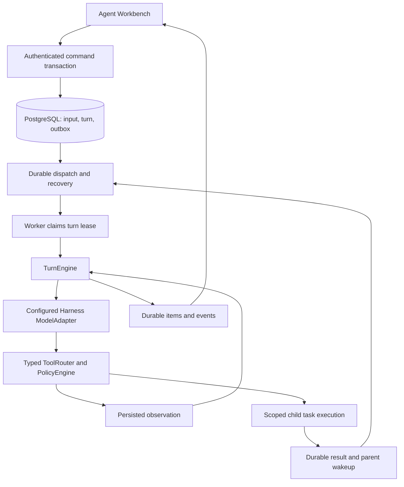

# Canonical Agent execution and supervision

Status: implementation in progress for [#495](https://github.com/YuanshuoDu/applymate-jobcopilot/issues/495).
Baseline: `e484bd5cb1a8982c0c0ba3aa3af1eb4442588438`, inspected on 2026-09-07.

## Product outcome

An accepted conversation message must start a recoverable Agent turn. The Agent can use configured models, call permitted tools, receive observations, and continue within the same turn. The workbench shows the actual execution state and evidence. Acknowledging a command or rendering an event is not proof that its work ran.

This work extends the existing Harness V2. It does not introduce another protocol, replace API-key model configuration, or declare the outstanding staging evidence in [#387](https://github.com/YuanshuoDu/applymate-jobcopilot/issues/387) verified.

## Evidence behind the scope

Independent Luna investigations found these integration gaps on the baseline:

| Existing component | Missing production connection |
| --- | --- |
| Authenticated message command transaction and durable input/events | New interactive turns do not publish the turn dispatch topic consumed by the V2 queue. |
| Turn queue and recovery scanner | Worker startup does not register them. |
| Harness model runtime and typed tool runtime | The canonical agent-run executor uses the deterministic pipeline adapter instead of composing them. |
| AgentTreeManager, task store, subagent queue and recovery helpers | Startup and a production task executor do not compose their complete lifecycle. |
| Coordination tool definitions | Tool execution loses root/task identity, and durable wait is an interface without a production implementation. |
| V2 timeline reducer and task-tree component | The workbench does not mount the execution tree; its stream state is local to the central view. |
| Component and scripted fault tests | They do not instantiate the production startup composition. |

The attachment's recommendation to reuse V2 is sound. The most urgent change is production integration of existing components. A new general DAG scheduler, a new runtime package, and a wholesale provider migration are not prerequisites for repairing this connection.

## Runtime ownership

The model proposes semantic actions. Runtime code owns permissions, state transitions, dependency waits, budgets, cancellation, leases, retry policy, and the final completion decision. Web remains the control plane. Worker owns model/tool loops. PostgreSQL remains authoritative; Upstash Redis/BullMQ provides dispatch and wakeups.

## Integration contracts

1. New root-turn creation and its dispatch outbox entry commit atomically. A duplicate message idempotency key must not produce another turn or dispatch identity.
2. Production startup and integration tests use the same injectable composition. Startup registers consumers before reporting readiness and closes their recovery timers, queues, and runtime resources during shutdown.
3. A canonical runtime factory composes existing context/input claims, the turn store, model runtime, typed tools, and task lineage. Production credentials resolve under the current user's configuration; test injection must not become an unsafe production fallback.
4. Every tool call carries authenticated user/session/turn identity and runtime-owned root/task identity. Model arguments cannot replace these values.
5. An invalid model proposal, unavailable tool, or missing runtime dependency produces an explicit failure/observation. None becomes implicit permission to proceed.
6. The first execution gate is a real model -> scoped read tool -> persisted observation -> model -> final-item loop. Child coordination is accepted only after an actual spawn -> wait -> child completion -> parent-resume fixture passes.
7. The conversation and supervisor consume one shared timeline state and one subscription per selected session. Session switches abort stale work and discard responses/events from the previous session.
8. Supervisor selection links to the matching rendered evidence. Controls are only shown when an actual supported command handler exists. Existing application review remains available during integration.

### Account admission and model usage

The canonical Worker must obtain account admission before each provider call. The trusted internal bridge reuses Web's entitlement source and atomically admits the call against the existing account budget. User, session, turn, step, current lease and resolved provider/model identity bind that admission. Retried admission and settlement use the same operation identity; neither can spend a second credit merely because transport delivery repeats.

The bridge uses a narrow authenticated internal endpoint and existing budget/usage tables. Runtime snapshots and tool arguments cannot choose credentials or bypass admission. Ordinary conversational read tools use the account's AI allowance; application-specific capabilities retain their separate feature and approval checks. Missing admission configuration fails before contacting a provider. A provider fallback must have its own trusted admission and accounting, so the canonical path disables implicit environment fallback.

Settlement records stable status and usage facts. It must not leak raw provider errors or keys. An uncertain provider result remains an uncertain recorded attempt; retrying settlement does not repeat generation. Existing per-turn limits remain additional execution bounds and do not replace account admission.

The existing-schema admission ledger deliberately rejects a repeated reserved admission as in flight. A lost admission response therefore produces an explicit blocker instead of issuing another provider call. It does not infer a refund from missing completion evidence. Repeated settlement must match the stored terminal usage facts; conflicting terminal reports are rejected. The ledger derives credential source from trusted configuration so BYOK and platform usage remain distinguishable.

### Child execution acceptance boundary

Child consumers are enabled only with a real scoped executor. A child executes under its own task lease and inherited policy, rather than concurrently mutating the parent's Turn lease. Task identity, role, attempts, context and result lineage remain durable. Parent wait registration and child-result observation are reconciled against authoritative task state so completion before registration and duplicate completion delivery are both safe.

The first required join runs two independent read tasks, releases parent capacity during the wait, persists both results, and resumes the parent once with those observations. The same fixture must cover a failed child, timeout, interruption, expired ownership and restart. An in-memory notification or a standalone queue factory is insufficient evidence for this boundary.

### Additive persistence correction

The 2026-09-08 repository survey confirms two missing persistence contracts. There is no concrete wait store. Generic tool results above 8,192 bytes become references in a process-local map, with no model-side resolver. The existing recruitment artifact repository is scoped to user/job and resume/cover-letter lifecycle rules; it cannot safely stand in for session/task execution receipts.

The primary therefore extends #495 to prepare two additive V2 models and their migration: private tool-result references and durable wait conditions. This is migration source preparation; applying it to a shared database or production is a separate operation. Existing rows and constraints must remain valid. Neither model is exposed through the public task/timeline DTO.

Tool-result records bind user, session, turn, step, task and tool-call identity to sanitized JSON, a content hash and byte count. Writes require the current root or child execution fence. Reads require the same owner and allowed task lineage. A bounded registered read tool resolves retained references in small chunks, so large observations remain inspectable without expanding the next prompt indefinitely. Session deletion cascades these records. Oversized storage or invalid references fail explicitly.

Wait records bind an immutable set of child targets, mode, deadline and idempotency identity to their parent task and originating step. Waiting, ready, timed-out and cancelled outcomes are persisted. Target validation rejects cross-user/session/root references and cyclic/self dependencies. Resolution and its dispatch outbox entry are transactional and repeatable; a completion arriving before suspension must still be observed. Parent suspension releases its lease only after its step/item evidence is durable. A scanner reconciles persisted task state and deadlines after restart.

### Root and child execution ownership

Current SQL permits turn sources `user`, `automation` and `system`, and allows only one active turn per session. Children therefore stay inside the root Turn and execute under their own Task lease. Creating a synthetic child Turn or borrowing the parent's lease would contradict the existing control boundary.

The next implementation must share the model/tool loop while binding persistence and authorization to an explicit root or child owner. Root adapters retain Turn lease version checks. Child adapters require Task owner, attempt count, expiry, interruption state and valid root state. No structural cast may pretend a child holds the parent Turn lease.

Steps carry the actual task ID. Their stored ordinal is allocated atomically within the Turn to satisfy its existing uniqueness constraint during concurrent children. Logical step/item identities include task identity. Child completion stores a child result and child activity; it cannot overwrite the root final response or publish a root completion. Root resume accounting and context reconstruction must exclude child steps and observations except results deliberately returned through the wait/join boundary.

## Recovery and safety invariants

- Queue delivery may repeat; lease/state checks decide whether execution may proceed.
- A late worker cannot commit a result after losing ownership of its turn or task.
- A waiting parent releases execution capacity. Wait registration checks existing child state so a completion arriving just before the wait cannot be lost.
- Child terminal events, deadline expiry, steering, and cancellation must resolve persisted wait conditions without starting duplicate parent executions.
- Children inherit only the parent's allowed context, tools, and budget. They cannot escalate permission by supplying a different task or user ID.
- Model/provider failures never authorize an external action. Existing approval, reservation, hash, and receipt checks remain authoritative.
- Non-repeatable third-party writes are not generally exactly-once. An uncertain result requires reconciliation; it is never automatically retried or reported as cancelled/completed without evidence.
- Plaintext API keys must not enter browser bundles, task context, event payloads, transcripts, or logs.

## Verification gates

| Gate | Required evidence |
| --- | --- |
| Atomic acceptance | New command/outbox transaction, duplicate command, rollback. |
| Production registration | Same bootstrap as startup registers turn dispatch/recovery and implemented child consumers; clean shutdown. |
| Conversational execution | Real TurnEngine and ToolRouter with an injected deterministic provider; persisted result feeds the next model step. |
| Identity and cancellation | Cross-user/session denial, immutable task lineage, interrupt/lease-loss behavior. |
| Recovery | Duplicate dispatch, abandoned lease reclaim, completed work not replayed. |
| Child coordination | Two bounded children, durable wait, terminal result delivery, parent resumption, duplicate wakeup suppression. |
| Workbench | Shared subscription, restore/error states, task selection, responsive rendering, English/Chinese consistency. |
| Delivery | Focused tests, affected package typechecks/builds, reviewed diff, scoped commit/push and one PR. |

Automated fixtures must not make live model calls or employer submissions. Browser fixture checks are UI evidence, not authenticated staging or production verification. The final PR records which gates actually passed and any remaining implementation or deployment boundary.

### Integration checkpoint, 2026-09-08

Luna verification of the current canonical runtime and admission bridge passed:

- Core runtime/state/root-store/model tests: 4 files, 19 tests.
- Worker admission, queue, recovery and shutdown tests: 8 files, 42 tests.
- Web usage broker and internal route tests: 2 files, 7 tests.
- Worker TypeScript and its shared-package build; direct Web `tsc --noEmit`.

The full Web typecheck command attempted Prisma regeneration and encountered a Windows `EPERM` engine-file rename lock. The direct TypeScript phase passed. This is a tooling boundary, not evidence of successful regeneration.

These are local automated results. Real database/RLS execution, actual process restart, child execution/wait composition and the supervisor browser fixture are not yet accepted. Large lifecycle outputs still use process-local result references and require durable storage before long-session acceptance. No provider call, employer submission, database migration, staging gate or production deployment is claimed by this checkpoint.

## Follow-up sequence

### Full owner-goal acceptance ledger

Issue #495 is the first integration milestone; it is not a substitute for the full owner goal. Completion remains unproven until each capability below has evidence from its real execution path.

| Owner requirement | Evidence required before declaring the full goal complete |
| --- | --- |
| Long-lived sessions | Persisted conversation/context survives reload and Worker restart; a later turn uses the correct prior work without mixing users. |
| Planning and decomposition | A configured API model proposes a validated plan and bounded independent tasks; the runtime schedules that plan and records changes. |
| Worker supervision | Native spawn/send/follow-up/wait/interrupt/list semantics operate on real child executions with scoped context and enforceable limits. |
| Tool calls and permissions | Registered tools pass schema, tenant and policy validation; controlled side effects require current exact-scope authorization. |
| Pause and resume | Runtime capacity is released while waiting, pending work survives restart, and an authorized resume continues the correct work. |
| Failed-work recovery | Retry limits and attempt identity persist; lost leases and late results cannot replay completed work or silently reset budgets. |
| Durable state and event stream | State transitions and observations are recoverable from PostgreSQL; reconnect replays or rehydrates without gaps or duplication. |
| Human approval | The UI displays actual pending decisions; approval, denial, expiration, material changes and resume follow the canonical runtime boundary. |
| Reliable result closure | Final results cite task/tool/artifact evidence and distinguish completion, failure, waiting and uncertain external outcomes. |
| Desktop-style workbench | Sessions, conversation, live worker/task tree, steering, evidence and review are usable together at desktop and mobile sizes. |
| API-key model integration | Existing user/platform selection, credential isolation, quotas and usage accounting remain enforced for root and child calls. |
| Engineering handoff | Luna implementation/tests, Astra review and Luna repairs precede final acceptance; scoped commits and PRs are pushed and their state checked. |

Missing, indirect, fixture-only or unverified production evidence must stay explicitly marked. Existing unit-test success alone does not complete any broader capability in this ledger.

After this integration is verified, prioritize explicit task dependency joins and runtime-enforced concurrency, then evidence-preserving context compaction under real long conversations, then more capable steering and artifact review. Evaluate each against the working production call chain before expanding schemas or adding abstractions.

The collaboration model follows the owner's 2026-09-07 request: Astra owns architecture, decomposition, cross-module decisions and final review; Luna xhigh workers own concrete investigation, implementation, debugging and tests. This direct authorization governs this enhancement while retaining branch/PR review and the unresolved staging gate.
