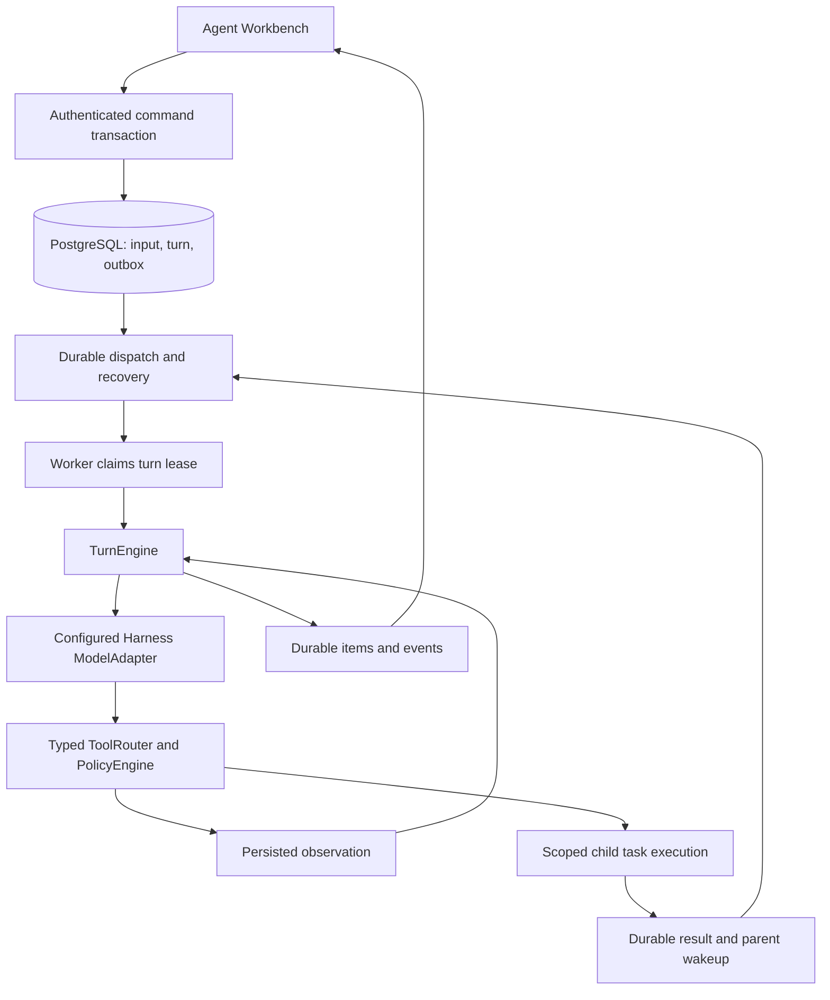

# Canonical Agent execution and supervision

Status: implementation in progress for [#495](https://github.com/YuanshuoDu/applymate-jobcopilot/issues/495).
Baseline: `e484bd5cb1a8982c0c0ba3aa3af1eb4442588438`, inspected on 2026-09-07.

## Product outcome

An accepted conversation message must start a recoverable Agent turn. The Agent can use configured models, call permitted tools, receive observations, and continue within the same turn. The workbench shows the actual execution state and evidence. Acknowledging a command or rendering an event is not proof that its work ran.

This work extends the existing Harness V2. It does not introduce another protocol, replace API-key model configuration, or declare the outstanding staging evidence in [#387](https://github.com/YuanshuoDu/applymate-jobcopilot/issues/387) verified.

## Evidence behind the scope

Independent Luna investigations found these integration gaps on the baseline:

| Existing component | Missing production connection |
| --- | --- |
| Authenticated message command transaction and durable input/events | New interactive turns do not publish the turn dispatch topic consumed by the V2 queue. |
| Turn queue and recovery scanner | Worker startup does not register them. |
| Harness model runtime and typed tool runtime | The canonical agent-run executor uses the deterministic pipeline adapter instead of composing them. |
| AgentTreeManager, task store, subagent queue and recovery helpers | Startup and a production task executor do not compose their complete lifecycle. |
| Coordination tool definitions | Tool execution loses root/task identity, and durable wait is an interface without a production implementation. |
| V2 timeline reducer and task-tree component | The workbench does not mount the execution tree; its stream state is local to the central view. |
| Component and scripted fault tests | They do not instantiate the production startup composition. |

The attachment's recommendation to reuse V2 is sound. The most urgent change is production integration of existing components. A new general DAG scheduler, a new runtime package, and a wholesale provider migration are not prerequisites for repairing this connection.

## Runtime ownership

The model proposes semantic actions. Runtime code owns permissions, state transitions, dependency waits, budgets, cancellation, leases, retry policy, and the final completion decision. Web remains the control plane. Worker owns model/tool loops. PostgreSQL remains authoritative; Upstash Redis/BullMQ provides dispatch and wakeups.

## Integration contracts

1. New root-turn creation and its dispatch outbox entry commit atomically. A duplicate message idempotency key must not produce another turn or dispatch identity.
2. Production startup and integration tests use the same injectable composition. Startup registers consumers before reporting readiness and closes their recovery timers, queues, and runtime resources during shutdown.
3. A canonical runtime factory composes existing context/input claims, the turn store, model runtime, typed tools, and task lineage. Production credentials resolve under the current user's configuration; test injection must not become an unsafe production fallback.
4. Every tool call carries authenticated user/session/turn identity and runtime-owned root/task identity. Model arguments cannot replace these values.
5. An invalid model proposal, unavailable tool, or missing runtime dependency produces an explicit failure/observation. None becomes implicit permission to proceed.
6. The first execution gate is a real model -> scoped read tool -> persisted observation -> model -> final-item loop. Child coordination is accepted only after an actual spawn -> wait -> child completion -> parent-resume fixture passes.
7. The conversation and supervisor consume one shared timeline state and one subscription per selected session. Session switches abort stale work and discard responses/events from the previous session.
8. Supervisor selection links to the matching rendered evidence. Controls are only shown when an actual supported command handler exists. Existing application review remains available during integration.

### Account admission and model usage

The canonical Worker must obtain account admission before each provider call. The trusted internal bridge reuses Web's entitlement source and atomically admits the call against the existing account budget. User, session, turn, step, current lease and resolved provider/model identity bind that admission. Retried admission and settlement use the same operation identity; neither can spend a second credit merely because transport delivery repeats.

The bridge uses a narrow authenticated internal endpoint and existing budget/usage tables. Runtime snapshots and tool arguments cannot choose credentials or bypass admission. Ordinary conversational read tools use the account's AI allowance; application-specific capabilities retain their separate feature and approval checks. Missing admission configuration fails before contacting a provider. A provider fallback must have its own trusted admission and accounting, so the canonical path disables implicit environment fallback.

Settlement records stable status and usage facts. It must not leak raw provider errors or keys. An uncertain provider result remains an uncertain recorded attempt; retrying settlement does not repeat generation. Existing per-turn limits remain additional execution bounds and do not replace account admission.

The existing-schema admission ledger deliberately rejects a repeated reserved admission as in flight. A lost admission response therefore produces an explicit blocker instead of issuing another provider call. It does not infer a refund from missing completion evidence. Repeated settlement must match the stored terminal usage facts; conflicting terminal reports are rejected. The ledger derives credential source from trusted configuration so BYOK and platform usage remain distinguishable.

### Child execution acceptance boundary

Child consumers are enabled only with a real scoped executor. A child executes under its own task lease and inherited policy, rather than concurrently mutating the parent's Turn lease. Task identity, role, attempts, context and result lineage remain durable. Parent wait registration and child-result observation are reconciled against authoritative task state so completion before registration and duplicate completion delivery are both safe.

The first required join runs two independent read tasks, releases parent capacity during the wait, persists both results, and resumes the parent once with those observations. The same fixture must cover a failed child, timeout, interruption, expired ownership and restart. An in-memory notification or a standalone queue factory is insufficient evidence for this boundary.

### Additive persistence correction

The 2026-09-08 repository survey confirms two missing persistence contracts. There is no concrete wait store. Generic tool results above 8,192 bytes become references in a process-local map, with no model-side resolver. The existing recruitment artifact repository is scoped to user/job and resume/cover-letter lifecycle rules; it cannot safely stand in for session/task execution receipts.

The primary therefore extends #495 to prepare two additive V2 models and their migration: private tool-result references and durable wait conditions. This is migration source preparation; applying it to a shared database or production is a separate operation. Existing rows and constraints must remain valid. Neither model is exposed through the public task/timeline DTO.

Tool-result records bind user, session, turn, step, task and tool-call identity to sanitized JSON, a content hash and byte count. Writes require the current root or child execution fence. Reads require the same owner and allowed task lineage. A bounded registered read tool resolves retained references in small chunks, so large observations remain inspectable without expanding the next prompt indefinitely. Session deletion cascades these records. Oversized storage or invalid references fail explicitly.

Wait records bind an immutable set of child targets, mode, deadline and idempotency identity to their parent task and originating step. Waiting, ready, timed-out and cancelled outcomes are persisted. Target validation rejects cross-user/session/root references and cyclic/self dependencies. Resolution and its dispatch outbox entry are transactional and repeatable; a completion arriving before suspension must still be observed. Parent suspension releases its lease only after its step/item evidence is durable. A scanner reconciles persisted task state and deadlines after restart.

### Root and child execution ownership

Current SQL permits turn sources `user`, `automation` and `system`, and allows only one active turn per session. Children therefore stay inside the root Turn and execute under their own Task lease. Creating a synthetic child Turn or borrowing the parent's lease would contradict the existing control boundary.

The next implementation must share the model/tool loop while binding persistence and authorization to an explicit root or child owner. Root adapters retain Turn lease version checks. Child adapters require Task owner, attempt count, expiry, interruption state and valid root state. No structural cast may pretend a child holds the parent Turn lease.

For roots, the current Turn row is the lease authority. Turn heartbeat renews that row; the root Task's copied initial expiry is not a second independently renewed lease. Root settlement must lock and validate the current Turn owner/version/database-time expiry, then validate root Task identity/owner. Child Task expiry remains authoritative for child execution.

Steps carry the actual task ID. Their stored ordinal is allocated atomically within the Turn to satisfy its existing uniqueness constraint during concurrent children. Logical step/item identities include task identity. Events that expose stored order use the allocated ordinal, not a process-local proposal. Child completion stores a child result and child activity; it cannot overwrite the root final response or publish a root completion. Root logical resume accounting and context reconstruction exclude child steps and observations except results deliberately returned through the wait/join boundary. This filtering must not exclude child consumption from the separate authoritative tree/account financial ledger.

The root completion verifier must inspect durable descendant state. A model's terminal proposal cannot complete the root while descendants are still runnable or waiting. Child failure and uncertain external results remain explicit evidence for the final outcome rather than being flattened into success. User cancellation propagates through the tree; process shutdown only releases execution ownership for recovery.

### Durable wait handoff

Wait registration does not release execution ownership inside a tool callback. The current owner first persists the tool receipt, timeline items and completed step. A separate fenced suspension transaction then records `suspendedAt` and releases the parent. This keeps later evidence writes from running under an already-released lease.

Resolution and delivery are separate dimensions. The wait outcome is `waiting`, `ready`, `timed_out`, `interrupted` or `closed`; `suspendedAt` and `consumedAt` track the handoff. A resolver can record a result before suspension, but it must not change the running parent's lease or dispatch that parent. At suspension, an already-resolved wait queues its parent and writes the dispatch outbox in the same transaction. A still-waiting parent moves to the dependency-wait state. Later resolution queues only a suspended, unconsumed parent. A restart scanner applies the same transaction rules.

The queue driver must recognize a durable handoff receipt and skip its ordinary lease-release update. It cannot overwrite a parent already queued by wait resolution. A resumed owner consumes the stored result once, under its new lease, before its next model step. Duplicate notifications and a crash on either side of suspension therefore have an authoritative recovery path.

Child model admission uses the child's task owner and attempt fence, including while its root Turn is waiting. It never borrows the root Turn lease. Root supervision may read retained results from prior turns in the same user's session; a child can read its own and descendant results only within its current turn and task tree. An explicit message or join supplies any additional shared result.

A root queued for resume is still nonterminal. With an `any` wait, other children can remain active while the resolved parent is queued. Their current task leases remain valid across that transition; neither result storage nor model admission may require the root to be exclusively `in_progress`. Root cancellation and terminal closure still fence them out.

Native interrupt semantics distinguish a target subtree from a session-wide stop. Interrupting one child must not silently interrupt the root and unrelated siblings. The existing whole-tree interrupt helper must remain reserved for an explicit root/session cancellation until scoped child interruption has been implemented and verified.

## Recovery and safety invariants

- Queue delivery may repeat; lease/state checks decide whether execution may proceed.
- A late worker cannot commit a result after losing ownership of its turn or task.
- A waiting parent releases execution capacity. Wait registration checks existing child state so a completion arriving just before the wait cannot be lost.
- Child terminal events, deadline expiry, steering, and cancellation must resolve persisted wait conditions without starting duplicate parent executions.
- Children inherit only the parent's allowed context, tools, and budget. They cannot escalate permission by supplying a different task or user ID.
- Model/provider failures never authorize an external action. Existing approval, reservation, hash, and receipt checks remain authoritative.
- Non-repeatable third-party writes are not generally exactly-once. An uncertain result requires reconciliation; it is never automatically retried or reported as cancelled/completed without evidence.
- Plaintext API keys must not enter browser bundles, task context, event payloads, transcripts, or logs.

## Verification gates

| Gate | Required evidence |
| --- | --- |
| Atomic acceptance | New command/outbox transaction, duplicate command, rollback. |
| Production registration | Same bootstrap as startup registers turn dispatch/recovery and implemented child consumers; clean shutdown. |
| Conversational execution | Real TurnEngine and ToolRouter with an injected deterministic provider; persisted result feeds the next model step. |
| Identity and cancellation | Cross-user/session denial, immutable task lineage, interrupt/lease-loss behavior. |
| Recovery | Duplicate dispatch, abandoned lease reclaim, completed work not replayed. |
| Child coordination | Two bounded children, durable wait, terminal result delivery, parent resumption, duplicate wakeup suppression. |
| Workbench | Shared subscription, restore/error states, task selection, responsive rendering, English/Chinese consistency. |
| Delivery | Focused tests, affected package typechecks/builds, reviewed diff, scoped commit/push and one PR. |

Automated fixtures must not make live model calls or employer submissions. Browser fixture checks are UI evidence, not authenticated staging or production verification. The final PR records which gates actually passed and any remaining implementation or deployment boundary.

### Integration checkpoint, 2026-09-08

Luna verification of the current canonical runtime and admission bridge passed:

- Core runtime/state/root-store/model tests: 4 files, 19 tests.
- Worker admission, queue, recovery and shutdown tests: 8 files, 42 tests.
- Web usage broker and internal route tests: 2 files, 7 tests.
- Worker TypeScript and its shared-package build; direct Web `tsc --noEmit`.

An earlier Web typecheck encountered a Windows `EPERM` Prisma engine-file rename lock. The later managed browser run completed the Web production build, including generation, and direct Web TypeScript passed. This does not verify a database connection or migration application.

These are local automated results. Real database/RLS execution, actual process restart and child execution/wait composition are not yet accepted. The supervisor fixture has since passed the browser checks below. Large lifecycle outputs still use process-local result references and require durable storage before long-session acceptance. No provider call, employer submission, database migration, staging gate or production deployment is claimed by this checkpoint.

## Follow-up sequence

The owner's detailed next-upgrade plan is in [agent-brain-upgrade-plan.md](./agent-brain-upgrade-plan.md). It sequences execution ownership, real child execution and durable waits before dynamic planning, then covers domain tools, long-session context, supervision and acceptance. This supplements the existing roadmap without marking missing capabilities complete.

### Review checkpoint and execution budget, 2026-09-08

The next checkpoint contains candidate supervisor UI, owner-neutral loop extraction and additive private-result/wait schema source. It remains a draft, not an accepted implementation of child execution or durable joins.

- Luna reported 52 passing tests across 11 Worker files and a passing Worker typecheck for the extraction/startup candidate. The existing startup security test caught static queue imports; those imports now occur after listener validation. The reviewed extraction test now inspects the actual second model request and its tool-result observation. The private-result contract test now executes the read tool and validates its output schema. Those two files passed all three focused tests.
- Luna reported 15 passing storage tests and Prisma validation. The pushed `d710a9d` checkpoint subsequently passed CI Tests, TypeScript, Build, Lockfile and Harness contract checks. Private storage is still not bound to production execution, and there is no real PostgreSQL/RLS or migration-application evidence.
- Luna reported 26 passing UI/DTO tests. The final supervisor browser run passed all four projects: desktop/mobile in English/Chinese. It used the actual workbench with mocked APIs under a managed production build. Root reviewed desktop/mobile screenshots. Preview access and middleware tests passed 22/22; Web TypeScript passed. The browser URL render fallback was removed, and the fixture uses server-provided mode selection. These overlapping checks are not a unique-test total or authenticated staging evidence.

The next pushed checkpoint `2f8c9ce` exposed a test-only TypeScript regression: the strengthened loop fixture passed `unknown` into a JSON context block. Luna narrowed the deterministic fixture payload in `7ca7d2b`; the focused loop tests passed 2/2 and the CI-equivalent `pnpm turbo build --filter=@jobcopilot/worker` passed all five tasks. Astra reviewed the one-line repair. Full CI on the repaired head remains pending; earlier CI success must not be described as repaired-head verification.

The owner requested lower usage. Subsequent work uses at most one active Luna worker, bounded tasks, reused evidence and focused checks. Astra retains design and final review. Avoid repeating broad matrices or repository surveys without a new failure or relevant change. The full goal remains active and incomplete.

### Ownership persistence candidate, 2026-09-09

Work package 1A now carries `ExecutionOwnerFence` through root construction, event/lifecycle adapters and PostgreSQL Step/Item/Event writes. Both canonical and compatibility root callers obtain an actual root Task; Turn IDs are no longer synthetic Task IDs. Child owners use the captured Task attempt, database-time lease validity and nonterminal root checks. Claim/heartbeat/finish preserve that attempt, and the release timestamp parameter mismatch is repaired.

Step allocation locks the Turn and returns its stored global ordinal for the event stream. Owner locks also precede Step/Item updates, and Step/Item lineage is validated before mutation or idempotent fallback. Root history retains legacy null-task rows while excluding child-private rows; root logical resume counts remain distinct from global ordinal and future tree/account budget accounting. The existing account admission ledger is unchanged by this patch. Root-only final writes and same-lease waiting-for-user settlement remain explicit boundaries.

Astra's review required repairs for SQL parameter gaps, missing aliases, event type/actor ordering, stale-attempt fallback, missing owner locks and old-attempt item linkage. Luna implemented the repairs and reported:

- SQL/state group: 5 files, 26 tests passed; runtime/caller group: 6 files, 29 tests passed.
- After the final owner-lock/lineage repair: 2 focused files, 8 tests passed, and `pnpm turbo build --filter=@jobcopilot/worker` passed all 5 tasks. These results overlap the earlier groups.
- Worker TypeScript passed before the final focused repair; the final Worker build also compiled the repaired source/tests. `git diff --check` passed.
- The final source-size cleanup leaves `subagents/pg-store.ts` at 250 lines and changes no behavior.

This is a reviewed candidate, not completion of P1 or the full goal. SQL tests currently use structural/mocked checks. Docker is installed but its daemon was unavailable, and no disposable PostgreSQL facility was found during this pass. Real prepared-statement, concurrent transaction and RLS verification remain open, as do private-result lifecycle binding, the production child executor, child admission and durable waits. No migration, real provider call or employer submission occurred. Full CI on this candidate must be checked after push.

A follow-up review found that the copied root Task expiry could incorrectly reject a long-running root after its Turn heartbeat renewed the actual lease. Luna repaired root settlement to use the current locked Turn lease as authority without weakening child fences. The root-task-store suite passed 8 tests and the Worker build passed all 5 tasks. These are still structural/mocked tests pending the isolated PostgreSQL gate.

### Development priority

Owner steering on 2026-09-09: prioritize implementation. Use only a small relevant test or compile check per slice; defer the real PostgreSQL/RLS, concurrency, restart and broad end-to-end matrix to final integration. The unavailable local Docker backend is recorded as a verification limitation, not a blocker for private-result binding, child execution, durable coordination or planning. Keep implemented, quick-checked and fully accepted status distinct.

### Private tool results candidate, 2026-09-09

Work package 1B binds the existing private result repository to oversized completed tool output and registers `tool_results.read` in the real Worker registry. The canonical root runtime supplies its actual owner after root Task creation. Results retain the true Step/tool-call identity, canonical UTF-8 size/hash, a 1 MiB limit and scoped bounded reads. Input/progress/thrown-failure lifecycle events retain sanitized inline values or explicit truncation metadata; they cannot overwrite the final result or create process-local references.

The initial focused canonical runtime/redaction/lifecycle/registry group passed 14 tests, and Worker TypeScript passed. Astra review identified the router's structured thrown-error output bypass; Luna repaired it so the same sanitized failure value reaches lifecycle and model while preserving small structured output shape. The router group passed 9 tests and the subsequent Worker compile passed. Astra reviewed that repair. Real PostgreSQL/RLS, migration application, fresh-process readback and full child composition remain in the final verification ledger. No model provider or external application call was made.

The first 1C admission slice now carries a discriminated root/child owner envelope across the Worker bridge and internal Web usage broker. Root admission accepts the canonical root Task-owned Step (and the explicit legacy null-task compatibility arm); child admission requires a real non-root Task, matching attempt, live lease, same session/user/turn/root and a nonterminal un-interrupted tree. A root Turn fence cannot authorize a child Step, and mixed owner fields are rejected at parsing and normalization boundaries. Web admission tests (13), Worker bridge tests (5) and the shared-package build passed. This slice deliberately does not enable child consumption: there is still no durable tree-budget reservation and no production child executor.

### Tree budget reservation candidate, 2026-09-09

Work package 1C-B adds a durable `agent_tree_budget_reservations` ledger. One reservation represents one model step and is keyed by the root/task/step/attempt lineage plus a session-scoped idempotency key. Reserve locks the root task, validates the current task-owned streaming step and live task lease, and counts `reserved` plus `consumed` units against the inherited root `limits.maxSteps` snapshot. Settlement is an explicit idempotent transition to `consumed` or `released`; a released identity cannot be reopened.

The migration includes composite lineage foreign keys, identity/status/unit checks, indexes and the same transaction-local `app.user_id` RLS policy used by the other agent ledgers. The Worker focused tree-budget suite passed 7/7, Worker TypeScript compiled, the shared package built and Prisma schema validation passed. This is a source and contract candidate only: no migration was applied and no physical PostgreSQL/RLS or concurrent transaction evidence exists. Token/cost limits, crash recovery for abandoned reservations and integration with account admission remain deliberately deferred.

The store is a caller-fenced primitive. It does not identify a worker owner itself; the future child executor must first obtain and retain the current task attempt lease, pass the same lineage, and settle the reservation through the owner-aware model admission path. Root and child execution remain disabled until that composition is reviewed.

### Child execution composition candidate, 2026-09-09

Work package 1C-C1 composes a real child executor without registering it in the production queue yet. It loads the leased task's goal, contract, context, expected output, inherited model route, tool policy and budget policy; creates a task-kind `ExecutionOwnerFence` with the current attempt; and reuses the canonical model → tool → observation loop against an owner-neutral Step/Item/Event store. Child step and event IDs include the attempt so a new lease attempt cannot collide with an earlier attempt while a repeated execution in the same attempt remains idempotent.

The executor only publishes the intersection of persisted `allowedActions`, role policy and runtime definitions. Coordination tools and external writes are hidden from the child model, and the router still enforces tenant scope, capabilities and policy if a model hallucinates an unavailable tool. Child events are attributed to `subagent`; root events remain `orchestrator`. Parent model route metadata and allowed actions are inherited server-side, credential-like fields are rejected at persistence boundaries, and a child cannot copy the parent's budget snapshot into an independent allowance.

Each child model step uses the child owner envelope for account admission and one shared tree reservation. Admission denial releases the reservation. When the provider was attempted but account or tree settlement is unknown, the reservation stays active so a retry cannot obtain a free second call; a confirmed provider result with successful settlement consumes it. Parent-supplied task contract text is marked `external_untrusted` in child context; only the harness instruction is system-trusted. The C1 focused suite passed 31 tests across 6 files, Worker TypeScript passed, the shared package built, and the diff was clean. This is still a composition candidate: production bootstrap/queue registration, durable wait, child context claims/rebuild, token/cost tree limits, PostgreSQL/RLS/concurrency/restart evidence remain open.

### Gated production child runtime candidate, 2026-09-09

Work package 1C-C2 wires the reviewed child executor into the Worker production bootstrap only when `ENABLE_AGENT_CHILD_EXECUTION=1`. The default startup dynamically loads the module but returns before constructing a child queue, PostgreSQL tree-budget store or child usage path, so an unapplied additive migration cannot break the existing Worker path. The enabled seam creates the PG turn store and tree-budget store, adapts owner-based persistence explicitly to the child loop, and keeps the raw store for the durable lifecycle sink; child-only execution omits root final-response and user-wait methods.

The production child registry starts with the existing read tools and the bounded private `tool_results.read` reader. Coordination management tools and external writes remain hidden; the ToolRouter and PolicyEngine still enforce tenant scope, capabilities and policy if a model names an unavailable or denied tool. The actual leased task and `ExecutionOwnerFence` flow through the runtime, including the current attempt. The C2 focused suite passed 17 tests across 4 files, Worker TypeScript passed, the shared package built, and the diff was clean. This is a gated composition candidate only: the feature flag remains off, no queue or migration was applied, and durable wait/parent resumption plus real PostgreSQL, restart and concurrent-worker evidence remain open.

### Durable wait registration and loop handoff candidates, 2026-09-09

Work package 2A-C3-A adds a Worker PostgreSQL `DurableWaitPort` over the prepared `AgentWaitCondition` table. Registration validates the authenticated parent, immutable task lineage, bounded target set, mode, deadline and idempotency key in a tenant-scoped transaction. Resolution locks one waiting condition, rechecks authoritative child task states and deadline, and transitions it to `ready` or `timed_out`; cancellation is scoped to the same user/session tree. Replays return the original receipt and conflicting payloads fail closed. This slice does not yet release a lease, suspend a parent, enqueue a wakeup, or consume an outcome. Its focused suite passed 8 tests; Worker TypeScript, shared build and diff checks passed. No migration was applied and no live PostgreSQL evidence exists.

Work package 2A-C3-B1 connects a valid `waiting` wait receipt to the owner-neutral TurnEngine loop. The tool result, item and lifecycle event are persisted before the step is marked `waiting_for_tool`; the loop returns `waiting_for_dependency` with the durable wait ID and does not call another model step. `ready`, `timed_out`, malformed and unrelated tool outputs remain ordinary observations. The focused loop/store/child suite passed 16 tests and Worker TypeScript passed. Atomic parent suspension, wakeoutbox delivery and resumed outcome consumption remain the next boundary.

Work package 2A-C3-B2 adds the atomic parent handoff. The queue driver recognizes `waiting_for_dependency` plus a wait ID and calls a fenced handoff before any ordinary lease release. The transaction locks the Turn and wait condition, checks the current user/session/root/step and live owner/version/expiry, then either records `suspendedAt` and releases the Turn as `waiting_for_dependency`, or handles an early `ready`/`timed_out` result by queuing the Turn and resetting the idempotent `agent.turn.dispatch` outbox row. Repeated suspended or queued delivery is idempotent. The canonical bootstrap and agent-run caller now pass this handoff seam. Focused handoff, queue, wait-store, loop and bootstrap checks passed 31 tests; Worker TypeScript and diff checks passed. The resolver, wakeup scanner and resumed outcome consumption are still unimplemented.

Work package 2A-C3-C adds the durable resolver. A bounded scanner first locks active root Turns, then sets the matching tenant context before locking wait rows, preserving the B2 Turn→wait order under `FOR UPDATE SKIP LOCKED`. It rechecks parent/step/target lineage and deadline, resolves early terminal matches or timeouts, and wakes only a suspended, unconsumed parent in `waiting_for_dependency`; the wake changes the Turn to `queued` and upserts the existing idempotent dispatch outbox row. Unsuspended parents are only marked ready, and queued/in-progress/terminal/consumed or foreign rows are ignored. Production startup constructs the scanner only when `ENABLE_AGENT_WAIT_RESOLVER=1` and the child executor gate is enabled; resolver shutdown precedes Turn shutdown. C3-C focused resolver/bootstrap/store/queue checks passed 27 tests; Worker TypeScript and diff checks passed. Result materialization/one-time consumption and live restart evidence remain open.

Work package 2A-C3-D adds resumed outcome consumption. After a new root lease is locked, the canonical state loader selects only the same user/session/Turn/root's suspended `ready` or `timed_out` waits, validates the waiting step and child lineage, and atomically stores a bounded, redacted `result.outcome` with `consumedAt`. The original `result.request` is retained. The next model context receives one stable `wait-result:<waitId>` observation using the native `wait_subagents` input shape; a later recovery replays that stored outcome without writing a second receipt. The consumer is explicitly disabled by default and is enabled only with the same `ENABLE_AGENT_CHILD_EXECUTION=1` plus `ENABLE_AGENT_WAIT_RESOLVER=1` gate as the resolver, so an unapplied wait migration cannot affect the legacy Worker path. A ready-race handoff records `suspendedAt` before requeueing so the new lease can consume the outcome. C3-D focused consumer/state/handoff checks passed 17 tests; the combined relevant Worker checks passed 41 tests, Worker TypeScript and diff checks passed. Real PostgreSQL/RLS, outbox delivery, restart and cross-process evidence remain open.

### Native coordination wiring and policy candidates, 2026-09-09

Work package 2B-1 wires the six existing coordination tools into the canonical root runtime only when the completed child executor and wait resolver gates are both enabled. The server derives `canManageChildren` for that gate; a user-supplied capability list cannot enable it. With the gate off, the registry and model request hide `spawn_subagent`, `send_message`, `wait_subagents`, `list_subagents`, `interrupt_subagent` and `close_subagent`. With the gate on, the same six definitions are passed to the model and router with the existing scoped manager, coordination store and durable wait port. Child runtimes remain read-only and do not inherit root coordination tools. The focused canonical runtime/tool registry suite passed 11 tests; Worker TypeScript and diff checks passed. This is wiring evidence only: it does not prove a live child execution or parent resume.

Work package 2B-2 adds a canonical root policy adapter for the same server gate. When a turn has no explicit `PolicySnapshot` (including legacy `role`/`capabilities` metadata), the gated runtime supplies a deterministic `policy.v1` fallback that allows only the six coordination tools for an `orchestrator` with `canManageChildren`, plus the safe read baseline. Non-coordination writes remain denied. An explicit valid snapshot remains authoritative; an explicit but malformed `version`/`rules` payload fails closed instead of silently receiving the fallback. The gate-off path retains the default read-only policy. The focused canonical policy/runtime/tool suite passed 17 tests; Worker TypeScript and diff checks passed. No Web policy snapshot migration, database migration, live PostgreSQL/RLS, provider, queue or restart proof is claimed.

Work package P3-1 adds pure `GoalContract`, `PlanProposal`, deterministic validation and runtime intent conversion. Goal and plan payloads are bounded plain JSON; identity, lease, capability, hard-budget and external-write fields are rejected. Plan validation performs schema and revision CAS checks, allowlist checks, unique IDs, dependency existence/self/cycle checks and repeated semantic delegate rejection. The returned proposal is normalized before any future dispatcher can consume it. Its focused suite passed 15 tests; no canonical loop or persistence wiring is claimed.

Work package P3-2 connects a server-gated `agent.plan.propose` tool to the canonical root registry and model request. The tool accepts only a strict `{ proposal }` envelope, validates against the server-owned goal and read-only tool/role allowlists, increments an in-process plan revision only after acceptance, and returns bounded semantic intents without creating task IDs, leases, user identity, idempotency keys or hard budget limits. The planning gate derives `canPlan`; forged snapshot capabilities cannot enable it, and explicit policy snapshots remain authoritative. Its planning/policy/registry/runtime suite passed 38 tests including the P3-1 tests; the feature remains off by default. This is plan-only wiring: intent execution, durable plan revisions, child scheduling and restart recovery remain open.

Work package P3-3 (`81ae0df9`) adds a pure accepted-plan intent dispatcher. It revalidates the server-normalized proposal, emits a stable dependency-first command order, and asks the runtime boundary to supply tool versions, call identities, idempotency keys, input-reference values and role-scoped delegate actions. Tool calls and `spawn_subagent@1` commands preserve objective, dependency, success and output-schema references while omitting model-owned tenant, task, lease and hard-budget fields. `request_input` and `propose_completion` are explicit control barriers that stop later commands from being materialized. The focused dispatcher suite passed 4 tests; Worker TypeScript and diff checks passed. This remains a materialization seam: it does not execute a router, create a child, persist a plan revision or claim child → wait → resume evidence.

Work package P3-4 (`2471c8cd`) adds a bounded runtime execution adapter for those commands. It requires a server-owned `ToolRouterContext` callback for every executable command, sends tool and delegate requests through the existing router, checks returned identity/version/status/error fields, and stops on failed or cancelled results. Control barriers return a visible blocked result without invoking the router; malformed commands, absent runtime ports, non-JSON results and results over 8 KiB fail closed. The adapter preserves plan dependencies separately from runtime task lineage and creates no task, lease, user or budget fields. Its focused suite passed 5 tests; Worker TypeScript and diff checks passed. Canonical-loop wiring, durable plan revisions, queue delivery and real child → wait → resume evidence remain open.

Work package P3-5 (`419a928f`) adds an owner-neutral loop hook for plan execution. A caller may provide a server-owned `executePlan` callback; only a non-replayed, completed `agent.plan.propose` result invokes it. The loop keeps the normal proposal tool observation, appends at most eight bounded JSON plan observations for the next model step, and maps explicit approval/user/dependency waits to existing TurnEngine wait states. Duplicate observation IDs, oversized/non-JSON content, malformed waits and hook exceptions fail closed. No hook preserves legacy behavior, and replayed proposals never repeat the hook. The focused loop suite passed 13 tests; Worker TypeScript and diff checks passed. `TurnEngineOptions`/canonical runtime wiring, durable observation persistence and real plan execution remain open.

Work package P3-6a (`77a42427`) exposes the same hook through `TurnEngineOptions` and a canonical runtime factory. `planningExecutionEnabled` is an independent server gate: the factory is called only when both planning gates are true, and an absent factory leaves the legacy path unchanged. The shared hook contract carries the fenced runtime identity and current snapshot; it is not reconstructed from model input. TurnEngine and canonical runtime gate tests passed 20 tests; Worker TypeScript and diff checks passed. No default dispatcher, database, queue, provider or child execution was enabled at that checkpoint; P3-6b supplies the next server-owned bridge.

Work package P3-6b (`c7ee291a`) adds the default server-owned canonical plan bridge. When both planning gates are enabled, canonical runtime selects a caller-owned factory override or `createCanonicalPlanExecutionFactory`; the default bridge revalidates the accepted envelope and revision CAS, resolves read-tool versions and role-scoped delegate actions from the server registry, generates call/idempotency metadata and `ToolRouterContext` from server-owned scope/task/lease values, then reuses the P3-3 dispatcher and P3-4 adapter. It returns bounded command and failure observations to the next model step, maps explicit tool waits to dependency waits, maps `request_input` to `waiting_for_user`, and exposes completion only as feedback; it never auto-completes a Turn. `approvalBoundary` remains explanatory input metadata; actual approval waits still come from the ToolRouter policy boundary. Non-empty input references fail closed until a runtime-owned observation resolver exists, so the bridge does not guess schemas. Bridge and canonical runtime checks passed 13 tests in the worker report (the parent rerun covered 38 tests across bridge, canonical runtime, TurnEngine and loop); Worker TypeScript and diff checks passed. This is execution wiring only: plan revisions and command outcomes are still process-local/loop observations, with no database, queue, provider or real child-to-parent recovery proof.

Work package P3-7 (`591c7d2f`) adds runtime-owned plan input hydration and bounded durable plan observations. `inputRefs` resolve only exact IDs already present in the server-supplied snapshot; each reference uses its `output` field when present, otherwise the observation content, and requires a finite plain-JSON object. Multiple references merge deterministically by key; missing, non-object, conflicting or same-plan local references fail closed. Loop observations remain bounded to eight entries, 256-character IDs and 8 KiB UTF-8 content, and each validated observation is appended as a `plan.observation` event with stable correlation/idempotency metadata. Canonical restore reads those events only inside the tenant transaction for the owned session/turn and root-task/null-task scope, validates the same bounds and deduplicates against snapshot and tool observations. A persistence error fails the Turn explicitly rather than continuing as success.

The P3-7 focused Worker checks passed **27/27** across the bridge, loop and canonical-state suites; the agent-protocol event check passed **2/2**, the agent-protocol build and Worker TypeScript passed, and `git diff --check` passed. This is a submitted candidate, not full P3 or phase completion: no PostgreSQL/RLS, provider, queue, migration, restart or real child-to-parent recovery was run. Its individual-append crash boundary is addressed by the P3-8 atomic batch candidate below. Durable plan revisions, outbox delivery and recovery remain open.

Work package P3-8 (`4f91a631`) adds atomic batch persistence for plan observations. The optional `appendEvents(batch)` seam now flows through the TurnEngine store contract, root TurnEngine adapter and production child adapter; the owner-neutral loop sends a hook's complete `plan.observation` set through that seam while ordinary events retain the singleton path. The PostgreSQL store holds the tenant transaction and owner-fenced Turn lock for the whole batch, validates every existing idempotency row, preserves item/task/attempt lineage, allocates session event sequence values, and writes each event with its outbox record. Mixed new/replayed batches use the effective causation chain and repair a missing outbox without duplication; a new outbox conflict or any later insert failure rolls back the entire batch. Subscriber notification occurs only after the store promise has committed.

The P3-8 focused Worker checks passed **40/40** across the store, event-writer, loop and TurnEngine suites; Worker TypeScript, the shared package build and `git diff --check` passed. This remains a development candidate: no real PostgreSQL/RLS transaction, migration application, provider, queue delivery, restart or end-to-end child-to-parent recovery was run. Durable plan revisions, durable command outcomes, outbox/queue recovery and replay/restart proof remain open.

## P3-9 update

Commit `fd6f5211` adds durable plan revision receipts and restore. The agent protocol now recognizes the bounded `plan.revision` event; its payload contains only server-safe `planCallId`, `goalRevision`, `planRevision` and `basedOnPlanRevision` metadata. A strict receipt helper accepts only plain JSON, bounded IDs, positive/non-negative revisions and the required `basedOnPlanRevision` relationship.

The owner-neutral loop appends one receipt only for a non-replayed, completed and accepted `agent.plan.propose` result. Rejected, malformed or replayed proposals do not advance the revision. The canonical state loader reads scoped tenant/session/turn/root-task or null-task events, restores the latest continuous valid revision, deduplicates a compact revision observation for the resumed model, and falls back to a safely parsed accepted legacy `tool_call.completed` receipt. The proposal tool, canonical bridge and runtime now continue CAS from the server-supplied `initialPlanRevision`.

Evidence: Worker focused checks passed **49/49** across 6 files; the agent-protocol event suite passed **2/2**; the agent-protocol build, shared package build, Worker TypeScript and `git diff --check` passed. This is a durable revision candidate only: no real PostgreSQL/RLS, migration, provider, queue delivery, process restart or child-parent E2E was run. Command outcomes, outbox/queue recovery and full restart proof remain follow-up work; the phase-count metric remains 1/8 (12.5%).

## P3-10 update

Commit `ac2c8ed` adds bounded `plan.command` receipts for canonical plan execution. Each completed or failed executable command, plus each request-input or completion control barrier, is observed and persisted before the bridge continues or returns. The receipt contains only `planCallId`, `planRevision`, `observationId` and bounded plain-JSON `content`; the owner-scoped canonical runtime writes it through the existing fenced `appendEvent` path with deterministic event and idempotency keys.

Canonical state reads `plan.command` events within the tenant/session/turn/root-task or null-task scope, validates the receipt bounds, restores the same observation IDs and deduplicates them against `plan.observation` and snapshot observations. Sink failures remain visible and do not turn an uncertain command into a silent success. This candidate does not prove real PostgreSQL/RLS, migration, provider, queue, process restart or child-parent E2E behavior; actual side effects and durable delivery still require integration evidence.

Evidence: Worker focused checks passed **54/54**; the agent-protocol event suite passed **2/2**; the agent-protocol build, shared package build, Worker TypeScript and `git diff --check` passed. The overall phase-count metric remains 1/8 (12.5%).

## P3-11 update

Commit `11922aa` adds a server-owned bounded replan budget. The planning contract defines `PLAN_MAX_REVISIONS=8`; the proposal tool and canonical bridge accept a recovered `initialPlanRevision` equal to that bound, but reject the next proposal or forged accepted output with the visible `plan_revision_limit` error. Values above the bound and invalid server options fail closed. The canonical runtime supplies the bound from its server-owned planning configuration; policy snapshots and model input cannot raise it.

Evidence: Worker focused checks passed **62/62** across 8 files; the agent-protocol event suite passed **2/2**; the agent-protocol build, shared package build, Worker TypeScript and `git diff --check` passed. This is a bounded replan candidate only: no provider, task, queue, database or migration behavior changed, and no real PostgreSQL/RLS, provider, queue delivery, process restart or child-parent E2E was run. Durable command outcomes, outbox/queue recovery and full integration evidence remain follow-up work; the phase-count metric remains 1/8 (12.5%).

## P3-12 update

Commit `33d4bcdd` adds a server-computed semantic plan fingerprint in the fixed `sha256:<64 lowercase hex>` format. The fingerprint ignores `basedOnPlanRevision` while retaining `basedOnGoalRevision` and all other normalized plan semantics. The proposal tool and canonical runtime independently compute and validate `proposalHash`; an equivalent plan with a different model call ID returns `plan_no_progress` before any router call or revision advance. Durable canonical state restores a bounded, deduplicated hash set within the tenant/session/turn/root-task scope, while legacy receipts without a hash remain readable for compatibility.

Evidence: root's independent review reports **9 files / 69 tests passed**; the agent-protocol event suite passed **2/2**; agent-protocol build, shared package build, Worker TypeScript and `git diff --check` passed. No database, provider, queue or schema behavior changed. Real PostgreSQL/RLS, migration, provider, queue delivery, process restart and child-parent E2E remain unverified; the overall phase metric remains **1/8 (12.5%)**.

## P3-13 update

Commit `46a19c38` adds runtime hydration for the canonical structured GoalContract. The owner-fenced canonical state loader reads turn.input and keeps the legacy goal text; old `{goal}` input receives revision 1, empty semantic arrays and the server-owned `runtime:turn` budget reference. Structured contracts pass `normalizeGoalContract`, must match the canonical objective, are restricted to revision 1, and must use the server-owned `runtime:turn` budget reference; malformed fields fail closed rather than falling back to text.

The planner now receives constraints, successCriteria, knownFacts, unresolvedQuestions and approvalBoundaries from the hydrated contract. Hard budget remains server-owned by budgetSnapshot. Evidence: Astra independently reran **3 files / 29 tests**, Worker TypeScript, shared package build and `git diff --check`. No database, provider, queue, migration or Web behavior changed. A goal-update event and revisions beyond 1 are not implemented; real PostgreSQL/RLS, provider, queue delivery, process restart and child-parent E2E remain unverified. The phase metric remains **1/8 (12.5%)**.

## P3-14 update

Commit `f5638ff6` adds the server-owned `agent.goal.update` candidate; repair commit `48901262` closes the replay durability gap. The tool accepts only the bounded semantic `changes` patch, merges against the current GoalContract, advances by contiguous CAS, forces `budgetRef=runtime:turn`, enforces `MAX_GOAL_REVISIONS=8`, and preserves visible `goal_revision_limit`. Accepted receipts are bounded `goal.revision` events; canonical restore accepts only the continuous sequence and filters old plan revisions/hashes.

Replay verifies the persisted tool name/input as before. When an accepted goal-update result exists without its matching goal-revision projection, the loop parses the persisted receipt, appends the deterministic idempotent `goal.revision`, and updates the bounded snapshot; an existing projection is not duplicated. A server-owned per-Turn `GoalContractRef` is shared by goal update, plan proposal, canonical bridge and final verification/finalization; goal changes reset old plan revision/hash state so a same-Turn replan uses the current goal.

Astra independently verified **10 files / 86 focused tests** and **5 files / 53 regression tests**; the agent-protocol event check passed **2/2**; Worker TypeScript, shared/protocol builds and `git diff --check` passed. No live DB/PostgreSQL/RLS, Redis, provider, queue, process restart or cross-process recovery was run. The phase metric remains **1/8 (12.5%)**.

## P3-15 update

Commit `70a9809b` adds a server-owned planning action capability gate. `allowedPlanActions` is optional for compatibility with existing callers and defaults to the four existing plan actions; malformed server configuration fails closed, and model or policy snapshots cannot expand the list. Canonical runtime derives the list from the coordination gate: when coordination is off, `delegate` is excluded and only `use_tool`, `request_input` and `propose_completion` remain available.

The proposal tool applies the server-owned action allowlist in its validation context. The canonical bridge revalidates the accepted proposal with the same allowlist immediately before dispatch/router execution, so a forged `delegate` cannot cross the bridge when coordination is disabled. Gate-off rejection, gate-on acceptance, forged-delegate revalidation and legacy default behavior are covered. Astra independently verified the gate-focused suite at **3 files / 38 tests** and the contract regression suite at **4 files / 22 tests**; Worker TypeScript, shared package build and `git diff --check` passed. No Web, schema, provider, database or lockfile behavior changed; the phase metric remains **1/8 (12.5%)**.

No live PostgreSQL/RLS, Redis, provider, queue delivery, process restart, cross-process recovery or real child-to-parent execution was run. Those boundaries remain reserved for final integration evidence.

## P3-16 update

Commits `b5f74308`, `6a5e5c15`, `74199b3e` and `af484cb4` add the replay recovery candidate for accepted plan receipts. Each Turn owns a server-side recovery dispatcher that distributes parsed receipt metadata to the proposal tool and canonical plan bridge. Recovery enforces contiguous `basedOnPlanRevision` CAS, the server-owned `maxPlanRevisions` bound and the current goal revision. Out-of-bound or conflicting receipts fail closed with `PlanRevisionRecoveryError` (`invalid_output`) before local revision state can advance.

Replay now parses and checks the goal, performs recovery, and only then appends a missing `plan.revision` projection. An existing projection is left untouched, making repair idempotent. Accepted replayed proposals do not rerun the plan hook, and persisted failed or cancelled plan results continue without rerunning it. Astra independently verified the focused set at **4 files / 65 tests** and the regression set at **5 files / 46 tests**; Worker TypeScript, the shared package build and `git diff --check` passed.

No live PostgreSQL/RLS, Redis/queue, provider, process restart or cross-process child-to-parent evidence was collected. Overall completion remains **1/8 (12.5%)**.

## P3-17 update

The Worker production entry now passes server-owned planning gates into `createCanonicalTurnRuntime`. `ENABLE_AGENT_PLANNING=1` enables canonical planning, while `ENABLE_AGENT_PLAN_EXECUTION=1` can enable execution only when planning is already enabled. Undefined, `0`, and non-exact `1` values remain disabled; model input, policy snapshots, coordination, child execution and wait input cannot turn these gates on. No planning semantics, provider, dependency or migration changed.

The new pure resolver has sibling tests for the default, planning-only, dual-enabled and execution-only cases; the focused test passes **3/3**. This slice has no live production startup, PostgreSQL/RLS, Redis/queue, process restart or cross-process evidence; overall completion remains **1/8 (12.5%)**.

## P3-18 update

The canonical plan executor now defers `inputRefs` until each command is routed. The default materializer remains compatible, while deferred commands fail closed when no resolver is available. Each execution keeps a bounded local output map: only completed plain JSON object results no larger than 8 KiB can feed later nodes. Delegate references are passed through server-owned `context`, so runtime identity, lease, permission and idempotency fields cannot be overwritten. Missing, conflicting, non-object, oversized or identity-bearing references fail before the router is called.

The canonical bridge merges prior local output with exact snapshot observation IDs, preserving conflict rejection, topological ordering, control barriers, existing permission gates and fail-closed behavior. Luna focused verification passed **3 files / 32 tests**; Worker TypeScript, the shared build and `git diff --check` passed. No live PostgreSQL/RLS, Redis/queue, provider, process restart or cross-process child-to-parent evidence was collected; overall completion remains **1/8 (12.5%)**.

## P2-OUTBOX-1 update

Commit `57dd0ac9` repairs canonical Turn dispatch bookkeeping after enqueue. A successful `queue.add` is followed by a guarded outbox update using the same row ID, setting `publishedAt`, incrementing `attemptCount` and clearing `lastError`; a second drain therefore does not dispatch the same published row again. Queue-add failure records bounded `queue_add_failed` state while leaving the row unpublished for retry. If enqueue succeeds but the bookkeeping update is uncertain, recovery returns `turn_dispatch_delivery_uncertain` and reuses the same generation/job ID rather than inventing another delivery generation.

The contract remains durable at-least-once delivery with an idempotent job ID, not exactly-once delivery. Astra independently verified **2 files / 16 tests**, Worker TypeScript, shared package build and `git diff --check`. No database schema, provider or Web behavior changed; real Redis/PostgreSQL, cross-process recovery and exactly-once behavior remain unverified. The phase metric remains **1/8 (12.5%)**.

## P2-COMPLETION-1 update

Commit `2c27010c` adds a server-owned completion gate for root Turns. After `verifyCandidateFinal` succeeds and before final response persistence or `turn.completed`, the owner-neutral TurnEngine loop invokes the gate. A blocked decision appends `final.rejected` with `business_precondition_failed` and returns a failed/final-unverified result; it never emits a successful completion. Malformed or throwing gate results fail closed.

`RootTaskStore.checkCompletion` runs in a tenant transaction, locks and fences the current root Turn by owner/session/user/root identity, and queries descendants in the same session/turn/root scope. Terminal `completed`, `failed`, `interrupted`, `cancelled` and `closed` children allow completion; queued, running, waiting or unknown statuses block it with at most eight bounded task IDs. Both canonical runtime and the legacy agent-run executor pass the gate. Astra independently verified **3 files / 42 tests**, Worker TypeScript and `git diff --check`. Real PostgreSQL concurrency, cross-process recovery and exactly-once behavior remain unverified and are reserved for final unified acceptance.

## P2-SUBAGENT-OUTBOX-1 update

Commit `73945bf3` aligns child dispatch outbox failure semantics with the canonical Turn path. A failed `queue.add` records `queue_add_failed`, increments the attempt count and keeps the row unpublished before rethrowing the original queue error. If enqueue succeeds but published bookkeeping fails, recovery returns `subagent_dispatch_delivery_uncertain` and preserves the same generation/job ID for retry; successful delivery uses a guarded `publishedAt`/`attemptCount`/`lastError` update. Invalid payloads remain terminal and existing idempotency remains intact.

Astra independently verified **1 file / 7 tests**, Worker TypeScript and `git diff --check`. No live Redis/PostgreSQL, cross-process recovery or exactly-once behavior was verified; those remain final integration evidence.

### Remaining implementation order

Different supervisor browser projects previously encountered `/agent-preview` HTTP 500 with a JSON parse error under `next dev`; the exact parse source remains unknown. The fixture now runs against a production-build test server, and the four-project run passed. This is a validation-design change, not a claim that HMR caused the failure. An explicit `AGENT_PREVIEW_FIXTURE=1` flag and loopback host checks enable the fixture; ordinary production rejects it even with an authentication cookie. The test server binds `127.0.0.1:3100`, never reuses another server, uses placeholder local database configuration and does not apply migrations. Public or forwarded non-loopback hosts are covered by denial tests. Browser CI subsequently passed on `9391232`; final real-flow verification remains deferred with the owner's development-first instruction.

1. Bind the shared loop to real persistence. Root steps and items carry their root task ID. Child writes carry their actual task ID and task attempt; their stored ordinal is allocated under a Turn lock. Child writers never alter root step recovery, final response or terminal status. The 1A inventory confirms that there is no stored activeStep pointer; recovery derives order from Step rows. Historical root reads retain legacy rows without a task ID while excluding child rows; joined results enter context explicitly. P2-OUTBOX-1 now records successful canonical Turn dispatch publication, while real Redis/PostgreSQL recovery evidence remains open.
2. Keep the C2 child executor gate disabled by default until the additive migration and final integration path are ready. Before enabling it, prove the queue receives a real leased task and the child path does not alter root lifecycle/final-response state.
3. Finish the wait handoff contract above in small slices: the source-level suspend/release, resolver/outbox wakeup and resumed outcome consumption candidates are now present, and native root coordination wiring/policy candidates are now connected behind the explicit dual gate. The child consumer remains registered only with the completed executor and that gate. Acceptance still requires two real scoped child executions, an early completion, duplicate wakeup, timeout, cancellation and recovery. Standalone store tests and fake child-result callbacks cannot replace that composition evidence.
4. Complete durable plan revisions, command outcomes, bounded replanning, outbox/queue delivery and recovery while keeping tool failures, control barriers, child handles and approval/user/dependency waits mapped into existing TurnEngine states. P3-8 closes the P3-7 partial-append crash debt with an atomic batch seam, P3-9 closes the process-local plan revision debt with a scoped receipt/restore candidate, P3-10 adds a scoped command outcome receipt candidate, P3-11 bounds replan growth with a server-owned eight-revision ceiling, P3-12 rejects semantic no-progress plans using a durable bounded fingerprint set, and P3-13 hydrates the structured server-owned GoalContract into canonical planning. Durable delivery, replay/restart proof, real side-effect evidence and final integration evidence remain required for acceptance.

### Full owner-goal acceptance ledger

Issue #495 is the first integration milestone; it is not a substitute for the full owner goal. Completion remains unproven until each capability below has evidence from its real execution path.

| Owner requirement | Evidence required before declaring the full goal complete |
| --- | --- |
| Long-lived sessions | Persisted conversation/context survives reload and Worker restart; a later turn uses the correct prior work without mixing users. |
| Planning and decomposition | A configured API model proposes a validated plan and bounded independent tasks; the runtime schedules that plan and records changes. |
| Worker supervision | Native spawn/send/follow-up/wait/interrupt/list semantics operate on real child executions with scoped context and enforceable limits. |
| Tool calls and permissions | Registered tools pass schema, tenant and policy validation; controlled side effects require current exact-scope authorization. |
| Pause and resume | Runtime capacity is released while waiting, pending work survives restart, and an authorized resume continues the correct work. |
| Failed-work recovery | Retry limits and attempt identity persist; lost leases and late results cannot replay completed work or silently reset budgets. |
| Durable state and event stream | State transitions and observations are recoverable from PostgreSQL; reconnect replays or rehydrates without gaps or duplication. |
| Human approval | The UI displays actual pending decisions; approval, denial, expiration, material changes and resume follow the canonical runtime boundary. |
| Reliable result closure | Final results cite task/tool/artifact evidence and distinguish completion, failure, waiting and uncertain external outcomes. |
| Desktop-style workbench | Sessions, conversation, live worker/task tree, steering, evidence and review are usable together at desktop and mobile sizes. |
| API-key model integration | Existing user/platform selection, credential isolation, quotas and usage accounting remain enforced for root and child calls. |
| Engineering handoff | Luna implementation/tests, Astra review and Luna repairs precede final acceptance; scoped commits and PRs are pushed and their state checked. |

Missing, indirect, fixture-only or unverified production evidence must stay explicitly marked. Existing unit-test success alone does not complete any broader capability in this ledger.

After this integration is verified, prioritize explicit task dependency joins and runtime-enforced concurrency, then evidence-preserving context compaction under real long conversations, then more capable steering and artifact review. Evaluate each against the working production call chain before expanding schemas or adding abstractions.

The collaboration model follows the owner's 2026-09-07 request: Astra owns architecture, decomposition, cross-module decisions and final review; Luna xhigh workers own concrete investigation, implementation, debugging and tests. This direct authorization governs this enhancement while retaining branch/PR review and the unresolved staging gate.
