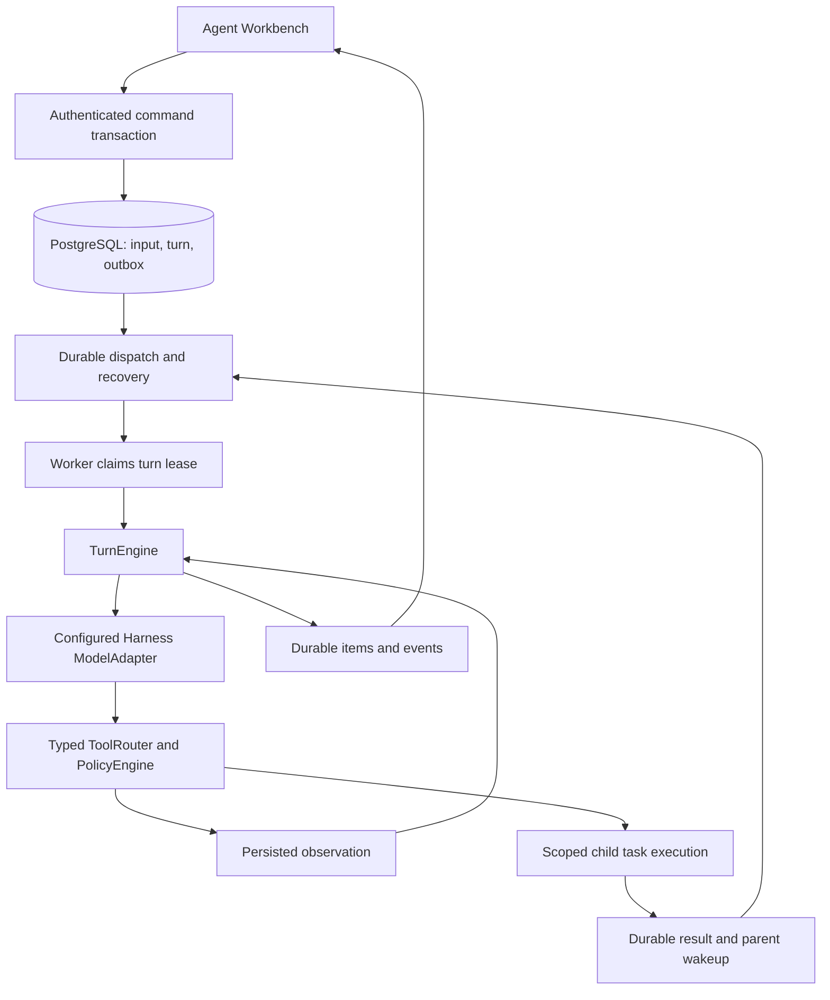

# Canonical Agent execution and supervision

Status: implementation in progress for [#495](https://github.com/YuanshuoDu/applymate-jobcopilot/issues/495).
Baseline: `e484bd5cb1a8982c0c0ba3aa3af1eb4442588438`, inspected on 2026-09-07.

## Product outcome

An accepted conversation message must start a recoverable Agent turn. The Agent can use configured models, call permitted tools, receive observations, and continue within the same turn. The workbench shows the actual execution state and evidence. Acknowledging a command or rendering an event is not proof that its work ran.

This work extends the existing Harness V2. It does not introduce another protocol, replace API-key model configuration, or declare the outstanding staging evidence in [#387](https://github.com/YuanshuoDu/applymate-jobcopilot/issues/387) verified.

## Evidence behind the scope

Independent Luna investigations found these integration gaps on the baseline:

| Existing component | Missing production connection |
| --- | --- |
| Authenticated message command transaction and durable input/events | New interactive turns do not publish the turn dispatch topic consumed by the V2 queue. |
| Turn queue and recovery scanner | Worker startup does not register them. |
| Harness model runtime and typed tool runtime | The canonical agent-run executor uses the deterministic pipeline adapter instead of composing them. |
| AgentTreeManager, task store, subagent queue and recovery helpers | Startup and a production task executor do not compose their complete lifecycle. |
| Coordination tool definitions | Tool execution loses root/task identity, and durable wait is an interface without a production implementation. |
| V2 timeline reducer and task-tree component | The workbench does not mount the execution tree; its stream state is local to the central view. |
| Component and scripted fault tests | They do not instantiate the production startup composition. |

The attachment's recommendation to reuse V2 is sound. The most urgent change is production integration of existing components. A new general DAG scheduler, a new runtime package, and a wholesale provider migration are not prerequisites for repairing this connection.

## Runtime ownership

The model proposes semantic actions. Runtime code owns permissions, state transitions, dependency waits, budgets, cancellation, leases, retry policy, and the final completion decision. Web remains the control plane. Worker owns model/tool loops. PostgreSQL remains authoritative; Upstash Redis/BullMQ provides dispatch and wakeups.

## Integration contracts

1. New root-turn creation and its dispatch outbox entry commit atomically. A duplicate message idempotency key must not produce another turn or dispatch identity.
2. Production startup and integration tests use the same injectable composition. Startup registers consumers before reporting readiness and closes their recovery timers, queues, and runtime resources during shutdown.
3. A canonical runtime factory composes existing context/input claims, the turn store, model runtime, typed tools, and task lineage. Production credentials resolve under the current user's configuration; test injection must not become an unsafe production fallback.
4. Every tool call carries authenticated user/session/turn identity and runtime-owned root/task identity. Model arguments cannot replace these values.
5. An invalid model proposal, unavailable tool, or missing runtime dependency produces an explicit failure/observation. None becomes implicit permission to proceed.
6. The first execution gate is a real model -> scoped read tool -> persisted observation -> model -> final-item loop. Child coordination is accepted only after an actual spawn -> wait -> child completion -> parent-resume fixture passes.
7. The conversation and supervisor consume one shared timeline state and one subscription per selected session. Session switches abort stale work and discard responses/events from the previous session.
8. Supervisor selection links to the matching rendered evidence. Controls are only shown when an actual supported command handler exists. Existing application review remains available during integration.

### Account admission and model usage

The canonical Worker must obtain account admission before each provider call. The trusted internal bridge reuses Web's entitlement source and atomically admits the call against the existing account budget. User, session, turn, step, current lease and resolved provider/model identity bind that admission. Retried admission and settlement use the same operation identity; neither can spend a second credit merely because transport delivery repeats.

The bridge uses a narrow authenticated internal endpoint and existing budget/usage tables. Runtime snapshots and tool arguments cannot choose credentials or bypass admission. Ordinary conversational read tools use the account's AI allowance; application-specific capabilities retain their separate feature and approval checks. Missing admission configuration fails before contacting a provider. A provider fallback must have its own trusted admission and accounting, so the canonical path disables implicit environment fallback.

Settlement records stable status and usage facts. It must not leak raw provider errors or keys. An uncertain provider result remains an uncertain recorded attempt; retrying settlement does not repeat generation. Existing per-turn limits remain additional execution bounds and do not replace account admission.

The existing-schema admission ledger deliberately rejects a repeated reserved admission as in flight. A lost admission response therefore produces an explicit blocker instead of issuing another provider call. It does not infer a refund from missing completion evidence. Repeated settlement must match the stored terminal usage facts; conflicting terminal reports are rejected. The ledger derives credential source from trusted configuration so BYOK and platform usage remain distinguishable.

### Child execution acceptance boundary

Child consumers are enabled only with a real scoped executor. A child executes under its own task lease and inherited policy, rather than concurrently mutating the parent's Turn lease. Task identity, role, attempts, context and result lineage remain durable. Parent wait registration and child-result observation are reconciled against authoritative task state so completion before registration and duplicate completion delivery are both safe.

The first required join runs two independent read tasks, releases parent capacity during the wait, persists both results, and resumes the parent once with those observations. The same fixture must cover a failed child, timeout, interruption, expired ownership and restart. An in-memory notification or a standalone queue factory is insufficient evidence for this boundary.

### Additive persistence correction

The 2026-09-08 repository survey confirms two missing persistence contracts. There is no concrete wait store. Generic tool results above 8,192 bytes become references in a process-local map, with no model-side resolver. The existing recruitment artifact repository is scoped to user/job and resume/cover-letter lifecycle rules; it cannot safely stand in for session/task execution receipts.

The primary therefore extends #495 to prepare two additive V2 models and their migration: private tool-result references and durable wait conditions. This is migration source preparation; applying it to a shared database or production is a separate operation. Existing rows and constraints must remain valid. Neither model is exposed through the public task/timeline DTO.

Tool-result records bind user, session, turn, step, task and tool-call identity to sanitized JSON, a content hash and byte count. Writes require the current root or child execution fence. Reads require the same owner and allowed task lineage. A bounded registered read tool resolves retained references in small chunks, so large observations remain inspectable without expanding the next prompt indefinitely. Session deletion cascades these records. Oversized storage or invalid references fail explicitly.

Wait records bind an immutable set of child targets, mode, deadline and idempotency identity to their parent task and originating step. Waiting, ready, timed-out and cancelled outcomes are persisted. Target validation rejects cross-user/session/root references and cyclic/self dependencies. Resolution and its dispatch outbox entry are transactional and repeatable; a completion arriving before suspension must still be observed. Parent suspension releases its lease only after its step/item evidence is durable. A scanner reconciles persisted task state and deadlines after restart.

### Root and child execution ownership

Current SQL permits turn sources `user`, `automation` and `system`, and allows only one active turn per session. Children therefore stay inside the root Turn and execute under their own Task lease. Creating a synthetic child Turn or borrowing the parent's lease would contradict the existing control boundary.

The next implementation must share the model/tool loop while binding persistence and authorization to an explicit root or child owner. Root adapters retain Turn lease version checks. Child adapters require Task owner, attempt count, expiry, interruption state and valid root state. No structural cast may pretend a child holds the parent Turn lease.

For roots, the current Turn row is the lease authority. Turn heartbeat renews that row; the root Task's copied initial expiry is not a second independently renewed lease. Root settlement must lock and validate the current Turn owner/version/database-time expiry, then validate root Task identity/owner. Child Task expiry remains authoritative for child execution.

Steps carry the actual task ID. Their stored ordinal is allocated atomically within the Turn to satisfy its existing uniqueness constraint during concurrent children. Logical step/item identities include task identity. Events that expose stored order use the allocated ordinal, not a process-local proposal. Child completion stores a child result and child activity; it cannot overwrite the root final response or publish a root completion. Root logical resume accounting and context reconstruction exclude child steps and observations except results deliberately returned through the wait/join boundary. This filtering must not exclude child consumption from the separate authoritative tree/account financial ledger.

The root completion verifier must inspect durable descendant state. A model's terminal proposal cannot complete the root while descendants are still runnable or waiting. Child failure and uncertain external results remain explicit evidence for the final outcome rather than being flattened into success. User cancellation propagates through the tree; process shutdown only releases execution ownership for recovery.

### Durable wait handoff

Wait registration does not release execution ownership inside a tool callback. The current owner first persists the tool receipt, timeline items and completed step. A separate fenced suspension transaction then records `suspendedAt` and releases the parent. This keeps later evidence writes from running under an already-released lease.

Resolution and delivery are separate dimensions. The wait outcome is `waiting`, `ready`, `timed_out`, `interrupted` or `closed`; `suspendedAt` and `consumedAt` track the handoff. A resolver can record a result before suspension, but it must not change the running parent's lease or dispatch that parent. At suspension, an already-resolved wait queues its parent and writes the dispatch outbox in the same transaction. A still-waiting parent moves to the dependency-wait state. Later resolution queues only a suspended, unconsumed parent. A restart scanner applies the same transaction rules.

The queue driver must recognize a durable handoff receipt and skip its ordinary lease-release update. It cannot overwrite a parent already queued by wait resolution. A resumed owner consumes the stored result once, under its new lease, before its next model step. Duplicate notifications and a crash on either side of suspension therefore have an authoritative recovery path.

Child model admission uses the child's task owner and attempt fence, including while its root Turn is waiting. It never borrows the root Turn lease. Root supervision may read retained results from prior turns in the same user's session; a child can read its own and descendant results only within its current turn and task tree. An explicit message or join supplies any additional shared result.

A root queued for resume is still nonterminal. With an `any` wait, other children can remain active while the resolved parent is queued. Their current task leases remain valid across that transition; neither result storage nor model admission may require the root to be exclusively `in_progress`. Root cancellation and terminal closure still fence them out.

Native interrupt semantics distinguish a target subtree from a session-wide stop. Interrupting one child must not silently interrupt the root and unrelated siblings. The existing whole-tree interrupt helper must remain reserved for an explicit root/session cancellation until scoped child interruption has been implemented and verified.

## Recovery and safety invariants

- Queue delivery may repeat; lease/state checks decide whether execution may proceed.
- A late worker cannot commit a result after losing ownership of its turn or task.
- A waiting parent releases execution capacity. Wait registration checks existing child state so a completion arriving just before the wait cannot be lost.
- Child terminal events, deadline expiry, steering, and cancellation must resolve persisted wait conditions without starting duplicate parent executions.
- Children inherit only the parent's allowed context, tools, and budget. They cannot escalate permission by supplying a different task or user ID.
- Model/provider failures never authorize an external action. Existing approval, reservation, hash, and receipt checks remain authoritative.
- Non-repeatable third-party writes are not generally exactly-once. An uncertain result requires reconciliation; it is never automatically retried or reported as cancelled/completed without evidence.
- Plaintext API keys must not enter browser bundles, task context, event payloads, transcripts, or logs.

## Verification gates

| Gate | Required evidence |
| --- | --- |
| Atomic acceptance | New command/outbox transaction, duplicate command, rollback. |
| Production registration | Same bootstrap as startup registers turn dispatch/recovery and implemented child consumers; clean shutdown. |
| Conversational execution | Real TurnEngine and ToolRouter with an injected deterministic provider; persisted result feeds the next model step. |
| Identity and cancellation | Cross-user/session denial, immutable task lineage, interrupt/lease-loss behavior. |
| Recovery | Duplicate dispatch, abandoned lease reclaim, completed work not replayed. |
| Child coordination | Two bounded children, durable wait, terminal result delivery, parent resumption, duplicate wakeup suppression. |
| Workbench | Shared subscription, restore/error states, task selection, responsive rendering, English/Chinese consistency. |
| Delivery | Focused tests, affected package typechecks/builds, reviewed diff, scoped commit/push and one PR. |

Automated fixtures must not make live model calls or employer submissions. Browser fixture checks are UI evidence, not authenticated staging or production verification. The final PR records which gates actually passed and any remaining implementation or deployment boundary.

### Integration checkpoint, 2026-09-08

Luna verification of the current canonical runtime and admission bridge passed:

- Core runtime/state/root-store/model tests: 4 files, 19 tests.
- Worker admission, queue, recovery and shutdown tests: 8 files, 42 tests.
- Web usage broker and internal route tests: 2 files, 7 tests.
- Worker TypeScript and its shared-package build; direct Web `tsc --noEmit`.

An earlier Web typecheck encountered a Windows `EPERM` Prisma engine-file rename lock. The later managed browser run completed the Web production build, including generation, and direct Web TypeScript passed. This does not verify a database connection or migration application.

These are local automated results. Real database/RLS execution, actual process restart and child execution/wait composition are not yet accepted. The supervisor fixture has since passed the browser checks below. Large lifecycle outputs still use process-local result references and require durable storage before long-session acceptance. No provider call, employer submission, database migration, staging gate or production deployment is claimed by this checkpoint.

## Follow-up sequence

The owner's detailed next-upgrade plan is in [agent-brain-upgrade-plan.md](./agent-brain-upgrade-plan.md). It sequences execution ownership, real child execution and durable waits before dynamic planning, then covers domain tools, long-session context, supervision and acceptance. This supplements the existing roadmap without marking missing capabilities complete.

### Review checkpoint and execution budget, 2026-09-08

The next checkpoint contains candidate supervisor UI, owner-neutral loop extraction and additive private-result/wait schema source. It remains a draft, not an accepted implementation of child execution or durable joins.

- Luna reported 52 passing tests across 11 Worker files and a passing Worker typecheck for the extraction/startup candidate. The existing startup security test caught static queue imports; those imports now occur after listener validation. The reviewed extraction test now inspects the actual second model request and its tool-result observation. The private-result contract test now executes the read tool and validates its output schema. Those two files passed all three focused tests.
- Luna reported 15 passing storage tests and Prisma validation. The pushed `d710a9d` checkpoint subsequently passed CI Tests, TypeScript, Build, Lockfile and Harness contract checks. Private storage is still not bound to production execution, and there is no real PostgreSQL/RLS or migration-application evidence.
- Luna reported 26 passing UI/DTO tests. The final supervisor browser run passed all four projects: desktop/mobile in English/Chinese. It used the actual workbench with mocked APIs under a managed production build. Root reviewed desktop/mobile screenshots. Preview access and middleware tests passed 22/22; Web TypeScript passed. The browser URL render fallback was removed, and the fixture uses server-provided mode selection. These overlapping checks are not a unique-test total or authenticated staging evidence.

The next pushed checkpoint `2f8c9ce` exposed a test-only TypeScript regression: the strengthened loop fixture passed `unknown` into a JSON context block. Luna narrowed the deterministic fixture payload in `7ca7d2b`; the focused loop tests passed 2/2 and the CI-equivalent `pnpm turbo build --filter=@jobcopilot/worker` passed all five tasks. Astra reviewed the one-line repair. Full CI on the repaired head remains pending; earlier CI success must not be described as repaired-head verification.

The owner requested lower usage. Subsequent work uses at most one active Luna worker, bounded tasks, reused evidence and focused checks. Astra retains design and final review. Avoid repeating broad matrices or repository surveys without a new failure or relevant change. The full goal remains active and incomplete.

### Ownership persistence candidate, 2026-09-09

Work package 1A now carries `ExecutionOwnerFence` through root construction, event/lifecycle adapters and PostgreSQL Step/Item/Event writes. Both canonical and compatibility root callers obtain an actual root Task; Turn IDs are no longer synthetic Task IDs. Child owners use the captured Task attempt, database-time lease validity and nonterminal root checks. Claim/heartbeat/finish preserve that attempt, and the release timestamp parameter mismatch is repaired.

Step allocation locks the Turn and returns its stored global ordinal for the event stream. Owner locks also precede Step/Item updates, and Step/Item lineage is validated before mutation or idempotent fallback. Root history retains legacy null-task rows while excluding child-private rows; root logical resume counts remain distinct from global ordinal and future tree/account budget accounting. The existing account admission ledger is unchanged by this patch. Root-only final writes and same-lease waiting-for-user settlement remain explicit boundaries.

Astra's review required repairs for SQL parameter gaps, missing aliases, event type/actor ordering, stale-attempt fallback, missing owner locks and old-attempt item linkage. Luna implemented the repairs and reported:

- SQL/state group: 5 files, 26 tests passed; runtime/caller group: 6 files, 29 tests passed.
- After the final owner-lock/lineage repair: 2 focused files, 8 tests passed, and `pnpm turbo build --filter=@jobcopilot/worker` passed all 5 tasks. These results overlap the earlier groups.
- Worker TypeScript passed before the final focused repair; the final Worker build also compiled the repaired source/tests. `git diff --check` passed.
- The final source-size cleanup leaves `subagents/pg-store.ts` at 250 lines and changes no behavior.

This is a reviewed candidate, not completion of P1 or the full goal. SQL tests currently use structural/mocked checks. Docker is installed but its daemon was unavailable, and no disposable PostgreSQL facility was found during this pass. Real prepared-statement, concurrent transaction and RLS verification remain open, as do private-result lifecycle binding, the production child executor, child admission and durable waits. No migration, real provider call or employer submission occurred. Full CI on this candidate must be checked after push.

A follow-up review found that the copied root Task expiry could incorrectly reject a long-running root after its Turn heartbeat renewed the actual lease. Luna repaired root settlement to use the current locked Turn lease as authority without weakening child fences. The root-task-store suite passed 8 tests and the Worker build passed all 5 tasks. These are still structural/mocked tests pending the isolated PostgreSQL gate.

### Development priority

Owner steering on 2026-09-09: prioritize implementation. Use only a small relevant test or compile check per slice; defer the real PostgreSQL/RLS, concurrency, restart and broad end-to-end matrix to final integration. The unavailable local Docker backend is recorded as a verification limitation, not a blocker for private-result binding, child execution, durable coordination or planning. Keep implemented, quick-checked and fully accepted status distinct.

### Private tool results candidate, 2026-09-09

Work package 1B binds the existing private result repository to oversized completed tool output and registers `tool_results.read` in the real Worker registry. The canonical root runtime supplies its actual owner after root Task creation. Results retain the true Step/tool-call identity, canonical UTF-8 size/hash, a 1 MiB limit and scoped bounded reads. Input/progress/thrown-failure lifecycle events retain sanitized inline values or explicit truncation metadata; they cannot overwrite the final result or create process-local references.

The initial focused canonical runtime/redaction/lifecycle/registry group passed 14 tests, and Worker TypeScript passed. Astra review identified the router's structured thrown-error output bypass; Luna repaired it so the same sanitized failure value reaches lifecycle and model while preserving small structured output shape. The router group passed 9 tests and the subsequent Worker compile passed. Astra reviewed that repair. Real PostgreSQL/RLS, migration application, fresh-process readback and full child composition remain in the final verification ledger. No model provider or external application call was made.

The first 1C admission slice now carries a discriminated root/child owner envelope across the Worker bridge and internal Web usage broker. Root admission accepts the canonical root Task-owned Step (and the explicit legacy null-task compatibility arm); child admission requires a real non-root Task, matching attempt, live lease, same session/user/turn/root and a nonterminal un-interrupted tree. A root Turn fence cannot authorize a child Step, and mixed owner fields are rejected at parsing and normalization boundaries. Web admission tests (13), Worker bridge tests (5) and the shared-package build passed. This slice deliberately does not enable child consumption: there is still no durable tree-budget reservation and no production child executor.

### Tree budget reservation candidate, 2026-09-09

Work package 1C-B adds a durable `agent_tree_budget_reservations` ledger. One reservation represents one model step and is keyed by the root/task/step/attempt lineage plus a session-scoped idempotency key. Reserve locks the root task, validates the current task-owned streaming step and live task lease, and counts `reserved` plus `consumed` units against the inherited root `limits.maxSteps` snapshot. Settlement is an explicit idempotent transition to `consumed` or `released`; a released identity cannot be reopened.

The migration includes composite lineage foreign keys, identity/status/unit checks, indexes and the same transaction-local `app.user_id` RLS policy used by the other agent ledgers. The Worker focused tree-budget suite passed 7/7, Worker TypeScript compiled, the shared package built and Prisma schema validation passed. This is a source and contract candidate only: no migration was applied and no physical PostgreSQL/RLS or concurrent transaction evidence exists. Token/cost limits, crash recovery for abandoned reservations and integration with account admission remain deliberately deferred.

The store is a caller-fenced primitive. It does not identify a worker owner itself; the future child executor must first obtain and retain the current task attempt lease, pass the same lineage, and settle the reservation through the owner-aware model admission path. Root and child execution remain disabled until that composition is reviewed.

### Child execution composition candidate, 2026-09-09

Work package 1C-C1 composes a real child executor without registering it in the production queue yet. It loads the leased task's goal, contract, context, expected output, inherited model route, tool policy and budget policy; creates a task-kind `ExecutionOwnerFence` with the current attempt; and reuses the canonical model → tool → observation loop against an owner-neutral Step/Item/Event store. Child step and event IDs include the attempt so a new lease attempt cannot collide with an earlier attempt while a repeated execution in the same attempt remains idempotent.

The executor only publishes the intersection of persisted `allowedActions`, role policy and runtime definitions. Coordination tools and external writes are hidden from the child model, and the router still enforces tenant scope, capabilities and policy if a model hallucinates an unavailable tool. Child events are attributed to `subagent`; root events remain `orchestrator`. Parent model route metadata and allowed actions are inherited server-side, credential-like fields are rejected at persistence boundaries, and a child cannot copy the parent's budget snapshot into an independent allowance.

Each child model step uses the child owner envelope for account admission and one shared tree reservation. Admission denial releases the reservation. When the provider was attempted but account or tree settlement is unknown, the reservation stays active so a retry cannot obtain a free second call; a confirmed provider result with successful settlement consumes it. Parent-supplied task contract text is marked `external_untrusted` in child context; only the harness instruction is system-trusted. The C1 focused suite passed 31 tests across 6 files, Worker TypeScript passed, the shared package built, and the diff was clean. This is still a composition candidate: production bootstrap/queue registration, durable wait, child context claims/rebuild, token/cost tree limits, PostgreSQL/RLS/concurrency/restart evidence remain open.

### Gated production child runtime candidate, 2026-09-09

Work package 1C-C2 wires the reviewed child executor into the Worker production bootstrap only when `ENABLE_AGENT_CHILD_EXECUTION=1`. The default startup dynamically loads the module but returns before constructing a child queue, PostgreSQL tree-budget store or child usage path, so an unapplied additive migration cannot break the existing Worker path. The enabled seam creates the PG turn store and tree-budget store, adapts owner-based persistence explicitly to the child loop, and keeps the raw store for the durable lifecycle sink; child-only execution omits root final-response and user-wait methods.

The production child registry starts with the existing read tools and the bounded private `tool_results.read` reader. Coordination management tools and external writes remain hidden; the ToolRouter and PolicyEngine still enforce tenant scope, capabilities and policy if a model names an unavailable or denied tool. The actual leased task and `ExecutionOwnerFence` flow through the runtime, including the current attempt. The C2 focused suite passed 17 tests across 4 files, Worker TypeScript passed, the shared package built, and the diff was clean. This is a gated composition candidate only: the feature flag remains off, no queue or migration was applied, and durable wait/parent resumption plus real PostgreSQL, restart and concurrent-worker evidence remain open.

### Durable wait registration and loop handoff candidates, 2026-09-09

Work package 2A-C3-A adds a Worker PostgreSQL `DurableWaitPort` over the prepared `AgentWaitCondition` table. Registration validates the authenticated parent, immutable task lineage, bounded target set, mode, deadline and idempotency key in a tenant-scoped transaction. Resolution locks one waiting condition, rechecks authoritative child task states and deadline, and transitions it to `ready` or `timed_out`; cancellation is scoped to the same user/session tree. Replays return the original receipt and conflicting payloads fail closed. This slice does not yet release a lease, suspend a parent, enqueue a wakeup, or consume an outcome. Its focused suite passed 8 tests; Worker TypeScript, shared build and diff checks passed. No migration was applied and no live PostgreSQL evidence exists.

Work package 2A-C3-B1 connects a valid `waiting` wait receipt to the owner-neutral TurnEngine loop. The tool result, item and lifecycle event are persisted before the step is marked `waiting_for_tool`; the loop returns `waiting_for_dependency` with the durable wait ID and does not call another model step. `ready`, `timed_out`, malformed and unrelated tool outputs remain ordinary observations. The focused loop/store/child suite passed 16 tests and Worker TypeScript passed. Atomic parent suspension, wakeoutbox delivery and resumed outcome consumption remain the next boundary.

Work package 2A-C3-B2 adds the atomic parent handoff. The queue driver recognizes `waiting_for_dependency` plus a wait ID and calls a fenced handoff before any ordinary lease release. The transaction locks the Turn and wait condition, checks the current user/session/root/step and live owner/version/expiry, then either records `suspendedAt` and releases the Turn as `waiting_for_dependency`, or handles an early `ready`/`timed_out` result by queuing the Turn and resetting the idempotent `agent.turn.dispatch` outbox row. Repeated suspended or queued delivery is idempotent. The canonical bootstrap and agent-run caller now pass this handoff seam. Focused handoff, queue, wait-store, loop and bootstrap checks passed 31 tests; Worker TypeScript and diff checks passed. The resolver, wakeup scanner and resumed outcome consumption are still unimplemented.

Work package 2A-C3-C adds the durable resolver. A bounded scanner first locks active root Turns, then sets the matching tenant context before locking wait rows, preserving the B2 Turn→wait order under `FOR UPDATE SKIP LOCKED`. It rechecks parent/step/target lineage and deadline, resolves early terminal matches or timeouts, and wakes only a suspended, unconsumed parent in `waiting_for_dependency`; the wake changes the Turn to `queued` and upserts the existing idempotent dispatch outbox row. Unsuspended parents are only marked ready, and queued/in-progress/terminal/consumed or foreign rows are ignored. Production startup constructs the scanner only when `ENABLE_AGENT_WAIT_RESOLVER=1` and the child executor gate is enabled; resolver shutdown precedes Turn shutdown. C3-C focused resolver/bootstrap/store/queue checks passed 27 tests; Worker TypeScript and diff checks passed. Result materialization/one-time consumption and live restart evidence remain open.

Work package 2A-C3-D adds resumed outcome consumption. After a new root lease is locked, the canonical state loader selects only the same user/session/Turn/root's suspended `ready` or `timed_out` waits, validates the waiting step and child lineage, and atomically stores a bounded, redacted `result.outcome` with `consumedAt`. The original `result.request` is retained. The next model context receives one stable `wait-result:<waitId>` observation using the native `wait_subagents` input shape; a later recovery replays that stored outcome without writing a second receipt. The consumer is explicitly disabled by default and is enabled only with the same `ENABLE_AGENT_CHILD_EXECUTION=1` plus `ENABLE_AGENT_WAIT_RESOLVER=1` gate as the resolver, so an unapplied wait migration cannot affect the legacy Worker path. A ready-race handoff records `suspendedAt` before requeueing so the new lease can consume the outcome. C3-D focused consumer/state/handoff checks passed 17 tests; the combined relevant Worker checks passed 41 tests, Worker TypeScript and diff checks passed. Real PostgreSQL/RLS, outbox delivery, restart and cross-process evidence remain open.

### Native coordination wiring and policy candidates, 2026-09-09

Work package 2B-1 wires the six existing coordination tools into the canonical root runtime only when the completed child executor and wait resolver gates are both enabled. The server derives `canManageChildren` for that gate; a user-supplied capability list cannot enable it. With the gate off, the registry and model request hide `spawn_subagent`, `send_message`, `wait_subagents`, `list_subagents`, `interrupt_subagent` and `close_subagent`. With the gate on, the same six definitions are passed to the model and router with the existing scoped manager, coordination store and durable wait port. Child runtimes remain read-only and do not inherit root coordination tools. The focused canonical runtime/tool registry suite passed 11 tests; Worker TypeScript and diff checks passed. This is wiring evidence only: it does not prove a live child execution or parent resume.

Work package 2B-2 adds a canonical root policy adapter for the same server gate. When a turn has no explicit `PolicySnapshot` (including legacy `role`/`capabilities` metadata), the gated runtime supplies a deterministic `policy.v1` fallback that allows only the six coordination tools for an `orchestrator` with `canManageChildren`, plus the safe read baseline. Non-coordination writes remain denied. An explicit valid snapshot remains authoritative; an explicit but malformed `version`/`rules` payload fails closed instead of silently receiving the fallback. The gate-off path retains the default read-only policy. The focused canonical policy/runtime/tool suite passed 17 tests; Worker TypeScript and diff checks passed. No Web policy snapshot migration, database migration, live PostgreSQL/RLS, provider, queue or restart proof is claimed.

Work package P3-1 adds pure `GoalContract`, `PlanProposal`, deterministic validation and runtime intent conversion. Goal and plan payloads are bounded plain JSON; identity, lease, capability, hard-budget and external-write fields are rejected. Plan validation performs schema and revision CAS checks, allowlist checks, unique IDs, dependency existence/self/cycle checks and repeated semantic delegate rejection. The returned proposal is normalized before any future dispatcher can consume it. Its focused suite passed 15 tests; no canonical loop or persistence wiring is claimed.

Work package P3-2 connects a server-gated `agent.plan.propose` tool to the canonical root registry and model request. The tool accepts only a strict `{ proposal }` envelope, validates against the server-owned goal and read-only tool/role allowlists, increments an in-process plan revision only after acceptance, and returns bounded semantic intents without creating task IDs, leases, user identity, idempotency keys or hard budget limits. The planning gate derives `canPlan`; forged snapshot capabilities cannot enable it, and explicit policy snapshots remain authoritative. Its planning/policy/registry/runtime suite passed 38 tests including the P3-1 tests; the feature remains off by default. This is plan-only wiring: intent execution, durable plan revisions, child scheduling and restart recovery remain open.

Work package P3-3 (`81ae0df9`) adds a pure accepted-plan intent dispatcher. It revalidates the server-normalized proposal, emits a stable dependency-first command order, and asks the runtime boundary to supply tool versions, call identities, idempotency keys, input-reference values and role-scoped delegate actions. Tool calls and `spawn_subagent@1` commands preserve objective, dependency, success and output-schema references while omitting model-owned tenant, task, lease and hard-budget fields. `request_input` and `propose_completion` are explicit control barriers that stop later commands from being materialized. The focused dispatcher suite passed 4 tests; Worker TypeScript and diff checks passed. This remains a materialization seam: it does not execute a router, create a child, persist a plan revision or claim child → wait → resume evidence.

Work package P3-4 (`2471c8cd`) adds a bounded runtime execution adapter for those commands. It requires a server-owned `ToolRouterContext` callback for every executable command, sends tool and delegate requests through the existing router, checks returned identity/version/status/error fields, and stops on failed or cancelled results. Control barriers return a visible blocked result without invoking the router; malformed commands, absent runtime ports, non-JSON results and results over 8 KiB fail closed. The adapter preserves plan dependencies separately from runtime task lineage and creates no task, lease, user or budget fields. Its focused suite passed 5 tests; Worker TypeScript and diff checks passed. Canonical-loop wiring, durable plan revisions, queue delivery and real child → wait → resume evidence remain open.

Work package P3-5 (`419a928f`) adds an owner-neutral loop hook for plan execution. A caller may provide a server-owned `executePlan` callback; only a non-replayed, completed `agent.plan.propose` result invokes it. The loop keeps the normal proposal tool observation, appends at most eight bounded JSON plan observations for the next model step, and maps explicit approval/user/dependency waits to existing TurnEngine wait states. Duplicate observation IDs, oversized/non-JSON content, malformed waits and hook exceptions fail closed. No hook preserves legacy behavior, and replayed proposals never repeat the hook. The focused loop suite passed 13 tests; Worker TypeScript and diff checks passed. `TurnEngineOptions`/canonical runtime wiring, durable observation persistence and real plan execution remain open.

Work package P3-6a (`77a42427`) exposes the same hook through `TurnEngineOptions` and a canonical runtime factory. `planningExecutionEnabled` is an independent server gate: the factory is called only when both planning gates are true, and an absent factory leaves the legacy path unchanged. The shared hook contract carries the fenced runtime identity and current snapshot; it is not reconstructed from model input. TurnEngine and canonical runtime gate tests passed 20 tests; Worker TypeScript and diff checks passed. No default dispatcher, database, queue, provider or child execution was enabled at that checkpoint; P3-6b supplies the next server-owned bridge.

Work package P3-6b (`c7ee291a`) adds the default server-owned canonical plan bridge. When both planning gates are enabled, canonical runtime selects a caller-owned factory override or `createCanonicalPlanExecutionFactory`; the default bridge revalidates the accepted envelope and revision CAS, resolves read-tool versions and role-scoped delegate actions from the server registry, generates call/idempotency metadata and `ToolRouterContext` from server-owned scope/task/lease values, then reuses the P3-3 dispatcher and P3-4 adapter. It returns bounded command and failure observations to the next model step, maps explicit tool waits to dependency waits, maps `request_input` to `waiting_for_user`, and exposes completion only as feedback; it never auto-completes a Turn. `approvalBoundary` remains explanatory input metadata; actual approval waits still come from the ToolRouter policy boundary. Non-empty input references fail closed until a runtime-owned observation resolver exists, so the bridge does not guess schemas. Bridge and canonical runtime checks passed 13 tests in the worker report (the parent rerun covered 38 tests across bridge, canonical runtime, TurnEngine and loop); Worker TypeScript and diff checks passed. This is execution wiring only: plan revisions and command outcomes are still process-local/loop observations, with no database, queue, provider or real child-to-parent recovery proof.

Work package P3-7 (`591c7d2f`) adds runtime-owned plan input hydration and bounded durable plan observations. `inputRefs` resolve only exact IDs already present in the server-supplied snapshot; each reference uses its `output` field when present, otherwise the observation content, and requires a finite plain-JSON object. Multiple references merge deterministically by key; missing, non-object, conflicting or same-plan local references fail closed. Loop observations remain bounded to eight entries, 256-character IDs and 8 KiB UTF-8 content, and each validated observation is appended as a `plan.observation` event with stable correlation/idempotency metadata. Canonical restore reads those events only inside the tenant transaction for the owned session/turn and root-task/null-task scope, validates the same bounds and deduplicates against snapshot and tool observations. A persistence error fails the Turn explicitly rather than continuing as success.

The P3-7 focused Worker checks passed **27/27** across the bridge, loop and canonical-state suites; the agent-protocol event check passed **2/2**, the agent-protocol build and Worker TypeScript passed, and `git diff --check` passed. This is a submitted candidate, not full P3 or phase completion: no PostgreSQL/RLS, provider, queue, migration, restart or real child-to-parent recovery was run. Its individual-append crash boundary is addressed by the P3-8 atomic batch candidate below. Durable plan revisions, outbox delivery and recovery remain open.

Work package P3-8 (`4f91a631`) adds atomic batch persistence for plan observations. The optional `appendEvents(batch)` seam now flows through the TurnEngine store contract, root TurnEngine adapter and production child adapter; the owner-neutral loop sends a hook's complete `plan.observation` set through that seam while ordinary events retain the singleton path. The PostgreSQL store holds the tenant transaction and owner-fenced Turn lock for the whole batch, validates every existing idempotency row, preserves item/task/attempt lineage, allocates session event sequence values, and writes each event with its outbox record. Mixed new/replayed batches use the effective causation chain and repair a missing outbox without duplication; a new outbox conflict or any later insert failure rolls back the entire batch. Subscriber notification occurs only after the store promise has committed.

The P3-8 focused Worker checks passed **40/40** across the store, event-writer, loop and TurnEngine suites; Worker TypeScript, the shared package build and `git diff --check` passed. This remains a development candidate: no real PostgreSQL/RLS transaction, migration application, provider, queue delivery, restart or end-to-end child-to-parent recovery was run. Durable plan revisions, durable command outcomes, outbox/queue recovery and replay/restart proof remain open.

## P3-9 update

Commit `fd6f5211` adds durable plan revision receipts and restore. The agent protocol now recognizes the bounded `plan.revision` event; its payload contains only server-safe `planCallId`, `goalRevision`, `planRevision` and `basedOnPlanRevision` metadata. A strict receipt helper accepts only plain JSON, bounded IDs, positive/non-negative revisions and the required `basedOnPlanRevision` relationship.

The owner-neutral loop appends one receipt only for a non-replayed, completed and accepted `agent.plan.propose` result. Rejected, malformed or replayed proposals do not advance the revision. The canonical state loader reads scoped tenant/session/turn/root-task or null-task events, restores the latest continuous valid revision, deduplicates a compact revision observation for the resumed model, and falls back to a safely parsed accepted legacy `tool_call.completed` receipt. The proposal tool, canonical bridge and runtime now continue CAS from the server-supplied `initialPlanRevision`.

Evidence: Worker focused checks passed **49/49** across 6 files; the agent-protocol event suite passed **2/2**; the agent-protocol build, shared package build, Worker TypeScript and `git diff --check` passed. This is a durable revision candidate only: no real PostgreSQL/RLS, migration, provider, queue delivery, process restart or child-parent E2E was run. Command outcomes, outbox/queue recovery and full restart proof remain follow-up work; the phase-count metric remains 1/8 (12.5%).

## P3-10 update

Commit `ac2c8ed` adds bounded `plan.command` receipts for canonical plan execution. Each completed or failed executable command, plus each request-input or completion control barrier, is observed and persisted before the bridge continues or returns. The receipt contains only `planCallId`, `planRevision`, `observationId` and bounded plain-JSON `content`; the owner-scoped canonical runtime writes it through the existing fenced `appendEvent` path with deterministic event and idempotency keys.

Canonical state reads `plan.command` events within the tenant/session/turn/root-task or null-task scope, validates the receipt bounds, restores the same observation IDs and deduplicates them against `plan.observation` and snapshot observations. Sink failures remain visible and do not turn an uncertain command into a silent success. This candidate does not prove real PostgreSQL/RLS, migration, provider, queue, process restart or child-parent E2E behavior; actual side effects and durable delivery still require integration evidence.

Evidence: Worker focused checks passed **54/54**; the agent-protocol event suite passed **2/2**; the agent-protocol build, shared package build, Worker TypeScript and `git diff --check` passed. The overall phase-count metric remains 1/8 (12.5%).

## P3-11 update

Commit `11922aa` adds a server-owned bounded replan budget. The planning contract defines `PLAN_MAX_REVISIONS=8`; the proposal tool and canonical bridge accept a recovered `initialPlanRevision` equal to that bound, but reject the next proposal or forged accepted output with the visible `plan_revision_limit` error. Values above the bound and invalid server options fail closed. The canonical runtime supplies the bound from its server-owned planning configuration; policy snapshots and model input cannot raise it.

Evidence: Worker focused checks passed **62/62** across 8 files; the agent-protocol event suite passed **2/2**; the agent-protocol build, shared package build, Worker TypeScript and `git diff --check` passed. This is a bounded replan candidate only: no provider, task, queue, database or migration behavior changed, and no real PostgreSQL/RLS, provider, queue delivery, process restart or child-parent E2E was run. Durable command outcomes, outbox/queue recovery and full integration evidence remain follow-up work; the phase-count metric remains 1/8 (12.5%).

## P3-12 update

Commit `33d4bcdd` adds a server-computed semantic plan fingerprint in the fixed `sha256:<64 lowercase hex>` format. The fingerprint ignores `basedOnPlanRevision` while retaining `basedOnGoalRevision` and all other normalized plan semantics. The proposal tool and canonical runtime independently compute and validate `proposalHash`; an equivalent plan with a different model call ID returns `plan_no_progress` before any router call or revision advance. Durable canonical state restores a bounded, deduplicated hash set within the tenant/session/turn/root-task scope, while legacy receipts without a hash remain readable for compatibility.

Evidence: root's independent review reports **9 files / 69 tests passed**; the agent-protocol event suite passed **2/2**; agent-protocol build, shared package build, Worker TypeScript and `git diff --check` passed. No database, provider, queue or schema behavior changed. Real PostgreSQL/RLS, migration, provider, queue delivery, process restart and child-parent E2E remain unverified; the overall phase metric remains **1/8 (12.5%)**.

## P3-13 update

Commit `46a19c38` adds runtime hydration for the canonical structured GoalContract. The owner-fenced canonical state loader reads turn.input and keeps the legacy goal text; old `{goal}` input receives revision 1, empty semantic arrays and the server-owned `runtime:turn` budget reference. Structured contracts pass `normalizeGoalContract`, must match the canonical objective, are restricted to revision 1, and must use the server-owned `runtime:turn` budget reference; malformed fields fail closed rather than falling back to text.

The planner now receives constraints, successCriteria, knownFacts, unresolvedQuestions and approvalBoundaries from the hydrated contract. Hard budget remains server-owned by budgetSnapshot. Evidence: Astra independently reran **3 files / 29 tests**, Worker TypeScript, shared package build and `git diff --check`. No database, provider, queue, migration or Web behavior changed. A goal-update event and revisions beyond 1 are not implemented; real PostgreSQL/RLS, provider, queue delivery, process restart and child-parent E2E remain unverified. The phase metric remains **1/8 (12.5%)**.

## P3-14 update

Commit `f5638ff6` adds the server-owned `agent.goal.update` candidate; repair commit `48901262` closes the replay durability gap. The tool accepts only the bounded semantic `changes` patch, merges against the current GoalContract, advances by contiguous CAS, forces `budgetRef=runtime:turn`, enforces `MAX_GOAL_REVISIONS=8`, and preserves visible `goal_revision_limit`. Accepted receipts are bounded `goal.revision` events; canonical restore accepts only the continuous sequence and filters old plan revisions/hashes.

Replay verifies the persisted tool name/input as before. When an accepted goal-update result exists without its matching goal-revision projection, the loop parses the persisted receipt, appends the deterministic idempotent `goal.revision`, and updates the bounded snapshot; an existing projection is not duplicated. A server-owned per-Turn `GoalContractRef` is shared by goal update, plan proposal, canonical bridge and final verification/finalization; goal changes reset old plan revision/hash state so a same-Turn replan uses the current goal.

Astra independently verified **10 files / 86 focused tests** and **5 files / 53 regression tests**; the agent-protocol event check passed **2/2**; Worker TypeScript, shared/protocol builds and `git diff --check` passed. No live DB/PostgreSQL/RLS, Redis, provider, queue, process restart or cross-process recovery was run. The phase metric remains **1/8 (12.5%)**.

## P3-15 update

Commit `70a9809b` adds a server-owned planning action capability gate. `allowedPlanActions` is optional for compatibility with existing callers and defaults to the four existing plan actions; malformed server configuration fails closed, and model or policy snapshots cannot expand the list. Canonical runtime derives the list from the coordination gate: when coordination is off, `delegate` is excluded and only `use_tool`, `request_input` and `propose_completion` remain available.

The proposal tool applies the server-owned action allowlist in its validation context. The canonical bridge revalidates the accepted proposal with the same allowlist immediately before dispatch/router execution, so a forged `delegate` cannot cross the bridge when coordination is disabled. Gate-off rejection, gate-on acceptance, forged-delegate revalidation and legacy default behavior are covered. Astra independently verified the gate-focused suite at **3 files / 38 tests** and the contract regression suite at **4 files / 22 tests**; Worker TypeScript, shared package build and `git diff --check` passed. No Web, schema, provider, database or lockfile behavior changed; the phase metric remains **1/8 (12.5%)**.

No live PostgreSQL/RLS, Redis, provider, queue delivery, process restart, cross-process recovery or real child-to-parent execution was run. Those boundaries remain reserved for final integration evidence.

## P3-16 update

Commits `b5f74308`, `6a5e5c15`, `74199b3e` and `af484cb4` add the replay recovery candidate for accepted plan receipts. Each Turn owns a server-side recovery dispatcher that distributes parsed receipt metadata to the proposal tool and canonical plan bridge. Recovery enforces contiguous `basedOnPlanRevision` CAS, the server-owned `maxPlanRevisions` bound and the current goal revision. Out-of-bound or conflicting receipts fail closed with `PlanRevisionRecoveryError` (`invalid_output`) before local revision state can advance.

Replay now parses and checks the goal, performs recovery, and only then appends a missing `plan.revision` projection. An existing projection is left untouched, making repair idempotent. Accepted replayed proposals do not rerun the plan hook, and persisted failed or cancelled plan results continue without rerunning it. Astra independently verified the focused set at **4 files / 65 tests** and the regression set at **5 files / 46 tests**; Worker TypeScript, the shared package build and `git diff --check` passed.

No live PostgreSQL/RLS, Redis/queue, provider, process restart or cross-process child-to-parent evidence was collected. Overall completion remains **1/8 (12.5%)**.

## P3-17 update

The Worker production entry now passes server-owned planning gates into `createCanonicalTurnRuntime`. `ENABLE_AGENT_PLANNING=1` enables canonical planning, while `ENABLE_AGENT_PLAN_EXECUTION=1` can enable execution only when planning is already enabled. Undefined, `0`, and non-exact `1` values remain disabled; model input, policy snapshots, coordination, child execution and wait input cannot turn these gates on. No planning semantics, provider, dependency or migration changed.

The new pure resolver has sibling tests for the default, planning-only, dual-enabled and execution-only cases; the focused test passes **3/3**. This slice has no live production startup, PostgreSQL/RLS, Redis/queue, process restart or cross-process evidence; overall completion remains **1/8 (12.5%)**.

## P3-18 update

The canonical plan executor now defers `inputRefs` until each command is routed. The default materializer remains compatible, while deferred commands fail closed when no resolver is available. Each execution keeps a bounded local output map: only completed plain JSON object results no larger than 8 KiB can feed later nodes. Delegate references are passed through server-owned `context`, so runtime identity, lease, permission and idempotency fields cannot be overwritten. Missing, conflicting, non-object, oversized or identity-bearing references fail before the router is called.

The canonical bridge merges prior local output with exact snapshot observation IDs, preserving conflict rejection, topological ordering, control barriers, existing permission gates and fail-closed behavior. Luna focused verification passed **3 files / 32 tests**; Worker TypeScript, the shared build and `git diff --check` passed. No live PostgreSQL/RLS, Redis/queue, provider, process restart or cross-process child-to-parent evidence was collected; overall completion remains **1/8 (12.5%)**.

## P2-OUTBOX-1 update

Commit `57dd0ac9` repairs canonical Turn dispatch bookkeeping after enqueue. A successful `queue.add` is followed by a guarded outbox update using the same row ID, setting `publishedAt`, incrementing `attemptCount` and clearing `lastError`; a second drain therefore does not dispatch the same published row again. Queue-add failure records bounded `queue_add_failed` state while leaving the row unpublished for retry. If enqueue succeeds but the bookkeeping update is uncertain, recovery returns `turn_dispatch_delivery_uncertain` and reuses the same generation/job ID rather than inventing another delivery generation.

The contract remains durable at-least-once delivery with an idempotent job ID, not exactly-once delivery. Astra independently verified **2 files / 16 tests**, Worker TypeScript, shared package build and `git diff --check`. No database schema, provider or Web behavior changed; real Redis/PostgreSQL, cross-process recovery and exactly-once behavior remain unverified. The phase metric remains **1/8 (12.5%)**.

## P2-COMPLETION-1 update

Commit `2c27010c` adds a server-owned completion gate for root Turns. After `verifyCandidateFinal` succeeds and before final response persistence or `turn.completed`, the owner-neutral TurnEngine loop invokes the gate. A blocked decision appends `final.rejected` with `business_precondition_failed` and returns a failed/final-unverified result; it never emits a successful completion. Malformed or throwing gate results fail closed.

`RootTaskStore.checkCompletion` runs in a tenant transaction, locks and fences the current root Turn by owner/session/user/root identity, and queries descendants in the same session/turn/root scope. Terminal `completed`, `failed`, `interrupted`, `cancelled` and `closed` children allow completion; queued, running, waiting or unknown statuses block it with at most eight bounded task IDs. Both canonical runtime and the legacy agent-run executor pass the gate. Astra independently verified **3 files / 42 tests**, Worker TypeScript and `git diff --check`. Real PostgreSQL concurrency, cross-process recovery and exactly-once behavior remain unverified and are reserved for final unified acceptance.

## P2-SUBAGENT-OUTBOX-1 update

Commit `73945bf3` aligns child dispatch outbox failure semantics with the canonical Turn path. A failed `queue.add` records `queue_add_failed`, increments the attempt count and keeps the row unpublished before rethrowing the original queue error. If enqueue succeeds but published bookkeeping fails, recovery returns `subagent_dispatch_delivery_uncertain` and preserves the same generation/job ID for retry; successful delivery uses a guarded `publishedAt`/`attemptCount`/`lastError` update. Invalid payloads remain terminal and existing idempotency remains intact.

Astra independently verified **1 file / 7 tests**, Worker TypeScript and `git diff --check`. No live Redis/PostgreSQL, cross-process recovery or exactly-once behavior was verified; those remain final integration evidence.

### Remaining implementation order

Different supervisor browser projects previously encountered `/agent-preview` HTTP 500 with a JSON parse error under `next dev`; the exact parse source remains unknown. The fixture now runs against a production-build test server, and the four-project run passed. This is a validation-design change, not a claim that HMR caused the failure. An explicit `AGENT_PREVIEW_FIXTURE=1` flag and loopback host checks enable the fixture; ordinary production rejects it even with an authentication cookie. The test server binds `127.0.0.1:3100`, never reuses another server, uses placeholder local database configuration and does not apply migrations. Public or forwarded non-loopback hosts are covered by denial tests. Browser CI subsequently passed on `9391232`; final real-flow verification remains deferred with the owner's development-first instruction.

1. Bind the shared loop to real persistence. Root steps and items carry their root task ID. Child writes carry their actual task ID and task attempt; their stored ordinal is allocated under a Turn lock. Child writers never alter root step recovery, final response or terminal status. The 1A inventory confirms that there is no stored activeStep pointer; recovery derives order from Step rows. Historical root reads retain legacy rows without a task ID while excluding child rows; joined results enter context explicitly. P2-OUTBOX-1 now records successful canonical Turn dispatch publication, while real Redis/PostgreSQL recovery evidence remains open.
2. Keep the C2 child executor gate disabled by default until the additive migration and final integration path are ready. Before enabling it, prove the queue receives a real leased task and the child path does not alter root lifecycle/final-response state.
3. Finish the wait handoff contract above in small slices: the source-level suspend/release, resolver/outbox wakeup and resumed outcome consumption candidates are now present, and native root coordination wiring/policy candidates are now connected behind the explicit dual gate. The child consumer remains registered only with the completed executor and that gate. Acceptance still requires two real scoped child executions, an early completion, duplicate wakeup, timeout, cancellation and recovery. Standalone store tests and fake child-result callbacks cannot replace that composition evidence.
4. Complete durable plan revisions, command outcomes, bounded replanning, outbox/queue delivery and recovery while keeping tool failures, control barriers, child handles and approval/user/dependency waits mapped into existing TurnEngine states. P3-8 closes the P3-7 partial-append crash debt with an atomic batch seam, P3-9 closes the process-local plan revision debt with a scoped receipt/restore candidate, P3-10 adds a scoped command outcome receipt candidate, P3-11 bounds replan growth with a server-owned eight-revision ceiling, P3-12 rejects semantic no-progress plans using a durable bounded fingerprint set, and P3-13 hydrates the structured server-owned GoalContract into canonical planning. Durable delivery, replay/restart proof, real side-effect evidence and final integration evidence remain required for acceptance.

### Full owner-goal acceptance ledger

Issue #495 is the first integration milestone; it is not a substitute for the full owner goal. Completion remains unproven until each capability below has evidence from its real execution path.

| Owner requirement | Evidence required before declaring the full goal complete |
| --- | --- |
| Long-lived sessions | Persisted conversation/context survives reload and Worker restart; a later turn uses the correct prior work without mixing users. |
| Planning and decomposition | A configured API model proposes a validated plan and bounded independent tasks; the runtime schedules that plan and records changes. |
| Worker supervision | Native spawn/send/follow-up/wait/interrupt/list semantics operate on real child executions with scoped context and enforceable limits. |
| Tool calls and permissions | Registered tools pass schema, tenant and policy validation; controlled side effects require current exact-scope authorization. |
| Pause and resume | Runtime capacity is released while waiting, pending work survives restart, and an authorized resume continues the correct work. |
| Failed-work recovery | Retry limits and attempt identity persist; lost leases and late results cannot replay completed work or silently reset budgets. |
| Durable state and event stream | State transitions and observations are recoverable from PostgreSQL; reconnect replays or rehydrates without gaps or duplication. |
| Human approval | The UI displays actual pending decisions; approval, denial, expiration, material changes and resume follow the canonical runtime boundary. |
| Reliable result closure | Final results cite task/tool/artifact evidence and distinguish completion, failure, waiting and uncertain external outcomes. |
| Desktop-style workbench | Sessions, conversation, live worker/task tree, steering, evidence and review are usable together at desktop and mobile sizes. |
| API-key model integration | Existing user/platform selection, credential isolation, quotas and usage accounting remain enforced for root and child calls. |
| Engineering handoff | Luna implementation/tests, Astra review and Luna repairs precede final acceptance; scoped commits and PRs are pushed and their state checked. |

Missing, indirect, fixture-only or unverified production evidence must stay explicitly marked. Existing unit-test success alone does not complete any broader capability in this ledger.

After this integration is verified, prioritize explicit task dependency joins and runtime-enforced concurrency, then evidence-preserving context compaction under real long conversations, then more capable steering and artifact review. Evaluate each against the working production call chain before expanding schemas or adding abstractions.

The collaboration model follows the owner's 2026-09-07 request: Astra owns architecture, decomposition, cross-module decisions and final review; Luna xhigh workers own concrete investigation, implementation, debugging and tests. This direct authorization governs this enhancement while retaining branch/PR review and the unresolved staging gate.

## P3-19 update

Commits `981ec5f8` and `71d4813a` add safe restart/replay recovery for accepted `agent.plan.propose` results. A replayed proposal is marked server-owned and consumes only the persisted accepted receipt for the same call and deterministic command identities. Exact `plan.command` and control receipts are validated before reuse; completed outputs hydrate the local dependency map, while missing commands are rerun in topological order and only their new observations are persisted. If every command already has a valid receipt, the replay returns no new observations. Recovery transitions are committed atomically across the proposal tool and canonical bridge, and a same-revision receipt with a different proposal hash is rejected without polluting state.

Persisted `failed` or `cancelled` commands are reused without rerouting, and `request_input` remains a waiting control barrier. Missing, corrupt, goal-mismatched, duplicate, conflicting or non-contiguous receipts fail closed with `invalid_output`; replay does not advance the normal plan revision cursor, and the dispatcher is used only for replay repair. Focused Worker validation passed **4 files / 81 tests**, Worker TypeScript, the shared build and `git diff --check`. No live PostgreSQL/RLS, Redis/queue, provider, process restart or cross-process child-to-parent E2E was run; overall completion remains **1/8 (12.5%)**.

## P3-20 update

Commits `50732010`, `af5eb8f3` and `8d23c395` implement the server-owned `join` plan action for bounded delegate dependency joins. A join references delegate nodes through `inputRefs`, must remain in the topological `dependsOn` graph, supports `any` or `all` mode and a bounded timeout, and materializes only to the server-owned `wait_subagents@1` command with runtime-generated idempotency and task IDs. Delegate outputs are validated for lineage and bounded IDs before the wait is routed; extra runtime identity, missing or duplicate IDs, forged prefilled task IDs and malformed wait inputs fail closed.

The canonical bridge handles the first `waiting` result as a durable dependency handoff, then resumes ready or timed-out joins. Recovery consumes only a strict matching `wait-result:<waitId>` observation, validates target and matched IDs, and never reroutes the prior spawn or wait. Coordination gate-off keeps both delegate and join unavailable while preserving legacy planning behavior. Astra independently verified **6 files / 87 tests**; Worker TypeScript, the shared build and `git diff --check` passed.

No live PostgreSQL/RLS, Redis/queue, provider, process restart or cross-process child-parent E2E was run. Overall completion remains **1/8 (12.5%)**; P3-20 remains a candidate.

## P3-21 update

Commits `0d815c36` and `d7dcd630` add an optional server-owned context compaction hook before each model call in the canonical turn loop. The hook receives the fenced identity, scope, turn/step identity, current `StepContextSnapshot`, and bounded token/byte estimates. A stable step idempotency key prevents the same compaction event from running twice during replay. The hook may return `unchanged` or a compacted snapshot; protected system, profile, goal, steer history and business reference invariants must remain stable, so only tool observations may change.

Successful results persist only a bounded `context_compacted` observation and a server-owned snapshot reference. Canonical state restores the observation from the `context.compaction` event, and replay uses an opt-in loader carrying the scope, session and turn identity to recover the referenced snapshot. Loader responses and exceptions fail closed with sanitized diagnostics; hook failures retain the original snapshot and do not mark the turn successful. The canonical runtime exposes both seams, but production hook and loader wiring remain opt-in and disabled by default. Sensitive context and raw hook/loader errors are excluded from observations.

Independent focused evidence covers **4 test files / 73 tests** across the context seam, turn loop, canonical state and canonical runtime; the shared build, Worker TypeScript check and `git diff --check` also passed. No live PostgreSQL/RLS, Redis/queue, provider, process restart or cross-process loader E2E was run. A future hardening slice should add explicit serialization validation for malformed nested values returned by a custom loader. Overall completion remains **1/8 (12.5%)**; P3-21 remains a candidate.

## P3-22 update

Commit `010bc5e4` adds a reusable server-owned StepContextSnapshot adapter on top of the P3-21 hook and loader seams. Server thresholds may be based on estimated input tokens or observation count; below threshold, and when no removable observations exist, the adapter returns `unchanged`. Compaction deterministically retains the protected system/profile/goal/steer-history/business-reference fields, keeps the most recent bounded tool observations, and adds either a bounded summarizer result or a safe metadata-only summary.

The adapter enforces bounded summary and snapshot sizes, requires strict token and byte reduction, and persists the compacted snapshot through an explicit tenant/session/turn-scoped store port. Snapshot references are stable SHA-256 values derived from server-owned identity, idempotency and the canonical compacted snapshot, without placing raw context in events. Adapter-level caching prevents duplicate summarizer/store side effects for the same step; rebuilt adapters retain the same reference and store idempotency key. Canonical runtime injection is optional and legacy hook/loader parameters remain compatible; production adapter wiring is opt-in and default disabled.

Focused validation passed **5 files / 79 tests** (including the P3-21 regression files); shared build, Worker TypeScript and `git diff --check` passed. No live PostgreSQL/RLS, Redis/queue, provider, process restart or cross-process snapshot-store E2E was run. Overall completion remains **1/8 (12.5%)**; P3-22 remains a candidate.

## P3-23 update

Commit `54721906c6db59caf16a71227efbc44a13b3f7d5` adds durable PostgreSQL storage for the opt-in P3-22 adapter. It introduces the independent `agent_context_compaction_snapshots` table and an explicit `createPgContextSnapshotAdapterStore(pool)` factory. Every store operation sets transaction-local `app.user_id`; composite foreign keys bind the user/session/turn/step identity, and row-level security policies enforce the same tenant scope. The migration also installs an append-only immutability trigger, with the candidate role denied `UPDATE` and `DELETE`. Canonical UTF-8 snapshots are bounded at 256 KiB. A replay with the same full identity is idempotent only when the stored reference and content match; conflicting content or identity fails closed.

The adapter/store remain opt-in and are not connected to the production bootstrap by default. Focused validation passed **P3-23: 6/6** and **adapter+compaction: 22/22**, plus Worker `tsc`, Prisma validate with a temporary placeholder `DATABASE_URL` and no real database connection, and `git diff --check`. Real migration application/RLS permissions, cross-process concurrency, process restart and cross-worker E2E remain unverified. Overall completion remains **1/8 (12.5%)**; P3-23 remains a candidate and does not complete P3.

## P3-24 update

Commit `8006f66c8281ec706c66477f8a34a9d656b12b` wires the P3-23 PostgreSQL context snapshot adapter into Worker canonical startup behind the server-owned `ENABLE_AGENT_CONTEXT_COMPACTION=1` exact gate. The gate is default-off; unset and every non-exact `1` value remain disabled. When enabled, Worker resolves a bounded observation threshold (default 12, range 1–64) and `keepRecentObservations` (default 4, range 1–64), requiring the keep window to be strictly smaller than the threshold. Invalid enabled configuration fails closed instead of widening or silently replacing bounds.

Only the enabled path constructs the PostgreSQL store and reusable context snapshot adapter from the current Worker pool, then passes it through `contextSnapshotAdapter` into `createCanonicalTurnRuntime`. The disabled path returns no adapter, skips configuration parsing and does not call the pool. The adapter's deterministic metadata summarizer remains the default; no LLM or external API call is added. Its existing 256 KiB snapshot and 8 KiB summary hard limits remain in force, and no raw context, secrets or error details are emitted into logs or events.

Root independently verified **5 files / 31 focused tests**; the implementation report covered 34/34 including the additional Worker regression run. Shared build, Worker TypeScript and `git diff --check` passed. No real Worker startup, PostgreSQL/RLS, migration application, cross-process restart or cross-worker adapter E2E was run. The feature remains opt-in and overall completion remains **1/8 (12.5%)**; P3-24 does not complete P3.

## P3-25 update

Commit `4b63cbcf2354fb9673329a73842e874d08770d03` makes the server-owned `ContextSnapshotAdapter` optionally available to child execution. `ChildExecutorOptions` and `ProductionChildRuntimeOptions` accept the adapter and pass its hook and scoped snapshot loader into the same Turn execution loop used by root turns. Worker startup reuses the root adapter instance only when `childExecutionEnabled` is true and the compaction adapter exists (which requires the context compaction gate); the default child path remains disabled. Child owner, attempt, role policy, visible tools, tool visibility filtering and shared tree-budget admission are unchanged. Hook and loader errors remain fail closed through the existing sanitized context-compaction boundary.

No new model or LLM/API call, table, migration, queue or provider configuration was added. Root focused verification covered **32 tests**; the shared build, Worker TypeScript check and `git diff --check` passed. Live PostgreSQL/RLS, a real child queue or Worker startup, cross-process restart and end-to-end child-to-parent execution were not verified. Overall completion remains **1/8 (12.5%)**; P3-25 remains a candidate.

## P3-26 update

Commit `5bef2542` adds a server-owned deterministic plan completion barrier to the canonical root runtime. When `planningEnabled && planningExecutionEnabled` are both true, a final response is accepted only after the same plan has emitted exactly one latest `plan_control` observation with `status: "completion_proposed"` and bounded `localId`, `dependsOn`, and `completionCriteria`. Each declared dependency must resolve to that plan's exact `plan-result` observation before the control, with `status: "completed"` and `errorCode: null`; missing, failed, duplicate, cross-plan, malformed, or out-of-order evidence fails closed and records `final.rejected`. `completionCriteria` is bounded model-declared text retained for replay; the verifier does not attempt natural-language semantic proof. The request-input replay shape remains compatible, and child runtimes are not forced by default.

P3-26 focused validation passed **4 files / 95 tests**; the shared package build, Worker `tsc --noEmit --skipLibCheck`, and `git diff --check` passed. No live database/RLS, Redis/queue delivery, provider call, process restart, or end-to-end browser/child-parent verification was run. Overall completion remains **1/8 (12.5%)**; P3-26 remains a candidate.

## P4-08 update

Commit `d68b5991` adds a bounded canonical automation dispatch handoff behind the exact server-owned `ENABLE_AGENT_CANONICAL_AUTOMATION=1` gate. A turn-bound `agent-runs` job uses `enqueueTurn` to persist the durable `agent.turn.dispatch` outbox intent and enqueue the existing `agent-turns` queue. Its canonical owner and idempotency/job identity are independent of the untrusted `executionId`, which is stripped from the canonical payload. A job without `turnId` continues through the authenticated internal Web pipeline, while a turn-bound job with the gate disabled preserves the existing `runCanonicalAgentTurn` adapter behavior. The producer has an explicit close path and creates no additional Worker.

The focused Worker checks passed **16/16**, along with the shared package build, Worker `tsc --noEmit --skipLibCheck`, and `git diff --check`. Execution-control row synchronization is outside this slice. Live Redis/PostgreSQL, real startup, restart, provider, browser, and child-parent E2E behavior remain unverified. The gate remains opt-in and overall progress remains **P0 accepted 1/8 (12.5%)**; this candidate does not establish full Harness or production acceptance.

## P4-09 update

Commit `67397416` adds the opt-in canonical execution projection for automation sessions. Existing Worker runtime wiring projects canonical Turn start and outcomes into the session's `AgentExecution` control row with tenant/user/session scoping and the existing `source = 'automation'` SQL boundary. Completed, failed, dependency-wait, user-wait and interrupted outcomes map to the existing control states without overwriting cancelled or terminal rows; `startedAt` remains stable on retries.

The canonical runtime finalizes the durable root before projecting its terminal result. If that projection fails, the optional lease-fenced terminal-root reconciliation seam validates the stored result and retries only the projection on the next delivery, avoiding a second model/engine run or duplicate root finish. Focused Worker validation passed **48/48**, with the shared build, Worker `tsc --noEmit --skipLibCheck`, and `git diff --check` also passing.

This remains a candidate: no live PostgreSQL/RLS or Redis/queue delivery, real startup/restart, provider, browser, or child-parent E2E was run. Projection is opt-in and limited by the existing automation-session SQL scope; overall progress remains **P0 accepted 1/8 (12.5%)**.

## P4-10 update

Commit `b39ddd29` bridges Web Execution DELETE cancellation to the canonical Turn interrupt through one server-owned transaction. The transaction scopes the authenticated user and session Execution, the automation-owned active Turn, pending waits, interrupt facts/events/outbox, and Session `aborted` state. A deterministic `executionId` plus current `turnId` key prevents duplicate interrupts while allowing a restarted execution's new Turn to be cancelled independently.

Ownership mismatches fail closed; ordinary user Turns are untouched; no active Turn is safe; completed or failed executions remain terminal; and an already-cancelled execution can be retried idempotently. Execution status and Turn revision races roll back with typed conflicts, while real database or permission errors remain surfaced. Focused Web validation passed **23/23**, with shared build, Worker tsc, Web tsc, and `git diff --check` passing.

Live PostgreSQL/RLS, Redis/queue delivery, real Worker restart, provider, browser, and child-parent E2E remain unverified. This candidate does not complete Harness or P4/Phase, and overall progress remains **P0 accepted 1/8 (12.5%)**.

## P4-11 update

Commit `2bade48d` repairs the automation restart stale-Turn projection race. `CanonicalExecutionIdentity` now requires strictly validated `userId`, `sessionId`, and `turnId`. Projection start and finish SQL require the target Turn to match those identities with `source = 'automation'` and to be the latest Turn for the session and user. Any newer Turn, regardless of source, wins by `createdAt` plus an `id` tie-break and makes the old projection update inapplicable.

Canonical runtime passes `lease.turnId` to start, normal finish, and terminal-root reconciliation finish. A late old-Turn queue delivery or reconciliation therefore cannot mark a restarted session's newer `AgentExecution` completed or failed. Existing cancelled/terminal guards and stable `startedAt` behavior remain in force. Root independently verified **3 suites / 50 tests**, plus shared build, Worker tsc, and `git diff --check`.

Live PostgreSQL/RLS, Redis/queue delivery, real Worker restart, provider, browser, and child-parent E2E remain unverified. This candidate does not complete Harness or P4/Phase, and overall progress remains **P0 accepted 1/8 (12.5%)**.

## P4-12 update

Commit `01dc8edd` closes the automation Turn source-isolation gap. Both active and `P2002` race lookups now require `source = 'automation'`; after a race, only a Turn with the same `userId`, `sessionId`, and automation source can be reused. If no matching Turn is visible, `AutomationTurnOccupiedError` with `code = 'automation_turn_occupied'` fails closed instead of returning a user or system Turn.

The manual automation POST maps this conflict to HTTP `409`. The due scheduler skips the unsafe round without execution or queue dispatch and restores `nextRunAt` to the current time for retry. Focused Web validation passed **23/23**, Web `tsc --noEmit --skipLibCheck`, and `git diff --check` passed as well.

Live PostgreSQL/RLS, real concurrent database behavior, Redis/queue delivery, real Worker restart, production scheduler timing, provider, browser, and child-parent E2E remain unverified. This candidate does not complete Harness or P4/Phase, and overall progress remains **P0 accepted 1/8 (12.5%)**.

## P4-13 update

Commit `7fe3fd7f` adds the canonical automation session projection for Workbench state. Its strictly bounded identity is `userId/sessionId/turnId`; every mutation uses transaction-local `app.user_id`, an automation-session source fence, and an exact/latest Turn fence that rejects any newer Turn from any source, leaving ordinary user sessions unchanged.

Session start sets only a non-`aborted` automation session to `running` and clears completion. Finish maps completed and failed Turns to their terminal session states with `completedAt`, dependency waits to `paused`, user/approval waits to `waiting_for_user`, and interrupted Turns to `paused`; terminal, cancelled, and aborted guards prevent resurrection. Runtime reconciliation and normal execution preserve the order root durable finish, execution projection, session projection. Root independently verified **51/51** across session projection, canonical runtime, and root-task-store regression; shared build, Worker tsc, and `git diff --check` passed.

Live PostgreSQL/RLS, real concurrent database behavior, Redis/queue delivery, real Worker restart, provider, browser, and child-parent E2E remain unverified. This candidate does not complete Harness or P4/Phase, and overall progress remains **P0 accepted 1/8 (12.5%)**.

## P4-14 update

Commit `eadbaa26` adds a session-state fence to the single conditional `claimTurnLease` UPDATE. The payload `sessionId` is bound to the Turn's session and matching Turn/session `userId`; `aborted` and `archived` sessions cannot claim queued Turns. The SQL intentionally keeps ordinary user/system sessions and `running`, `paused`, and `waiting_for_user` sessions claimable, preserving resume and chat behavior. Claims that fail the fence continue to return only recoverable `lease_not_available`.

Root independently verified the lease and Turn queue suites at **20/20**, with shared build, Worker tsc, and `git diff --check` passing. Live PostgreSQL/RLS, real cross-process concurrency, Redis/queue delivery, Worker restart, provider, browser, and child-parent E2E remain unverified. This candidate does not complete Harness or P4/Phase, and overall progress remains **P0 accepted 1/8 (12.5%)**.

## P4-15 update

Commit `4a248447` adds a server-owned recursive serialization fence to context compaction input and snapshot-loader replay. BigInt, cycles, Symbol/function values, NaN/Infinity, non-plain objects, accessors, symbol properties, and sparse arrays fail closed as `TurnEngineError(code = 'invalid_output')` before `stableJson`, protected invariant comparison, or observation append can leak raw exceptions or pollute a snapshot. Valid replay preserves the user/session/turn scope fence and does not invoke the model hook again.

Root independently verified the focused context-compaction runtime and context snapshot adapter suites at **18/18 + 6/6**, with the shared build, Worker `tsc --noEmit --skipLibCheck`, and `git diff --check` passing. Live PostgreSQL/RLS, Redis/queue delivery, provider, process restart, browser, and child-parent E2E remain unverified; P4-15 does not establish complete Harness, P4/Phase, or production acceptance, and overall progress remains **P0 accepted 1/8 (12.5%)**.

## P4-16 update

Commit `236180a6` adds a session-state fence to `PgSubagentTaskStore.claim`. The locked session row and conditional child-task UPDATE reject queued claims for `aborted` or `archived` sessions. `running`, `paused`, and `waiting_for_user` sessions remain claimable, as do ordinary user/system sessions, while existing root/Turn/lease/attempt/concurrency semantics remain unchanged.

Root independently verified the pg-store focused suite at **16/16**, with shared build, Worker `tsc --noEmit --skipLibCheck`, and `git diff --check` passing. Live PostgreSQL/RLS, real concurrent transactions, Redis/queue delivery, Worker restart, provider, browser, and child-parent E2E remain unverified; P4-16 does not establish complete Harness, P4/Phase, or production acceptance, and overall progress remains **P0 accepted 1/8 (12.5%)**.

## P4-17 update

Commit `cc7c66c4` adds a session-state fence to `PgSubagentTaskStore.create`. The locked session row is checked before insertion, so `aborted` and `archived` sessions fail closed with the existing `Session is unavailable` error. `running`, `paused`, and `waiting_for_user` sessions remain creatable, as do ordinary user/system sessions, while parent-task depth, fan-out, action, model, and budget semantics remain unchanged.

Root independently verified the pg-store focused suite at **21/21**, with shared build, Worker `tsc --noEmit --skipLibCheck`, and `git diff --check` passing. Live PostgreSQL/RLS, real concurrent transactions, Redis/queue delivery, Worker restart, provider, browser, and child-parent E2E remain unverified; P4-17 does not establish complete Harness, P4/Phase, or production acceptance, and overall progress remains **P0 accepted 1/8 (12.5%)**.

## P4-18 update

Commit `d02ab9e0` extends the child-task lease lifecycle with an `agent_sessions` state fence. Heartbeat locks and reads the session before renewal and treats `aborted` or `archived` as lost/interrupted without extending the lease. Finish applies the same conditional session-state fence, and expired-lease recovery reads session status so stale running children in closed sessions become `interrupted` rather than returning to `queued`. Running, paused, waiting-for-user, and ordinary user/system sessions retain existing reclaim and retry behavior and root/Turn/lease/attempt semantics.

Root independently verified the pg-store focused suite at **27/27**, with shared build, Worker `tsc --noEmit --skipLibCheck`, and `git diff --check` passing. Live PostgreSQL/RLS, real cross-process concurrency, Redis/queue delivery, Worker restart, provider, browser, and child-parent E2E remain unverified; P4-18 does not establish complete Harness, P4/Phase, or production acceptance, and overall progress remains **P0 accepted 1/8 (12.5%)**.

## P4-19 update

Commit `b5a57db9` adds an `agent_sessions` state fence to the conditional child-task `release` UPDATE used during Worker shutdown. Only a still-matching task/session/owner/attempt/interrupt lease is returned to `queued`, and the linked session must not be `aborted` or `archived`. Closed-session release returns `false` and does not reset `agent_outbox.publishedAt`, while running, paused, waiting-for-user, and ordinary user/system session behavior remains compatible.

Root independently verified the pg-store focused suite at **29/29**, with shared build, Worker `tsc --noEmit --skipLibCheck`, and `git diff --check` passing. Live PostgreSQL/RLS, real cross-process concurrency and shutdown races, Redis/queue delivery, Worker restart, provider, browser, and child-parent E2E remain unverified; P4-19 does not establish complete Harness, P4/Phase, or production acceptance, and overall progress remains **P0 accepted 1/8 (12.5%)**.

## P4-20 update

Commit `9cf15f19` adds an open-session `agent_sessions` fence to approval issue/projectWait, resolve, validate, inspect, consume, and consumeAndReserve paths. Approval reads and mutations require the linked session not to be `aborted` or `archived`, and `appendAudit` repeats the fence under its existing session lock. Closed sessions fail closed; `consumeAndReserve` creates no external-action reservation or audit/outbox event, while running, paused, waiting-for-user, and ordinary user/system sessions preserve nonce, scope, revision, and tenant behavior. Project-wait closure rolls back the transaction before side effects are committed.

Root independently verified the focused approval-store suite at **13/13**, with shared build, Worker `tsc --noEmit --skipLibCheck`, and `git diff --check` passing. Live PostgreSQL/RLS, real concurrency and transaction races, Redis/queue delivery, Worker restart, provider, browser, and child-parent E2E remain unverified; P4-20 does not establish complete Harness, P4/Phase, or production acceptance, and overall progress remains **P0 accepted 1/8 (12.5%)**.

## P4-21 update

Commit `6fbb6a64` adds the durable dependency-wait session-state fence across the store, resolver, handoff, outcome consumer, and their sibling tests (8 files). Aborted or archived sessions cannot create, resolve, or cancel waits; resolver scans cannot wake them; handoff cannot suspend/requeue their Turn; conditional dispatch cannot write `agent_outbox`; and outcome consumption cannot update a wait. Wake and outbox close races fail closed and roll back their transaction, while a closed resolve race returns `null`. Running, paused, waiting-for-user, and ordinary user/system sessions remain compatible with existing lease, user/session scope, idempotency, and replay behavior.

Root independently verified the focused wait suites at **62/62**, with the shared package build, Worker `tsc --noEmit --skipLibCheck`, and `git diff --check` passing. Live PostgreSQL/RLS, Redis/queue delivery, real cross-process concurrency, Worker restart, provider, browser, and child-parent E2E remain unverified. P4-21 remains a candidate and does not establish complete Harness/P4/Phase or production acceptance; overall progress remains **P0 accepted 1/8 (12.5%)**.

## P4-22 update

Commit `54a93b0c` adds a session-state fence to wakeup resume. Resume first locks the linked `agent_sessions` row with `FOR UPDATE`, and `aborted` or `archived` sessions return `ignored` before any Turn, item, event, session-sequence, or dispatch-outbox write. The conditional Turn update and session event-sequence update require an open session; a close at the resume-event boundary rolls back the transaction without partial writes. `drainAgentWakeups` may mark an ignored or already-resumed source wakeup published without creating resume side effects. Open sessions and duplicate deliveries preserve existing behavior.

Root independently verified the focused wakeup suite at **9/9**, with the shared package build, Worker `tsc --noEmit --skipLibCheck`, and `git diff --check` passing. Live PostgreSQL/RLS, Redis/queue delivery, real cross-process concurrency, Worker restart, provider, browser, and child-parent E2E remain unverified. P4-22 remains a candidate and does not establish complete Harness/P4/Phase or production acceptance; overall progress remains **P0 accepted 1/8 (12.5%)**.

## P4-23 update

Commit `82bc4506` adds a session-state fence to mailbox coordination writes. `requireSession` now locks the session first with `FOR UPDATE` and requires `status NOT IN ('aborted', 'archived')`; `sendMessage`, `recordSpawn`, and `appendActivity` invoke it before idempotency reads or any message, replay/dispatch outbox, activity item, event, or session-sequence write. Closed sessions return the typed `coordination_scope_error` and roll back without side effects. Read-only task/list/spawn-replay behavior remains unchanged, as do open running/paused/waiting-for-user and ordinary user/system sessions with existing idempotency semantics.

Root independently verified the focused mailbox suite at **10/10**, with the shared package build, Worker `tsc --noEmit --skipLibCheck`, and `git diff --check` passing. Live PostgreSQL/RLS, Redis/queue delivery, real cross-process concurrency, Worker restart, provider, browser, and child-parent E2E remain unverified. P4-23 remains a candidate and does not establish complete Harness/P4/Phase or production acceptance; overall progress remains **P0 accepted 1/8 (12.5%)**.

## P4-24 update

Commit `bd4f765b` adds a session-first open-status fence to tree-budget reservation admission. Reserve locks the linked session before root, lineage, active-unit, or reservation writes, and `aborted`, `archived`, missing, or cross-user sessions fail closed as `root_not_found` with rollback and no writes. Existing reservation settlement remains tenant/session identity scoped and idempotent; consumed/released cleanup is allowed after session closure without reopening a reservation. Open running/paused/waiting-for-user and ordinary user/system sessions remain compatible.

Root independently verified the focused tree-budget suite at **15/15**, with the shared package build, Worker `tsc --noEmit --skipLibCheck`, and `git diff --check` passing. Live PostgreSQL/RLS, real concurrency, Redis/queue delivery, Worker restart, provider, browser, and child-parent E2E remain unverified. P4-24 remains a candidate and does not establish complete Harness/P4/Phase or production acceptance; overall progress remains **P0 accepted 1/8 (12.5%)**.

## P4-25 update

Commit `a5198e2c` adds a session-first write fence to private tool-result references. `put` locks the linked `agent_sessions` row by user and session with an open-state `FOR UPDATE` condition before task, step, identity, or reference writes. Aborted, archived, missing, or cross-user sessions fail closed with `tool_result_fence_rejected`, roll back, and issue no reference `INSERT`. Historical root and descendant reads, including completed, failed, or aborted session records, remain unchanged; open running, paused, waiting-for-user, and ordinary user/system sessions remain compatible.

Root independently verified the focused tool-result repository suite at **13/13**, with the shared package build, Worker `tsc --noEmit --skipLibCheck`, and `git diff --check` passing. Live PostgreSQL/RLS, real concurrency, Redis/queue delivery, Worker restart, provider, browser, and child-parent E2E remain unverified. P4-25 remains a candidate and does not establish complete Harness/P4/Phase or production acceptance; overall progress remains **P0 accepted 1/8 (12.5%)**.

## P4-26 update

Commit `d2c3af34` adds a session-first open-state fence to every TurnEngine mutating path. `appendEventBatch`, `startStep`, `updateStep`, `waitForUser`, `createItem`, `updateItem`, and `recordFinalResponse` lock the linked `agent_sessions` row with `FOR UPDATE` before locking or mutating the owned Turn, Step, Item, Event, session sequence, or outbox. Aborted and archived sessions fail closed before writes, while existing owner, lease, revision, lineage, and idempotency behavior remains intact.

Root independently verified `turn-engine-store.test.ts` at **11/11**, with the shared package build, Worker `tsc --noEmit --skipLibCheck`, and `git diff --check` passing. Live PostgreSQL/RLS, real concurrency and lock races, Redis/queue delivery, Worker restart, provider, browser, and child-parent E2E remain unverified. P4-26 remains a candidate and does not establish complete Harness/P4/Phase or production acceptance; overall progress remains **P0 accepted 1/8 (12.5%)**.

## P4-27 update

Commit `2705047a` adds a session-first open-state fence to both context snapshot save paths. Each save locks the linked `agent_sessions` row with `FOR UPDATE` before step/turn scope checks or snapshot `INSERT` and memory-summary `UPDATE`. Aborted, archived, missing, or cross-user sessions fail closed before writes, while historical root and descendant reads, including completed, failed, or aborted session records, remain unchanged.

Root independently verified the two focused snapshot suites at **17/17**, with the shared package build, Worker `tsc --noEmit --skipLibCheck`, and `git diff --check` passing. Live PostgreSQL/RLS, real concurrency, Redis/queue delivery, Worker restart, provider, browser, and child-parent E2E remain unverified. P4-27 remains a candidate and does not establish complete Harness/P4/Phase or production acceptance; overall progress remains **P0 accepted 1/8 (12.5%)**.

## P4-28 update

Commit `142360dc` adds a session-first fence to durable interrupt persistence and terminal-event append. Each transaction locks the user-owned `agent_sessions` row with `FOR UPDATE`, reads its status, then locks the scoped Turn with `FOR UPDATE` before reading interrupt facts or writing Turn state, session event sequence, events, or outbox rows. Aborted and archived sessions reject new interrupt and terminal writes with rollback and no side effects; existing interrupt facts, interrupted Turns, and interrupted terminal events remain duplicate-idempotent after closure. In-memory persistence and terminal-event behavior remain unchanged.

Root independently verified the focused interrupt persistence and terminal-event suites at **26/26**; `@jobcopilot/shared` build, Worker `tsc --noEmit --skipLibCheck`, and `git diff --check` passed.

Live PostgreSQL/RLS, real concurrent lock races, Redis/queue delivery, Worker restart, provider, browser, and child-parent E2E remain unverified. P4-28 remains a candidate and does not establish complete Harness/P4/Phase or production acceptance; overall progress remains **P0 accepted 1/8 (12.5%)**.

## P4-29 update

Commit `c936b441` adds a session-first open-session fence to the PostgreSQL input claim and checkpoint chain. `assertOwner` locks the user-owned `agent_sessions` row with `status NOT IN ('aborted', 'archived')` and `FOR UPDATE`, then locks the existing Turn ownership, status, and lease fence. `getCheckpoint`, `claimInputs`, and `persistCheckpoint` all use this order; closed, missing, and cross-user sessions return `owner_conflict` and roll back before subsequent Turn, Input, or Step reads or writes. FIFO, lease, rebuild, idempotency, in-memory, and historical read semantics remain unchanged.

Root independently verified `input-claim-store.test.ts` at **9/9**; `@jobcopilot/shared` build, Worker `tsc --noEmit --skipLibCheck`, and `git diff --check` passed.

Live PostgreSQL/RLS, real concurrent lock races, Redis/queue delivery, Worker restart, provider, browser, and child-parent E2E remain unverified. P4-29 remains a candidate and does not establish complete Harness/P4/Phase or production acceptance; overall progress remains **P0 accepted 1/8 (12.5%)**.

## P4-30 update

Commit `a29fcc0e` adds a session-first open-status fence to the durable Gmail OAuth wait path. `createPgGmailOAuthWaitPort().suspend` locks the user-owned `agent_sessions` row with `status NOT IN ('aborted', 'archived')` and `FOR UPDATE`, then locks the origin `in_progress` Turn before writing the wait Item, session event sequence, or event. Closed, missing, and cross-user sessions fail closed and roll back with no Item/sequence/Event writes. The open path preserves session → Turn → item → sequence → event order, privacy, and reconnect URL/wait ID semantics. `persistSendEvidence` remains intentionally unchanged so an external email that was already sent can still recoverably persist its audit evidence after session closure.

Root independently verified `gmail-store.test.ts` at **8/8**; the shared package build, Worker `tsc --noEmit --skipLibCheck`, and `git diff --check` passed.

Live PostgreSQL/RLS, real concurrent lock races, Redis/queue delivery, Worker restart, OAuth provider, browser, and child-parent E2E remain unverified. P4-30 remains a candidate and does not establish complete Harness, P4/Phase or production acceptance; overall progress remains **P0 accepted 1/8 (12.5%)**.

## P4-31 update

Commit `4f704402` adds `lockOpenSession` to Web command admission. It locks the user-owned `agent_sessions` row with `status NOT IN ('aborted', 'archived')` and `FOR UPDATE` before `start`, `message`, `steer`, or `interrupt` can read or write Turn, Item, Event, Input, or Outbox state. Closed, missing, and cross-user sessions fail closed and roll back without durable mutations. `lockOwnedSession` remains unchanged so fork can read historical closed source sessions and cancellation retains its existing idempotency and repair behavior.

Root independently verified the command and cancellation suites at **36/36**, the fork route suite at **2/2**, Web `tsc --noEmit --skipLibCheck`, and `git diff --check` passed.

Live database/RLS, real concurrency, Worker restart, and full route E2E behavior remain unverified. P4-31 remains a candidate and does not establish complete Harness, P4/Phase or production acceptance; overall progress remains **P0 accepted 1/8 (12.5%)**.

## P4-32 update

Commits `12769a3b` and review repair `3bd1f253` add the Web V2/legacy session-first durable admission fence. `ensureV2Turn` locks the user-owned open `agent_sessions` row first with `status NOT IN ('aborted', 'archived')` and `FOR UPDATE`, then reads or creates the scoped Turn; P2002 recovery re-confirms the open session before reusing a raced Turn. Dual-write `record` and `finalize` repeat the open session fence before Turn, Item, Event, Input, or Outbox work, and closed, missing, or cross-user sessions fail closed with rollback. The repair extends the fence to legacy recorder role/task/transcript writes and finalize/pause session updates: role_start task/currentTask, role_done task completion, transcript append, finalize, and pause all lock the open session inside a transaction, so close races roll back without legacy writes and role task state is published only after successful transaction completion. Run-session recorder admission advances only open or resumable existing sessions to `running` and never reopens `aborted` or `archived` sessions; fork historical closed-source reads, FIFO, idempotency, legacy, and in-memory semantics remain unchanged.

Root independently verified the focused V2-turn, dual-write, and run-recorder suites at **39/39** after the repair, with Web `tsc --noEmit --skipLibCheck` and `git diff --check` passing.

Live PostgreSQL/RLS, real concurrent lock races, Redis/queue delivery, Worker restart, provider, browser, and child-parent E2E remain unverified. P4-32 remains a candidate and does not establish complete Harness, P4/Phase or production acceptance; overall progress remains **P0 accepted 1/8 (12.5%)**.

## P4-33 update

Commit `72ef8fc9` adds an open-session `FOR UPDATE` fence before every root Turn lease mutation (`claim`, `renew`, `expire`, `release`, and `interrupt`), then preserves the existing owner, version, expiry, status, and idempotency conditions. Root-task `ensure`, `checkCompletion`, and `finish` lock the user-owned open `agent_sessions` row before the Turn/task path; missing, cross-user, aborted, or archived sessions fail closed with rollback and no root task or Turn writes. Terminal reconciliation remains a read-only historical lookup, while subsequent terminal mutations remain fenced. Canonical session and execution projections lock the same user-owned open session before mutation and cannot reopen archived or aborted sessions. Running, paused, and waiting-for-user behavior remains compatible.

Root independently verified the four affected focused suites at **80/80** (lease 18, root-task 25, session projection 18, execution projection 19); the shared package build, Worker `tsc --noEmit --skipLibCheck`, and `git diff --check` passed. `canonical-turn-runtime.test.ts` remains **19/20** in the real-registry/context-builder case because the fake environment reaches a real registry/Redis dependency and returns a failed result; that test does not execute the new lease, root-task, or projection paths, so this remains an unresolved boundary outside P4-33 rather than an attributed regression.

Live PostgreSQL/RLS, real concurrent lock races, Redis/queue delivery, Worker restart, provider, browser, and child-parent E2E remain unverified. P4-33 remains a candidate and does not establish complete Harness, P4/Phase or production acceptance; overall progress remains **P0 accepted 1/8 (12.5%)**.

## P4-34 update

Commit `60da99e8` adds the exact-value `ENABLE_AGENT_COGNITIVE_LOOP=1` gate, disabled by default. When enabled, it derives canonical automation, planning, and plan execution together; Worker startup also derives the child executor plus wait resolver, coordination, and wait-outcome consumption as one composite loop gate. Context compaction remains independently controlled. Existing canonical automation, planning, plan-execution, child-execution, and wait-resolver flags retain their independent semantics when the composite gate is off, including the rule that plan execution cannot bypass planning. The agent-run queue continues to route through the production flag resolver, with no model or policy input able to enable the loop.

Root independently verified the production flag and agent-run queue focused suites at **14/14**; the shared package build, Worker `tsc --noEmit --skipLibCheck`, and `git diff --check` also passed. Live PostgreSQL/Redis behavior, real concurrent startup, Worker restart, provider, browser, and complete child-parent E2E behavior remain unverified. P4-34 remains a candidate and does not establish complete Harness, P4/Phase or production acceptance; overall progress remains **P0 accepted 1/8 (12.5%)**.

## P4-35 update

Commit `549636d6` adds the production PostgreSQL atomic subagent spawn path. `PgSubagentTaskStore.createWithSpawn` uses one transaction with an open user/session fence, checks and replays an existing spawn idempotency operation before parent fan-out and depth checks, then inserts the child task, spawn operation outbox row, and dispatch outbox row. Any transaction failure rolls back the task and both outbox writes together. `AgentTreeManager` and `executeSpawn` use this atomic seam only when the store advertises the capability; memory and custom stores retain the existing two-phase fallback explicitly. Duplicate calls keep the existing replay activity behavior.

Root independently verified the focused Worker suites at **53/53**; the shared package build, Worker `tsc --noEmit --skipLibCheck`, and `git diff --check` passed. Live PostgreSQL/RLS, real concurrent transactions, Worker restart, Redis/BullMQ delivery, provider, browser, and child-parent E2E behavior remain unverified. P4-35 remains a candidate and does not establish complete Harness, P4/Phase or production acceptance; overall progress remains **P0 accepted 1/8 (12.5%)**.

## P4-36 update

Commit `76227d96` adds a deterministic child-to-parent composition fixture using the actual Worker coordination seams: root spawn creates a queued child through the queue helper, the child is claimed, retried, and finished, the durable wait resolves and wakes the parent, the parent Turn dispatches through its outbox, and a new parent lease consumes the wait outcome exactly once before the root completion gate passes. The fixture asserts the child result, retry/wait boundary, single wake dispatch, parent re-claim, duplicate resolver no-op, duplicate outcome replay, and completion feedback. Child dispatch in this fixture is a direct queue-helper invocation; parent wake uses the Turn outbox.

The test uses an in-memory subagent store, stateful fake PostgreSQL client, and an `ioredis` disconnect stub, so it drives real state transitions without live external services. Root independently verified the focused Worker composition and directly related suites at **90/90** across 8 files; the shared package build, Worker `tsc --noEmit --skipLibCheck`, and `git diff --check` passed. The cognitive-loop gate remains disabled.

Live Redis/BullMQ, PostgreSQL/RLS, real concurrent transactions, Worker restart, provider, browser, and full production child-parent E2E behavior remain unverified. P4-36 remains a candidate and does not establish complete Harness, P4/Phase or production acceptance; overall progress remains **P0 accepted 1/8 (12.5%)**.

## P4-37 update

Commits `e56b0b06` (missing dispatch repair), `a602d8bd` (session-first lock and placeholder repair), and `1591b9d2` (shutdown release key and session scope) add durable recovery for runnable subagent tasks that lack a dispatch intent. Recovery locks eligible open `agent_sessions` rows first, then locks queued or retrying tasks with a missing deterministic `subagent-dispatch:${taskId}` key, inserts a session-scoped unpublished dispatch outbox row idempotently, and lets the normal dispatcher publish it. Queue delivery failures leave the repaired row unpublished for retry; expired running-task recovery remains in place. The implementation also corrects PostgreSQL `LIMIT`-before-`FOR UPDATE` clause ordering in the affected recovery queries.

Root independently verified the P4-37 queue, Pg store, and manager focused suites at **56/56**; an additional integration fixture in the same command brought the evidence to **57/57**. The shared package build, Worker `tsc --noEmit --skipLibCheck`, and `git diff --check` also passed.

Live PostgreSQL/RLS, real concurrent lock races, Redis/BullMQ delivery, process restart, provider, browser, and full production child-parent E2E remain unverified. The cognitive gate remains disabled; P4-37 remains a candidate and overall progress remains **P0 accepted 1/8 (12.5%)**.

## P4-38 update

Commit `32368bb4` corrects the locking-clause order in exactly six active Worker recovery queries: the wakeup outbox, Turn reclaim CTE, queued Turn dispatch repair, pending Turn outbox, durable-wait Turn scan, and durable-wait condition scan. Only the clause order changed to `LIMIT ... FOR UPDATE [OF ...] SKIP LOCKED`; predicates, lock targets, and parameters remain unchanged, with no behavior, model, or feature-gate change.

Root independently verified 11 Worker suites at **151/151**, covering the affected three suites plus queue, Pg store, manager, coordination integration, durable waits, Turn queue, and root-task coverage. The shared package build, Worker `tsc --noEmit --skipLibCheck`, `git diff --check`, and a repository scan confirming no old-order pattern remains in `apps/worker/src` also passed.

Live PostgreSQL/RLS, real concurrent lock races, Redis/BullMQ delivery, process restart, provider, browser, and full production child-parent E2E remain unverified. The cognitive gate remains disabled; P4-38 remains a candidate and overall progress remains **P0 accepted 1/8 (12.5%)**.

## P4-39 update

Commits `331edc78`, `e48c596f`, and `704c1750` align `agent.turn.dispatch` aggregate scope across the Web root command, Turn recovery/repair, durable-wait handoff/resolver, and claim bookkeeping paths. Every dispatch intent uses the owning `sessionId` as `aggregateId`; the idempotency key remains `turn-dispatch:<turnId>`. Recovery joins on both session identity and the deterministic key to prevent cross-Turn reuse, and the `ON CONFLICT` handling preserves the session aggregate fence.

Root independently verified the Web command-service and transaction suites at **30/30** and the Worker recovery-scanner, turn-queue, durable-wait-handoff, and durable-wait-resolver suites at **44/44**. Web and Worker `tsc --noEmit --skipLibCheck`, the shared package build, and `git diff --check` also passed.

Live PostgreSQL/RLS, Redis/BullMQ delivery, real concurrent transactions, process restart, provider/browser behavior, and full child-parent E2E remain unverified. The cognitive gate remains disabled; P4-39 remains a candidate and does not establish complete Harness, P4/Phase or production acceptance. Overall progress remains **P0 accepted 1/8 (12.5%)**.

## P4-40 update

Commit `97b04bd7` adds atomic root Scout/Analyst orchestration. When `AgentTreeManager.supportsAtomicSpawn()` is true, root orchestration concurrently uses role-specific `${waitId}:scout` and `${waitId}:analyst` spawn idempotency keys. `spawnAtomic` commits the child task, spawn operation, and dispatch outbox in one transaction; the atomic path does not invoke the external dispatch callback. Duplicate tasks still enter durable wait. Non-atomic stores retain the `manager.spawn` plus dispatch fallback.

Root independently verified the five focused Worker suites at **57/57** (root-orchestration 5, manager 5, Pg store 32, coordination-executors 9, production-bootstrap 6). The shared package build, Worker `tsc --noEmit --skipLibCheck`, and `git diff --check` also passed.

Live PostgreSQL/RLS, Redis/BullMQ delivery, cross-process concurrency, process restart, provider/browser behavior, and full child-parent E2E remain unverified. The cognitive gate remains disabled; P4-40 remains a candidate and does not establish complete Harness, P4/Phase or production acceptance. Overall progress remains **P0 accepted 1/8 (12.5%)**.

## P4-41 update

Commits `ce679075` and `87c03b2d` fence all three Turn reclaim, repair, and dispatch paths with `session.status NOT IN ('aborted', 'archived')`. Before `queue.add`, dispatch re-locks the owning session and pending outbox row, then marks the outbox row published in the same transaction to control the close race.

Root independently verified the focused Worker suites at **15/15**. Worker `tsc --noEmit --skipLibCheck`, the shared package build, and `git diff --check` also passed.

Live PostgreSQL/RLS, Redis/BullMQ delivery, crash/restart behavior, cross-process close races, and complete Worker/child-parent E2E remain unverified. The cognitive gate remains disabled; P4-41 remains a candidate and overall progress remains **P0 accepted 1/8 (12.5%)**.

## P4-42 update

Commit `0cd75cb4` aligns durable-wait handoff and resolver locking. Handoff first locks the user-owned session and verifies the open-session fence, then locks the origin Turn. Resolver joins the user-owned session to the Turn and uses `LIMIT ... FOR UPDATE OF session, turn SKIP LOCKED`, preserving the session-before-Turn lock order.

Root independently verified the focused Worker suites at **30/30**. Worker `tsc --noEmit --skipLibCheck`, the shared package build, and `git diff --check` also passed.

Live PostgreSQL/RLS, real cross-process lock ordering and close races, Redis/queue delivery, process restart, and complete Worker/child-parent E2E remain unverified. The cognitive gate remains disabled; P4-42 remains a candidate and overall progress remains **P0 accepted 1/8 (12.5%)**.

## P4-43 update

Commit `03cdd550` adds runtime legacy repair for Turn dispatch aggregates. The repair derives the session aggregate from the canonical session → Turn → outbox relationship and updates only rows that are open, unpublished, and have consistent topic, idempotency, and payload values. Stale predicates guard each `UPDATE`; `recoverTurnQueue` merges repaired rows into normal recovery. Canonical, closed, missing, and corrupt rows remain unchanged.

Root independently verified the Recovery and Turn queue suites at **32/32**. Worker `tsc --noEmit --skipLibCheck`, the shared package build, and `git diff --check` also passed.

Live PostgreSQL/RLS, Redis/queue delivery, restart behavior, and complete Worker E2E remain unverified. The cognitive gate remains disabled; P4-43 remains a candidate and overall progress remains **P0 accepted 1/8 (12.5%)**.

## P4-44 update

Commits `305ce8f3` and fixture repair `56db3eda` harden child `agent.subagent.dispatch` recovery and enqueue. The scan uses a canonical session JOIN with the open-session fence `session.status NOT IN ('aborted', 'archived')`. Before enqueue, dispatch re-locks the session and outbox, performs `queue.add`, and marks the outbox row published in the same transaction; payload aggregate mismatches fail closed. At-least-once delivery and the idempotent job ID remain intact. `56db3eda` only updates the combination fake adapter to match the P4-41 canonical Turn outbox SQL.

Root independently verified the coordination integration, recovery scanner, and subagent queue suites at **52/52**. Worker `tsc --noEmit --skipLibCheck`, the shared package build, and `git diff --check` also passed.

Live PostgreSQL/RLS, Redis/queue delivery, restart behavior, and complete Worker E2E remain unverified. The cognitive gate remains disabled; P4-44 remains a candidate and overall progress remains **P0 accepted 1/8 (12.5%)**.

## P4-46 update

Commits `c408e2a4` and `7cb3b169` harden recovered child dispatch writes. Recovery reset now admits work through an open-session `FOR UPDATE` fence, every child dispatch insert path applies the same open guard, and conflict updates remain aggregate scoped. Closed, archived, and missing sessions are no-ops. `7cb3b169` only satisfies the 250-line source-file rule.

Root independently verified the subagent, manager, coordination, and composition suites at **41/41**. Worker `tsc --noEmit --skipLibCheck`, the shared package build, and `git diff --check` also passed.

Live PostgreSQL/RLS, Redis/queue delivery, restart behavior, and complete Worker E2E remain unverified. The cognitive gate remains disabled; P4-46 remains a candidate and overall progress remains **P0 accepted 1/8 (12.5%)**.

## P4-47 integration / verification

Commit `5a6398e6` adds scoped child-subtree interruption. The coordination path carries the selected task path into `AgentTreeManager`, whose optional `interruptSubtree` store seam updates only the requested session/root/path subtree and filters active executions by the same scope before aborting and disposing matching controllers. When the seam is unavailable, the manager uses the root legacy fallback only for a root target; unsupported non-root scoped interruption fails visibly.

The PostgreSQL path applies a session-first open `FOR UPDATE` fence before the path-subtree update. Durable wait cancellation uses the selected task and subtree scope, while closed, archived, and missing sessions are no-ops.

Root independently verified the five focused Worker files at **71/71**; Worker `tsc --noEmit --skipLibCheck`, the `@jobcopilot/shared` build, and `git diff --check` passed.

Live PostgreSQL/RLS, real concurrent execution, Redis/BullMQ, Worker restart, provider/browser behavior, and child-parent E2E remain unverified. The cognitive gate remains disabled. P4-47 is a candidate increment only; overall phase acceptance remains **P0 accepted 1/8 (12.5%)**.

## P4-48 integration / verification

Commit `4aacbda2` adds a server-owned `interrupted` marker to `ActiveExecution`. The `interrupt`, `interruptSubtree`, and `heartbeat(interrupted)` paths set the marker and trigger abort. A proactive interruption from `run()` follows the existing fenced `store.finish` path and immediately persists durable `interrupted`; genuine `lease_lost`, close/recovery, and shutdown retain their original semantics and do not finish.

One-time disposal, slot release, and timer cleanup are protected, while late writes remain fenced by owner, session, attempt, and lease identity.

Root independently verified the five focused Worker files at **75/75**; Worker `tsc --noEmit --skipLibCheck`, the `@jobcopilot/shared` build (pretest), and `git diff --check` passed.

Live PostgreSQL/RLS, real concurrent execution, Redis/BullMQ, Worker restart, provider/browser behavior, and child-parent E2E remain unverified. The cognitive gate remains disabled; P4-48 is a candidate increment only and overall phase acceptance remains **P0 accepted 1/8 (12.5%)**.

## P4-49 integration / verification

Commit `0941a812` fences root/child lifecycle controls by lineage. A root task may control the root and same-tree descendants; a non-root task may control itself and its descendants. Sibling, ancestor, and foreign tasks remain hidden. `send_message` behavior remains unchanged.

Root independently verified the focused Worker suites at **13/13**; Worker `tsc --noEmit --skipLibCheck` and `git diff --check` passed.

Live PostgreSQL/RLS, real concurrent execution, Redis/BullMQ delivery, Worker restart, provider/browser behavior, and complete E2E remain unverified. The cognitive gate remains disabled; P4-49 is a candidate increment only and overall acceptance remains **P0 accepted 1/8 (12.5%)**.

## P4-50 integration / verification

- Integrated code commit: `af525085`.
- The durable mailbox exposes an optional `CoordinationStore` `listPendingMessages`/`consumeMessages` seam. Pending reads use stable `createdAt,id` ordering, and both operations enforce the open-session plus tenant/task fences. Consumption updates only rows where `consumedAt IS NULL`, making retries idempotent while leaving `deliveredAt` unchanged. This slice adds no child context, outbox consumer, or migration; its semantics are limited to at-least-once inbox acknowledgement.
- Root independently verified the mailbox suite at **15/15**; Worker `tsc --noEmit --skipLibCheck` and `git diff --check` passed.
- Live PostgreSQL/RLS, real concurrency, Redis/BullMQ delivery, process restart, provider, browser, and child-parent E2E remain unverified. The cognitive gate remains disabled; P4-50 remains a candidate and overall acceptance stays **P0 accepted 1/8 (12.5%)**.

## P4-51 integration / verification

- Integrated code commit: `fc06ade3`.
- `ChildMailboxReader` reads at most 20 pending messages on every child context build, scoped by user/session/task, and maps each payload into `pending_input` data and `external_untrusted` blocks. Production defaults to `PgCoordinationStore`.
- This slice does not consume messages, mutate a checkpoint or cursor, add a migration, or add an outbox consumer; semantics remain at-least-once only.
- Root independently verified the combined focused suite at **49/49**; the shared package build, Worker `tsc --noEmit --skipLibCheck`, and `git diff --check` passed.
- Live PostgreSQL/RLS, real concurrency, Redis/BullMQ delivery, Worker restart, provider/browser behavior, and complete E2E remain unverified. The cognitive gate remains disabled; overall acceptance remains **P0 accepted 1/8 (12.5%)**.
- Known risk: repeated pending messages can be re-injected; future work should add claim/lease/checkpoint handling.

## P4-52 integration / verification

Commit `ee197502` hardens the mailbox consume primitive with a server-owned owner fence. The transaction locks the target task and requires the same owner and attempt, `running` status, no interrupt request, an unexpired lease, and an open tenant session before updating only `consumedAt IS NULL` rows. Repeated and unknown IDs remain idempotent; `deliveredAt` is unchanged.

This is infrastructure only: child executor acknowledgment, schema migration, outbox consumer, and exactly-once crash recovery remain unimplemented. Root independently verified the mailbox suite at **23/23**; Worker `tsc --noEmit --skipLibCheck` and `git diff --check` passed. Live PostgreSQL/RLS, real concurrency, Redis/BullMQ, Worker restart, provider/browser behavior, and child-parent E2E remain unverified. The cognitive gate remains disabled; overall phase acceptance remains **P0 accepted 1/8 (12.5%)**.

## P4-53 integration / verification

- Integrated code commit: `b1ae8e4d`.
- Child execution records the mailbox IDs it actually read across all context builds. Only a completed child result carries those IDs; waiting, failed, and interrupted results leave them unacknowledged. `AgentTreeManager` forwards the IDs only on the completed path.
- `PgSubagentTaskStore.finish` locks and validates the running task owner, attempt, lease, open session, root task, and Turn fence. It updates the task and, when the final status is `completed`, marks the scoped mailbox IDs consumed in the same transaction. Unknown or already-consumed IDs are idempotent; a mailbox write failure rolls back the task finish.
- Astra independently verified the affected suites at **128/128** (Pg store, manager, child context, child executor, mailbox store, production child runtime, and coordination executors), plus Worker `tsc --noEmit --skipLibCheck`, shared build, and `git diff --check`.
- This remains a candidate increment: no live PostgreSQL/RLS transaction, Redis/BullMQ delivery, process restart, cross-process child-parent E2E, or production gate enablement was performed. Schema, migration, outbox consumer, and external actions remain unchanged. Overall acceptance remains **P0 accepted 1/8 (12.5%)**.

## P4-54 integration / verification

- Integrated code commit: `4716aa13`.
- Child mailbox payloads are normalized into deterministic JSON before context injection. Each payload is bounded to 8 KiB of UTF-8; oversized values become a server-owned `{truncated, byteLength, preview}` marker, with preview cut only at Unicode code-point boundaries. Message order, scoped IDs, metadata, and `external_untrusted` trust remain intact.
- Astra independently verified the child-context suite at **9/9** and Worker `tsc --noEmit --skipLibCheck`; shared build ran through the test preflight and `git diff --check` passed.
- This is a context-safety candidate only: no aggregate context cap, live PostgreSQL/RLS, Redis/BullMQ delivery, process restart, provider/browser behavior, or child-parent E2E was run. Overall acceptance remains **P0 accepted 1/8 (12.5%)**.

## P4-55 integration / verification

- Integrated code commit: `9c2a0e05`.
- Child mailbox context now keeps a per-execution bounded cache. Each build still performs the server-scoped pending read so newly visible messages can be appended, while the first normalized payload for an existing ID remains stable across model steps. The cache reuses the 20-message bound; overflow remains visible through an `external_untrusted` `mailbox:metadata` block with the per-read omitted count. Returned blocks are detached copies, so a model-step consumer cannot mutate the cache. Completion acknowledgement and mailbox ID forwarding remain on the P4-53 completed path only.
- Root independently verified the child-context and child-executor suites at **37/37**, Worker `tsc --noEmit --skipLibCheck`, shared build through the test preflight, and `git diff --check`.
- This remains a candidate increment: no full Worker suite, live PostgreSQL/RLS, Redis/BullMQ delivery, process restart, cross-process concurrency, provider/browser behavior, or complete child-parent E2E was run. The cognitive gate remains disabled and overall acceptance remains **P0 accepted 1/8 (12.5%)**.

## P4-56 integration / verification

- Integrated code commit: `71a39065`.
- Child context now enforces the live execution owner fence before reading the mailbox: owner identity must match the task lease owner, task status must remain `running`, and no interrupt request may be persisted. Existing tenant, session, turn, lineage, task, attempt, and scope checks remain unchanged. This preserves the P4-55 per-execution cache, P4-54 payload bound, and P4-53 completion-only atomic acknowledgement paths.
- Astra independently verified the child-context and child-executor suites at **40/40** (14 + 26), Worker `tsc --noEmit --skipLibCheck`, shared build through the test preflight, and `git diff --check`.
- This remains a candidate increment: no live PostgreSQL/RLS, Redis/BullMQ delivery, process restart, cross-process concurrency, provider/browser behavior, or complete child-parent E2E was run. No local lease-expiry comparison was added because the manager heartbeat renews the server lease without mutating the child task snapshot; the cognitive gate remains disabled and overall acceptance remains **P0 accepted 1/8 (12.5%)**.

## P4-57 integration / verification

- Integrated code commit: `7cf2b88a`.
- Child mailbox hydration now requires exact `message.turnId === task.turnId` in both the server query and the child-context projection. Cross-turn rows are excluded before caching, model visibility, or completion acknowledgement; stable ordering, per-execution cache, payload bound, and at-least-once semantics are unchanged.
- Astra independently verified the child-context and mailbox-store suites at **38/38** (15 + 23), Worker `tsc --noEmit --skipLibCheck`, shared build through the test preflight, and `git diff --check`.
- This remains a candidate increment: no live PostgreSQL/RLS, Redis/BullMQ delivery, process restart, cross-process concurrency, provider/browser behavior, or complete child-parent E2E was run. The cognitive gate remains disabled and overall acceptance remains **P0 accepted 1/8 (12.5%)**.

## P4-58 integration / verification

- Integrated code commit: `d205e80a`.
- The atomic completed-child mailbox acknowledgement now requires the canonical target task's `turnId` to equal the mailbox row's `turnId`, in addition to the existing session, task, owner, attempt, lease, root, and open-session fences. A cross-turn ID therefore cannot be consumed even if a future caller accidentally supplies a mixed ID set; unknown and already-consumed IDs remain idempotent.
- Astra independently verified `pg-store.test.ts` at **47/47**, Worker `tsc --noEmit --skipLibCheck`, and `git diff --check`.
- This remains a candidate increment: no live PostgreSQL/RLS transaction, Redis/BullMQ delivery, process restart, cross-process concurrency, provider/browser behavior, or complete child-parent E2E was run. The cognitive gate remains disabled and overall acceptance remains **P0 accepted 1/8 (12.5%)**.

## P4-59 integration / verification

- Integrated code commit: `29371dd4`.
- Coordination `send_message` now requires the target task and optional runtime sender to belong to the server-owned current turn before any activity, mailbox, or outbox write. The PostgreSQL send path repeats the exact task-turn predicate as defense in depth; cross-turn sends fail closed while same-turn child-to-parent sends and idempotent retries remain unchanged.
- Astra independently verified the coordination-executor and mailbox-store suites at **40/40** (15 + 25), Worker `tsc --noEmit --skipLibCheck`, the shared build through test preflight, and `git diff --check`.
- This remains a candidate increment: no live PostgreSQL/RLS transaction, Redis/BullMQ wakeup, process restart, cross-process concurrency, provider/browser behavior, or complete child-parent E2E was run. The cognitive gate remains disabled and overall acceptance remains **P0 accepted 1/8 (12.5%)**.

## P4-60 integration / verification

- Integrated code commit: 92e77e38.
- wait_subagents now requires every target task to match the server-owned current turn before invoking DurableWaitPort or recording activity. Same-turn waits, lineage checks, and duplicate-id validation remain unchanged.
- Astra independently verified the coordination-executor suite at **16/16**, Worker tsc --noEmit --skipLibCheck, the shared build through test preflight, and git diff --check.
- This remains a candidate increment: no live PostgreSQL/RLS wait transaction, Redis/BullMQ wakeup, process restart, cross-process concurrency, provider/browser behavior, or complete child-parent E2E was run. The cognitive gate remains disabled and overall acceptance remains **P0 accepted 1/8 (12.5%)**.

## P4-61 integration / verification

- Integrated code commit: 4d7bd2c2.
- wait_subagents now refreshes non-waiting targets and returns exactly {taskId,status,role,result,failureReason} task evidence in stable target order. Results are server-read, recursively identity-stripped, sensitive-value redacted, and bounded to 2 KiB per task; failure reasons are bounded to 500 UTF-8 bytes. Waiting statuses keep the initial scoped task view.
- CoordinationTaskView and PostgreSQL task projections now carry optional result/failure fields; tenant, session, current-turn and lineage fences are unchanged. This fills the direct ready-wait evidence gap used by canonical plan replay without exposing leases or user identity.
- Astra independently verified the coordination-executor and mailbox-store suites at **43/43** (17 + 26), Worker tsc --noEmit --skipLibCheck, shared build through test preflight, source line bounds, and git diff --check.
- This remains a candidate increment: no live PostgreSQL/RLS wait transaction, Redis/BullMQ delivery, process restart, cross-process concurrency, provider/browser behavior, or complete child-parent E2E was run. The cognitive gate remains disabled and overall acceptance remains **P0 accepted 1/8 (12.5%)**.

## P4-62 integration / verification

- Integrated code commit: `68b923b2`.
- Canonical plan joins now fail closed when the wait result for `ready` or `timed_out` omits hydrated task evidence, carries a foreign or duplicate target/matched ID, or contains malformed, oversized, extra-field, or nested-identity task data. Target IDs must be the exact expected child set; ready matches are non-empty and timed-out matches may be empty. Waiting results may still omit `tasks` for adapter compatibility.
- The P4-61 waiting fixture now injects an independently typed wait port, so the production contract is unchanged and Worker type checking remains sound.
- Astra independently verified the plan executor and coordination executor suites at **42/42** (24 + 18), the shared build through Worker test preflight, Worker `tsc --noEmit --skipLibCheck`, source line bounds, and `git diff --check`.
- This remains a candidate increment: no live PostgreSQL/RLS transaction, Redis/BullMQ wakeup, process restart, cross-process concurrency, provider/browser behavior, or complete child-parent E2E was run. The cognitive gate remains disabled and overall acceptance remains **P0 accepted 1/8 (12.5%)**.

## P4-63 integration / verification

- Integrated code commit: `567e006e`.
- `list_subagents` now exposes bounded evidence for terminal child tasks. Completed, failed, interrupted, cancelled, and closed tasks return the existing server-owned 2 KiB sanitized result preview plus a 500-byte UTF-8 bounded failure reason. Queued, running, retrying, waiting, and waiting-for-user tasks always return `result: null` and `failureReason: null`, even if a stale store snapshot contains values. Recursive foreign identity, lease, capability, and budget keys remain stripped; the current-tree fence, ordering, `includeTerminal` behavior, and 50-row output bound remain intact.
- The coordination output schema declares the additive evidence fields with `additionalProperties: false`. Focused executor and schema tests passed at **24/24**; Worker `tsc --noEmit --skipLibCheck`, the shared build through test preflight, and `git diff --check` also passed.
- This remains a candidate increment: no live PostgreSQL/RLS transaction, Redis/BullMQ wakeup, process restart, cross-process concurrency, provider/browser behavior, or complete child-parent E2E was run. The cognitive gate remains disabled and overall acceptance remains **P0 accepted 1/8 (12.5%)**.

## P4-64A integration / verification

- Integrated code commit: `d8a41b7d`.
- A pull-safe `agent.subagent.mailbox` outbox consumer now records delivery receipts. It scans unpublished mailbox outbox rows in stable bounded batches (`FOR UPDATE SKIP LOCKED`), locks the open session, sets the server-owned tenant context, and verifies the exact message/session/turn/target lineage. Valid rows set only `agent_mailbox_messages.deliveredAt` and then publish the outbox row; malformed, missing, closed, aggregate-mismatched, and cross-lineage rows terminalize only the outbox row with a bounded error code. `consumedAt`, task status, Turn status, and waiting-to-queued wakeup remain untouched.
- The consumer starts with the Worker and closes during graceful shutdown. Its focused suite passed **10/10**; Worker `tsc --noEmit --skipLibCheck`, shared build through test preflight, and `git diff --check` passed. The source file is 124 lines.
- This remains a candidate increment: child visibility is still pull-based, and no live PostgreSQL/RLS transaction, Redis/BullMQ wakeup, process restart, cross-process concurrency, provider/browser behavior, or complete child-parent E2E was run. The cognitive gate remains disabled and overall acceptance remains **P0 accepted 1/8 (12.5%)**. Waiting-child wakeup is deliberately a later slice.

## P4-65 integration / verification

- Integrated code commit: `d4abf3a3`.
- Transient child failures now reset the existing canonical `agent.subagent.dispatch` outbox row in the same transaction that fences the task back to `queued`: `publishedAt` is cleared, `lastError` is cleared, and the outbox attempt counter advances. The reset is constrained by the exact dispatch topic, task idempotency key, and session aggregate. Terminal failure, completion, waiting, and interrupted paths do not reset dispatch; a reset error rolls back the task update. Missing rows remain the recovery scanner's repair responsibility.
- Astra independently verified `pg-store.test.ts` at **48/48**, Worker `tsc --noEmit --skipLibCheck`, the shared build through test preflight, and `git diff --check`.
- This remains a candidate increment: no live PostgreSQL/RLS transaction, Redis/BullMQ delivery, process restart, cross-process concurrency, provider/browser behavior, or complete child-parent E2E was run. The cognitive gate remains disabled and overall acceptance remains **P0 accepted 1/8 (12.5%)**.

## P4-66A integration / verification

- Integrated code commits: `99be4e94` and `493e8b4e`.
- The `agent.subagent.mailbox` outbox consumer now completes the waiting-child wakeup handoff. After locking the open session and exact message/target/root/Turn lineage, it uses a server-side CAS to move only an unleased, uninterrupted `waiting` child to `queued`, then resets the existing canonical `agent.subagent.dispatch` row (`publishedAt = NULL`, cleared error, incremented generation) in the same transaction. Missing dispatch rows are intentionally left for the existing recovery scanner; no second queue or `queue.add` path was introduced.
- `queued`, `running`, `waiting_for_user`, and terminal children receive delivery receipts without a state change. The wake attempt is independent of `deliveredAt`, so an already-recorded delivery receipt can still repair a waiting child during rollout or replay; `consumedAt` remains completion-only and is never written by the consumer. Duplicate rows are bounded by the waiting CAS and existing task/outbox locks.
- Astra independently verified the mailbox consumer suite at **29/29**, the explicit `@jobcopilot/shared` build, Worker `tsc --noEmit --skipLibCheck`, and `git diff --check`.
- This remains a candidate increment: no live PostgreSQL/RLS transaction, Redis/BullMQ delivery, process restart, cross-process concurrency, provider/browser behavior, or complete child-parent E2E was run. Recovery of a missing canonical dispatch row remains delegated to the existing scanner; the cognitive gate remains disabled and overall acceptance remains **P0 accepted 1/8 (12.5%)**.

## P4-67-D integration / verification

- Status: implemented and pushed (`a91b0125`, `544bc3fc`).
- Failure closed: `recoverExpired` and the existing dispatch reset run in separate transactions. A Worker crash between them can leave a runnable, lease-free child task queued while its canonical `agent.subagent.dispatch` row remains published; the missing-row repair cannot see that row, so the child can hang indefinitely.
- Behavior: recovery now scans bounded open sessions after manager lease recovery, locks sessions before candidate tasks/dispatches, and selects only started queued/retrying children with no lease, no interrupt, remaining attempts, open root/Turn lineage, and an exact canonical topic/key/aggregate. Strict `publishedAt < task.updatedAt` identifies the recovery gap; equal timestamps are excluded so a dispatch reset by the manager in the same recovery pass is not reset a second time. The existing row is updated in the same transaction with a fresh recovery owner, `publishedAt = NULL`, cleared error, and an incremented attempt count. No outbox row or second queue job is inserted. Missing-row repair and pending dispatch follow afterward.
- Payloads are parsed and must match the database task/session/root IDs; mismatches fail closed. The update repeats all scope and lifecycle predicates, so a close, interrupt, lease reacquisition, terminal root/Turn, or concurrent repair wins without resetting the row.
- Verification: Astra independently ran the stale-recovery and queue suites at **59/59**, `@jobcopilot/shared` build, Worker `tsc --noEmit --skipLibCheck`, and `git diff --check`.
- Candidate boundary: no live PostgreSQL/RLS transaction, multi-worker lock race, Redis/BullMQ delivery, process restart, provider/browser behavior, or complete child-parent E2E was run. The timestamp comparison is a bounded recovery-gap heuristic until a live database run can validate its precision and operational metrics. The cognitive gate remains disabled and overall acceptance remains **P0 accepted 1/8 (12.5%)**.

## P4-68A - durable child mailbox hydration checkpoints

- Code commit: `bacd6e8c` (pushed).
- Added the server-owned `agent_mailbox_hydration_checkpoints` append-only table with tenant/session/Turn/root-task/task/attempt/step/message lineage, a per-session/task/attempt/message idempotency key, RLS isolation, and candidate-role insert/read-only grants. The Worker hydration transaction locks session -> target -> root -> Turn -> step -> checkpoint -> mailbox in that order, verifies the live owner/attempt/lease/interrupt fences, replays existing checkpoints, inserts missing message facts with `ON CONFLICT DO NOTHING`, and never mutates `deliveredAt`, `consumedAt`, outbox rows, task state, or the queue.
- Root independently verified the hydration and mailbox-store suites at **46/46**, the shared build, Worker `tsc --noEmit --skipLibCheck`, Prisma schema validation with a non-production URL, and `git diff --check`.
- Candidate boundary: the migration was not applied to a live database; RLS, concurrent transactions, process restart, queue delivery, and child-parent E2E remain for the final integration gate. The checkpoint table is durable storage; runtime consumption and completion acknowledgement remain unchanged.

## P4-68B - child runtime durable hydration preference

- Code commit: `40c3e65f` (pushed).
- `ChildMailboxReader` now optionally exposes `hydrateMessages`. When available, every child context build passes the exact server-owned user/session/Turn/root/task/owner/attempt/step fence and the 20-message bound to durable hydration; the legacy pending reader remains the compatibility fallback. Durable hydration failures propagate instead of silently weakening the fence. Existing bounded cache, 8 KiB payload normalization, `external_untrusted` mailbox blocks, and completion-only acknowledgement IDs remain unchanged.
- Root independently verified child context plus child executor at **43/43**, Worker `tsc --noEmit --skipLibCheck`, the shared build, and `git diff --check`.
- Candidate boundary: production now resolves `PgCoordinationStore` (which implements the durable method), but no live migration/RLS, restart with a real worker process, cross-worker lock race, Redis/BullMQ delivery, provider/browser, or full child-parent E2E has been run. Overall acceptance remains **P0 accepted 1/8 (12.5%)**.

## P4-69A - durable child attempt resume

- Code commits: `69e5f430` and `436d6f31`.
- A recovered child attempt now loads its own prior attempt evidence before the provider call. The loader requires the exact user/session/Turn/root-task/child-task/owner/attempt/live-lease fence, reads only prior attempts, aggregates the durable step cursor, input cursor, consumed input IDs, usage, and logical ordinal, and injects bounded tool-call/result observations into the next child context. Production wiring selects this loader for real PostgreSQL pools; first attempts and test seams retain the existing behavior.
- Replay is fail-closed: prior steps are limited to 256 and items to 1,024 at the SQL boundary, restored observations are limited to 256 entries and 256 KiB, tool inputs/outputs are byte-bounded, sensitive keys and text are redacted, and conflicting tool-call identities or duplicate results reject the resume. A completed/waiting final step advances the next ordinal; failed, streaming, interrupted, or queued final steps reuse the logical ordinal so a retry does not skip work. Provider continuation tokens are intentionally not reused; the provider receives durable evidence as context instead.
- Astra independently reran the child-resume, child-executor, and production-child-runtime suites at **46/46**, Worker `tsc --noEmit --skipLibCheck`, the shared build through test preflight, and `git diff --check`. The new source is exactly 250 lines.
- Candidate boundary: no live PostgreSQL/RLS transaction, lock race, process restart with real queue ownership, provider continuation, Redis/BullMQ delivery, browser behavior, or complete child-parent E2E has been run. Older item rows without a matching tool call are ignored safely; migration and final cognitive-gate enablement remain later work. Overall acceptance remains **P0 accepted 1/8 (12.5%)**.

## P4-69B - rehydrate child evidence after resume

- Code commits: `50a8ffdf` and `cc717204`.
- A resumed child now replays the bounded, server-shaped read observations loaded by P4-69A into the canonical evidence index before the model provider is called. Successful `jobs.search`, `jobs.get`, `persona.retrieve`, and `resume.get_base` outputs become canonical `read:*` evidence that structured scout/analyst results must reference; valid historical failures remain context only and never invent evidence. `application.get_state` and `tool_results.read` are accepted as read-only context observations but intentionally project no role evidence.
- Hydration rejects malformed or foreign tool records, non-plain/cyclic/deep JSON, oversized content, unknown tools, duplicate/conflicting source records, and pre-existing index conflicts before provider execution. Live successful read results continue to update the same index, so resumed and current-turn evidence share one binding path.
- Astra independently reran the child-evidence and child-executor suites at **44/44**, Worker `tsc --noEmit --skipLibCheck`, the shared build, source line bounds (183/193), and `git diff --check`.
- Candidate boundary: no live PostgreSQL/RLS replay, process restart with real queue ownership, provider continuation, Redis/BullMQ delivery, browser behavior, or complete child-parent E2E has been run. The cognitive gate remains disabled; non-evidence read observations remain available as context without satisfying role evidence contracts. Overall acceptance remains **P0 accepted 1/8 (12.5%)**.

## P4-69C - deterministic resume failure terminality

- Code commits: `25953b4a` and `1f7de3e3`.
- Child execution now carries an optional server-owned `retryDisposition` (`retryable` or `terminal`) through `AgentTreeManager` into `SubagentStore.finish`. The PostgreSQL finish transaction retries failed children only when the disposition is not terminal; terminal failures clear the lease, persist `failed`, and leave the existing `agent.subagent.dispatch` outbox row untouched. Callers that omit the field retain the previous retry behavior.
- Resume evidence hydration failures are terminal because the durable history is malformed, overbound, or conflicting. Resume loader failures are terminal only for recognized deterministic `child_resume_*` data errors (invalid records, lineage/limit violations, tool-call conflicts, or usage overflow). Owner/lease fence races and unknown database/non-Error failures remain retryable, preventing a stale local lease snapshot from permanently killing a child.
- Astra independently reran manager, Pg store, and child-executor suites at **97/97**, Worker `tsc --noEmit --skipLibCheck`, shared build, source line bounds, and `git diff --check`.
- Candidate boundary: no live PostgreSQL/RLS transaction, concurrent fence race, process restart with real queue ownership, Redis/BullMQ delivery, provider/browser behavior, or complete child-parent E2E has been run. The cognitive gate remains disabled; overall acceptance remains **P0 accepted 1/8 (12.5%)**.

## P4-70 - durable child retry eligibility and backoff

- Code commits: `57456f04`, `77c0e1cd`, and `a89d69ae`.
- Subagent tasks now carry the nullable, server-owned `nextAttemptAt` timestamp. Retryable child failures compute a deterministic bounded exponential delay (1s, 2s, 4s, capped at 60s) inside the same transaction that returns the task to `queued` and resets its canonical dispatch outbox. Lease recovery applies the same policy; normal worker shutdown release, terminal paths, interruption, and close clear the timestamp for immediate or terminal handling.
- Claim, missing/stale dispatch repair, and pending outbox delivery all apply the same due predicate. Pending dispatch re-locks session -> task -> outbox, rechecks exact task/root/Turn/session/attempt/lease/interrupt lineage, skips future retries without publishing, and terminalizes missing, malformed, closed, or otherwise invalid dispatch intents so they cannot remain unpublished forever. Durable `retrying` outcomes no longer trigger an immediate BullMQ retry; the outbox scanner is the retry authority.
- Astra independently reran the retry-policy, manager, Pg store, queue, stale-recovery, and dispatch-eligibility suites at **138/138**, plus Worker `tsc --noEmit --skipLibCheck`, the shared build, Prisma schema validation with a dummy URL, source line bounds, and `git diff --check`.
- Candidate boundary: the migration was created but not applied; no live PostgreSQL/RLS lock race, Redis/BullMQ delivery, process restart, provider/browser behavior, or complete child-parent E2E was run. The cognitive gate remains disabled and overall acceptance remains **P0 accepted 1/8 (12.5%)**.

## P4-71 - bounded child failure replan control

- A completed `ready` or `timed_out` join now inspects the server-shaped child evidence for `failed`, `interrupted`, or `cancelled` children. Valid failures produce one deterministic `plan_control` observation with `status: replan_required`, `reason: child_failure`, and sorted, deduplicated, bounded `failedTaskIds`; the scheduler halts before static downstream commands and the turn/model loop can propose the next plan revision.
- Failure evidence is fail-closed on malformed task shape, missing failure reasons for terminal child statuses, foreign identity, duplicate or missing task IDs, and oversized reasons. Replay derives the same signal from the scoped wait outcome, validates any persisted observation byte-for-byte, rejects orphan or conflicting current-call signals, and never maps this control to `waiting_for_user` or creates a revision itself. Successful joins and joins without child failures retain their prior path.
- Focused Worker planning tests cover helper bounds, serial barrier halting, durable observation, replay deduplication, clean-join rejection of forged signals, and existing executor/scheduler replay behavior. Candidate boundary: no live PostgreSQL/RLS transaction, Redis/BullMQ delivery, process restart, cross-worker race, provider/browser behavior, or complete child-parent E2E was run.

## P4-72A - durable replan obligation and final guard

- The Worker now parses the existing server-owned replan control together with its matching plan revision and join evidence into one bounded obligation. It rejects malformed, orphaned, duplicated, cross-goal, and conflicting revision evidence; only a later accepted projection explicitly based on the failed revision and same goal resolves the obligation.
- An active obligation survives normal replay because feedback is persisted as a deterministic `plan.observation` with fixed text, exact bounded content, and attempts limited to two. A model response without tool calls cannot pass final verification while the obligation is active; the loop persists feedback, clears provider continuation, and requests another model step. Context compaction that drops or changes an active obligation fails closed before model invocation.
- This slice preserves clean joins and existing wait/approval behavior. Candidate boundary: no live PostgreSQL/RLS transaction, canonical restart/replay process, Redis/BullMQ delivery, cross-worker race, provider/browser behavior, or complete child-parent E2E was run.

## P4-72B - server-enforced replan tool batches

- While the server-owned child-failure obligation is active, every model output is preflighted as one batch before commentary or tool execution. Exactly one `agent.plan.propose` call may proceed; zero calls, multiple proposals, or any proposal mixed with another tool are rejected as one batch and cannot reach the router or side effects. Rejections persist the bounded `plan_replan_feedback` observation, clear provider continuation, and preserve the existing two-attempt fail-closed limit.
- Each active step receives a fixed server-owned system instruction requiring exactly one new proposal based on the failed revision and current goal, with no other tools or final text. The instruction is rebuilt after compaction; accepted server projections still control obligation resolution, and clean joins, waits, approvals and user-input paths keep their prior behavior.
- This remains a Worker runtime candidate: no live PostgreSQL/RLS transaction, Redis/BullMQ delivery, cross-worker race, provider/browser behavior, restart process, or complete child-parent E2E was run. P4-72B does not claim production or full integration completion.

## P4-73 - goal revision supersedes stale replan obligation

- A valid replan signal attached to a plan from an older goal revision is retained as history and ignored after the server-owned goal revision advances. The helper still validates that historical plan, join and signal evidence is well formed; a signal for the current goal remains enforced, while a future-goal or unmatched signal fails closed. A newer goal with no plan projection therefore has no stale obligation and can propose its first plan.
- This is a Worker planning candidate only: live PostgreSQL/RLS goal-update ordering, restart recovery, Redis/BullMQ delivery, provider/browser behavior, cross-worker races and complete child-parent E2E remain unverified.

## P5-1 - bounded cognitive memory projection

- The context snapshot adapter now emits a deterministic, server-shaped `agent-harness.cognitive-memory.v1` projection in its bounded summary. It retains goal and constraint anchors, user steering, current revisions, unresolved/wait/approval/evidence/artifact/task/event references, omitted observation ranges, and the covered sequence without copying raw tool payloads. Stable sorting, deduplication, redacted summaries, and an 8 KiB maximum keep the projection replayable and bounded.
- Compaction retains only bounded plan, join, replan, wait, and approval observations as raw evidence (16 KiB across protected observations); task, artifact, and event identity references remain in the projection without retaining every large payload. This keeps the existing plan/replan evidence guard visible after snapshot replacement. The hook is narrow; the standalone `AgentContextSnapshot` compactor is unchanged because it uses a different durable schema and transaction seam.
- This remains a candidate increment: no live PostgreSQL/RLS transaction, restart/replay process, Redis/BullMQ delivery, cross-worker race, provider/browser behavior, or complete E2E was run. The cognitive gate remains disabled.

## P4-74 - fresh steering supersedes an active replan obligation

- When a context build claims a new server-owned `pending_input` block, the turn loop derives fresh steering from the consumed-input difference and the block `inputId`; replayed or historical steering cannot set this flag. An active replan obligation then permits one `agent.goal.update` for an explicit goal correction or one `agent.plan.propose`, while mixed, empty, and other tool batches remain rejected before tool execution.
- Fresh steering receives a fixed server-owned system instruction. Successful goal revision persistence lets the existing stale-goal rule retire the old obligation; failed updates leave it active. No-obligation, wait, approval, and user-input paths retain their previous behavior.
- This remains a Worker runtime candidate: no live PostgreSQL/RLS transaction, restart/replay process, Redis/BullMQ delivery, cross-worker race, provider/browser behavior, or complete child-parent E2E was run. P4-72B multi-tool hardening remains the surrounding enforcement boundary.

## P5-2 - strict structured long-term memory projection

- `ContextMemoryProjection` now has a pure server-side schema validator that accepts legacy projections without the two new fields, rejects unknown/nested/duplicate/unsorted/future or overbound values, and enforces the 8 KiB serialized budget. Prior compacted memory is validated before merge, with bounded accumulation and deterministic replay output.
- `decisions` are derived only from current-goal server-shaped accepted plan revision anchors. `unresolvedQuestions` are derived only from current-goal structured pending wait or approval anchors with explicit revision lineage; arbitrary status, failure text, and model rationale are not promoted into memory. Stale prior narrative is filtered after current goal resolution while historical references remain data.
- Adapter idempotent replay and snapshot loading revalidate embedded `summary.memory`; malformed memory fails closed while the opaque summary value remains untrusted. This remains a candidate helper: live PG/RLS, restart/replay process, Redis/BullMQ, provider/browser, and complete E2E remain unverified.

## P5-3A - durable fresh steering marker reducer

- Added a pure `agent-harness.steering-marker.v1` parser and reducer for server-owned `observed` and `applied` marker events. It requires exact bounded identities, derives idempotency from `(sessionId, turnId, inputId)`, excludes `stepId` from that logical key, and folds active markers deterministically across replay.
- Foreign scope, malformed or nested payloads, lifecycle gaps, sequence conflicts, future cursor values, sensitive text, and count/byte overflows fail closed. The slice intentionally has no event-store or turn-loop wiring; P5-3B must connect this projection to authenticated input claiming and canonical state before fresh steering is considered durable in production.
- Candidate boundary: only pure parser/reducer tests were run. Live PostgreSQL/RLS persistence, restart recovery, Redis/BullMQ delivery, provider/browser behavior, cross-worker races, and full E2E remain unverified.

## P5-3B1 - transactional observed steering marker producer seam

- `StepContextBuilder` now accepts an explicit server-owned steering marker context. For newly claimed non-root steer inputs it writes a bounded `observed` marker through the same `InputClaimTransaction` before persisting the checkpoint; retries, rebuilds, root inputs, and builds without an active obligation write no marker.
- The PostgreSQL seam revalidates marker payload, session/turn/task/step scope, active task ownership and lease fence, then appends the server-shaped event and agent-event outbox record with the existing parameterized sequence/idempotency conventions. Existing marker and outbox rows are replayed only after payload validation; conflicts fail closed, and the surrounding transaction rolls back claims, markers, and checkpoints together.
- The adjacent new-step cursor normalization remains deferred because this slice does not own `TurnEngine.startStep`; production restart/new-step integration must ensure a new step inherits only the sequence cursor, with consumed IDs empty. Candidate boundary: no live PostgreSQL/RLS transaction, restart, Redis/BullMQ delivery, cross-worker race, provider/browser behavior, or complete E2E was run.

## P5-3B2A - canonical steering marker replay consumer

- Canonical turn replay now selects the complete server event envelope for `agent.steering.marker`, applies the existing strict marker reducer, and exposes the resulting `{ observed, applied, active }` control state on `CanonicalTurnState.steeringMarkers`. Root task filtering and session/turn/user joins keep child or foreign markers out of root state; malformed marker rows fail closed with a stable replay error.
- Marker state remains separate from the context snapshot and tool observations, so marker payloads are not model-visible blocks. Turns without a root task receive a deterministic empty marker state. Focused replay coverage includes lifecycle, scope, sequence, duplicate, envelope, and legacy-event compatibility cases.
- This remains a canonical replay candidate: no live PostgreSQL/RLS transaction, process restart, Redis/BullMQ delivery, cross-worker race, provider/browser behavior, or complete child-parent E2E was run.

## P5-3B1R - durable steering hydration and step cursor normalization

- Canonical replay now passes active server-owned steering marker state through the context builder only when it matches the current task, goal, plan, and replan obligation. The builder rehydrates the corresponding tenant-fenced `steer` AgentInput in the same transaction, excludes root inputs, keeps marker controls outside `canonicalJson` and model blocks, and returns bounded fresh-marker metadata for the loop.
- New steps persist an empty `consumedInputIds` set while retaining the prior input sequence cursor; same-step retries still use their own durable checkpoint. Newly observed markers are retained in the current runtime projection so a restart or later step can rehydrate the input, while applied markers remain excluded by the canonical reducer state.
- This slice does not implement `steer.applied` or actor override/batch integration. Focused tests cover task/session/delivery fencing, restart hydration, marker exclusion, claim/checkpoint ordering, rollback, fresh control, and cursor behavior. Candidate boundary: no live PostgreSQL/RLS transaction, real process restart, Redis/BullMQ delivery, provider/browser behavior, cross-worker race, or complete E2E was run.

## P5-3B2 - atomic applied steering markers

- Accepted goal and plan revisions that satisfy an active replan obligation now persist the revision and matching `agent.steering.marker` applied events in one ordered event batch. Applied entries use the strict server-owned `system` actor, stable idempotency keys, bounded sorted marker selection, and are appended before goal or downstream plan projection updates.
- Replay repair uses the same revision-first batch when a durable accepted result is missing its revision projection or matching applied marker. A successful batch retires the applied markers from the current loop state so the next step does not rehydrate or treat them as fresh; failed or invalid tool results leave markers active.
- This remains a local candidate: focused tests cover actor and batch contracts, marker filtering and retirement, while live PostgreSQL/RLS atomicity, process restart, Redis/BullMQ delivery, cross-worker races, provider/browser behavior, and complete child-parent E2E remain unverified.

## P5-3C1 - steering marker actor and scope contract

- The batch event contract now treats the server-owned `system` actor as marker-only. `TurnExecutionEventWriter` rejects a `system` override on ordinary lifecycle, goal, plan, observation, or other event types before persistence; the PostgreSQL store repeats the same fail-closed check at the transaction boundary. Root and child default actors remain `orchestrator` and `subagent`, and exact marker events may still use `system`.
- Applied marker selection now requires an explicit session and Turn scope in addition to task, obligation, goal, and plan lineage. Active marker session/Turn mismatches are ignored as foreign state, while an application seam that omits either scope fails closed. Observed marker construction also rejects an explicitly supplied conflicting session or Turn context. The canonical loop supplies both scope fields at every application call.
- Focused Worker coverage includes ordinary-event system-actor rejection at both writer and PostgreSQL seams, marker system-actor acceptance, root/child actor defaults, session/Turn mismatch exclusion, and missing-scope failure. Candidate boundary: no live PostgreSQL/RLS transaction, restart recovery, Redis/BullMQ delivery, cross-worker race, provider/browser behavior, or complete child-parent E2E was run.

## P5-3C2 - outbox replay identity verification

- Turn and observed-marker replay repair now treats a conflict on the outbox idempotency key as a verification point. The transaction checks the complete row identity (`id`, topic, aggregate, idempotency key) and the complete server-owned event envelope, including event/session/Turn/task/item/sequence/type/actor/correlation/causation/idempotency fields and nested payload. Recursive canonical JSON comparison ignores key order while rejecting missing, extra, malformed, or polluted fields.
- A missing outbox row is still repaired through the existing insert path. An existing matching row is idempotent; an existing row with any identity or payload mismatch fails closed before the transaction commits. The turn event and observed marker paths share the pure bounded identity comparator, with no schema or queue behavior changes.
- Focused tests cover helper canonical comparison, matching and polluted rows for both replay paths, and missing-row repair. Candidate boundary: no live PostgreSQL/RLS conflict race, restart recovery, Redis/BullMQ delivery, cross-worker race, provider/browser behavior, or complete child-parent E2E was run.

## P5-4A - server-owned cognitive control frame

- Each Worker model request now receives one deterministic `agent-harness.cognitive-control.v1` system message after any existing replan instruction. The bounded JSON frame exposes only server-verifiable anchors, revisions, execution mode, pending/wait/approval/unresolved IDs and counts, steering marker state, and validated cognitive-memory metadata. It never copies goal objectives, questions, failure reasons, tool output, job descriptions, DOM, email, or raw steering text.
- The frame is explicitly delimited as server-owned data, marks external/untrusted content as data rather than instructions, and requires server verification before final behavior. Replan mode forbids final text. IDs are deduplicated, sorted, and bounded; malformed content is ignored or represented by safe empty/count state, and the formatted frame is capped at 4 KiB. Existing replan ordering and assistant/tool correlation remain unchanged, while an empty context receives the frame plus the existing fallback user message.
- Focused Worker coverage: 9 tests (frame 4, message mapping 5) across frame derivation, memory validation, deterministic formatting, message ordering, fallback, and byte bound assertions. Candidate boundary: no live PG/RLS, restart, Redis/BullMQ, cross-worker, provider/browser, or full E2E validation has been run.

## P5-4B - validated cognitive memory recall

- Model messages now optionally receive one server-owned `agent-harness.cognitive-memory-recall.v1` system message after the P5-4A cognitive control frame. Injection requires a memory projection accepted by `validateContextMemoryProjection` whose goal revision exactly matches the current server goal. Multiple candidates select the greatest covered sequence and use stable canonical JSON as the tie-breaker, so replay order does not change recall.
- Recall contains only bounded opaque reference IDs, safe goal/plan revisions, covered sequence, omitted compaction ranges, filtered reference status metadata, and fixed narratives generated by the server contract. Anchor summaries, goal objectives, user questions, failure reasons, tool output, JD/DOM/email content, and arbitrary prior narrative are omitted. Decisions and unresolved questions require their exact server summaries, matching source prefixes/IDs, and current revision lineage. Its delimiter marks every reference as data rather than instructions and the formatted output is capped at 4 KiB.
- Focused Worker coverage: 15 tests in the focused command (recall 5, control frame 4, message mapping 6). Candidate boundary: no live PG/RLS, restart, Redis/BullMQ, cross-worker, provider/browser, or full E2E validation has been run.

## P5-4C - server-owned cognitive action agenda

- Each model request now receives one deterministic `agent-harness.cognitive-action-agenda.v1` system message after the control frame and optional memory recall. The agenda is bounded JSON with fixed safe actions, blocker kinds, sorted/deduplicated opaque IDs, safe goal/plan revisions, and server-derived counts. Its priority is replan, fresh steering, pending input, approval, child wait, unresolved control, completion verification, then plan/turn continuation.
- Completion verification is raised only for a structurally safe `plan_control` observation whose status is `completion_proposed`, whose ID follows `plan-control:<callId>:<localId>` (including the context observation prefix), and whose bounded fields contain no extra keys. Ordinary completed commands, malformed proposals, duplicate goal/plan records, and unknown content fail closed without becoming instructions. Replan and fresh-steering flags remain server-owned; raw objectives, questions, steering text, failure reasons, tool output, JD, DOM, and email content never enter the agenda.
- The message delimiter states that the frame is server-owned data rather than user instruction, and formatting is capped at 4 KiB with a minimal continuation fallback. Existing replan-first ordering, memory recall placement, tool correlation, and empty-context fallback remain intact. Focused Worker coverage passed **29 tests across 4 files** (agenda 14, control frame 4, memory recall 5, message mapping 6). Candidate boundary: no live PG/RLS, restart, Redis/BullMQ, cross-worker, provider/browser, or full E2E validation has been run.

## P5-4D - durable cognitive agenda receipt

- Before each model request, the Worker now emits one server-owned `cognitive.agenda` event with schema `agent-harness.cognitive-agenda-receipt.v1`. The receipt binds the session, Turn, task, and step identities to a bounded copy of the agenda's safe actions, blocker IDs, signal counts/IDs, steering booleans, and goal/plan revisions. Its step-derived idempotency key is stable across retries, while the existing event writer preserves actor, causation, lifecycle mapping, and tool correlation behavior.
- Receipt construction copies only validated agenda fields; parsing rejects foreign scope, unknown or extra keys, invalid enum/status data, unsorted or overbound IDs, unsafe revisions, cyclic values, and payloads over 4 KiB. External or untrusted narrative, objective, user text, failure reason, tool output, JD, DOM, and email content cannot enter the receipt. A persistence failure raises a controlled error before `buildModelRequest` or provider invocation, so the step fails closed.
- Focused Worker coverage passed **99 tests across 6 files** (receipt 3, agenda 14, control frame 4, memory recall 5, message mapping 6, execution loop 67). Candidate boundary: no live PostgreSQL/RLS, migration, process restart, Redis/BullMQ delivery, cross-worker replay, provider/browser behavior, or full E2E validation has been run.

## P6-1 - Web Supervisor cognitive agenda view

- The Web Agent Supervisor now folds the persisted `cognitive.agenda` event into session-scoped timeline state and exposes the latest legal receipt to the right-side panel. The parser accepts only the exact `agent-harness.cognitive-agenda-receipt.v1` shape with matching session, Turn, task, and step scope, fixed actions/blockers, sorted bounded opaque IDs, safe revisions, and a 4 KiB byte cap; the returned view contains only copied validated fields.
- A read-only Brain card shows the server-owned next action, translated blocker/wait reason, goal and plan revisions, and pending input, approval, active wait, unresolved, completion verification, and steering counts. It has no thinking animation, opaque ID or narrative rendering, execution control, or lifecycle refetch side effect. English and Chinese keys are registered while the existing empty German, French, Spanish, and Dutch dictionaries continue to use English fallback.
- Focused Web validation passed **27 tests across 6 files**, plus `pnpm --filter web exec tsc --noEmit --skipLibCheck` and diff checks. Candidate boundary: no live PostgreSQL/RLS event persistence, SSE delivery or reconnect, process restart, browser/manual UI run, provider behavior, or complete end-to-end session was run.

## P6-2 candidate - durable agenda hydration after restore and overflow

- The authenticated timeline query now includes the latest legal server-owned `cognitive.agenda` envelope on the first page. Agenda rows are session-scoped, newest-first, validated with the existing strict receipt parser, and redacted through the existing V2 stream boundary before serialization; invalid rows are skipped. Later pages retain the existing pagination shape.
- `hydrateTimeline` passes the optional agenda through the reducer's existing `hydrate`/`tail` path. Foreign or malformed events therefore fail closed in the canonical parser, duplicate IDs/sequences remain idempotent, and the agenda does not advance lifecycle refetch metadata. The field is additive and absent or null agenda responses remain compatible with older servers.
- Focused route and stream hydration coverage was added for latest-first selection, scope/payload rejection, redaction, Brain restoration, overflow-compatible hydration, pagination, and no-agenda compatibility. Candidate boundary: no live PostgreSQL/RLS query, production SSE overflow, process restart, browser/manual UI run, provider behavior, or complete end-to-end session was run.

## P6-3 candidate - Web steering marker lifecycle projection

- The Web timeline now folds the existing durable `agent.steering.marker` stream events through a strict bounded parser. It accepts only server-owned `observed`/`applied` payloads with matching session, Turn, task, safe revisions and decimal sequences; orphan, reordered, conflicting, foreign or oversized marker data leaves the projection unchanged. Marker events remain known non-lifecycle events and never become timeline items or lifecycle refetch triggers.
- The authenticated timeline restore query includes a bounded, redacted marker tail on the first page. Hydration feeds markers and agenda receipts through the same reducer tail sorted by sequence, and the Brain card exposes only observed, active and applied counts with English/Chinese labels. Raw steering text and opaque marker IDs are not rendered.
- Candidate boundary: focused Web parser, reducer, route, stream, card and i18n tests only; no live PostgreSQL/RLS query, SSE reconnect or overflow, process restart, browser/manual UI run, provider behavior, production deployment, or complete end-to-end session was run.

## P6-4 candidate - bounded task-scoped cognitive agenda projection

- The Web timeline keeps the compatible session-wide latest agenda and also retains at most 16 latest legal receipts by `(turnId, taskId)`. Each scope advances only on a greater durable sequence; foreign, malformed, item-bound, wrong-actor, duplicate, or older receipts leave that scope unchanged.
- The authenticated first-page restore response adds a bounded redacted `agendas` tail while preserving `agenda` as the latest compatible view. Hydration and live replay feed every agenda through the existing canonical reducer tail alongside steering markers, with no second subscription or lifecycle refresh. The snapshot and Brain card expose compact translated root/current/child summaries using safe task roles or ordinal labels, without raw goals or opaque IDs.
- Candidate boundary: focused Web reducer, route, stream, hook, card, and i18n tests only; no live PostgreSQL/RLS query, SSE reconnect or overflow, process restart, browser/manual UI run, provider behavior, production deployment, or complete end-to-end session was run.

## P7-1 candidate - durable V2 Turn retry command

- The authenticated retry route accepts only a bounded idempotency identity and optional expected target revision. The command service locks the open session, verifies a user-owned `failed`, `interrupted`, or `cancelled` target, rejects active root conflicts, and revalidates the target's persisted input content before creating a new queued root Turn.
- New retry facts, input, and canonical `agent.turn.dispatch` outbox intent use the existing atomic command transaction. Repeated client identities return the original `CommandResult` without creating another Turn, Input, Item, Event, or Outbox; the retry target remains terminal and is never promoted to active. Retry preserves the target's strictly validated persisted goal alongside its original content so the new Turn keeps the same canonical objective.
- Candidate boundary: focused Web command and route tests only; no live PostgreSQL/RLS transaction, concurrent production retry race, dispatch worker consumption, process restart, SSE delivery, browser/manual UI run, provider behavior, deployment, or complete E2E was run.

## P7-2a candidate - durable Web session control gate

- `AgentSession.controlGate` is independent from runtime status and is persisted with a monotonic control revision and pause timestamp. An append-only, idempotent control ledger records authenticated pause/resume commands without exposing its fingerprint or opaque identity fields.
- Pause locks an owned, non-terminal session and rejects an in-progress root Turn before any write; queued, waiting, and idle sessions can be paused. Resume clears only the user gate and preserves runtime Turn, wait, and approval state. Repeated keys return the original result, while stale revisions and different fingerprints fail with typed conflicts.
- Ordinary start, message, and retry admission checks the open gate and has no side effects while paused. Interrupt, cancellation, and typed wait decisions retain their existing availability. Session GET exposes only `controlGate`, `controlRevision`, and `pausedAt`; no synthetic session event is emitted because nullable session events and SSE lifecycle delivery remain a later P7-2e boundary.
- Candidate boundary: focused Web command, parser, route, GET, protocol, schema, and migration checks only; no live PostgreSQL/RLS transaction, Worker coordination, SSE delivery or reconnect, process restart, browser/manual UI run, provider behavior, production deployment, or complete E2E was run.

## P7-2c1 candidate - Worker claim gate

- Commit `5a9e0ecb` adds the Worker `OPEN_SESSION` and `RUNNABLE_SESSION` SQL fences and accepts only the protocol control gates `open` and `user_paused`. New Turn and child-task claims require `controlGate = 'open'`, while in-flight lease cleanup and child lifecycle persistence retain the open-session fence.
- Focused Worker coverage passed **73/73 tests across 3 files** (session gate 2, Turn lease 20, child-task store 51), with the Worker TypeScript check and diff check passing. Runtime status `paused` remains claimable when the user gate is `open`.
- Candidate boundary: recovery and dispatch suppression, live PostgreSQL/RLS locking, process restart, Redis/BullMQ delivery, cross-worker races, provider/browser behavior, production deployment, and complete E2E remain unverified; overall progress remains **P0 accepted 1/8 (12.5%)**.

## P7-2c2 candidate - Worker recovery and dispatch suppression

- Commit `d43107a2` applies `RUNNABLE_SESSION` to stale Turn reclaim, recoverable child-task selection, recovery reset and repair scans, guarded recovery inserts/updates, and pending Turn/Subagent dispatch session scans plus their inner session locks. User-paused sessions therefore remain unclaimed, unrecovered, and unpublished; missing Subagent sessions retain `session_missing` cleanup, while durable aggregate repair and in-flight cleanup keep `OPEN_SESSION` behavior.
- Follow-up line-bound fix commit `9a8752d4` keeps `subagent-queue.ts` within the repository's 250-line source limit without changing the dispatch boundary or behavior.
- Focused Worker coverage passed **147/147 tests across 4 files** (Turn recovery 25, child-task store 54, Subagent queue 43, stale Subagent dispatch recovery 25), with the Worker TypeScript check and diff check passing. Runtime status `paused` with `controlGate = 'open'` remains recoverable and dispatchable.
- Candidate boundary: no live PostgreSQL/RLS locking, real Worker restart, Redis/BullMQ delivery, cross-worker recovery race, provider/browser behavior, production deployment, or complete E2E was run; overall progress remains **P0 accepted 1/8 (12.5%)**.

## P7-2b1 candidate - Web legacy and compatibility execution admission gate

- Commit `22b6597c` requires the associated `AgentSession.controlGate = 'open'` for legacy execution reset and claim. Automation/system V2 Turn admission locks a runnable session before reading, binding, or creating a Turn, and repeats that gate in P2002 recovery; user sourced Turns and recorder durable writes retain their existing OPEN_SESSION behavior.
- Existing legacy sessions cannot be reopened to `running` while `controlGate = 'user_paused'`; the guarded update permits reopening only after an explicit resume. Runtime status `paused` and `waiting_for_user` remain compatible when the control gate is `open`, and missing controlGate fields in old test seams default to open.
- Focused Web coverage passed **38/38 tests across 3 files** (execution control 4, V2 Turn 14, run recorder 20), with Web TypeScript and diff checks passing. Candidate boundary: no live PostgreSQL/RLS transaction, cross-process race, Worker/Redis delivery, SSE delivery, browser/manual UI run, provider behavior, production deployment, or complete E2E was run; overall progress remains **P0 accepted 1/8 (12.5%)**.

## P7-2b2 candidate - Web automation admission gate

- Commit `49ef8f3d` makes due and manual automation admission require a linked `AgentSession.controlGate = 'open'` before execution lookup, claim, session reset, Turn creation, transcript write, or queue dispatch. Due selection keeps new automations eligible with `OR: [{ sessionId: null }, { session: { is: { controlGate: 'open' } } }]`; linked `user_paused` sessions are skipped without claiming, while a post-claim pause resets `nextRunAt` to the current time so resume can retry without a busy loop.
- Manual runs return a stable 409 for a linked user-paused session before claim and preserve the existing open path. Guarded session reopen and the existing automation-session Turn gate close the post-read race; runtime status `paused` remains runnable when the control gate is `open`, and missing gate fields in older test seams retain open compatibility.
- Focused Web coverage passed **33/33 tests across 3 files** (automation session 12, due scheduler 12, manual run route 9), with Web TypeScript and `git diff --check` passing. Candidate boundary: no live PostgreSQL/RLS transaction, cross-process admission race, Worker/Redis delivery, SSE delivery, browser/manual UI run, provider behavior, production deployment, or complete E2E was run; overall progress remains **P0 accepted 1/8 (12.5%)**.

## P7-2e1 candidate - durable session pause/resume lifecycle facts

- Commit `1c763eac` makes `AgentEvent.turnId` nullable through one additive migration and adds the known `session.paused` and `session.resumed` event types. Lifecycle envelopes are session-scoped (`turnId`, `itemId`, and `taskId` are null), use `actor = system` and `correlationId = sessionId`, and retain the ordinary turn-event contract for all other events. Existing Web event projections use narrow null guards so turn-scoped SQL and legacy transcript projections keep their current behavior.
- A changed pause or resume atomically updates the user gate, control revision and pause timestamp, appends the `AgentSessionControl` ledger row, allocates the next `AgentSession.eventSequence`, writes the lifecycle `AgentEvent`, and enqueues its `AgentOutbox` record. Idle sessions can emit these facts without a Turn. No-op and duplicate commands return their existing command result without another lifecycle event. The control idempotency key is derived from the stable command identity; event unique races re-read the original event, while duplicate control ledger rows preserve the existing command replay semantics.
- Lifecycle payloads are an exact bounded fact set: `sessionId`, `operation`, `previousGate`, `nextGate`, `controlRevision`, and `pausedAt`. Fingerprints, client message IDs, tokens, keys, answers, and other command input do not enter the event or outbox payload.
- Focused validation passed **6 protocol tests**, **52 Web fact-store/control tests**, `pnpm --filter @jobcopilot/shared build`, `pnpm --filter @jobcopilot/agent-protocol build`, Web TypeScript, Prisma validation with a dummy URL, and `git diff --check`. Candidate boundary: no live PostgreSQL/RLS transaction, concurrent production race, Worker coordination, Redis/BullMQ delivery, SSE delivery or reconnect, process restart, provider/browser behavior, deployment, or complete E2E was run; overall progress remains **P0 accepted 1/8 (12.5%)**.
- Follow-up commit `0f5ef7b8` carries the nullable durable `turnId` through `AgentStreamEnvelope`, while `AgentDeltaEnvelope` retains its required string `turnId` for transient updates. The full protocol suite passed **42 tests across 18 files**, the Worker event publisher passed **5 tests**, and Worker tsc, Web tsc, and `git diff --check` passed. The candidate boundary and overall progress remain unchanged.
- Follow-up commit `ec1ad0e9` keeps authoritative database polling, sequence IDs, redaction, and tenant checks unchanged while the Web SSE durable projection carries session-scoped lifecycle rows with null turn/item/task scope. Focused stream coverage passed **7/7 tests**, the route suite **6/6**, and Web tsc plus `git diff --check` passed. No live PostgreSQL/RLS, production reconnect, Worker/Redis, provider, deployment, or complete E2E evidence was added; overall progress remains **P0 accepted 1/8 (12.5%)**.

## P7-2f candidate - durable session control timeline consumption

- The V2 timeline now recognizes only the bounded `session.paused` and `session.resumed` envelopes with matching session scope, null turn/item/task IDs, system actor, session correlation, exact transition payload, and no extra or sensitive fields. Valid controls update `controlGate`, `controlRevision`, and `pausedAt`, advance `lastEventId`/`lastSequence`, and remain outside the ordinary turn event, item, and by-turn indexes; duplicate or older sequences cannot roll state back, while ordinary null-turn events are rejected.
- The reconnecting stream client parses session controls before the ordinary turn-event normalizer, advances its durable `afterSequence` cursor, and dispatches the original control envelope to the canonical reducer. The timeline hook exposes the restored `controlGate`, `controlRevision`, and `pausedAt` fields without adding UI behavior.
- Focused Web coverage passed **28 tests across 4 files** (session-control parser 3, timeline reducer 12, stream client 10, timeline hook 3), plus Web TypeScript and `git diff --check`. Candidate boundary: no live PostgreSQL/RLS, production reconnect, Worker/Redis, provider/browser behavior, deployment, or complete E2E was run; overall progress remains **P0 accepted 1/8 (12.5%)**.

## P7-2g candidate - V2 Supervisor session control bar

- The V2 Supervisor now renders a session-scoped pause/resume control bar from the timeline's authoritative `controlGate` and `controlRevision`. A user action posts to the encoded session route with a unique `clientMessageId`, click-time `expectedRevision`, JSON content type, and matching `Idempotency-Key`; the gate is not changed optimistically and awaits the SSE lifecycle event.
- Pending actions disable the button and expose a polite live status. Non-2xx responses surface a visible alert through the existing localized action-failure copy with safe handling for string or `{ message }` error envelopes. A session epoch fence discards late request responses after session selection changes, including a later re-selection of the same session ID. No control is rendered without a session.
- Focused Web coverage passed **10 tests**; the V2 component regression passed **91 tests across 22 files**, Web TypeScript passed with `--noEmit --skipLibCheck`, and `git diff --check` passed. Candidate boundary: no live PostgreSQL/RLS, Worker coordination or restart, Redis/BullMQ delivery, provider/browser behavior, deployment, or complete E2E was run; overall progress remains **P0 accepted 1/8 (12.5%)**.

## P7-2h candidate - V2 Supervisor Turn retry control

- The V2 Supervisor now exposes a retry affordance only when the selected node is a root Turn with terminal status `failed`, `interrupted`, or `cancelled`. Child tasks, tools, non-terminal Turns, and unselected nodes do not receive an execution action.
- Retry posts to the existing authenticated command route with encoded session/Turn IDs, a fresh client message identity, matching `Idempotency-Key`, JSON content type, and the selected Turn's click-time revision. The UI never rewrites the timeline optimistically; accepted or duplicate results trigger authoritative turns/tasks refetch so the replacement queued Turn arrives through the existing projection.
- A paused session gate disables the retry action and explains the resume prerequisite. Pending requests are disabled, malformed or non-2xx responses become localized visible failure state without rendering server details, and a session/selection epoch fence prevents late responses from mutating a later selection, including same-session reselection.
- English and Chinese copy was added while other locales continue the existing English fallback. Focused Web coverage passed **7/7 tests**, the V2 component suite passed **99 tests across 23 files**, Web TypeScript passed with `--noEmit --skipLibCheck`, and `git diff --check` passed. Candidate boundary: no live PostgreSQL/RLS retry transaction, concurrent production race, Worker/outbox/Redis dispatch, process restart, provider/browser behavior, deployment, or complete end-to-end retry was run; overall progress remains **P0 accepted 1/8 (12.5%)**.

## P7-3 candidate - V2 cognitive plan ledger projection

- The Web V2 timeline now folds the existing server-owned `plan.revision`, `plan.command`, and `plan.observation` events into a bounded read-only plan ledger. Strict parsing requires the V2 schema, matching session/Turn/task scope, null item binding, orchestrator/subagent actor, decimal sequence, contiguous plan revisions, and validated command/control receipt shapes. Invalid, foreign, stale, duplicate, or oversized receipts fail closed; raw objectives, rationale, output, error text, wait IDs, and receipt identities remain reducer-owned and are not exposed to React.
- Goal revisions form a new plan epoch, so a server-accepted plan can restart at revision 1 without allowing late events from an older goal to replace the current plan. The projection keeps at most 16 plan records and 8 visible steps per plan, and the Supervisor shows only the latest revision plus translated local step labels, action kinds, statuses, and dependency counts. It adds no execution control, optimistic write, model/runtime change, queue behavior, schema change, or feature-flag enablement.
- Focused Web validation passed **110 tests across 27 V2 files**, including parser, goal-epoch reducer, timeline integration, hook, and card coverage; Web TypeScript passed with `--noEmit --skipLibCheck`, and `git diff --check` passed. The first slice intentionally relies on the existing V2 SSE durable replay; authenticated timeline hydration, live database/RLS, process restart, Worker/Redis delivery, provider/browser behavior, deployment, and complete end-to-end session evidence remain unverified. Overall progress remains **P0 accepted 1/8 (12.5%)**.

## P7-4 candidate - plan ledger hydration and replay ordering

- The authenticated first-page timeline query now adds a bounded `planEvents` tail for the existing `plan.revision`, `plan.command`, and `plan.observation` records. Rows remain user-scoped through the session check, are ordered by durable sequence, and pass strict raw receipt validation before stream redaction; a second strict parse validates the redacted envelope. Foreign, malformed, wrong-actor/item, unsupported, oversized, or revisionless scopes are omitted, and older response shapes remain valid.
- `hydrateTimeline` consumes `planEvents` only from the first page and merges them with agenda and steering-marker tails using decimal sequence plus event ID ordering. The existing reducer therefore produces the same bounded plan ledger after restore and after live SSE replay, while later pages do not duplicate the tail and no execution or lifecycle side effects are added.
- Focused Web validation passed **21/21 route and stream tests** and **112 V2 tests across 27 files** after the strict-redaction fix; Web TypeScript and `git diff --check` passed. Candidate boundary: live PostgreSQL/RLS, production SSE reconnect/overflow, process restart, Worker/Redis delivery, provider/browser behavior, deployment, and complete end-to-end session evidence remain unverified. Overall progress remains **P0 accepted 1/8 (12.5%)**.

## P7-5 candidate - V2 approval ledger read-only projection

- The Web V2 timeline now strictly parses the existing approval facts `approval.requested`, `approval.resolved`, `approval.consumed`, and `approval.expired`. It accepts the legacy audit receipt and the broker approval wait receipt, including the existing system interrupt cancellation shape, while requiring the established actor, session/Turn/item lineage, decimal sequence, bounded fields, and exact payload whitelist.
- The Supervisor renders a compact server-owned approval ledger with translated pending, resolved, approved, rejected, cancelled, consumed, and expired states plus safe action/revision metadata. React state omits scope hashes, nonces, titles, bodies, evidence, wait IDs, and raw payloads. First-page hydration uses a bounded `approvalEvents` tail merged with the existing agenda, plan, marker, and live SSE reducer path; no approval write action or optimistic state was added.
- `approval.expired` remains a supported protocol shape, but the current Web/Worker approval paths have no observed expired-event emitter; this candidate records that runtime boundary without fabricating expiration events. Overall progress remains **P0 accepted 1/8 (12.5%)**.

## P7-6 candidate - V2 Supervisor approval decision command

- Pending approval records now retain reducer-owned action references for the approval, Turn, and task lineage. The visible ledger remains redacted to action, status, revision, and pending count; these references are never rendered or returned by a separate API.
- The Supervisor offers localized approve and reject controls only for pending references whose session-owned Turn and current Turn `revision` are available. The command posts only `clientMessageId`, `expectedTurnId`, `expectedRevision`, and `decision` to the existing Broker approval endpoint, with the same client ID in the `Idempotency-Key` header. It never sends scope, nonce, job, user, or raw receipt fields.
- Responses are treated as command `resolved` or `duplicate` acknowledgements. The card does not mutate the ledger optimistically; authoritative `approval.resolved` facts and the existing lifecycle refetch path determine the resulting state. Session/selection/Turn-revision fences prevent late responses from changing a later view, and paused or unavailable Turns disable controls with safe localized feedback.

## P7-7 candidate - V2 canonical question answer

- The Supervisor now recognizes only strict canonical `question` timeline items. It requires bounded question text, a bounded stage, finite `{value,label}` options, an explicit pending marker, and `answerAvailable === false` for an actionable wait. OAuth waits, malformed or missing question content, and the live `item.started` stub that carries only IDs are excluded.
- Pending questions use localized option-label or bounded free-text controls and post only `clientMessageId`, `expectedTurnId`, `expectedRevision`, and `answer` to the existing Broker question endpoint. The current session-owned Turn revision supplies `expectedRevision`; question/item revisions are never substituted. Server `resolved`/`duplicate` acknowledgements do not mutate the item optimistically.
- Authoritative `question.answered` transitions a matching question item to `completed`; the existing system interrupt `question.cancelled` transitions it to `interrupted`. Terminal states reject later regressions, and late action responses are fenced by session, selection, and Turn revision. OAuth recovery and the old answer route remain outside this slice.

## P7-8 candidate - V2 live question hydration

- A live V2 `item.started` question stub carries identifiers only and is treated solely as a hydration trigger. It is recorded as durable event metadata, never rendered as an unknown item, and never used as a substitute for the canonical question projection.
- The trigger starts one owner-scoped canonical timeline hydration pump. Strict schema, actor, session, sequence, item, and question payload validation rejects malformed or foreign stubs. Pending keys coalesce within one pump, keys observed during an in-flight request are drained by the next pump, and the same stream `AbortSignal` is used throughout. Hydration filters foreign session values before dispatching; aborted responses are discarded. The existing SSE cursor is preserved, so hydration never opens a second event subscription, and overflow recovery keeps its existing snapshot path.
- Canonical question snapshots are merged through the existing reducer. Terminal answer/cancellation facts are matched by question lineage and sequence, so stale terminal facts cannot regress a newer snapshot or resurrect a terminal item. No API, Worker, schema, queue, model, OAuth, or feature flag changed.
- Focused Web validation passed **39/39 tests across 3 files** (question hydration, stream client, timeline reducer), Web TypeScript passed with `--noEmit --skipLibCheck`, and `git diff --check` passed. Live PostgreSQL/RLS, production SSE reconnect/overflow, process restart, Worker/Redis delivery, provider/browser behavior, deployment, and complete end-to-end question evidence remain unverified.

## P7-9 candidate - V2 context compaction ledger projection

- The Web V2 timeline now accepts only strict server-owned `context.compaction` facts with the canonical actor, null item binding, session/Turn/task scope, decimal sequence, exact payload keys, matching observation/idempotency identities, and nonnegative safe token/byte bounds. Foreign, malformed, extra-key, invalid-identity, duplicate, and stale records fail closed; valid records from another scope are not discarded by the global cursor.
- The reducer retains at most eight latest records per `(turnId, taskId)` and exposes only safe status/metric/reduction fields. Snapshot references, idempotency keys, error codes, raw envelopes, and task IDs stay out of the React projection. No unknown item is materialized and compaction never triggers lifecycle refetch.
- The authenticated first-page timeline adds a bounded redacted `compactionEvents` tail. The existing single SSE client merges it with agenda/plan/approval facts for hydration, live delivery, and overflow rehydrate; the hook snapshot and localized read-only Supervisor card render a generic scope label and an explicit empty state.
- Focused Web validation passed **172 tests across 38 V2 files** and **75 focused route/SSE tests**, with Web TypeScript and `git diff --check` passing. No new API route, schema, Worker, queue, model, or feature flag was added; the existing V2 SSE durable projection now applies context.compaction-specific safe redaction, and the first-page timeline contract now includes bounded `compactionEvents`. Live PostgreSQL/RLS, production reconnect/overflow, process restart, Worker/Redis delivery, provider/browser behavior, deployment, and complete end-to-end compaction evidence remain unverified.

## P8-1 candidate - V2 canonical runtime cutover

- Turn-bound `agent-runs` jobs retain the existing `ENABLE_AGENT_CANONICAL_AUTOMATION=1` rollout gate. Gate-on dispatch uses the existing durable `agent-turns` producer; gate-off is an explicit legacy rollback through the existing `pipeline-turn-adapter`, so the already-created automation Turn still reaches its prior terminal pipeline behavior instead of being left queued.
- The canonical producer derives owner, outbox idempotency, and BullMQ job identity from `turnId`; the legacy adapter now applies the same `agent-run:<turnId>` owner rule. An untrusted `executionId` cannot select either lease/job identity. Jobs without `turnId` retain the authenticated internal Web pipeline.
- Focused Worker validation passed **13/13 tests** across the agent-run queue, legacy executor identity, and canonical dispatch producer, including gate-off compatibility, gate-on routing, legacy routing, enqueue failure propagation, deterministic identity, and execution-independent ownership. No schema, provider, Web, queue, or feature flag was added.
- Candidate boundary: live PostgreSQL/RLS, Redis/BullMQ delivery, real Worker startup/restart, provider/model calls, browser behavior, and complete V2-to-canonical end-to-end evidence remain unverified. The gate remains the production rollout boundary; the fixed adapter remains rollback-only while gate-off.

## P8-2 candidate - native agent.followup coordination

- The gated coordination registry now exposes `agent.followup` with internal-write coordination metadata, a required `canManageChildren` capability, a 30-second timeout, and strict input fields for an idempotency key, terminal source task, new goal, bounded constraints/success criteria, and optional context. The current runtime `taskId` is the server-owned parent; model input cannot choose a different parent or role/policy identity.
- Follow-up source tasks must be visible to the tenant/session/current Turn and current task tree, must be terminal (`completed`, `failed`, `interrupted`, `cancelled`, or `closed`), and cannot be a root task. The new task inherits source role/taskType while the existing manager/store inherits the current parent policy, allowed actions, model snapshot, tool policy, and budget. Creation uses the existing atomic `spawnAtomic/createWithSpawn` seam and its durable `agent.subagent.spawn`/`agent.subagent.dispatch` outbox entries; the old source task and result remain unchanged.
- Replay first consults `getSpawnReplay`. Persisted context carries server-owned `agent.followup` provenance with source ID/status/attempt count and bounded redacted prior result; caller context is separately redacted, foreign-key stripped, and capped at 2 KiB, and cannot replace provenance. Duplicate keys replay only when the persisted source and current parent/Turn lineage agree; a different source or stale replay returns `coordination_idempotency_conflict`. Activity is recorded as `agent.followup` with the same operation idempotency identity.
- Focused Worker validation passed **70 tests across 6 files**; the shared package build ran as the Worker test pre-step, Worker `tsc --noEmit --skipLibCheck` passed, and `git diff --check` passed. No live PostgreSQL/RLS, Redis/BullMQ delivery, concurrent production race, Worker restart, provider/model call, browser behavior, or complete child-parent end-to-end evidence was run. No schema, migration, Web, provider, queue, model, or feature flag changed.

## P8-3 candidate - server-owned canonical runtime activation contract

- The Worker now resolves one server-owned activation contract for canonical automation, the cognitive loop, planning, plan execution, child execution, coordination, wait-outcome consumption, and context compaction. Every exact-value `=1` gate remains default-off. The cognitive-loop gate composes the canonical, planning, plan-execution, child, coordination, and wait capabilities; the existing canonical, planning, plan-execution, child, and wait gates retain their explicit staged-rollout semantics when the composite gate is off.
- The `agent-runs` queue and Worker startup consume the same production flag resolver. A turn-bound job still routes to the canonical `agent-turns` producer only when the server-owned canonical gate is enabled; when it is disabled, the existing legacy `pipeline-turn-adapter` remains the explicit rollback. Startup passes the resolved contract into `canonical-turn-runtime`, which derives policy capabilities, plan execution, child startup, coordination, and wait-outcome consumption from that contract instead of independently rereading environment gates. Model input, policy snapshots, and tenant/user data cannot enable these capabilities.
- Focused Worker validation passed **40 tests across the production flag, agent-run queue, and canonical runtime suites**; the shared package build ran as the Worker test pre-step, Worker `tsc --noEmit --skipLibCheck`, and `git diff --check` passed. Coverage includes exact environment values, partial gates, the full cognitive gate, gate-off legacy rollback, canonical queue routing, and runtime capability consistency.
- Candidate boundary: no live PostgreSQL/RLS, Redis/BullMQ delivery, concurrent process startup, Worker restart or environment transition, provider/model call, browser behavior, or complete V2-to-canonical end-to-end evidence was run. No schema, migration, Web, provider, model, or new feature flag changed; staged production activation remains explicit and the full cognitive gate remains disabled by default.

## P8-3A candidate - server-owned plan action budget admission

- Plan `use_tool`, `delegate`, and `join` action units now enter the existing `TurnBudgetLedger` as additional server-owned tool-call budget units. Serial commands are admitted immediately before execution; a parallel delegate batch is admitted once as a whole before any sibling starts, so an exhausted budget cannot launch part of the batch.
- Receipt replay skips admission for every persisted command. When a replayed plan is partially persisted, only commands without receipts are admitted and each missing command is counted once. Canonical resume state durably counts valid `tool_call`, `delegate`, and `join` observations across `plan.command` and `plan.observation`, deduplicated by observation ID, so a dependency wait or process restart cannot lose already admitted actions. The plan hook receives only the server-owned admission callback; model tool-call reservation and accounting semantics remain unchanged.
- Admission failures map to the stable `plan_budget_exhausted` code and the canonical hook returns a bounded `plan_error` observation. No new schema, migration, Web path, provider integration, persistence protocol, or feature flag was added.
- Focused Worker validation passed **165 tests across 6 files** (scheduler, executor, canonical plan execution, canonical turn state, budget helpers, and turn execution loop); Worker `tsc --noEmit --skipLibCheck` and `git diff --check` passed. No live PostgreSQL/RLS, Redis/BullMQ, process restart, provider/model call, browser behavior, deployment, or complete end-to-end evidence was run.

## P8-4 candidate - durable canonical cancel to child-tree interruption

- The existing authenticated Web cancellation transaction now marks the active Turn's exact `{userId, sessionId, turnId}` task tree in the same transaction as the Turn interruption. `interruptRequestedAt` uses `COALESCE` for replay safety; queued, retrying, waiting, and waiting-for-user tasks become `interrupted` with retry/completion fields cleared, while running tasks retain their status, lease owner, lease expiry, and fencing fields for the existing child heartbeat/finish convergence path.
- The SQL scope requires both the session owner and Turn owner to match the command identity and excludes terminal task states, so a user cannot interrupt another user's session, another session, or another Turn. `AgentCommandService.interrupt` and automation execution cancellation share this helper. Worker `TurnCancelService` also exposes an optional server-owned turn-scope child bridge after durable persistence; a bridge failure leaves the accepted durable Stop, root abort, external evidence reconciliation, and terminal event semantics intact, allowing recovery to converge from the marker.
- No schema, migration, provider, UI, queue, or lease/fencing change was made. The current Web-to-Worker path remains the Web transaction plus child heartbeat/recovery; the optional Worker service bridge is an injection seam and is not independently wired to a new Web endpoint.
- Focused validation passed **46 Web tests across 2 command files** and **4 Worker interrupt-service tests**. Worker shared build and Worker/Web type checks plus `git diff --check` are the bounded verification targets; no live PostgreSQL/RLS, Redis/BullMQ, process restart, concurrent cancellation race, provider/browser behavior, deployment, or complete end-to-end cancel evidence was run.

## P8-5 candidate - durable Stop to Turn lease convergence

- The canonical Worker now distinguishes a heartbeat or release fence caused by an already persisted Web Stop from an ordinary lease loss. The default status probe sets `app.user_id` in a short transaction and then reads the exact `{userId, sessionId, turnId}` Turn row. When it sees `agent_turns.status = 'interrupted'`, `runTurnJob` returns terminal `interrupted` and does not requeue; a probe failure or non-interrupted status preserves the existing lease-loss recovery path.
- The probe is a small server-owned seam with deterministic test injection and does not alter lease owner/version writes, schema, queue identity, UI, provider, or feature gates. This closes the root Turn convergence half of the durable Stop bridge while the existing child marker/heartbeat recovery remains authoritative for descendants.
- The focused Worker Turn queue suite passed **10/10**. Live database/RLS, Redis/BullMQ delivery, process restart, concurrent cancellation timing, provider/browser behavior, deployment, and complete end-to-end Stop evidence remain unverified.

## P8-6 candidate - Web automation canonical session observation

- Commit `687f1183` closes the Web automation run split brain. The existing `POST /api/agent/automations/:id/run` route already resolves the canonical automation session, ensures its canonical Turn, and enqueues one canonical Worker Turn. `AgentPlaygroundPage` now selects and observes the returned session, preserving the captured policy, without opening the legacy `/api/agent/run` SSE endpoint.
- Focused Web page validation passed **10/10 tests**. The automation route test was attempted, but the local baseline reported two unrelated mock/timeout failures. No live PostgreSQL/RLS, Redis/BullMQ, Worker, provider/model, browser, deployment, or complete end-to-end evidence was added.
- Candidate boundary: the UI cutover establishes the single canonical session observation path in code and focused tests only; overall progress remains **P0 accepted 1/8 (12.5%)**.

## P8-7 candidate - Worker bootstrap failure lease convergence

- `ProductionWorkerBootstrap` now creates the same `TurnShutdownController` immediately after the canonical turn consumer, before the recovery scanner and optional child/wait consumers start. If any later startup step fails, bootstrap cleanup pauses turn intake, aborts active root executions, releases or expires their fenced leases, closes the scanner/queue, and then closes the manager and runtime.
- Normal Worker shutdown continues to use that controller, so startup failure and process restart share the same root lease recovery boundary. The controller remains idempotent and optional scanner cleanup tolerates a scanner that never finished constructing.
- Focused Worker validation passed **14/14 tests** across production bootstrap and production flag suites; Worker TypeScript and `git diff --check` passed. Live PostgreSQL/RLS, Redis/BullMQ, concurrent process startup, provider/model, browser, deployment, and full child-to-parent recovery remain unverified.

## P8-9 candidate - delayed agent-run router startup

- Commit `20cd4762` closes a Worker startup race in the `agent-runs` routing queue. The BullMQ router is constructed with `autorun: false` and exposes an idempotent server-owned `startAgentRunWorker()` seam. `apps/worker/src/index.ts` opens that router only after `createProductionWorkerBootstrap` has assembled the canonical Turn consumer and recovery scanner, so a Turn-bound job cannot be handed to canonical dispatch while its execution owner is still absent.
- The existing canonical automation and cognitive-loop gates remain unchanged and default-off; this slice changes only startup ordering and does not claim live delivery or restart recovery. Gate-off rollback and provider/model selection remain governed by their existing contracts.
- Focused Worker queue validation passed **9/9 tests** for legacy routing, canonical routing, enqueue failure, shutdown, and delayed/idempotent startup. The shared package build ran as the Worker test pre-step, Worker `tsc --noEmit --skipLibCheck`, and `git diff --check` passed. Live PostgreSQL/RLS, Redis/BullMQ process startup, crash/restart timing, cross-worker races, provider/model calls, browser behavior, deployment, and complete V2-to-canonical end-to-end evidence remain unverified. Overall progress remains **P0 accepted 1/8 (12.5%)**.

## P8-10 candidate - Web timeline replay ordering guard

- Commit `b2d1e9df` hardens the canonical Web timeline reducer against an in-flight reconnect snapshot arriving after newer live evidence. Replay updates for an existing item are ignored when their durable sequence or revision is older, or when they would regress a terminal live state; equal-identity replay remains idempotent. This preserves the same timeline source for live Workbench evidence without adding a second subscription or optimistic state.
- Focused Web validation passed **22/22 tests** in the V2 timeline reducer suite, including stale replay regression, revision/sequence ordering, terminal-state protection, and existing hydration/live behavior. `git diff --check` passed.
- Candidate boundary: live PostgreSQL/RLS, production SSE reconnect/overflow timing, cross-tab or cross-worker races, process restart, Worker/Redis delivery, provider/model/browser behavior, deployment, and complete end-to-end Workbench evidence remain unverified. No Worker, schema, provider, queue, model, or feature flag changed; overall progress remains **P0 accepted 1/8 (12.5%)**.

## P8-11 candidate - Worker post-bootstrap startup failure fence

- Commit `163cb826` adds a server-owned startup cleanup fence in `apps/worker/src/index.ts` for failures after canonical bootstrap succeeds. The fence covers the agent-run router, Turn wakeup consumer, subagent mailbox outbox consumer, runtime-state restoration, automation scheduler, and health/admin initialization. If any of those steps throws, already-created queue, canonical runtime, lease, pool, Redis, and optional consumer resources are closed before the original startup error is rethrown.
- The fence is one-shot and closes only resources that have been initialized; cleanup continues after a close error and preserves the first cleanup error. Normal SIGINT/SIGTERM shutdown uses the same resource order as before, with the admin HTTP server included and protected against closing an unstarted or already-closed listener.
- Focused Worker validation passed **11/11 tests** across the startup-fence helper and agent-run queue suites (2 + 9). The shared package build ran as the Worker test pre-step; Worker `tsc --noEmit --skipLibCheck` and `git diff --check` passed.
- Candidate boundary: live PostgreSQL/RLS, Redis/BullMQ delivery and shutdown behavior, real process restart, provider/model calls, browser behavior, deployment, and complete Worker/V2 end-to-end evidence remain unverified. Overall progress remains **P0 accepted 1/8 (12.5%)**.

## P8-12 candidate - Web active Turn waiting-state projection

- `AgentPlaygroundPage` now derives the top-level Running indicator from the canonical active Turn status: only `queued` and `in_progress` are Running. Durable gates `waiting_for_dependency`, `waiting_for_approval`, and `waiting_for_user` remain present in `activeTurn` so Stop, Steer, approval, and question controls keep their existing command projection; the Supervisor tree continues to render them as Waiting. Legacy `currentRole` and `runLog` fallback behavior remains unchanged.
- Focused Web validation passed **53/53 tests** across the Agent Playground regression and V2 timeline/stream suites. Web `tsc --noEmit --skipLibCheck` and `git diff --check` passed.
- Candidate boundary: live PostgreSQL/RLS, production SSE reconnect/restore timing, Worker/Redis delivery and restart recovery, provider/model calls, browser behavior, deployment, and complete Web-to-Worker end-to-end evidence remain unverified. Overall progress remains **P0 accepted 1/8 (12.5%)**.

## P8-13 candidate - canonical waiting-root wake recovery

- Commit `3a1c161f` closes a Worker canonical runtime recovery gap. After child dispatch completes, or a dependency, approval, or user wait is satisfied, the parent Turn may be reclaimed as `in_progress` while its persisted root task still carries a waiting status. The canonical runtime now treats `waiting_for_dependency`, `waiting_for_approval`, and `waiting_for_user` as resumable root results instead of allowing `reconcileTerminal` to short-circuit execution.
- The resumable path loads the durable canonical ledger and wait outcome, calls `ensure()` to rebind the root task, and continues the model decision loop. Truly terminal reconciliation keeps its existing projection retry fence. No schema, migration, queue contract, provider, browser, or feature-flag change was introduced.
- Root verification passed **216 focused Worker tests across 9 files**, Worker `tsc --noEmit --skipLibCheck`, and `git diff --check`. These checks were run by the root agent; no live infrastructure evidence was added.
- Candidate boundary: live PostgreSQL/RLS, Redis/BullMQ delivery, real process restart and recovery, provider/model behavior, browser behavior, deployment, and complete child-to-parent end-to-end wake evidence remain unverified. Overall progress remains **P0 accepted 1/8 (12.5%)**.

## P8-14 candidate - long-session live question hydration

- Commit `27bb2817` closes a Web V2 long-session gap where a live `item.started` question stub carried only identifiers and the hydration pump stopped after a fixed eight-page timeline window. A question whose canonical item was older than that window never materialized as a replyable question card. The pump now passes target `itemId` values into canonical timeline hydration, which follows ascending pages until every requested item is found or the timeline reaches its natural end.
- The repair preserves one canonical timeline state and one SSE subscription, reuses the stream `AbortSignal`, filters tenant-scoped values before dispatch, and keeps the existing reducer/replay path. No Worker, schema, migration, provider, browser, queue, or feature-flag behavior changed.
- Luna's full focused set passed **67/67 tests across 6 files** (timeline reducer 22, stream client 20, question hydration 3, question card 4, approval ledger card 6, and Agent Playground page 12). Web `tsc --noEmit --skipLibCheck` and `git diff --check` passed. Root independently reran the direct question-hydration/stream-client set at **23/23**, with Web TypeScript and diff checks passing.
- Candidate boundary: no real SSE reconnect/replay, browser, database/RLS, Worker/Redis delivery, process restart, provider/model call, deployment, or complete Workbench-to-canonical end-to-end evidence was run. Overall progress remains **P0 accepted 1/8 (12.5%)**.

## P8-15 candidate - goal-scoped replayed plan receipts

- Reviewed and pushed commit `29089f52` closes a Worker resume/replay gap where canonical restore could fold persisted `plan.command` and `plan.observation` receipts from an older goal into the current goal snapshot. That stale evidence could make a resumed plan appear to have current-goal command observations that were produced under a previous goal revision.
- Restore now derives the current goal revision and the `planCallId` values from current-goal `plan.revision` observations. After a goal transition, plan observations and command receipts are retained only when their `payload.planCallId` or parsed receipt `planCallId` belongs to that current set; old plan command/control entries already present in the snapshot are filtered from the current scope. Goal and plan revision observations remain revision-scoped.
- Focused Worker validation passed **67/67 tests**; Worker `tsc --noEmit --skipLibCheck` and `git diff --check` passed. No schema, migration, Web, provider, browser, dependency, or queue contract changed.
- Compatibility boundary: historical `plan.observation` rows that predate `payload.planCallId` cannot be proven to belong to the current plan after a goal transition, so they are filtered when the current goal revision is greater than one. The revision-one path keeps the legacy unscoped behavior so old histories without that field remain readable.
- Candidate boundary: no live PostgreSQL/RLS, Redis/BullMQ delivery, process restart/replay, provider/model call, browser, deployment, or complete production Workbench-to-Worker evidence was run. Formal acceptance remains **P0 accepted 1/8 (12.5%)**.

## P8-16 candidate - native stream completion fence

- Reviewed and pushed commit `5e12c871` changes native model streaming so a stream that ends without a finish reason fails closed as the canonical `TurnEngineError("invalid_output")`, with the stable message `Model stream completed without a finish reason`, instead of leaking a generic `Error`.
- Focused Worker model-step validation passed **3/3**; Worker `tsc --noEmit --skipLibCheck` and `git diff --check` also passed. No provider, schema, Web, migration, queue, or feature-flag change was made.
- Candidate boundary: no live provider/model stream, PostgreSQL/RLS, Redis/BullMQ delivery, Worker restart, browser, deployment, or complete end-to-end evidence was run. Formal acceptance remains **P0 accepted 1/8 (12.5%)**.

## P8-17 candidate - canonical agent spawn tool alias

- Reviewed and pushed commit `bb266ba8` exposes canonical `agent.spawn` alongside legacy `spawn_subagent`. The canonical name shares the exact input/output schemas, executor, coordination policy metadata, required capability, risk, timeout and idempotency contract with the legacy tool, so both names reach the same permission-scoped durable spawn path.
- Focused Worker coordination validation passed **3/3**; Worker `tsc --noEmit --skipLibCheck` and `git diff --check` passed. No database, migration, scheduler, Web, queue, provider, or feature-flag change was made. Remaining canonical tool names stay intentionally separate until their own contracts are ready.
- Candidate boundary: no live PostgreSQL/RLS, Redis/BullMQ delivery, Worker restart, provider/model call, browser, deployment, or complete end-to-end evidence was run. Formal acceptance remains **P0 accepted 1/8 (12.5%)**.

## P8-18 candidate - canonical agent send tool alias

- Reviewed and pushed commit `9494e94d` exposes canonical `agent.send` alongside legacy `send_message`. Both names share the exact input/output schemas, executor, coordination policy metadata, required capability, capability set, timeout and idempotency contract, so they reach the same permission-scoped durable mailbox path. The P8-17 `agent.spawn` candidate remains recorded separately; other canonical names remain intentionally separate.
- Focused Worker coordination validation passed **3/3**; Worker `tsc --noEmit --skipLibCheck` and `git diff --check` passed. No database, migration, scheduler, Web, queue, provider, or feature-flag change was made.
- Candidate boundary: no live PostgreSQL/RLS, Redis/BullMQ delivery, Worker restart, provider/model call, browser, deployment, or complete end-to-end evidence was run. Formal acceptance remains **P0 accepted 1/8 (12.5%)**.

## P8-19 candidate - canonical agent wait tool alias

- Implementation commit `4bf1a2bf` exposes canonical `agent.wait` alongside legacy `wait_subagents`. Both names share the exact input/output schemas, executor, coordination policy metadata, required capability, capability set, timeout and idempotency contract, so they reach the same permission-scoped durable wait path; the legacy alias remains available.
- The main worktree focused Worker coordination suite passed **3/3**; Worker `tsc --noEmit --skipLibCheck` and `git diff --check` passed. No database, migration, scheduler, Web, queue, provider, or feature-flag change was made.
- Candidate boundary: no live PostgreSQL/RLS, Redis/BullMQ delivery, Worker restart, provider/model call, browser, deployment, or complete end-to-end evidence was run. Formal acceptance remains **P0 accepted 1/8 (12.5%)**.

## P8-20 candidate - canonical agent interrupt tool alias

- Implementation commit `424a151f` exposes canonical `agent.interrupt` alongside legacy `interrupt_subagent`. Both names share the exact input/output schemas, executor, coordination metadata/policy, required capability, capability set, timeout and idempotency contract, so they reach the same permission-scoped durable interrupt path; the legacy alias remains available.
- The main worktree focused Worker coordination suite passed **3/3**; Worker `tsc --noEmit --skipLibCheck` and `git diff --check` passed. No database, migration, scheduler, Web, queue, provider, or feature-flag change was made.
- Candidate boundary: no live PostgreSQL/RLS, Redis/BullMQ delivery, Worker restart, provider/model call, browser, deployment, or complete end-to-end evidence was run. Formal acceptance remains **P0 accepted 1/8 (12.5%)**.

## P8-21/22 candidate - canonical agent list and close tools

- Implementation commit `efd64e4c` exposes canonical `agent.list` alongside legacy `list_subagents`, and canonical `agent.close` alongside legacy `close_subagent`. Each canonical/legacy pair shares the exact input/output schemas, executor, coordination metadata/policy, required capability, capability set, timeout and idempotency contract. `agent.list` retains `read`/`read_only`; `agent.close` retains `internal_write`/`idempotent`. All legacy aliases and previously exposed canonical names remain available.
- The main worktree focused Worker coordination suite passed **3/3**; Worker `tsc --noEmit --skipLibCheck` and `git diff --check` passed. No database, migration, scheduler, Web, queue, provider, or feature-flag change was made.
- Candidate boundary: no live PostgreSQL/RLS, Redis/BullMQ delivery, Worker restart, provider/model call, browser, deployment, or complete end-to-end evidence was run. Formal acceptance remains **P0 accepted 1/8 (12.5%)**.

## P8-23 candidate/ongoing - canonical plan coordination and scheduler hardening

- Commits `edbf1053`, `6ad04aa2`, `be91f035`, `5765e817`, `63ea9fe4`, and `9cf073c8` connect canonical plan coordination names across the plan lifecycle. The compiler emits versioned `agent.spawn@1` and `agent.wait@1` commands; executor, replay, and projection accept both canonical and legacy names. The scheduler enforces `parallelDelegateLimit` in `1..4`, pre-validates the delegation DAG, and records sibling bookkeeping deterministically. Fallback policy and child-role policy resolution accept canonical aliases under the existing policy contract.
- The durable-wait consumer uses `agent.wait` for new writes and replayed projections; historical `wait_subagents` remains compatible for reads.
- The canonical aliases remain compatibility names at the runtime boundary. An older explicit `PolicySnapshot` that allows only legacy names still rejects a canonical name, because the persisted snapshot remains authoritative and alias resolution cannot widen a captured policy.
- Focused Worker validation passed **173/173 tests across 12 files**; focused durable-wait-consumer validation passed **17/17**; Worker `tsc --noEmit --skipLibCheck` and `git diff --check` passed. Live PostgreSQL/RLS, Redis/BullMQ delivery, provider/model calls, browser behavior, process restart/recovery, deployment, and complete end-to-end evidence remain unverified. This remains an ongoing candidate slice; overall acceptance is unchanged.

## P8-24 candidate - shared tree-budget attempt fencing

- Commit `e8c370f7` adds the current child-task attempt to the server-owned lineage predicate used by shared tree-budget reservations. A task that has lost its lease and been reclaimed cannot reserve another unit from an older attempt, while existing idempotent reservation and released-reservation conflict behavior remains unchanged.
- Root validation passed **15/15** focused tree-budget tests, Worker `tsc --noEmit --skipLibCheck`, and `git diff --check`.
- Candidate boundary: no live PostgreSQL/RLS lease race, process restart, Redis/BullMQ delivery, provider/model call, browser, deployment, or complete child-tree E2E evidence was run. Overall acceptance remains **P0 accepted 1/8 (12.5%)**.

## P8-25 candidate - native spawn role admission fence

- Commit `136b1af5` validates a native `agent.spawn` role against the server-owned subagent policy before parent resolution, replay lookup, durable spawn creation, or dispatch. Unknown, privileged, and prototype-chain names (`constructor`, `toString`, `__proto__`) fail closed; valid roles keep the existing tenant, idempotency, replay, and queue path.
- Root validation passed **49/49** focused role-policy and coordination tests, Worker `tsc --noEmit --skipLibCheck`, and `git diff --check`.
- Candidate boundary: no live PostgreSQL/RLS, Redis/BullMQ delivery, process restart, provider/model call, browser, deployment, or complete parent-to-child E2E evidence was run. Overall acceptance remains **P0 accepted 1/8 (12.5%)**.

## P8-26 candidate - server-owned child capability contract

- Commits `d37dc12e` and `76037733` add server-owned child `role`, `taskType`, capabilities, guidance, and write/child-management flags to the profile context. The task profile remains `external_untrusted`; runtime-published tools and router policy remain authoritative. Policy and guidance lookups fail closed for prototype keys.
- Root validation passed **26/26** focused child-context tests, Worker `tsc --noEmit --skipLibCheck`, and `git diff --check`.
- Candidate boundary: no live PostgreSQL/RLS, Redis/BullMQ delivery, process restart, provider/model call, browser, deployment, or complete parent-to-child E2E evidence was run. Overall acceptance remains **P0 accepted 1/8 (12.5%)**.

## P8-27 candidate - recoverable wakeup outbox and Gmail source lineage

- Commits `62eef955` and `8c4b223f` harden `agent.turn.wakeup` consumption. The consumer locks the session first, fences aborted/archived sessions, verifies source-event scope and payload lineage, checks wait-item/tool lineage and Turn revision, quarantines malformed or terminally inconsistent rows with `lastError`, and leaves transient failures pending for retry. Duplicate delivery is idempotent after the first resume. Gmail OAuth recovery now atomically writes the canonical `turn.wakeup` fact and outbox entry, including the OAuth question-item `waitId` lineage.
- Root validation passed **104/104** Worker tests across coordination, role policy, child context, tree budget, and wakeup suites; the wakeup consumer passed **14/14**; Gmail recovery passed **4/4**; Worker and Web typechecks passed; `git diff --check` passed.
- Candidate boundary: no live PostgreSQL/RLS transaction or concurrent consumer race, Redis/BullMQ delivery, process restart, provider/model call, browser, deployment, or complete Gmail-to-Worker end-to-end evidence was run. This slice does not claim production recovery or full harness acceptance; overall acceptance remains **P0 accepted 1/8 (12.5%)**.

## P8-28 candidate - replay-safe ready and timed-out join feedback

- Commit `c329396b` fixes a canonical plan replay gap where a persisted `ready` or `timed_out` join result with child failure evidence was treated as an orphaned observation. Replay now validates the join's server-owned task lineage and derives the same `replan_required` control for direct ready/timed-out outcomes without rerouting the prior wait or delegate commands. Conflicting, duplicate, or malformed controls still fail closed.
- Root validation passed **93/93** planning tests across canonical plan execution, command scheduler, and command executor suites. Worker TypeScript, the shared build, and `git diff --check` passed. No schema, Web, provider, queue, or feature flag changed.
- Candidate boundary: live PostgreSQL/RLS, Redis/BullMQ delivery, process restart, provider/model calls, browser behavior, deployment, and complete child-to-parent replay evidence remain unverified. Overall acceptance remains **P0 accepted 1/8 (12.5%)**.

## P8-29 candidate - canonical snapshot memory survives rebuild and compaction

- Commit `730e8f71` preserves canonical snapshot state that previously disappeared when a step was rebuilt from `context.*` seeds. Rebuild injects a bounded data-only `context_snapshot_memory` observation containing pending approvals, open and completed work, confirmed decisions and evidence IDs, artifacts, facts, and failed-attempt guards. The reserved observation ID collides fail closed and is treated as a protected memory anchor during repeated compaction.
- Root validation passed **25/25** focused snapshot rebuild, adapter, memory projection, and compaction seam tests; the Luna context run covered **179** context tests. Worker TypeScript and `git diff --check` passed. No schema, provider, queue, or Web change was introduced.
- Candidate boundary: live PostgreSQL/RLS, cross-process provider cursor recovery, process restart, deployment, and full long-session end-to-end evidence remain unverified. The existing protected-observation 16 KiB bound can reject an oversized snapshot memory payload. Overall acceptance remains **P0 accepted 1/8 (12.5%)**.

## P8-30 candidate - retry closed-task wait cancellation on replay

- Commit `e96b6133` closes a durable cleanup gap in `close_subagent`. If the task is closed but the first durable wait cancellation fails transiently, a repeated close command now retries the cancellation before returning the already-closed result; the close mutation itself remains idempotent and is not repeated.
- Root validation passed **37/37** coordination executor tests; Worker TypeScript and `git diff --check` passed. No schema, provider, queue, Web, or feature flag changed.
- Candidate boundary: live PostgreSQL transaction races, Redis/BullMQ delivery, process restart, provider/model calls, browser behavior, deployment, and full close-to-wait recovery remain unverified. Overall acceptance remains **P0 accepted 1/8 (12.5%)**.

## P8-31 candidate - completion evidence bound to the latest accepted plan

- Commit `a11d13dc` makes the server-owned completion verifier scope `completion_proposed` evidence to the latest contiguous accepted plan revision. Unknown, duplicate, stale, malformed, or cross-plan completion controls fail closed; dependency observations must remain unique, completed, bounded, and earlier than the completion control. Replan obligations now require matching server-owned plan and source-observation identities.
- Root validation passed **16/16** focused completion-verifier and replan-feedback tests. Worker TypeScript, the shared build, and `git diff --check` passed. No schema, provider, queue, Web, or feature flag changed.
- Candidate boundary: live PostgreSQL/RLS, Redis/BullMQ delivery, process restart, provider/model calls, browser behavior, deployment, and semantic evaluation of natural-language criteria remain unverified. Overall acceptance remains **P0 accepted 1/8 (12.5%)**.

## P8-32 candidate - planner capability catalog bound to the runtime registry

- Commit `e59dad64` makes canonical planner tool/template allowlists derive from the server-owned `ToolRegistry` catalog after capability filtering. Requested names that are not executable in the active registry are removed before plan validation; unavailable registries, malformed allowlists, and malformed template metadata fail closed with typed errors. Canonical runtime, plan execution, and worker tool registration share the same catalog derivation.
- Root's affected focused suite passed **167/167 tests**; the subsequent full Worker run passed **280 test files / 1,854 tests with 3 skips**, Worker TypeScript passed, and `git diff --check` passed. No provider, migration, dependency, Web, or legacy pipeline change was made.
- Candidate boundary: no live registry drift test across processes, PostgreSQL/RLS, Redis/BullMQ delivery, process restart, provider/model, browser, deployment, or complete goal-to-plan-to-tool production proof was run. Formal acceptance remains **P0 accepted 1/8 (12.5%)**.

## P8-33 candidate - fail-closed canonical child and wait startup wiring

- Commit `e59dad64` exposes the resolved server gates from `createCanonicalTurnRuntime` and makes `createProductionWorkerBootstrap` reject partial wiring before Turn consumer construction. An enabled child gate requires a child consumer; an enabled coordination gate requires the durable wait resolver. Cleanup still closes the canonical runtime on startup failure, and default-off gates plus the legacy rollback path remain intact.
- The child-wiring worker run passed **34/34 focused tests**; the unified Worker suite, Worker TypeScript, and `git diff --check` passed as recorded above. This proves a visible startup contract, not live queue or wake delivery.
- Candidate boundary: no live PostgreSQL/RLS, Redis/BullMQ, concurrent startup, Worker restart, provider/model, browser, deployment, or complete child-parent recovery evidence was run. Formal acceptance remains **P0 accepted 1/8 (12.5%)**.

## P8-34 candidate - invalidate provider continuation after server-owned tool feedback

- Commit `7995d332` clears a provider continuation cursor whenever a tool result or plan observation becomes part of the next canonical model context. Durable assistant/tool messages and bounded snapshots remain available, while an opaque pre-tool provider cursor cannot be replayed against changed server-owned context. Existing approvals, waits, budgets, and replay contracts remain unchanged.
- Root validation passed **68/68** Turn execution-loop tests, then the full Worker suite at **280 test files / 1,854 tests with 3 skips**; Worker TypeScript and `git diff --check` passed. No provider implementation or new model route was added.
- Candidate boundary: live provider continuation semantics, PostgreSQL/RLS, Redis/BullMQ delivery, process restart, browser, deployment, and complete multi-turn production evidence remain unverified. Formal acceptance remains **P0 accepted 1/8 (12.5%)**.

## P8-35 candidate - durable canonical Turn dispatch lineage and queued handoff recovery

- Commit `aeb63687` adds a server-owned Turn↔Session↔User lineage fence before an outbox dispatch intent is written and again while a pending row is about to be queued. Aggregate/payload mismatches or missing Turn/session joins are quarantined with terminal `turn_dispatch_lineage_mismatch` state, so malformed rows cannot dispatch work under the wrong session or retry forever. Recovery also reconstructs a session-scoped dispatch intent for any runnable queued Turn whose Redis handoff was lost before `turn.started`.
- Root independently ran the two directly affected suites at **33/33 tests**; the Luna worker reported **42/42 focused tests**. Worker TypeScript and `git diff --check` passed. No schema, migration, provider, Web or dependency change was introduced.
- Candidate boundary: no live PostgreSQL/RLS, Redis/BullMQ delivery, process restart, concurrent outbox race, provider/model, browser, deployment or complete Turn recovery E2E evidence was collected. Formal acceptance remains **P0 accepted 1/8 (12.5%)**.

## P8-36 candidate - canonical read evidence projection

- Commit `ec3c2fd1` extends the server-owned final verifier with stable projections for successful `jobs.search`, `jobs.get`, `persona.retrieve`, and `resume.get_base` observations. It preserves the source `toolCallId`, derives `read:job:*`, `read:persona:*`, and `read:resume:*` identifiers from bounded domain records, and leaves `application.get_state` plus `tool_results.read` as context-only observations.
- The projection validates plain JSON, UTF-8 size, entry and text bounds, cycle safety, getter failures, and foreign identity/lease/budget/capability keys before emitting evidence. Invalid outputs fail closed without erasing the original tool-call audit evidence.
- Root validation passed **6/6 verifier tests**; Worker TypeScript and `git diff --check` passed. No schema, migration, provider, queue, Web, or dependency change was introduced.
- Candidate boundary: live PostgreSQL/RLS ownership, Redis/BullMQ delivery, process restart, provider/model, browser, deployment, and complete goal-to-read-to-final production evidence remain unverified. Formal acceptance remains **P0 accepted 1/8 (12.5%)**.

## P8-37 candidate - fail-closed Scout/Analyst outcome reduction

- Commits `55c130b6` and `e07b9c1e` make the partial-failure reducer tolerate malformed, foreign-shaped, throwing, and invalid completed role outputs by recording deterministic failed outcomes. Last input wins for duplicate roles; results, evidence, job IDs, and failures are stably ordered and deduplicated. Cross-role reuse of an evidence ID with different provenance is rejected for every affected role instead of being silently merged.
- Root validation passed **10/10 reducer tests**, Worker `tsc --noEmit --skipLibCheck`, and `git diff --check`. No schema, migration, provider, queue, Web, or dependency change was made.
- Candidate boundary: no live child dispatch, PostgreSQL/RLS, Redis/BullMQ delivery, process restart, provider/model, browser, deployment, or complete Scout-to-Analyst production evidence was run. Formal acceptance remains **P0 accepted 1/8 (12.5%)**.

## P8-38 candidate - privacy-bounded Supervisor evidence projection

- Commit `fbb4f122` adds selected-item projection in `AgentSupervisorPanel`. It exposes only sanitized item metadata, tool/call identifiers, result availability, and bounded reference IDs; raw lifecycle payloads remain opaque. Plain-record, depth, node, array, string, reference, cycle, getter, URL, and sensitive-identifier guards fail closed before anything is rendered.
- Root validation passed **4/4 Supervisor panel tests**, Web `tsc --noEmit --skipLibCheck`, and `git diff --check`. No worker, schema, migration, provider, queue, or dependency change was made.
- Candidate boundary: no authenticated live session, real subagent, approval/resume interaction, PostgreSQL/RLS, Redis/BullMQ, provider/model, process restart, browser, or deployment evidence was run. Formal acceptance remains **P0 accepted 1/8 (12.5%)**.

## P8-39 candidate - fail-closed durable wait replay

- Commit `cb66d059` selects all scoped suspended terminal waits and reuses consumed rows only when their persisted outcome validates against wait identity, status, mode, target IDs, and task records. A consumed row without a valid outcome raises `wait_consume_outcome_invalid` instead of letting the parent continue without feedback.
- Root validation passed the affected Worker files at **40/40 tests**; Worker TypeScript, shared build, and `git diff --check` passed. No schema, migration, provider, queue, Web, or dependency change was made.
- Candidate boundary: no live transaction race, PostgreSQL/RLS, Redis/BullMQ delivery, process restart, provider/model, browser, deployment, or complete child-to-parent production evidence was run. Formal acceptance remains **P0 accepted 1/8 (12.5%)**.

## P8-40 candidate - reject uncertain tool replay

- Commit `cb66d059` makes canonical turn rebuild reject persisted tool calls without a matching terminal result and reject nonterminal tool call/result statuses. The transaction rolls back before replay, while completed and failed outcomes continue using the authoritative event-output path.
- Root validation covered canonical state and adjacent coordination suites at **40/40 tests**; Worker TypeScript and `git diff --check` passed. No provider, schema, migration, queue, Web, or dependency change was made.
- Candidate boundary: no live database concurrency, process restart, provider continuation, browser, deployment, or full multi-turn production evidence was run. Formal acceptance remains **P0 accepted 1/8 (12.5%)**.

## P8-41 candidate - localized Supervisor control-state projection

- Commit `cb66d059` adds a bounded Supervisor control summary for the server-owned session gate and validated control revision. Invalid revisions render `N/A`; only state metadata/data attributes are emitted, and the existing control bar remains the mutation authority.
- Root validation passed **6/6 Supervisor panel tests**, Web TypeScript, and `git diff --check`. No Worker, schema, migration, provider, queue, or dependency change was made.
- Candidate boundary: no authenticated live session or real pause/resume interaction was run. PostgreSQL/RLS, Redis/BullMQ, process restart, provider/model, browser, and deployment evidence remain unverified. Formal acceptance remains **P0 accepted 1/8 (12.5%)**.

## P8-42 candidate - approval freshness after goal or plan revision

- Goal: prevent an approval issued under an obsolete goal or plan from authorizing a later action, while keeping already-consumed submission receipts replayable.
- Commit `c1f9ccc1` adds a server-owned freshness check for approval receipts. The approval request event must exist in the same session/Turn lineage, and any later `goal.revision` or `plan.revision` invalidates pending or actionable approvals before validation, submission inspection, consumption, or resolution. A consumed submission receipt remains inspectable and replay-safe after a later revision, while a missing request event fails closed.
- Focused Worker validation passed **18/18 tests** in `apps/worker/src/runtime/approval/pg-store.test.ts`; Worker `tsc --noEmit --skipLibCheck` and `git diff --check` passed. No schema, migration, Web, provider, queue, or dependency change was introduced.
- Candidate boundary: no live PostgreSQL/RLS transaction race, Redis/BullMQ delivery, process restart, provider/model call, browser, deployment, or complete approval-to-action evidence was run. The legacy→V2 split-brain audit remains an open follow-up/risk; this slice does not claim that split-brain behavior is fixed. Formal acceptance remains **P0 accepted 1/8 (12.5%)**.

## P8-43 candidate - completion-control replay preserves dependencies

- Goal: ensure completion replay retains the dependency set that was accepted with the plan, so replay cannot silently drop prerequisite evidence or re-execute completed tools.
- Commit `e13599b1` preserves the server-owned `dependsOn` list when replaying a persisted completion `plan_control`. A current-format completion receipt with matching dependencies replays without re-executing the tool, while the older format without `dependsOn` fails closed as `invalid_plan_output`.
- Focused Worker validation passed **52/52 tests** in `apps/worker/src/runtime/planning/canonical-plan-execution.test.ts`; Worker `tsc --noEmit --skipLibCheck` and `git diff --check` passed. No schema, migration, Web, provider, queue, or dependency change was introduced.
- Candidate boundary: no live PostgreSQL/RLS transaction race, Redis/BullMQ delivery, process restart, provider/model call, browser, deployment, or complete goal-to-plan-to-completion replay evidence was run. The legacy→V2 split-brain audit remains an open follow-up/risk; this slice does not claim that split-brain behavior is fixed. Formal acceptance remains **P0 accepted 1/8 (12.5%)**.

## P8-44 candidate - spawn replay lineage fencing

- Goal: prevent a durable spawn idempotency replay from another Turn or parent/root branch from being returned as the current result or recording misleading activity.
- Commit `f0b0d50e` derives the runtime-owned spawn lineage and validates every existing-replay, atomic-duplicate-winner, and record-race-winner path against the current `turnId`, `parentTaskId`, and known `rootTaskId`. A mismatch fails closed as `coordination_idempotency_conflict`; a record-race loser is closed before a conflicting winner is rejected. This fences the coordination replay contract only and does not reconcile the legacy executor/session path with V2.
- Focused Worker validation passed **41/41 tests**, plus coordination integration **1/1**. No schema, migration, Web, provider, queue, or dependency change was introduced.
- Candidate boundary: no live PostgreSQL/RLS transaction race, Redis/BullMQ delivery, process restart, provider/model call, browser, deployment, or complete parent-to-child replay evidence was run. The legacy→V2 split-brain diagnostic/design audit remains an open follow-up/risk; this slice does not claim that split-brain behavior is fixed. Formal acceptance remains **P0 accepted 1/8 (12.5%)**.

## P8-45 candidate - plan.command receipt revision fence

- Goal: prevent a persisted `plan.command` receipt from an obsolete plan revision from being restored as current evidence or included in the action count.
- Commit `d4ae24db` derives the accepted plan revision for each `planCallId` from current `plan.revision` observations and passes that expected revision into `plan.command` receipt parsing during canonical restoration and action-count calculation. A receipt with a different revision is omitted from the replayed observation set and count; stored events are not rewritten, and no database constraint is added.
- Focused Worker validation passed **28/28 tests**. No schema, migration, Web, provider, queue, or dependency change was introduced.
- Candidate boundary: no live PostgreSQL/RLS transaction race, Redis/BullMQ delivery, process restart, provider/model call, browser, deployment, or complete goal-to-plan-to-replay evidence was run. The legacy→V2 split-brain diagnostic/design audit remains an open follow-up/risk; this slice does not claim that split-brain behavior is fixed. Formal acceptance remains **P0 accepted 1/8 (12.5%)**.

## P8-46 candidate - Web approval freshness parity

- Goal: keep the Web approval decision path aligned with the Worker freshness fence, so a pending approval cannot authorize an action after a later goal/plan revision or without its durable request evidence, while an already-consumed submission receipt remains replayable.
- Commit `82eae8d3` adds the Web-side server-owned approval freshness check. The decision transaction locks the session, requires an `approval.requested` event in the same session/Turn lineage, rejects a later `goal.revision` or `plan.revision`, and preserves consumed-receipt replay semantics. Missing or unavailable request/session evidence fails closed.
- Web focused approval/API validation passed **21/21 tests**; Web `tsc --noEmit --skipLibCheck` passed. No Worker, schema, migration, provider, queue, or dependency change was introduced.
- Candidate boundary: no live authenticated Web approval/API request, PostgreSQL/RLS transaction race, Redis/BullMQ delivery, process restart, provider/model call, browser, deployment, or complete approval-to-action production evidence was run. The legacy diagnostic taxonomy remains a future follow-up/no-op; this slice does not claim that legacy→V2 split-brain behavior is fixed. Formal acceptance remains **P0 accepted 1/8 (12.5%)**.

## P8-47 candidate - foreign plan receipt scope fence

- Goal: prevent a persisted `plan.command` receipt belonging to another plan from being restored as current evidence or included in the canonical action count.
- Commit `6a1550f1` scopes restored plan-command receipts and action counting to the current plan IDs or accepted plan revisions. Foreign `planCallId` values are omitted, while revision-one receipts remain compatible when no accepted revision metadata exists; stored events are not rewritten.
- Focused Worker validation passed **31/31 tests**; Worker `tsc --noEmit --skipLibCheck` passed. No schema, migration, Web, provider, queue, or dependency change was introduced.
- Candidate boundary: no live PostgreSQL/RLS transaction race, Redis/BullMQ delivery, process restart, provider/model call, browser, deployment, or complete goal-to-plan-to-replay production evidence was run. The legacy diagnostic taxonomy remains a future follow-up/no-op; this slice does not claim that legacy→V2 split-brain behavior is fixed. Formal acceptance remains **P0 accepted 1/8 (12.5%)**.

## P8-48 candidate - context-memory goal-revision fence

- Goal: prevent context-memory projection, schema validation, and recall from carrying stale references across goal revisions while preserving legacy references and current-goal narrative filtering.
- Commit `f63ab7ce` applies the expected goal revision across context-memory projection, schema validation, and recall. Stale goal-scoped references in waits, approvals, unresolved items, events, artifacts, tasks, evidence, and related reference collections are dropped; future goal references fail closed. Legacy references without `goalRevision` remain readable, and narrative decisions/unresolved questions continue to be filtered by the current goal.
- Focused Worker validation passed **32/32 tests across 3 files**; Worker `tsc --noEmit --skipLibCheck` and `git diff --check` passed. No database migration, Web, provider, queue, or dependency change was introduced.
- Candidate boundary: no production Neon/Postgres/RLS, Redis/BullMQ, process restart, provider/model, browser/CloakBrowser, deployment, or legacy→V2 semantic cutover validation was run. The legacy diagnostic taxonomy remains a future follow-up/no-op; this slice does not claim that legacy→V2 semantic cutover is fixed. Formal acceptance remains **P0 accepted 1/8 (12.5%)**.

## P8-49 candidate - completion verifier goal-revision fence

- Commit `f88f6b38` binds the completion verifier/barrier to the current server-owned `GoalContract` revision. After `agent.goal.update`, completion control, dependency evidence, and plan evidence from the old goal fail closed; a later goal with future or missing `plan_revision` metadata also fails closed. Expected goal revision `1` without `plan_revision` metadata keeps the legacy compatibility path, while a new plan under goal revision `2` can complete.
- Focused Worker validation passed **2 files / 88 tests** across `apps/worker/src/runtime/planning/plan-completion-verifier.test.ts` and `apps/worker/src/runtime/turns/turn-execution-loop.test.ts`; Worker `tsc --noEmit --skipLibCheck` and `git diff --check` passed. No schema, migration, Web, provider, queue, or dependency change was introduced.
- Candidate boundary: no production Neon/Postgres/RLS, Redis/BullMQ, process restart, provider/model, browser/CloakBrowser, deployment, or legacy→V2 semantic cutover validation was run. The legacy diagnostic taxonomy remains a future follow-up/no-op; P8-49 does not claim that legacy→V2 semantic cutover is fixed. P8-49 remains a candidate; formal acceptance stays **P0 accepted 1/8 (12.5%)**.

## P8-50 candidate - current-plan replan blocker scoping

- Goal: scope canonical `replan_required` blockers to the current accepted plan so a newer plan can supersede stale blocker evidence without discarding historical observations or replay evidence.
- Commit `4daf02e7` adds a shared plan-revision-scope helper that derives the latest `planCallId` from the current goal's contiguous accepted plan revisions. During active-signal classification only, `cognitive-control-frame` and `action-agenda` ignore a canonical `replan_required` blocker superseded by a newer plan; the current blocker remains active, while duplicate, gap, unknown, and legacy cases remain fail-closed blockers.
- Focused Worker validation passed **3 files / 39 tests** across `plan-revision-scope`, `cognitive-control-frame`, and `cognitive-action-agenda`; Worker `tsc --noEmit --skipLibCheck`, `git diff --check`, and the source-file-under-250-lines check passed. No schema, migration, Web, provider, queue, or dependency change was introduced.
- Candidate boundary: no production Neon/Postgres/RLS, Redis/BullMQ, process restart, provider/model, browser/CloakBrowser, deployment, or legacy→V2 semantic cutover validation was run. The legacy diagnostic taxonomy remains a future follow-up/no-op; P8-50 does not claim that legacy→V2 semantic cutover is fixed. P8-50 remains a candidate; formal acceptance stays **P0 accepted 1/8 (12.5%)**.

## P8-51 candidate - stale plan active-signal fencing

- Goal: prevent stale plan-owned failures and completion proposals from remaining actionable after a newer plan is accepted, while preserving historical observations and fail-closed behavior for ambiguous signals.
- Commit `43c7daa7` adds plan ownership parsing for `plan-result`, `plan-control`, and `plan-error` observations. `cognitive-control-frame` and `cognitive-action-agenda` now suppress stale plan-owned `failed`, `interrupted`, and `cancelled` signals and stale `completion_proposed` signals when a newer plan is current. Unknown, duplicate, gap, legacy, and unowned observations remain active blockers.
- Focused Worker validation passed **4 suites / 73 tests**, including `cognitive-memory-recall`; Worker `tsc --noEmit --skipLibCheck` and `git diff --check` passed. Source line bounds were checked: `plan-revision-scope` 86, `cognitive-control-frame` 229, and `cognitive-action-agenda` 186 lines. No schema, migration, Web, provider, queue, or dependency change was introduced.
- Candidate boundary: no production Neon/Postgres/RLS, Redis/BullMQ, process restart, provider/model, browser/CloakBrowser, deployment, or legacy→V2 semantic cutover validation was run. P8-51 remains a candidate; formal acceptance stays **P0 accepted 1/8 (12.5%)**.
- Follow-up P8-52: fence same-goal references from an older plan in context-memory recall and active wait/approval signals; this has been audited but is not implemented yet.

## P8-52 candidate - same-goal stale-plan active reference fencing

- Goal: prevent same-goal wait items, pending approvals, and unresolved references from an older plan from remaining actionable after a valid current plan revision advances, while preserving metadata-free legacy behavior and failing closed for future, invalid, or ambiguous metadata.
- Commit `ed62779e` applies the current plan-revision fence across context-memory projection/schema/recall and the active action-agenda/control-frame paths. Old-plan active waits, pending approvals, and unresolved references no longer drive current action selection when the current plan revision is valid; historical references remain durable and metadata-free legacy references remain compatible.
- Focused Worker validation passed **6 suites / 104 tests**, including `plan-revision-scope`; Worker `tsc --noEmit --skipLibCheck` and `git diff --check` passed. Source line bounds were checked: context-memory projection 250, context-memory schema 174, cognitive-memory recall 183, cognitive-action-agenda 188, and cognitive-control-frame 231 lines. No schema, migration, Web, provider, queue, or dependency change was introduced.
- Candidate boundary: no production Neon/Postgres/RLS, Redis/BullMQ, process restart, provider/model, browser/CloakBrowser, deployment, or legacy→V2 semantic cutover validation was run. P8-52 remains a candidate; formal acceptance stays **P0 accepted 1/8 (12.5%)**.

## P8-53 candidate - stale plan-owned waiting-signal fencing

- Goal: prevent stale plan-owned `plan_control` observations with `waiting_for_user` or `waiting_for_dependency` status from remaining current active waits or unresolved signals after a newer plan supersedes their owner, while keeping the current plan actionable and preserving fail-closed ambiguity handling.
- Commit `30486423` filters superseded plan-owned waiting controls from current active wait and unresolved projections when plan scope is known and the owner is superseded. The current plan remains active; unknown, duplicate, gap, legacy, and malformed observations remain fail-closed.
- Root focused validation passed **6 suites / 118 tests** across plan scope, context memory, recall, action agenda, and control-frame coverage; Worker `tsc --noEmit --skipLibCheck` and `git diff --check` passed. Source bounds were checked: `cognitive-action-agenda` 189 and `cognitive-control-frame` 233 lines. No schema, migration, Web, provider, queue, or dependency change was introduced.
- Candidate boundary: no production Neon/Postgres/RLS, Redis/BullMQ, process restart, provider/model, browser/CloakBrowser, deployment, or legacy→V2 semantic cutover validation was run. P8-53 remains a candidate; formal acceptance stays **P0 accepted 1/8 (12.5%)**.
- Follow-up P8-54: audit the Web legacy/canonical entry fence; this is not implemented yet.

## P8-54 candidate - Web legacy/canonical entry fence

- Goal: prevent the legacy Agent Run SSE/pipeline from entering while an owned session already has an active canonical `AgentTurn`.
- Commit `237db735` adds an entry guard that returns HTTP `409` with code `legacy_agent_run_blocked_by_active_turn` before SSE or legacy-pipeline execution when an owned session has an `AgentTurn` in `queued`, `in_progress`, `waiting_for_dependency`, `waiting_for_approval`, or `waiting_for_user`. No-session, deleted/foreign-session, and no-active-turn cases preserve their existing behavior.
- Root Web focused validation passed **8/8 tests**; Web `tsc --noEmit --skipLibCheck` and `git diff --check` passed. The guarded route is 74 lines. No schema, migration, Worker, provider, queue, or dependency change was introduced.
- This is an entry guard only. The full legacy wait protocol and the worker identity-spread issue remain separate follow-ups. No production Neon/Postgres/RLS, Redis/BullMQ, process restart, provider/model, browser/CloakBrowser, deployment, or legacy→V2 semantic cutover validation was run. P8-54 remains a candidate; formal acceptance stays **P0 accepted 1/8 (12.5%)**.

## P8-55 candidate - Worker pipeline identity boundary

- Goal: keep model-supplied pipeline tool input from choosing execution identity or reaching the network with malformed shape.
- Commit `e01364f0` requires pipeline tool `callInput` to be a plain JSON object. Server-owned `userId`, `sessionId`, `turnId`, and `executionId` override any model-supplied values; malformed input returns `invalid_tool_input` before network access, while normal mode behavior remains unchanged.
- Root focused Worker validation passed **7/7 tests**; Worker `tsc --noEmit --skipLibCheck` and `git diff --check` passed. The executor is 129 lines. No schema, migration, Web, queue, dependency, or provider change was introduced.
- Candidate boundary: no production Neon/Postgres/RLS, Redis/BullMQ, process restart, provider/model, browser/CloakBrowser, deployment, or legacy→V2 semantic cutover validation was run. P8-55 remains a candidate; formal acceptance stays **P0 accepted 1/8 (12.5%)**.
- Possible follow-up P8-56: audit canonical wait/approval metadata propagation; this is only an audit item and is not implemented.

## P8-56 candidate - canonical durable wait replay metadata

- Goal: make canonical durable wait replay recover the current plan metadata from a unique `plan.command` join scoped by `plan.revision`, while retaining the existing fail-open compatibility behavior for old, conflicting, and legacy waits.
- Commit `cd841319` supplements canonical durable wait replay with metadata from the unique `plan.command` and `plan.revision` scope. The current plan remains current; old, conflicting, and legacy wait records preserve their existing compatibility behavior.
- Focused Worker validation passed **3 files / 58 tests**; Worker `tsc --noEmit --skipLibCheck` and `git diff --check` passed. Approval, schema, and legacy pipeline behavior were not changed.
- Candidate boundary: no production Neon/Postgres/RLS, Redis/BullMQ, process restart, provider/model, browser/CloakBrowser, deployment, or legacy→V2 semantic cutover validation was run. P8-56 remains a candidate; formal acceptance stays **P0 accepted 1/8 (12.5%)**.

## P8-57 candidate - legacy answer quarantine for canonical Turn ownership

- Goal: keep the legacy `/api/agent/answer` path from answering a wait already owned by an active canonical Turn, while preventing duplicate enqueue through conditional question and execution claims.
- Commit `f55e5895` quarantines an active canonical Turn with HTTP `409` and code `canonical_turn_owns_wait`. The question and execution conditional claims gate the legacy answer path so a duplicate enqueue is not reported as successful. No schema, internal, adapter, or full migration change was introduced.
- Root Web focused validation passed **4/4 tests**; Web `tsc --noEmit --skipLibCheck` and `git diff --check` passed.
- Candidate boundary: the check-vs-claim race and full legacy→canonical migration remain explicitly unverified. No production Neon/Postgres/RLS, Redis/BullMQ, process restart, provider/model, browser/CloakBrowser, deployment, or legacy→V2 semantic cutover validation was run. P8-57 remains a candidate; formal acceptance stays **P0 accepted 1/8 (12.5%)**.

## P8-58 candidate - Web internal agent-run canonical identity fence

- Goal: prevent an internal legacy agent-run request from attaching to the wrong canonical Turn or execution while retaining legacy-only compatibility.
- Commit `d527b1e8` fences internal agent-run requests by server-owned Turn/session/user ownership, active Turn status, and execution association. Requests without `turnId` remain compatible with the legacy-only path.
- Root Web focused validation passed **6/6 tests**; Web `tsc --noEmit --skipLibCheck` and `git diff --check` passed. No schema change was introduced.
- Candidate boundary: the remaining read/claim race is unverified. No production Neon/Postgres/RLS, Redis/BullMQ, process restart, provider/model, browser/CloakBrowser, deployment, or legacy→V2 semantic cutover validation was run. P8-58 remains a candidate; formal acceptance stays **P0 accepted 1/8 (12.5%)**.

## P8-59 candidate - Worker pipeline adapter legacy pause quarantine

- Goal: prevent legacy pipeline adapters from presenting unsupported pause states as successful execution while retaining fail-closed behavior for normal success, explicit failure, and malformed responses.
- Commit `67bf6598` maps HTTP 200 responses with `report: null` and `status: failed`, plus `waiting_for_user` or `AgentPauseError` markers, to `legacy_wait_unsupported`. Normal success, explicit failure, and malformed responses preserve their existing fail-closed behavior.
- Root focused Worker validation passed **15/15 tests**; Worker `tsc --noEmit --skipLibCheck` and `git diff --check` passed. No Web, schema, or migration change was introduced.
- Candidate boundary: no production Neon/Postgres/RLS, Redis/BullMQ, process restart, provider/model, browser/CloakBrowser, deployment, or legacy→V2 semantic cutover validation was run. P8-59 remains a candidate; formal acceptance stays **P0 accepted 1/8 (12.5%)**.

## P8-60 candidate - proof-gated legacy question answer bridge

- Goal: answer a legacy `AgentRunQuestion` through the canonical wait only when the session, Turn, question Item, content, and provenance prove the same lineage, while preserving a fail-closed legacy-only boundary for unmapped or non-waiting legacy questions.
- Commit `c72f2717` adds `answerLegacyQuestion`. It locks the owned canonical session, requires `q.runId === session.id`, accepts exactly one active `waiting_for_user` Turn, and uses `agent-wait:question:<questionId>` plus explicit `orchestrator_question` provenance. Missing or ambiguous canonical evidence returns `bridge_pending`; missing session, no active Turn, and non-waiting legacy cases remain `legacy_only`; foreign or conflicting canonical evidence fails closed with a scope error. The bridge never guesses the latest Turn or Item.
- Only the fully proven branch performs the legacy answer update, canonical question Item `started → completed` revision CAS, and Turn revision CAS in one transaction. It emits `question.answered` and `turn.wakeup` through the existing fact/outbox transaction; raw answers are kept out of event and outbox payloads. Deterministic client-message keys make retries duplicates, while a second answer remains a 409 pending-state conflict.
- Root focused Web validation passed **3 files / 38 tests** across the answer service, bridge classifier, and dual-write suites. No schema, route, AgentExecution enqueue, or Worker executor change was made.
- Candidate boundary: this proves the Web-side atomic projection and wakeup facts only. Dispatch delivery, Worker wakeup consumption, canonical Turn continuation after wakeup, live PostgreSQL concurrency/RLS, process restart, and full legacy→canonical migration remain unverified. P8-60 remains a candidate; formal acceptance stays **P0 accepted 1/8 (12.5%)**.

## P8-61 candidate - legacy answer route bridge gate

- Commit `a7cfddd6` makes `/api/agent/answer` call the proof-gated bridge service before the legacy path. A `bridged` or `duplicate` result returns `resumed: false` with `continuation: canonical_turn_wakeup_recorded`; it does not enqueue or mutate the legacy execution path.
- `bridge_pending` returns HTTP 409 with `legacy_question_bridge_pending` and no legacy answer claim or enqueue. `legacy_only` preserves the existing conditional legacy answer claim and waiting-execution queue path. An active canonical Turn that is not `waiting_for_user` remains quarantined by `canonical_turn_owns_wait` rather than falling through to legacy execution.
- `dispatch_pending` is reserved for enqueue failure on the old legacy path after its conditional claim rollback. It is not used for the canonical bridge branch. The route does not claim Worker continuation or successful legacy execution resume: the canonical response deliberately reports `resumed: false`, while the legacy `resumed` value only reflects the old enqueue path.
- Root Web route validation passed **10/10 tests**. No schema, Worker executor, or dispatch-consumer change was made; Worker wakeup consumption and canonical continuation remain unverified. P8-61 remains a candidate; formal acceptance stays **P0 accepted 1/8 (12.5%)**.

## P8-62 candidate - Worker wakeup legacy execution continuation seam

- Commit `1ef25e5a` extends the Worker `turn.wakeup` consumer: after the same user/session Turn is successfully fenced back to `queued`, it conditionally requeues a matching `AgentExecution` from `waiting_for_user` to `queued`, clearing its error and completion fields in the same SQL transaction. A canonical session with no legacy execution is valid: the execution update may affect zero rows.
- Duplicate or already-resumed wakeups, foreign execution/session rows, and paused executions do not change the execution row. A failed execution reset rolls back the fake transaction and leaves the wakeup unpublished in the focused fixture.
- Root focused Worker validation passed **19/19 tests**. PR #497 head `089082de` has all ordinary CI checks green; the protected current dump rehearsal was skipped. This narrows the continuation gap between canonical wakeup facts and the legacy execution queue seam, but does not prove real PostgreSQL/RLS transaction rollback or concurrency.
- Candidate boundary: real PostgreSQL/RLS, Worker queue delivery across processes, process restart, and complete wakeup-to-execution E2E evidence remain unverified. Formal acceptance remains **P0 accepted 1/8 (12.5%)**.

## P8-63 candidate - non-atomic spawn replay activity completion

- Commit `37b311a6` fixes the non-atomic `agent.spawn` idempotency race: after the losing task is closed, a confirmed winner now records the same server-owned supervisor activity replay marker as the other spawn replay paths. The existing winner lineage assertion, tenant/session scope, idempotency key and loser close behavior are unchanged.
- Focused Worker validation passed **42/42 tests**; Worker TypeScript and `git diff --check` passed. No schema, migration, queue producer, provider, Web, or ToolRegistry/PolicyEngine change was made.
- This candidate does not add or alter the ownership/lease fence. Real concurrent database behavior, PostgreSQL/RLS, queue delivery, process restart, and cross-process supervisor evidence remain unverified. Formal acceptance remains **P0 accepted 1/8 (12.5%)**.

## P8-64 candidate - bounded TaskGraph planning foundation

- Commit `a3864d13` adds a 131-line pure TaskGraph reducer with a sibling **10/10 tests** suite. It is a deterministic planning foundation for future supervisor graph reduction and does not introduce a new runtime dispatch path.
- Worker TypeScript and `git diff --check` passed. The reducer is not wired into the canonical runtime and adds no database persistence, queue producer, schema, or provider behavior.
- Candidate boundary: canonical runtime integration, database persistence, cross-process recovery, and production supervisor evidence remain unverified. P8-64 remains a planning candidate only; formal acceptance stays **P0 accepted 1/8 (12.5%)**.

## P8-65 candidate - plan TaskGraph adapter observe seam

- Commit `5fbba903` adds an 83-line `plan-task-graph-adapter` around the pure TaskGraph planning foundation, with a focused **13/13 tests** suite. It exposes an observe seam for future planning integration without changing the existing scheduler or executor path.
- Worker TypeScript and `git diff --check` passed. The observe seam is not yet connected to the scheduler/executor; no database, schema, queue producer, provider, or UI behavior was added.
- Candidate boundary: replan and plan-revision behavior, database persistence, cross-process recovery, and production supervisor evidence remain unverified. P8-65 remains a candidate; formal acceptance stays **P0 accepted 1/8 (12.5%)**.

## P8-66 candidate - plan command execution observation seam

- `plan-command-executor` now optionally invokes `PlanTaskGraphAdapter.observe` before the legacy observer. Adapter failures map to `observer_failed` and block the legacy observer; parallel delegate batches observe each record, while `replan_required` remains control-only and emits no graph event.
- Focused executor validation passed **31/31 tests**; Worker `tsc --noEmit --skipLibCheck` and `git diff --check` passed.
- This is an execution observation seam, not default wiring from the canonical runtime. Database persistence, cross-process recovery, and production supervisor proof remain unverified; formal acceptance stays **P0 accepted 1/8 (12.5%)**.

## P8-67 candidate - canonical plan TaskGraph event persistence

- Commit `49df725a` makes fresh canonical plan execution construct `PlanTaskGraphAdapter` only when the execution is not replayed, then persist `plan.task_graph` events through a server-owned durable sink. Persistence is adapter-first and fail-closed; the stable run key is `rootTaskId:planCallId:planRevision`, the owner worker ID is excluded from event identity so lease takeover preserves idempotency, and the serialized graph payload is capped at 8 KiB.
- Replay/restore is deliberately excluded because the adapter has no initial durable state. Graph events and `plan.command` receipts are not one atomic batch. Focused validation passed **14/14 adapter tests**, **57/57 canonical-plan tests**, and **25/25 canonical-runtime tests**; Worker `tsc --noEmit --skipLibCheck` and `git diff --check` passed.
- Real PostgreSQL/RLS, cross-process recovery, and production supervisor evidence remain unverified. P8-67 remains a candidate; formal acceptance stays **P0 accepted 1/8 (12.5%)**.

## P8-68 candidate - canonical TaskGraph replay hydration and receipt consistency

- Commits `529f6056`, `79b5a066`, and `f94f230e` add the bounded TaskGraph hydration reducer, scoped `plan.task_graph` loader projection, reducer-derived adapter initial state, and canonical replay graph/`plan.command` consistency gate. Persisted state snapshots are treated as metadata only; legacy replay without graph events remains compatible.
- Focused evidence passed **10/10 reducer**, **60/60 canonical state plus adapter**, **61/61 canonical-plan**, and **26/26 canonical-runtime** tests. Worker `tsc --noEmit --skipLibCheck` and `git diff --check` passed.
- Boundary: real PostgreSQL/RLS, queue delivery across processes, process restart, and production supervisor E2E remain unverified. Graph and `plan.command` writes are not one atomic batch. Formal acceptance remains **P0 accepted 1/8 (12.5%)**.

## P8-69 candidate - durable TaskGraph start intent before routing

- Commit `fe2d3801` persists an idempotent TaskGraph start intent before router execution. Ready or waiting nodes move to `running`; start failure blocks routing. Existing replay receipts skip duplicate starts, missing commands start once, and `replan_required` remains graph-free.
- Focused evidence passed **29/29 adapter**, **35/35 executor**, and **62/62 canonical-plan** tests. Worker `tsc --noEmit --skipLibCheck` and `git diff --check` passed.
- Boundary: real PostgreSQL/RLS, queue delivery across processes, process restart, and production supervisor E2E remain unverified. Graph and `plan.command` writes are not one atomic batch. Formal acceptance remains **P0 accepted 1/8 (12.5%)**.

## P8-70 candidate - atomic terminal TaskGraph and receipt hardening

- Terminal `plan.task_graph` events and matching `plan.command` receipts use one `TurnEngineStore.appendEvents` atomic batch. Pre-route start remains separately durable, and an unavailable `appendEvents` path fails closed.
- Replay skips existing receipts and missing commands use the hydrated graph. `replan_required` retains its legacy receipt behavior.
- Focused evidence passed **31/31 adapter**, **64/64 canonical-plan**, and **28/28 canonical-runtime** tests. Worker `tsc --noEmit --skipLibCheck` and `git diff --check` passed; ioredis output was limited to existing runtime warnings.
- Candidate boundary: real PostgreSQL/RLS, cross-process queue/restart, complete wakeup, and production E2E remain unverified. P8-70 does not change formal P0-P7 acceptance, which remains **1/8 (12.5%)**.

## P8-71 candidate - retry reducer and canonical orphan recovery hardening

- Commit `b00e8823` keeps prior events at attempt 1, allows one `attempt1 running → attempt2 ready` retry, and gives attempt 2 stable event IDs. Commit `4fda0f0a` performs one read-only canonical replay orphan recovery through retry, ready, attempt 2 start/router, and atomic terminal persistence.
- Unsafe delegate/join/unknown cases, attempt 2 already running, and persistence failure fail closed. `READ_ONLY_TOOL_NAMES` and `TOOL_RESULTS_READ_NAME` are reused; legacy replay, atomic terminal persistence, and `replan_required` behavior remain preserved.
- Focused evidence passed **51/51 retry reducer/adapter** and **70/70 canonical replay** tests. Worker `tsc --noEmit --skipLibCheck` and `git diff --check` passed.
- Boundary: real PostgreSQL/RLS, cross-process queue/restart, complete wakeup, and production E2E remain unverified. Formal P0-P7 acceptance remains **1/8 (12.5%)**; P8-71 is a candidate hardening slice.

## P8-72 candidate - canonical retry graph event loader hardening

- Commit `88fda5ac` makes the canonical-turn-state loader accept legacy attempt 1 and P8-71 retry/attempt 2 graph events only after validating stable event IDs, attempt 1..2 and `retry=2`, sequence, runKey, and payload bounds. Extra/unknown fields and wrong IDs fail closed; persisted state snapshots remain non-authoritative.
- Foreign tasks remain filtered by the existing scoped SQL and the loader does not expand task scope. Canonical-turn-state validation passed **49/49**; Worker `tsc --noEmit --skipLibCheck` and `git diff --check` passed. P8-71 retry reducer/adapter **51/51** and canonical replay **70/70** remain green.
- Boundary: real PostgreSQL/RLS, live cross-process queue/restart, complete wakeup, and production E2E remain unverified. Formal P0-P7 acceptance remains **1/8 (12.5%)**; P8-72 is a candidate hardening slice.

## P8-73 candidate - approval lease release and wakeup fence hardening

- Commit `189662e0` extends `releaseTurnLease` with a `waiting_for_approval` owner/version/session fence. Wakeup atomically moves `waiting → queued` and clears `leaseOwnerId`, `leaseExpiresAt`, and `leaseStartedAt`, preserving tenant, lineage, revision, and idempotency boundaries.
- Focused lease, turn-queue, and wakeup validation passed **52/52**. Worker `tsc --noEmit --skipLibCheck` and `git diff --check` passed.
- Boundary: live PostgreSQL/RLS, cross-process queue/restart, complete wakeup, and production E2E remain unverified. Formal P0-P7 acceptance remains **1/8 (12.5%)**; P8-73 is a candidate hardening slice.

## P8-74 candidate - canonical `request_input` question wait/resume

- Canonical plan `request_input` now has a durable Worker question wait/resume path. The question Item and `item.started` event are Web-parser-compatible with `taskId = null`, and the question ID is Turn-bound as `question:<turnId>:<planCallId>:<planRevision>:<localId>`.
- Resume requires exact `plan.command`/`plan.revision` lineage. The current-plan replan gate ignores stale answers so an old observation cannot repeat a command; missing current-plan control evidence remains fail-closed.
- Focused Worker validation passed **220/220** tests; Worker `tsc --noEmit --skipLibCheck` and `git diff --check` passed. Formal P0-P7 acceptance remains **1/8 (12.5%)**.
- Boundary: live PostgreSQL/RLS, queue delivery, process restart recovery, and end-to-end production evidence remain unverified. No schema, Web, or unsafe-orphan scope is claimed; P8-74 remains a candidate.

## P8-75 candidate - atomic wakeup dispatch intent

- `resumeInTransaction` now writes the session-aggregated `agent.turn.dispatch` intent in the same transaction as the waiting Turn CAS, legacy execution reset, and `turn.resumed` event. The dispatch payload is exactly `{turnId, sessionId, ownerId}` with the stable server-owned `wakeup:<eventId>` owner. A legitimate new wakeup uses the existing `turn-dispatch:<turnId>` key with a guarded same-aggregate `DO UPDATE` to clear `publishedAt`/`lastError` and advance the dispatch generation; a repeated already-queued wakeup returns before this reset.
- Question and approval wakeups are covered, including stale/foreign lineage rejection and transaction rollback of the newly written intent. Recovery scanner behavior remains compatible through the shared in-transaction dispatch writer.
- Focused Worker validation passed **52/52 tests** across wakeup and recovery-scanner suites; Worker `tsc --noEmit --skipLibCheck` and `git diff --check` passed.
- Candidate boundary: fake transaction/queue evidence only; live PostgreSQL/RLS, Redis/BullMQ delivery, process restart, and end-to-end production wakeup continuation remain unverified. No schema, Web, provider, legacy bridge, or approval-policy change was made.

## P8-76 candidate - durable context compaction snapshot rehydrate

- Canonical context execution now detects the newest prior `context_compacted` marker before estimating an oversized snapshot. It loads the marker's scoped snapshot, validates scope/session/turn and optional loader identity, protected invariants, the unique step summary, and a bounded unique `removedObservationIds` list, then rebuilds from the persisted compacted snapshot plus observations after the marker.
- Missing or conflicting removed IDs, marker/step mismatches, unsafe JSON, loader failures, invariant changes, and snapshots above the 256 KiB bound fail closed. The current step still appends at most one projection; a current-step replay loads the persisted snapshot without invoking the compaction hook again. The default-off context compaction gate and all schema, Web, provider, queue, and migration boundaries remain unchanged.
- Focused Worker validation passed **22/22** context-compaction runtime tests and **162/162** related context-adapter, canonical-state, and turn-execution-loop regression tests; Worker `tsc --noEmit --skipLibCheck` and `git diff --check` also passed. Real PostgreSQL/RLS, cross-process restart recovery, and production rehydrate evidence remain unverified.

## P8-78 candidate - reducer-derived scheduler readiness

- Plan command execution now optionally projects the live server-owned `PlanTaskGraphAdapter.state` into scheduler readiness. Reducer-derived `readyNodeIds` unlock dependent commands after observed completion, while persisted completed, failed, cancelled, and waiting states remain eligible for bounded replay; pending or running states fail closed. Without adapter state, the existing dependency bookkeeping remains the legacy path.
- Focused Worker scheduler, executor, and canonical replay validation passed **125/125** tests; the full Worker planning suite passed **323/323** tests. Worker `tsc --noEmit --skipLibCheck` and `git diff --check` passed.
- Candidate boundary: real PostgreSQL/RLS persistence, process restart and cross-process scheduler recovery, production supervisor readiness, and provider/model invocation evidence remain unverified. No schema, queue, provider, Web, planning capability, or legacy executor path was changed.

## P8-79 candidate - durable wait resume event and outbox

- After a suspended `waiting_for_dependency -> queued` CAS succeeds, the resolver increments the session event sequence and writes one `turn.resumed` event plus its matching `agent.session.event` outbox envelope in the same transaction. The event key is `agent-wait:<waitId>:resumed`, with server-owned `{waitId, turnId, status, matchedTaskIds}` payload data; ignored, already-queued, and failed-CAS paths remain event-free.
- Focused evidence passed **15/15** durable-wait resolver, **49/49** wait/handoff/consumer, **28/28** recovery-scanner, and **1/1** composition tests; Worker `tsc --noEmit --skipLibCheck` and `git diff --check` passed. Formal acceptance remains **1/8 (12.5%)**; live PostgreSQL/RLS, outbox delivery, restart recovery, and complete end-to-end continuation remain unverified.

## P8-80 candidate - ready/timed-out durable wait handoff resume event

- A pre-suspend `ready` or `timed_out` wait now appends one server-owned `turn.resumed` event and matching `agent.session.event` outbox row in the handoff transaction, reusing `agent-wait:<waitId>:resumed` and canonical sorted `matchedTaskIds`.
- Replays preserve the original event sequence and identity, repair a missing matching outbox, and fail closed for mismatched event or outbox identity. Focused handoff validation passed **20/20** tests.
- Boundary: Worker typecheck, live PostgreSQL/RLS, outbox delivery, process restart recovery, and complete parent continuation remain unverified; no schema, Web, provider, or queue contract changed.

## P8-81 candidate - durable session event outbox delivery

- The Worker now drains bounded unpublished `agent.session.event` rows with `FOR UPDATE SKIP LOCKED`, validates supplied envelope fields against the canonical row and publishes the canonical event, supports legacy sparse envelopes, rejects unknown/conflicting fields, terminalizes poison rows, and records retry bookkeeping for publish failures while leaving them unpublished.
- The Worker index starts this consumer after canonical bootstrap is ready and closes it through `postBootstrapFence`. Focused consumer validation passed **19/19**; the three-file wiring validation passed **27/27**; Worker `tsc --noEmit --skipLibCheck` and `git diff --check` passed.
- Candidate boundary: real PostgreSQL/RLS, cross-process Redis/BullMQ delivery, process restart recovery, and production supervisor evidence remain unverified. Formal P0-P7 acceptance remains **1/8 (12.5%)**. No schema, Web, or provider changes were made.

## P8-82 candidate - Web V2 SSE durable event wakeup hint

- Each Web V2 SSE connection creates an independent Redis Pub/Sub subscriber for the exact `agentEventChannel(sessionId)`. Pub/Sub is only an immediate wakeup hint; PostgreSQL `agentEvent.findMany` remains authoritative, fetching rows with `sequence > cursor` in ascending order before advancing the cursor and emitting canonical SSE frames.
- Duplicate, out-of-order, malformed, lost, or unavailable Redis notifications fall back to the existing DB poll, and Redis payloads are never written directly to SSE. Abort removes listeners, unsubscribes, and disconnects the subscriber; reconnect, `Last-Event-ID`, sequence, and timeline contracts remain unchanged.
- Focused Web stream validation passed **2 files / 17 tests**; Web `tsc --noEmit --skipLibCheck` and `git diff --check` passed. Live PostgreSQL/RLS, live Redis Pub/Sub, process restart recovery, deployment, and production supervisor evidence remain unverified. No Worker, schema, route, protocol, or package changes were made.

## P8-83 candidate - historical session event topic compatibility

- The Worker session-event consumer now selects both `agent.session.event` and historical `agent.events` rows. The actual topic travels through the row re-lock, canonical `agent_events` lineage check, publish mark, and retry mark; unknown topics remain outside the consumer.
- Both topics publish the canonical database event through the existing Redis event channel. PostgreSQL remains the durable source of truth, while Redis carries delivery/wakeup transport. Gmail OAuth suspension writes its question item, canonical `item.started` event, and matching `agent.session.event` outbox row in one transaction, preserving rollback and idempotency boundaries.
- Focused Worker validation passed **32/32** tests; Worker `tsc --noEmit --skipLibCheck` and `git diff --check` passed. Live PostgreSQL/RLS, live Redis delivery, process restart recovery, cross-process supervisor behavior, and production evidence remain unverified. No schema, Web, protocol, producer, or package changes were made.

## P8-84 candidate - legacy approval/action to canonical V2 durable resume bridge

- Legacy session actions and Gmail send-draft endpoints now resolve scoped approvals against the canonical wait Item. When it exists, the endpoint delegates exactly once to `decideApproval` and returns an explicit `202` approved/rejected disposition without directly updating the Turn, consuming the legacy receipt, or executing Gmail/automation external side effects. Legacy-only approvals without a canonical Item retain the compatibility path.
- Web consumption and Worker publication remain aligned on durable `approval.requested` lineage and goal/plan revision freshness; PostgreSQL remains the durable authority and Redis remains delivery/wakeup transport.
- Legacy routes keep pending fail-closed for retries. A lost first canonical response must use the V2 `/approvals` endpoint; same-Turn probing for other active waits remains outside this slice.
- Focused validation passed **39/39** across `apps/web/src/app/api/agent/sessions/[id]/actions/route.test.ts`, `apps/web/src/app/api/gmail/send-draft/route.test.ts`, `apps/web/src/lib/agent/approval/store.test.ts`, and `apps/web/src/lib/agent/approval/decision.test.ts`; Web `tsc --noEmit --skipLibCheck` and `git diff --check` passed. Live PostgreSQL/RLS, cross-process Redis delivery, process restart/recovery, same-Turn active-wait probing, and production E2E remain unverified. Formal P0-P7 acceptance remains **1/8 (12.5%)**.

## P8-85 update

P8-85 closes the same-Turn active-wait gap in the legacy approval bridge. When the supplied legacy approval has no matching canonical Item, the resolver holds the owned session row lock while probing `started` `approval_request` Items and their same user/session/Turn pending approvals. It returns stable `approval_wait_active`/409 before any Turn mutation, receipt consumption, automation write, Gmail token lookup, or Gmail fetch. If no other active wait exists, the legacy-only compatibility path performs `resolvePendingApprovalInTransaction` and its `approval.resolved` outbox append in that same transaction; a matching Item still delegates to `decideApproval`.

Focused validation passed **29/29** Web tests across the legacy resolver, transaction fence helper, and both affected routes; Web `tsc --noEmit --skipLibCheck` and `git diff --check` passed. Live PostgreSQL/RLS locking, cross-process concurrency, Redis delivery, process restart/recovery, and production E2E remain unverified. Formal P0-P7 acceptance remains **1/8 (12.5%)**; P8-85 remains a candidate.

## P8-86 candidate - root orchestration orphan cleanup

`spawnScoutAnalystAndWait` retains the exact children created during this invocation. On spawn, dispatch, root mismatch, or wait failure it interrupts each created subtree with all-settled cleanup and rethrows the triggering error; atomic duplicate children are excluded from cleanup. Focused Worker root-orchestration validation passed **9/9 tests**. Real queue, PostgreSQL/RLS, process-restart, and production evidence remain unverified; P8-86 remains a candidate.

## P8-87 candidate - bounded Scout/Analyst wait aggregate

Canonical wait output now optionally carries a server-derived, bounded Scout/Analyst aggregate. Terminal structured child results are role-validated before exposure; invalid structured payloads are omitted with `invalid_structured_result`, results too large for the wait projection omit the aggregate, legacy unstructured results remain compatible, and replay validates aggregate shape, lineage, role/status consistency, and derived job IDs. Focused Worker validation passed **123/123 tests** across coordination executors, aggregate helper, and canonical-plan suites. Live queue, PostgreSQL/RLS, restart, and production evidence remain unverified; formal P0-P7 acceptance remains **1/8 (12.5%)**.

## P8-88 candidate - complete subagent queue outcome contract

The queue executor contract now uses the full runtime `SubagentExecutionResult`, preserving server-owned `retryDisposition` and `mailboxMessageIds` through the manager boundary instead of narrowing them at queue type level. Focused queue validation covers both fields. This is a candidate contract hardening slice; live queue delivery, restart recovery, and production evidence remain unverified.

## P8-89 candidate - canonical cognitive agenda audit restore

Canonical turn state now restores the latest strictly scoped `cognitive.agenda` receipt as bounded audit state. The loader rejects malformed, foreign, stale, or out-of-order agenda rows and keeps the receipt out of model context; no narrative agenda content is injected into the snapshot. Focused canonical state validation passed **59/59 tests**; live PostgreSQL/RLS and restart evidence remain unverified.

## P8-90 candidate - canonical cognitive agenda resume fence

Newly written agenda receipts may carry the server-owned step cursor (`inputThroughSequence` and `consumedInputIds`). On restore, the canonical loader requires that cursor and step identity to match the latest durable step; drift fails closed before provider runtime construction. Legacy receipts without the optional fence remain readable. The receipt, raw narrative, and `nextAction` are never injected into model context. Formal P0-P7 acceptance remains **1/8 (12.5%)**; P8-90 is a candidate pending live PostgreSQL/RLS, restart, and production evidence.

## P8-91 candidate - explainable cognitive agenda fence retry

The existing Turn queue now identifies `cognitive_agenda_resume_fence_invalid` as a retryable deterministic execution failure before the ordinary retry limit. At the existing limit it still releases the Turn as failed and writes the existing `agent.turn.dlq` envelope with `max_retries_exhausted` plus the stable fence `error_code`; no new DB status or schema was added, and ordinary failure classification is unchanged. Formal P0-P7 acceptance remains **1/8 (12.5%)**.

## P8-96 candidate - production Turn stop and lease-loss child fence

The authenticated Web stop path already marks the exact user/session/Turn child tree in one transaction. Worker production composition now adds the complementary lease-loss path: before a lost Turn lease is requeued, the manager resolves the server-owned child scope by `userId`, `sessionId`, and `turnId`, sets the idempotent `interruptRequestedAt` fence, and signals active children in the current process. The SQL scope requires the matching session user and Turn, while child heartbeat/finish fences prevent a late child from publishing a successful result. Cleanup is best-effort for root Turn retry semantics; a cleanup failure does not change the existing `lease_lost` requeue outcome. Formal P0-P7 acceptance remains **1/8 (12.5%)**. Focused tests and Worker typecheck passed, but live PostgreSQL/RLS, BullMQ cross-process delivery, process restart, and production evidence remain unverified.

## P8-97 candidate - canonical planner read-only role catalog

When the canonical planning and coordination gates are enabled, the server derives the plan execution factory's `allowedRoles` from the current registry entries and `visibleToolPolicy`. The executable candidate set remains `scout` and `analyst`: each admitted role must have at least one currently registered allowed tool with `risk = read` and read-only capabilities. `reviewer` and `auditor` are deliberately deferred because canonical plan execution still has Scout/Analyst-only role contracts, result schemas, and replay/aggregate validation; `writer` and `executor` also remain excluded until their domain wiring exists. The proposal tool and execution factory therefore share the Scout/Analyst upper bound, while the live registry filter removes unavailable roles and fails closed. Planning-disabled behavior remains unchanged and does not invoke the planner factory.

Focused canonical runtime validation passed **31/31** tests, including a throwing live-catalog fail-closed regression; Worker TypeScript and `git diff --check` passed. Live PostgreSQL/RLS, process restart, queue delivery, and production evidence remain unverified; P8-97 remains a candidate.

## P8-98 candidate - canonical read-only reviewer/auditor delegates

Canonical plan delegate action resolution now uses the server-owned subagent role policy and `visibleToolPolicy` against the live registry instead of the Scout/Analyst-only role contract. Reviewer and auditor can therefore receive currently registered read-only domain tools plus the owner-fenced `tool_results.read` reader. External-write, internal-write, coordination-management, unknown coordination-domain, malformed, and unavailable definitions remain excluded. Writer and executor remain outside the planner candidate set. Structured result, aggregate, and replay validation remain Scout/Analyst-only; reviewer/auditor child results stay bounded unstructured projections in this slice.

Focused canonical runtime and plan execution validation passed **104/104** tests; Worker TypeScript and `git diff --check` passed. Live PostgreSQL/RLS, process restart, queue delivery, provider invocation, and production evidence remain unverified; P8-98 remains a candidate.

## P8-99 candidate - canonical structured delegate output marker

The canonical planner now resolves a server-owned delegate output marker only when a delegate node explicitly uses `agent-harness.v2.subagent.result` and the leased role is `scout` or `analyst`. The exact `{ schemaVersion, role }` marker is stored on the internal plan command and copied through `PlanCommandExecutionRuntime` and `ToolRouterContext`; it is never added to the public `agent.spawn` input, so the existing additional-properties boundary remains intact. `executeSpawn` validates the exact marker before passing it as `expectedOutputSchema` to the child manager. Reviewer/auditor delegates remain unstructured, unknown schema references receive no marker, and Scout/Analyst-only aggregate/replay validation is unchanged.

Persisted or replayed commands with forged, role-mismatched, extra-field, or otherwise invalid markers fail closed before routing. Focused dispatcher, command-executor, canonical-plan, and coordination-executor validation passed **168/168** tests; Worker TypeScript and `git diff --check` passed. Live PostgreSQL/RLS, queue delivery, process restart, provider invocation, and production evidence remain unverified; P8-99 remains a candidate.

## P8-100 candidate - server-owned planner contract for structured delegates

When the canonical `agent.plan.propose` tool is actually exposed to the model, the Turn request now adds one fixed server-owned planner contract to the system messages. It explains the live role allowlist, the exact `agent-harness.v2.subagent.result` reference for machine-aggregated Scout/Analyst results, the unstructured Reviewer/Auditor boundary, and the rule that identity, lease, capability, permission, and authorization fields are server-owned. The contract is selected from the server tool list, never from user data or model arguments, and ordinary Turns without the canonical plan tool receive no planner-specific instruction.

**Independent verification:** Focused `turn-engine-messages.test.ts` and `turn-execution-loop.test.ts` validation passed **82/82** tests; Worker `tsc --noEmit --skipLibCheck` and `git diff --check` passed. The contract improves model guidance but remains advisory: role policy, schema markers, argument validation, and permission enforcement stay server-side. Live PostgreSQL/RLS, queue delivery, process restart, provider invocation, and production evidence remain unverified; formal P0-P7 acceptance remains **1/8 (12.5%)** and P8-100 remains a candidate.

## P8-101 candidate - advisory model-visible plan shape guidance

The server-owned planner system instruction now gives model-visible, provider-neutral shape guidance for `agent.plan.propose`: proposal revisions and completion criteria, node identity/kind/objective/dependency fields, and conditional delegate, join, and request-input fields. It explicitly states that dependencies complete first and that the deterministic server validator remains the only authority. The guidance contains no user data and does not change the `Type.Unknown` input or validation compatibility. Focused message tests and Worker typecheck passed; live provider behavior and production evidence remain unverified. Formal P0-P7 acceptance remains **1/8 (12.5%)**.

## P8-102 candidate - structured child output contract guidance

When the server-owned child task carries the exact Scout/Analyst `agent-harness.v2.subagent.result` marker, the child context now adds a fixed system contract requiring one JSON result with the role-specific candidates/findings, evidence, evidenceIds, status, and summary fields. It rejects extra identity or permission data in the guidance and leaves Reviewer/Auditor, legacy prose, mismatched markers, and extra-field markers unchanged. The marker check accepts only plain or null-prototype JSON objects and fails closed on inspection errors; the result validator remains authoritative.

**Independent verification:** Focused `child-context.test.ts` and `child-executor.test.ts` validation passed **67/67** tests; Worker `tsc --noEmit --skipLibCheck`, source line limit, and `git diff --check` passed. Live provider behavior, queue delivery, restart recovery, and production evidence remain unverified; formal P0-P7 acceptance remains **1/8 (12.5%)**.

## P8-103 candidate - provider-gated structured child output schema

Exact server-owned Scout/Analyst output markers now select bounded role-specific JSON schemas for child model requests only when both native tools and structured output are supported. The schema uses closed objects, role/status constants, evidence/evidenceIds fields, and no identity or authorization fields; unsupported profiles, non-structured or legacy children omit `outputSchema`. Existing result validation remains authoritative. Astra reran child-executor, role-result, model-message, and turn-loop tests: **144/144** passed; Worker typecheck and `git diff --check` passed. Live provider behavior and production evidence remain unverified. Formal P0-P7 acceptance remains **1/8 (12.5%)**.

## P8-104 candidate - production bootstrap child coordination composition

The bounded test-only slice exercises the canonical production bootstrap with a canonical policy fixture and a real four-step root path: `spawn_subagent` → `wait_subagents` → `fixture.read` → final. The bootstrap-captured child executor runs through `AgentTreeManager.run`, covering child claim/lease/finish and the parent wait closure. Only `production-bootstrap.test.ts` changed; focused validation passed **10/10**, Worker `tsc --noEmit --skipLibCheck`, and `git diff --check` passed.

This is an in-memory deterministic fixture only. Live PostgreSQL/RLS, Redis/BullMQ delivery, process restart, provider behavior, deployment, and full durable child-parent wake evidence remain unverified. Formal P0-P7 acceptance remains **1/8 (12.5%)**; P8-104 remains a candidate.

## P8-105 candidate - canonical coordination surface wiring guard

The canonical Turn runtime now fails closed with `canonical_coordination_tools_unconfigured` before model runtime construction when coordination is enabled but the server-owned registry does not expose all seven canonical coordination tools: `agent.spawn`, `agent.send`, `agent.followup`, `agent.wait`, `agent.list`, `agent.interrupt`, and `agent.close`. Extra tools and legacy aliases remain compatible, while coordination-disabled Turns keep their existing sparse/custom registry behavior. The bounded change is limited to `apps/worker/src/runtime/canonical-turn-runtime.ts` and its sibling test.

Focused canonical runtime validation passed **34/34** tests; Worker `tsc` and `git diff --check` passed. Live PostgreSQL/RLS, Redis/BullMQ delivery, process restart, provider invocation, and deployment evidence remain unverified. Formal P0-P7 acceptance remains **1/8 (12.5%)**; P8-105 remains a candidate.

## P8-106 candidate - idempotent canonical delegate orphan recovery

Canonical plan replay now retries a graph node left `running` without a receipt when it is a dependency-free `agent.spawn`/legacy `spawn_subagent` delegate with validated version `1` and server-issued idempotency key. The retry remains behind the existing task-graph attempt-one fence; `executeSpawn` then reconciles an already-created child through its owner/turn/parent/root lineage checks and spawn idempotency record, or creates the child when the crash occurred before creation. Delegate commands with unresolved input references, joins, unknown tools, invalid graph attempts, or malformed persisted commands remain fail-closed; this does not widen role, structured-result, aggregate, or replay contracts.

Focused canonical plan, scheduler, and runtime validation passed **126/126** tests; Worker `tsc --noEmit --skipLibCheck` and `git diff --check` passed. The runtime test emitted expected unavailable-local-Redis connection warnings while remaining green. Live PostgreSQL/RLS, Redis/BullMQ delivery, process restart across processes, provider invocation, deployment, and production evidence remain unverified; formal P0-P7 acceptance remains **1/8 (12.5%)** and P8-106 remains a candidate.

## P8-107 candidate - cross-process durable Stop abort for active Worker Turns

The Worker Turn queue now runs a bounded, non-overlapping server-owned `isInterrupted` probe while an active Turn is executing. A persisted `interrupted` result stops the local `RootAbortController`, so the linked execution signal aborts even when Web Stop was handled by another Worker process. Probe timers are stopped on every exit path and invalid poll intervals are rejected before lease claim/root creation; probe failures or malformed probe values preserve the existing execution and heartbeat lease-loss semantics rather than manufacturing a user Stop.

Focused `turn-queue.test.ts` validation passed **19/19** tests; the shared build and Worker TypeScript check passed, and `git diff --check` is clean. Live PostgreSQL/RLS, Redis/BullMQ delivery, process restart, provider invocation, and production evidence remain unverified; formal P0-P7 acceptance remains **1/8 (12.5%)** and P8-107 remains a candidate.

## P8-108 candidate - production child-parent continuation composition

The deterministic production bootstrap fixture now passes the real `createProductionChildExecutor` through the child queue seam. A canonical root model uses `agent.spawn` and `agent.wait`; the captured child claims its lease, executes a deterministic model/tool turn through the production child runtime, records a terminal result, and the parent resumes with the child evidence before completing. The fixture also asserts owner/task lineage, child tool visibility, and two consumed tree-budget reservations. Existing bootstrap fail-closed coverage remains active for missing child consumers and missing wait resolvers.

Focused `production-bootstrap.test.ts` validation passed **10/10**; Worker `tsc --noEmit --skipLibCheck` and `git diff --check` passed. The wait port remains an in-memory deterministic seam, so live PostgreSQL/RLS, Redis/BullMQ delivery, process restart, real provider/browser execution, deployment, and cross-process durable wake evidence remain unverified. Formal P0-P7 acceptance remains **1/8 (12.5%)**; P8-108 remains a candidate.

## P8-109 candidate - deterministic durable parent-child wake and reconnect composition

The bounded `production-bootstrap.test.ts` composition now drives a canonical root through `agent.spawn` and a real `createPgDurableWaitPort.wait` registration, captures the bootstrap-provided `suspendAndRelease` handoff, runs the captured real `createProductionChildExecutor`, and calls `reconcileDurableWaits` against a deterministic PostgreSQL-shaped state machine. The fixture asserts the waiting condition, terminal child result and lineage, resolver wake to a queued parent, one `turn.resumed` event and session-event outbox row, one turn-dispatch outbox row, duplicate resolver/handoff idempotency, and one resumed parent that sees the child final evidence before completing. The resumed model context is explicitly populated from the persisted wait observation to represent the durable state-loader boundary.

The exact scope is test-only plus this candidate entry; no Worker production implementation, schema, migration, provider, queue default, or legacy orchestrator changed. Focused production-bootstrap, durable-wait resolver, handoff, and store suites, Worker TypeScript, and `git diff --check` are the required checks for this candidate. The SQL fixture does not provide live PostgreSQL/RLS, concurrent transaction, or process-restart evidence; Redis/BullMQ delivery, cross-process wake, real provider/browser execution, deployment, and production data remain unverified. Formal P0-P7 acceptance remains **1/8 (12.5%)**; P8-109 remains a candidate.

## P8-110 correction slice - queue lease reacquisition and durable wait projection

The P8-109 composition now invokes `runTurnJob` for both the initial parent claim and the resumed parent claim, so the deterministic SQL-shaped pool exercises `claimTurnLease`, dispatch-outbox claim, lease-version increments, wait handoff, and terminal lease release. Bootstrap now starts the real `startDurableWaitResolver` with a bounded 60-second interval and closes it through the bootstrap shutdown path; the test still calls `reconcileDurableWaits` manually at a fixed timestamp for deterministic wake evidence. Before the resumed canonical execution, `consumeDurableWaitOutcomes` reads the durable wait/task projection and produces the parent observation, including the completed child result; the test no longer constructs child evidence as an arbitrary hard-coded wait object.

This remains test-only in the two allowed files. P8-111 now supplies the production `waitId` receipt to the durable handoff; the P8-110 test adapter remains only because it belongs to the earlier slice. The suite mocks the imported Redis module because `runTurnJob` is exercised directly and does not claim Redis/BullMQ delivery. Live PostgreSQL/RLS, concurrent transaction isolation, process restart, cross-process wake, real provider/browser execution, deployment, and production data remain unverified; P8-110 remains a candidate.

## P8-111 candidate - canonical dependency wait receipt propagation

The production canonical Turn runtime now preserves `TurnEngineResult.waitId` in its `TurnExecutionResult` when a Turn enters `waiting_for_dependency`, allowing `runTurnJob` to invoke the durable `waitHandoff` with the server-issued receipt. Existing status and summary mapping remains unchanged, and absent wait receipts are omitted. A focused regression stubs the canonical engine result and verifies both the queue-facing return value and durable root result.

Focused canonical runtime validation passed **35/35**; Worker TypeScript and `git diff --check` passed. Live PostgreSQL/RLS, Redis/BullMQ delivery, process restart, cross-process wake, real provider/browser execution, deployment, and production data remain unverified; P8-111 remains a candidate.

## P8-112 candidate - production wait-outcome flag to default state loader

The canonical runtime regression now omits the custom `stateLoader` and runs against a deterministic PostgreSQL-shaped pool. With server-resolved child/wait gates enabled, `consumeWaitOutcomes` causes the runtime's default `loadCanonicalTurnState` path to issue the durable wait projection query; with production gates disabled, the same default path does not query `agent_wait_conditions`. This keeps the production wiring unchanged and proves the test no longer relies on a custom loader for this flag boundary.

Focused canonical runtime, canonical state, and production flag validation passed **103/103**; Worker TypeScript and `git diff --check` passed. The pool remains deterministic and does not prove live PostgreSQL/RLS transactions, concurrent consumption, Redis/BullMQ delivery, process restart, provider/browser execution, deployment, or production data; P8-112 remains a candidate.

## P8-113 candidate - production Turn dispatch outbox composition

The production bootstrap regression now connects its bootstrap-owned Turn queue to the existing `recoverTurnQueue` path. A persisted `agent.turn.dispatch` row is drained into that same queue with the stable generation job ID, marked published, and a second recovery pass does not enqueue it again. The existing recovery-scanner tests continue to cover queue-add failure leaving the row unpublished and uncertain publish bookkeeping reusing the same generation; bootstrap shutdown still closes the recovery scanner before the Turn queue and runtime.

Focused recovery-scanner and production-bootstrap validation passed **40/40**; Worker TypeScript and `git diff --check` passed. The composition uses a deterministic PostgreSQL-shaped pool and injected queue, so live PostgreSQL/RLS transactions, Redis/BullMQ delivery, process restart across workers, provider/browser execution, deployment, and production data remain unverified; formal P0-P7 acceptance remains **1/8 (12.5%)** and P8-113 remains a candidate.

## P8-114 candidate - bounded public job evidence recall across compaction

Worker cognitive memory now carries a bounded `jobEvidenceExcerpts` projection for completed server-owned `jobs.search` and `jobs.get` results whose job IDs are already present in the server-validated job reference set. The projection allowlists public job fields, sanitizes direct contact text, records the source observation and original goal/plan/sequence scope, rejects foreign, malformed, future or conflicting evidence, and marks every excerpt `external_untrusted`; candidate profile, resume, and application data never enter this projection. Snapshot compaction persists the same validated memory without an LLM summarization call, and model recall rechecks the job reference, retained tool binding and public payload fields when available, URL/text bounds, and current goal/plan scope before emitting a quoted-data warning.

Focused context-memory schema/projection/job-evidence/snapshot and cognitive-recall validation passed **58/58**; Worker `tsc --noEmit --skipLibCheck` and `git diff --check` passed. The implementation remains a pure Worker context seam: it does not claim live PostgreSQL/RLS ownership evidence, provider/model calls, queue/restart behavior, or production data validation; P8-114 remains a candidate.

## P8-115 candidate - fail-closed model proposal normalization

The canonical Turn model boundary now requires one terminal stream event and rejects data after completion, duplicate native tool-call IDs, malformed tool identity, native tool calls without a validator or with arguments rejected by the validator, tool calls paired with a non-tool completion, tool completion without calls, and non-success structured responses. The deterministic queue adapter binds a strict `pipeline.run` validator that permits only the optional `mode` field (`resume` or `start`). These checks keep malformed model proposals from entering the runtime loop as executable or successful work; ToolRouter policy and capability checks remain authoritative after normalization.

Focused Worker model, Turn-loop, and deterministic queue validation passed **99/99** tests across 3 files; Worker `tsc --noEmit --skipLibCheck` passed. This is a deterministic adapter-boundary check with no live provider/model stream, PostgreSQL/RLS, Redis/BullMQ, process restart, browser, deployment, or production evidence; P8-115 remains a candidate.
