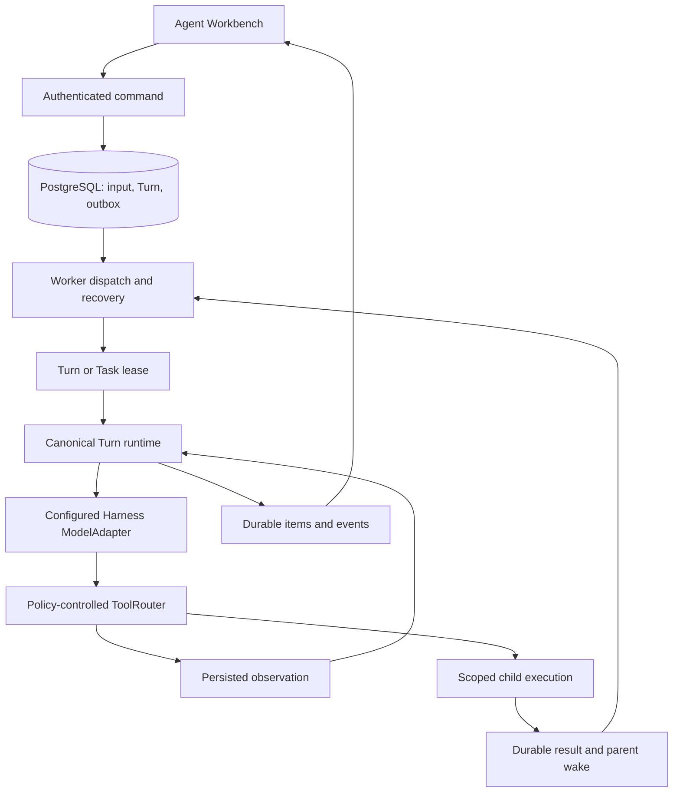

# Canonical Agent execution and supervision

Status: implementation evidence for [#495](https://github.com/YuanshuoDu/applymate-jobcopilot/issues/495), tracked in [PR #497](https://github.com/YuanshuoDu/applymate-jobcopilot/pull/497).
Baseline: `e484bd5cb1a8982c0c0ba3aa3af1eb4442588438`.

## Product outcome

An accepted Agent message should start a durable, recoverable Turn. The configured Harness model can call policy-controlled tools, receive persisted observations, and continue in the same Turn. The Workbench must show the execution state and evidence from the same session timeline.

This is an integration correction to Harness V2. It does not replace user-configured API-key providers, introduce another execution protocol, or satisfy staging gate #387.

## Runtime ownership

Web remains the authenticated control plane. Worker owns long-running model and tool execution. PostgreSQL is authoritative; Redis/BullMQ provides dispatch and wakeup delivery. Models propose semantic actions; server-owned code controls identity, permissions, budgets, leases, retries, cancellation, waits, and completion.

## Integration contracts

1. Accepting a command and recording its dispatch intent is atomic and idempotent. Repeated queue delivery is reconciled against persisted state.
2. Production startup registers the same Turn, recovery, and child consumers exercised by the injectable bootstrap fixture, and closes their resources on shutdown.
3. Conversational execution composes the existing configured ModelAdapter and typed ToolRouter. Provider credentials remain server-side and are resolved for the current user.
4. Every action is bound to authenticated user/session/Turn identity and a server-issued root or child Task owner fence. Model arguments cannot replace that identity.
5. A child runs under its own Task lease and inherited policy. Durable waits persist target, deadline, result, and dispatch state; duplicate or early child completion cannot lose or duplicate the parent wake.
6. Tool results, events, and timeline evidence remain scoped and sanitized. Unsupported or uncertain operations fail visibly; external writes retain existing approval and receipt checks.
7. Conversation and supervisor use one timeline subscription. Session switches and reconnects cannot apply stale session data; existing application review remains available.
8. Missing dependencies, invalid model proposals, or ownership loss must stop execution rather than imply permission or successful completion.

The supervisor may display a bounded, server-derived `cognitive.agenda` status receipt on that timeline. It is a readout of current waits, approvals, pending inputs, failures, and steering; this PR does not add a model-facing planning prompt or Plan Ledger. The Web projection validates the receipt and omits Worker-only resume cursors and unsupported plan revision fields.

The root Turn's `maxSteps` and `maxToolCalls` ceilings apply across the root and descendant Tasks. The Worker checks durable step/tool-call records under the session/Turn locks before each new record is persisted. Token and cost usage remain tracked per execution and admitted through the existing user-level usage guard; this integration does not add an aggregate token/cost ledger for a whole Task tree.

## Persistence changes

This scope includes the additive migrations needed by the accepted execution, recovery, and supervision contracts: private tool-result references and durable waits, tree-budget reservations, mailbox hydration checkpoints, and child retry eligibility. They require migration source and CI/disposable-database evidence only; no shared or production migration was applied. Session pause/resume state, routes, UI, and their event protocol are excluded because the #495 acceptance criteria do not require session controls; they remain a separate follow-up.

Private results bind owner, session, Turn, step, Task, and tool-call identity. Wait records bind an immutable child target set and parent scope to a durable outcome and dispatch intent. Public task and timeline DTOs do not expose these private records.

## Recovery and safety invariants

- Queue delivery may repeat; current persisted state and the active lease decide whether work may continue.
- A worker that loses its owner or lease fence cannot persist a result.
- Completed tool lifecycle receipts are reconciled without repeating the tool. Only explicitly read-only or idempotent tools may be replayed; unknown or non-repeatable operations fail closed.
- A parent releases its lease only after its wait and evidence are durable. A resolver can safely handle completion before suspension and duplicate wake delivery.
- Cancellation and interruption remain bounded by server-owned session or Task scope.
- Tests use deterministic model/tool adapters and do not make provider calls or submit applications.

## Acceptance evidence and limits

Record exact checks against the pushed PR head in the PR body. Separate focused local checks from CI disposable PostgreSQL/Redis integration and browser-fixture evidence. Deterministic fixtures do not prove authenticated staging, actual operating-system process restart, live-provider behavior, employer submission, or production deployment. Keep #387 as a separate gate.

The CI disposable PostgreSQL/RLS test runs under a dedicated non-owner role with `NOBYPASSRLS`, which verifies policy behavior for that test role. This PR does not inspect Fly secrets or prove that the deployed Worker's `DATABASE_URL` role and privileges are restricted. Worker repositories set transaction-local `app.user_id` and retain explicit user/session/turn predicates, but whether RLS actually applies in deployment depends on the role behind `DATABASE_URL`. Confirm the operational RLS boundary before rollout. This deployment verification gap is not evidence of a live leak.

## Split follow-up work

The detailed upgrade plan and excluded implementation are preserved on the [scoped harness follow-up branch](https://github.com/YuanshuoDu/applymate-jobcopilot/tree/codex/ah2-harness-followups). P3 planning and Plan Ledger, context-compaction snapshots, Gmail integration, and session pause/resume controls are outside PR #497 and should be reviewed as separate work.
