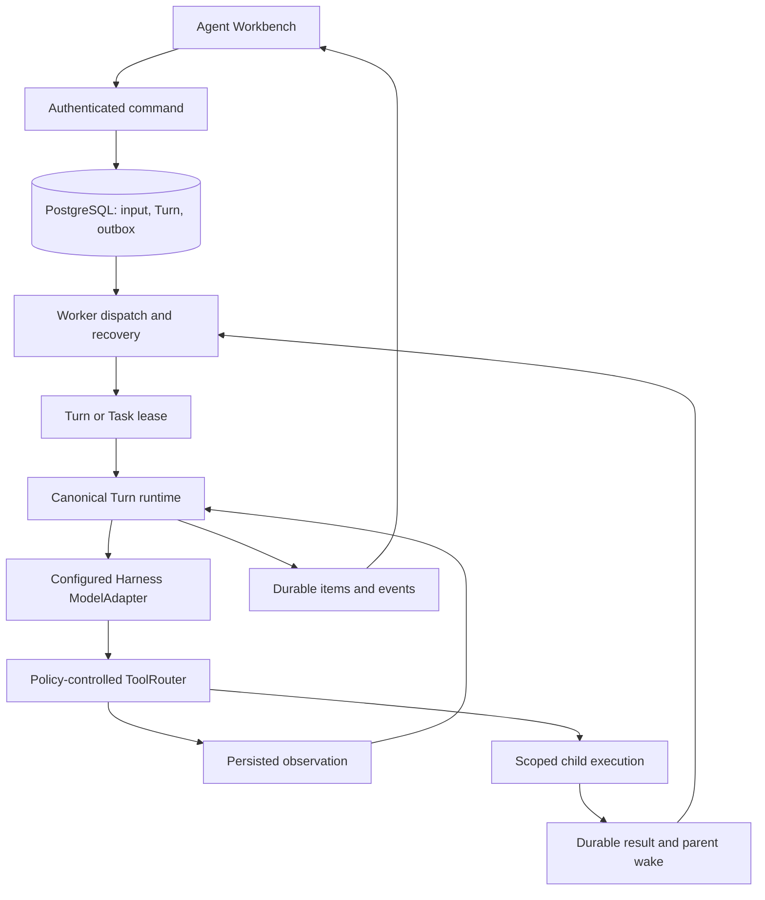

# Canonical Agent execution and supervision

Status: implementation evidence for [#495](https://github.com/YuanshuoDu/applymate-jobcopilot/issues/495), tracked in [PR #497](https://github.com/YuanshuoDu/applymate-jobcopilot/pull/497).
Baseline: `e484bd5cb1a8982c0c0ba3aa3af1eb4442588438`.

## Product outcome

An accepted Agent message should start a durable, recoverable Turn. The configured Harness model can call policy-controlled tools, receive persisted observations, and continue in the same Turn. The Workbench must show the execution state and evidence from the same session timeline.

This is an integration correction to Harness V2. It does not replace user-configured API-key providers, introduce another execution protocol, or satisfy staging gate #387.

## Runtime ownership

```mermaid
flowchart TD
  UI[Agent Workbench] --> CMD[Authenticated command]
  CMD --> PG[(PostgreSQL: input, Turn, outbox)]
  PG --> DISPATCH[Worker dispatch and recovery]
  DISPATCH --> LEASE[Turn or Task lease]
  LEASE --> ENGINE[Canonical Turn runtime]
  ENGINE --> MODEL[Configured Harness ModelAdapter]
  MODEL --> TOOL[Policy-controlled ToolRouter]
  TOOL --> OBS[Persisted observation]
  OBS --> ENGINE
  TOOL --> CHILD[Scoped child execution]
  CHILD --> WAIT[Durable result and parent wake]
  WAIT --> DISPATCH
  ENGINE --> EVENTS[Durable items and events]
  EVENTS --> UI
```

Web remains the authenticated control plane. Worker owns long-running model and tool execution. PostgreSQL is authoritative; Redis/BullMQ provides dispatch and wakeup delivery. Models propose semantic actions; server-owned code controls identity, permissions, budgets, leases, retries, cancellation, waits, and completion.

## Integration contracts

1. Accepting a command and recording its dispatch intent is atomic and idempotent. Repeated queue delivery is reconciled against persisted state.
2. Production startup registers the same Turn, recovery, and child consumers exercised by the injectable bootstrap fixture, and closes their resources on shutdown.
3. Conversational execution composes the existing configured ModelAdapter and typed ToolRouter. Provider credentials remain server-side and are resolved for the current user.
4. Every action is bound to authenticated user/session/Turn identity and a server-issued root or child Task owner fence. Model arguments cannot replace that identity.
5. A child runs under its own Task lease and inherited policy. Durable waits persist target, deadline, result, and dispatch state; duplicate or early child completion cannot lose or duplicate the parent wake.
6. Tool results, events, and timeline evidence remain scoped and sanitized. Unsupported or uncertain operations fail visibly; external writes retain existing approval and receipt checks.
7. Conversation and supervisor use one timeline subscription. Session switches and reconnects cannot apply stale session data; existing application review remains available.
8. Missing dependencies, invalid model proposals, or ownership loss must stop execution rather than imply permission or successful completion.

The supervisor may display a bounded, server-derived `cognitive.agenda` status receipt on that timeline. It is a readout of current waits, approvals, pending inputs, failures, and steering; this PR does not add a model-facing planning prompt or Plan Ledger. The Web projection validates the receipt and omits Worker-only resume cursors and unsupported plan revision fields.

The root Turn's `maxSteps` and `maxToolCalls` ceilings apply across the root and descendant Tasks. The Worker checks durable step/tool-call records under the session/Turn locks before each new record is persisted. Token and cost usage remain tracked per execution and admitted through the existing user-level usage guard; this integration does not add an aggregate token/cost ledger for a whole Task tree.

Worker gates are independent and fail closed: set `ENABLE_AGENT_CHILD_EXECUTION=1` for child execution, `ENABLE_AGENT_WAIT_RESOLVER=1` as well to consume coordination wait outcomes, and `ENABLE_AGENT_CANONICAL_AUTOMATION=1` for canonical automation. The legacy aggregate variables `ENABLE_AGENT_COGNITIVE_LOOP`, `ENABLE_AGENT_PLANNING`, and `ENABLE_AGENT_PLAN_EXECUTION` are no longer read; remove them from deployment environments rather than relying on them to enable these gates. Keep the active gates disabled until the required migrations are applied and the Worker rollout is authorized.

## Persistence changes

This scope includes the additive migrations needed by the accepted execution, recovery, and supervision contracts: private tool-result references and durable waits, tree-budget reservations, mailbox hydration checkpoints, and child retry eligibility. They require migration source and CI/disposable-database evidence only; no shared or production migration was applied. Session pause/resume state, routes, UI, and their event protocol are excluded because the #495 acceptance criteria do not require session controls; they remain a separate follow-up.

Private results bind owner, session, Turn, step, Task, and tool-call identity. Wait records bind an immutable child target set and parent scope to a durable outcome and dispatch intent. Public task and timeline DTOs do not expose these private records.

## Recovery and safety invariants

- Queue delivery may repeat; current persisted state and the active lease decide whether work may continue.
- A worker that loses its owner or lease fence cannot persist a result.
- Completed tool lifecycle receipts are reconciled without repeating the tool. Only explicitly read-only or idempotent tools may be replayed; unknown or non-repeatable operations fail closed.
- A parent releases its lease only after its wait and evidence are durable. A resolver can safely handle completion before suspension and duplicate wake delivery.
- Cancellation and interruption remain bounded by server-owned session or Task scope.
- Tests use deterministic model/tool adapters and do not make provider calls or submit applications.

## Acceptance evidence and limits

Record exact checks against the pushed PR head in the PR body. Separate focused local checks from CI disposable PostgreSQL/Redis integration and browser-fixture evidence. These fixtures do not prove authenticated staging, employer submission, or production deployment. Worker `index.ts` and the existing process-restart fixture now call `startProductionWorkerRuntime`; the fixture uses deterministic model/tool adapters and a test child executor while the shared helper supplies child/wait registrations to the real production bootstrap. The composition unit test checks the canonical runtime factories, production flags, and forwarded bootstrap/router callbacks; the existing production-bootstrap tests cover their registration order. The fixture substitutes no-op usage/projection adapters, so this proves the tested Worker assembly path, not production provider behavior, authenticated staging, or deployed configuration. Keep #387 as a separate gate.

The CI disposable PostgreSQL/RLS test runs under a dedicated non-owner role with `NOBYPASSRLS`, which verifies policy behavior for that test role. This PR does not inspect Fly secrets or prove that the deployed Worker's `DATABASE_URL` role and privileges are restricted. Worker repositories set transaction-local `app.user_id` and retain explicit user/session/turn predicates, but whether RLS actually applies in deployment depends on the role behind `DATABASE_URL`. Confirm the operational RLS boundary before rollout. This deployment verification gap is not evidence of a live leak.

## Evidence map: #497 / #515 / PR #520 / issue #522 (PR #523)

The selected-job feature baseline began at `8a1098fd`. This map preserves prior implementation and verification records below; current stack and verification state is refreshed in the dated status section. The earlier runtime/Workbench evidence is pinned to `96214e00a8523132977e0f936203258577f6c06c`, and the selected-read-scope code evidence at `66f45da5f75c2424b0eea002211b89ef0b57895b` remains historical. Earlier #522 code evidence includes `18a5d1b9ec20fa20e2e04989fa2581470ad2d54c` for the AC3 duplicate Persona source-reference fix and `a5674931d5c8168020c554c6a9f9d7f6009c4800` for the AC4 selected-job Turn-isolation browser regression; `59999035796dbe5559dba0f7e0199eb8a85c9b58` is the AC4 reconnect follow-up, `a8347c029bdd3f00596a837cd2590e3f5e75e34f` records the initial root-coordination guard, and `462d7416` narrows the selected-job root to its TaskGraph supervision tools. The reconnect follow-up projects only the selected job ID from the matching canonical Turn and restores the employer/role from owner-checked saved-job reads, including jobs beyond page one. Its focused DTO, card, and TaskGraph query suites passed 18/18; the browser run at that earlier point remained unverified because the prerequisite Web build stalled before assertions. The focused selected-job root-tool suite passed 33/33 at historical commit `462d7416` and 34/34 at the code-bearing #523 commit `8544fa13`. The vertical path combines the canonical execution and supervision foundation (#497), durable model-authored TaskGraph planning (issue #515 / PR #520), and selected-job preparation (#522). The automatic Vercel PR Preview is allowed for review only; it does not establish CI, AC6, or AC7 acceptance.

| Path | Repository evidence | What it establishes |
|---|---|---|
| Canonical conversational Turn | `apps/web/src/app/api/agent/sessions/[id]/messages/route.ts`; `apps/worker/src/runtime/canonical-turn-runtime.ts`; `apps/worker/src/runtime/turns/turn-engine.ts` | Accepted session messages execute through the V2 TurnEngine and policy-controlled tools. |
| Durable TaskGraph planning | `apps/worker/src/runtime/tools/planning-executors.ts`; `apps/worker/src/runtime/subagents/task-graph-templates.ts`; `apps/worker/src/runtime/subagents/pg-task-graph-command-port.ts`; `apps/web/src/components/agent-workspace/v2/` | With the server gates enabled, the root model can propose bounded registered tasks, wait for durable child results, and replan from persisted graph observations shown in the Workbench. |
| Selected-job intent and disabled-gate outcome | `apps/web/src/app/api/agent/sessions/[id]/messages/route.ts`; `apps/web/src/lib/agent/control-plane/commands/agent-command-service.ts`; `apps/worker/src/runtime/selected-job-preparation.ts`; `apps/worker/src/runtime/canonical-turn-runtime.ts` | The Web checks session and job ownership, stores the selected job as structured Turn input, and the Worker reloads that intent under the current Turn lease. If TaskGraph planning is disabled, the runtime still recognizes the selected-job intent and persists terminal `selected_job_preparation_unavailable` before model or child-task scheduling. |
| Selected-job root coordination boundary | `apps/worker/src/runtime/canonical-turn-runtime.ts`; `apps/worker/src/runtime/canonical-turn-runtime.test.ts`; `apps/worker/src/runtime/subagents/task-graph-templates.ts` | For an enabled selected-job TaskGraph Turn, the root exposes only `agent.plan`, `agent.wait`, `agent.list`, and `list_subagents`. Generic job/persona/resume reads and all other tools are absent from model definitions and persisted root `allowedActions`; fresh proposals and recovered calls that would execute are blocked by this allowlist. Calls with a durable result are reconciled without execution, then their appended observations are filtered from model context at the final context-builder boundary. The server-fenced `task-graph-current` projection is retained. Non-selected Turns retain their existing tool surface. The focused canonical runtime suite passed 34/34 at code-bearing commit `8544fa13`; the 33/33 result below is historical at `462d7416`. |
| Writer source lineage and draft | `apps/worker/src/runtime/subagents/selected-job-artifact-context.ts`; `apps/worker/src/runtime/subagents/production-child-runtime.ts`; `apps/worker/src/runtime/subagents/child-executor.ts`; `apps/worker/src/runtime/subagents/child-context.ts`; `apps/worker/src/runtime/subagents/task-graph-templates.ts`; `apps/worker/src/runtime/subagents/role-policy.ts`; `apps/worker/src/runtime/tools/artifact-tools.ts`; `apps/worker/src/db/agent-artifact-repo.ts` | Under the owner/task fence, the Worker resolves the selected job, default base resume, and confirmed, unexpired cover-letter Persona facts, then computes source lineage. The AC3 fix at `18a5d1b9` gives each Persona fact a unique evidence reference even when facts share a `sourceRef`, while retaining that source reference in the hashed content; the Web exact-version endpoint uses the same lineage rule. The Worker passes this server-pinned bundle transiently to Writer and Reviewer as bounded `external_untrusted` context; model arguments cannot replace its identifiers. Runtime action filtering limits Writer to draft creation and Reviewer to exact-version artifact read/review. The immutable draft stores source lineage, content hash, and fenced Task/tool-call receipt. At historical commit `a5674931`, the focused Worker and Web suites passed 22/22 and 10/10 respectively. |
| Reviewer binding | `apps/worker/src/runtime/subagents/task-graph-templates.ts`; `apps/worker/src/runtime/subagents/child-private-artifact.ts`; `apps/worker/src/runtime/tools/artifact-tools.ts`; `apps/worker/src/runtime/subagents/role-results.ts` | The selected-job Reviewer template allows only `artifact.version.read` and `artifact.review`; it must read the exact Writer artifact version before saving a hash-bound review. Its public result contains the artifact reference, review status, and review hash. |
| Selected-job private item/event projection | `apps/worker/src/runtime/subagents/child-executor.ts`; `apps/worker/src/runtime/subagents/child-private-artifact.ts`; `apps/worker/src/runtime/subagents/child-private-artifact.test.ts`; `apps/web/src/app/api/agent/sessions/[id]/artifacts/[artifactId]/versions/[version]/route.ts` | For selected-job Writer/Reviewer children, the Worker wraps item/event persistence: draft content and constraints are removed from draft-call inputs; private tool outputs become a validated artifact reference, or a generic private-artifact marker if the reference is invalid; and private review/model narrative text is withheld from item, event, batch, and terminal projections while bounded receipts remain. The draft body is read separately through an authenticated exact-version endpoint scoped to owner, session, job, content hash, and source digest (`no-store`). The pinned source bundle is also transient and absent from durable task context, items, events, observations, outbox payloads, and logs. This is a persistence/privacy boundary, not an independent guarantee that model-written claims are factually correct. |
| Workbench Writer artifact projection and reconnect scope | `apps/web/src/app/api/agent/sessions/[id]/route.ts`; `apps/web/src/app/api/agent/sessions/[id]/tasks/route.ts`; `apps/web/src/app/api/agent/sessions/query-dto.ts`; `apps/web/src/app/api/agent/sessions/query-dto.test.ts`; `apps/web/src/components/agent-workspace/v2/AgentSupervisorPanel.tsx`; `apps/web/src/components/agent-workspace/v2/SelectedJobPreparationCard.tsx`; `apps/web/src/components/agent-workspace/v2/selected-job-preparation-action.ts`; `apps/web/src/components/agent-workspace/v2/task-graph-plan-query.ts`; `apps/web/src/components/agent-workspace/v2/task-graph-plan-query.test.ts`; `apps/web/src/components/agent-workspace/v2/draft-artifact-projection.ts` | The session route authenticates and selects by session ID plus authenticated owner. The TaskGraph read validates the graph identity, then scopes child rows by session, turn, root, and graph task IDs. On reconnect, `taskDto` restores only the bounded artifact reference from a completed registered Writer/Reviewer role-task pair (`writer`/`cover_letter_draft` or `reviewer`/`cover_letter_review`) with matching completed structured-result role/status. It does not return draft content. For AC4, Workbench gates the selected graph using the selected-job POST's returned Turn ID/sequence immediately and recovers the same intent from the replayed fixed request message; an older plan/draft stays hidden until that Turn's TaskGraph appears. The reconnect follow-up also projects only a bounded selected-job ID from the matching canonical Turn, resolves display fields through owner-checked saved-job reads (including the single-job path when the selection is older than page one), and scopes restored selection by user/session/job. The focused projection regression test passed 5/5. At `a5674931`, the earlier Turn-isolation Playwright regression passed 4/4 across desktop-en, desktop-zh, mobile-en, and mobile-zh. The later fixture-backed selected-job browser results are recorded in the current status section; they remain fixture evidence, not authenticated deployed behavior. |
| Scheduled batch pipeline | `apps/web/src/lib/agent/pipeline.ts`; `apps/web/src/lib/agent/run-service.ts`; `apps/worker/src/queue/agent-run-queue.ts`; `apps/worker/src/queue/agent-run-turn-executor.ts` | The existing scheduled batch workflow still has the fixed `scout → analyze → prepare → gate → execute → audit` implementation in `runPipeline()`. The gate-off Worker fallback invokes it through one coarse `pipeline.run` tool; a feature-gated canonical automation dispatch also exists, but this checkout cannot prove production has cut over. |

## Current acceptance blockers and boundaries

- **Production gate state is unknown from the repository.** Worker flags are server-owned: TaskGraph planning requires `ENABLE_AGENT_TASK_GRAPH_PLANNING=1`, `ENABLE_AGENT_CHILD_EXECUTION=1`, and `ENABLE_AGENT_WAIT_RESOLVER=1`; canonical automation separately requires `ENABLE_AGENT_CANONICAL_AUTOMATION=1`. No checked-in value proves what Fly currently runs. Keep the existing migration and rollout gates in force.
- **Selected-job preparation fails closed when TaskGraph planning is disabled.** The canonical runtime detects the persisted selected-job intent and writes terminal `selected_job_preparation_unavailable` before model or child-task scheduling. This prevents silent acceptance while the required planning capability is unavailable; it does not establish that production gate values enable the path.
- **Writer and Reviewer receive source evidence transiently.** The Worker loads the selected job, default base resume, and eligible Persona facts under the server-owned fence and sends the pinned bundle in their bounded child context. The selected-job root cannot call generic `jobs.search`, `jobs.get`, `persona.retrieve`, or `resume.get_base` tools; child reads are scoped to the server-pinned bundle, so model-selected identifiers cannot substitute another source bundle.
- **Evidence is untrusted model context.** `child-context.ts` labels the bounded source bundle `external_untrusted`; Writer is restricted to draft creation, while Reviewer is restricted to reading the exact artifact version and saving its review. The system provides evidence for reasoning but does not deterministically validate every factual claim in the generated review.
- **Transient source privacy is covered at the child boundary.** Raw job, resume, and Persona text is supplied for the current Writer/Reviewer turn only and is excluded from persisted task context, items, events, observations, outbox payloads, and Worker logs. The content remains available to the model during that invocation, so this is not a promise that the provider never processes it.
- **Reviewer provenance is version- and source-bound.** Review results bind to the exact artifact version/hash and source digest. A changed source cannot silently reuse a review, but the model's semantic assessment can still miss an inaccurate statement; the provenance binding is not a deterministic fact checker.
- **The source-context paths are in the #522 Tech Notes allowlist.** Historical focused evidence covers server-selected source loading, transient Writer/Reviewer context, runtime action clamps, and durable-record redaction. Selected-read-scope code commit `66f45da5f75c2424b0eea002211b89ef0b57895b` has a PR-body report of 59/59 focused Worker tests passing with Worker typecheck. The AC3 duplicate Persona source-reference fix at `18a5d1b9` and the AC4 runtime/code fix at `ed8ce45ae68fe685c8ba4df4734009235ebdc760` retain their historical focused results; the earlier Turn-isolation browser matrix passed 4/4 across desktop-en/zh and mobile-en/zh. At historical code commit `8544fa139a5dc86fb12a3ea6d32824e6217e1c85`, the focused canonical runtime suite passed 34/34, Worker typecheck passed, and `git diff --check` passed. Its local dev browser result was 2/12 and the session-initialization cause was inconclusive. An earlier browser attempt at code commit `3efe800` timed out before assertions. Current-head #523 disposable PostgreSQL/Redis CI passed 65/65, including the selected-job Worker restart and Stop-fencing flow; the additive migration was applied only to the disposable CI database. Current-head browser CI also passed. These are PR-safe acceptance checks, separate from #520's historical service and browser evidence and from deployment acceptance.
- **V2 does not replace the fixed batch workflow in this slice.** #522 intentionally adds one canonical selected-job draft/review path. It does not migrate scheduled discovery/application stages away from `runPipeline()` or authorize application submission. That distinction remains until the canonical automation path is verified in the target environment.
- **Workbench artifacts are scoped to the selected preparation Turn.** The UI uses the accepted selected-job Turn ID/sequence immediately and the durable request message after reconnect; it hides the prior plan/draft until the selected Turn's graph arrives, then requires that graph's Writer receipt for a draft. This is a UI projection boundary, separate from transient source delivery to Writer/Reviewer.
- **Repository fixtures do not establish deployment acceptance.** Source tests and restart/browser fixtures provide code-level evidence; authenticated staging traces, current deployed flag values, rollback evidence, and production observation remain separate rollout evidence.

## Current stack and verification gates — 2026-10-01

This snapshot tracks issue #522 / PR #523. The latest code-bearing commit is `9d5b02a54f89e588dd0f9f2e63cbd5a6b9f267ec`, targeting `master` after #520 merged. PR #523 remains Draft. This status refresh is documentation-only; keep code tests and service acceptance tied to the code-bearing commit. Historical results below remain historical unless explicitly tied to this head.

- **#497:** Merged to `master` as `5e6cb3227f97b3ba8872c1b0950ffa89a426d1d5`.
- **#520 / issue #515:** Merged to `master` as `3140d8f4f6529cafddee3f94b64219cf6c738e34` at 2026-09-30 21:52 UTC. Required CI checks and the disposable PostgreSQL/Redis acceptance integration were green at head `7353e4c971c60651c9e83ba7ca2e56442693b015`; the service integration passed on three consecutive attempts ([attempt 1](https://github.com/YuanshuoDu/applymate-jobcopilot/actions/runs/36736870464/attempts/1), [attempt 2](https://github.com/YuanshuoDu/applymate-jobcopilot/actions/runs/36736870464/attempts/2), [attempt 3](https://github.com/YuanshuoDu/applymate-jobcopilot/actions/runs/36736870464/attempts/3)). Its browser matrix and Vercel Preview also passed. This is prior #520 evidence, not #523 AC6 evidence.
- **#523 / issue #522:** Open Draft targeting `master`; its current code-bearing head is `9d5b02a54f89e588dd0f9f2e63cbd5a6b9f267ec`, and the finalization-guard change is included. CI run [`36796816348`](https://github.com/YuanshuoDu/applymate-jobcopilot/actions/runs/36796816348) completed its CI unit-test, Build, and TypeScript checks; its TaskGraph proposal integration passed 65/65. The aggregate Playwright tail of pnpm test:all logged 68 failures, 12 skips, and 4 passes because Chromium was missing in that job; the shell || true guard suppresses that command failure, so the green Tests check does not mean that aggregate Playwright run passed. The separate Agent Workspace E2E browser matrix passed. That integration includes the selected-job Worker restart/Stop-fencing and Workbench Plan Ledger steps. Agent Workspace E2E run [`36796816352`](https://github.com/YuanshuoDu/applymate-jobcopilot/actions/runs/36796816352), Harness Contract [`36796816316`](https://github.com/YuanshuoDu/applymate-jobcopilot/actions/runs/36796816316), Harness Observability [`36796816324`](https://github.com/YuanshuoDu/applymate-jobcopilot/actions/runs/36796816324), Migration rehearsal [`36796816336`](https://github.com/YuanshuoDu/applymate-jobcopilot/actions/runs/36796816336), and PR Lint [`36796816341`](https://github.com/YuanshuoDu/applymate-jobcopilot/actions/runs/36796816341) passed. The Vercel [PR Preview](https://vercel.com/stevens-projects-894c8977/web/J8Y1mSuNVeUMNHQrMBLUr77bHUgA) completed and is review-only, not acceptance evidence. The previous CI attempt [`36795485852`](https://github.com/YuanshuoDu/applymate-jobcopilot/actions/runs/36795485852) timed out only while waiting for the selected-job Stop marker; the current passing run supersedes that attempt.
- **Focused local verification at code-bearing head `b401dd164e9b29948d60f2a2704a3434a05fe82d` (historical):** Six focused Worker test files passed 88/88; `canonical-turn-runtime.test.ts` passed 39/39; Worker `tsc --noEmit` passed; `git diff --check` was clean. The TaskGraph integration file passed 51 tests and skipped 14 service-backed tests because disposable PostgreSQL/Redis were unavailable locally. These local results are not retagged as current-head runs.
- **AC6 / migration:** Current-head CI applied the additive #522 migration only to its disposable PostgreSQL service and passed the disposable PostgreSQL/Redis integration 65/65. The PR-safe synthetic schema rehearsal passed. The protected current-dump rehearsal was skipped, so it is not evidence that a shared or production database was inspected or changed. #520 service runs remain separate evidence and do not replace #523 acceptance.
- **AC3/AC4 finalization guard:** The canonical selected-job runtime passes an optional guard through the TurnEngine store to the terminal PoolClient. After session, Turn, and root locks plus follow-up/receipt checks, the guard revalidates the accepted graph witness, current source digest (including eligible Persona facts), draft head, and review receipt before terminal item/event/root writes. Guarded reads use `READ COMMITTED` statements after the authority locks; committed replay bypasses the guard. Final writes retain a live lease check using `clock_timestamp()` and the root interruption/Stop fence. Ordinary Turns retain the prior transaction and lease predicate.
- **Deployment and database boundary:** CI applied the migration only to its disposable database. No local or shared database was touched, and no staging or production database or deployment was used. The completed Vercel PR Preview is for review only.

## Latest #522 code evidence — 2026-10-01

Selected-job gate and finalization-guard implementation evidence is pinned to code-bearing commit `9d5b02a54f89e588dd0f9f2e63cbd5a6b9f267ec`. Current-head PR-safe CI and browser evidence is recorded above; this section does not establish authenticated staging or production behavior.

- The selected-job completion gate requires the latest completed Writer and directly dependent Reviewer to refer to the same immutable version. It reloads the owner-scoped selected job, default base resume, and eligible `cover_letter` Persona facts, recomputes their digest, and compares it with the persisted draft head and review receipt. Source drift, unavailable sources, malformed or mismatched heads, and loader failures fail closed. The terminal transaction rechecks the accepted graph witness, source digest, draft head, and review receipt on the same PoolClient before writing completion records.
- Selected-job scope and the live child lease fence are carried only by the dedicated private artifact tool context. They are validated against the server-selected job and active lease before draft/review execution; generic router/type context does not carry these private capabilities.
- The exact-version Web route reports whether a requested version is the current persisted head. It exposes bounded source excerpts only when the version is current and the source digest matches; stale or unresolved references suppress source text, and stale reviews omit findings and evidence references. The Workbench renders the version state explicitly.
- Fixture-backed selected-job Playwright cases previously passed 3/3. Historical local focused evidence at `b401dd…` includes 88/88 across six Worker files, 39/39 in the canonical runtime suite, Worker typecheck, and 51 integration tests with 14 service-backed skips. At current head `9d5b02a5…`, disposable PostgreSQL/Redis integration passed 65/65, including selected-job restart/Stop fencing and Workbench Plan Ledger steps; Agent Workspace E2E passed. The migration applied in disposable CI and the PR-safe synthetic schema rehearsal passed; the protected current-dump rehearsal was skipped.
- No local/shared/staging/production database was changed and no staging or production deployment occurred. The completed Vercel PR Preview is review-only. Current CI and fixture results do not establish authenticated staging traces, deployed feature-flag values, production observation, or the deployed Worker's operational RLS role boundary.

## Focused evidence — 2026-09-30

At commit `462d74161dcfd47636eb97d888170160c078cc7c`, the focused `canonical-turn-runtime.test.ts` Worker suite passed 33/33. It verifies that selected-job root definitions and persisted permissions expose only `agent.plan`, `agent.wait`, `agent.list`, and `list_subagents`; generic job/persona/resume reads are hidden; forged fresh and recovered calls are denied before routing; raw source output does not enter events; and non-selected Turns retain their generic read surface. The earlier `a8347c029bdd3f00596a837cd2590e3f5e75e34f` guard tests passed 37/37 across the canonical runtime and TaskGraph templates. This focused evidence does not establish AC6 PostgreSQL/Redis, browser, CI, or deployment gates.

At historical code-bearing #523 commit `8544fa139a5dc86fb12a3ea6d32824e6217e1c85`, the focused canonical runtime suite passed 34/34. It verifies that selected-job model context filters both restored generic observations and observations appended after initial filtering when a durable `durableResult` is reconciled; the server-fenced `task-graph-current` projection remains in context. Worker typecheck and `git diff --check` passed at this code commit. The local selected-job/saved-job Playwright matrix passed 2/12: two newer-turn cases passed and ten failed because the selected-job preparation card was missing. The diagnostic was inconclusive at session initialization. This does not establish the six disposable PostgreSQL/Redis cases, which remain unverified.

Historical evidence at commit `a5674931d5c8168020c554c6a9f9d7f6009c4800`: the focused Worker set passed 22/22 and the focused Web set passed 10/10. `pnpm --filter @jobcopilot/worker exec tsc --noEmit` and `pnpm --filter web exec tsc --noEmit --skipLibCheck` both passed. The selected-job Turn-isolation browser regression passed 4/4 with `desktop-en`, `desktop-zh`, `mobile-en`, and `mobile-zh`; the test uses local route fixtures and does not prove deployed authentication or production behavior. All six real AC6 PostgreSQL/Redis production-composition/restart cases were not run locally because a fresh disposable Redis runtime was unavailable. No migration was exercised, and no database was touched. GitHub Actions has no run for #523 on this stacked base. Separately, PR #520's disposable PostgreSQL integration and browser matrix passed; those results do not execute or replace #523's six AC6 cases. `git diff --check` passed for this evidence-map refresh.

The AC4 reconnect follow-up at commit `59999035796dbe5559dba0f7e0199eb8a85c9b58` passes the focused DTO, selected-job card, and TaskGraph query suites (18/18). Playwright lists the new before-Writer reconnect regression in all four desktop/mobile and English/Chinese projects; the browser run was stopped before assertions because its prerequisite Web production build made no progress for two minutes. The follow-up adds no route or persistence changes. Full browser, typecheck, disposable PostgreSQL/Redis, and migration gates remain for the final unified verification.

At historical selected-read-scope code commit `66f45da5f75c2424b0eea002211b89ef0b57895b`, the fix kept selected-job Scout/Analyst tasks plannable while binding `jobs.get`, `persona.retrieve`, and `resume.get_base` inputs to server-loaded job, base-resume, and Persona-use context. It excluded legacy retry observations for those tasks and redacted selected read selectors/results from durable records. The PR body reported 59/59 passing across the focused TaskGraph template, child-executor, selected-job context, and production-child-runtime suites, plus Worker typecheck. The AC4 runtime/code fix is recorded at `ed8ce45ae68fe685c8ba4df4734009235ebdc760`; its Workbench Turn gate passed 5/5 focused tests, and Web typecheck passed. This is separate from the six unverified disposable PostgreSQL/Redis AC6 cases; the earlier 4/4 browser matrix remains tied to the `96214...` runtime/Workbench baseline.

Earlier focused evidence on this branch included 29/29 Worker artifact/private tests across four suites and an 8/8 deterministic `e2e/agent-supervisor.spec.ts` matrix for shared-timeline and selected-job reconnect scenarios across `desktop-en`, `desktop-zh`, `mobile-en`, and `mobile-zh`. Command: `pnpm exec playwright test e2e/agent-supervisor.spec.ts --grep "real page mounts the shared timeline|selected-job preparation sends typed scope and restores the persisted draft after stream reconnect" --project=desktop-en --project=desktop-zh --project=mobile-en --project=mobile-zh`. Playwright used local services and route fixtures that stub session/authentication and artifact responses; this establishes fixture-backed Workbench render/reconnect behavior, not deployed authentication or production behavior. These earlier focused results do not constitute full #522 acceptance.

At earlier AC6 fixture commit `a043107e`, the deterministic Worker 1/2 process-restart fixture asserted that the restarted Worker recovers the Writer artifact reference from the persisted Reviewer dependency context and reads the exact stored body through the artifact tool; it rejects injected `body`/`artifactRef` fixture values and checks the body is absent before the artifact read. Model/provider and employer behavior are mocked. At that earlier revision, the integration file passed 50 runnable tests and skipped 5 disposable PostgreSQL/Redis cases, including the real process-restart trace. Current #523 counts and service limits are recorded above.

At historical AC4 DTO guard commit `e2d73f30`, the query projection restored artifact references only for completed registered Writer/Reviewer role-task pairs with matching result envelope role/status. Its focused test passed 8/8, including role, task-type, and completion mismatches. The focused Worker artifact/private suite passed 29/29; the dependency-context and result-projection unit suites passed 29/29 across two suites. The canonical turn runtime model-usage helper tests passed 6/6, and the artifact repository/helper tests passed 8/8. These are earlier code-point results; current typecheck and focused-suite evidence is pinned to `a5674931` above.

**Selected-job source context was first verified at runtime SHA `96214e00a8523132977e0f936203258577f6c06c`; the selected-read-scope code commit is `66f45da5f75c2424b0eea002211b89ef0b57895b`, the AC4 runtime/code fix is `ed8ce45ae68fe685c8ba4df4734009235ebdc760`, and the AC3 duplicate Persona reference fix is `18a5d1b9ec20fa20e2e04989fa2581470ad2d54c`.** The Worker resolves the server-owned job, default base resume, and confirmed/unexpired `cover_letter` Persona facts, pins their lineage, and provides bounded source text transiently to Writer/Reviewer while filtering it from durable task and tool records. The selected-read-scope fix also binds Scout/Analyst read selectors to the server-selected source bundle and redacts selected read inputs/results from durable records; its PR-body evidence is 59/59 focused Worker tests plus Worker typecheck. The six AC6 PostgreSQL/Redis production-composition/restart cases were not run locally; no migration was exercised and no database was touched. Source delivery provides evidence to the model but does not guarantee claim-level factual accuracy.

## Split follow-up work

The detailed upgrade plan and excluded implementation are preserved on the [scoped harness follow-up branch](https://github.com/YuanshuoDu/applymate-jobcopilot/tree/codex/ah2-harness-followups). P3 planning and the Plan Ledger are implemented in the open stacked PR #520 for issue #515. Context-compaction snapshots, Gmail integration, and remaining control-plane work, including session pause/resume controls, remain later follow-ups.
