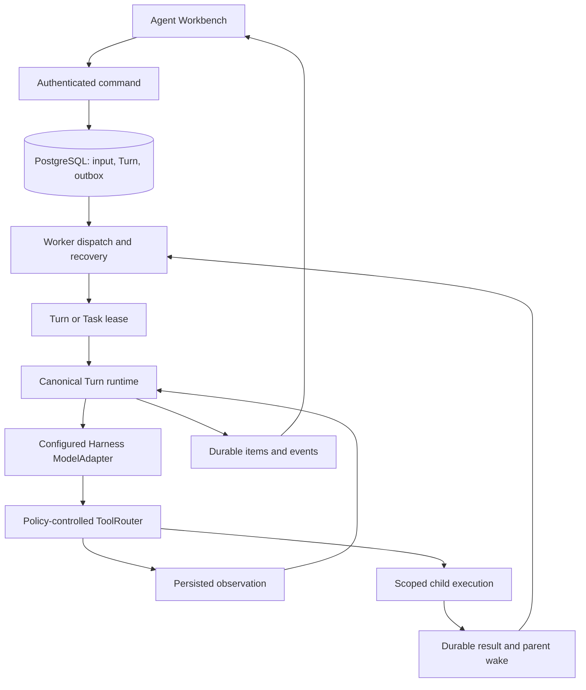

# Canonical Agent execution and supervision

Status: implementation evidence for [#495](https://github.com/YuanshuoDu/applymate-jobcopilot/issues/495), tracked in [PR #497](https://github.com/YuanshuoDu/applymate-jobcopilot/pull/497).
Baseline: `e484bd5cb1a8982c0c0ba3aa3af1eb4442588438`.

## Product outcome

An accepted Agent message should start a durable, recoverable Turn. The configured Harness model can call policy-controlled tools, receive persisted observations, and continue in the same Turn. The Workbench must show the execution state and evidence from the same session timeline.

This is an integration correction to Harness V2. It does not replace user-configured API-key providers, introduce another execution protocol, or satisfy staging gate #387.

## Runtime ownership

```mermaid
flowchart TD
  UI[Agent Workbench] --> CMD[Authenticated command]
  CMD --> PG[(PostgreSQL: input, Turn, outbox)]
  PG --> DISPATCH[Worker dispatch and recovery]
  DISPATCH --> LEASE[Turn or Task lease]
  LEASE --> ENGINE[Canonical Turn runtime]
  ENGINE --> MODEL[Configured Harness ModelAdapter]
  MODEL --> TOOL[Policy-controlled ToolRouter]
  TOOL --> OBS[Persisted observation]
  OBS --> ENGINE
  TOOL --> CHILD[Scoped child execution]
  CHILD --> WAIT[Durable result and parent wake]
  WAIT --> DISPATCH
  ENGINE --> EVENTS[Durable items and events]
  EVENTS --> UI
```

Web remains the authenticated control plane. Worker owns long-running model and tool execution. PostgreSQL is authoritative; Redis/BullMQ provides dispatch and wakeup delivery. Models propose semantic actions; server-owned code controls identity, permissions, budgets, leases, retries, cancellation, waits, and completion.

## Integration contracts

1. Accepting a command and recording its dispatch intent is atomic and idempotent. Repeated queue delivery is reconciled against persisted state.
2. Production startup registers the same Turn, recovery, and child consumers exercised by the injectable bootstrap fixture, and closes their resources on shutdown.
3. Conversational execution composes the existing configured ModelAdapter and typed ToolRouter. Provider credentials remain server-side and are resolved for the current user.
4. Every action is bound to authenticated user/session/Turn identity and a server-issued root or child Task owner fence. Model arguments cannot replace that identity.
5. A child runs under its own Task lease and inherited policy. Durable waits persist target, deadline, result, and dispatch state; duplicate or early child completion cannot lose or duplicate the parent wake.
6. Tool results, events, and timeline evidence remain scoped and sanitized. Unsupported or uncertain operations fail visibly; external writes retain existing approval and receipt checks.
7. Conversation and supervisor use one timeline subscription. Session switches and reconnects cannot apply stale session data; existing application review remains available.
8. Missing dependencies, invalid model proposals, or ownership loss must stop execution rather than imply permission or successful completion.

The supervisor may display a bounded, server-derived `cognitive.agenda` status receipt on that timeline. It is a readout of current waits, approvals, pending inputs, failures, and steering; this PR does not add a model-facing planning prompt or Plan Ledger. The Web projection validates the receipt and omits Worker-only resume cursors and unsupported plan revision fields.

The root Turn's `maxSteps` and `maxToolCalls` ceilings apply across the root and descendant Tasks. The Worker checks durable step/tool-call records under the session/Turn locks before each new record is persisted. Token and cost usage remain tracked per execution and admitted through the existing user-level usage guard; this integration does not add an aggregate token/cost ledger for a whole Task tree.

Worker gates are independent and fail closed: set `ENABLE_AGENT_CHILD_EXECUTION=1` for child execution, `ENABLE_AGENT_WAIT_RESOLVER=1` as well to consume coordination wait outcomes, and `ENABLE_AGENT_CANONICAL_AUTOMATION=1` for canonical automation. The legacy aggregate variables `ENABLE_AGENT_COGNITIVE_LOOP`, `ENABLE_AGENT_PLANNING`, and `ENABLE_AGENT_PLAN_EXECUTION` are no longer read; remove them from deployment environments rather than relying on them to enable these gates. Keep the active gates disabled until the required migrations are applied and the Worker rollout is authorized.

## Persistence changes

This scope includes the additive migrations needed by the accepted execution, recovery, and supervision contracts: private tool-result references and durable waits, tree-budget reservations, mailbox hydration checkpoints, and child retry eligibility. They require migration source and CI/disposable-database evidence only; no shared or production migration was applied. Session pause/resume state, routes, UI, and their event protocol are excluded because the #495 acceptance criteria do not require session controls; they remain a separate follow-up.

Private results bind owner, session, Turn, step, Task, and tool-call identity. Wait records bind an immutable child target set and parent scope to a durable outcome and dispatch intent. Public task and timeline DTOs do not expose these private records.

## Recovery and safety invariants

- Queue delivery may repeat; current persisted state and the active lease decide whether work may continue.
- A worker that loses its owner or lease fence cannot persist a result.
- Completed tool lifecycle receipts are reconciled without repeating the tool. Only explicitly read-only or idempotent tools may be replayed; unknown or non-repeatable operations fail closed.
- A parent releases its lease only after its wait and evidence are durable. A resolver can safely handle completion before suspension and duplicate wake delivery.
- Cancellation and interruption remain bounded by server-owned session or Task scope.
- Tests use deterministic model/tool adapters and do not make provider calls or submit applications.

## Acceptance evidence and limits

Record exact checks against the pushed PR head in the PR body. Separate focused local checks from CI disposable PostgreSQL/Redis integration and browser-fixture evidence. These fixtures do not prove authenticated staging, employer submission, or production deployment. Worker `index.ts` and the existing process-restart fixture now call `startProductionWorkerRuntime`; the fixture uses deterministic model/tool adapters and a test child executor while the shared helper supplies child/wait registrations to the real production bootstrap. The composition unit test checks the canonical runtime factories, production flags, and forwarded bootstrap/router callbacks; the existing production-bootstrap tests cover their registration order. The fixture substitutes no-op usage/projection adapters, so this proves the tested Worker assembly path, not production provider behavior, authenticated staging, or deployed configuration. Keep #387 as a separate gate.

The CI disposable PostgreSQL/RLS test runs under a dedicated non-owner role with `NOBYPASSRLS`, which verifies policy behavior for that test role. This PR does not inspect Fly secrets or prove that the deployed Worker's `DATABASE_URL` role and privileges are restricted. Worker repositories set transaction-local `app.user_id` and retain explicit user/session/turn predicates, but whether RLS actually applies in deployment depends on the role behind `DATABASE_URL`. Confirm the operational RLS boundary before rollout. This deployment verification gap is not evidence of a live leak.

## Evidence map: #497 / #515 / PR #520 to #522

The selected-job feature baseline began at `8a1098fd`; this evidence map was refreshed on 2026-09-30 against live GitHub state. The vertical path combines the canonical execution and supervision foundation (#497), durable model-authored TaskGraph planning (issue #515 / PR #520), and selected-job preparation (#522). PR #497 is OPEN/BLOCKED with `REVIEW_REQUIRED`. PR #520 is OPEN, non-draft, head `5b07f2dd`, base `codex/ah2-495-agent-brain-supervisor`; its required TypeScript, Build, Tests, Worker PostgreSQL integration, browser matrix, lockfile, and Vercel checks are green and GitHub reports `CLEAN`, while `reviewDecision` is empty and the visible reviews are comments, not an approval. Issue #522 has stacked PR #523 based on `feat/515-durable-taskgraph-p3` (the #520 head). That base is excluded from the current `ci.yml`/`e2e.yml` pull-request branch filters (`master` and `codex/ah2-495-agent-brain-supervisor`), so GitHub Actions must run after the base stack is accepted and the PR is retargeted to an eligible base. Code/test acceptance, formal review approval, and stack/merge readiness are separate gates.

| Path | Repository evidence | What it establishes |
|---|---|---|
| Canonical conversational Turn | `apps/web/src/app/api/agent/sessions/[id]/messages/route.ts`; `apps/worker/src/runtime/canonical-turn-runtime.ts`; `apps/worker/src/runtime/turns/turn-engine.ts` | Accepted session messages execute through the V2 TurnEngine and policy-controlled tools. |
| Durable TaskGraph planning | `apps/worker/src/runtime/tools/planning-executors.ts`; `apps/worker/src/runtime/subagents/task-graph-templates.ts`; `apps/worker/src/runtime/subagents/pg-task-graph-command-port.ts`; `apps/web/src/components/agent-workspace/v2/` | With the server gates enabled, the root model can propose bounded registered tasks, wait for durable child results, and replan from persisted graph observations shown in the Workbench. |
| Selected-job intent and disabled-gate outcome | `apps/web/src/app/api/agent/sessions/[id]/messages/route.ts`; `apps/web/src/lib/agent/control-plane/commands/agent-command-service.ts`; `apps/worker/src/runtime/selected-job-preparation.ts`; `apps/worker/src/runtime/canonical-turn-runtime.ts` | The Web checks session and job ownership, stores the selected job as structured Turn input, and the Worker reloads that intent under the current Turn lease. If TaskGraph planning is disabled, the runtime still recognizes the selected-job intent and persists terminal `selected_job_preparation_unavailable` before model or child-task scheduling. |
| Writer source lineage and draft | `apps/worker/src/runtime/subagents/selected-job-artifact-context.ts`; `apps/worker/src/runtime/subagents/production-child-runtime.ts`; `apps/worker/src/runtime/subagents/role-policy.ts`; `apps/worker/src/runtime/tools/artifact-tools.ts`; `apps/worker/src/db/agent-artifact-repo.ts` | The Worker reloads the selected job, base resume, and cover-letter-eligible Persona facts to compute the source digest and references. The Writer template declares `jobs.get` and `persona.retrieve`, but the Writer role policy allows only the `resume` domain, so those job/profile tools are filtered out; it can invoke the generic resume.get_base tool, whose model-selected resume ID is not pinned to the digest source; that result also uses the general durable tool lifecycle rather than the selected-job private artifact projection. The immutable draft records source lineage, content hash, and fenced Task/tool-call receipt. |
| Reviewer binding | `apps/worker/src/runtime/subagents/task-graph-templates.ts`; `apps/worker/src/runtime/subagents/child-private-artifact.ts`; `apps/worker/src/runtime/tools/artifact-tools.ts`; `apps/worker/src/runtime/subagents/role-results.ts` | The selected-job Reviewer template allows only `artifact.version.read` and `artifact.review`; it must read the exact Writer artifact version before saving a hash-bound review. Its public result contains the artifact reference, review status, and review hash. |
| Selected-job private item/event projection | `apps/worker/src/runtime/subagents/child-executor.ts`; `apps/worker/src/runtime/subagents/child-private-artifact.ts`; `apps/worker/src/runtime/subagents/child-private-artifact.test.ts`; `apps/web/src/app/api/agent/sessions/[id]/artifacts/[artifactId]/versions/[version]/route.ts` | For selected-job Writer/Reviewer children, the Worker wraps item/event persistence: draft content and constraints are removed from draft-call inputs; private tool outputs become a validated artifact reference, or a generic private-artifact marker if the reference is invalid; and private review/model narrative text is withheld from item, event, batch, and terminal projections while bounded receipts remain. The actual draft body is read separately through an authenticated exact-version endpoint scoped to owner, session, job, content hash, and source digest (`no-store`). This documents the tested private-to-public projection boundary; it does not grant additional Writer source reads. |
| Workbench Writer artifact projection and reconnect scope | `apps/web/src/app/api/agent/sessions/[id]/route.ts`; `apps/web/src/app/api/agent/sessions/[id]/tasks/route.ts`; `apps/web/src/app/api/agent/sessions/query-dto.ts`; `apps/web/src/app/api/agent/sessions/query-dto.test.ts`; `apps/web/src/components/agent-workspace/v2/AgentSupervisorPanel.tsx`; `apps/web/src/components/agent-workspace/v2/draft-artifact-projection.ts` | The session route authenticates and selects by session ID plus authenticated owner. The TaskGraph read validates the graph identity, then scopes child rows by session, turn, root, and graph task IDs. On reconnect, `taskDto` restores only the bounded artifact reference from a completed registered Writer/Reviewer role-task pair (`writer`/`cover_letter_draft` or `reviewer`/`cover_letter_review`) with matching completed structured-result role/status. It does not return draft content; the active-graph Workbench projection still hides a prior job's draft unless the latest graph has its own Writer receipt. |
| Scheduled batch pipeline | `apps/web/src/lib/agent/pipeline.ts`; `apps/web/src/lib/agent/run-service.ts`; `apps/worker/src/queue/agent-run-queue.ts`; `apps/worker/src/queue/agent-run-turn-executor.ts` | The existing scheduled batch workflow still has the fixed `scout → analyze → prepare → gate → execute → audit` implementation in `runPipeline()`. The gate-off Worker fallback invokes it through one coarse `pipeline.run` tool; a feature-gated canonical automation dispatch also exists, but this checkout cannot prove production has cut over. |

## Current acceptance blockers and boundaries

- **Production gate state is unknown from the repository.** Worker flags are server-owned: TaskGraph planning requires `ENABLE_AGENT_TASK_GRAPH_PLANNING=1`, `ENABLE_AGENT_CHILD_EXECUTION=1`, and `ENABLE_AGENT_WAIT_RESOLVER=1`; canonical automation separately requires `ENABLE_AGENT_CANONICAL_AUTOMATION=1`. No checked-in value proves what Fly currently runs. Keep the existing migration and rollout gates in force.
- **Selected-job preparation fails closed when TaskGraph planning is disabled.** The canonical runtime detects the persisted selected-job intent and writes terminal `selected_job_preparation_unavailable` before model or child-task scheduling. This prevents silent acceptance while the required planning capability is unavailable; it does not establish that production gate values enable the path.
- **Writer cannot currently read the selected job or Persona facts.** Its task template declares `jobs.get` and `persona.retrieve`, but `role-policy.ts` sets `allowedDomains: ["resume"]` for the Writer, so the jobs- and persona-domain tools are filtered out. The Worker computes a source digest from those materials, but that digest and the references do not give the Writer their contents.
- **Fence `jobs.get` before exposing it to Writer.** `task-graph-templates.ts` declares the job read, while `read-data-source.ts` accepts the model-provided job ID and filters only by that ID and current user. The Writer's domain policy currently hides this tool, so another same-user job is not reachable through this template today; if job-domain access is enabled, `jobs.get` must also enforce the server-selected job ID.
- **Writer resume provenance and privacy remain open.** The generic resume reader accepts a model-selected ID, while the artifact source digest uses the server-selected default resume; its tool output also follows the generic persisted event path. The selected-job source context must use the exact server-selected resume transiently and keep its text out of persistent task and tool records before Writer/Reviewer source reads are enabled.
- **Reviewer source verification is a separate gap.** The Reviewer template allows only `artifact.version.read` and `artifact.review`, despite the Reviewer role's broader read-domain policy. It cannot read the selected job, resume, or Persona facts to check claims against them. The draft and review bind to a whole-source digest, source-reference list, and exact artifact hash, but that is material-level lineage and artifact integrity, not claim-level factual verification.
- **AC1–AC3 source-evidence scope remains unresolved.** The live #522 Tech Notes still do not list `selected-job-artifact-context.ts` or `child-context.ts`, and the PR body still records the AC1–AC3 source-read clarification as pending. Do not count Writer access to the selected job, exact digest-pinned base resume, and confirmed/unexpired `cover_letter` Persona facts—or Reviewer claim-level checks—as accepted. The proposed design keeps that source bundle server-selected and transient, removes model-selected source IDs, and prevents source text from entering task context, observations, items, events, or logs; implement only after the issue allowlist records the required paths.
- **V2 does not replace the fixed batch workflow in this slice.** #522 intentionally adds one canonical selected-job draft/review path. It does not migrate scheduled discovery/application stages away from `runPipeline()` or authorize application submission. That distinction remains until the canonical automation path is verified in the target environment.
- **Workbench artifacts are scoped to the active graph.** The current UI hides prior job drafts unless the latest graph session/turn/root has its own Writer receipt. Writer source reads and Reviewer claim-level source verification remain separate implementation gaps described above.
- **Repository fixtures do not establish deployment acceptance.** Source tests and restart/browser fixtures provide code-level evidence; authenticated staging traces, current deployed flag values, rollback evidence, and production observation remain separate rollout evidence.

## Live stack and CI gates — 2026-09-30

These are separate from code-level acceptance:

- **#497:** OPEN, `BLOCKED`, `REVIEW_REQUIRED`, base `master`; its review/stack gate is not cleared.
- **#520:** OPEN, non-draft, head `5b07f2dd`, base `codex/ah2-495-agent-brain-supervisor`, GitHub `CLEAN`. TypeScript, Build, Tests, Worker PostgreSQL integration, Agent Workspace browser matrix, lockfile, Vercel, and Vercel Preview Comments checks are green. GitHub `reviewDecision` is empty; the visible review records are `COMMENTED`, so passing checks and code-level review do not constitute a formal approval or merge.
- **#523:** Stacked on base `feat/515-durable-taskgraph-p3` (the #520 head). The current `.github/workflows/ci.yml` and `e2e.yml` `pull_request` filters include only `master` and `codex/ah2-495-agent-brain-supervisor`, so this base is excluded from GitHub Actions. Run those workflows after the base stack is accepted and #523 is retargeted to an eligible base. This CI/base-stack gate is separate from code acceptance and formal review.

## Focused local evidence — 2026-09-30

The selected-job private projection checks passed 29/29 Worker artifact/private tests across four suites, and Worker `tsc --noEmit` passed. The deterministic `e2e/agent-supervisor.spec.ts` matrix passed 8/8 cases for the shared-timeline reconnect and selected-job draft/task-plan reconnect scenarios across `desktop-en`, `desktop-zh`, `mobile-en`, and `mobile-zh`. Command: `pnpm exec playwright test e2e/agent-supervisor.spec.ts --grep "real page mounts the shared timeline|selected-job preparation sends typed scope and restores the persisted draft after stream reconnect" --project=desktop-en --project=desktop-zh --project=mobile-en --project=mobile-zh`. Playwright used local services and route fixtures that stub session/authentication and artifact responses; this establishes the fixture-backed Workbench render/reconnect behavior, not deployed authentication or production behavior. These focused results do not constitute full #522 acceptance.

At AC6 fixture commit `a043107e`, the deterministic Worker 1/2 process-restart fixture asserts that the restarted Worker recovers the Writer artifact reference from the persisted Reviewer dependency context and reads the exact stored body through the artifact tool; it rejects injected `body`/`artifactRef` fixture values and checks the body is absent before the artifact read. Model/provider and employer behavior are mocked. On this local checkout, the integration file passed all 50 runnable tests and skipped 5 disposable PostgreSQL/Redis integration cases, including the real process-restart trace, so that end-to-end trace has not been executed locally. The Docker engine is unavailable locally, and the current stacked PR has no GitHub Actions run; those five production-composition cases still require disposable CI services after retargeting.

At AC4 DTO guard commit `e2d73f30`, the query projection restores artifact references only for completed registered Writer/Reviewer role-task pairs with matching result envelope role/status. Its focused test passed 8/8, including role, task-type, and completion mismatches. The focused Worker artifact/private suite passed 29/29; the dependency-context and result-projection unit suites passed 29/29 across two suites. The canonical turn runtime model-usage helper tests passed 6/6, and the artifact repository/helper tests passed 8/8. Worker `pnpm --filter @jobcopilot/worker exec tsc --noEmit` and Web `pnpm --filter web tsc --noEmit --skipLibCheck` both passed on the current working tree.

**AC1 source reads remain an open gap.** The Writer still cannot read the selected job or Persona facts under its current `allowedDomains: ["resume"]` policy. The private item/event projection checks establish what selected-job content is persisted in the turn stream and its separate exact-version path to the Workbench; they do not provide Writer access to those sources or close AC1.

## Split follow-up work

The detailed upgrade plan and excluded implementation are preserved on the [scoped harness follow-up branch](https://github.com/YuanshuoDu/applymate-jobcopilot/tree/codex/ah2-harness-followups). P3 planning and the Plan Ledger are implemented in the open stacked PR #520 for issue #515. Context-compaction snapshots, Gmail integration, and remaining control-plane work, including session pause/resume controls, remain later follow-ups.
