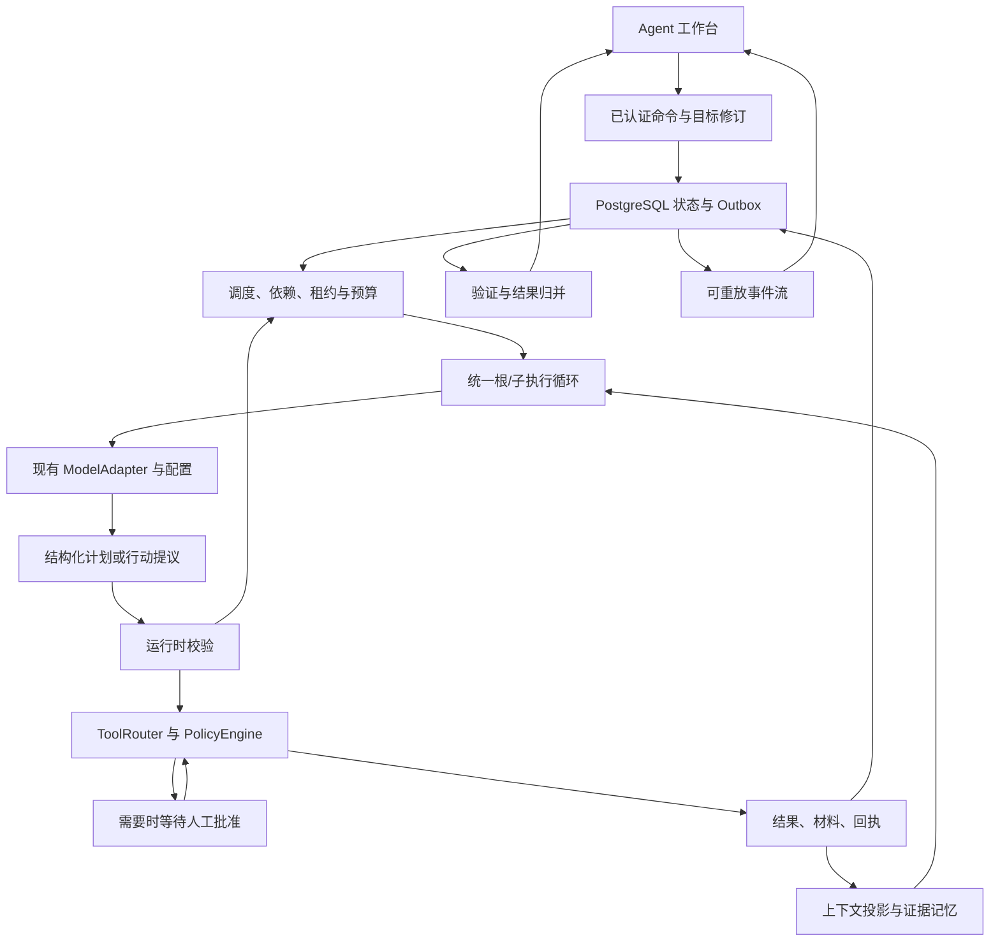

# ApplyMate Agent Harness：从可执行对话到可监督的任务系统

版本：2026-09-09。性质：后续架构与实施计划，尚未实现的能力均为规划。

本计划服务于用户提出的完整目标：Agent 栏目具有长期 session、规划、任务拆分、worker 调度、工具与权限、暂停/恢复、失败重试、状态持久化、事件流、人工审批和可靠结果闭环。它补充现有 V2 roadmap 与 `docs/agent-brain-integration.md`，不另起 Agent V3，也不把一个 PR 的完成等同于整个目标完成。

## 1. 核心判断与当前基线

下一步优先级是：**先让现有 V2 真正驱动执行，再让模型在这条可靠执行链上规划、委派、调整和验证。**

所谓“大脑”应表现为以下可观察能力，而不是一个更长的 system prompt：

1. 将自然语言目标整理成约束、成功条件、已知事实和待解决问题。
2. 选择直接处理、调用工具、委派或请求必要信息。
3. 持续维护计划，根据新证据修改后续工作。
4. 为子任务提供必要上下文、权限和预算，并收回可验证结果。
5. 跨轮次、刷新和重启保留工作状态；恢复时不重复已完成动作。
6. 区分完成、部分完成、失败、等待与外部结果不确定。
7. 用任务、事实、材料和执行回执支持最终结论。

### 1.1 当前证据，不沿用附件中的旧完成度

开发基线为 `e484bd5cb1a8982c0c0ba3aa3af1eb4442588438`，当前集成位于 `codex/ah2-495-agent-brain-supervisor`、Issue #495、草稿 PR #497。附件主要参考 #487 前后的状态，不能直接作为当前完成清单。

| 模块 | 当前可以确认的进展 | 仍欠缺的证明或实现 |
| --- | --- | --- |
| V2 根任务入口 | 消息与 dispatch outbox 原子写入；Worker 注册 canonical consumer/recovery；真实配置的 ModelAdapter 与 ToolRouter 已组合 | 实际 PostgreSQL 与进程重启证明；完整领域能力接入 |
| 模型与用量 | 根执行的可信配置、账户额度准入、幂等结算已有实现与测试 | 子 Task owner/attempt 的准入与整树预算共享 |
| 根/子执行循环 | owner-neutral loop、真实 child executor 与默认关闭的生产启动 seam 已接通 | child queue 实际运行、真实数据库/RLS、重启和父子结果闭环 |
| 结果存储与等待 | 私有工具结果、durable wait 注册、原子 handoff、gated resolver 与恢复 outcome 消费候选已接通 | 迁移应用、真实数据库/RLS、outbox 交付、跨进程重启和真实 child → wait → resume 闭环 |
| Supervisor UI | 共享 timeline、任务树、证据选择、分页已加入；生产构建的桌面/手机中英文 fixture 4/4 通过 | 已登录环境、真实子任务和审批恢复的联调 |
| CI | P0 基线 `28a4bf0` 已通过完整 CI；`9391232` 的 Tests、类型、构建、Harness、浏览器矩阵均已通过 | 真实数据库 dump rehearsal 跳过，不计作数据库证明；之后的修改另行记录检查范围 |
| 上线 | PR 仍为 draft | 未合并、未部署、未应用迁移；未宣称生产已具备完整能力 |

测试、类型检查、浏览器 fixture、真实数据库、真实模型和生产运行分别记录，不能互相替代。上述代码进展来自本任务已有调查和验证，本次规划不重复进行全仓审计。

### 1.2 对附件建议的五处调整

- 接受“模型提出语义行动，runtime 执行控制规则”的核心原则。
- 原生协调工具必须在真实 child executor、wait store 和预算围栏完成后启用；不能先向模型公布未接通的工具。
- 先完成父子任务和持久化 join，再引入一般 DAG。当前最缺的是执行接线，不是更多协议类型。
- 保留 Pipeline 的领域业务能力，逐个迁入受控工具或模板；经过回归和切流后再退出旧调度入口。
- 不承诺所有第三方提交具有严格 exactly-once。内部用原子状态、幂等和 fencing；支持幂等键的第三方使用它；无幂等接口的超时提交进入核实流程，不能盲目重试。

## 2. 目标架构与边界



| 层 | 拥有的职责 | 不应拥有的权力 |
| --- | --- | --- |
| 模型/Planner | 理解目标、提出计划、选择能力、解释取舍、建议重新规划 | 自行批准操作、改身份、改预算上限、宣告数据库完成 |
| Runtime | 状态转换、校验、调度、租约、预算、重试、完成判定 | 凭空补充用户职业事实或替代用户作敏感授权 |
| Tool/Policy | schema、资源范围、权限、审批、执行和回执 | 绕过当前 owner 或信任模型传入的 userId |
| Context | 选择相关事实、历史和证据，控制上下文大小 | 将外部网页指令提升为系统指令，将摘要当作原始事实 |
| Web | 接收命令、呈现执行、审批和材料 review | 在浏览器运行平台密钥，承担长期执行循环 |
| Worker | 执行模型与工具循环、恢复未完成工作 | 成为唯一持有状态的地方 |
| PostgreSQL / Redis | PG 保存权威状态；Redis/BullMQ 分发与加速 | 让消息队列投递成功代替任务执行成功 |

暂不新增 `packages/agent-runtime`。首先在 `apps/worker/src/runtime` 内形成清晰接口；只有第二个真实运行宿主需要复用，且边界已经稳定时，才抽取纯状态机/调度算法。Web 不因此加载 Worker 执行器或 provider 凭据。

## 3. 不可破坏的执行契约

### 3.1 统一身份、独立所有权

- 一个根 Turn 内运行多个子 Task，不制造新的 child Turn，不伪造根 TurnLease。
- 根执行由当前 Turn owner/version/expiry 校验；子执行由实际 Task owner/attempt/expiry 校验。
- 任意写入还必须匹配 user、session、turn、task，且根任务未终止。
- 子任务结果不能修改根 finalResponse、根步骤恢复状态或发出根完成事件。当前并无数据库 activeStep 字段，恢复次序来自 Step 行。
- 根任务 queued/waiting 期间，其他仍持有有效租约的子任务可以继续；根取消或终止会撤销这种资格。
- Step/Item 写入真实 taskId，序号在 Turn 锁内分配，不能用并发进程内计数器。
- 根历史读取保留旧 taskId=null 的兼容行，排除子任务私有行；子结果经过明确 join/message 才进入根上下文。

### 3.2 一次模型循环

```text
校验当前 owner 与中断状态
→ 读取当前目标修订、已认领输入、上下文快照
→ 检查整树剩余额度与上下文上限
→ 持久化 Step / 获取本次 provider 准入
→ 模型提出 typed action
→ schema 与 runtime 校验
→ 工具策略、必要审批、执行
→ 持久化 observation / receipt / items / usage
→ 再次检查取消、租约与目标修订
→ 继续、持久化等待，或提交待验证的完成提议
```

模型输出无效时，在同一步骤的已记录尝试内做有限修复；仍无效则显式失败。不得默认为 proceed。允许的模型 fallback 仍需能力匹配和独立用量准入；不可逆操作开始后不因解析问题换模型重做操作。

### 3.3 等待与恢复

沿用已设计的两阶段交接：先登记 wait，不释放租约；工具回执、items 和 step 持久化后，才执行 fenced suspension transaction。

| 时序 | 必须产生的行为 |
| --- | --- |
| 子任务先完成，父任务尚未登记 wait | 登记时读取已有结果，不丢失完成 |
| wait 已登记，父任务尚未 suspend | resolver 可标记 ready，不抢走父 lease，不提前派发 |
| 父任务 suspend 时结果已 ready | 同一事务释放 ownership、置为可调度并写 outbox |
| 父任务已经等待，结果随后到达 | 对 suspended 且未 consumed 的 wait 原子唤醒 |
| 重复通知、重复 scanner | 不重复创建父执行或消费结果 |
| 父任务恢复 | 在新租约下消费 wait outcome 一次，随后进入下一模型步骤 |

wait 的 outcome 与 `suspendedAt`、`consumedAt` 分别表达结果和交接状态。queue driver 识别已持久化的交接回执，不能再用普通 release 覆盖已 queued 的父任务。

### 3.4 停止、重试与完成

- `agent.interrupt(child)` 仅影响该子树；用户 Stop 根任务才传播至整树。
- Stop 同时作用于 durable state、模型 AbortSignal、浏览器操作和可取消工具；中断中的外部写入按回执核实，不能虚报取消成功。
- 重试保留 Task 身份、attempt 和累计用量。只读瞬时失败可有限重试；权限、预算、schema 持续无效、未知外部结果不能无限重试。
- 进程退出释放执行权以待恢复，不等同用户取消。
- 根 final 必须经过完成检查：没有仍需运行的子任务、没有未处理审批/问题、成功条件满足、关键回执存在。模型的 final 文本本身不是完成凭据。

## 4. 以工作切片推进，而不是一次重写

下表编号是规划中的工作包，不是已经创建的 GitHub Issue/PR。先在 #495/#497 内完成当前验收；之后按单个主分支、单个活动 Issue 的项目流程逐项交付。

| 阶段 | 可交付结果 | 依赖 | 主要验收 |
| --- | --- | --- | --- |
| P0 当前收尾 | 修复 CI、冻结已验证基线与欠缺清单 | 无 | 最新提交 CI；草稿边界准确 |
| P1 真实执行基础 | owner-bound 存储、私有结果、真实 child executor | P0 | 两个真实子任务各自运行模型/工具，不污染根 |
| P2 持久化监督 | 原生协调、等待、恢复、取消、预算与并发 | P1 | spawn → wait → child result → parent resume 跨重启通过 |
| P3 动态计划 | 可验证计划、依赖、重规划、模板选择 | P2 | 同一工具集合根据不同目标产生不同合法执行路径 |
| P4 领域能力迁移 | 搜索/分析/写作/审查/申请通过受控能力执行 | P2；与 P3 联调 | 旧功能回归；不可绕过审批和 provider 准入 |
| P5 长期上下文 | 证据保留的压缩、恢复、可纠正记忆 | P1；P3 提供目标语义 | 长会话压缩和重启后约束、待办、引用完整 |
| P6 完整工作台 | 实时监督、steer、任务操作、审批与材料版本 | 对应后端能力完成后逐项启用 | 已登录环境端到端，双语和移动端 |
| P7 验证与发布 | Verifier/Reducer、评测、故障注入、渐进开放 | P1–P6 | 独立数据库/Worker/模型/浏览器证据与发布门槛 |

P4 的副作用防绕过约束从第一项领域工具迁入时保留。按用户 2026-09-09 的最新要求，开发优先：每个切片仅做能快速发现接线、类型或关键边界错误的检查；真实数据库/RLS、并发故障、进程重启、完整浏览器与跨模块回归集中到 P7 组合验收。验证环境尚未就绪不阻塞后续业务接线，也不能据此宣称已验证。

### 4.1 执行进度口径（2026-09-08 更新）

本计划共 8 个阶段（P0–P7）。只有阶段所需验收全部成立才计为完成；部分实现单独标注。阶段数量比例不等于代码量、工程工时或产品成熟度比例。

当前完整验收 **1/8，12.5%**。P0 已完成：`28a4bf0` 的 [CI](https://github.com/YuanshuoDu/applymate-jobcopilot/actions/runs/34269901452)、[浏览器矩阵](https://github.com/YuanshuoDu/applymate-jobcopilot/actions/runs/34269901309) 和 [Harness contract/build](https://github.com/YuanshuoDu/applymate-jobcopilot/actions/runs/34269901461) 均已成功。真实数据库 dump rehearsal 跳过，不能算数据库验证。

当前推进 P2 的工作包 2B；1A/1B/1C 候选实现已提交，2A 的 durable wait 注册、原子 handoff、resolver/wakeup 和恢复 outcome 消费候选已提交，2B-1 原生协调工具接线和 2B-2 canonical policy fallback 也已提交。真实数据库验证记入最终验收清单。根循环、owner-neutral loop、真实 child executor 门控、wait 闭环和 root 协调工具的源代码基础已形成；真实 child → wait → resume、outbox 交付、跨进程重启与 RLS 证明仍未完成。P6 已有工作台 fixture 证据，但真实子任务和审批联调尚未满足其完整验收。其余阶段保持未完成。后续新提交仍须记录自身验证状态，P0 基线通过不代表未来 head 自动通过。

2026-09-09：1A 已形成经过 Astra Review 和 Luna 返修的候选代码，覆盖真实 owner 传递、存储锁与任务/attempt 校验、全局步骤序号、根历史过滤及租约修复。两组针对性检查曾通过 26 和 29 项；最终锁/lineage 修复后重跑的 8 项及 Worker build 通过，数量有重叠。真实 PostgreSQL 验证尚缺，P1 未完整验收，阶段比例仍为 1/8。详见集成文档中的 Ownership persistence candidate。

额度接近上限时报告：总阶段数、完整验收数与比例、当前工作包、此次新增证据、尚未完成及已提交/推送状态。最高产品验收仍是目标驱动的真实规划、执行、证据反馈和重新规划，而不是界面或状态字段数量。

开发顺序已完成 P3 首个目标驱动接线候选、P3-3 accepted intent materializer、P3-4 runtime execution adapter、P3-5 owner-neutral loop hook、P3-6a TurnEngine/canonical runtime gate、P3-6b 默认 server-owned bridge、P3-7 runtime-owned input hydration/有界 plan observation 持久化和 P3-8 原子批量写入候选，下一片是 durable plan revisions、outbox/queue delivery 与 recovery。2B-1/2B-2 的原生协调工具和 server-side policy gate 仍关闭，P3 planning gate 也默认关闭，且未宣称 child 真实执行。1A 的 PostgreSQL/并发/RLS 欠账不作为启动这些开发工作的前置门槛；已实现、快速检查通过、完整验收通过分别记录。2026-09-09 的有界环境探查确认本机 Docker backend 不可用，未创建数据库或运行迁移；不继续排查宿主环境。最终可采用隔离 CI PostgreSQL service 做集成证明。

1B 随后的候选代码已接入根运行时：大工具最终结果写入私有存储，实际 registry 注册分块读取，根 Task 创建后绑定当前 owner；输入/进度和异常使用有界清理结果。Astra Review 发现的异常返回绕过路径已由 Luna 修正。初始相关组 14 项、修正后的 router 组 9 项与 Worker 编译通过；真实数据库/跨进程读取延后验证。

1C-A1（2026-09-09）已完成候选实现：Worker/Web usage admission 接受明确的 root/child owner envelope；根可使用真实 root Task Step 或旧 null-task 兼容行，child 必须通过同一树、当前 attempt、租约、状态和 streaming Step 校验。混合身份在 bridge、route、broker normalization 均 fail closed。Web admission 13/13、Worker bridge 5/5、shared package build 及 diff check 通过。生产 child executor、整树持久化预算和 consumer 注册仍未实现，阶段完整验收仍为 1/8；下一包为 1C-B（共享树预算与真实 child executor）。

1C-B/C1/C2（2026-09-09）已形成候选实现：树步骤预算账本、真实 child executor 以及默认关闭的生产 child queue seam 已接通；child 只获得 owner/policy 允许的读取能力，并保留私有结果读取边界。C1 focused 31 项、C2 focused 17 项及 Worker/shared 编译检查通过；真实 PostgreSQL/RLS、队列运行、重启和父子结果闭环仍未证明。

2A-C3-A/B1/B2/C/D（2026-09-09）已形成候选实现：durable wait 注册/resolve/cancel、合法等待回执的 TurnEngine 停止、带 user/session/root/step/lease fence 的原子 suspend/requeue handoff、按 active Turn 运行的 resolver/wakeup，以及新租约下的 bounded/redacted wait outcome 一次性消费已接入 canonical state；resolver 与 consumer 共用 child executor + wait resolver 双门控，默认路径不查询新 wait 表。C3-A focused 8 项、B1 相关 loop/store/child 16 项、B2 handoff/queue/store/loop/bootstrap 31 项、C3-C resolver/bootstrap/store/queue 27 项、C3-D consumer/state/handoff 17 项通过；随后组合相关 Worker 检查 41 项、Worker TypeScript 与 diff checks 通过。当前仍缺原生协调工具正式接线、outbox 交付后的真实父恢复、真实 child → wait → resume、PostgreSQL/RLS、并发、跨进程/重启证据，因此 P2 尚未完成。

2A-C3-D 提交 `c7e1a45`（2026-09-09）已推送到当前分支：`loadCanonicalTurnState` 只有在显式 `consumeWaitOutcomes` 下消费 wait；生产入口与 resolver 使用 `ENABLE_AGENT_CHILD_EXECUTION=1`、`ENABLE_AGENT_WAIT_RESOLVER=1` 双门控。消费校验当前 root Turn lease、step attempt/status、父子树和租户；每个 child result 经过 redaction 与 8KB 上限，wait 的 request 保留在原 JSON 中，outcome 通过稳定 observation ID 进入下一模型上下文。此次未应用迁移，未运行真实数据库、队列投递或重启测试。

2B-1 提交 `f923b7a`（2026-09-09）已推送到当前分支：canonical root runtime 在双门控开启时才注册并向模型公布 `spawn_subagent`、`send_message`、`wait_subagents`、`list_subagents`、`interrupt_subagent`、`close_subagent` 六个现有工具；`canManageChildren` 由 server gate 补入并在 gate 关闭时剥离，child runtime 仍不获得协调工具。canonical runtime/tool registry focused 11 项、Worker TypeScript 与 diff checks 通过。此次只证明工具接线和模型可见性，不证明真实 child 或 wait 恢复。

2B-2 提交 `d21bccb`（2026-09-09）已推送到当前分支：canonical root 使用 scoped policy adapter；缺少显式 `PolicySnapshot` 时，双门控 fallback 只允许 orchestrator 使用六个协调工具和安全 read baseline，非协调写入继续拒绝。旧的 `role/capabilities` 元数据保持兼容；显式有效策略保持权威，带有不完整 `version`/`rules` 的策略 fail closed；gate 关闭继续使用默认只读策略。canonical policy/runtime/tool registry 组合 17 项 focused tests、Worker TypeScript 与 diff checks 通过。此次没有 Web 策略迁移、数据库迁移、真实 PostgreSQL/RLS、provider、队列或重启证明。

P3-1 提交 `b7924df6`（2026-09-09）已推送到当前分支：新增纯 `GoalContract`、`PlanProposal`、确定性计划校验和 runtime intent 转换。模型输入必须是有界 plain JSON；身份、租约、能力、硬预算及外部写入字段被拒绝；校验包含 goal/plan revision CAS、allowlist、节点唯一、依赖存在/自引用/环、重复语义委派与规范化副本。P3-1 focused suite 为 15 项，Worker TypeScript 与 diff checks 通过；没有接入 canonical loop 或持久化。

P3-2 提交 `86304046`（2026-09-09）已推送到当前分支：新增 `agent.plan.propose`，仅在 server-owned `planningEnabled` gate 开启时注册并公布给 canonical root。它接收严格 `{ proposal }` envelope，按服务端目标、只读工具、模板和 `scout|analyst` 角色 allowlist 做 CAS 校验，接受后在本次 tool runtime 闭包内递增 plan revision，返回规范化 proposal 与语义 intents；不生成 task、lease、user、idempotency 或硬预算字段，也不自动 dispatch。`canPlan` 由 gate 注入，模型快照不能伪造开启；显式 policy 仍权威。P3-1/P3-2 相关 7 个文件共 38 项 focused tests、Worker TypeScript 与 diff checks 通过。该 gate 默认关闭，revision 仍是进程内候选，intent 执行、持久化计划、child 调度与重启恢复留待下一片。

P3-3 提交 `81ae0df9`（2026-09-09）已推送到当前分支：新增纯 `dispatchPlanProposal` materializer。它重新执行确定性计划校验，按依赖输出稳定命令顺序，由 runtime callback 生成工具版本、调用 ID、委派幂等键、输入引用和角色能力；委派命令固定为受控 `spawn_subagent@1` 形状，计划依赖与任务 lineage 分开。人工输入和完成提议形成 control barrier，不物化其后的节点；工具、委派与回执字段仍不含模型可伪造的 user/task/lease/hard-budget 信息。focused dispatcher 4 项、Worker TypeScript 与 diff checks 通过；此次没有执行 ToolRouter、创建 child、持久化 revision 或宣称真实恢复闭环。

P3-4 提交 `2471c8cd`（2026-09-09）已推送到当前分支：新增纯 `executePlanCommands` runtime adapter。它要求每个可执行命令的 `ToolRouterContext` 由服务端 callback 提供，tool/delegate 统一调用现有 router，并校验返回的 id、tool、version、status 和 error 字段；failed/cancelled 停止后续节点，人工输入/完成提议返回 blocked 且不调用 router。命令数量最多 `PLAN_MAX_NODES`，router JSON 结果最多 8 KiB，非法命令、缺 runtime port、非 JSON 或越界回执 fail closed；adapter 不生成 task、lease、user 或预算字段。focused adapter 5 项、Worker TypeScript 与 diff checks 通过；canonical loop 接入、结果持久化、durable plan revision、queue 和真实 child → wait → resume 仍留待下一片。

P3-5 提交 `419a928f`（2026-09-09）已推送到当前分支：在 owner-neutral `runTurnExecutionLoop` 增加可选 server-owned `executePlan` hook。只有非 replay、已完成的 `agent.plan.propose` 调用才触发 hook；普通 proposal tool observation 保留，hook 最多追加 8 个有界 JSON observation 给下一次模型，显式 approval/user/dependency wait 映射到既有 TurnEngine wait 状态；重复 ID、8 KiB 超限、非法 JSON/wait 或 hook 异常 fail closed。无 hook 维持旧行为，replay 不重复副作用。focused loop 13 项、Worker TypeScript 与 diff checks 通过；TurnEngineOptions/canonical runtime 暴露、真实 dispatcher/adapter 调用和 durable outcome 仍待下一片。

P3-6a 提交 `77a42427`（2026-09-09）已推送到当前分支：将 P3-5 hook contract 提升为共享 `TurnEnginePlanExecutionHook`，加入 `TurnEngineOptions.executePlan`，并在 canonical runtime 增加独立 `planningExecutionEnabled` 与 server-owned `planExecutionFactory`。只有 planning gate 和 execution gate 同时开启且 factory 返回 hook 时才注入；gate 关闭、单门控或无 factory 继续旧路径。TurnEngine/canonical runtime focused 20 项、Worker TypeScript 与 diff checks 通过；没有默认 bridge、dispatcher、数据库、队列、provider 或 child 执行。

P3-6b 提交 `c7ee291a`（2026-09-09）已推送到当前分支：canonical runtime 在双重 planning gate 开启时默认构造 server-owned `createCanonicalPlanExecutionFactory`，也允许服务端显式 override。bridge 对 accepted plan envelope、goal/plan revision、plain JSON 和 payload 做边界校验，使用 registry 解析只读工具版本与 delegate actions，使用服务端 scope、task、root task、lease、step 和 actor context 生成调用信息，并复用 P3-3 dispatcher 与 P3-4 adapter 执行。命令回执、失败、控制和显式等待以有界 observation 返回下一模型步；`request_input` 进入 `waiting_for_user`，ToolRouter 产生的策略审批仍进入 `waiting_for_approval`，`propose_completion` 只作为反馈不会自动完成。非空 inputRefs 在 runtime resolver 接入前 fail closed，避免猜测数据 schema。Bridge、canonical runtime、TurnEngine 与 loop 组合父级重跑 38 项、Worker TypeScript 与 diff checks 通过；此次仍没有 durable plan revision/outcome、数据库/队列/provider/真实 child→wait→resume 或重启证明。

P3-7 提交 `591c7d2f`（2026-09-09）已推送到当前分支：canonical plan bridge 现在只从 server-supplied snapshot 的精确 observation ID 解析 `inputRefs`，优先读取 observation `output`，要求 plain JSON object，并对缺失、非对象、冲突和同计划 local ID 引用 fail closed。owner-neutral loop 在验证后逐条写入有界 `plan.observation` 事件；canonical state loader 在 tenant/session/turn/root-task 范围内恢复这些事件，限制 256 字符 observation ID、8 KiB UTF-8 内容并对 snapshot/event/tool observations 去重。持久化失败会显式使 Turn failed，不会伪装成功。Worker focused checks 为 27/27，agent-protocol event checks 为 2/2，agent-protocol build、Worker TypeScript 与 diff checks 通过。逐条 append 的 partial crash recovery 已由 P3-8 的原子批量写入候选处理；durable plan revisions、outbox/queue/recovery 及 PostgreSQL/RLS、provider、真实 child→wait→resume、restart 证据仍待最终验收。

P3-8 提交 `4f91a631`（2026-09-09）已推送到当前分支：新增可选 `appendEvents(batch)` seam，并贯通 TurnEngine store contract、root TurnEngine、production child adapter、owner-neutral loop 与事件 writer。计划 observations 在同一租户事务中持有 owner/Turn fence，逐条校验 replay idempotency 与 task/step/attempt lineage，维护 effective causation、session event sequence 和每条 event outbox；混合新旧 batch 可修复缺失 outbox，新 outbox 冲突或后续写入失败会整批回滚，subscriber 只在事务提交后收到通知。P3-8 focused Worker checks 为 40/40，Worker TypeScript、shared package build 与 diff checks 通过。P3-8 仍是候选实现，不计入完整阶段完成；真实 PostgreSQL/RLS、migration、provider、queue、restart、durable plan revisions 和真实 child→wait→resume 仍未证明。

### 4.2 用户可观察的交付节点

八个工程阶段按依赖实施；每次演示同时回答“它现在能替用户完成什么”。下列节点不增加阶段数量，也不表示相关能力已经实现。

| 节点 | 用户能够观察到的变化 | 必须保留的证明 |
| --- | --- | --- |
| P1–P2 结束 | 一个请求可以委派两个独立任务；关闭页面、重启 Worker 后继续等结果 | 实际 task/attempt、持久化结果、恢复前后事件、唯一父任务归并 |
| P3 首个切片 | 同一 Agent 根据目标选择直接回答、检索或委派；收到不足或矛盾证据时修改计划 | 已接受的目标和计划版本、选取的行动、工具反馈、修订原因、引用 |
| P3–P4 组合 | “比较职位”和“准备申请材料”触发不同流程；Reviewer 能退回指定材料版本修正 | 各任务输入输出、材料版本、审查意见、修正结果；无依据的职业信息不进入材料 |
| P5 结束 | 长会话或换模型后仍记得限制、进展和待批准内容；用户纠正旧事实会生效 | 压缩前后约束对照、可解析证据、事实修订和恢复测试 |
| P6–P7 结束 | 用户在工作台干预、审批、继续，并能核对最终完成与未完成项目 | 真实命令消费、审批版本、执行回执、可追溯统计和异常恢复证据 |

P3 的第一个切片只使用已接通的少量只读能力，不等待所有求职工具迁移、通用 DAG 或完整记忆系统完成。它必须尽早证明目标驱动的决策和反馈调整，随后再扩展任务种类。实施工时要在各工作包的接口调查后估算；不根据源码行数或 Agent 数量承诺日期。

## 5. P1–P2：先得到一个真的能带队执行的根 Agent

### 工作包 1A：根/子持久化所有权

现有入口：`apps/worker/src/runtime/execution-owner.ts`、`turns/turn-engine-store.ts`、`turns/turn-execution-*.ts`、`subagents/pg-store.ts`、`subagents/root-task-store.ts`。

具体工作：

- 绑定 root/child store adapter；每次 step、item、event 和结果写入均执行真实 owner 检查。
- 在数据库内分配 Turn 全局序号，保留 child 的逻辑 step/attempt 身份。
- 修正 root history、预算恢复和 context rebuild 的查询范围。
- 把根终结权限与子结果落库分开，禁止 child adapter 调用根终结。

数据库策略：优先复用现有表与字段。需要额外索引或约束时附查询证据，采用附加迁移；不重置历史 Turn，不改变现有 source 枚举绕过限制。

验收：并发两个 child 的序号不冲突；过期 owner 写入被拒绝；新 attempt 接管后旧结果不可提交；根恢复排除 child 私有观察；不同用户/session 不可互读。

### 工作包 1B：私有工具结果真正接入

现有入口：`tools/tool-result-reference-repo.ts`、`tool-result-reference-types.ts`、`tool-results-read-tool.ts`，以及本分支已准备的 `20260908030000_add_agent_tool_result_references` 迁移。

具体工作：

- 替换 lifecycle 中工具最终输出的进程内引用，使用已清理、可校验的 durable JSON。沿用真实 `(stepId, toolCallId)` 唯一身份；输入、进度和抛出异常的事件保留有界摘要及明确截断信息，不占用或覆盖最终结果，不生成无法跨进程读取的引用。
- 引用绑定 task/step/toolCall 身份；相同操作重复写入必须返回同一结果，冲突内容不能静默覆盖。
- 在真实 registry 中启用有权限校验的分块读取工具。
- 保持当前设计上限：单结果 canonical JSON 1 MiB；读取响应最多 4,096 bytes；超限显式报错，不悄悄丢证据。
- 根可按权限读取同一用户/session 的既往结果；子任务仅能读取当前任务及允许的后代，不能读取兄弟私有结果。

验收：保存后销毁执行器，再创建新执行器仍可读取；跨 owner/用户/session 和伪造引用拒绝；JSONB 往返后 hash/大小验证一致；Unicode 分块不损坏。

### 工作包 1C：真实子执行器与账户预算

现有入口：`subagents/executor.ts`、`subagents/manager.ts`、`subagents/role-profiles.ts`、`subagents/role-policy.ts`、`turns/turn-execution-loop.ts` 与已接入的 Web internal usage broker。

2026-09-09 的接线调查将此包拆为几个可提交切片：先扩展 Worker/Web 的子任务账户准入身份；随后补充共享树预算预留、按 child attempt 认领输入/构建上下文和真实模型/工具执行器；最后在 production bootstrap 中注册。现有 `StepContextBuilder` 的输入认领只有根 Turn leaseVersion，不能直接当作 child attempt fence 使用；现有 `ai_budgets` 约束账户额度，但尚无独立的持久化整树预留来源。子任务沿用父 `budgetSnapshot` 不能被解释为获得另一份可独立花完的额度。只完成准入身份切片时，生产 child consumer 仍保持未启用。

具体工作：

- 子任务认领真实 Task lease，加载冻结的目标、policy/model/context/budget snapshot。
- 调用与根相同的模型/工具循环，向本 Task 写入结果。
- 将账户准入从仅根 Turn fence 扩展到 child owner/attempt fence。
- 整树预算从同一账本预留、结算；创建子任务不复制一份可独立花完的根额度。
- provider 已被调用但结果/结算未知时保留 reservation，不能重试出第二次免费或重复调用。

验收：两个子任务分别完成真实工具观察循环；根等待期间 child 仍可被准入；并发预留总额不越界；retry 不清零累计用量；子任务不能扩大工具范围或更换其他用户凭据。

### 工作包 2A：持久化 wait、唤醒与恢复

现有入口：`tools/coordination-types.ts`、`coordination-executors.ts`、subagent store/queue/recovery 和已准备的 AgentWaitCondition。建议新增实现位于 `apps/worker/src/runtime/subagents/`，最终文件由 Luna 按单一职责拆分。

具体工作：按第 3.3 节实现 register → receipt → suspend → resolve → outbox → consume；scanner 用持久化状态补偿中断；wait 只接受授权范围内、无自依赖/循环的有限目标集合。

验收：两个 read child 的真实组合；all/any；早完成；重复唤醒；失败 child；超时；停止；父/子 lease loss；suspend 前后进程退出；恢复不重跑已完成 tool。

### 工作包 2B：原生协调工具与容量控制

现有入口：`tools/coordination-tools.ts`、`coordination-executors.ts`、`subagents/limiter.ts`、manager、mailbox、production bootstrap。沿用现有协议标识；以下名称表达目标语义，若已有等价名称则不重复新增。

| 工具语义 | 返回与边界 |
| --- | --- |
| `agent.spawn` | 返回 durable taskId/path/status；校验模板、上下文、深度、预算、权限和幂等键 |
| `agent.send` | 给运行任务投递持久化 steering；只在安全边界消费，不伪装为中途已执行 |
| `agent.followup` | 对终态任务创建新的可追溯工作修订；保留旧结果，不把完成过的外部操作自动重跑 |
| `agent.wait` | all/any、目标集合、期限；通过 durable handoff 释放容量 |
| `agent.interrupt` | 当前子树中断；未核实的外部结果保持 uncertain |
| `agent.list` | 有范围和分页的实际状态、剩余容量与结果引用 |

初始产品参数建议：同 session 同时最多 2 个执行中的 child、深度最多 2、单轮最多创建 8 个 child；通过并发/预算测试后再评估放宽至 4。模型额度、浏览器容量和 external-write lock 分开计算，用户级限额之外还要有全局限额与公平排队。等待中的任务不占执行 slot。具体时间、token、费用上限从现有套餐与运行配置读取，禁止在 prompt 中代替硬限制。

这组产品运行参数与开发协作分开：本次开发始终最多一个 Luna worker，不能因为产品支持并发就启动多个开发子智能体。

退出 P2 的最小演示：根提出两个搜索任务，两个真实 child 使用各自上下文和工具运行；根持久化等待并释放容量；重启 Worker；两份结果回到根；根引用证据给出结果一次。UI 中看到的状态必须来自这条链路。

## 6. P3：让 Agent 会规划、分工和修正

### 6.1 目标契约与计划提议

建议建立以下逻辑契约，先映射现有 typed item/task/snapshot，不能直接据此新增同名数据表：

```text
GoalContract
  objective / revision
  constraints[] / successCriteria[]
  knownFacts[] / unresolvedQuestions[]
  approvalBoundaries[] / budgetRef

PlanProposal
  basedOnGoalRevision / basedOnPlanRevision
  nodes[{ localId, templateOrTool, objective, inputRefs,
          dependsOn, successCriteria, outputSchemaRef, budgetRequest }]
  completionCriteria / briefRationale

TaskResult
  taskId / attempt / goalRevision
  outcome / evidenceRefs / artifactRefs
  verifiedFacts / conflicts / failures / nextOptions
```

模型只提供提议；身份、实际 taskId、权限、可花预算和实际状态由 runtime 填充。

首次目标解析要区分必须询问与可自主决定的内容。例如“20 个 Dublin/remote Java 职位”可自主拆分搜索；工作许可、签证状态、薪资底线或最终提交授权缺失时不能代填。小型任务直接执行，不强制为每次问答建立复杂计划。

### 6.2 计划校验与有限依赖图

第一版支持明确的前置依赖、all/any join、失败处理策略以及人工审批屏障。任务树表达谁委派谁，dependency 表达谁等待谁，两者分开校验。

运行时检查：引用存在、同租户/session、无循环、规模有界、工具与模板存在、输出可满足下游输入、预算合法、审批边界未被绕过。

父子等待使用已实现的 wait 机制。若跨父任务依赖确实需要持久化 edge，才准备最小附加结构；不得仅把 dependsOn 放进模型 JSON 后靠内存调度。

### 6.3 重新规划

触发来自具体事实：结果不足、证据矛盾、某来源失败、用户变更约束、审批拒绝或预算缩小。用 progress signature 防止同一失败反复产生同一计划。

- 新计划绑定旧 revision，compare-and-swap 接受；过时提议拒绝。
- 已完成节点和外部回执不可改写；新工作引用旧结果。
- 只替换受影响的未开始工作；对运行中的任务发送明确 steering 或停止。
- 约束改变后，旧结果可保留为历史，但不能继续标记为满足新目标。
- 无进展重试达到硬上限后，进入 blocked/需要输入，而不是不停“反思”。

示例：“只考虑 Dublin”改成“只考虑 Ireland remote”，只使地点筛选、评分和受影响材料失效；不必重新抓取仍然有效的全部 JD。签证信息冲突时先做证据核查，不扩大无关搜索。

### 6.4 模板迁移

复用 `subagents/role-profiles.ts`、role contracts/handlers 和现有 Scout/Analyst/Writer/Reviewer/Executor/Auditor 业务实现。模板包含描述、输入/输出 schema、允许工具、上下文选择、能力要求、成功条件和预算默认值。

CustomAgent 逐步迁出 `insertAfter` 的固定插入模式；旧配置通过兼容模板映射，不能删除用户已保存配置。自定义 prompt 可以提供专业方法，不能修改用户身份、审批或预算规则。

验收：同样工具下，“解释一个 JD”“比较三家公司”“准备五份申请材料”采用不同规模和依赖的计划；额外派 Agent 必须由独立任务收益支持。伪造工具、循环依赖、越权输入、重复 spawn、过时 revision 和提前 final 都被拒绝。

### 6.5 第一个“会调整计划”的演示与评测

首个垂直切片沿用已经可运行的 root/child executor、ModelAdapter、ToolRouter、wait 和结果引用，只新增目标/计划提议的校验与接线。模型可以提出 `use_tool`、`delegate`、`revise_plan`、`request_input`、`propose_completion` 等语义；最终协议映射到现有 typed action，不额外建立平行命令系统。用户看到的是简短决策说明、行动和证据。

固定验收目标示例：“找 5 个适合我的 Ireland remote Java 后端职位，列出匹配依据；签证支持没有证据就标为未知。”数字是这个测试目标的成功条件，不是产品默认搜索上限。

| 输入或反馈变化 | 应观察到的决策 | 拒绝的行为 |
| --- | --- | --- |
| 只要求解释一个已给出的 JD | 在现有资料充分时直接分析 | 无收益地创建多个 worker |
| 两个独立合法来源可补足结果 | 在容量和预算内拆分检索，再去重归并 | 给每个 child 复制完整预算或跨范围资料 |
| 第一轮只有 2 个有效职位 | 保存这 2 个结果，针对缺口选择其他已授权来源；没有可用来源时报告部分完成 | 原样重复同一搜索，或把不足 5 个宣告为目标完成 |
| 两份资料对签证支持互相矛盾 | 保留冲突，核查更直接的来源；无法核实则标未知 | 为凑够结果自动推断签证支持 |
| 用户把地域改为 Dublin onsite | 记录新目标版本，重新判断受影响结果与待执行任务 | 继续按旧约束生成材料或使用旧批准 |
| 重规划连续没有新增有效结果 | 到达持久化的无进展/预算上限后停止，并解释已完成和缺口 | 无限反思、重试或递归派工 |

先用确定性 provider 驱动同一生产执行组合，证明状态和调度正确；再用现有 API 配置做有预算上限的真实模型评测，证明模型确实能产生合适决策。前者不能替代后者，也不能只用关键词路由的固定测试脚本声称模型具备规划能力。两类结果分别记录模型配置、输入版本、计划与修订、工具证据、用量和是否满足成功条件。

此切片通过前不扩展更多角色或规划抽象。若模型经常给出无效或无收益的计划，先调整能力描述、输入上下文、输出 schema 和有界修复策略；不要用更多并行模型调用掩盖问题。

## 7. P4：把已有求职能力变成大脑的可调用能力

迁移入口包括 `apps/web/src/lib/agent/pipeline.ts`、`orchestrator.ts`、`stages/`，Worker 的 role handlers 与现有 typed tool registry；不要另造一份求职业务逻辑。

建议先接入 read 工具：职位发现、JD 获取、用户已验证资料检索、职位事实/匹配解释；再接可恢复的材料草稿；最后接审批后的上传、发送与申请执行。

每个领域能力的交付同时回答四件事：输入来自哪里、模型如何准入、权限在哪里执行、输出凭什么判定成功。

- 所有 Harness 模型调用逐步迁入已有 `packages/agent-model`，保留 capability-aware 选择、取消、usage 与 continuation；不硬编码具体模型名做修复。
- 旧 `modelChat()` 调用仅在迁移过渡边界保留并可观测；新 Harness 路径不得直接调用它绕过准入。
- “准备材料”产出不可变版本与来源引用；业务方法成功返回不等于“已申请”。
- 逐条核对所有 upload/send/submit/update 路径都经过 ToolRouter/Policy、当前权限与必要的 reservation/approval/receipt。
- 旧 Pipeline 可先作为受控模板编排，以保持行为兼容；动态计划逐步接管已验收能力。禁止一次性删除旧路径后再补业务回归。

副作用状态至少在语义上区分 prepared、awaiting approval、reserved、executing、succeeded、failed、uncertain；优先映射现有 schema。执行前核对 resource/material/answers hash、revision、expiry 与 nonce；用户改材料后旧授权失效。

对没有幂等接口的 ATS：执行前落库意图，执行后落回执；如果在外部成功与本地回执之间崩溃，必须查询外部证据或进入人工核实，不能自动重新提交。目标是避免重复和虚假成功，并准确表达未知结果。

## 8. P5：长期上下文与可纠正记忆

现有入口：`apps/worker/src/runtime/context/step-context-builder.ts`、`context-snapshot-*.ts`，配合私有结果引用、已有 facts 与 artifact store。

### 8.1 分层上下文

| 层 | 内容 | 规则 |
| --- | --- | --- |
| 固定约束 | 当前用户要求、权限、执行限制 | 不因压缩或子模型建议而丢失 |
| 当前任务 | goal/plan revision、成功条件、依赖、待办 | 必须与实际状态一致 |
| 已验证事实 | 有来源的职业经历、技能、职位事实 | 事实与推断分开；保留版本和来源 |
| 当前证据 | 有关工具结果、材料、子任务返回 | 用引用和有界摘录，保留原始证据 |
| 近期交互 | 当前行动相关的用户输入和回复 | 优先保留 steering 与未回答问题 |
| 历史摘要 | 决策、已完成、失败、遗漏范围 | 有覆盖范围和 checksum，可重建 |

Child 默认只接收 task contract、必要事实与引用、允许工具和限制。完整聊天复制是有理由才采用的例外。

### 8.2 压缩协议

采用所选模型的可用 context window，预留输出和工具结果空间；在 runtime 达到预算阈值时触发，不依赖模型自己察觉。阈值为配置，需用真实 token accounting 校准。

压缩产物至少包括 activeGoals、constraints、decisions、unresolvedQuestions、verifiedFacts、taskRefs、artifactRefs、eventRefs、omittedRanges 和 covered sequence。安装快照使用明确源 revision/sequence；压缩期间到达的新输入随后补入，不能被覆盖。

摘要通过引用存在性、未完成任务、审批和用户约束保留检查后才安装。失败时沿用旧有效快照或显式缩小可选上下文；不能用损坏摘要替换历史。原始事件保持不可变。

### 8.3 记忆不是自动把所有文本变成事实

区分 session memory 与长期候选人事实。长期事实记录来源、确认程度、更新时间和纠正/删除状态；用户明确改正应优先于旧摘要。签证、工作授权和经历内容不能从模型猜测升级为已验证事实。网页、JD、邮件及工具输出保持 untrusted data 标签。

第一版先用既有结构化事实与按范围检索，不因为“记忆”二字就引入向量数据库。只有固定评测证明检索不足时再增加检索能力。

验收：长会话强制压缩、多次压缩、模型切换、Worker 重启、session fork 后均保留目标与待审批项；材料引用可解析；事实纠正生效；不同用户的数据和记忆完全隔离；fork 不复制可消费的授权或外部 reservation。

## 9. P6：用户能看懂、能干预的 Supervisor

现有入口：`apps/web/src/components/pages/AgentPlaygroundPage.tsx`、`components/agent-workspace/v2/AgentSupervisorPanel.tsx`、共享 timeline 与 `e2e/agent-supervisor.spec.ts`。

桌面维持 sessions / 主对话 / tasks 三栏。移动端用抽屉或分区切换，保证输入、待批准事项和停止操作可访问。

| 用户需求 | 必须连接的真实行为 |
| --- | --- |
| 看它在做什么 | 当前目标/plan revision、执行中任务、等待原因、已完成数量与 evidence |
| 查看子任务 | goal、输入引用、状态、模型配置摘要、权限、预算、messages、结果和错误 |
| 中途补充要求 | steer 命令持久化、显示已接收/待消费/已应用，不把发出当作已应用 |
| 停止一个任务 | scoped subtree interrupt，不误停兄弟任务 |
| 稍后继续 | durable pause/wait/resume，刷新后状态不丢失 |
| 重试或继续修改 | 展示允许重试的原因与 attempt；follow-up 保留旧结果与版本 |
| 审批 | 当前材料/答案版本、变化、作用范围、批准或拒绝后真实恢复 |
| 看材料 | 每个职位独立 Application Workspace，版本/来源/审查状态明确 |
| 看成本 | 已知用量、预留量、预算余量及未结算状态；未知值不显示成零 |

显示简短、可核对的行动理由和决策记录，例如“公司页面未明确签证支持，正在核查”；不设计依赖 provider 私有思维链的功能，也不制造虚假的 thinking 动画证明执行。

只启用已经有真实命令处理器的按钮。状态来自同一共享订阅；生命周期事件触发合并刷新，不在每个 token 上反复请求全部任务。切 session 时取消旧请求、丢弃旧事件与选中项。

材料版本以 job/workspace 隔离：并行 Writer 写各自 draft，Reviewer 审查固定版本；Executor 只能消费当前授权匹配的不可变版本。共享候选人事实的修改应显式版本化，不能让一个职位的 tailoring 改掉全局履历。

## 10. P7：Verifier、Reducer 和能力评测

复用已有 `subagents/partial-failure-reducer.ts`、`aggregation.ts`、`role-results.ts`、auditor/reviewer 契约；先界定职责，不新造同名层。

Verifier 先做确定性检查：成功条件、schema、引用、版本、任务状态、必需回执、审批有效性。需要事实质量判断时再调用模型，输出引用与置信度；不能只让同一段生成文本“自评通过”。

Reducer 从 TaskResults、ToolReceipts、Artifacts、VerifiedFacts、Failures、PendingApprovals 汇总。数量从数据库或结构化结果计算，模型负责说明意义和下一步；每个关键数字可点回证据。

### 10.1 验收场景

以下是必须建立的测试集合，不是当前已经全部通过的声明：

| 类别 | 关键场景 |
| --- | --- |
| 会话 | 新消息 dispatch、重复命令、reload、跨轮次恢复、session 切换隔离 |
| 子任务 | 两 child 真执行、不同上下文、深度/并发上限、目标结果 schema 错误 |
| 等待 | 早完成、all/any、重复 wakeup、timeout、parent suspend 两侧崩溃 |
| 所有权 | lease loss、late worker、attempt 接管、根取消、仅中断一个子树 |
| 计划 | DAG cycle、未授权工具、过时 revision、用户改要求、无进展循环 |
| 预算 | 并发预留、provider 超时、重复结算、BYOK/platform 区分、retry 不重置 |
| 上下文 | overflow、压缩失败、未决审批保留、引用失效、事实纠正、外部提示注入 |
| 审批/提交 | 拒绝、过期、材料改变、重复批准、外部结果未知、禁止盲目重复提交 |
| UI | 中英文、桌面/手机、共享订阅、重连、选中任务证据、错误与等待可解释 |
| 回归 | Jobs、Resume、Settings、Extension assisted fill、旧 automation 与用户隔离 |

### 10.2 证据层级与拟定指标

1. 单元与组件测试：纯函数、schema、policy、projection 和事务边界。
2. 真实本地/隔离 PostgreSQL、Redis、Worker 集成：RLS、并发、outbox 和重启。
3. 浏览器 fixture：布局与交互，API 用固定数据。
4. 已登录 staging：真实命令到 Worker 到 UI 的组合链路。
5. 有预算限制的真实 provider 评测：检验实际计划质量与工具使用，不自动做真实申请。
6. 单独明确授权的外部提交核实：与普通开发测试分开记录。

拟定发布门槛：确定性身份/审批/重复执行用例全部通过；核心组合链路没有缺失 consumer/依赖；固定评测集的完成质量不低于旧流程，且成本/延迟可解释。建议先整理 20 个代表性目标作为回归样本，扩充后再设置统计比例门槛，不宣称已有成功率。

记录每个成功任务的模型调用数、输入/输出 tokens、已知费用、工具数、elapsed time、等待恢复时间、重试数和人工介入次数。按有用结果比较成本，不按“启动多少 Agent”评价聪明程度。

## 11. 省额度的工程与产品策略

### 开发协作

- Astra 负责理解、架构、拆分、风险和最终 Review；读代码、实现、debug、类型修复、测试交给显式 Luna xhigh。
- 同时最多一个 Luna；复用当前 worker，但新任务给精简上下文与准确路径，不复制全部历史。
- 每项任务优先完成真实执行接线；Astra 仅根据具体发现返修，不为等待完整验证停下下一项开发。
- 快速检查按变更选择：少量相关测试或一次受影响 package 的类型/build 检查；不机械地重复两者。已有测试夹具引起类型错误时才针对性修复。
- 实际数据库/RLS、并发、故障恢复、完整 UI 和跨模块回归集中到最终联调；沿途维护欠账清单。省略验证必须明确记录，不能用代码已提交代替验收通过。
- 不因额度不足改用其他子智能体模型，不自动兑换额度重置；保存可恢复的已知状态。

### 产品运行

- 简单问题直接回答，纯计算用代码，独立且有收益的任务才 spawn。
- 使用已配置模型的能力与预算要求；不把 Codex UI 中的模型标签硬编码为公开 API model ID。
- 根模型承担语义规划和归并，子任务采用满足能力的已配置模型；不新加 provider。
- 先批量检索和确定性去重，再对有价值候选做深度分析和材料生成。
- Child selective context，工具大结果用引用，缓存绑定内容/版本/权限与必要 TTL。
- 同一目标修订下可复用仍有效的结果；隐私上下文和授权不得跨租户共享缓存。
- 预算为硬限制。UI 明确展示为什么等待或停止，不能用便宜但不具备必要能力的模型偷偷降级。

## 12. 可直接派给 Luna 的任务模板

每个工作包在派发前由 Astra 给出冻结的文件清单。目录只用于规划定位，不能让 worker 自由扩展修改范围。

```text
Objective:
Implement [one work package] against the current primary branch and contract.

Model and ownership:
Use Luna xhigh only. Do not spawn other agents. Astra owns architecture,
integration, GitHub delivery and final review.

Allowed paths:
[exact existing files and explicitly approved new modules/tests]

Required behavior:
[observable input -> durable transition -> result]
[owner/tenant/budget/approval invariants]

Forbidden actions:
No unrelated refactor, dependency/provider addition, public model-ID guess,
production migration, deployment, real provider call or employer submission.
No commit, push, PR creation, merge or external message.

Quick check:
[small focused test or affected package compile check, as appropriate]
Do not delay the next implementation for a full verification matrix.
Record real DB, process recovery and end-to-end checks for final integration.
Use real composition for integration AC; deterministic providers in tests.

Return:
Changed files; behavior; exact checks; limitations; review risks.
If a contract is missing, report the concrete dependency before editing
outside the allowed paths. Do not create a fake working implementation.
```

1A 的真实 step/item owner 与根历史范围已有候选实现。当前直接开发 1B，随后 1C、2A、2B 按接口依赖串行完成，并尽早进入 P3 的目标驱动切片；不要把更多 UI 或验证基础设施排在执行接线前面。

## 13. 渐进发布与最终场景

每项能力有 server-side enable gate，默认只对受控测试环境启用；复用现有配置体系，具体 flag 名在实现时冻结。只有真实 executor/wait/budget store 全部可用，startup 才将对应协调能力注册为可用。

发布顺序：read-only 根/子执行 → 材料草稿 → 审查与人工批准 → 可核实的受控外部动作。配套迁移先做隔离数据库演练、RLS 验证和恢复方案；数据库迁移与部署仍是单独的操作边界。

回滚策略是阻止新受影响工作并保留 durable state，由兼容版本恢复；不在运行中将同一个外部动作移交旧 Pipeline 重跑。对于 active tasks，要证明前后版本可读其状态，或者先安全排空。

最终示范目标：

> 找适合我的 Dublin / Ireland remote Java 后端岗位，优先有明确签证支持信息的；高匹配岗位准备简历与 cover letter，申请前让我确认。

必须观察到：目标与未决问题被记录；搜索按合法来源并行；缺失签证信息被标为未知并定向核查；去重和分析后选择值得生成材料的岗位；Reviewer 驳回时 Writer 收到限定修改任务；用户改变一个材料版本后其批准失效；其余获准工作继续；中途刷新和 Worker 重启可恢复；未知提交结果进入核实；最后的职位数量、材料数量、提交状态与未完成项都能追溯。

完整目标只有在上述组合场景和第 10 节的关键失败场景通过后才能标为完成。能聊天、能显示任务树或单个子任务测试通过，均不构成完整验收。

## 14. 参考依据与适用范围

- 当前仓库实施依据：`docs/agent-brain-integration.md`、现有 V2 roadmap、Issue #495 与 draft PR #497；本计划中的新增模块与参数均为设计建议。
- 用户 2026-09-08 附件作为输入建议。附件对现状的百分比、未逐项复核的源码断言和旧基线不作为已验证事实。
- Claude 官方文档说明 subagent 的独立上下文、工具和权限范围，可借鉴这些语义：[Subagents](https://code.claude.com/docs/en/subagents)、[Permissions](https://code.claude.com/docs/en/permissions)。
- Codex App 官方介绍强调多个 Agent 的监督、任务切换与隔离工作；这里将隔离映射到申请材料版本，不照搬代码 worktree：[Introducing the Codex app](https://openai.com/index/introducing-the-codex-app/)。
- [OpenAI Codex public repository](https://github.com/openai/codex) 是公开参照，不代表取得 Codex Desktop 或其他产品的私有实现；本计划不承诺复制其全部能力。

参考网页于 2026-09-08 本轮读取。实现顺序、数据边界、工作包与验收门槛是针对 ApplyMate 当前状态作出的架构判断。
