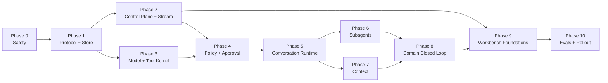

# ApplyMate Agent Harness 2.0 详细开发路线图

> **状态：** Proposed / issue-ready
> **日期：** 2026-08-30
> **上游设计：** [Agent Harness 2.0 Technical Design](./agent-harness-v2-technical-design.md)
> **适用代码：** `packages/agent-protocol`、`packages/agent-model`、`apps/web`、`apps/worker`
> **目标：** 将架构设计拆成可直接创建 GitHub Issue、逐 PR 实施、逐 Gate 验收的开发计划

---

## 0. 如何使用本路线图

本文件不重复解释 Harness 的架构理由；上游设计定义“为什么”和“最终形态”，本文件定义：

- 先做什么、后做什么；
- 每个 Issue 修改哪些模块；
- Issue 之间的依赖；
- 关键技术选择和数据库约束；
- 每个 PR 的验收标准、测试、迁移与回滚；
- 什么时候可以进入下一 Phase；
- 什么时候才允许把 Agent Workspace 切到 Harness 2.0。

`AH2-001` 等编号是逻辑 Issue ID，不是当前 GitHub `#号`。创建 GitHub Issue 后，在本文件的映射表中补充真实编号和 PR。

### 0.1 强制实施规则

1. 一个 Issue 对应一个主 PR；预计超过 3 个工程日必须再次拆分。
2. 每个新 `*.ts` 文件有 sibling `*.test.ts`；source file 不超过 250 行。
3. 每个 Phase 必须满足 Exit Gate，才能把下一 Phase 的 Issue 标记为 `in-progress`。
4. 数据库 migration、dual-write、projection 和删除旧路径必须分开 PR。
5. 所有外部写默认 fail-closed；不能用 feature flag 绕过审批或用户 scope。
6. Web 只做控制平面；长模型循环、等待、Subagent、浏览器执行归 Worker。
7. PostgreSQL 是事实源；Redis/BullMQ 只做 dispatch、wakeup、lease 辅助和短期 delta。
8. Provider conversation/response ID 只是优化游标，不能成为唯一会话状态。
9. 不通过 Prompt 文本或 `ACTION:` 行触发工具、导航或业务 mutation。
10. 自动化复用 canonical Session，但每次执行创建独立 Turn；不能不断创建重复 Session。
11. CAPTCHA、登录、MFA 和未知敏感字段进入 `waiting_for_user`，不实施 solver 绕过。
12. 每个 PR 从 `origin/master` 的最新状态创建 `codex/ah2-<issue>-<slug>` 分支，禁止直接提交到 `master`。

### 0.2 Issue 标准标签

```text
initiative:agent-harness-v2
phase:0 ... phase:10
area:protocol | store | control-plane | model | tools | policy |
     runtime | subagents | context | domain | ui | evals
priority:P0 | P1 | P2
spec-ready | in-progress | blocked | rollout
```

### 0.3 工作量口径

| Size | 参考工作量 | 约束 |
|---|---:|---|
| S | 0.5–1 天 | 单模块、小 schema 或 focused adapter |
| M | 1–2 天 | 一条完整能力链，含测试和文档 |
| L | 2–3 天 | migration + runtime + integration tests；不得再扩大 |

估算针对熟悉仓库的工程师，不含 PR 排队、生产观察和外部审批时间。

---

## 1. 总览

### 1.1 Phase 和 Issue 数量

| Phase | 主题 | Issue | 主要产出 | Exit Gate |
|---|---|---:|---|---|
| 0 | 安全基线 | 3 | fail-closed submit、CAPTCHA policy、ADR/flags | 现有外部写无 fail-open |
| 1 | 协议与事实源 | 5 | protocol package、Turn/Step/Input/Item/Event/Outbox | legacy 可 dual-write/replay |
| 2 | 控制面与事件流 | 4 | command/query API、输入队列、durable SSE | start/steer/follow-up 可持久恢复 |
| 3 | 模型与工具内核 | 5 | capability adapters、typed tools、只读工具 | 同 Turn model→tool→model |
| 4 | Policy 与审批 | 4 | deterministic policy、scoped receipt、resume | 高风险动作统一受控 |
| 5 | Conversation Runtime | 6 | lease、multi-step loop、wait/resume、interrupt | 真正持续运行的 Turn |
| 6 | Subagent Runtime | 6 | task tree、mailbox、coordination、角色迁移 | 可管理、可并发、可总结 |
| 7 | Context 与长期会话 | 3 | snapshot、compaction、fork/restore | 100+ Item 会话稳定继续 |
| 8 | 求职领域闭环 | 6 | Pipeline/ATS/browser/submit/Gmail typed tools | 求职主流程进入统一 Harness |
| 9 | Agent Workbench | 6 | 单 timeline、Composer、Item UI、移除 ACTION | 产品行为达到 Codex-chat Gate |
| 10 | Evals 与发布 | 4 | fault tests、SLO、shadow/canary、legacy cleanup | Harness 2.0 GA |
| **总计** |  | **52** |  |  |

### 1.2 关键依赖图



### 1.3 Critical Path

```text
AH2-001
  → AH2-004
  → AH2-005/006
  → AH2-009
  → AH2-013
  → AH2-017
  → AH2-018
  → AH2-022
  → AH2-024
  → AH2-030
  → AH2-037
  → AH2-043
  → AH2-049
  → AH2-051
  → AH2-052
```

### 1.4 可并行工作流

| Lane | 负责范围 | 可并行区间 |
|---|---|---|
| A — Protocol/Control | schema、Prisma、command/query、SSE | Phase 1–2；随后支持 UI |
| B — Model/Runtime | adapters、tools、TurnEngine、Subagents、Context | Phase 3–7，受 Protocol Gate 约束 |
| C — Domain/Safety | policy、approval、Pipeline、Browser、Gmail | Phase 0、4、8 |
| D — UI/Evals | reducer、Composer、renderers、E2E、observability | Phase 2 后可做 reducer；切流必须等 Phase 8 |

三人团队可让 A/B/C 并行；D 在 Phase 2 后加入。任何并行不得绕过 Phase Exit Gate。

### 1.5 推荐排期

| 团队 | 粗略周期 | 说明 |
|---|---:|---|
| 1 名工程师 | 18–24 周 | 严格串行，含 staging 观察 |
| 2 名工程师 | 12–16 周 | Control/UI 与 Runtime/Domain 双线 |
| 3 名工程师 | 9–12 周 | A/B/C 三线，Phase 5/8 仍需汇合 |

排期是容量参考，不是承诺。数据库迁移、真实 Worker 恢复和外部提交安全 Gate 不允许为了日期压缩。

---

## 2. 统一技术决策

### 2.1 Package 边界

```text
packages/agent-protocol
  纯 TypeScript 协议、TypeBox schema、JSON Schema、DTO、事件名
  禁止 Prisma、React、provider SDK、数据库和网络调用

packages/agent-model
  server-only provider adapters、capability profiles、stream normalization
  依赖 agent-protocol；禁止业务数据库 mutation

apps/web
  Auth/Tenant、Prisma command/query repository、SSE、Agent Workspace

apps/worker
  TurnEngine、Tool/Policy runtime、Subagent、Context、Browser、BullMQ
```

### 2.2 Schema 与运行时验证

- 使用 `@sinclair/typebox` 定义可推导 TypeScript 类型的 JSON Schema。
- 使用 `ajv` 编译并缓存 validator；禁止每次 tool call 重新编译 schema。
- `packages/agent-protocol` 固定导出 `schemaVersion`；未知事件可保存并安全忽略。
- 新依赖必须作为 direct dependency 声明，并遵守 lockfile clean-worktree 规则。

### 2.3 数据库与并发

- Prisma 管理 schema/migration；Web 使用 Prisma repository。
- Worker 继续使用 `pg`，实现 focused SQL repository，不把 Prisma Client 引入 Worker。
- `AgentSession.nextEventSequence` 通过单条 `UPDATE ... RETURNING` 原子分配。
- 使用 raw migration 建立 partial unique index，保证每个 Session 最多一个 active root Turn。
- outbox 与业务状态/event 在同一事务写入；BullMQ publisher 至少一次投递，consumer 幂等。
- lease claim 使用条件更新或 `FOR UPDATE SKIP LOCKED`，不能先查询再无条件更新。

### 2.4 实时传输

- Durable lifecycle：PostgreSQL `AgentEvent` + `Last-Event-ID`/`afterSequence`。
- Transient delta：Redis Stream；断线或 overflow 时允许丢弃可重建 delta。
- Worker 每 250–1000ms 或 2–8KB 写一次 durable `item.snapshot`。
- `item.completed` 是权威完整内容；UI reducer 必须覆盖临时拼接状态。
- SSE 连接断开不拥有、不取消 Turn。

### 2.5 模型适配

- 保留现有 ModelRouter 的用户配置、平台默认和 BYOK 解析顺序。
- OpenAI-compatible adapter 优先支持 Chat Completions `tool_calls`；显式声明能力时支持 Responses continuation。
- Anthropic adapter 映射 Messages `tool_use/tool_result`。
- MiniMax/纯文本模型走 structured envelope + Ajv + 最多一次 repair。
- 所有 adapter 输出统一 `HarnessModelEvent`；工具执行只接受完成并验证后的 arguments。
- provider cursor 失败时从 canonical ContextSnapshot/Items 重建。

### 2.6 测试层次

```text
Unit        schema/reducer/policy/adapter/tool/task/context
Contract    scripted provider streams and malformed outputs
Integration command→outbox→queue→worker→event→projection
Fault       crash/duplicate/out-of-order/lease expiry/cursor loss
Browser     staging dry-run, approval resume, SSE reconnect, mobile/i18n
Production  shadow metrics and canary, never live external submit without consent
```

---

## 3. GitHub Issue 模板

每个实际 Issue 使用以下 body：

```markdown
## Problem
<当前缺口和证据>

## Goal
<本 Issue 完成后的单一能力>

## Dependencies
- AH2-xxx / GitHub #xxx

## In scope
- exact modules/files

## Out of scope
- adjacent work explicitly excluded

## Technical design
- schema/API/state transitions/idempotency

## Acceptance criteria
- [ ] observable, testable statements

## Verification
- exact commands
- migration/staging/manual evidence if required

## Rollback
- feature flag/down migration/projection fallback

## Risks / Follow-ups
<known risks only>
```

每个 PR body 继续使用项目规定的 Layer 1 AC Self-Check 和 Layer 2 Goal Alignment。

---

## 4. Phase 0 — 安全基线

**目标：** 在新 Harness 接管任何执行前，消除现有外部提交 fail-open 和过期 CAPTCHA 方向。

### AH2-001 — 所有外部提交 Guard 改为 fail-closed

- **类型 / 优先级 / Size：** `fix` / P0 / M
- **依赖：** 无
- **主要文件：** `apps/worker/src/harness/agent-harness.ts`、`apps/worker/src/flows/helpers.ts`、所有 `*-flow.test.ts`
- **实施：** `beforeSubmit`/authorization guard 缺失、抛错、超时或返回非明确 `true` 时一律拒绝 submit；fill-for-review 不受影响。
- **AC：** 缺 guard、guard false、guard error、过期 authorization 均为 `submission_blocked`；没有任何 flow 能直接调用 submit 绕过 helper。
- **验证：** `pnpm --filter @jobcopilot/worker test`；为 Workday、Greenhouse、Lever、SmartRecruiters、Personio 各增加负向测试。
- **回滚：** 不允许回滚为 fail-open；若生产受影响，只能关闭 unattended submit feature，保留 fill-for-review。

### AH2-002 — 外部动作安全矩阵与 CAPTCHA detection-only 收敛

- **类型 / 优先级 / Size：** `fix/docs` / P0 / M
- **依赖：** AH2-001
- **主要文件：** Worker queue/flow 配置、`docs/scraping-autoapply-design.md`、`docs/runbook.md`、相关测试。
- **实施：** 建立 `external_action_policy` matrix：application submit、Gmail send、resume overwrite、automation mutation；清除/禁用 solver 路径，CAPTCHA/login/MFA 统一映射 `waiting_for_user`。
- **AC：** 代码搜索不存在可达的 solver 执行路径；运行时检测 CAPTCHA 后不提交、不自动重试；文档不再指导绕过。
- **验证：** Worker CAPTCHA tests、queue pipeline tests、文档链接检查。
- **Out of scope：** 统一 PolicyEngine 在 AH2-018 开始；本 Issue 先修现有路径。

### AH2-003 — Harness ADR、Feature Flags 与基线指标

- **类型 / 优先级 / Size：** `docs/chore` / P0 / S
- **依赖：** AH2-001、AH2-002
- **主要文件：** `docs/adr/`、shared feature flags、health/observability tests。
- **实施：** ADR 固定 Postgres source of truth、Redis dispatch only、no direct Codex runtime dependency、provider-neutral API；声明设计中的 10 个 V2 flags，默认全部关闭。
- **AC：** flags 在 Web/Worker 使用同一类型和默认值；未知/缺失 flag fail-safe；记录 legacy baseline：chat latency、pipeline completion、approval、duplicate suppression、AI cost。
- **验证：** shared build/test、Web focused tests、Worker focused tests。

**Phase 0 Exit Gate**

- 所有外部提交 helper 默认拒绝；
- CAPTCHA/login/MFA 只有 manual escalation；
- V2 flags 默认关闭且不改变 legacy 正常路径；
- ADR 合并后才开始数据库 V2 migration。

---

## 5. Phase 1 — Protocol 与持久事实源

**目标：** 建立共享协议和可无损 replay 的数据库基础，但暂不改变用户行为。

### AH2-004 — 新建 `@jobcopilot/agent-protocol`

- **类型 / 优先级 / Size：** `feat` / P0 / L
- **依赖：** AH2-003
- **主要文件：** `packages/agent-protocol/package.json`、`src/session.ts`、`turn.ts`、`step.ts`、`input.ts`、`item.ts`、`event.ts`、`tool.ts`、`approval.ts`、`model.ts`。
- **实施：** TypeBox + Ajv；定义 versioned schemas、tagged unions、状态枚举、ContentPart、HarnessModelEvent、ToolDefinition wire types；导出 validator factory。
- **AC：** Web/Worker 都能 import；非法状态/type/phase 被拒绝；未知 event type 可由 envelope 保存；package 不依赖 Prisma/React/provider SDK。
- **验证：** `pnpm --filter @jobcopilot/agent-protocol test`、build、typecheck；lockfile diff 只包含新增 direct deps。

### AH2-005 — AgentTurn、AgentStep、AgentInput 数据模型

- **类型 / 优先级 / Size：** `feat` / P0 / L
- **依赖：** AH2-004
- **主要文件：** `apps/web/prisma/schema.prisma`、新 migration、migration tests。
- **实施：** 增加三张表及 Session relations；`clientMessageId` 幂等；Step `(turnId, ordinal, attempt)` unique；raw partial unique index 限制一个 active root Turn。
- **AC：** 两个并发 active Turn 只有一个可创建；重复 client message 只一条；waiting 状态仍占 root slot；terminal 后 follow-up 可开始。
- **验证：** Prisma generate、migration SQL static tests、Postgres integration test（需要测试 DB 时在 PR 明确）。
- **回滚：** additive migration；flag 关闭后无新写入，不删除表。

### AH2-006 — AgentItem、AgentEvent、AgentOutbox 与 sequence allocator

- **类型 / 优先级 / Size：** `feat` / P0 / L
- **依赖：** AH2-004、AH2-005
- **主要文件：** Prisma schema/migration、session repository、migration tests。
- **实施：** 增加 Item/Event/Outbox；Session 增加 `nextEventSequence BigInt`；事务内 `UPDATE ... RETURNING` 分配 sequence；event idempotency unique。
- **AC：** 100 个并发 append 得到连续、唯一、单调 sequence；Item revision 可幂等覆盖；outbox 与 event 不会只写一半。
- **验证：** repository concurrency tests、migration tests、Prisma typecheck。

### AH2-007 — Web/Worker V2 Store 与 Unit of Work

- **类型 / 优先级 / Size：** `feat` / P0 / L
- **依赖：** AH2-005、AH2-006
- **主要文件：** `apps/web/src/lib/agent/control-plane/store/`、`apps/worker/src/runtime/store/`。
- **实施：** Web Prisma repository 负责 command/query；Worker `pg` repository 负责 lease、Step、Item/Event append；定义相同 contract tests；提供 transaction callback。
- **AC：** tenant scope 由服务端注入；Worker SQL 所有 mutation 带 session/turn 条件；Web 与 Worker repository 对同一 fixture 得到相同 projection。
- **验证：** focused Vitest；故意跨 userId 查询必须为空/拒绝。

### AH2-008 — Legacy dual-write、Transcript Projector 与历史兼容

- **类型 / 优先级 / Size：** `feat` / P1 / L
- **依赖：** AH2-007
- **主要文件：** `apps/web/src/lib/agent/session/run-recorder.ts`、repository、projector、chat/run/automation routes。
- **实施：** `AGENT_PROTOCOL_V2_DUAL_WRITE` 开启时，legacy chat、manual pipeline、automation 都创建 Turn/Item/Event；未知 legacy event 保存为 opaque event，不丢弃；旧 Transcript 仍由 projector 生成。
- **AC：** 关闭 flag 时行为不变；开启时 legacy 和 V2 projection 语义一致；同一 automation 复用 Session、每次新 Turn；失败 automation 不创建重复 Session。
- **验证：** chat/run/automation/session repository tests；golden projection fixtures。

**Phase 1 Exit Gate**

- Protocol package 在 Web/Worker build 中通过；
- migration 为 additive，生产部署后 legacy 路径正常；
- dual-write shadow 运行至少 48 小时，无 sequence 冲突、tenant 泄漏或 projection 丢失；
- 所有 chat/manual/automation 触发都有明确 Turn。

---

## 6. Phase 2 — Control Plane 与事件流

**目标：** 用户输入、查询和重连成为持久协议；仍不要求完整 Agent Loop。

### AH2-009 — AgentCommandService 与 root Turn 串行化

- **类型 / 优先级 / Size：** `feat` / P0 / L
- **依赖：** AH2-007
- **主要文件：** `apps/web/src/lib/agent/control-plane/commands/`。
- **实施：** `startTurn`、`steerTurn`、`queueFollowUp`、`interruptTurn`；事务内写 AgentInput/user Item/event/outbox；expected revision/turn 检查；Idempotency-Key。
- **AC：** start race 只有一条 active root Turn；duplicate command 返回原 disposition；steer 不匹配返回 typed `409 active_turn_changed`；Automation 不能 steer 用户 active Turn。
- **验证：** command concurrency/tenant/idempotency tests。

### AH2-010 — Composer Message、Interrupt、Approval/Question Command API

- **类型 / 优先级 / Size：** `feat` / P0 / M
- **依赖：** AH2-009
- **主要文件：** `apps/web/src/app/api/agent/sessions/[id]/messages/`、`turns/[turnId]/interrupt/`，共享 route helpers。
- **实施：** `POST /messages` 原子决定 `started|steered|queued_follow_up|duplicate`；输入只接收 tagged ContentPart；响应返回 inputId/turnId/sequence。
- **AC：** auth 和 owner scope；payload 大小/附件引用限制；浏览器重发不重复 user bubble；关闭 SSE 不触发 interrupt。
- **验证：** route tests + command service tests；非法 expectedTurnId/attachment owner 返回明确错误。

### AH2-011 — Session/Turn/Item/Task Query API 与分页 DTO

- **类型 / 优先级 / Size：** `feat` / P1 / M
- **依赖：** AH2-007
- **主要文件：** session API、`timeline`、`turns`、`tasks` query routes。
- **实施：** cursor pagination；Session DTO 含 runtime status、activeTurn、queuedInputCount；timeline 以 Item projection 为主，可查询 afterSequence。
- **AC：** 默认不返回原始敏感 event payload；历史读取不 resume Turn；跨租户 404；500+ Items 分页稳定无重复。
- **验证：** API pagination/tenant/redaction tests。

### AH2-012 — Durable SSE、Item Snapshot 与 transient delta bridge

- **类型 / 优先级 / Size：** `feat` / P0 / L
- **依赖：** AH2-006、AH2-011
- **主要文件：** `sessions/[id]/events/route.ts`、Web stream service、Worker event/delta publisher。
- **实施：** `Last-Event-ID`/afterSequence；Postgres durable lifecycle；Redis Stream transient delta；慢消费者 overflow 后发 `snapshot_required`；heartbeat 不伪造工作进度。
- **AC：** 断线 30 秒后台继续；重连 projection 无重复；丢 transient delta 后从 Item revision 恢复；completed content 权威覆盖。
- **验证：** stream reconnect、duplicate/out-of-order、slow consumer contract tests。
- **回滚：** `AGENT_EVENT_SSE_V2` 关闭后继续使用 legacy session events。

**Phase 2 Exit Gate**

- 仅用 command/query/SSE 协议即可创建、追加、停止和重放 Turn；
- 同一 clientMessageId 不重复；
- SSE disconnect 不影响后台状态；
- 500 Items replay 和 reconnect 满足设计 SLO。

---

## 7. Phase 3 — Provider-neutral Model 与 Tool Kernel

**目标：** 用统一流式模型协议和 typed tools 替代 text-only 调用与 `ACTION:`/任意 JSON 解析。

### AH2-013 — 新建 `@jobcopilot/agent-model` 与 capability contract

- **类型 / 优先级 / Size：** `feat` / P0 / L
- **依赖：** AH2-004
- **主要文件：** `packages/agent-model/`、现有 `apps/web/src/lib/model-router.ts`、`packages/shared/src/llm.ts` 的 compatibility facade。
- **实施：** 定义 `HarnessModelRequest`、normalized stream、capability profile、abort、usage、provider cursor、reroute reason；不改变现有 ModelRouter 配置解析顺序。
- **AC：** adapter 不接触 Prisma/业务 mutation；metadata 始终含 session/turn/step/task；现有 modelChat 调用可继续工作；V2 flag 关闭不改 legacy 输出。
- **验证：** package build/test、Web/Worker compile、legacy model-router tests。

### AH2-014 — OpenAI-compatible Chat Completions / Responses adapter

- **类型 / 优先级 / Size：** `feat` / P0 / L
- **依赖：** AH2-013
- **主要文件：** `packages/agent-model/src/adapters/openai-compatible/`。
- **实施：** 解析 text delta、tool call argument delta、usage、finish reason；能力允许时支持 response continuation；自定义 endpoint 继续经过 existing safe endpoint/pinned outbound policy。
- **AC：** 多 tool call 能按 callId 重组；不完整 arguments 不执行；cursor 404/过期返回可 fallback error；AbortSignal 关闭上游请求。
- **验证：** 无 live network 的 fixture stream tests；SSRF/custom endpoint negative tests。

### AH2-015 — Anthropic Messages adapter

- **类型 / 优先级 / Size：** `feat` / P0 / M
- **依赖：** AH2-013
- **主要文件：** `packages/agent-model/src/adapters/anthropic/`。
- **实施：** 映射 system/user/assistant、`tool_use`、`tool_result`、stream usage、stop reason；复用现有 Anthropic SDK 和 BYOK secret resolution。
- **AC：** content block 顺序稳定；tool result 关联原 toolUseId；reasoning/private blocks 不进入用户 final；cancel/timeout 可观测。
- **验证：** SDK mock contract tests、malformed block tests、legacy Anthropic tests。

### AH2-016 — Structured/text fallback、continuation recovery 与 model reroute

- **类型 / 优先级 / Size：** `feat` / P0 / L
- **依赖：** AH2-014、AH2-015
- **主要文件：** agent-model fallback/selection modules。
- **实施：** 原生 tool 不可用时返回 TypeBox `NextStep` envelope；Ajv 验证，最多一次 repair；provider cursor 失效时 full-context rebuild；模型切换发布 `model.rerouted`。
- **AC：** 非法工具名/schema 永不执行；repair 仍失败则 Step failed；发生不可逆 side effect 后禁止自动 reroute/retry；MiniMax/OpenAI-compatible/Anthropic contract matrix 全通过。
- **验证：** scripted adapter tests，覆盖 cursor loss、truncated JSON、duplicate callId、provider 429/5xx。

### AH2-017 — ToolRegistry、ToolRouter、lifecycle 与首批只读工具

- **类型 / 优先级 / Size：** `feat` / P0 / L
- **依赖：** AH2-007、AH2-013
- **主要文件：** `apps/worker/src/runtime/tools/`、tool protocol schemas。
- **实施：** registry/version、Ajv input/output、capability/tenant、timeout/AbortSignal、idempotency metadata、started/result Items；实现 `jobs.get/search`、`persona.retrieve`、`resume.get_base`、`application.get_state`。
- **AC：** 模型不可指定 userId；未注册/version mismatch 拒绝；只读工具无业务 mutation；大结果转 artifact/reference；所有结果 redacted 后进入 event。
- **验证：** registry/router/tool sibling tests；跨租户和 schema fuzz tests。

**Phase 3 Exit Gate**

- 三类 provider adapter 通过同一 contract suite；
- tool lifecycle 可 replay；
- scripted Turn 可完成 `model step → read tool → model step → final`；
- 仍没有任何 external-write tool。

---

## 8. Phase 4 — PolicyEngine、审批与用户输入

**目标：** 在 Runtime 开始自动调度前，让所有风险动作受确定性策略、一次性审批和来源规则控制。

### AH2-018 — Deterministic PolicyEngine 与 hook pipeline

- **类型 / 优先级 / Size：** `feat` / P0 / L
- **依赖：** AH2-017
- **主要文件：** `apps/worker/src/runtime/policy/`、policy protocol。
- **实施：** `Before/AfterModelCall`、`Before/AfterToolUse`、`BeforeBusinessMutation`、`BeforeExternalSubmission`、`BeforeContextCompaction`、`BeforeFinalResponse`；决策为 allow/deny/require_approval/require_user_input/rewrite_input。
- **AC：** Policy 不调用 LLM；每次决策有 policy version、理由 code、scope；工具不能绕过 hook 直接执行；缺策略默认 deny external write。
- **验证：** policy matrix table-driven tests，覆盖 role/tool/risk/user/plan/target domain。

### AH2-019 — Scoped Approval Receipt schema 与原子消费

- **类型 / 优先级 / Size：** `feat` / P0 / L
- **依赖：** AH2-005、AH2-018
- **主要文件：** Prisma `AgentApproval` 演进、migration、Web/Worker approval store。
- **实施：** turnId/itemId/toolCallId、scopeType/scopeHash、artifact hashes、destination、expiry、nonce、consumedAt/revision；canonical JSON + SHA-256；事务内 compare-and-consume。
- **AC：** approval 不能跨 user/session/turn/job/tool 复用；材料或答案 hash 变化失效；并发消费只有一个成功；raw sensitive answers 不进入 hash log。
- **验证：** migration tests、scope canonicalization、race、expiry、stale revision tests。

### AH2-020 — Approval/Question Broker、API 与原 Turn resume

- **类型 / 优先级 / Size：** `feat` / P0 / L
- **依赖：** AH2-010、AH2-019
- **主要文件：** Web approval/question command routes、Worker wakeup consumer、Item projector。
- **实施：** 创建 typed approval/question Item；Turn 进入 waiting；Web 决策校验后写 event/outbox；Worker 恢复同一 turnId/step lineage/toolCallId。
- **AC：** refresh 后卡片仍存在；回答/批准不新建伪 Turn；过期/重复/错误 owner 被拒绝；pending request 被 interrupt 时 resolved/cancelled。
- **验证：** command→outbox→resume integration tests、reconnect tests。

### AH2-021 — 现有高风险路径迁入 policy 与统一 redaction

- **类型 / 优先级 / Size：** `refactor` / P0 / L
- **依赖：** AH2-018、AH2-019、AH2-020
- **主要文件：** resume tailoring、application control/preflight、Gmail send、automation mutations、event redaction。
- **实施：** 先把现有入口作为 policy-protected adapters，不创建新 external tools；PersonaFact provenance/confirmed answer 检查；日志只保留引用、hash 和脱敏摘要。
- **AC：** 四类高风险路径都调用相同 PolicyEngine；自由文本“可以/提交吧”不等于 receipt；未知工作许可/薪资/敏感回答进入 question。
- **验证：** existing focused suites + new cross-entry policy tests；PII snapshot tests。

**Phase 4 Exit Gate**

- 现有和未来外部写入口都使用统一 policy；
- approval race、expiry、scope mismatch 100% 拒绝；
- approval 后可唤醒原 Turn；
- event/log 不包含 API key、OAuth token、原始简历全文或敏感答案。

---

## 9. Phase 5 — Conversation Runtime

**目标：** 建立真正 Codex-style 的持久 TurnEngine：一个 Turn 内多 Step、工具回灌、等待恢复、改向、中断和最终交付。

### AH2-022 — Worker Turn queue、lease、heartbeat 与 recovery scanner

- **类型 / 优先级 / Size：** `feat` / P0 / L
- **依赖：** AH2-007、AH2-009
- **主要文件：** `apps/worker/src/runtime/turns/`、`queue/turn-queue.ts`。
- **实施：** BullMQ job 仅携带 turnId；Worker 从 Postgres claim lease；heartbeat 条件更新；stale lease scanner；DLQ；queued/outbox repair scanner。
- **AC：** 重复 delivery 只有一个 lease owner；heartbeat 丢失主动 abort；Worker 重启后可 reclaim；Redis 丢 job 可由 Postgres 重建。
- **验证：** fake clock/pg repository tests、duplicate delivery、stale lease、DLQ tests。

### AH2-023 — StepContextBuilder 与 AgentInput 消费 checkpoint

- **类型 / 优先级 / Size：** `feat` / P0 / L
- **依赖：** AH2-016、AH2-022
- **主要文件：** `apps/worker/src/runtime/context/step-context-builder.ts`、input store。
- **实施：** 分层组装 safety/domain/task/business/working/untrusted/user context；FIFO claim steer；Step 记录 consumedInputIds/inputThroughSequence；附件只通过 owner-checked artifact refs。
- **AC：** 同一 input 只被一个 root Step 消费；steer 不改写历史；untrusted JD/DOM/email 不能进入 instruction layer；provider cursor 可选且可丢弃。
- **验证：** context golden tests、input race、tenant/attachment scope、prompt-injection placement tests。

### AH2-024 — Multi-step Conversation Loop

- **类型 / 优先级 / Size：** `feat` / P0 / L
- **依赖：** AH2-017、AH2-018、AH2-022、AH2-023
- **主要文件：** `apps/worker/src/runtime/turns/turn-engine.ts` 及拆分 modules。
- **实施：** claim → build context → start Step → stream model → validate calls → policy → tools → attach results → next Step → verify candidate final；持久状态间释放 Worker。
- **AC：** 一个 Turn 至少支持 3 Steps；tool result 回到原 Turn；completed Turn 恰有一个 final_answer；commentary 与 final 分相；HTTP/SSE 断开不停止循环。
- **验证：** scripted model/tool integration tests；step ordinal、event causation、唯一 final assertions。

### AH2-025 — Suspension、durable wait conditions 与 wakeup

- **类型 / 优先级 / Size：** `feat` / P0 / L
- **依赖：** AH2-020、AH2-024
- **主要文件：** runtime wait/wakeup modules、outbox consumers。
- **实施：** waiting_for_dependency/approval/user；保存 wait predicate、required IDs、deadline；释放 lease；tool/subagent/input/decision 到达写 wakeup。
- **AC：** wakeup 至少一次但恢复幂等；不靠进程内 Promise 保持等待；approval/user answer 后不重跑已完成 Step/tool；timeout 产生明确 Item。
- **验证：** restart-while-waiting、duplicate wakeup、timeout、wrong dependency tests。

### AH2-026 — Interrupt/cancel 级联与不可逆动作核对

- **类型 / 优先级 / Size：** `feat` / P0 / M
- **依赖：** AH2-022、AH2-024、AH2-025
- **主要文件：** turn cancel service、model/tool/browser AbortSignal bridge。
- **实施：** interruptRequestedAt；root signal 级联 Step/tool/task/browser/wait；不可逆请求已发出时进入 verification/uncertain，不声称 cancelled。
- **AC：** Stop 不是关闭 EventSource；可取消路径 p95 目标内进入 interrupted/cancelling；新 task/tool 不再启动；terminal event 只产生一次。
- **验证：** concurrent model/tool/wait cancellation tests；submit-request-in-flight fixture。

### AH2-027 — Budget、no-progress detector、Verifier 与 Finalizer

- **类型 / 优先级 / Size：** `feat` / P0 / L
- **依赖：** AH2-024
- **主要文件：** runtime budget/verifier/finalizer modules。
- **实施：** 24 root Steps、64 tools、8 repair 默认上限；token/cost/time/subagent budget；重复 call signature/no state progress detector；Finalizer 从 verified events/artifacts/business state 生成 final。
- **AC：** 模型说“完成”不直接 complete；循环上限产生 partial/failed final；final 明确 completed/not completed/blocker/next step；usage 归因到 Step/Turn/Session。
- **验证：** no-progress fixtures、budget exhaustion、false completion、partial result tests。

**Phase 5 Exit Gate**

- Scripted scenario 完成 3+ Step、2+ tool、唯一 final；
- steer 在下一 Step 生效，follow-up 不污染当前 Turn；
- approval/answer/tool result 从原 checkpoint 恢复；
- Worker crash、duplicate job、SSE disconnect 不丢状态；
- interrupt、budget 和 no-progress guard 全部可观测。

---

## 10. Phase 6 — Subagent Runtime

**目标：** 将同步 `runSubAgentTask()` wrapper 升级为有任务树、mailbox、lease、预算和生命周期的真实 Subagent。

### AH2-028 — 演进 SubAgentTask 与 AgentMailboxMessage schema

- **类型 / 优先级 / Size：** `feat` / P1 / L
- **依赖：** AH2-005、AH2-006
- **主要文件：** Prisma schema/migration、`session/subagent-task-runner.ts` compatibility types。
- **实施：** 增加 turnId/rootTaskId/parentTaskId/path/depth、snapshot/model/tool/budget、attempt/lease/interrupt/closed、output artifacts；新建 mailbox 表和幂等键。
- **AC：** path/depth 可查询；跨 Session parent 拒绝；mailbox message 只能消费一次；旧 `passed` projection 仍可显示。
- **验证：** migration/static relation tests、task tree fixtures、mailbox concurrency tests。

### AH2-029 — AgentTreeManager、task queue、lease 与并发 limiter

- **类型 / 优先级 / Size：** `feat` / P1 / L
- **依赖：** AH2-022、AH2-028
- **主要文件：** `apps/worker/src/runtime/subagents/`、`queue/subagent-queue.ts`。
- **实施：** Session 级 registry/limiter；spawn claim；depth/fan-out/concurrency；task heartbeat/retry/close；parent/root cancel inheritance；slot 原子 reserve/release。
- **AC：** 超限不创建 orphan task；完成/失败/close 都释放 slot；重复 job 不双跑；root interrupt 级联 descendants；Worker restart 可恢复。
- **验证：** limiter race、depth、fan-out、stale lease、slot leak tests。

### AH2-030 — Coordination tools：spawn/send/wait/list/interrupt/close

- **类型 / 优先级 / Size：** `feat` / P1 / L
- **依赖：** AH2-017、AH2-025、AH2-029
- **主要文件：** runtime tool definitions/executors、mailbox store。
- **实施：** typed contracts；spawn 返回 taskId/path；send 只投现有 inbox；wait 保存有界 predicate，在 mailbox/task/steer/timeout 任一事件唤醒。
- **AC：** model 不能伪造 owner/task path；wait 不长期占 Worker；send 不隐式创建任务；close 只允许 terminal/idle；所有操作产生 subagent activity Items。
- **验证：** tool contract、mailbox wakeup、tenant scope、timeout、interrupt tests。

### AH2-031 — 迁移 Scout 与 Analyst Subagents

- **类型 / 优先级 / Size：** `refactor` / P1 / L
- **依赖：** AH2-017、AH2-030
- **主要文件：** chat orchestrator compatibility、Scout/Analyst task handlers、role config。
- **实施：** Orchestrator 可并行 spawn；仅授予 discovery/job/persona read tools；结果按 `AgentTaskResult` schema 返回 artifact/job IDs、evidence 和 summary。
- **AC：** 不再在 root 调用栈同步执行；两个任务可并发；任一失败不抹掉另一个结果；不允许 Analyst 生成/提交申请。
- **验证：** scripted multi-agent integration、role capability negative tests。

### AH2-032 — 迁移 Writer 与 Reviewer Subagents

- **类型 / 优先级 / Size：** `refactor` / P1 / L
- **依赖：** AH2-021、AH2-030
- **主要文件：** Writer/Reviewer task handlers、artifact adapters。
- **实施：** Writer 只能创建 draft artifact；Reviewer 使用独立 context/model profile，输出 findings/quality gate，不直接修改 Writer output 或执行申请。
- **AC：** Writer/Reviewer tool scopes 分离；Reviewer 引用 artifact hash；用户 steer 改材料约束后旧 review 标 stale；结果可被 root Finalizer 汇总。
- **验证：** task contract、artifact hash、stale steer、role separation tests。

### AH2-033 — 迁移 Auditor 与受限 Executor Subagents

- **类型 / 优先级 / Size：** `refactor` / P1 / L
- **依赖：** AH2-021、AH2-030；本 Issue 不启用 Phase 8 的外部写工具
- **主要文件：** Auditor/Executor handlers、role policy。
- **实施：** Auditor 只读事件/业务状态并生成证据摘要；Executor 第一阶段只做 preflight/建议，不获得 external write，待 Phase 8 tool flag 开启后再按 policy 注入。
- **AC：** Executor 无 receipt 时看不到 submit/send tool；Auditor 不读取未脱敏 payload；root 可等待/消息/关闭两者。
- **验证：** dynamic tool visibility matrix、audit evidence、external capability negative tests。

**Phase 6 Exit Gate**

- root 可并行 spawn、send、wait、interrupt、close；
- Session concurrency/depth/fan-out 不可绕过；
- Scout/Analyst/Writer/Reviewer/Auditor/Executor 都有独立 task lifecycle；
- 外部写能力仍由 Policy/Receipt 动态控制，不因角色名自动授予。

---

## 11. Phase 7 — Context Snapshot、Compaction 与长期会话

**目标：** 让长期 Session 在成本可控的情况下稳定继续，并保留安全和业务不变量。

### AH2-034 — AgentContextSnapshot schema、builder 与 token accounting

- **类型 / 优先级 / Size：** `feat` / P1 / L
- **依赖：** AH2-023、AH2-028
- **主要文件：** Prisma snapshot migration、Worker context snapshot modules。
- **实施：** goal、constraints、confirmed decisions/evidence、completed/open tasks、pending approvals、artifacts/hashes、facts/sources、failed attempts/do-not-repeat、budgets、throughSequence/checksum。
- **AC：** builder 只使用 verified records/events；snapshot 可重建 Step context；token 估算按 provider/model profile 记录；memorySummary 降为 UI projection。
- **验证：** deterministic snapshot golden tests、checksum、tenant scope、missing reference tests。

### AH2-035 — Compaction lifecycle、deterministic collector 与 invariant validator

- **类型 / 优先级 / Size：** `feat` / P1 / L
- **依赖：** AH2-016、AH2-018、AH2-034
- **主要文件：** context compactor/collector/validator、compaction Items。
- **实施：** threshold/manual/Turn boundary trigger；程序先收集 IDs/状态，模型只总结叙事；validator 检查 goal、approval、sensitive answers、artifact hash、open tasks、do-not-repeat。
- **AC：** compaction 失败保留旧 snapshot；不物理删除用户历史；压缩前后 invariant 完全一致；发布 started/snapshot/completed 生命周期。
- **验证：** 100+ Item fixtures、malicious summary、missing approval/hash、token reduction tests。

### AH2-036 — Session fork、provider cursor loss recovery 与长会话 restore

- **类型 / 优先级 / Size：** `feat` / P1 / L
- **依赖：** AH2-011、AH2-034、AH2-035
- **主要文件：** fork command/query API、Context restore、model reroute integration。
- **实施：** fork 到指定 lastTurnId；复制历史引用/快照，不继承 pending receipt/task lease；cursor loss 时 canonical rebuild；edit old message 通过 fork 实现。
- **AC：** fork 后 sequence/budget/task tree 独立；不重放 external side effect；100+ Items Session 在 Worker restart/provider change 后继续；旧历史仍可审计。
- **验证：** fork boundary、receipt exclusion、cursor loss、cross-provider continuation tests。

**Phase 7 Exit Gate**

- 100+ Items、多个 Turn 的 Session 可稳定继续；
- compaction 明显降低输入 token，同时安全不变量零丢失；
- provider state 完全丢失仍可恢复；
- fork/edit 不修改历史、不重放副作用。

---

## 12. Phase 8 — 求职领域工具与完整闭环

**目标：** 把现有 Pipeline、ATS flows、Browser Harness、申请和 Gmail 能力迁入统一 Tool/Policy/Turn 生命周期；优先复用稳定逻辑。

### AH2-037 — Legacy Pipeline coarse tool 与 Automation Turn adapter

- **类型 / 优先级 / Size：** `refactor` / P0 / L
- **依赖：** AH2-024、AH2-025、AH2-027
- **主要文件：** `apps/web/src/lib/agent/pipeline.ts`、Worker `agent-run-queue.ts`、`apps/web/src/app/api/internal/agent-run/route.ts`。
- **实施：** 暂以 `pipeline.run` coarse tool 调度现有 stages；checkpoint 映射 Item/Event；Automation run 复用 canonical Session、新建 Turn；Web internal route 降为 compatibility adapter。
- **AC：** legacy pipeline 结果进入原 Turn；Worker restart 从 checkpoint；interrupt 停止后续 stage；重复 automation delivery 不创建新 Session/重复外部动作。
- **验证：** pipeline resume、automation scheduler/session、agent-run queue integration tests。

### AH2-038 — Discovery 与 scoring/analysis typed tools

- **类型 / 优先级 / Size：** `refactor` / P1 / L
- **依赖：** AH2-017、AH2-037
- **主要文件：** discovery、sources、enrichment、analyze stage adapters。
- **实施：** `jobs.discover`、`jobs.enrich`、`jobs.score`、`jobs.compare`；输出 job IDs/evidence/usage，不返回任意整库；保留 ATS pace policy、dedup 和 full_description 逻辑。
- **AC：** free ATS/cost/data quality 行为不回退；每次外部请求继续写 usage ledger；一个 job 失败可单独重试；Subagent 只获得允许的数据范围。
- **验证：** existing discovery/source/stage suites + tool contract tests；无 live network unit tests。

### AH2-039 — Resume/Cover Letter artifact 与 review/preflight tools

- **类型 / 优先级 / Size：** `refactor` / P1 / L
- **依赖：** AH2-021、AH2-034、AH2-037
- **主要文件：** resume tailoring、prepare/gate stages、artifact repository。
- **实施：** `resume.create_draft`、`cover_letter.create_draft`、`application.preflight`、`artifact.review`；所有输出 version/hash/source refs；模型不直接覆盖 base resume。
- **AC：** draft 与 approved artifact 分离；事实只能来自 PersonaFact/evidence；约束变化标 stale；review gate 引用确切 hash；无授权不产生 external side effect。
- **验证：** resume/preflight/stage tests、unsupported claim/provenance/hash tests。

### AH2-040 — Browser fill-for-review、ATS flow 与 AI fallback executor

- **类型 / 优先级 / Size：** `refactor` / P0 / L
- **依赖：** AH2-021、AH2-025、AH2-039
- **主要文件：** `apps/worker/src/flows/`、`harness/agent-harness.ts`、patterns/form-patterns。
- **实施：** `browser.fill_form` tool；known ATS deterministic flow 优先，pattern replay 次之，LLM fallback 最后；每个动作 child Item；FormPattern 输出 selector mapping artifact；CAPTCHA/login/MFA suspend。
- **AC：** 默认 `submit=false`；browser crash 不自动重试未知 submit；DOM/JD untrusted；AI budget/cycle cap；fill result 可供用户 review。
- **验证：** 全部 Worker flow/harness/pattern tests；staging dry-run，不做实际提交。

### AH2-041 — `application.submit` external-write tool

- **类型 / 优先级 / Size：** `feat` / P0 / L
- **依赖：** AH2-019、AH2-020、AH2-026、AH2-040
- **主要文件：** Worker submit executor、application control/preflight、ApplyResult verification。
- **实施：** tool visibility 由 policy 动态授予；参数只接受 job/application/artifact IDs；原子消费 scoped receipt；idempotency key；提交后验证 URL/confirmation/evidence；未知结果标 uncertain。
- **AC：** 无 receipt 100% 拒绝；材料/答案/目标变化使 receipt 失效；重复 job/Worker crash 不二次提交；用户停止后不继续新提交；LinkedIn 等禁区始终 deny。
- **验证：** exhaustive negative matrix、duplicate/crash/fault injection；真实站点仅在用户明确批准的 staging run 中验证。

### AH2-042 — Gmail draft/send typed tools

- **类型 / 优先级 / Size：** `refactor` / P0 / L
- **依赖：** AH2-019、AH2-020、AH2-026
- **主要文件：** Gmail helpers/client/tracking、send-draft route compatibility。
- **实施：** `gmail.create_draft` 为 draft_write；`gmail.send` 为 external_write；recipient/subject/body hash/linked application 在 approval scope；OAuth error 转 waiting_for_user/reconnect。
- **AC：** draft 不等于 send；无 receipt 或 token 无效不发送；重复 delivery 不重复邮件；发送结果与 Gmail message/thread ID 持久化；跨用户 token 永不混用。
- **验证：** Gmail focused tests、OAuth failure、scope/hash、duplicate send tests；不在 unit tests 调 live Gmail。

**Phase 8 Exit Gate**

- 发现→分析→材料→review→fill-for-review→审批→submit→audit 在一个 Session/Turn tree 可追踪；
- 稳定 ATS flow 未被 LLM 取代；
- 外部提交和 Gmail send 的 unauthorized/duplicate rate 为 0；
- CAPTCHA/login/MFA/unknown answer 都可暂停并从原 Turn 恢复；
- legacy Pipeline 可继续作为 emergency fallback。

---

## 13. Phase 9 — Agent Workbench 2.0

**目标：** 用一个 Session timeline 呈现聊天、计划、工具、Subagent、审批、产物和最终结果，并移除双状态与文本动作协议。

### AH2-043 — Timeline reducer、V2 stream client 与 replay/live 一致性

- **类型 / 优先级 / Size：** `feat` / P1 / L
- **依赖：** AH2-011、AH2-012
- **主要文件：** `apps/web/src/components/agent-workspace/v2/` 或 focused hooks/reducers。
- **实施：** reducer 输入 Session/Turn/Item/Event DTO；按 itemId/revision/sequence 幂等；snapshot + durable tail + transient delta；`item.completed` 覆盖 streaming。
- **AC：** live/replay 得到相同 state；重复/乱序 delta 不重复文本；未知 Item 安全 fallback；断线显示 reconnect，不标任务失败。
- **验证：** reducer golden/duplicate/out-of-order/reconnect tests。

### AH2-044 — Session state、URL 与 active Turn Composer

- **类型 / 优先级 / Size：** `feat` / P1 / L
- **依赖：** AH2-009、AH2-010、AH2-043
- **主要文件：** `AgentPlaygroundPage.tsx` 拆分、AgentComposer、session hooks。
- **实施：** URL 只使用 sessionId；activeTurn 从 DTO；Composer 支持 start、Add to current task、Run next、Stop；optimistic message 用 clientMessageId 对账。
- **AC：** active Turn 时 Composer 不被禁用；409 不静默改投；发送状态 `sending/accepted/consumed/failed` 可见；关闭页面不 interrupt；Stop 调真实 API。
- **验证：** page/composer tests、fake stream/API tests。

### AH2-045 — Commentary/final、Plan、Tool 与 structured content renderers

- **类型 / 优先级 / Size：** `feat` / P1 / L
- **依赖：** AH2-043
- **主要文件：** AgentUnifiedStream、Transcript blocks 拆分为 typed Item components。
- **实施：** commentary 与 final 分相；plan checklist；tool lifecycle 折叠卡片；job_table/artifact_card/citation/suggested_action 原生组件；suggested action 点击后发 typed command。
- **AC：** Markdown/`ACTION:` 不触发行为；final 每 Turn 唯一突出；reasoning 只显示 summary；敏感参数脱敏；未知 content part 可降级显示。
- **验证：** component tests、XSS/unsafe markdown tests、i18n snapshots。

### AH2-046 — Task tree、Approval/Question、Artifact 与 Budget UI

- **类型 / 优先级 / Size：** `feat` / P1 / L
- **依赖：** AH2-020、AH2-030、AH2-034、AH2-043
- **主要文件：** AgentTeamList、ApprovalBlock、SessionFocusPanel、HealthStrip。
- **实施：** task hierarchy/status/cost；approval 显示 job/material hash/destination/expiry；question typed options/free answer；artifact version/stale state；context compaction milestone。
- **AC：** 刷新后 pending cards 可继续；回答后只读保留；跨 Turn card 不误操作；task heartbeat 不刷屏；budget/partial/uncertain 可见。
- **验证：** component/API integration tests、stale approval/answered question fixtures。

### AH2-047 — 移除 `/api/agent/chat` 动作协议与双 EventSource 状态

- **类型 / 优先级 / Size：** `refactor` / P0 / L
- **依赖：** AH2-037、AH2-043、AH2-044、AH2-045
- **主要文件：** `/api/agent/chat`、`agent-chat-stream.ts`、`AgentPlaygroundPage.tsx`、legacy run SSE adapters。
- **实施：** chat route 仅作为 `/messages` compatibility adapter；删除 `ACTION:` prompt/parser/handler；移除 selectedSessionId/liveSessionId 双写和 chat/run 两条独立用户流。
- **AC：** repo search 无生产 `ACTION:` parser；一个 Session 一个 timeline connection；chat 触发 Pipeline 仍在同 Turn；flag 关闭可回 legacy projection但不能恢复文本动作执行。
- **验证：** affected route/page/stream tests、full Web test、search assertion test。

### AH2-048 — Codex-chat 浏览器 E2E、移动端和中英双语验收

- **类型 / 优先级 / Size：** `test` / P0 / L
- **依赖：** AH2-044–AH2-047
- **主要文件：** Playwright E2E、fixtures、i18n resources。
- **实施：** 自动化覆盖设计 16.6 的 10 个剧本；desktop + 320x568；English 默认、Chinese 全量切换；scripted backend 避免真实模型/外部提交。
- **AC：** steer/follow-up/Stop/approval/reconnect/final 都通过；无混合语言；keyboard/focus/aria 可用；移动端可访问 task/approval/final。
- **验证：** `pnpm test:e2e` 的 focused project；保存失败 screenshot/trace，不把本地通过冒充生产通过。

**Phase 9 Exit Gate**

- Agent Workspace 只依赖 V2 Session/Turn/Item/Event；
- 一个 Session 一条 timeline stream；
- `ACTION:` 和双 live state 从生产路径移除；
- 10 个 Codex-chat E2E 在 desktop/mobile、中英 locale 通过；
- 不允许在 Phase 9 直接打开全部生产用户 flag。

---

## 14. Phase 10 — Evals、可观测性、发布与清理

**目标：** 用证据决定是否 GA，证明安全、恢复、质量、成本和交互达到门槛，再删除 legacy 路径。

### AH2-049 — Scripted Harness contract suite 与 fault injection

- **类型 / 优先级 / Size：** `test` / P0 / L
- **依赖：** AH2-027、AH2-030、AH2-035、AH2-041、AH2-042
- **主要文件：** Worker/Web integration fixtures、scripted model/tool adapters。
- **实施：** 覆盖 multi-step、steer race、follow-up、approval resume、disconnect、duplicate delta、cursor loss、reroute、interrupt、stale material、no progress、text command injection；8 个 crash 点。
- **AC：** 所有 case 可重复、无 live provider；外部副作用 duplicate rate 0；event replay deterministic；失败输出完整 session/turn/step/item trace IDs。
- **验证：** dedicated Vitest project/CI job；可设置固定 seed 重放。

### AH2-050 — Harness SLO、trace、usage 与 admin observability

- **类型 / 优先级 / Size：** `feat` / P1 / L
- **依赖：** AH2-012、AH2-027、AH2-049
- **主要文件：** usage/event metrics、admin queue/agent dashboards、runbook。
- **实施：** accepted/consumed、first commentary/model delta、progress silence、reconnect、interrupt、steps/turn、tool/task/approval、cost、projection lag、stale lease、duplicate suppression；trace IDs 全链路。
- **AC：** 指标可按 provider/model/user plan/tool/version 聚合但不暴露 PII；SLO breach 有告警/runbook；Admin 只看授权范围；成本可归因 Session→Turn→Step→Task。
- **验证：** metric emission tests、admin RBAC tests、staging dashboard evidence。

### AH2-051 — Shadow compare、内部 canary 与用户 rollout

- **类型 / 优先级 / Size：** `chore` / P0 / L
- **依赖：** AH2-048、AH2-049、AH2-050
- **主要文件：** feature flag rollout config、shadow comparator、operations docs。
- **实施：** 先 dual-write/replay shadow，不双执行 external tools；内部账号 → 1% → 5% → 25% → 50% → 100%；每级至少观察一个完整业务周期；自动 rollback thresholds。
- **AC：** completion 不低于 legacy；unauthorized/duplicate external action 0；replay ≥99.9%；SLO/cost guardrail 达标；每级有明确 go/no-go report。
- **验证：** staging + production fresh metrics；不能只以 CI green 作为 rollout 证明。

### AH2-052 — Legacy 清理、GA 与长期维护契约

- **类型 / 优先级 / Size：** `chore/refactor` / P1 / L
- **依赖：** AH2-051 完成 100% 稳定观察期
- **主要文件：** legacy chat/run recorder/projection、AgentRun compatibility、docs/runbook/README。
- **实施：** 删除不再读取的 ACTION/dual stream/lossy recorder；AgentRun 保留只读 projection 或归档；保留 emergency pipeline adapter；document event/schema versioning 和 migration policy。
- **AC：** 删除前 telemetry 证明旧路径 0 traffic；数据库列/表删除另开 migration，不与代码删除同 PR；GA docs、runbook、ownership、on-call checklist 完整。
- **验证：** repository-wide tests/build/typecheck、production smoke、rollback rehearsal。

**Phase 10 / GA Exit Gate**

- 0 次未经授权或重复外部动作；
- fault suite 100% 通过；
- replay 一致性 ≥99.9%；
- completion、cost、latency 达到设计门槛；
- 生产 browser/manual evidence 完成；
- legacy traffic 为 0 且已完成 rollback rehearsal。

---

## 15. Issue 依赖与状态映射表

创建实际 GitHub Issue 后维护此表；不要在标题中使用尚未分配的 `#号`。

| Logical ID | Title short | Depends on | GitHub Issue | PR | State |
|---|---|---|---|---|---|
| AH2-001 | fail-closed submit | — | TBD | TBD | spec-ready |
| AH2-002 | external action/CAPTCHA matrix | 001 | TBD | TBD | pending |
| AH2-003 | ADR/flags/baseline | 001,002 | TBD | TBD | pending |
| AH2-004 | agent-protocol package | 003 | TBD | TBD | pending |
| AH2-005 | Turn/Step/Input schema | 004 | TBD | TBD | pending |
| AH2-006 | Item/Event/Outbox/sequence | 004,005 | TBD | TBD | pending |
| AH2-007 | Web/Worker stores | 005,006 | TBD | TBD | pending |
| AH2-008 | legacy dual-write/projector | 007 | TBD | TBD | pending |
| AH2-009 | command service | 007 | TBD | TBD | pending |
| AH2-010 | message/interrupt API | 009 | TBD | TBD | pending |
| AH2-011 | query API | 007 | TBD | TBD | pending |
| AH2-012 | durable/transient stream | 006,011 | TBD | TBD | pending |
| AH2-013 | agent-model contract | 004 | TBD | TBD | pending |
| AH2-014 | OpenAI-compatible adapter | 013 | TBD | TBD | pending |
| AH2-015 | Anthropic adapter | 013 | TBD | TBD | pending |
| AH2-016 | fallback/recovery/reroute | 014,015 | TBD | TBD | pending |
| AH2-017 | ToolRegistry/read tools | 007,013 | TBD | TBD | pending |
| AH2-018 | PolicyEngine | 017 | TBD | TBD | pending |
| AH2-019 | approval receipt | 005,018 | TBD | TBD | pending |
| AH2-020 | approval/question broker | 010,019 | TBD | TBD | pending |
| AH2-021 | migrate high-risk policy | 018–020 | TBD | TBD | pending |
| AH2-022 | Turn lease/recovery | 007,009 | TBD | TBD | pending |
| AH2-023 | Step context/input consume | 016,022 | TBD | TBD | pending |
| AH2-024 | conversation loop | 017,018,022,023 | TBD | TBD | pending |
| AH2-025 | suspension/wakeup | 020,024 | TBD | TBD | pending |
| AH2-026 | interrupt cascade | 022,024,025 | TBD | TBD | pending |
| AH2-027 | budget/verifier/finalizer | 024 | TBD | TBD | pending |
| AH2-028 | task/mailbox schema | 005,006 | TBD | TBD | pending |
| AH2-029 | AgentTreeManager | 022,028 | TBD | TBD | pending |
| AH2-030 | coordination tools | 017,025,029 | TBD | TBD | pending |
| AH2-031 | Scout/Analyst migration | 017,030 | TBD | TBD | pending |
| AH2-032 | Writer/Reviewer migration | 021,030 | TBD | TBD | pending |
| AH2-033 | Auditor/Executor migration | 021,030 | TBD | TBD | pending |
| AH2-034 | context snapshot | 023,028 | TBD | TBD | pending |
| AH2-035 | compaction | 016,018,034 | TBD | TBD | pending |
| AH2-036 | fork/restore | 011,034,035 | TBD | TBD | pending |
| AH2-037 | Pipeline/Automation adapter | 024,025,027 | TBD | TBD | pending |
| AH2-038 | discovery/analysis tools | 017,037 | TBD | TBD | pending |
| AH2-039 | artifact/review tools | 021,034,037 | TBD | TBD | pending |
| AH2-040 | browser fill executor | 021,025,039 | TBD | TBD | pending |
| AH2-041 | application.submit tool | 019,020,026,040 | TBD | TBD | pending |
| AH2-042 | Gmail tools | 019,020,026 | TBD | TBD | pending |
| AH2-043 | timeline reducer/client | 011,012 | TBD | TBD | pending |
| AH2-044 | session/composer | 009,010,043 | TBD | TBD | pending |
| AH2-045 | message/tool renderers | 043 | TBD | TBD | pending |
| AH2-046 | task/approval/artifact UI | 020,030,034,043 | TBD | TBD | pending |
| AH2-047 | remove ACTION/dual stream | 037,043–045 | TBD | TBD | pending |
| AH2-048 | browser E2E/i18n/mobile | 044–047 | TBD | TBD | pending |
| AH2-049 | contract/fault suite | 027,030,035,041,042 | TBD | TBD | pending |
| AH2-050 | SLO/observability | 012,027,049 | TBD | TBD | pending |
| AH2-051 | shadow/canary rollout | 048–050 | TBD | TBD | pending |
| AH2-052 | legacy cleanup/GA | 051 | TBD | TBD | pending |

---

## 16. Definition of Ready

一个 Issue 只有满足以下条件才能标记 `spec-ready`：

- 上游依赖已合并，或仅依赖已固定的 protocol contract；
- Problem 有当前代码证据，不是泛泛“重构”；
- In scope 指向真实存在的目录/模块；
- AC 可通过测试或可观察状态验证；
- 明确 tenant、idempotency、approval、retry、PII 影响；
- migration Issue 有 forward/rollback/dual-write 说明；
- external action Issue 有 negative matrix；
- UI Issue 有 loading/error/reconnect/mobile/i18n 状态；
- 估算不超过 L；超过必须拆分。

## 17. Definition of Done

每个 Issue/PR 必须满足：

- 代码、migration、测试和文档与 AC 对齐；
- 没有未解释的 `any`；新 source file ≤250 行；
- focused tests 通过，报告测试边界；
- 共享 package build 后 Web/Worker typecheck 无新增错误；
- feature flag 默认值和 rollback 已验证；
- usage/trace/event 能归因；
- 没有跨用户 scope、secret/PII log 或未经审批外部写；
- commit 已 push 到 feature branch，PR body 含两层 AC self-check；
- CI/Preview 与实际 browser/production evidence 分开报告。

---

## 18. 标准验证命令

根据 Issue 范围选择，不要求每个小 PR 都跑所有命令，但 Phase Gate 必须完整运行。

```powershell
pnpm install --frozen-lockfile
pnpm --filter @jobcopilot/shared build
pnpm --filter @jobcopilot/agent-protocol test
pnpm --filter @jobcopilot/agent-protocol build
pnpm --filter @jobcopilot/agent-model test
pnpm --filter @jobcopilot/agent-model build
pnpm --filter web exec prisma generate
pnpm --filter web test
pnpm --filter web typecheck
pnpm --filter @jobcopilot/worker test
pnpm --filter @jobcopilot/worker build
pnpm test:e2e
git diff --check
```

尚未创建的 package 命令从对应 Phase 开始启用。不能因为某 package 尚不存在而在早期 Issue 伪造通过结果。

---

## 19. 风险登记

| 风险 | 影响 | 预防/应对 |
|---|---|---|
| 一次 migration 添加过多表和约束 | 部署/回滚困难 | AH2-005/006 分开，additive + flag |
| Web 与 Worker repository 语义漂移 | replay/lease 错误 | 共用 protocol + repository contract fixtures |
| 每 token 写 Postgres | 成本和锁争用 | Redis transient delta + coalesced snapshot |
| provider tool calling 差异 | 错误执行 | normalized events + Ajv + fallback/repair 限制 |
| Session 同时两个 root Turn | 上下文和外部动作冲突 | partial unique index + command transaction |
| wait 持有进程内 Promise | Worker 重启丢任务 | durable wait predicate + outbox wakeup |
| Subagent fan-out 失控 | 成本/队列爆炸 | Session limiter + depth/fan-out/budget |
| compaction 丢安全不变量 | 错误审批/重复动作 | deterministic collector + invariant validator |
| UI 先切 V2、后端未闭环 | 用户看到假进度 | Phase 9 切流依赖 Phase 8 Gate |
| external submit 重试 | 重复申请 | scoped receipt + idempotency + uncertain verification |
| 长期保留 provider conversation | GDPR/BYOK 风险 | canonical local state；cursor 可丢弃 |
| 52 个 Issue 长期失真 | 计划维护失败 | 只把近期 Phase 标 spec-ready；每个 Gate 后重新审阅下两 Phase |

---

## 20. 第一批实际开发建议

文档 PR 合并后，不要立即一次性创建并启动 52 个 Issue。建议：

### Batch A — 立即创建并开发

1. AH2-001 fail-closed submit；
2. AH2-002 external action/CAPTCHA matrix；
3. AH2-003 ADR/flags/baseline。

### Batch B — Phase 0 Gate 通过后创建

4. AH2-004 protocol package；
5. AH2-005 Turn/Step/Input migration；
6. AH2-006 Item/Event/Outbox/sequence；
7. AH2-007 Web/Worker store；
8. AH2-008 dual-write/projector。

### Batch C — Phase 1 数据验证后并行

- Lane A：AH2-009 → 010/011 → 012；
- Lane B：AH2-013 → 014/015 → 016 → 017；
- Lane C：准备 AH2-018–021 的 policy matrix 和 negative fixtures，但不提前合并 runtime code。

最先应该交给开发的 Issue 是 **AH2-001**。在它合并之前，不开始新的 unattended external-write 能力。
