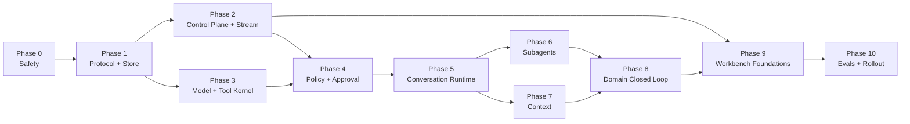
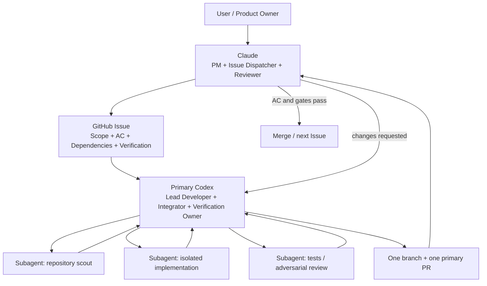

# ApplyMate Agent Harness 2.0 详细开发路线图

> **状态（2026-09-01）：** Phase 0–3 implementation complete (AH2-001..017 + MiniMax profile merged). Phase 3 Exit Gate is satisfied by provider/tool-kernel evidence; its scripted Turn prerequisite was corrected to remain with AH2-024. **Phase 4：`accepted_by_owner_waiver` — owner 已明确接受 48h 观察豁免（2026-09-01）** — AH2-018/019/020/021 all merged (#382/#383/#384/#385); PR #385 commit 36c8d9e fixed two P1 redaction bugs surfaced during Layer 1 review. Phase 4 implementation and runbook are complete (runbook: PR #389 + #390, master); staging approval smoke and SSE evidence are recorded in PR #392 and the current MiniMax smoke is recorded on **#387/#388**. **48h dual-write integrity observation was not run and is explicitly waived by the owner; it remains `not_verified`, not fabricated as a measurement.** The exception record is [`docs/agent-harness-v2/gates/phase-4/owner-waiver.md`](agent-harness-v2/gates/phase-4/owner-waiver.md). Phase 5 is unlocked for implementation under this named exception; its own Exit Gate remains mandatory. The staging `AGENT_PROTOCOL_V2_DUAL_WRITE` flag is now `Active`, `100%`, `v3` in the authenticated Platform controls page; `fantasticjobs_shadow` is `Active` in Production at `0%`, so it receives no production traffic. This state does not waive the remaining ordinary evidence requirement or authorize production rollout. Dispatch order continues with AH2-022 (#386), then AH2-024-M (#370).

> **Phase 10 / GA reconciliation (2026-09-07):** AH2-048–053 implementation PRs are merged and their code/CI evidence is recorded. The GA checklist is now reconciled into `PASS`, `WAIVED / NOT VERIFIED`, and `PENDING` instead of treating every item as unsigned. This is a documentation/evidence correction, not a GA approval: staging/production observation, rollback evidence, zero-legacy-traffic measurement, and owner sign-off remain explicit blockers until recorded. See [`docs/ga/agent-harness-2.0-checklist.md`](ga/agent-harness-2.0-checklist.md) and AH2-054 ([#490](https://github.com/YuanshuoDu/applymate-jobcopilot/issues/490)).
> **日期：** 2026-08-30（状态头更新于 2026-08-31）
> **上游设计：** [Agent Harness 2.0 Technical Design](./agent-harness-v2-technical-design.md)
> **适用代码：** `packages/agent-protocol`、`packages/agent-model`、`apps/web`、`apps/worker`
> **目标：** 将架构设计拆成可直接创建 GitHub Issue、逐 PR 实施、逐 Gate 验收的开发计划

---

## 0. 如何使用本路线图

本文件不重复解释 Harness 的架构理由；上游设计定义“为什么”和“最终形态”，本文件定义：

- 先做什么、后做什么；
- 每个 Issue 修改哪些模块；
- Issue 之间的依赖；
- 关键技术选择和数据库约束；
- 每个 PR 的验收标准、测试、迁移与回滚；
- 什么时候可以进入下一 Phase；
- 什么时候才允许把 Agent Workspace 切到 Harness 2.0。

`AH2-001` 等编号是逻辑 Issue ID，不是当前 GitHub `#号`。创建 GitHub Issue 后，在本文件的映射表中补充真实编号和 PR。

### 0.1 强制实施规则

1. 一个 Issue 对应一个主 PR；预计超过 3 个工程日必须再次拆分。
2. 每个新 `*.ts` 文件有 sibling `*.test.ts`；source file 不超过 250 行。
3. 每个 Phase 必须满足 Exit Gate，才能把下一 Phase 的 Issue 标记为 `in-progress`。
4. 数据库 migration、dual-write、projection 和删除旧路径必须分开 PR。
5. 所有外部写默认 fail-closed；不能用 feature flag 绕过审批或用户 scope。
6. Web 只做控制平面；长模型循环、等待、Subagent、浏览器执行归 Worker。
7. PostgreSQL 是事实源；Redis/BullMQ 只做 dispatch、wakeup、lease 辅助和短期 delta。
8. Provider conversation/response ID 只是优化游标，不能成为唯一会话状态。
9. 不通过 Prompt 文本或 `ACTION:` 行触发工具、导航或业务 mutation。
10. 自动化复用 canonical Session，但每次执行创建独立 Turn；不能不断创建重复 Session。
11. CAPTCHA、登录、MFA 和未知敏感字段进入 `waiting_for_user`，不实施 solver 绕过。
12. 每个 PR 从 `origin/master` 的最新状态创建 `codex/ah2-<issue>-<slug>` 分支，禁止直接提交到 `master`。
13. Claude 是 PM、Issue dispatcher 和 reviewer；一个 Issue 只分派给一个 Primary Codex。
14. Primary Codex 是当前 Issue 的唯一实现、集成和验证 owner，可在 Issue 内把边界明确的子任务并行分发给 Subagent。
15. Subagent 不拥有 Issue、branch 或 PR，不直接 merge/push，也不能自行改变架构、AC、产品范围或外部系统状态。
16. Subagent 输出只是候选 patch/evidence；Primary Codex 必须逐项审阅、解决冲突并在统一分支上重跑完整验证后才能交付。
17. 当 Issue 与本路线图冲突时，Primary Codex 必须先判断是 Issue 偏离路线图，还是路线图本身漏项/错误；不能把任何一方静默当作正确。
18. 若仓库证据证明路线图有缺陷，Primary Codex 应做最小、可审阅的路线图修正，并在 GitHub 用 `@claude` 明确要求重新阅读修正章节；不得借路线图修正静默改变 Issue 的 AC。
19. 若路线图修正会改变当前 Issue 的范围、依赖、安全边界或验收方式，必须等待 Claude 重新确认/更新 Issue 后再继续业务代码；证据不足时保持 blocked 并请求澄清。

### 0.2 Issue 标准标签

```text
initiative:agent-harness-v2
phase:0 ... phase:10
area:protocol | store | control-plane | model | tools | policy |
     runtime | subagents | context | domain | ui | evals
priority:P0 | P1 | P2
spec-ready | in-progress | blocked | rollout
```

### 0.3 工作量口径

| Size | 参考工作量 | 约束 |
|---|---:|---|
| S | 0.5–1 天 | 单模块、小 schema 或 focused adapter |
| M | 1–2 天 | 一条完整能力链，含测试和文档 |
| L | 2–3 天 | migration + runtime + integration tests；不得再扩大 |

估算针对熟悉仓库的工程师，不含 PR 排队、生产观察和外部审批时间。

---

## 1. 总览

### 1.1 Phase 和 Issue 数量

| Phase | 主题 | Issue | 主要产出 | Exit Gate |
|---|---|---:|---|---|
| 0 | 安全基线 | 3 | fail-closed submit、CAPTCHA policy、ADR/flags | 现有外部写无 fail-open |
| 1 | 协议与事实源 | 5 | protocol package、Turn/Step/Input/Item/Event/Outbox | legacy 可 dual-write/replay |
| 2 | 控制面与事件流 | 4 | command/query API、输入队列、durable SSE | start/steer/follow-up 可持久恢复 |
| 3 | 模型与工具内核 | 5 | capability adapters、typed tools、只读工具 | 同 Turn model→tool→model |
| 4 | Policy 与审批 | 4 | deterministic policy、scoped receipt、resume | 高风险动作统一受控 |
| 5 | Conversation Runtime | 6 | lease、multi-step loop、wait/resume、interrupt | 真正持续运行的 Turn |
| 6 | Subagent Runtime | 6 | task tree、mailbox、coordination、角色迁移 | 可管理、可并发、可总结 |
| 7 | Context 与长期会话 | 3 | snapshot、compaction、fork/restore | 100+ Item 会话稳定继续 |
| 8 | 求职领域闭环 | 6 | Pipeline/ATS/browser/submit/Gmail typed tools | 求职主流程进入统一 Harness |
| 9 | Agent Workbench | 6 | 单 timeline、Composer、Item UI、移除 ACTION | 产品行为达到 Codex-chat Gate |
| 10 | Evals 与发布 | 4 | fault tests、SLO、shadow/canary、legacy cleanup | Harness 2.0 GA |
| **总计** |  | **52** |  |  |

### 1.2 关键依赖图



### 1.3 Critical Path

```text
AH2-001
  → AH2-004
  → AH2-005/006
  → AH2-009
  → AH2-013
  → AH2-017
  → AH2-018
  → AH2-022
  → AH2-024
  → AH2-030
  → AH2-037
  → AH2-043
  → AH2-049
  → AH2-051
  → AH2-052
```

### 1.4 Agent-native 开发与管理模型



| 角色 | 核心职责 | 明确不负责 |
|---|---|---|
| User | 产品目标、重大取舍、敏感动作授权 | 日常代码集成与逐行审查 |
| Claude | Phase/Issue 拆分、依赖排序、AC、派发、PR 复审、merge/rollout Gate | 与 Primary Codex 同时修改同一 Issue 的业务代码；直接管理其内部 patch |
| Primary Codex | 理解 Issue、制定执行图、实现关键路径、调度 Subagent、集成、完整验证、commit/push/PR、响应 review | 修改 Issue AC、扩大范围、把最终责任转交 Subagent |
| Codex Subagent | 完成有边界、可独立验证的调查、实现、fixture、测试或 review 子任务 | 创建竞争性 PR、外部发布/提交、架构拍板、声称整个 Issue 完成 |

这里有两种不同粒度的并行，必须严格区分：

1. **Issue 层保持串行：** Claude 一次只把一个 GitHub Issue 置为 `in-progress`，该 Issue 只有一个 Primary Codex、一个主分支和一个主 PR。
2. **Issue 内允许并行：** Primary Codex 可以并行运行 Subagent，但任务必须文件不重叠、输入输出明确，并能单独验收；所有结果回到主 Codex 汇合。
3. **Phase Lane 是规划视图：** 下表用于识别依赖和可拆分边界，不等于允许绕过“一次一个 Issue”规则。只有 User/Claude 明确改变调度策略时，才可同时推进多个 Issue。

| Lane | 负责范围 | 适合分发给 Subagent 的工作 | 必须由 Primary Codex 汇合的工作 |
|---|---|---|---|
| A — Protocol/Control | schema、Prisma、command/query、SSE | schema inventory、contract fixtures、migration review | canonical schema、事务边界、迁移/回滚结论 |
| B — Model/Runtime | adapters、tools、TurnEngine、Subagents、Context | 独立 provider adapter、scripted stream tests、fault cases | runtime loop、capability semantics、恢复与预算约束 |
| C — Domain/Safety | policy、approval、Pipeline、Browser、Gmail | threat cases、read-only adapter、negative fixtures | 外部写 policy、receipt scope、用户确认与幂等性 |
| D — UI/Evals | reducer、Composer、renderers、E2E、observability | 独立 renderer、locale audit、E2E case authoring | timeline contract、端到端行为、发布判断 |

#### 1.4.1 Primary Codex 的 Subagent 调度协议

每个 Subagent 必须收到结构化 task contract：

```yaml
task_id: AH2-xxx/subtask-name
objective: 单一、可验证的目标
allowed_paths: [允许读取或修改的路径]
forbidden_actions: [不得 push/merge/deploy、不得外部写、不得改 AC]
inputs: [Issue、接口、fixture、依赖 commit]
expected_output: patch | findings | tests | review
verification: [子任务需要运行的命令和期望结果]
done_when: [可观测完成条件]
```

默认规则：

- 普通 Issue 同时运行不超过 3 个 Subagent；L 级 Issue 只有在文件和依赖完全分离时才可提高到 4–6 个。
- 默认只允许一层委派；Subagent 不得继续 spawn Subagent，除非 Issue 明确授权并定义总 fan-out/depth/budget。
- 优先分发只读调查、独立 adapter、fixture、测试、文档核对和对抗性 review；共享核心状态机、migration、审批/外部写和最终 integration 由 Primary Codex 掌握。
- 两个 Subagent 不得同时修改同一文件；发现重叠时停止其中一个并回到 Primary Codex 重新切分。
- Subagent 的“完成”只表示子任务完成。Issue 只有在 Primary Codex 完成集成、focused/full tests、diff review 和证据报告后才能进入 `code_complete`。

#### 1.4.2 单个 Issue 的标准闭环

1. Claude 创建/审阅 Issue，并向一个 Primary Codex 发出 `@codex` handoff。
2. Primary Codex 读取全部 spec，建立依赖图和主关键路径，标出可安全并行的子任务。
3. Primary Codex 为每个 Subagent 写 task contract，同时自己继续关键路径，不能只等待下游结果。
4. Subagent 返回 patch、findings 和验证证据；不自行开 PR 或宣告 Issue 完成。
5. Primary Codex 逐项审查结果，拒绝越界或无证据输出，解决接口和语义冲突。
6. Primary Codex 在单一分支集成，运行 Issue 所需 V1–V5 验证，形成一个主 PR 和两层 AC self-check。
7. Claude 对照 Issue、架构目标、CI 和环境证据 review；不满足则明确 `@codex` 请求修改。
8. Primary Codex 修复并重新验证；Claude Gate 通过后 merge，再派发下一个 Issue。

### 1.5 推荐排期

| 执行模式 | 粗略周期 | 说明 |
|---|---:|---|
| Primary Codex 串行实现 | 18–24 周 | 不使用 Subagent，含 staging 观察 |
| Primary Codex + 1–3 Subagents | 12–16 周 | 单 Issue 内调查/实现/测试并行；主 Codex 汇合 |
| Primary Codex + 受控 4–6 Subagents | 10–14 周 | 仅适用于边界清晰的 L Issue；Phase 5/8 和安全 Gate 仍不可压缩 |

排期是容量参考，不是承诺。数据库迁移、真实 Worker 恢复和外部提交安全 Gate 不允许为了日期压缩。

### 1.6 Phase 状态机

```text
not_started → active → implementation_complete → verifying → observing → completed
                          ↘ blocked              ↗
```

- `implementation_complete`：本 Phase 的所有 Issue 已 merge，但不能进入下一 Phase。
- `verifying`：执行 Phase Gate 的完整自动化、迁移、故障和浏览器验证。
- `observing`：在 staging/production shadow 中满足规定窗口。
- `completed`：Phase Exit Report 已审阅，所有 Gate 有证据，下一 Phase 才可 active。
- `blocked`：记录具体 blocker、已完成范围和恢复条件；不能把未验证项标记为完成。
- `accepted_by_owner_waiver`：Owner 对列明的未验证 Gate 项作出书面豁免，允许指定的下一 Phase 进入实现；该状态不等同于实测证据完整的 `completed`，且必须记录风险、范围、回滚责任人和后续补证条件。

### 1.7 Phase 完成与验证矩阵

| Phase | 开始条件 | 实现完成条件 | 最终验证证据 | 完成后解锁 |
|---|---|---|---|---|
| 0 | 本路线图合并 | AH2-001–003 merged | 全外部动作负向矩阵、flags 默认关闭、baseline | Phase 1 |
| 1 | Phase 0 completed | AH2-004–008 merged | migration + 48h dual-write integrity report | Phase 2/3 |
| 2 | Store contracts 固定 | AH2-009–012 merged | command race、500 Items、SSE disconnect/reconnect | UI reducer foundations、Phase 4 |
| 3 | Protocol/Store 可用 | AH2-013–017 merged | 三 provider contract + ToolRouter/lifecycle replay + read-only/tenant negative matrix | Phase 4 |
| 4 | Phase 3 Exit Gate complete | AH2-018–021 merged | approval race/scope/expiry、PII、staging resume；或 owner waiver 明确列出未完成环境观察项 | Phase 5（正常 Gate 或 owner-waiver activation） |
| 5 | Phase 4 Exit Gate complete | AH2-022–027 merged | 3+ Steps、wait/restart、interrupt、no-progress | Phase 6/7/8 adapter |
| 6 | TurnEngine stable | AH2-028–033 merged | task concurrency、mailbox、partial success、role isolation | Phase 8 multi-agent |
| 7 | Step context stable | AH2-034–036 merged | 100+ Items、compaction invariants、fork/cursor loss | Phase 8/long chat |
| 8 | Runtime/Policy/Subagents | AH2-037–042 merged | full job workflow、dry-run、explicit-approved submit/send | Phase 9 cutover |
| 9 | Domain loop stable | AH2-043–048 merged | 10 E2E、desktop/mobile、EN/ZH、single stream | Phase 10 rollout |
| 10 | 全功能稳定 | AH2-049–052 merged | fault suite、SLO、canary、rollback、zero legacy traffic | Harness 2.0 GA |

### 1.8 Phase Exit Report 模板

```markdown
# Phase N Exit Report

## Scope
- Issues completed: AH2-xxx ...
- PRs / commits:
- Feature flags and current values:
- Migrations deployed:

## Goal result
- Planned outcome:
- Actual outcome:
- Partial/blocked items:

## Verification
- V1 unit/contract:
- V2 integration/fault:
- V3 CI/staging:
- V4 browser/manual:
- V5 production observation:

## Gate metrics
- correctness:
- security/authorization:
- replay/recovery:
- latency/cost:
- tenant/PII:

## Rollback
- rehearsal result:
- rollback trigger:
- owner:

## Decision
- GO / NO-GO
- reviewer:
- next Phase activation date:
```

---

## 2. 统一技术决策

### 2.1 Package 边界

```text
packages/agent-protocol
  纯 TypeScript 协议、TypeBox schema、JSON Schema、DTO、事件名
  禁止 Prisma、React、provider SDK、数据库和网络调用

packages/agent-model
  server-only provider adapters、capability profiles、stream normalization
  依赖 agent-protocol；禁止业务数据库 mutation

apps/web
  Auth/Tenant、Prisma command/query repository、SSE、Agent Workspace

apps/worker
  TurnEngine、Tool/Policy runtime、Subagent、Context、Browser、BullMQ
```

### 2.2 Schema 与运行时验证

- 使用 `@sinclair/typebox` 定义可推导 TypeScript 类型的 JSON Schema。
- 使用 `ajv` 编译并缓存 validator；禁止每次 tool call 重新编译 schema。
- `packages/agent-protocol` 固定导出 `schemaVersion`；未知事件可保存并安全忽略。
- 新依赖必须作为 direct dependency 声明，并遵守 lockfile clean-worktree 规则。

### 2.3 数据库与并发

- Prisma 管理 schema/migration；Web 使用 Prisma repository。
- Worker 继续使用 `pg`，实现 focused SQL repository，不把 Prisma Client 引入 Worker。
- `AgentSession.nextEventSequence` 通过单条 `UPDATE ... RETURNING` 原子分配。
- 使用 raw migration 建立 partial unique index，保证每个 Session 最多一个 active root Turn。
- outbox 与业务状态/event 在同一事务写入；BullMQ publisher 至少一次投递，consumer 幂等。
- lease claim 使用条件更新或 `FOR UPDATE SKIP LOCKED`，不能先查询再无条件更新。

### 2.4 实时传输

- Durable lifecycle：PostgreSQL `AgentEvent` + `Last-Event-ID`/`afterSequence`。
- Transient delta：Redis Stream；断线或 overflow 时允许丢弃可重建 delta。
- Worker 每 250–1000ms 或 2–8KB 写一次 durable `item.snapshot`。
- `item.completed` 是权威完整内容；UI reducer 必须覆盖临时拼接状态。
- SSE 连接断开不拥有、不取消 Turn。

### 2.5 模型适配

- 保留现有 ModelRouter 的用户配置、平台默认和 BYOK 解析顺序。
- OpenAI-compatible adapter 优先支持 Chat Completions `tool_calls`；显式声明能力时支持 Responses continuation。
- Anthropic adapter 映射 Messages `tool_use/tool_result`。
- MiniMax/纯文本模型走 structured envelope + Ajv + 最多一次 repair。
- 所有 adapter 输出统一 `HarnessModelEvent`；工具执行只接受完成并验证后的 arguments。
- provider cursor 失败时从 canonical ContextSnapshot/Items 重建。

### 2.6 测试层次

```text
Unit        schema/reducer/policy/adapter/tool/task/context
Contract    scripted provider streams and malformed outputs
Integration command→outbox→queue→worker→event→projection
Fault       crash/duplicate/out-of-order/lease expiry/cursor loss
Browser     staging dry-run, approval resume, SSE reconnect, mobile/i18n
Production  shadow metrics and canary, never live external submit without consent
```

---

## 3. GitHub Issue 模板

每个实际 Issue 使用以下 body：

```markdown
## Problem
<当前缺口和证据>

## Goal
<本 Issue 完成后的单一能力>

## Dependencies
- AH2-xxx / GitHub #xxx

## In scope
- exact modules/files

## Out of scope
- adjacent work explicitly excluded

## Technical design
- schema/API/state transitions/idempotency

## Acceptance criteria
- [ ] observable, testable statements

## Verification
- exact commands
- migration/staging/manual evidence if required

## Primary Codex / Subagent plan
- Primary Codex critical path:
- Delegated subtasks and allowed paths:
- Integration and re-verification owner: Primary Codex

## Rollback
- feature flag/down migration/projection fallback

## Risks / Follow-ups
<known risks only>
```

每个 PR body 继续使用项目规定的 Layer 1 AC Self-Check 和 Layer 2 Goal Alignment。

### 3.1 每个 Issue 的执行状态机

```text
draft
  → spec_ready
  → in_progress
  → code_complete
  → verified_local
  → verified_ci_preview
  → merged
  → observed
  → done
```

| 状态 | 进入条件 | 退出证据 |
|---|---|---|
| `draft` | 只有问题描述 | 完成依赖、范围、AC、风险审阅 |
| `spec_ready` | Definition of Ready 全部满足 | 分支、owner、实施 checklist 已建立 |
| `in_progress` | 上游依赖已合并 | 代码、migration、测试和文档完成 |
| `code_complete` | 作者自检完成 | focused tests、typecheck、diff check 通过 |
| `verified_local` | 本地自动验证通过 | commit push、PR、CI/Preview 启动 |
| `verified_ci_preview` | 所需 CI 和 Preview 通过 | reviewer 批准并合并 |
| `merged` | 代码进入 master | staging migration/smoke/metrics 通过；纯协议 Issue 可直接进入 observed |
| `observed` | 在目标环境运行 | 达到该 Issue 规定的观察窗口和无回滚条件 |
| `done` | 所有 AC 和环境证据完整 | 更新映射表、Phase report、关闭 Issue |

`code_complete`、PR 已开或 CI green 都不等于 `done`。涉及 migration、Worker recovery、SSE、浏览器、审批、外部动作或 rollout 的 Issue，必须提供相应环境证据。

### 3.2 每个 Issue 必须维护的执行 checklist

```markdown
## Development checklist
- [ ] 读取上游设计、依赖 Issue 和目标文件
- [ ] 记录 Primary Codex 关键路径；为每个 Subagent 定义 objective、allowed paths、output 和 verification
- [ ] 写失败测试或 contract fixture
- [ ] 实现最小纵向切片
- [ ] 补齐负向、并发、tenant、idempotency 测试
- [ ] 验证 feature flag / migration / rollback
- [ ] 运行 focused tests 和必要 typecheck/build
- [ ] 更新文档、事件/指标和 PR AC 表
- [ ] push commit，记录 CI/Preview/环境证据
- [ ] Primary Codex 已审查所有 Subagent 输出并在统一分支重跑验证
- [ ] 满足 observation gate 后标记 done
```

### 3.3 验证证据分级

| Level | 证据 | 适用范围 |
|---|---|---|
| V1 | Unit/contract tests | 所有 Issue |
| V2 | Integration + DB/queue/fault test | store、runtime、policy、subagent、context |
| V3 | CI、Preview、staging smoke | API、migration、stream、Worker、UI |
| V4 | 实际 browser/manual evidence | Workbench、ATS fill、approval resume |
| V5 | production metrics/canary observation | rollout、external submit/send、legacy cleanup |

每个 Issue 下方的“验证与证据”会指定最低等级；不能用低等级证据替代高等级证据。

### 3.4 完成报告模板

```markdown
## Completion report
- Logical issue: AH2-xxx
- Commit / PR:
- Feature flag:
- Migration:
- AC passed: N/N
- V1 unit/contract:
- V2 integration/fault:
- V3 CI/staging:
- V4 browser/manual:
- V5 production observation:
- Rollback tested:
- Known residual risk:
- Final status: verified | partial | blocked
```

---

## 4. Phase 0 — 安全基线

**目标：** 在新 Harness 接管任何执行前，消除现有外部提交 fail-open 和过期 CAPTCHA 方向。

### AH2-001 — 所有外部提交 Guard 改为 fail-closed

- **类型 / 优先级 / Size：** `fix` / P0 / M
- **依赖：** 无
- **主要文件：** `apps/worker/src/harness/agent-harness.ts`、`apps/worker/src/flows/helpers.ts`、五个 ATS flow 源文件与 browser fallback（`workday-flow.ts` / `greenhouse-flow.ts` / `lever-flow.ts` / `smartrecruiters-flow.ts` / `personio-flow.ts`）、`apps/worker/src/patterns/replay.ts`、`packages/shared/src/index.ts`（`ApplyResult.status` 增加 `submission_blocked`）、`apps/worker/src/queue/apply-queue.ts`（blocked 持久化/通知处理）、所有 `*-flow.test.ts` 与对应 focused tests
  - *修正记录（2026-08-30，规则 17–19）：Codex 在 #335 澄清时用仓库证据证明 flow 源文件、`replay.ts`、`shared/index.ts`、`apply-queue.ts` 均属于 submit 调用点，原主要文件列表不完整；经 Claude 确认后扩展，Issue #335 范围同步更新。*
- **开发目标：** 把“未提供授权即可提交”的隐式默认彻底改为“只有明确、有效授权才提交”，并保持 fill-for-review 可用。
- **实施步骤：** 1) 枚举五类 ATS 和 Browser fallback 的所有 submit call site；2) 建立唯一 `assertSubmissionAuthorized()` 入口；3) 缺 guard、false、error、timeout、非 boolean 全部返回 typed blocked result；4) 每个 flow 删除直达 submit 的旁路；5) 增加 blocked reason event/metric。
- **完成标准：** 缺 guard、guard false、guard error、过期 authorization 均为 `submission_blocked`；没有任何 flow 能绕过 helper；fill-only fixture 仍成功；代码搜索与测试证明所有 call site 已覆盖。
- **验证与证据（V1+V2）：** `pnpm --filter @jobcopilot/worker test`；Workday、Greenhouse、Lever、SmartRecruiters、Personio 各有正/负向测试；提交 call-site inventory 附在 PR；staging dry-run 证明表单可填但不能提交。
- **回滚：** 不允许回滚为 fail-open；若生产受影响，只能关闭 unattended submit feature，保留 fill-for-review。

### AH2-002 — 外部动作安全矩阵与 CAPTCHA detection-only 收敛

- **类型 / 优先级 / Size：** `fix/docs` / P0 / M
- **依赖：** AH2-001
- **主要文件：** Worker queue/flow 配置、`docs/scraping-autoapply-design.md`、`docs/runbook.md`、相关旧 auto-apply 文档（当前审计范围：`docs/auto-apply-deployment.md`、`docs/scraping-autoapply-dev-guide.md`、`docs/scraping-autoapply-roadmap.md`、`docs/superpowers/specs/2026-05-21-auto-apply-architecture-design.md`）与相关测试。
  - *修正记录（2026-08-31，规则 17–19）：仓库审计发现上述旧文档仍包含 CapSolver/solver 或自动挑战绕过指导；仅列 design/runbook 无法满足“旧文档没有绕过指导”的完成标准，故补充最小文档审计范围。此修正只扩大文档同步与代码搜索证据，不改变运行时安全边界；Claude 已在 #336 中重新确认范围，Codex 按修正后的 Issue 继续。*
- **开发目标：** 建立现有外部动作的单一安全清单，并把所有 CAPTCHA/login/MFA 行为收敛为用户接管。
- **实施步骤：** 1) 盘点 application/Gmail/resume/automation mutation；2) 为每项记录 risk、approval、idempotency、retry、owner；3) 删除或硬禁用 solver executor/config；4) 统一 waiting reason/error code；5) 同步设计、runbook 和监控说明。
- **完成标准：** matrix 覆盖全部入口；代码搜索不存在可达 solver；CAPTCHA 后不提交、不自动重试；登录/MFA 具有相同暂停语义；旧文档没有绕过指导。
- **验证与证据（V1+V2）：** Worker CAPTCHA/queue tests、每类外部动作 negative fixture、`rg` 可达路径审计、文档链接检查；PR 附安全矩阵。
- **Out of scope：** 统一 PolicyEngine 在 AH2-018 开始；本 Issue 先修现有路径。

### AH2-003 — Harness ADR、Feature Flags 与基线指标

- **类型 / 优先级 / Size：** `docs/chore` / P0 / S
- **依赖：** AH2-001、AH2-002
- **主要文件：** `docs/adr/`、shared feature flags、health/observability tests。
- **开发目标：** 在写 V2 数据前固定不可轻易改变的架构决策、开关命名和 legacy 对照基线。
- **实施步骤：** 1) 编写 ADR；2) 在 shared 中声明 typed flags/defaults；3) Web/Worker 使用同一 resolver；4) unknown/missing flag 走 legacy 或 deny-risk；5) 采集 chat/pipeline/approval/duplicate/cost 基线查询。
- **完成标准：** ADR 通过审阅；10 个 flags 默认关闭；Web/Worker 解析一致；缺失配置不会开启 V2 或外部动作；基线时间窗、查询和结果已记录。
- **验证与证据（V1+V3）：** shared build/test、Web/Worker focused tests；staging health 输出确认 flags；PR 附 baseline snapshot 和 ADR 链接。

**Phase 0 Exit Gate**

- 所有外部提交 helper 默认拒绝；
- CAPTCHA/login/MFA 只有 manual escalation；
- V2 flags 默认关闭且不改变 legacy 正常路径；
- ADR 合并后才开始数据库 V2 migration。

---

## 5. Phase 1 — Protocol 与持久事实源

**目标：** 建立共享协议和可无损 replay 的数据库基础，但暂不改变用户行为。

### AH2-004 — 新建 `@jobcopilot/agent-protocol`

- **类型 / 优先级 / Size：** `feat` / P0 / L
- **依赖：** AH2-003
- **主要文件：** `packages/agent-protocol/package.json`、`src/session.ts`、`turn.ts`、`step.ts`、`input.ts`、`item.ts`、`event.ts`、`tool.ts`、`approval.ts`、`model.ts`。
- **开发目标：** 建立 Web、Worker、模型 adapter 和 UI 共用且可运行时验证的唯一 wire protocol。
- **实施步骤：** 1) scaffold package/exports/build；2) 按领域拆 TypeBox schema；3) 建立 Ajv validator cache 和 schemaVersion；4) 添加 tagged-union/unknown-event compatibility；5) 接入 Web/Worker compile-only imports。
- **完成标准：** 所有协议均可静态推导和运行时验证；非法状态/type/phase 拒绝；未知 event envelope 可保存；package 无 Prisma/React/provider SDK；导出面经 review 固定。
- **验证与证据（V1+V3）：** package test/build/typecheck；Web/Worker compile；schema golden/round-trip/backward-compat tests；lockfile 仅含 direct deps。

### AH2-005 — AgentTurn、AgentStep、AgentInput 数据模型

- **类型 / 优先级 / Size：** `feat` / P0 / L
- **依赖：** AH2-004
- **主要文件：** `apps/web/prisma/schema.prisma`、新 migration、migration tests。
- **开发目标：** 让数据库能无歧义表达长期 Session、一次用户 Turn、Turn 内模型 Step 和运行中输入。
- **实施步骤：** 1) 添加 additive models/relations/indexes；2) 编写 partial unique active-root index；3) 加 clientMessage/step ordinal 幂等约束；4) 生成 Prisma client；5) 构造并发 migration integration fixtures。
- **完成标准：** 并发 active Turn 只能成功一个；重复 client message 一条；waiting 仍占 root slot；terminal 后可创建 follow-up；现有 AgentSession 数据无需 destructive backfill。
- **验证与证据（V1+V2+V3）：** Prisma generate、migration static test、真实 Postgres concurrency test；staging migration apply 和 schema introspection；记录 rollback 为 flag-off/additive retain。
- **回滚：** additive migration；flag 关闭后无新写入，不删除表。

### AH2-006 — AgentItem、AgentEvent、AgentOutbox 与 sequence allocator

- **类型 / 优先级 / Size：** `feat` / P0 / L
- **依赖：** AH2-004、AH2-005
- **主要文件：** Prisma schema/migration、session repository、migration tests。
- **开发目标：** 建立 append-only 事实流、可更新 Item projection 和可靠 dispatch outbox。
- **实施步骤：** 1) 添加三表及索引；2) Session 增加 sequence counter；3) 实现事务内 allocate+append+outbox；4) 实现 Item revision compare-and-update；5) 编写并发和事务回滚测试。
- **完成标准：** 100 并发 append sequence 唯一单调；重复 idempotency key 返回原 event；Item 旧 revision 不能覆盖新 revision；任何故障都不会只写 event 或只写 outbox。
- **验证与证据（V1+V2+V3）：** repository concurrency/rollback tests、migration tests、Prisma typecheck；staging 运行 sequence integrity query。

### AH2-007 — Web/Worker V2 Store 与 Unit of Work

- **类型 / 优先级 / Size：** `feat` / P0 / L
- **依赖：** AH2-005、AH2-006
- **主要文件：** `packages/agent-protocol/src/repository.ts`（type-only repository contracts）、`apps/web/src/lib/agent/control-plane/store/`、`apps/worker/src/runtime/store/`。
  - *修正记录（2026-08-31，规则 17–19）：Codex 在 #347 澄清时指出 Worker 不能 import Web 代码（设计 §5.2 部署边界），共享 contract 必须放独立纯协议包；经 Claude 确认后补列 `agent-protocol` repository contract，Issue #347 范围同步。*
- **开发目标：** 为控制面和执行面提供语义一致、tenant-safe、可事务化的持久层。
- **实施步骤：** 1) 定义 repository contracts；2) Web Prisma 实现 command/query UoW；3) Worker pg 实现 lease/step/event UoW；4) 共用 fixtures/contract suite；5) 添加跨租户和 stale revision 防护。
- **完成标准：** tenant scope 只能服务端注入；所有 mutation 带 ownership/expected state；两端对同一 fixture projection 一致；事务异常无部分写；SQL 无字符串拼接 ID。
- **验证与证据（V1+V2）：** Web/Worker focused Vitest、repository contract suite、跨 userId negative tests、transaction failure fixtures。

### AH2-008 — Legacy dual-write、Transcript Projector 与历史兼容

- **类型 / 优先级 / Size：** `feat` / P1 / L
- **依赖：** AH2-007
- **主要文件：** `apps/web/src/lib/agent/session/run-recorder.ts`、repository、projector、chat/run/automation routes、`apps/web/prisma/rls/enable.sql` 与 `verify-rls.ts`/`rls-policies.test.ts`/`deployment-readiness-probes.ts`（RLS 最小更新）。
  - *修正记录（2026-08-31，规则 17–19）：Codex 在 #348 澄清时证明六个 AH2 V2 表不在 RLS 清单中，`RLS_RUNTIME_MODE=on` 时生产 dual-write 无权限；经 Claude 确认后补列 RLS/readiness 文件，Issue #348 范围同步（AC5）。*
- **开发目标：** 在不切换产品行为的前提下，让 legacy chat/manual/automation 产生可比较的 V2 事实流。
- **实施步骤：** 1) 建立 legacy→V2 mapping 表；2) recorder 事务 dual-write；3) unknown event 作为 opaque 保存；4) projector 生成旧 Transcript；5) 对 chat/run/automation 做 golden compare。
- **完成标准：** flag off 完全 legacy；flag on 两种 projection 语义一致；automation canonical Session 不变且每次新 Turn；失败 run 不制造重复 Session；mapping 不丢未知事件。
- **验证与证据（V1+V2+V5）：** focused tests/golden fixtures；shadow 48 小时 integrity report，包含 event count、projection mismatch、duplicate session、sequence errors。

**Phase 1 Exit Gate**

- Protocol package 在 Web/Worker build 中通过；
- migration 为 additive，生产部署后 legacy 路径正常；
- dual-write shadow 运行至少 48 小时，无 sequence 冲突、tenant 泄漏或 projection 丢失；
- 所有 chat/manual/automation 触发都有明确 Turn。

---

## 6. Phase 2 — Control Plane 与事件流

**目标：** 用户输入、查询和重连成为持久协议；仍不要求完整 Agent Loop。

### AH2-009 — AgentCommandService 与 root Turn 串行化

- **类型 / 优先级 / Size：** `feat` / P0 / L
- **依赖：** AH2-007
- **主要文件：** `apps/web/src/lib/agent/control-plane/commands/`。
- **开发目标：** 将所有用户/调度输入转换为原子、幂等、可审计的 Session command。
- **实施步骤：** 1) 定义四个 command handler；2) 实现 expected revision/turn 和 partial index 协作；3) 同事务写 Input/Item/Event/Outbox；4) 返回 typed disposition；5) 加 automation source policy。
- **完成标准：** start race 只有一条 active Turn；duplicate 返回原 disposition；wrong expectedTurn typed 409；Automation 不 steer 用户 Turn；事务失败不出现孤立 user Item。
- **验证与证据（V1+V2）：** command concurrency、tenant、idempotency、transaction rollback tests；附 disposition matrix。

### AH2-010 — Composer Message、Interrupt、Approval/Question Command API

- **类型 / 优先级 / Size：** `feat` / P0 / M
- **依赖：** AH2-009
- **主要文件：** `apps/web/src/app/api/agent/sessions/[id]/messages/`、`turns/[turnId]/interrupt/`，共享 route helpers。
- **开发目标：** 提供 Composer 和控制按钮唯一、稳定、tenant-safe 的 HTTP command surface。
- **实施步骤：** 1) 实现 request/response schema；2) Auth/owner/size/attachment checks；3) 调用 CommandService；4) 映射 typed 202/409/422 错误；5) interrupt 与连接生命周期解耦。
- **完成标准：** 四种 disposition 正确；浏览器重发无重复 bubble；错误附件 owner 拒绝；关闭 SSE 不 interrupt；API 不接受客户端 userId/tool command。
- **验证与证据（V1+V2+V3）：** route/command tests、payload boundary、owner、expectedTurn cases；Preview API smoke。

### AH2-011 — Session/Turn/Item/Task Query API 与分页 DTO

- **类型 / 优先级 / Size：** `feat` / P1 / M
- **依赖：** AH2-007
- **主要文件：** session API、`timeline`、`turns`、`tasks` query routes。
- **开发目标：** 让 UI 能分页读取完整会话状态而不加载/恢复执行进程或泄露原始事件。
- **实施步骤：** 1) 定义 DTO/cursor；2) 实现 Session/Turn/Item/Task queries；3) activeTurn/queued count projection；4) redaction/tenant guards；5) 加 500+ Item fixture。
- **完成标准：** 分页无重漏；历史 read 不 resume；跨租户 404；默认无原始敏感 payload；cursor 对新增事件稳定。
- **验证与证据（V1+V2+V3）：** pagination/tenant/redaction tests、500+ Item load test、Preview query smoke。

### AH2-012 — Durable SSE、Item Snapshot 与 transient delta bridge

- **类型 / 优先级 / Size：** `feat` / P0 / L
- **依赖：** AH2-006、AH2-011
- **主要文件：** `sessions/[id]/events/route.ts`、Web stream service、Worker event/delta publisher。
- **开发目标：** 建立可重连、可降级、不会因慢客户端拖垮执行的统一 Session stream。
- **实施步骤：** 1) durable afterSequence SSE；2) Redis Stream delta bridge；3) coalesced Item snapshot/revision；4) bounded client buffer/overflow signal；5) heartbeat/reconnect auth。
- **完成标准：** 断线 30 秒后台继续；重连无重复；delta 丢失可从 snapshot 恢复；completed 覆盖临时内容；慢客户端不反压 provider/Worker。
- **验证与证据（V1+V2+V3）：** reconnect、duplicate/out-of-order、slow consumer tests；staging 断网/刷新演练及 latency 数据。
- **回滚：** `AGENT_EVENT_SSE_V2` 关闭后继续使用 legacy session events。

**Phase 2 Exit Gate**

- 仅用 command/query/SSE 协议即可创建、追加、停止和重放 Turn；
- 同一 clientMessageId 不重复；
- SSE disconnect 不影响后台状态；
- 500 Items replay 和 reconnect 满足设计 SLO。

---

## 7. Phase 3 — Provider-neutral Model 与 Tool Kernel

**目标：** 用统一流式模型协议和 typed tools 替代 text-only 调用与 `ACTION:`/任意 JSON 解析。

### AH2-013 — 新建 `@jobcopilot/agent-model` 与 capability contract

- **类型 / 优先级 / Size：** `feat` / P0 / L
- **依赖：** AH2-004
- **主要文件：** `packages/agent-model/`、现有 `apps/web/src/lib/model-router.ts`、`packages/shared/src/llm.ts` 的 compatibility facade。
- **开发目标：** 建立 server-only、provider-neutral 的模型调用边界，并保留现有用户配置、平台默认和 BYOK 行为。
- **实施步骤：** 1) scaffold package；2) 定义 request/event/capability/error contracts；3) 建 adapter registry/resolver；4) 加 usage/abort/cursor metadata；5) 用 compatibility facade 接现有 ModelRouter/shared LLM。
- **完成标准：** adapter 不依赖 Prisma/业务 mutation；metadata 含 session/turn/step/task；legacy modelChat 结果不变；V2 off 无行为差异；package 无浏览器可导入 secret 路径。
- **验证与证据（V1+V3）：** package build/test、Web/Worker compile、legacy model-router/shared LLM tests、bundle/export inspection。

### AH2-014 — OpenAI-compatible Chat Completions / Responses adapter

- **类型 / 优先级 / Size：** `feat` / P0 / L
- **依赖：** AH2-013
- **主要文件：** `packages/agent-model/src/adapters/openai-compatible/`。
- **开发目标：** 把 OpenAI-compatible Chat Completions/Responses 的流式差异归一为 Harness events。
- **实施步骤：** 1) 建 HTTP request builder；2) 解析 text/tool/usage/finish deltas；3) 按 callId 聚合 arguments；4) 实现 continuation capability；5) 接 safe endpoint、timeout 和 AbortSignal。
- **完成标准：** 多 tool calls 顺序和 callId 正确；截断 arguments 不执行；cursor 失效返回 typed recoverable error；自定义 endpoint 经过 SSRF/DNS pin policy；cancel 关闭请求。
- **验证与证据（V1+V2）：** fixture stream contract tests、chunk boundary fuzz、429/5xx/cursor loss/SSRF negative tests；零 live network unit call。

### AH2-015 — Anthropic Messages adapter

- **类型 / 优先级 / Size：** `feat` / P0 / M
- **依赖：** AH2-013
- **主要文件：** `packages/agent-model/src/adapters/anthropic/`。
- **开发目标：** 提供与 OpenAI-compatible 相同 Harness 语义的 Anthropic Messages/tool_use adapter。
- **实施步骤：** 1) message/system mapper；2) content block stream reducer；3) tool_use/result mapping；4) usage/stop/error normalization；5) 复用 BYOK resolution 和 abort。
- **完成标准：** content block 顺序稳定；tool result 关联 toolUseId；private reasoning 不进入 final；malformed block typed fail；timeout/cancel/usage 可观测；legacy Anthropic 不回退。
- **验证与证据（V1+V2）：** SDK mocks、fragmented/malformed blocks、tool round-trip、cancel、legacy tests。

### AH2-016 — Structured/text fallback、continuation recovery 与 model reroute

- **类型 / 优先级 / Size：** `feat` / P0 / L
- **依赖：** AH2-014、AH2-015
- **主要文件：** agent-model fallback/selection modules。
- **开发目标：** 让不支持原生工具或 continuation 的自有模型 API 也能安全参与 Harness，而不降低工具执行边界。
- **实施步骤：** 1) 定义 NextStep envelope；2) Ajv validate + 一次 repair；3) cursor loss full-context rebuild；4) capability-aware reroute；5) 记录 model.rerouted/attempt/usage。
- **完成标准：** 非法工具永不执行；repair 上限固定；不可逆动作后不 reroute；cursor 丢失可恢复；三类 provider contract matrix 一致；失败原因进入 Step。
- **验证与证据（V1+V2）：** scripted tests 覆盖 truncation、duplicate callId、429/5xx、cursor loss、repair failure、unsafe reroute。

### AH2-017 — ToolRegistry、ToolRouter、lifecycle 与首批只读工具

- **类型 / 优先级 / Size：** `feat` / P0 / L
- **依赖：** AH2-007、AH2-013
- **主要文件：** `apps/worker/src/runtime/tools/`、tool protocol schemas。
- **开发目标：** 建立模型唯一可用的 typed 工具入口，并用四个只读工具证明完整生命周期。
- **实施步骤：** 1) registry/version/capability；2) input/output validator cache；3) router timeout/abort/idempotency；4) started/progress/result Items；5) 实现四个 owner-scoped read tools；6) 大结果引用化和 redaction。
- **完成标准：** userId 只能来自 runtime；unknown/version mismatch/schema error 拒绝；read tools 零 mutation；每个 call 有完整 lifecycle；敏感/大 payload 不直接进入 event。
- **验证与证据（V1+V2）：** registry/router/tool tests、schema fuzz、tenant negative、timeout/cancel、event replay assertions。

**Phase 3 Exit Gate**

- 三类 provider adapter 通过同一 contract suite；
- tool lifecycle 可 replay；
- ToolRouter 的 schema/version/tenant/timeout/cancel 负向矩阵通过，且首批工具保持 owner-scoped read-only；
- 仍没有任何 external-write tool。

> **边界纠偏（2026-08-31）：** `model step → read tool → model step → final` 是 TurnEngine 的集成行为，不是 Protocol/Tool Kernel 的 Phase 3 门禁。完整 scripted Turn 由 AH2-024（Phase 5）实现并在 Phase 5 Exit Gate 验收；Phase 3 不得因为尚未存在的 TurnEngine 而阻塞 PolicyEngine。

---

## 8. Phase 4 — PolicyEngine、审批与用户输入

**目标：** 在 Runtime 开始自动调度前，让所有风险动作受确定性策略、一次性审批和来源规则控制。

### AH2-018 — Deterministic PolicyEngine 与 hook pipeline

- **类型 / 优先级 / Size：** `feat` / P0 / L
- **依赖：** AH2-017
- **主要文件：** `apps/worker/src/runtime/policy/`、policy protocol。
- **开发目标：** 将权限、安全和业务前置条件变成确定性程序，而不是模型建议。
- **实施步骤：** 1) 定义 hook/decision contracts；2) build ordered hook pipeline；3) role/tool/risk/domain matrix；4) decision event/telemetry；5) fail-closed defaults 和 policy versioning。
- **完成标准：** Policy 无 LLM；每次决策有 version/reason/scope；所有 ToolRouter 路径强制经过 hook；缺策略 external write deny；rewrite 不扩大权限。
- **验证与证据（V1+V2）：** table-driven matrix、hook order、bypass attempt、unknown policy/version、role/domain negative tests。

### AH2-019 — Scoped Approval Receipt schema 与原子消费

- **类型 / 优先级 / Size：** `feat` / P0 / L
- **依赖：** AH2-005、AH2-018
- **主要文件：** Prisma `AgentApproval` 演进、migration、Web/Worker approval store。
- **开发目标：** 把一次用户批准变成范围明确、可过期、不可重放的一次性能力票据。
- **实施步骤：** 1) additive schema/migration；2) canonical scope serializer/hash；3) issue/validate/consume store；4) compare revision/expiry/nonce；5) audit event 和敏感字段处理。
- **完成标准：** 不能跨 user/session/turn/job/tool；材料/答案/目标变化失效；并发消费一个成功；raw sensitive answer 不入 log；消费和 external action reservation 同事务。
- **验证与证据（V1+V2+V3）：** migration、canonicalization、race、expiry、stale revision tests；staging DB consume race。

### AH2-020 — Approval/Question Broker、API 与原 Turn resume

- **类型 / 优先级 / Size：** `feat` / P0 / L
- **依赖：** AH2-010、AH2-019
- **主要文件：** Web approval/question command routes、Worker wakeup consumer、Item projector。
- **开发目标：** 让审批/提问成为可刷新、可审计、可恢复的 Turn suspension，而不是独立聊天。
- **实施步骤：** 1) broker 创建 typed Item/wait state；2) Web decision/answer routes；3) owner/scope/revision validation；4) event/outbox wakeup；5) Worker 恢复相同 lineage；6) interrupt cleanup。
- **完成标准：** refresh 后 pending 可操作；decision 不新建 Turn；wrong owner/expired/duplicate 拒绝；原 toolCallId 恢复；interrupt 后 request resolved/cancelled。
- **验证与证据（V1+V2+V3）：** end-to-end command→wait→decision→wakeup→resume、duplicate/reconnect/interrupt tests；Preview 刷新演练。

### AH2-021 — 现有高风险路径迁入 policy 与统一 redaction

- **类型 / 优先级 / Size：** `refactor` / P0 / L
- **依赖：** AH2-018、AH2-019、AH2-020
- **主要文件：** resume tailoring、application control/preflight、Gmail send、automation mutations、event redaction。
- **开发目标：** 在新 TurnEngine 上线前，先让所有现有高风险入口使用同一 policy/receipt/redaction。
- **实施步骤：** 1) 盘点四类入口；2) 包装 policy-protected adapters；3) provenance/confirmed-answer checks；4) scope receipt 接入；5)统一 redaction/event；6) 删除局部隐式批准判断。
- **完成标准：** 四类入口同一 PolicyEngine；自由文本不等于批准；未知敏感事实进入 question；PII/secret 不入 event；legacy behavior 仅在有合法 receipt 时继续。
- **验证与证据（V1+V2+V3）：** existing suites、cross-entry negative matrix、PII snapshots；staging approval/decline/expired smoke。

**Phase 4 Exit Gate**

- 现有和未来外部写入口都使用统一 policy；
- approval race、expiry、scope mismatch 100% 拒绝；
- approval 后可唤醒原 Turn；
- event/log 不包含 API key、OAuth token、原始简历全文或敏感答案。

**Phase 4 Exit Gate 状态（2026-09-01）：`accepted_by_owner_waiver`。** 所有四项代码层面证据（统一 policy、approval race/scope/expiry 100% 拒绝、broker wakeup、`EVENT_SAFE_KEY` allow-list redaction）已通过 PR #382/#383/#384/#385 的 Layer 1/2 审查；runbook 已合并（PR #389/#390）；staging approval smoke 与 SSE 证据已记录在 PR #392，当前 MiniMax Harness smoke 已在 **#387/#388** 留痕。Owner 明确决定不等待 48h，**因此 48h dual-write integrity observation 作为命名 Gate 例外予以豁免，但不改写为已完成的 48h 实测报告**。Phase 4 允许 Phase 5 进入实现（见 #386/#370）；当前认证 Platform controls 页面显示 `AGENT_PROTOCOL_V2_DUAL_WRITE` 为 Staging / Enabled / 100% / v3 / Active，`fantasticjobs_shadow` 为 Production / Enabled / 0% / v3 / Active。后者没有生产流量；本 waiver 仍不授权生产放量或跳过 Phase 5 自身 Gate。完整记录见 [`owner-waiver.md`](agent-harness-v2/gates/phase-4/owner-waiver.md) 与 [`dual-write-48h.md`](agent-harness-v2/gates/phase-4/dual-write-48h.md)。

---

## 9. Phase 5 — Conversation Runtime

**目标：** 建立真正 Codex-style 的持久 TurnEngine：一个 Turn 内多 Step、工具回灌、等待恢复、改向、中断和最终交付。

### AH2-022 — Worker Turn queue、lease、heartbeat 与 recovery scanner

- **类型 / 优先级 / Size：** `feat` / P0 / L
- **依赖：** AH2-007、AH2-009
- **主要文件：** `apps/worker/src/runtime/turns/`、`queue/turn-queue.ts`。
- **开发目标：** 让 Turn 执行权由数据库 lease 决定，可承受重复投递、Worker 崩溃和 Redis 丢失。
- **实施步骤：** 1) BullMQ payload 最小化；2) conditional lease claim/heartbeat/release；3) stale scanner；4) outbox/queued repair；5) retry/DLQ classification；6) shutdown abort。
- **完成标准：** 重复 delivery 单 owner；heartbeat 失败中止；重启可 reclaim；Redis 丢 job 可重建；terminal Turn 不再执行；DLQ 原因可观测。
- **验证与证据（V1+V2+V3）：** fake clock/pg、duplicate/stale/DLQ tests；staging kill Worker/restart 演练和 recovery trace。

### AH2-023 — StepContextBuilder 与 AgentInput 消费 checkpoint

- **类型 / 优先级 / Size：** `feat` / P0 / L
- **依赖：** AH2-016、AH2-022
- **主要文件：** `apps/worker/src/runtime/context/step-context-builder.ts`、input store。
- **开发目标：** 为每个模型 Step 构造可重现、分层、tenant-safe 的精确输入，并记录消费边界。
- **实施步骤：** 1) 定义层级 builder；2) owner-check business/artifact refs；3) FIFO claim inputs；4) 持久 consumed IDs/throughSequence；5) 标记 untrusted blocks；6) 支持 full rebuild/cursor optional。
- **完成标准：** input 单次消费；steer 历史不可变；JD/DOM/email 不进入 instruction；附件跨用户拒绝；同一 snapshot/sequence 构建结果 deterministic。
- **验证与证据（V1+V2）：** golden context、race、tenant/attachment、prompt-injection placement、cursor-drop rebuild tests。

### AH2-024 — Multi-step Conversation Loop

- **类型 / 优先级 / Size：** `feat` / P0 / L
- **依赖：** AH2-017、AH2-018、AH2-022、AH2-023
- **主要文件：** `apps/worker/src/runtime/turns/turn-engine.ts` 及拆分 modules。
- **开发目标：** 实现 Harness 核心循环，使一个 Turn 能持续使用模型和工具直到验证完成或明确暂停/失败。
- **实施步骤：** 1) lease/step coordinator；2) stream model/item events；3) validate/policy/schedule tools；4) attach results；5) next Step；6) candidate final verification；7) 持久边界释放 Worker。
- **完成标准：** 同 Turn 3+ Steps/2+ tools；tool result 原地回灌；commentary/final 分相；completed 恰一个 final；连接断开不停止；每个 event causation 可追溯。
- **验证与证据（V1+V2+V3）：** scripted integration、ordinal/causation/unique-final tests；staging fake-provider full loop trace。

### AH2-025 — Suspension、durable wait conditions 与 wakeup

- **类型 / 优先级 / Size：** `feat` / P0 / L
- **依赖：** AH2-020、AH2-024
- **主要文件：** runtime wait/wakeup modules、outbox consumers。
- **开发目标：** 让等待成为数据库状态，可跨进程和部署恢复，而不是内存 Promise。
- **实施步骤：** 1) wait predicate schema/store；2) suspend transition/release lease；3) wakeup producer/consumer；4) predicate recheck；5) deadline/timeout Item；6) duplicate wakeup suppression。
- **完成标准：** restart 不丢 wait；wakeup 幂等；错误 dependency 不恢复；批准/回答后不重跑已完成 Step；timeout 可见且可由 Planner 处理。
- **验证与证据（V1+V2+V3）：** restart-while-waiting、duplicate/wrong/timeout tests；staging deploy while waiting 后恢复。

### AH2-026 — Interrupt/cancel 级联与不可逆动作核对

- **类型 / 优先级 / Size：** `feat` / P0 / M
- **依赖：** AH2-022、AH2-024、AH2-025
- **主要文件：** turn cancel service、model/tool/browser AbortSignal bridge。
- **开发目标：** 让 Stop 真正终止所有可取消执行，同时准确处理已经发出的不可逆请求。
- **实施步骤：** 1) persist interrupt request；2) root AbortController registry；3) 级联 model/tool/task/browser/wait；4) 阻止新工作；5) external in-flight evidence reconciliation；6) terminal reducer。
- **完成标准：** Stop 与 SSE 解耦；可取消路径达 SLO；后续工作不启动；不可逆请求标 completed/uncertain 而非虚假 cancelled；terminal event 唯一。
- **验证与证据（V1+V2+V3）：** concurrent cancel、submit-in-flight、duplicate Stop tests；staging latency/trace 演练。

### AH2-027 — Budget、no-progress detector、Verifier 与 Finalizer

- **类型 / 优先级 / Size：** `feat` / P0 / L
- **依赖：** AH2-024
- **主要文件：** runtime budget/verifier/finalizer modules。
- **开发目标：** 防止无限循环和虚假完成，并交付基于事实、成本可归因的最终总结。
- **实施步骤：** 1) budget reservation/accounting；2) repeated signature/state fingerprint；3) candidate final verifier；4) business/evidence checks；5) deterministic final shape；6) partial/failure paths。
- **完成标准：** 模型不能自行 complete；达到上限停止；final 含 completed/not completed/blocker/next；usage 可归因；无进展 pattern 有事件和 reason code。
- **验证与证据（V1+V2）：** no-progress、budget、false completion、partial/conflicting evidence tests；cost accounting reconciliation。

**Phase 5 Exit Gate**

- Scripted scenario 完成 3+ Step、2+ tool、唯一 final；
- steer 在下一 Step 生效，follow-up 不污染当前 Turn；
- approval/answer/tool result 从原 checkpoint 恢复；
- Worker crash、duplicate job、SSE disconnect 不丢状态；
- interrupt、budget 和 no-progress guard 全部可观测。

---

## 10. Phase 6 — Subagent Runtime

**目标：** 将同步 `runSubAgentTask()` wrapper 升级为有任务树、mailbox、lease、预算和生命周期的真实 Subagent。

### AH2-028 — 演进 SubAgentTask 与 AgentMailboxMessage schema

- **类型 / 优先级 / Size：** `feat` / P1 / L
- **依赖：** AH2-005、AH2-006
- **主要文件：** Prisma schema/migration、`session/subagent-task-runner.ts` compatibility types。
- **开发目标：** 让 Subagent 从同步 wrapper 数据行升级为可持久化任务树和消息通信实体。
- **实施步骤：** 1) additive task fields/migration；2) mailbox schema/index/idempotency；3) task status mapping；4) parent/root/path constraints；5) compatibility projection；6) migration fixtures。
- **完成标准：** path/depth 可查询；跨 Session parent 拒绝；mailbox 单次消费；lease/interrupt/output refs 可表达；旧 passed UI 不破坏。
- **验证与证据（V1+V2+V3）：** migration/relation/task-tree/mailbox race tests；staging migration/query smoke。

### AH2-029 — AgentTreeManager、task queue、lease 与并发 limiter

- **类型 / 优先级 / Size：** `feat` / P1 / L
- **依赖：** AH2-022、AH2-028
- **主要文件：** `apps/worker/src/runtime/subagents/`、`queue/subagent-queue.ts`。
- **开发目标：** 建立 Session 隔离的 Subagent 调度器，控制并发、深度、预算和生命周期。
- **实施步骤：** 1) registry/limiter；2) atomic slot reservation；3) queue/lease/heartbeat；4) retry/close/release；5) parent/root policy inheritance；6) recovery scanner。
- **完成标准：** 超限无 orphan；所有 terminal/close 释放 slot；重复 job 单执行；root cancel 级联；重启恢复；跨 Session 不共享 limiter。
- **验证与证据（V1+V2+V3）：** limiter race/depth/fan-out/stale lease/slot leak tests；staging parallel task/restart trace。

### AH2-030 — Coordination tools：spawn/send/wait/list/interrupt/close

- **类型 / 优先级 / Size：** `feat` / P1 / L
- **依赖：** AH2-017、AH2-025、AH2-029
- **主要文件：** runtime tool definitions/executors、mailbox store。
- **开发目标：** 为 Root Agent 提供完整、typed、可审计的 Subagent 管理工具集。
- **实施步骤：** 1) 六类 tool schemas；2) policy/tool visibility；3) manager/store executors；4) durable wait/wakeup；5) activity Items；6) close/interrupt cleanup。
- **完成标准：** owner/path 不可伪造；send 不隐式 spawn；wait 不占 Worker；close 状态受限；每个操作可 replay；错误 taskId 不泄露存在性。
- **验证与证据（V1+V2）：** tool contracts、mailbox/wakeup、tenant、timeout、interrupt/close tests；完整 spawn→send→wait→close scripted trace。

### AH2-031 — 迁移 Scout 与 Analyst Subagents

- **类型 / 优先级 / Size：** `refactor` / P1 / L
- **依赖：** AH2-017、AH2-030
- **主要文件：** chat orchestrator compatibility、Scout/Analyst task handlers、role config。
- **开发目标：** 用首批只读角色证明真实并行 Subagent 和部分成功汇总。
- **实施步骤：** 1) 定义 role contracts/tool allowlist；2) 实现 queue handlers；3) root spawn/wait orchestration；4) structured result/evidence；5) legacy role adapter；6) partial failure reducer。
- **完成标准：** 不在 root 栈同步执行；Scout/Analyst 可并行；一个失败不抹结果；Analyst 无 draft/submit；结果含真实 IDs/evidence。
- **验证与证据（V1+V2+V3）：** multi-agent scripted integration、capability negatives、one-fail-one-pass；staging trace/task tree。

### AH2-032 — 迁移 Writer 与 Reviewer Subagents

- **类型 / 优先级 / Size：** `refactor` / P1 / L
- **依赖：** AH2-021、AH2-030
- **主要文件：** Writer/Reviewer task handlers、artifact adapters。
- **开发目标：** 建立“生成草稿”和“独立审查”职责分离，防止模型自批自通过。
- **实施步骤：** 1) Writer draft-only contract；2) Reviewer read/review-only contract；3) 独立 model/context profile；4) artifact hash/findings schema；5) stale invalidation；6) root aggregation。
- **完成标准：** scopes 分离；Reviewer 不修改/执行；findings 引用 hash；steer 后旧 review stale；无 evidence 的通过被拒绝。
- **验证与证据（V1+V2）：** contracts、role separation、artifact hash/stale/evidence tests；scripted writer→reviewer→root trace。

### AH2-033 — 迁移 Auditor 与受限 Executor Subagents

- **类型 / 优先级 / Size：** `refactor` / P1 / L
- **依赖：** AH2-021、AH2-030；本 Issue 不启用 Phase 8 的外部写工具
- **主要文件：** Auditor/Executor handlers、role policy。
- **开发目标：** 完成六角色生命周期，同时确保 Executor 在外部工具上线前只做 preflight。
- **实施步骤：** 1) Auditor read-only evidence contract；2) Executor preflight contract；3) dynamic tool visibility；4) redacted event reader；5) root wait/message/close；6) legacy result compatibility。
- **完成标准：** 无 receipt 不显示 submit/send；Auditor 只读脱敏事实；Executor 不执行外部动作；两者可管理并进入 final summary。
- **验证与证据（V1+V2）：** visibility matrix、audit evidence/redaction、external capability negatives、task lifecycle tests。

**Phase 6 Exit Gate**

- root 可并行 spawn、send、wait、interrupt、close；
- Session concurrency/depth/fan-out 不可绕过；
- Scout/Analyst/Writer/Reviewer/Auditor/Executor 都有独立 task lifecycle；
- 外部写能力仍由 Policy/Receipt 动态控制，不因角色名自动授予。

---

## 11. Phase 7 — Context Snapshot、Compaction 与长期会话

**目标：** 让长期 Session 在成本可控的情况下稳定继续，并保留安全和业务不变量。

### AH2-034 — AgentContextSnapshot schema、builder 与 token accounting

- **类型 / 优先级 / Size：** `feat` / P1 / L
- **依赖：** AH2-023、AH2-028
- **主要文件：** Prisma snapshot migration、Worker context snapshot modules。
- **开发目标：** 建立可校验、可重建、带来源的长期会话工作快照。
- **实施步骤：** 1) additive schema；2) deterministic collector；3) verified refs only；4) token accounting；5) checksum/version；6) memorySummary projection migration。
- **完成标准：** 相同 throughSequence 结果 deterministic；snapshot 可重建 Step；缺失/跨租户 ref 拒绝；token 按 profile 记录；关键字段完整。
- **验证与证据（V1+V2+V3）：** golden/checksum/tenant/missing-ref tests；staging snapshot build 和 reconstruction diff。

### AH2-035 — Compaction lifecycle、deterministic collector 与 invariant validator

- **类型 / 优先级 / Size：** `feat` / P1 / L
- **依赖：** AH2-016、AH2-018、AH2-034
- **主要文件：** context compactor/collector/validator、compaction Items。
- **开发目标：** 压缩长会话叙事成本，同时保证所有安全和业务不变量原样保留。
- **实施步骤：** 1) trigger policy；2) deterministic facts/state collector；3) narrative summarizer；4) invariant compare；5) atomic snapshot publish；6) lifecycle events/failure rollback。
- **完成标准：** 失败保留旧 snapshot；不删历史；goal/approvals/answers/hashes/open tasks/do-not-repeat 零丢失；输入 token 明显下降；生命周期完整。
- **验证与证据（V1+V2）：** 100+ Item、malicious/missing-field、token-reduction、atomic publish failure tests；附 before/after invariant report。

### AH2-036 — Session fork、provider cursor loss recovery 与长会话 restore

- **类型 / 优先级 / Size：** `feat` / P1 / L
- **依赖：** AH2-011、AH2-034、AH2-035
- **主要文件：** fork command/query API、Context restore、model reroute integration。
- **开发目标：** 支持安全分支/编辑和完全不依赖 provider 状态的长会话恢复。
- **实施步骤：** 1) fork command/lastTurn boundary；2) copy refs/new counters；3) exclude receipt/lease/pending side effect；4) canonical restore；5) cursor-loss reroute；6) edit-as-fork API/UI contract。
- **完成标准：** fork state 独立；不继承批准/lease；不重放 side effect；100+ Items 跨重启/provider 继续；源历史不可变。
- **验证与证据（V1+V2+V3）：** fork boundary/receipt exclusion/cursor/cross-provider tests；staging long-session restart/fork trace。

**Phase 7 Exit Gate**

- 100+ Items、多个 Turn 的 Session 可稳定继续；
- compaction 明显降低输入 token，同时安全不变量零丢失；
- provider state 完全丢失仍可恢复；
- fork/edit 不修改历史、不重放副作用。

---

## 12. Phase 8 — 求职领域工具与完整闭环

**目标：** 把现有 Pipeline、ATS flows、Browser Harness、申请和 Gmail 能力迁入统一 Tool/Policy/Turn 生命周期；优先复用稳定逻辑。

### AH2-037 — Legacy Pipeline coarse tool 与 Automation Turn adapter

- **类型 / 优先级 / Size：** `refactor` / P0 / L
- **依赖：** AH2-024、AH2-025、AH2-027
- **主要文件：** `apps/web/src/lib/agent/pipeline.ts`、Worker `agent-run-queue.ts`、`apps/web/src/app/api/internal/agent-run/route.ts`。
- **开发目标：** 先用 coarse adapter 把已工作的 Pipeline 纳入 TurnEngine，而不立即重写 stages。
- **实施步骤：** 1) pipeline.run tool contract；2) Worker executor；3) checkpoint→Item/Event mapping；4) automation canonical Session/new Turn；5) internal Web route compatibility；6) interrupt/recovery wiring。
- **完成标准：** Pipeline 结果回原 Turn；重启从 checkpoint；interrupt 阻止后续 stage；重复 automation 无新 Session/副作用；legacy fallback 可切回。
- **验证与证据（V1+V2+V3）：** pipeline resume、automation/session、queue duplicate tests；staging Worker restart/automation two-run trace。

### AH2-038 — Discovery 与 scoring/analysis typed tools

- **类型 / 优先级 / Size：** `refactor` / P1 / L
- **依赖：** AH2-017、AH2-037
- **主要文件：** discovery、sources、enrichment、analyze stage adapters。
- **开发目标：** 将发现和分析拆成可单独调度、重试、计费和授权的领域工具。
- **实施步骤：** 1) 四个 schemas；2) wrap existing discovery/enrich/score/compare；3) IDs/evidence pagination；4) usage/pace/dedup；5) per-job error isolation；6) role visibility。
- **完成标准：** ATS/cost/data quality 不回退；usage ledger 完整；单 job 可重试；不返回越权整库；full_description/dedup/pace 保持。
- **验证与证据（V1+V2+V3）：** existing suites + tool contracts，无 live unit network；staging shadow 对比 job count/source/description/cost。

### AH2-039 — Resume/Cover Letter artifact 与 review/preflight tools

- **类型 / 优先级 / Size：** `refactor` / P1 / L
- **依赖：** AH2-021、AH2-034、AH2-037
- **主要文件：** resume tailoring、prepare/gate stages、artifact repository。
- **开发目标：** 把求职材料生成与审查变成有版本、来源和 hash 的可审批产物链。
- **实施步骤：** 1) artifact schemas/versioning；2) wrap draft generators；3) provenance guard；4) preflight/review tools；5) stale invalidation；6) policy/Item integration。
- **完成标准：** base/draft/approved 分离；事实有 Persona evidence；constraint change stale；review 引用 hash；无授权不覆盖/提交；产物可回溯。
- **验证与证据（V1+V2+V3）：** resume/preflight/stage、unsupported claim/provenance/hash/stale tests；Preview artifact review flow。

### AH2-040 — Browser fill-for-review、ATS flow 与 AI fallback executor

- **类型 / 优先级 / Size：** `refactor` / P0 / L
- **依赖：** AH2-021、AH2-025、AH2-039
- **主要文件：** `apps/worker/src/flows/`、`harness/agent-harness.ts`、patterns/form-patterns。
- **开发目标：** 把现有 ATS/Browser 能力变成默认只填不提交、可观察、可暂停的工具。
- **实施步骤：** 1) fill_form schema；2) deterministic→pattern→AI selector；3) child action Items/redaction；4) mapping artifact；5) wait reasons；6) budget/cancel/crash classification。
- **完成标准：** submit 默认 false 且不可由模型覆盖；crash 不重试未知 submit；DOM/JD untrusted；预算有效；结果可 review；CAPTCHA/login/MFA 原 Turn 暂停。
- **验证与证据（V1+V2+V4）：** 全 Worker suites；每 ATS staging dry-run screenshot/trace，不做实际提交；AI fallback budget/cancel test。

### AH2-041 — `application.submit` external-write tool

- **类型 / 优先级 / Size：** `feat` / P0 / L
- **依赖：** AH2-019、AH2-020、AH2-026、AH2-040
- **主要文件：** Worker submit executor、application control/preflight、ApplyResult verification。
- **开发目标：** 在完整审批、幂等和证据核对下开放唯一 application submit 工具。
- **实施步骤：** 1) ID-only schema/dynamic visibility；2) preflight/scope revalidation；3) atomic receipt consume + idempotency reservation；4) executor；5) confirmation evidence；6) uncertain/recovery path。
- **完成标准：** 无 receipt 100% deny；任何 hash/target change 失效；重复/崩溃不二次提交；Stop 后不启动新 submit；禁区 deny；未知结果不自动重试。
- **验证与证据（V1+V2+V4+V5）：** exhaustive negative/fault/duplicate tests；仅用户明确批准的 staging/real run 提供 confirmation evidence；canary duplicate/unauthorized metric 0。

### AH2-042 — Gmail draft/send typed tools

- **类型 / 优先级 / Size：** `refactor` / P0 / L
- **依赖：** AH2-019、AH2-020、AH2-026
- **主要文件：** Gmail helpers/client/tracking、send-draft route compatibility。
- **开发目标：** 分离 Gmail 草稿和发送权限，保证 OAuth/user scope、审批和重复投递安全。
- **实施步骤：** 1) draft/send schemas；2) existing client adapters；3) approval scope hashes；4) OAuth waiting/reconnect；5) send idempotency/evidence IDs；6) tracking event integration。
- **完成标准：** draft 不发送；无 receipt/token 不发送；重复 delivery 单邮件；message/thread ID 持久化；跨用户 token 不可访问；OAuth 恢复原 Turn。
- **验证与证据（V1+V2+V4+V5）：** focused/OAuth/scope/duplicate tests，无 live unit call；用户授权 staging send evidence；canary duplicate/tenant violation 0。

**Phase 8 Exit Gate**

- 发现→分析→材料→review→fill-for-review→审批→submit→audit 在一个 Session/Turn tree 可追踪；
- 稳定 ATS flow 未被 LLM 取代；
- 外部提交和 Gmail send 的 unauthorized/duplicate rate 为 0；
- CAPTCHA/login/MFA/unknown answer 都可暂停并从原 Turn 恢复；
- legacy Pipeline 可继续作为 emergency fallback。

---

## 13. Phase 9 — Agent Workbench 2.0

**目标：** 用一个 Session timeline 呈现聊天、计划、工具、Subagent、审批、产物和最终结果，并移除双状态与文本动作协议。

### AH2-043 — Timeline reducer、V2 stream client 与 replay/live 一致性

- **类型 / 优先级 / Size：** `feat` / P1 / L
- **依赖：** AH2-011、AH2-012
- **主要文件：** `apps/web/src/components/agent-workspace/v2/` 或 focused hooks/reducers。
- **开发目标：** 建立 Agent Workspace 唯一、确定性的 timeline 状态投影，统一 replay 和 live。
- **实施步骤：** 1) normalized client DTO；2) reducer/state indexes；3) snapshot+tail hydrate；4) transient delta merge；5) completed authoritative replace；6) reconnect/unknown fallback。
- **完成标准：** live/replay state 相同；重复/乱序不重复；未知 Item 可显示；断线不标失败；reducer 无网络/组件副作用。
- **验证与证据（V1+V2）：** golden、duplicate/out-of-order/reconnect/property tests；same-events replay/live deepEqual。

### AH2-044 — Session state、URL 与 active Turn Composer

- **类型 / 优先级 / Size：** `feat` / P1 / L
- **依赖：** AH2-009、AH2-010、AH2-043
- **主要文件：** `AgentPlaygroundPage.tsx` 拆分、AgentComposer、session hooks。
- **开发目标：** 让用户在运行中继续输入、排队或停止，并由服务端状态决定消息归属。
- **实施步骤：** 1) URL/session hook；2) activeTurn DTO state；3) Composer delivery selector；4) optimistic clientMessage reconciliation；5) typed 409/failed UX；6) real interrupt command。
- **完成标准：** active 时可输入；steer/follow-up 明确；409 不静默；sending→accepted→consumed/failed 可见；页面关闭不 Stop；URL 无 liveSession 双源。
- **验证与证据（V1+V2+V4）：** page/composer/fake API tests；Preview 手动 start/steer/follow-up/409/Stop/refresh 录屏或截图。

### AH2-045 — Commentary/final、Plan、Tool 与 structured content renderers

- **类型 / 优先级 / Size：** `feat` / P1 / L
- **依赖：** AH2-043
- **主要文件：** AgentUnifiedStream、Transcript blocks 拆分为 typed Item components。
- **开发目标：** 将 Harness Item 原生呈现为可理解、可交互、不会执行文本暗号的 Codex-style timeline。
- **实施步骤：** 1) phase-aware message components；2) plan reducer UI；3) tool lifecycle card；4) typed content parts；5) suggested-action command button；6) redaction/unknown fallback/i18n。
- **完成标准：** commentary/final 分开；每 Turn final 唯一突出；ACTION/Markdown 不执行；reasoning 仅 summary；敏感数据脱敏；unknown part 不崩溃。
- **验证与证据（V1+V4）：** component/XSS/unsafe markdown/i18n snapshots；Preview typed Items visual evidence。

### AH2-046 — Task tree、Approval/Question、Artifact 与 Budget UI

- **类型 / 优先级 / Size：** `feat` / P1 / L
- **依赖：** AH2-020、AH2-030、AH2-034、AH2-043
- **主要文件：** AgentTeamList、ApprovalBlock、SessionFocusPanel、HealthStrip。
- **开发目标：** 为用户提供任务树、风险决策、产物版本和成本状态的完整控制面。
- **实施步骤：** 1) task tree projection；2) approval scope/details/actions；3) question states；4) artifact/version/stale cards；5) budget/compaction/uncertain status；6) collapse/noise policy。
- **完成标准：** refresh 可继续 pending；已回答只读；跨 Turn 不误操作；heartbeat 不刷屏；用户能看清影响/目标/版本/成本/不确定状态。
- **验证与证据（V1+V2+V4）：** component/API fixtures、stale/answered/cross-turn tests；Preview refresh/approval/task-tree evidence。

### AH2-047 — 移除 `/api/agent/chat` 动作协议与双 EventSource 状态

- **类型 / 优先级 / Size：** `refactor` / P0 / L
- **依赖：** AH2-037、AH2-043、AH2-044、AH2-045
- **主要文件：** `/api/agent/chat`、`agent-chat-stream.ts`、`AgentPlaygroundPage.tsx`、legacy run SSE adapters。
- **开发目标：** 完成协议收敛，消除当前普通聊天和 Pipeline 两套运行/前端状态。
- **实施步骤：** 1) chat route 转 messages adapter；2) 删除 ACTION prompt/parser/handler；3) run/chat events 投同 timeline；4) 移除 live/selected 双写；5) 清 legacy stream client；6) 保留只读 projection rollback。
- **完成标准：** production 无 ACTION parser；每 Session 一 stream；chat 触发工作仍同 Turn；无双 state；rollback 不恢复文本执行；旧链接/历史可读。
- **验证与证据（V1+V2+V3）：** route/page/stream/full Web tests、repo search assertion；Preview connection count/timeline trace。

### AH2-048 — Codex-chat 浏览器 E2E、移动端和中英双语验收

- **类型 / 优先级 / Size：** `test` / P0 / L
- **依赖：** AH2-044–AH2-047
- **主要文件：** Playwright E2E、fixtures、i18n resources。
- **开发目标：** 用浏览器级证据证明产品真的具备 Codex-chat 行为，而非只通过 reducer/unit tests。
- **实施步骤：** 1) scripted Harness fixtures；2) 10 场景 Playwright；3) desktop/mobile projects；4) English/Chinese locale matrix；5) keyboard/a11y checks；6) trace/screenshot artifacts。
- **完成标准：** steer/follow-up/Stop/approval/reconnect/final 全过；无混合语言；移动端可完成关键操作；失败可重放；测试不触发真实外部提交。
- **验证与证据（V1+V3+V4）：** focused `pnpm test:e2e`、CI traces；Preview desktop/320x568 和双语 evidence；明确区分自动、Preview、生产证据。

**Phase 9 Exit Gate**

- Agent Workspace 只依赖 V2 Session/Turn/Item/Event；
- 一个 Session 一条 timeline stream；
- `ACTION:` 和双 live state 从生产路径移除；
- 10 个 Codex-chat E2E 在 desktop/mobile、中英 locale 通过；
- 不允许在 Phase 9 直接打开全部生产用户 flag。

---

## 14. Phase 10 — Evals、可观测性、发布与清理

**目标：** 用证据决定是否 GA，证明安全、恢复、质量、成本和交互达到门槛，再删除 legacy 路径。

### AH2-049 — Scripted Harness contract suite 与 fault injection

- **类型 / 优先级 / Size：** `test` / P0 / L
- **依赖：** AH2-027、AH2-030、AH2-035、AH2-041、AH2-042
- **主要文件：** Worker/Web integration fixtures、scripted model/tool adapters。
- **开发目标：** 建立发布前不可跳过的确定性 Harness 验证门，覆盖协议和崩溃边界。
- **实施步骤：** 1) scripted adapter DSL；2) 12 chat contract cases；3) 8 crash injection points；4) deterministic seed/replay；5) side-effect ledger assertions；6) dedicated CI job/artifacts。
- **完成标准：** 无 live provider；所有 case 可重复；duplicate external side effect 0；event replay deterministic；失败有完整 trace；CI 不允许标记 flaky 后忽略。
- **验证与证据（V1+V2+V3）：** dedicated suite/CI、固定 seed rerun、fault matrix completion report。

### AH2-050 — Harness SLO、trace、usage 与 admin observability

- **类型 / 优先级 / Size：** `feat` / P1 / L
- **依赖：** AH2-012、AH2-027、AH2-049
- **主要文件：** usage/event metrics、admin queue/agent dashboards、runbook。
- **开发目标：** 让延迟、成本、恢复、安全和队列状态可度量、可告警、可定位。
- **实施步骤：** 1) metric/event taxonomy；2) trace propagation；3) usage aggregation；4) admin dashboards/RBAC；5) SLO alerts；6) runbook 查询和排障步骤。
- **完成标准：** 指标覆盖设计列表；无 PII；成本可逐层归因；SLO breach 告警可执行；Admin scope 正确；每个 trace 能从 Session 到 tool/task。
- **验证与证据（V1+V2+V3）：** emission/RBAC tests、synthetic breach、staging dashboard screenshots/query outputs、runbook drill。

### AH2-051 — Shadow compare、内部 canary 与用户 rollout

- **类型 / 优先级 / Size：** `chore` / P0 / L
- **依赖：** AH2-048、AH2-049、AH2-050
- **主要文件：** feature flag rollout config、shadow comparator、operations docs。
- **开发目标：** 用分级真实流量证明 V2 至少与 legacy 同样可靠，并可在异常时快速回退。
- **实施步骤：** 1) shadow comparator；2) no-double-external-execution guard；3) internal→1→5→25→50→100 flags；4) per-stage observation window；5) automated rollback thresholds；6) go/no-go reports。
- **完成标准：** completion 不低于 legacy；unauthorized/duplicate 0；replay≥99.9%；SLO/cost 达标；每级有签字报告；任一阈值失败自动停止升级。
- **验证与证据（V3+V5）：** staging + fresh production metrics、每级 canary report、rollback exercise；CI green 不能替代 observation。

### AH2-052 — Legacy 清理、GA 与长期维护契约

- **类型 / 优先级 / Size：** `chore/refactor` / P1 / L
- **依赖：** AH2-051 完成 100% 稳定观察期
- **主要文件：** legacy chat/run recorder/projection、AgentRun compatibility、docs/runbook/README。
- **开发目标：** 在有生产证据和回退演练后完成 GA，安全删除不再使用的 legacy 代码和状态。
- **实施步骤：** 1) telemetry 证明零流量；2) 删除旧 readers/writers；3) AgentRun projection/archive；4) destructive DB cleanup 另 Issue/PR；5) emergency adapter/runbook；6) schema/version ownership 和 GA checklist。
- **完成标准：** legacy 零流量；代码删除不与 destructive migration 混合；repo tests/build/typecheck 通过；生产 smoke/rollback rehearsal；on-call owner 和维护契约完整。
- **验证与证据（V1+V3+V5）：** repository-wide checks、production smoke、零流量查询、rollback rehearsal、GA completion report；未满足任一项不得关闭 Initiative。

**Phase 10 / GA Exit Gate**

- 0 次未经授权或重复外部动作；
- fault suite 100% 通过；
- replay 一致性 ≥99.9%；
- completion、cost、latency 达到设计门槛；
- 生产 browser/manual evidence 完成；
- legacy traffic 为 0 且已完成 rollback rehearsal。

**当前状态（2026-09-07）：`implementation_complete_operational_gate_pending`.**

代码和 CI 已完成的项目不得继续显示为“全部未签署”；但任一 `PENDING` 或 `WAIVED / NOT VERIFIED` 项仍表示不能宣布 GA。`docs/ga/agent-harness-2.0-checklist.md` 是当前逐项证据索引，生产证据不得用 CI、合成 fixture 或 owner waiver 替代。

---

## 15. Issue 依赖与状态映射表

创建实际 GitHub Issue 后维护此表；不要在标题中使用尚未分配的 `#号`。

| Logical ID | Title short | Depends on | GitHub Issue | PR | State |
|---|---|---|---|---|---|
| AH2-001 | fail-closed submit | — | [#335](https://github.com/YuanshuoDu/applymate-jobcopilot/issues/335) | [#341](https://github.com/YuanshuoDu/applymate-jobcopilot/pull/341) | done |
| AH2-002 | external action/CAPTCHA matrix | #335 | [#336](https://github.com/YuanshuoDu/applymate-jobcopilot/issues/336) | [#342](https://github.com/YuanshuoDu/applymate-jobcopilot/pull/342) | done |
| AH2-003 | ADR/flags/baseline | #335,#336 | [#337](https://github.com/YuanshuoDu/applymate-jobcopilot/issues/337) | [#343](https://github.com/YuanshuoDu/applymate-jobcopilot/pull/343) | done |
| AH2-004 | agent-protocol package | #337 | [#344](https://github.com/YuanshuoDu/applymate-jobcopilot/issues/344) | [#349](https://github.com/YuanshuoDu/applymate-jobcopilot/pull/349) | done |
| AH2-005 | Turn/Step/Input schema | #344 | [#345](https://github.com/YuanshuoDu/applymate-jobcopilot/issues/345) | [#350](https://github.com/YuanshuoDu/applymate-jobcopilot/pull/350) | done |
| AH2-006 | Item/Event/Outbox/sequence | #344,#345 | [#346](https://github.com/YuanshuoDu/applymate-jobcopilot/issues/346) | [#351](https://github.com/YuanshuoDu/applymate-jobcopilot/pull/351) | done |
| AH2-007 | Web/Worker stores | #345,#346 | [#347](https://github.com/YuanshuoDu/applymate-jobcopilot/issues/347) | [#352](https://github.com/YuanshuoDu/applymate-jobcopilot/pull/352) | done |
| AH2-008 | legacy dual-write/projector | #347 | [#348](https://github.com/YuanshuoDu/applymate-jobcopilot/issues/348) | [#353](https://github.com/YuanshuoDu/applymate-jobcopilot/pull/353) | done |
| AH2-009 | command service | #347 | [#354](https://github.com/YuanshuoDu/applymate-jobcopilot/issues/354) | [#358](https://github.com/YuanshuoDu/applymate-jobcopilot/pull/358) | done |
| AH2-010 | message/interrupt API | #354 | [#355](https://github.com/YuanshuoDu/applymate-jobcopilot/issues/355) | [#359](https://github.com/YuanshuoDu/applymate-jobcopilot/pull/359) | done |
| AH2-011 | query API | #347 | [#356](https://github.com/YuanshuoDu/applymate-jobcopilot/issues/356) | [#360](https://github.com/YuanshuoDu/applymate-jobcopilot/pull/360) | done |
| AH2-012 | durable/transient stream | #346,#356 | [#357](https://github.com/YuanshuoDu/applymate-jobcopilot/issues/357) | [#361](https://github.com/YuanshuoDu/applymate-jobcopilot/pull/361) | done |
| AH2-013 | agent-model contract | #344 | [#362](https://github.com/YuanshuoDu/applymate-jobcopilot/issues/362) | [#367](https://github.com/YuanshuoDu/applymate-jobcopilot/pull/367) | done |
| AH2-014 | OpenAI-compatible adapter | #362 | [#363](https://github.com/YuanshuoDu/applymate-jobcopilot/issues/363) | [#368](https://github.com/YuanshuoDu/applymate-jobcopilot/pull/368) | done |
| AH2-014-M | MiniMax M3 provider profile | #363,#367 | [#369](https://github.com/YuanshuoDu/applymate-jobcopilot/issues/369) | [#372](https://github.com/YuanshuoDu/applymate-jobcopilot/pull/372) | done |
| AH2-015 | Anthropic adapter | #362 | [#364](https://github.com/YuanshuoDu/applymate-jobcopilot/issues/364) | [#371](https://github.com/YuanshuoDu/applymate-jobcopilot/pull/371) | done |
| AH2-016 | fallback/recovery/reroute | #363,#364 | [#365](https://github.com/YuanshuoDu/applymate-jobcopilot/issues/365) | [#374](https://github.com/YuanshuoDu/applymate-jobcopilot/pull/374) | done |
| AH2-017 | ToolRegistry/read tools | #347,#362 | [#366](https://github.com/YuanshuoDu/applymate-jobcopilot/issues/366) | [#375](https://github.com/YuanshuoDu/applymate-jobcopilot/pull/375) | done |
| AH2-018 | PolicyEngine | #366 | [#376](https://github.com/YuanshuoDu/applymate-jobcopilot/issues/376) | [#382](https://github.com/YuanshuoDu/applymate-jobcopilot/pull/382) | done |
| AH2-019 | approval receipt | #345,#376 | [#377](https://github.com/YuanshuoDu/applymate-jobcopilot/issues/377) | [#383](https://github.com/YuanshuoDu/applymate-jobcopilot/pull/383) | done |
| AH2-020 | approval/question broker | #355,#377 | [#378](https://github.com/YuanshuoDu/applymate-jobcopilot/issues/378) | [#384](https://github.com/YuanshuoDu/applymate-jobcopilot/pull/384) | done |
| AH2-021 | migrate high-risk policy | #376–#378 | [#379](https://github.com/YuanshuoDu/applymate-jobcopilot/issues/379) | [#385](https://github.com/YuanshuoDu/applymate-jobcopilot/pull/385) | done (Phase 4 Gate exception accepted; 48h observation waived in #387) |
| AH2-022 | Turn lease/recovery | 007,009 | [#386](https://github.com/YuanshuoDu/applymate-jobcopilot/issues/386) | [#391](https://github.com/YuanshuoDu/applymate-jobcopilot/pull/391) | done |
| AH2-023 | Step context/input consume | 016,022 | [#397](https://github.com/YuanshuoDu/applymate-jobcopilot/issues/397) | [#399](https://github.com/YuanshuoDu/applymate-jobcopilot/pull/399) | done |
| AH2-024 | conversation loop | 017,018,022,023 | [#400](https://github.com/YuanshuoDu/applymate-jobcopilot/issues/400) | [#401](https://github.com/YuanshuoDu/applymate-jobcopilot/pull/401) | done |
| AH2-024-M | MiniMax M3 Harness default | AH2-024, AH2-017, #369 | [#370](https://github.com/YuanshuoDu/applymate-jobcopilot/issues/370) | [#403](https://github.com/YuanshuoDu/applymate-jobcopilot/pull/403) | done |
| AH2-025 | suspension/wakeup | 020,024 | [#412](https://github.com/YuanshuoDu/applymate-jobcopilot/issues/412) | — | superseded; behavior covered by #391/#401, no standalone PR |
| AH2-026 | interrupt cascade | 022,024,025 | [#415](https://github.com/YuanshuoDu/applymate-jobcopilot/issues/415) | [#422](https://github.com/YuanshuoDu/applymate-jobcopilot/pull/422), recovered by [#434](https://github.com/YuanshuoDu/applymate-jobcopilot/pull/434) | done |
| AH2-027 | budget/verifier/finalizer | 024 | [#413](https://github.com/YuanshuoDu/applymate-jobcopilot/issues/413) | [#420](https://github.com/YuanshuoDu/applymate-jobcopilot/pull/420), recovered by [#434](https://github.com/YuanshuoDu/applymate-jobcopilot/pull/434) | done |
| AH2-028 | task/mailbox schema | 005,006 | [#414](https://github.com/YuanshuoDu/applymate-jobcopilot/issues/414) | [#421](https://github.com/YuanshuoDu/applymate-jobcopilot/pull/421), recovered by [#434](https://github.com/YuanshuoDu/applymate-jobcopilot/pull/434) | done |
| AH2-029 | AgentTreeManager | 022,028 | [#423](https://github.com/YuanshuoDu/applymate-jobcopilot/issues/423) | [#429](https://github.com/YuanshuoDu/applymate-jobcopilot/pull/429), recovered by [#434](https://github.com/YuanshuoDu/applymate-jobcopilot/pull/434) | done |
| AH2-030 | coordination tools | 017,025,029 | [#424](https://github.com/YuanshuoDu/applymate-jobcopilot/issues/424) | [#432](https://github.com/YuanshuoDu/applymate-jobcopilot/pull/432), recovered by [#434](https://github.com/YuanshuoDu/applymate-jobcopilot/pull/434) | done |
| AH2-031 | Scout/Analyst migration | 017,030 | [#436](https://github.com/YuanshuoDu/applymate-jobcopilot/issues/436) | [#442](https://github.com/YuanshuoDu/applymate-jobcopilot/pull/442) | done |
| AH2-032 | Writer/Reviewer migration | 021,030 | [#437](https://github.com/YuanshuoDu/applymate-jobcopilot/issues/437) | [#441](https://github.com/YuanshuoDu/applymate-jobcopilot/pull/441) | done |
| AH2-033 | Auditor/Executor migration | 021,030 | [#438](https://github.com/YuanshuoDu/applymate-jobcopilot/issues/438) | [#443](https://github.com/YuanshuoDu/applymate-jobcopilot/pull/443) | done |
| AH2-034 | context snapshot | 023,028 | [#416](https://github.com/YuanshuoDu/applymate-jobcopilot/issues/416) | [#428](https://github.com/YuanshuoDu/applymate-jobcopilot/pull/428), recovered by [#434](https://github.com/YuanshuoDu/applymate-jobcopilot/pull/434) | done |
| AH2-035 | compaction | 016,018,034 | [#425](https://github.com/YuanshuoDu/applymate-jobcopilot/issues/425) | [#433](https://github.com/YuanshuoDu/applymate-jobcopilot/pull/433) superseded by [#434](https://github.com/YuanshuoDu/applymate-jobcopilot/pull/434) | done |
| AH2-036 | fork/restore | 011,034,035 | [#439](https://github.com/YuanshuoDu/applymate-jobcopilot/issues/439) | [#445](https://github.com/YuanshuoDu/applymate-jobcopilot/pull/445) | done |
| AH2-037 | Pipeline/Automation adapter | 024,025,027 | [#446](https://github.com/YuanshuoDu/applymate-jobcopilot/issues/446) | [#451](https://github.com/YuanshuoDu/applymate-jobcopilot/pull/451) | done |
| AH2-038 | discovery/analysis tools | 017,037 | [#448](https://github.com/YuanshuoDu/applymate-jobcopilot/issues/448) | [#453](https://github.com/YuanshuoDu/applymate-jobcopilot/pull/453) | done |
| AH2-039 | artifact/review tools | 021,034,037 | [#449](https://github.com/YuanshuoDu/applymate-jobcopilot/issues/449) | [#454](https://github.com/YuanshuoDu/applymate-jobcopilot/pull/454) | done |
| AH2-040 | browser fill executor | 021,025,039 | [#450](https://github.com/YuanshuoDu/applymate-jobcopilot/issues/450) | [#455](https://github.com/YuanshuoDu/applymate-jobcopilot/pull/455) | done |
| AH2-041 | application.submit tool | 019,020,026,040 | [#456](https://github.com/YuanshuoDu/applymate-jobcopilot/issues/456) | [#465](https://github.com/YuanshuoDu/applymate-jobcopilot/pull/465), follow-up [#469](https://github.com/YuanshuoDu/applymate-jobcopilot/pull/469) | done |
| AH2-042 | Gmail tools | 019,020,026 | [#447](https://github.com/YuanshuoDu/applymate-jobcopilot/issues/447) | [#452](https://github.com/YuanshuoDu/applymate-jobcopilot/pull/452) | done |
| AH2-043 | timeline reducer/client | 011,012 | [#417](https://github.com/YuanshuoDu/applymate-jobcopilot/issues/417) | [#470](https://github.com/YuanshuoDu/applymate-jobcopilot/pull/470) | done |
| AH2-044 | session/composer | 009,010,043 | [#426](https://github.com/YuanshuoDu/applymate-jobcopilot/issues/426) | [#430](https://github.com/YuanshuoDu/applymate-jobcopilot/pull/430), recovered by [#434](https://github.com/YuanshuoDu/applymate-jobcopilot/pull/434) | done |
| AH2-045 | message/tool renderers | 043 | [#427](https://github.com/YuanshuoDu/applymate-jobcopilot/issues/427) | [#431](https://github.com/YuanshuoDu/applymate-jobcopilot/pull/431), recovered by [#434](https://github.com/YuanshuoDu/applymate-jobcopilot/pull/434) | done |
| AH2-046 | task/approval/artifact UI | 020,030,034,043 | [#440](https://github.com/YuanshuoDu/applymate-jobcopilot/issues/440) | [#444](https://github.com/YuanshuoDu/applymate-jobcopilot/pull/444), canonical controls [#462](https://github.com/YuanshuoDu/applymate-jobcopilot/pull/462) | done |
| AH2-047 | remove ACTION/dual stream | 037,043–045 | [#471](https://github.com/YuanshuoDu/applymate-jobcopilot/issues/471) | [#479](https://github.com/YuanshuoDu/applymate-jobcopilot/pull/479) | done |
| AH2-048 | browser E2E/i18n/mobile | 044–047 | [#477](https://github.com/YuanshuoDu/applymate-jobcopilot/issues/477) | [#482](https://github.com/YuanshuoDu/applymate-jobcopilot/pull/482) | implementation done; gate evidence pending |
| AH2-049 | contract/fault suite | 027,030,035,041,042 | [#478](https://github.com/YuanshuoDu/applymate-jobcopilot/issues/478) | [#483](https://github.com/YuanshuoDu/applymate-jobcopilot/pull/483) | implementation done; gate evidence pending |
| AH2-050 | SLO/observability | 012,027,049 | [#474](https://github.com/YuanshuoDu/applymate-jobcopilot/issues/474) | [#484](https://github.com/YuanshuoDu/applymate-jobcopilot/pull/484) | implementation done; gate evidence pending |
| AH2-051 | shadow/canary rollout | 048–050 | [#475](https://github.com/YuanshuoDu/applymate-jobcopilot/issues/475) | [#486](https://github.com/YuanshuoDu/applymate-jobcopilot/pull/486) | implementation done; observation/rollback gate pending |
| AH2-052 | legacy cleanup/GA | 051 | [#476](https://github.com/YuanshuoDu/applymate-jobcopilot/issues/476) | [#487](https://github.com/YuanshuoDu/applymate-jobcopilot/pull/487) | implementation done; GA gate pending |
| AH2-053 | safe DB cleanup inventory | 052 | [#485](https://github.com/YuanshuoDu/applymate-jobcopilot/issues/485) | [#489](https://github.com/YuanshuoDu/applymate-jobcopilot/pull/489) | implementation done; production DROP gates pending |
| AH2-054 | GA checklist evidence reconciliation | 048–053 | [#490](https://github.com/YuanshuoDu/applymate-jobcopilot/issues/490) | this PR | in review |

---

## 16. Definition of Ready

一个 Issue 只有满足以下条件才能标记 `spec-ready`：

- 上游依赖已合并，或仅依赖已固定的 protocol contract；
- Problem 有当前代码证据，不是泛泛“重构”；
- In scope 指向真实存在的目录/模块；
- AC 可通过测试或可观察状态验证；
- 明确 tenant、idempotency、approval、retry、PII 影响；
- migration Issue 有 forward/rollback/dual-write 说明；
- external action Issue 有 negative matrix；
- UI Issue 有 loading/error/reconnect/mobile/i18n 状态；
- 估算不超过 L；超过必须拆分。

## 17. Definition of Done

每个 Issue/PR 必须满足：

- 代码、migration、测试和文档与 AC 对齐；
- 没有未解释的 `any`；新 source file ≤250 行；
- focused tests 通过，报告测试边界；
- 共享 package build 后 Web/Worker typecheck 无新增错误；
- feature flag 默认值和 rollback 已验证；
- usage/trace/event 能归因；
- 没有跨用户 scope、secret/PII log 或未经审批外部写；
- commit 已 push 到 feature branch，PR body 含两层 AC self-check；
- CI/Preview 与实际 browser/production evidence 分开报告。

---

## 18. 标准验证命令

根据 Issue 范围选择，不要求每个小 PR 都跑所有命令，但 Phase Gate 必须完整运行。

```powershell
pnpm install --frozen-lockfile
pnpm --filter @jobcopilot/shared build
pnpm --filter @jobcopilot/agent-protocol test
pnpm --filter @jobcopilot/agent-protocol build
pnpm --filter @jobcopilot/agent-model test
pnpm --filter @jobcopilot/agent-model build
pnpm --filter web exec prisma generate
pnpm --filter web test
pnpm --filter web typecheck
pnpm --filter @jobcopilot/worker test
pnpm --filter @jobcopilot/worker build
pnpm test:e2e
git diff --check
```

尚未创建的 package 命令从对应 Phase 开始启用。不能因为某 package 尚不存在而在早期 Issue 伪造通过结果。

---

## 19. 风险登记

| 风险 | 影响 | 预防/应对 |
|---|---|---|
| 一次 migration 添加过多表和约束 | 部署/回滚困难 | AH2-005/006 分开，additive + flag |
| Web 与 Worker repository 语义漂移 | replay/lease 错误 | 共用 protocol + repository contract fixtures |
| 每 token 写 Postgres | 成本和锁争用 | Redis transient delta + coalesced snapshot |
| provider tool calling 差异 | 错误执行 | normalized events + Ajv + fallback/repair 限制 |
| Session 同时两个 root Turn | 上下文和外部动作冲突 | partial unique index + command transaction |
| wait 持有进程内 Promise | Worker 重启丢任务 | durable wait predicate + outbox wakeup |
| Subagent fan-out 失控 | 成本/队列爆炸 | Session limiter + depth/fan-out/budget |
| compaction 丢安全不变量 | 错误审批/重复动作 | deterministic collector + invariant validator |
| UI 先切 V2、后端未闭环 | 用户看到假进度 | Phase 9 切流依赖 Phase 8 Gate |
| external submit 重试 | 重复申请 | scoped receipt + idempotency + uncertain verification |
| 长期保留 provider conversation | GDPR/BYOK 风险 | canonical local state；cursor 可丢弃 |
| 52 个 Issue 长期失真 | 计划维护失败 | 只把近期 Phase 标 spec-ready；每个 Gate 后重新审阅下两 Phase |

---

## 20. 第一批实际开发建议

文档 PR 合并后，不要立即一次性创建并启动 52 个 Issue。建议：

### Batch A — 立即创建并开发

1. AH2-001 fail-closed submit；
2. AH2-002 external action/CAPTCHA matrix；
3. AH2-003 ADR/flags/baseline。

### Batch B — Phase 0 Gate 通过后创建

4. AH2-004 protocol package；
5. AH2-005 Turn/Step/Input migration；
6. AH2-006 Item/Event/Outbox/sequence；
7. AH2-007 Web/Worker store；
8. AH2-008 dual-write/projector。

### Batch C — Phase 1 数据验证后准备并行 Lane

- Lane A：AH2-009 → 010/011 → 012；
- Lane B：AH2-013 → 014/015 → 016 → 017；
- Lane C：准备 AH2-018–021 的 policy matrix 和 negative fixtures，但不提前合并 runtime code。

上述 Lane 默认作为后续 Issue 规划和单 Issue 内 Subagent 切分依据；在当前“一次一个 Issue”策略下，不同时创建多个竞争性开发分支或 PR。

最先应该交给开发的 Issue 是 **AH2-001**。在它合并之前，不开始新的 unattended external-write 能力。

---

## 21. P3-27A — 计划完成恢复候选切片

**状态与进度口径（2026-09-12）：** P3-27A 记录为候选切片，不代表 P3 完成，也不代表完整 Harness 已交付。中文升级计划总进度仍按 **P0 已验收 1/8（12.5%）** 统计；本切片不改变该口径。

**实现记录：** 代码提交为 `3595f2a1`，后续修复为 `57024914`。当 canonical planning 与 plan execution 同时启用、且计划完成校验失败时，执行循环追加固定的服务端拥有 `plan_completion_feedback` 观察，将其放入当前内存快照并进入下一模型步。恢复前清除 provider continuation，避免下一步复用已经失效的 continuation cursor。

- 服务端拥有的 `planCompletionRecoveryLimit` 只接受整数 `0..2`；canonical planning + execution 默认上限为 `1`，设为 `0` 时立即以 `final_unverified` 失败；规划或执行任一关闭时不进行该恢复。
- parser 只接受固定 observation ID 前缀、固定 `kind`/`status`/`blocker`/`feedback`、整数 attempt `1..2`、完整且有界的字段集合和 payload。count 只取当前 `turnId` 下通过 parser 的最高有效 attempt；伪造、malformed、越界和跨 turn 观察均被过滤。
- 这是内存恢复候选：反馈没有写入持久化事件或数据库，进程重启、跨进程 replay 和持久化反馈恢复仍属于 **P3-27B**。因此本节不能用于宣称完整 Harness、重启恢复或生产级完成。

**独立验证：** 根侧对 5 个 P3-27 相关文件验证 **105/105**；Worker TypeScript 检查、`@jobcopilot/shared` build 和 `git diff --check` 均通过。未覆盖 live DB/RLS、queue delivery、provider、process restart 或端到端（E2E）验证；这些边界仍需后续集成证据。

---

## 22. P3-27B — 计划完成反馈持久化候选切片

**状态与进度口径（2026-09-12）：** P3-27A 与 P3-27B 均为候选切片，不代表 P3 完成、完整 Harness 或 Phase 完成。中文升级计划总进度仍按 **P0 已验收 1/8（12.5%）** 统计；本切片不改变该口径。

**实现记录：** P3-27B 代码提交为 `3434006d`，scope 修复为 `7c7a1b2a`。计划完成 barrier recovery 在进入下一模型步前，先追加服务端拥有的 canonical `plan.completion_feedback` event；event 使用稳定的 step idempotency，append 失败则 fail closed，不继续执行恢复。成功追加后才把反馈投影到当前执行快照，并清除 provider continuation；planning gate 与 child gate 语义保持不变。

- canonical state 会查询并恢复 `plan.completion_feedback`，只接受严格匹配当前 `turnId` 与当前 server-owned `planId` 的事件。重复事件保持幂等；相同 observation identity 的冲突 payload、malformed、恶意字段和超出 `0..2` 恢复上限的事件均被过滤或拒绝。
- 旧的无 `planId` feedback 在新 plan generation 已建立后不计入恢复次数，避免旧计划消耗新计划的恢复预算；当前 plan 切换和 goal revision 会重新计算 scope。
- P3-27A 的内存恢复与 P3-27B 的 canonical event 恢复都仍是候选切片，不能用于宣称完整 Harness、P3/Phase 完成或真实进程重启恢复。live DB/RLS、Redis/queue、provider、真实进程重启和浏览器/child-parent E2E 仍需独立证据。

**独立验证：** 根侧对 3 个直接文件验证 **70/70 passed**，pretest shared build 通过；Worker TypeScript 与 `git diff --check` 均通过。未覆盖 live DB/RLS、Redis/queue、provider、真实进程重启过程或浏览器/child-parent E2E；总体进度仍为 **1/8（12.5%）**。

---

## 23. P3-28 — 计划完成反馈恢复回归候选切片

**状态与进度口径（2026-09-12）：** P3-28 是针对 P3-27A/B 的候选回归切片；P3-27A、P3-27B、P3-28 均不代表 P3 完成、完整 Harness 或 Phase 完成。中文升级计划总进度仍按 **P0 已验收 1/8（12.5%）** 统计。

**实现记录：** 提交为 `8b8db903`。fake lease-loss/crash window 在首轮完成 `plan.completion_feedback` event append 后触发，首轮以 `requeued/lease_lost` 结束；第二轮新建 canonical runtime，通过 `loadCanonicalTurnState` 从同一 event log 恢复。回归断言确认 feedback count 为 `1`、resume step state 恢复、provider continuation 没有复用，且 feedback event 没有重复追加。

- 该切片验证的是 fake harness regression，证明 event append 与 canonical state 恢复之间的模拟租约丢失窗口；它不是 live DB/Redis/queue/provider 证据，也不是实际进程重启、浏览器 E2E 或 child-parent E2E 证据。
- P3-27A/B 的候选边界仍然有效：恢复上限、current turn/current plan 过滤、稳定幂等和 planning/child gate 语义必须保持；本回归不能用于宣称完整 Harness 或 P3/Phase 完成。

**独立验证：** 根侧对 `canonical-turn-runtime` 与 `turn-execution-loop` 验证 **63/63 passed**；pretest shared build、Worker TypeScript 与 `git diff --check` 均通过。未覆盖 live DB/RLS、Redis/queue、provider、真实进程重启、浏览器 E2E 或 child-parent E2E；总体进度仍为 **1/8（12.5%）**。

---

## 24. P3-29 — Legacy Orchestrator evaluate fail-closed 候选切片

**状态与进度口径（2026-09-12）：** P3-29 是 legacy Orchestrator evaluate 的候选修复切片，不代表 ModelAdapter 全迁移、动态 TaskGraph、完整 Harness 或 P3/Phase 完成。中文升级计划总进度仍按 **P0 已验收 1/8（12.5%）** 统计。

**实现记录：** 主分支集成提交为 `93f941bc`、`c5a51a23`、`52849bb6`、`8aa3dc3d`；对应原 Worker 提交为 `7dfb6c30`、`d69c608e`、`1c2e3c7e`、`562812cf`。Orchestrator evaluate 对 malformed JSON、缺少 `decision`、unknown decision、缺少/空/超长 `thinking`、`ask_user` 缺少问题、`retry` 缺少/为空/为数组，以及 `ask_options` 非数组、坏 option 或非法 action，均 fail closed 为 `abort`，不再默认 `proceed`；合法 decision 仍保持原有行为。

- 本切片只修复 legacy Orchestrator evaluate 的输入边界和决策默认值，不能作为 ModelAdapter 全迁移、动态 TaskGraph 或完整 Harness 的证据。
- 根侧独立验证：Web Orchestrator **23/23**，`web exec tsc` 通过，`git diff --check` 通过；未取得 live provider、E2E 或生产证据。

**候选边界：** P3-29 与 P3-27A/B、P3-28 仍是候选切片；不能据此宣称完整 Harness 或 P3/Phase 完成。后续仍需分别验证 ModelAdapter 迁移、动态 TaskGraph、live provider、浏览器/E2E 及生产组合行为。

---

## 25. P3-30 — Canonical delegate role-scoped action allowlist

**状态与进度口径（2026-09-12）：** P3-30 是 canonical planning 的候选安全修复切片，不代表动态 TaskGraph、完整 Harness 或 P3/Phase 完成。中文升级计划总进度仍按 **P0 已验收 1/8（12.5%）** 统计；本切片不改变该口径。

**实现记录：** canonical plan execution 为每个 delegate 按 server-owned 的 scout/analyst 合同与 `visibleToolPolicy` 解析只读动作集合。Scout 只获得 `jobs.search`、`jobs.get`；Analyst 只获得 `jobs.search`、`jobs.get`、`persona.retrieve`、`resume.get_base`。集合仍受 canonical `allowedTools`、registry metadata、read risk/capability/domain 和既有 plan action gate 共同约束；未知角色、无匹配动作和 `tool_results.read` 均 fail closed 为 `role_actions_unavailable`。

- 该切片保持 root/child/coordination gate、plan revision、action bounds 和 child executor 的私有 `tool_results.read` 语义；没有扩大到 nested supervisor 或 external writes。
- 角色动作集合仅写入 server 生成的 `spawn_subagent` input，模型不能注入租约、身份、预算或能力字段。

**独立验证：** canonical plan execution focused suite **34/34 passed**；workspace dependency build、Worker `tsc --noEmit --skipLibCheck` 和 `git diff --check` 均通过。未覆盖 live DB/RLS、Redis/queue、provider、真实进程重启、浏览器 E2E 或 child-parent E2E。

**候选边界：** 本切片不能作为完整 Harness、P3/Phase 完成或生产安全证明；后续仍需验证实际 child dispatch、持久化恢复和生产组合行为。

---

## 26. P3-31 — Bounded canonical delegate fan-out

**状态与进度口径（2026-09-12）：** P3-31 是 canonical delegate fan-out 的候选切片，不代表完整 Harness、P3/Phase 完成或生产并发证据。中文升级计划总进度仍按 **P0 已验收 1/8（12.5%）** 统计。

**实现记录：** 集成提交为 `1ef54a3f`。canonical execution 使用服务端拥有的 delegate 并发上限 **4**；调用方未提供并发上限时保持默认串行。同一 ready layer 中没有 `inputRefs` 的独立 delegate 可并发运行，但调度器不会跨依赖层提前执行，依赖未完成或不可解析时保持原有阻断语义。

- 并发结果统一按 plan 顺序 deterministic observe，因而 completion projection、output map 和后续依赖解析不受完成时序影响。
- delegate 失败会 fail closed 并停止继续推进受影响计划；control command 仍是 barrier，按既有 blocked/waiting 语义返回；依赖 delegate 只在其依赖层成功并完成 observe 后解锁。
- 服务端上限只允许有限值 `1..4`；canonical 路径固定使用 `4`，默认路径仍为串行。该切片没有扩大 tool/role、身份、预算或 external-write 权限边界。

**独立验证：** 根侧对 canonical plan execution 的 focused 验证 **65/65 passed**；pretest shared build、Worker `tsc` 与 `git diff --check` 均通过。未覆盖 live DB/RLS、provider、Redis/queue、真实进程重启或浏览器/child-parent E2E。

**候选边界：** P3-31 只证明受界限的 canonical scheduler 行为和回归测试，不代表动态 TaskGraph、真实队列/Worker 并发、live provider、生产部署或完整 Harness 已完成。

---

## 27. P3-32 — Durable wait outcome bounded synthesis

**状态与进度口径（2026-09-12）：** P3-32 是 durable wait 结果投影的候选可靠性切片，不代表 P3 完成、完整 Harness 或真实 child-parent 恢复证据。中文升级计划总进度仍按 **P0 已验收 1/8（12.5%）** 统计；本切片不改变该口径。

**实现记录：** 集成提交为 `4ab107fe`。`consumeDurableWaitOutcomes` 现在先建立保留 wait 身份、状态、目标/匹配 task IDs 和每个 child 的 `taskId/status` 的最小投影，再按确定性预算把 child result 与 failure reason 加入；整个 outcome 的 UTF-8 JSON 严格不超过 **8 KiB**，与 canonical plan replay 的 bounded-output 合约一致。大结果会被脱敏并压缩为有限摘要，循环引用、BigInt 或不可序列化值只产生安全的 `Result unavailable`/truncated 结果，不会阻塞恢复或写入原始敏感内容。

- 已消费的 outcome 重新投影前会校验 wait/status/target IDs、匹配 IDs 以及每个预期 child 恰好出现一次；缺失、重复、跨目标或超界数据 fail closed，避免恢复时静默丢掉 child 状态。
- lease、tenant、root lineage、step 状态、单次 `consumedAt` 更新和现有 SQL/RLS 边界保持不变；没有新增 migration、provider、model 或外部写入。

**独立验证：** durable-wait-consumer focused suite **8/8 passed**；其中包含 8 个大结果的聚合上限、循环/BigInt 结果和 consumed replay。Worker `tsc --noEmit --skipLibCheck`、shared build 与 `git diff --check` 均通过；源文件保持在 250 行以内。

**候选边界：** 本切片只证明 bounded projection 与纯测试回归，不代表 live PostgreSQL/RLS、Redis/queue delivery、真实进程重启、provider、browser 或 child-parent E2E 已验证；P3/Phase 和整体目标仍未完成。

---

## 28. P3-33 — Strict replay validation for wait task evidence

**状态与进度口径（2026-09-12）：** P3-33 是 canonical wait replay 证据校验的候选安全切片，不代表 P3 完成、完整 Harness 或生产恢复证据。中文升级计划总进度仍按 **P0 已验收 1/8（12.5%）** 统计；本切片不改变该口径。

**实现记录：** 集成提交为 `3ef27f74`。canonical `replayWaitOutcome` 现在要求持久化 wait outcome 的 `tasks` 数组与 join 目标集合一一对应：每个 child ID 恰好出现一次，entry 只能包含 `taskId/status/result/failureReason` 四个受控字段；status、result JSON/大小和 failure reason 都经过有界校验。任务本身及嵌套 result 中的 runtime identity 字段均 fail closed，避免不完整或伪造的 child evidence 被根 Agent 当成成功依据。

- 保持既有 `ready`/`timed_out`、waitId、目标/匹配 ID、租户/租约和 replay 不重新路由语义；P3-32 生成的 one-task 与 eight-task projection 均可被消费。
- 仅修改 canonical replay 校验与测试夹具，没有新增 migration、provider、model、queue 或 external-write 权限。

**独立验证：** canonical plan execution focused suite **35/35 passed**；Worker `tsc --noEmit --skipLibCheck`、shared build 和 `git diff --check` 均通过。新增回归覆盖缺失、重复、外部 ID、空 status 和嵌套 identity result。

**候选边界：** 本切片只证明 replay evidence schema 的确定性 fail-closed 校验，不代表 live PostgreSQL/RLS、Redis/queue、真实进程重启、provider、browser 或 child-parent E2E 已验证；P3/Phase 和整体目标仍未完成。

---

## 29. P3-34 — Recursive identity guard for plan input references

**状态与进度口径（2026-09-12）：** P3-34 是 canonical plan input reference 的候选安全/可靠性切片，不代表 P3 完成、完整 Harness 或生产隔离证据。中文升级计划总进度仍按 **P0 已验收 1/8（12.5%）** 统计；本切片不改变该口径。

**实现记录：** 集成提交为 `96fbd6ad`。`resolveInputRefs` 现在递归检查每个历史 observation 与前一节点 output，只要对象或数组内任意键命中 `FORBIDDEN_INPUT_KEYS` 就 fail closed 为 `input_reference_unavailable`，避免服务器内部身份、租约、权限或预算字段被带入后续工具调用。join/wait replay 仍保留各自专用的身份字段校验；普通嵌套职位、公司、地点和薪酬业务数据继续保留并透传。

- 回归覆盖嵌套 `userId`、数组元素 `taskId`、深层 `permissions`/`allowedCapabilities`，并确认历史 observation 与 local output 两条 input reference 路径均不会泄漏字段。
- 仅修改 canonical plan execution 与对应测试，没有新增 migration、provider、model、queue 或 external-write 权限。

**独立验证：** canonical plan execution focused suite **40/40 passed**；shared build、Worker `tsc` 与 `git diff --check` 均通过。

**候选边界：** 本切片只证明 input reference 的递归身份字段拒绝与普通嵌套业务数据回归，不代表 live DB/RLS、Redis/queue、provider、真实进程重启、browser 或 child-parent E2E 已验证；P3/Phase 和整体目标仍未完成。

---

## 30. P3-35 — Strict structured Scout/Analyst evidence boundary

**状态与进度口径（2026-09-12）：** P3-35 是 Scout/Analyst 结构化业务证据边界的候选安全/可靠性切片，不代表 P3 完成、完整 Harness 或生产隔离证据。中文升级计划总进度仍按 **P0 已验收 1/8（12.5%）** 统计；本切片不改变该口径。

**实现记录：** 集成提交为 `80b95034`。Scout 与 Analyst 结果现在分别使用 exact role-level schema；`evidence`、`candidate`、`finding` 也分别只接受受控字段集合，拒绝额外或缺失字段。结果入口递归拒绝 runtime identity、lease、capability 和 budget keys，并要求 plain JSON、无循环引用和 finite number；job/persona/resume/source 业务字符串与数组保持可用，legacy adapter 生成的合法结果保持兼容。

- 既有 evidence 绑定、真实 job ID、score `0..10`、`completed`/`partial` 状态和成功结果字段保持不变；结构化结果不会携带服务器身份或权限上下文进入 root 业务证据。
- 仅修改 role result validator 与对应 focused tests，没有新增 migration、provider、model、queue 或 external-write 权限。

**独立验证：** 根侧 `role-results`、`partial-failure` 与 `aggregation` 验证 **30/30 passed**，`role-handlers` **3/3 passed**；shared build、Worker `tsc` 与 `git diff --check` 均通过。

**候选边界：** 本切片只证明结构化 Scout/Analyst 结果的 schema、递归身份隔离与本地 adapter 回归，不代表 live DB/RLS、Redis/queue、provider、真实进程重启、browser 或 child-parent E2E 已验证；P3/Phase 和整体目标仍未完成。

---

## 31. P4-01 — Bounded child final response projection

**状态与进度口径（2026-09-12）：** P4-01 是 bounded child final response projection 的候选可靠性切片；整体完成度仍为 **P0 accepted 1/8 (12.5%)**，本切片不改变该口径。

**实现记录：** 集成提交为 `e448034a`。`TurnEngineResult.finalText` 是 server-owned 字段，仅在 candidate verifier、plan completion barrier、completion gate 和 final persistence 均通过、即将返回 `completed` 时出现。child executor 只投影 completed child 的 final text，先使用 `redactSensitiveText` 脱敏，再在 UTF-8 code-point 边界确定性截断至不超过 **8 KiB** 并附带截断标记；`waiting_for_dependency`、`waiting_for_user`、failed 和 interrupted 结果不携带 `finalText`。

- durable manager/wait replay 会继续接收 bounded child result；本切片没有覆盖 root lifecycle 或 final-response overwrite，也没有新增 migration、provider、queue schema 或 external write。

**独立验证：** 根侧对 turn loop **47/47** 与 child executor **9/9** 共 **56/56 passed**；shared build、Worker `tsc` 与 `git diff --check` 均通过。

**候选边界：** live PostgreSQL/RLS、Redis/queue、provider、真实进程重启和 child-parent E2E 仍未验证；本切片不能据此宣称完整 Harness、P4/Phase 完成或生产恢复证据。

---

## 32. P4-02 — Structured child evidence projection

**状态与进度口径（2026-09-12）：** P4-02 记录为结构化 child evidence projection 的候选切片；整体状态仍为 **P0 accepted 1/8 (12.5%)**，本切片不改变该口径。

**实现记录：** 候选实现提交为 `f62a47dc`，后续状态一致性修复为 `56079bd9`。Root Scout/Analyst orchestration 为每个迁移角色设置服务端拥有的精确 marker `{schemaVersion: ROLE_RESULT_SCHEMA, role}`。child executor 只有在 marker 与 leased role 精确匹配且 turn 已完成时，才对原始 final model text 做严格 JSON parse；超过 **8 KiB**、fenced markdown、额外字段、runtime identity、缺失或重复 evidence、cross-role result、非法 score 等输出均被拒绝，并复用既有 `validateRoleResult` 校验。只有 completed child 的合法结果才会产生有界 `structuredResult`。

- expected structured output malformed 或 invalid 时 fail closed：外层结果和 durable result 内层 status 均为 `failed`，`failureReason` 为 `invalid_structured_result`，且不包含 `finalText` 或 `structuredResult`。没有 marker 的 free-text 仍保持兼容；waiting、failed、interrupted child 不产生 projection。
- durable manager/wait replay 继续通过 generic bounded `result` 接收该结果，root lifecycle 与 final response 保持不变；没有新增 migration、provider、queue 或 external write。

**独立验证：** child-executor 与 root-orchestration focused tests 合计 **21/21 passed**；shared build、Worker `tsc --noEmit --skipLibCheck` 与 `git diff --check` 均通过。

**候选边界：** live DB/RLS、Redis/queue、provider、真实进程重启、browser 和 child-parent E2E 均未验证；本切片不能据此宣称完整 Harness、P4/Phase 完成或生产恢复证据。

---

## 33. P4-03 — Replay validation for structured child evidence

**状态与进度口径（2026-09-12）：** P4-03 记录为 structured child evidence replay validation 的候选切片；整体状态仍为 **P0 accepted 1/8 (12.5%)**，本切片不改变该口径。

**实现记录：** 提交为 `c8cbbf8e`。canonical `validReplayWaitTasks` 对没有 `structuredResult` 的 generic legacy result 保持兼容；如果结果带有该字段，则要求 task 外层 status 为 `completed`，并复用既有 `validateRoleResult` 校验结构化 Scout/Analyst result，同时保留 plain JSON、递归 identity、evidence、role、score 和不超过 **8 KiB** 的 structured JSON 边界。Malformed、伪造、缺失或重复 evidence、cross-role、oversized，或 waiting/failed task 携带 `structuredResult` 的结果，均 fail closed 为 `invalid_plan_output`。

- 既有 waitId、target/matched task IDs 和 no-reroute 语义保持不变；没有新增 migration、provider、queue 或 external write。

**独立验证：** 根侧 canonical-plan-execution focused suite **40/40 passed**；shared build、Worker `tsc --noEmit --skipLibCheck` 与 `git diff --check` 均通过。

**候选边界：** live DB/RLS、Redis/queue、provider、真实进程重启、browser 和 child-parent E2E 均未验证；本切片不能据此宣称完整 Harness、P4/Phase 完成或生产恢复证据。

---

## 34. P4-04 — Server-bound child evidence from read observations

**Candidate status/date (2026-09-12):** P4-04 is recorded as a candidate server-bound child evidence slice; overall status remains **P0 accepted 1/8 (12.5%)**, unchanged by this slice.

**Implementation:** Commit `df223d70` adds the pure `child-evidence` helper and wires it into `child-executor`.

The child records only successful read observations with `status: completed` and `errorCode: null` from `jobs.search`, `jobs.get`, `persona.retrieve`, and `resume.get_base`.

Server-owned canonical IDs use `read:<kind>:<ref>`; model evidence IDs and sources are rewritten from the observed records before the structured result is revalidated.

- Unknown, null, fabricated, conflicting, duplicate, or oversized claims fail closed as `invalid_structured_result`. An empty structured result with no claims is allowed when the observed search is empty.
- A missing structured marker preserves generic free-text behavior. This slice adds no DB, provider, queue, or external-write changes.

**Independent verification:** Focused tests passed **32/32** (**7 child-evidence + 25 child-executor**); shared build, Worker `tsc --noEmit --skipLibCheck`, and `git diff --check` passed.

**Candidate boundary:** Live DB/RLS, Redis/queue, provider, restart, browser, and child-parent E2E behavior remain unverified.

## 35. P4-05 — Server-owned structured contract provenance

**Candidate status/date (2026-09-12):** P4-05 is recorded as a candidate server-owned structured contract slice; overall status remains **P0 accepted 1/8 (12.5%)**, unchanged by this slice.

**Implementation:** Commit `7b33aa79` removes `expectedOutputSchema` from the public `spawn_subagent` schema. With `additionalProperties: false`, model input containing that field is rejected before execution.

`executeSpawn` never forwards `expectedOutputSchema` to `manager.spawn`, including when a raw or cast runtime input attempts to inject it. The server-direct marker path in `root-orchestration.ts` is unchanged.

This slice adds no migration, provider, queue, or external-write changes.

**Independent verification:** `coordination-tools` and `coordination-executors` focused tests passed **10/10**; shared build, Worker `tsc --noEmit --skipLibCheck`, and `git diff --check` passed.

**Candidate boundary:** Live DB/RLS, Redis/queue, provider, restart, browser, and child-parent E2E behavior remain unverified.

---

## 36. P4-06 — Bound structured evidence on durable replay

**Candidate status/date (2026-09-12):** P4-06 is recorded as a candidate durable replay evidence slice; overall progress remains **P0 accepted 1/8 (12.5%)**, unchanged by this slice.

**Implementation:** Commits `e8724eba` and review fix `d5104760` add `apps/worker/src/runtime/planning/structured-replay-evidence.ts` and connect its validator at the canonical `validStructuredReplayResult` replay call point.

Structured replay evidence accepts only `job`, `persona`, or `resume` kinds, with the canonical ID `read:<kind>:<ref>`.

Each evidence `id`, `ref`, and `source` must be non-empty and no longer than **256** characters; the existing role/evidence binding remains authoritative, and the complete structured payload remains bounded to **8 KiB**.

- Legacy model evidence IDs, `source` kind, canonical ID mismatches, duplicate evidence, and oversized claims fail closed as `invalid_plan_output`. Generic results without `structuredResult` remain compatible.
- This slice adds no DB, provider, queue, or external-write changes.

**Independent verification:** Focused helper and canonical tests passed **51/51** (**11 + 40**); shared build, Worker `tsc --noEmit --skipLibCheck`, and `git diff --check` passed.

**Candidate boundary:** Live DB/RLS, Redis/queue, provider, restart, browser, and child-parent E2E behavior remain unverified.

---

## 37. P4-07 — Server-bound role provenance for structured wait replay

**Candidate status/date (2026-09-12):** P4-07 is recorded as a candidate server-bound role provenance slice; overall progress remains **P0 accepted 1/8 (12.5%)**, unchanged by this slice.

**Implementation:** Commit `63da3b45` makes the durable wait consumer project the sanitized target `role` from the server-owned database task into newly generated outcomes. Canonical replay derives the expected role from the server-owned delegate command and pairs it with the `taskId` returned by that delegate receipt.

Structured replay requires both the task role and `structuredResult.role` to match the canonical delegate role. Missing, malformed, oversized, cross-role, duplicate, or ambiguous role mappings fail closed as `invalid_plan_output`; generic legacy results without `structuredResult` remain compatible without a role.

This slice adds no migration, provider, model, queue, or external-write changes.

**Independent verification:** Canonical replay, durable wait consumer, and structured replay evidence focused tests passed **62/62** (**42 + 9 + 11**); shared build, Worker `tsc --noEmit --skipLibCheck`, and `git diff --check` passed.

**Candidate boundary:** Live DB/RLS, Redis/queue, provider, restart, browser, and child-parent E2E behavior remain unverified.

---

## 38. P4-08 — Canonical automation dispatch handoff

**Candidate status/date (2026-09-13):** P4-08 is recorded as a candidate bounded canonical automation dispatch handoff; overall progress remains **P0 accepted 1/8 (12.5%)**, unchanged by this slice.

**Implementation:** Commit `d68b5991` adds the exact server-owned `ENABLE_AGENT_CANONICAL_AUTOMATION=1` gate. For turn-bound `agent-runs` jobs, the Worker uses `enqueueTurn` to persist the durable `agent.turn.dispatch` outbox intent and enqueue the existing `agent-turns` queue with an execution-independent owner and deterministic idempotency/job identity. The untrusted `executionId` is not placed in the canonical payload. Jobs without a `turnId` continue through the authenticated internal Web pipeline; when the gate is off, turn-bound jobs preserve the existing `runCanonicalAgentTurn` adapter behavior. The producer has an explicit close path and constructs no additional Worker.

**Independent verification:** The focused Worker suite passed **16/16**; the shared package build, Worker `tsc --noEmit --skipLibCheck`, and `git diff --check` also passed.

**Candidate boundary:** Execution-control row synchronization is not part of this slice. Live Redis/PostgreSQL, real Worker startup, restart, provider, browser, and child-parent E2E behavior remain unverified. The canonical automation gate remains opt-in; this slice cannot be used to declare complete Harness, P4/Phase completion, or production recovery evidence.

---

## 39. P4-09 — Canonical execution projection and terminal-root reconciliation

**Candidate status/date (2026-09-13):** P4-09 is recorded as a candidate canonical execution projection and failure-recovery slice; overall progress remains **P0 accepted 1/8 (12.5%)**, unchanged by this slice.

**Implementation:** Commit `67397416` adds an opt-in server-owned projection from canonical Turn outcomes into the existing automation `AgentExecution` control row. The projection sets the tenant context, resolves the execution by session, constrains mutations to the session's `source = 'automation'`, maps completed/failed/dependency-wait/user-wait/interrupted outcomes to the existing control states, preserves cancelled and terminal rows, and keeps `startedAt` stable across retries.

Canonical runtime execution now starts the projection before the engine, finishes the durable root first, and then finishes the projection. If projection finish fails after the root is durable, a lease-fenced optional `RootTaskStore.reconcileTerminal` seam reads and validates the persisted terminal root result on retry; the runtime retries only projection and returns the stored outcome without rerunning the model/engine or finishing the root twice. Legacy root-store test doubles remain compatible when the seam is absent.

**Independent verification:** Focused Worker validation passed **48/48** across canonical execution projection, canonical runtime, and root-task-store tests; the shared package build, Worker `tsc --noEmit --skipLibCheck`, and `git diff --check` also passed.

**Candidate boundary:** The projection is opt-in through existing Worker runtime wiring and only affects sessions selected by its automation-session SQL scope. Live PostgreSQL/RLS, Redis/queue delivery, real Worker startup or restart, provider, browser, and child-parent E2E behavior remain unverified. This candidate does not establish complete Harness, P4/Phase completion, or production acceptance.

## 40. P4-10 — Execution cancellation interrupt bridge

**Candidate status/date (2026-09-13):** P4-10 is recorded as a candidate bridge from Web Execution cancellation to canonical Turn interruption; overall progress remains **P0 accepted 1/8 (12.5%)**, unchanged by this slice.

**Implementation:** Commit `b39ddd29` moves Execution DELETE cancellation through the server-owned command service. A single transaction scopes the user/session Execution update, the automation-owned active Turn, pending waits, interrupt facts and events/outbox, and the Session `aborted` projection. The interrupt idempotency key combines `executionId` and the current `turnId`, so a restarted execution with a new Turn receives a new cancellation command while repeated delivery of the same Turn is deduplicated.

Ownership mismatches fail closed, ordinary user Turns are not interrupted, and no active Turn remains a safe cancellation path. Completed or failed executions are preserved; an already-cancelled execution is idempotent and can repair a missing durable interrupt. Revision and Execution status races roll back the transaction with typed conflicts, so a cancelled Execution is never resurrected and unknown database or permission errors remain surfaced.

**Independent verification:** Focused Web route and command suites passed **23/23**; shared package build, Worker `tsc --noEmit --skipLibCheck`, Web `tsc --noEmit --skipLibCheck`, and `git diff --check` also passed.

**Candidate boundary:** Live PostgreSQL/RLS, Redis/queue delivery, real Worker restart, provider, browser, and child-parent E2E behavior remain unverified. This slice does not establish complete Harness or P4/Phase completion; overall progress remains **P0 accepted 1/8 (12.5%)**.

## 41. P4-11 — Turn-fenced canonical execution projection

**Candidate status/date (2026-09-13):** P4-11 is recorded as a candidate stale-Turn projection race repair; overall progress remains **P0 accepted 1/8 (12.5%)**, unchanged by this slice.

**Implementation:** Commit `2bade48d` extends the server-owned `CanonicalExecutionIdentity` with a strictly validated `userId`, `sessionId`, and `turnId`. Projection start and finish SQL require the target Turn to match all three identities and `source = 'automation'`, and require that no newer Turn exists for the same session and user. Newer Turns from any source, including a newly created user Turn, are ordered by `createdAt` with `id` as the deterministic tie-break and prevent the stale projection from updating the Execution row.

The same Turn fence is passed from canonical runtime start, normal terminal finish, and terminal-root reconciliation finish. This closes the automation restart race where a late old-Turn queue delivery or reconciliation could otherwise mark the new generation's `AgentExecution` completed or failed; cancelled/terminal conditional guards and stable `startedAt` behavior remain unchanged.

**Independent verification:** Root independently verified **3 focused suites / 50 tests** across projection, canonical runtime, and root-task-store regression; the shared package build, Worker `tsc --noEmit --skipLibCheck`, and `git diff --check` also passed.

**Candidate boundary:** Live PostgreSQL/RLS, Redis/queue delivery, real Worker restart, provider, browser, and child-parent E2E behavior remain unverified. This slice does not establish complete Harness or P4/Phase completion; overall progress remains **P0 accepted 1/8 (12.5%)**.

## 42. P4-12 — Automation Turn source isolation

**Candidate status/date (2026-09-13):** P4-12 is recorded as a candidate automation-session Turn source-isolation slice; overall progress remains **P0 accepted 1/8 (12.5%)**, unchanged by this slice.

**Implementation:** Commit `01dc8edd` makes both active and concurrent-race `ensureAutomationTurn` lookups require `source = 'automation'`. After a `P2002`, only a raced Turn with the same `userId`, `sessionId`, and automation source is reusable. If no such Turn is visible, the helper fails closed with `AutomationTurnOccupiedError` and `code = 'automation_turn_occupied'`, so a user or system Turn cannot be returned to an automation run.

Manual automation POST maps this typed conflict to HTTP `409`. The due scheduler treats it as an unstartable round, performs no execution or queue dispatch, and restores `nextRunAt` to the current time for a safe retry. Other database and permission errors remain surfaced.

**Independent verification:** Root independently verified the focused Web suites at **23/23**; Web `tsc --noEmit --skipLibCheck` and `git diff --check` also passed.

**Candidate boundary:** Live PostgreSQL/RLS, real concurrent database behavior, Redis/queue delivery, real Worker restart, production scheduler timing, provider, browser, and child-parent E2E behavior remain unverified. This slice does not establish complete Harness, P4/Phase completion; overall progress remains **P0 accepted 1/8 (12.5%)**.

## 43. P4-13 — Canonical automation session projection

**Candidate status/date (2026-09-13):** P4-13 is recorded as a candidate Workbench session-state projection slice; overall progress remains **P0 accepted 1/8 (12.5%)**, unchanged by this slice.

**Implementation:** Commit `7fe3fd7f` adds a server-owned canonical session projection whose identity is strictly bounded by `userId`, `sessionId`, and `turnId`. Every start and finish mutation uses transaction-local `app.user_id`, an automation-session source fence, and an exact/latest Turn fence that rejects any newer Turn from any source. Ordinary user sessions therefore remain no-ops.

Session start moves only a non-`aborted` automation session to `running` and clears completion. Finish maps `completed` to `completed` with `completedAt`, `failed` to `failed` with `completedAt`, dependency waits to `paused`, user/approval waits to `waiting_for_user`, and interrupted Turns to `paused`. Conditional status guards preserve terminal, cancelled, and aborted sessions. Canonical runtime reconciliation and normal execution call the projections in the order root durable finish, execution projection, then session projection; production wiring supplies the session projection alongside the existing execution projection.

**Independent verification:** Root independently verified the canonical session projection, canonical runtime, and root-task-store regression at **51/51**; the shared package build, Worker `tsc --noEmit --skipLibCheck`, and `git diff --check` also passed.

**Candidate boundary:** Live PostgreSQL/RLS, real concurrent database behavior, Redis/queue delivery, real Worker restart, provider, browser, and child-parent E2E behavior remain unverified. This slice does not establish complete Harness, P4/Phase completion, or production acceptance; overall progress remains **P0 accepted 1/8 (12.5%)**.

## 44. P4-14 — Session-state fence for Turn leasing

**Candidate status/date (2026-09-13):** P4-14 is recorded as a candidate queued-Turn lease safety slice; overall progress remains **P0 accepted 1/8 (12.5%)**, unchanged by this slice.

**Implementation:** Commit `eadbaa26` extends the single conditional `claimTurnLease` UPDATE with an `agent_sessions` existence fence. The payload `sessionId` must resolve to the Turn's session and the session `userId` must match the Turn `userId`; sessions with `status = 'aborted'` or `status = 'archived'` cannot be claimed. The fence does not filter by session source, so ordinary user/system sessions and resumable `running`, `paused`, and `waiting_for_user` sessions retain existing behavior. Cross-user and missing-session claims remain unavailable.

A blocked or raced claim continues to surface only the recoverable `TurnLeaseError` with `code = 'lease_not_available'`; no session-state details are exposed to the queue.

**Independent verification:** Root independently verified lease and Turn queue focused suites at **20/20**; the shared package build, Worker `tsc --noEmit --skipLibCheck`, and `git diff --check` also passed.

**Candidate boundary:** Live PostgreSQL/RLS, real cross-process concurrency, Redis/queue delivery, Worker restart, provider, browser, and child-parent E2E behavior remain unverified. This slice does not establish complete Harness, P4/Phase completion, or production acceptance; overall progress remains **P0 accepted 1/8 (12.5%)**.

## 45. P4-15 — Context snapshot loader serialization fence

**Candidate status/date (2026-09-13):** P4-15 is recorded as a candidate server-owned context snapshot replay hardening slice; overall progress remains **P0 accepted 1/8 (12.5%)**, unchanged by this slice.

**Implementation:** Commit `4a248447` adds a strict recursive serialization fence around context compaction input, loader envelopes, protected invariants, and appended observations. BigInt, cyclic references, Symbol/function values, non-finite numbers, non-plain objects, accessors, symbol properties, and sparse arrays fail closed as `TurnEngineError` with `code = 'invalid_output'` instead of reaching `stableJson` or contaminating a replayed snapshot. Loader replay keeps the existing user/session/turn scope fence, protected invariant comparison, bounded snapshot estimate, and no-hook/no-extra-model-call behavior for valid persisted projections.

**Independent verification:** Focused context-compaction runtime tests passed **18/18**; the existing context snapshot adapter regression passed **6/6**; the shared package build, Worker `tsc --noEmit --skipLibCheck`, and `git diff --check` also passed. The changed runtime source remains within the 250-line project limit.

**Candidate boundary:** Live PostgreSQL/RLS, Redis/queue delivery, provider behavior, process restart, browser, and child-parent E2E behavior remain unverified. This slice does not establish complete Harness, P4/Phase completion, or production acceptance; overall progress remains **P0 accepted 1/8 (12.5%)**.

## 46. P4-16 — Subagent claim session-state fence

**Candidate status/date (2026-09-13):** P4-16 is recorded as a candidate queued child-task session-state safety slice; overall progress remains **P0 accepted 1/8 (12.5%)**, unchanged by this slice.

**Implementation:** Commit `236180a6` extends `PgSubagentTaskStore.claim` with a server-owned session-state fence. The locked `agent_sessions` row is checked before a queued child claim, and the conditional task UPDATE also requires the session status not to be `aborted` or `archived`. Running, paused, and waiting-for-user sessions remain claimable, as do ordinary user/system sessions; existing root-task, Turn, lease, attempt, and concurrency fences remain unchanged.

**Independent verification:** The focused pg-store suite passed **16/16**; the shared package build, Worker `tsc --noEmit --skipLibCheck`, and `git diff --check` also passed.

**Candidate boundary:** Live PostgreSQL/RLS, real concurrent transactions, Redis/queue delivery, Worker restart, provider, browser, and child-parent E2E behavior remain unverified. This slice does not establish complete Harness, P4/Phase completion, or production acceptance; overall progress remains **P0 accepted 1/8 (12.5%)**.

## 47. P4-17 — Subagent creation session-state fence

**Candidate status/date (2026-09-13):** P4-17 is recorded as a candidate queued child-task creation safety slice; overall progress remains **P0 accepted 1/8 (12.5%)**, unchanged by this slice.

**Implementation:** Commit `cc7c66c4` extends `PgSubagentTaskStore.create` to read the locked session status and fail closed with the existing `Session is unavailable` error for `aborted` or `archived` sessions. Running, paused, and waiting-for-user sessions remain creatable, as do ordinary user/system sessions; parent-task depth, fan-out, action, model, budget, and other creation semantics remain unchanged.

**Independent verification:** The focused pg-store suite passed **21/21**; the shared package build, Worker `tsc --noEmit --skipLibCheck`, and `git diff --check` also passed.

**Candidate boundary:** Live PostgreSQL/RLS, real concurrent transactions, Redis/queue delivery, Worker restart, provider, browser, and child-parent E2E behavior remain unverified. This slice does not establish complete Harness, P4/Phase completion, or production acceptance; overall progress remains **P0 accepted 1/8 (12.5%)**.

## 48. P4-18 — Subagent lease lifecycle session fence

**Candidate status/date (2026-09-13):** P4-18 is recorded as a candidate child-task lease lifecycle safety slice; overall progress remains **P0 accepted 1/8 (12.5%)**, unchanged by this slice.

**Implementation:** Commit `d02ab9e0` extends child-task heartbeat, finish, and expired-lease recovery with a server-owned `agent_sessions` state fence. Heartbeat locks and reads the session before renewal and treats `aborted` or `archived` sessions as lost/interrupted without extending the lease. Finish uses the same session-state condition so late child success or failure cannot be written after cancellation or archival. `recoverExpired` reads the session state while reclaiming stale running children and converges closed-session children to `interrupted` instead of re-queueing them. Running, paused, waiting-for-user, and ordinary user/system sessions preserve existing reclaim and retry behavior, including root/Turn/lease/attempt semantics.

**Independent verification:** Root independently verified the focused pg-store suite at **27/27**; the shared package build, Worker `tsc --noEmit --skipLibCheck`, and `git diff --check` also passed.

**Candidate boundary:** Live PostgreSQL/RLS, real cross-process concurrency, Redis/queue delivery, Worker restart, provider, browser, and child-parent E2E behavior remain unverified. This slice does not establish complete Harness, P4/Phase completion, or production acceptance; overall progress remains **P0 accepted 1/8 (12.5%)**.
