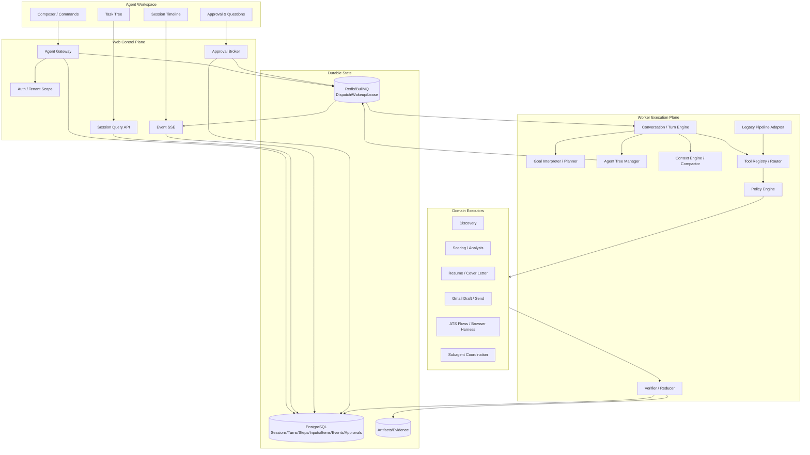
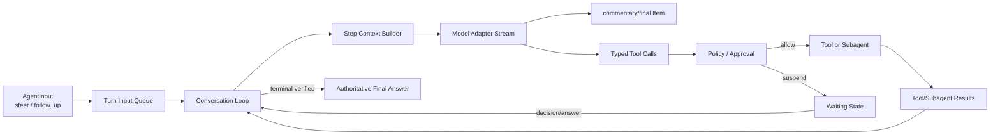
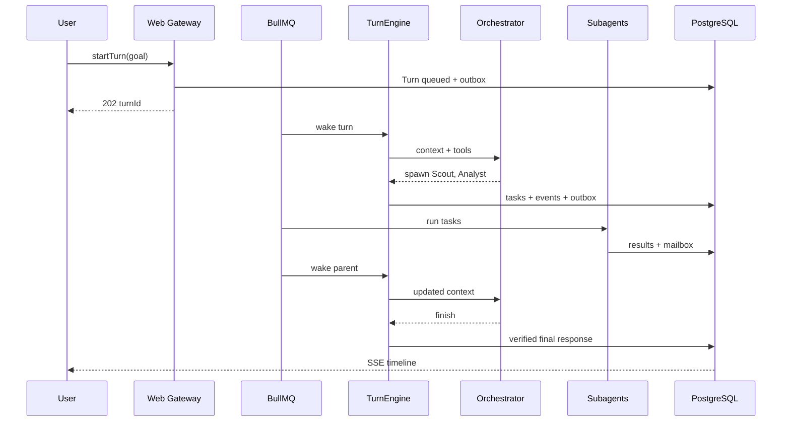
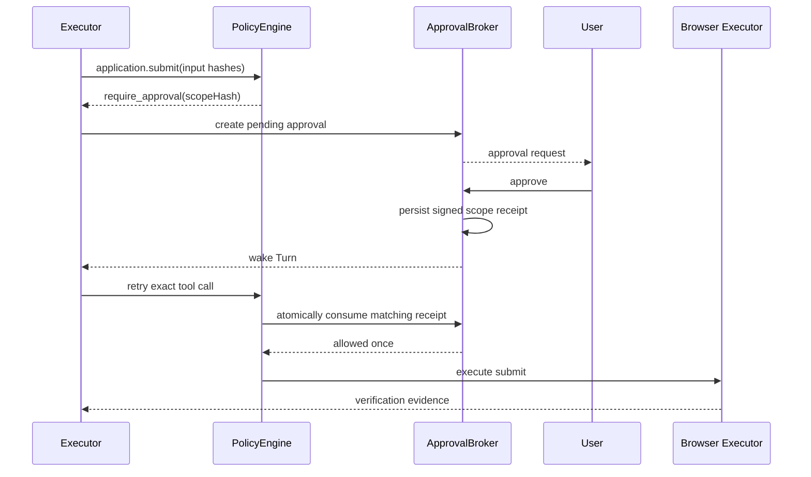
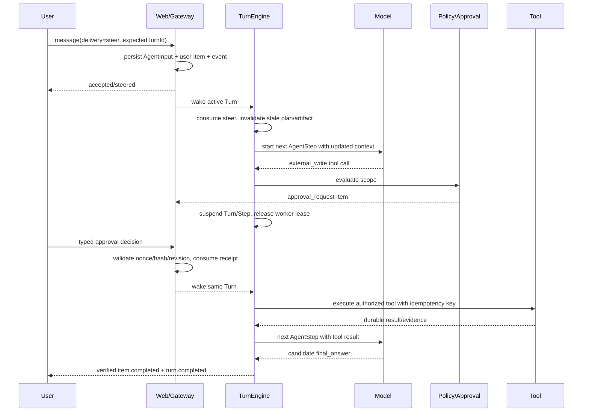

# ApplyMate Agent Harness 2.0 技术设计

> **状态：** Proposed / implementation-ready（第二轮 Codex-chat 审阅已补强）
> **日期：** 2026-08-30
> **适用范围：** ApplyMate Web、Worker、Shared packages、Agent Workspace、Auto-Apply
> **ApplyMate 基线：** `855567b8ca16dfda2282026d26d8f2e91695c014`（`origin/master`）
> **Codex 源码研究基线：** `88f776588f5e73467e7659c268f8358a9a2378b6`（`openai/codex`）
> **相关现有文档：** [Agent Session Quality & Auto-Apply Redesign](./2026-06-18-agent-session-quality-auto-apply-redesign.md)、[Agent Workspace Redesign](./agent-workspace-redesign.md)、[Scraping & Auto-Apply Architecture](./scraping-autoapply-design.md)、[Persona Knowledge Base Design](./persona-knowledge-base-design.md)
> **详细实施路线图：** [Agent Harness 2.0 Development Roadmap](./agent-harness-v2-development-roadmap.md)

## 0. 执行结论

ApplyMate 不应该把 Codex CLI、Codex app-server 或 Claude Code 直接嵌入生产系统，也不应该把某家模型的专有 Tool Calling API 写死为核心协议。

正确方向是建设一个 **ApplyMate 自有、模型无关、求职领域专用的 Agent Harness 2.0**：

- 借鉴 Codex 的 `Thread → Turn → Item → Event` 生命周期；
- 借鉴 Codex 根会话共享 `AgentControl` 的任务树、并发、预算与通信管理；
- 借鉴统一 `ToolRegistry → Policy → Executor → Result` 工具闭环；
- 借鉴可恢复、可中断、可 steer、可压缩的长会话机制；
- 保留 ApplyMate 已有的 ModelRouter、Persona、Job、Resume、FormPattern、ATS flows、BullMQ、审批和浏览器能力；
- 把“求职申请真实性、用户授权、敏感答案、外部提交”作为比通用 Codex 更严格的领域安全边界。

最终形态不是一个更大的 `OrchestratorAgent`，而是一套小型运行时：

```text
用户目标
  → 解释为 Turn
  → Orchestrator 规划任务图
  → 调用工具或分发 Subagent
  → 子任务通过 mailbox 返回结构化结果
  → 验证器检查证据、质量与权限
  → Reducer 更新会话与业务状态
  → 必要时等待用户审批/补充答案
  → 恢复执行
  → 生成有证据的最终总结
```

这份设计不包含 Prompt 文案。Prompt、角色说明和模型调优应在协议与运行时稳定后单独设计，不能反过来替代架构。

第二轮审阅结论需要说得更明确：**原方案足以建设一个可靠的 Agent 后端，但仅按原方案实施，仍不能保证得到“Codex 聊天”的交互效果。** 原因不是 UI 不像，而是此前没有把以下行为规定为一等协议：同一 Turn 内连续多次模型调用、工具结果回灌后原地继续、运行中追加指令、进度消息与最终回答分相、审批/提问后恢复、流式快照与细粒度 delta 分层、消息分支与重试。

本次补强将“像 Codex”定义为可测试的运行时行为，而不是视觉模仿：

- 用户消息被快速接收并立即出现在 timeline；
- Agent 在一个 Turn 中可以多次思考摘要、发进度、调用工具、分发任务、等待、继续，最后只交付一个权威 final answer；
- 用户在任务运行时可 steer 当前 Turn、排队下一 Turn 或 interrupt，三者语义不混淆；
- 审批、用户回答、异步工具和 Subagent 返回都恢复原 Turn，不伪装成新的独立聊天请求；
- 浏览器断线不取消后台工作，重连后从 durable snapshot + sequence tail 恢复；
- 模型供应商的会话 ID 只是加速游标，ApplyMate 的 Session/Turn/Item/Event 始终是事实源；
- 用户看到的是结构化工作过程和结果，不是原始 chain-of-thought，也不是不可审计的文本动作暗号。

---

## 1. 为什么需要 Harness 2.0

OpenAI 将 harness 定义为模型之外的执行系统：它负责理解任务、维持上下文、使用工具、暴露进度、处理失败、请求批准并交付结果。官方也明确指出，能够创建 Thread、启动 Turn、流式接收事件、处理审批的生命周期才是深度产品集成的核心，而不是复制一个聊天界面。[Codex as a platform](https://developers.openai.com/blog/codex-as-a-platform)、[Codex App Server](https://developers.openai.com/codex/app-server)

ApplyMate 已经拥有大量正确的零部件，但这些零部件目前分布在三套运行逻辑中：

1. `/api/agent/chat`：一次选择一个 specialist，再由主模型总结；仍使用 `ACTION:` 文本协议。
2. `runPipeline()`：固定执行 `scout → analyze → prepare → gate → execute → audit`，只能按 stage checkpoint 恢复。
3. Worker `AgentHarness`：浏览器 DOM 感知与动作循环，只服务单次表单填写，消息和 turn log 主要保存在内存。

三者分别具备“理解”“业务流程”“浏览器执行”的一部分，但没有统一的 Turn、Tool、Policy、Subagent、Context 和 Event 内核。因此当前系统会出现以下结构性限制：

- 聊天知道用户在说什么，但不能以统一协议驱动后台流程；
- Pipeline 能执行，但不能动态拆分、并行、重规划或接收中途 steer；
- 浏览器 Harness 能操作网页，但不是整个系统的执行内核；
- `SubAgentTask` 已持久化，却仍是同步函数包装，不是独立可管理的 Agent；
- `memorySummary` 同时承担展示文本、最后回复和暂停原因，不能作为可靠上下文压缩结果；
- UI、SSE、数据库 transcript 和 Worker log 不是一个无损事件源。

Harness 2.0 的目标是把这些能力收敛为一个闭环，而不是再增加第四套运行逻辑。

---

## 2. 目标、非目标与成功定义

### 2.1 目标

1. **理解：** 把自然语言请求解释为持久化 Turn、目标、约束、风险级别和任务图。
2. **执行：** 通过统一 Tool Registry 调用搜索、分析、材料生成、审批、队列和浏览器执行能力。
3. **分发：** 创建真正有生命周期、预算、上下文和 mailbox 的 Subagent，支持并行与后续消息。
4. **总结：** 生成基于事件、产物和业务事实的最终报告，而不是仅总结模型对话。
5. **闭环：** 支持失败重试、等待用户、审批后恢复、中断、重新规划、压缩和进程崩溃恢复。
6. **模型无关：** 继续支持 MiniMax、OpenAI-compatible、Anthropic、自定义模型 API 和 BYOK。
7. **领域安全：** 外部提交、邮件发送、敏感回答和用户材料变更必须由程序策略控制。
8. **渐进迁移：** 复用现有数据库、Pipeline、ATS flows 和 UI，不进行一次性重写。

### 2.2 非目标

- 不复制 Codex 的代码编辑、Shell sandbox 或 Git 工作区功能。
- 不在第一阶段引入通用 MCP marketplace。
- 不以向量数据库代替 Persona 的事实与来源模型。
- 不让模型直接写最终业务表或直接调用数据库。
- 不让 Subagent 自由访问所有工具和所有用户数据。
- 不在第一阶段引入 Temporal、Kafka 或新的微服务平台。
- 不自动解决或绕过 CAPTCHA；当前实现的正确行为是检测并转为用户处理。
- 不推翻 ATS 专用确定性流程；模型应是 fallback 和协调者，而不是替代稳定流程。

### 2.3 产品级成功定义

用户在同一个 Agent Session 中可以：

1. 用自然语言提出“找 10 个 Dublin 后端岗位，分析，准备材料，但提交前让我确认”；
2. 看到 Orchestrator 建立计划并分发 Scout、Analyst、Writer、Reviewer；
3. 在任务执行中补充“只考虑混合办公”，系统将该输入 steer 到当前 Turn；
4. 查看每个子任务状态、证据、成本和结果；
5. 对材料或最终提交进行明确审批；
6. 系统在审批后从精确 checkpoint 恢复，而不是重跑整个 Pipeline；
7. 发生 Worker 重启或重复队列投递时不重复提交；
8. 最终得到包含“完成了什么、没有完成什么、为什么、下一步是什么”的可信总结。

---

## 3. 研究基线与可借鉴边界

### 3.1 Codex 官方协议事实

Codex app-server 对外采用 Thread、Turn、Item 模型：Thread 保存长期对话，Turn 表示一次用户驱动的工作，Item 表示消息、计划、推理摘要、命令、文件修改、工具调用或协作 Agent 活动。它支持 `turn/start`、`turn/steer`、`turn/interrupt`，并通过 `item/started`、delta、`item/completed` 等事件流展示生命周期。[Codex App Server](https://developers.openai.com/codex/app-server)

`turn/steer` 需要 `expectedTurnId`，以避免用户输入被错误写入另一个并发 Turn；手动 compaction 也作为标准 Turn/Item 生命周期流式发布，而不是静默覆盖历史。[Codex App Server](https://developers.openai.com/codex/app-server)

Codex 的 Agent message 还带有 `commentary` 与 `final_answer` phase；`item/completed` 是该 Item 的权威状态，`turn/completed` 才表示整轮结束。审批不是另开一轮聊天，而是 Turn 内的 server request：客户端提交决定后，原 Item 完成，原 Turn 继续执行。这三点直接决定客户端不能把“收到一段文本”误判为“任务完成”。[Codex App Server](https://developers.openai.com/codex/app-server)

Codex 还支持从指定 Turn fork Thread、分页读取 Turns/Items，并将 Subagent 并发限制在 Session 级。ApplyMate 不需要复制全部接口，但应保留分支历史、Session 级并发和按 Turn/Item 恢复的语义，否则长任务、重试和多 Agent 结果会在聊天层失真。[Codex App Server](https://developers.openai.com/codex/app-server)、[Codex Subagents](https://developers.openai.com/codex/subagents)

### 3.2 Codex 源码中真正值得复用的结构

本设计基于上述 Codex 提交的以下源码结构：

| Codex 源码 | 关键思想 | ApplyMate 对应实现 |
|---|---|---|
| `codex-rs/core/src/agent/control.rs` | 每个根会话树共享一个 `AgentControl`、registry、并发 limiter、rollout budget | `AgentTreeManager`，按 `AgentSession` 隔离任务树、预算、并发和通信 |
| `codex-rs/core/src/tools/registry.rs` | 工具是 typed runtime；执行前后有 hooks、生命周期和 telemetry | `ToolRegistry` + `PolicyEngine` + `ToolExecutor` + `AgentEvent` |
| `codex-rs/core/src/tools/router.rs` | 模型可见 spec 与真实 executor 分离；统一取消 | Provider-neutral tool schema、执行路由和 AbortSignal |
| `multi_agents_spec.rs` | `spawn/send/wait/resume/close` 是明确工具协议 | `spawn_subagent/send_message/wait_subagents/interrupt_subagent/close_subagent` |
| `multi_agents_v2/wait.rs` | wait 等 mailbox 或 steer，超时有边界 | BullMQ/DB mailbox + 有界长轮询；用户 steer 唤醒根任务 |
| `multi_agents_v2/spawn.rs` | 子 Agent 有父 Turn、路径、角色、模型、fork mode | 子任务持有 parentTaskId、rootTurnId、role、context snapshot、model profile |
| `compact.rs` | 压缩是显式生命周期；保留真实用户消息和初始上下文；记录 token 前后 | `ContextSnapshot` + compaction item + invariant validator |
| `app-server-protocol/v2` | Thread/Turn/Item 的持久协议与状态 | `AgentSession/AgentTurn/AgentItem/AgentEvent` |

### 3.3 不直接嵌入 Codex 的原因

Codex app-server 非常适合把 Codex 本身嵌入产品；官方也把它定位为本地 Codex 进程的深度集成接口。ApplyMate 的核心任务却是求职数据、邮件、ATS、Resume、Persona 和浏览器申请，而用户明确要求使用自己的模型 API。直接使用 app-server 会造成：

- 模型与认证路径被 Codex 运行时牵引；
- 工具和权限语义偏向代码与本地文件系统；
- 生产部署需要管理每个会话的本地进程或远程 transport；
- ApplyMate 的业务数据和审批仍需另建一层；
- 无法自然复用现有 ModelRouter 的 BYOK 与 feature 配置。

因此本设计复用的是 **协议原语和运行时结构**，不是运行二进制。

### 3.4 Claude 的参考边界

Claude Code 的完整核心并非以与 Codex 相同的方式开放。可借鉴的是公开产品概念：Subagent 角色隔离、权限配置、hooks、长上下文管理。实现证据仍以可核验的 Codex 开源源码和 ApplyMate 当前代码为主，避免猜测 Claude 内部实现。

---

## 4. 当前项目架构审阅

### 4.1 当前实际架构

```mermaid
flowchart LR
  UI[Agent Workspace] --> CHAT[/api/agent/chat]
  UI --> RUN[/api/agent/run + sessions APIs]
  UI --> ACTIONS[/sessions/:id/actions]

  CHAT --> CPLAN[Chat planner]
  CPLAN --> ONE[One specialist call]
  ONE --> SYNTH[Orchestrator synthesis]

  RUN --> RS[run-service]
  RS --> PIPE[Fixed pipeline]
  PIPE --> ORCH[OrchestratorAgent]
  PIPE --> STAGES[Scout/Analyze/Prepare/Gate/Execute/Audit]

  RS --> ARQ[Agent run queue]
  ARQ --> WORKER[Worker HTTP callback]
  WORKER --> APPLYQ[Apply queue]
  APPLYQ --> FLOWS[ATS deterministic flows]
  APPLYQ --> BH[Browser AgentHarness fallback]

  CHAT --> DB[(Postgres AgentSession)]
  PIPE --> REC[Run recorder projection]
  REC --> DB
  ACTIONS --> DB
  ARQ --> REDIS[(Redis/BullMQ)]
  APPLYQ --> REDIS
```

### 4.2 已经成熟、必须保留的能力

| 能力 | 当前证据 | 设计结论 |
|---|---|---|
| 会话持久化 | `AgentSession`、`SubAgentTask`、`AgentTranscriptEvent`、`AgentApproval` | 演进，不删除 |
| 可恢复 Pipeline | `AgentExecution.state/checkpoint`、claim、stale reclaim、cancel | 作为 Legacy Pipeline Adapter 接入新内核 |
| 自动化会话复用 | `AgentAutomation.sessionId @unique`、`automation-session.ts` | 保留；一个 automation 继续使用一个 canonical session |
| 用户暂停/回答 | `AgentRunQuestion`、`waiting_for_user`、answer route | 迁移到通用 Input/Approval mailbox，兼容旧表 |
| 浏览器申请 | ATS flows、`AgentHarness`、FormPattern replay | 作为工具 executor，不作为主 Orchestrator |
| 外部提交保护 | fill-for-review、`submit_application` approval、submission guard | 加固并绑定 scope/hash；不可弱化 |
| 敏感字段检查 | `confirmedAnswers`、form review、敏感字段 regex | 接入统一 PolicyEngine |
| CAPTCHA 处理 | `detectCaptcha()` 仅检测，返回 manual | 保持；旧文档中的 solver 描述视为过时 |
| 数据来源 | PersonaFact/PersonaEvidenceChunk | 作为 factual context，不新建“自由记忆”替代它 |
| 程序记忆 | FormPattern + confidence | 作为 procedural memory |
| 模型路由 | Web ModelRouter + shared Worker LLM config | 升级 capability，不替换 provider 策略 |
| 可靠队列 | BullMQ、dead letter、worker state、queue admin | 作为 dispatch/wakeup 层 |
| 成本数据 | AI usage、external API usage、budget | 扩展到 session/turn/task/tool 维度 |

### 4.3 关键架构问题

#### P0：提交授权辅助函数存在 fail-open 默认值

`apps/worker/src/harness/agent-harness.ts` 和 `apps/worker/src/flows/helpers.ts` 中，当 `beforeSubmit` 不存在时，授权辅助函数返回 `true`。当前队列调用链可能提供 guard，但运行时契约本身仍是 fail-open。

Harness 2.0 必须规定：

```text
所有 external_submit 工具调用
  → 必须存在 approval scope
  → 必须存在未过期且未消费的 approval receipt
  → 必须匹配 user/session/turn/job/material/answers hash
  → 原子消费后才允许执行
  → 任一字段缺失均拒绝
```

这是新架构第一批实施项，不等到最后迁移。

#### P0：不存在统一的 Turn 边界

`AgentSession` 直接关联 transcript 和 task，`AgentExecution` 每个 session 仅一条。这样无法精确表达：

- 同一 session 中的多轮用户请求；
- 当前正在运行哪一个用户 Turn；
- 用户 steer 应进入哪个 Turn；
- 一个自动化 session 中每次调度对应哪次运行；
- Turn 级模型、预算、错误、最终答复与 token 使用。

#### P0：当前 Chat 不是可持续的 Agent Loop

当前 `/api/agent/chat` 的真实路径是：

```text
createChatPlan（固定只选一个 specialist）
  → runChatWorker（单次同步执行）
  → synthesizeChatResult（第二次模型总结）
  → HTTP stream done
```

这条链路缺少 Turn 内 Step 循环、tool-result feedback、input queue、suspension/resume 和 final phase。`AgentPlaygroundPage` 另开 Pipeline EventSource，`agent-chat-stream.ts` 只累加 text/block/action，结果是“聊天”和“执行”仍是两个相邻系统。若不先解决这一点，新增更多 specialist 只会形成更复杂的路由器，不会形成 Codex chat。

因此升级顺序必须是：**先建立 AgentStep + conversation loop + typed items，再迁移 specialist/subagent；不能先把单 specialist 改成多 specialist 并行后继续由一次 synthesis 收尾。**

#### P1：三套 Orchestrator 逻辑互不统一

- Chat planner 只选择一个 specialist；
- Pipeline Orchestrator 只能决定 proceed/retry/ask/abort；
- Browser Harness 只决定 DOM action。

它们可以保留各自领域算法，但必须由同一个 TurnEngine 调度。

#### P1：SubAgentTask 不是实际 Subagent

当前 `runSubAgentTask(db, contract, handler)` 在调用栈内同步执行 handler。它没有：

- 独立 queue/lease；
- parent/root 任务树；
- inbox/outbox；
- 独立 context snapshot；
- token/tool/time budget；
- send、wait、interrupt、resume、close；
- 子 Agent 继续分发的深度与并发控制。

它是优秀的持久化 wrapper，但还不是 Codex 意义上的 AgentControl。

#### P1：模型接口是 text-only

`modelChat()` 和 Worker `callLlm()` 接收文本 messages，未暴露 provider-neutral tools、tool choice、structured output、tool calls 和 cancellation。现在靠 JSON 抽取或 `ACTION:` 正则恢复意图，会导致协议脆弱、工具状态不可审计、模型供应商能力无法利用。

#### P1：事件模型是有损 projection

`run-recorder.ts` 把部分 Pipeline event 映射到 `AgentTranscriptEvent`，未知事件直接返回 `null`。事件缺少单调 sequence、turnId、itemId、correlationId、幂等键和 started/delta/completed 生命周期，无法作为 replay source of truth。

#### P1：上下文压缩不是运行时能力

`OrchestratorAgent.history.slice(-4)`、chat conversation history、`memorySummary` 和浏览器 messages 各自管理上下文。没有统一 token accounting、压缩触发器、summary schema、事实不变量和快照版本。

#### P2：控制平面与执行平面倒置

Worker 的 `agent-runs` 消费者通过 HTTP 回调 Web `/api/internal/agent-run`，实际长 Pipeline 仍在 Web 运行。对 Vercel 而言，这增加超时、重入和部署切换风险。长期执行应逐步迁入 Worker；Web 负责授权、命令、查询和 SSE。

#### P2：UI 有 live/replay 双状态

`selectedSessionId` 与 `liveSessionId`、本地 log 与 persisted transcript、run EventSource 与 chat stream 并行存在。已有大量防 stale closure 和旧 EventSource 污染的补丁，说明需要协议级收敛，而不是继续在组件中维护额外状态机。

---

## 5. 目标架构

### 5.1 总体架构图



### 5.2 部署边界

#### Web：控制平面

Web 负责：

- 身份认证与 `userId` scope；
- 创建 Session/Turn/Command；
- 接收用户 steer、interrupt、审批和回答；
- 读取 materialized view；
- SSE/分页事件输出；
- 管理 Automation 配置；
- 对高风险动作显示具体影响。

Web 不负责：

- 执行长时间模型循环；
- 保持浏览器进程；
- 等待 Subagent；
- 在请求生命周期内跑完整 Pipeline。

#### Worker：执行平面

Worker 负责：

- claim Turn/Task lease；
- 构建上下文；
- 调用模型；
- 分发和等待 Subagent；
- 执行工具；
- 运行 ATS/browser；
- 写事件、outbox、checkpoint 和 usage；
- 崩溃恢复、重试、DLQ。

#### PostgreSQL 与 Redis

- PostgreSQL 是事实源：状态、事件、审批、任务、产物引用都必须持久化。
- Redis/BullMQ 只负责 dispatch、wakeup、短 lease、去重和 backpressure。
- Redis 丢失后可以从 PostgreSQL 重新扫描 queued/running-stale work。
- 不把会话完整上下文只存 Redis。

### 5.3 “Codex 聊天效果”的行为契约

UI 样式、打字动画和侧栏不是 Codex 体验的核心。ApplyMate 的 Chat Harness 必须满足以下九条可观察行为：

| 行为 | 用户看到什么 | 运行时保证 |
|---|---|---|
| 快速接受 | 发送后立即出现自己的消息和“已接收/排队”状态 | Web 在事务内持久化 `AgentInput`、user Item、Turn/outbox 后返回，不等待模型 |
| 持续工作 | 同一轮中持续出现计划、进度、工具、Subagent 和产物 | 一个 Turn 包含多个 `AgentStep`；每次工具结果可触发下一 Step |
| 可改向 | Agent 正在运行时仍可发送“先只看 Dublin” | `delivery=steer` 写入 active Turn input queue，并要求 `expectedTurnId` |
| 可排队 | 用户可把另一项工作放到当前任务之后 | `delivery=follow_up` 创建 queued input；当前 Turn 不吸收该输入 |
| 可停止 | Stop 后后台真实停止可取消工作 | interrupt 级联 AbortSignal、task、tool、browser；不可逆调用进入证据核对 |
| 可暂停恢复 | 审批、敏感问题、登录/MFA 后从原位置继续 | suspension 保留 Turn/Step/Item；回答只解除等待，不创建伪造的新任务 |
| 可断线续传 | 刷新或离线后回来仍看到准确进度 | snapshot + durable event sequence 恢复；浏览器连接不拥有执行生命周期 |
| 可解释但不泄露思维链 | 显示简短计划、依据和状态，不显示隐藏推理 | 只发布 `reasoning_summary`/`commentary`；原始 chain-of-thought 不持久化、不返回 |
| 权威完成 | 最终答案清楚区分已完成、未完成和下一步 | 每个 completed Turn 最多一个权威 `final_answer` Item；由 Finalizer 基于事实生成 |

### 5.4 Chat Kernel 在目标架构中的位置

原图中的 TurnEngine 需要展开为真正的对话内核，而不是“规划一次、执行一次、总结一次”：



关键约束：

1. **一个 Session 同时最多一个 active root Turn。** Subagent 可以并发，但不能有两个根 Turn 同时争抢同一会话上下文。
2. **一个 Turn 可以有多个 AgentStep。** Step 是一次 provider model response/attempt；Turn 不是一次 HTTP 模型调用。
3. **一个 Step 可以产生多个 Item。** 例如 commentary、两个并行只读 tool call、usage 和 step completion。
4. **工具/审批结果必须回到同一 Turn。** 只有 Turn 达到经过验证的 terminal condition 才产生 final answer。
5. **事件连接不是任务所有者。** SSE 断开、页面隐藏或客户端进程退出都不能隐式 interrupt。
6. **外部写与 final answer 解耦。** final answer 可以报告 `waiting_for_user`、`uncertain` 或部分完成，绝不能为了“聊天完整”而假报成功。

---

## 6. 核心协议：Session → Turn → Step → Item → Event

### 6.1 AgentSession

Session 是用户可见的长期工作空间，等价于 Codex Thread，但采用 ApplyMate 术语。

职责：

- 保存长期 goal、source、用户、自动化绑定和当前状态；
- 包含多个 Turn；
- 作为 Agent tree、总预算和长期 memory snapshot 的隔离边界；
- 一个 Automation 继续复用一个 canonical Session。

### 6.2 AgentTurn

Turn 是一次明确的用户或调度触发工作。

建议状态：

```ts
type AgentTurnStatus =
  | 'queued'
  | 'in_progress'
  | 'waiting_for_dependency'
  | 'waiting_for_approval'
  | 'waiting_for_user'
  | 'interrupted'
  | 'completed'
  | 'failed'
  | 'cancelled'
```

Turn 必须拥有：

- `input`：用户消息、附件、Automation trigger 或 approval continuation；
- `rootTaskId`；
- `modelProfileSnapshot`；
- `toolPolicySnapshot`；
- `budgetSnapshot`；
- `contextSnapshotId`；
- `finalResponse` 与 `error`；
- token、cost、duration；
- optimistic `revision`。

合法状态转换：

```text
queued → in_progress
in_progress ↔ waiting_for_dependency
in_progress ↔ waiting_for_approval
in_progress ↔ waiting_for_user
queued|in_progress|waiting_* → interrupted|cancelled|failed
in_progress → completed
```

`waiting_*` 是可恢复的 active Turn，不是 terminal。只有 `completed|failed|interrupted|cancelled` 释放 Session 的 root-turn slot 并允许 queued follow-up 启动。

### 6.3 AgentStep

`AgentStep` 是本次补强新增的关键层：它表示 Turn 内的一次模型响应或恢复尝试。当前 `/api/agent/chat` 把整个请求绑定为固定的“plan call → specialist call → synthesis call”，无法表示工具回灌、审批恢复和 steer 后继续。显式 Step 后，Turn 可以保持同一个用户目标而进行多次模型调用。

```ts
type AgentStepStatus =
  | 'queued'
  | 'streaming'
  | 'waiting_for_tool'
  | 'waiting_for_approval'
  | 'waiting_for_user'
  | 'completed'
  | 'failed'
  | 'interrupted'
```

Step 必须记录：

- `ordinal` 和 `attempt`，支持精确重放与故障诊断；
- `inputSnapshotId` 和 `inputThroughSequence`，说明模型实际看到了哪些事实；
- provider/model/capability snapshot；
- provider response/conversation cursor，但这些不是事实源；
- finish reason、tool call IDs、usage、latency 和错误分类；
- `consumedInputIds`，证明哪些 steer/回答已经进入本 Step；
- parent Step，用于 repair、fallback 或恢复链路。

Turn 与 Step 的关系是 `1:N`。同一个 active Turn 中只允许一个 root Step 正在调用模型；并行性发生在其创建的只读工具或 Subagent 上。

### 6.4 AgentItem

Item 是 Turn 中可被 UI、模型或审计理解的工作单元：

```ts
type AgentItemType =
  | 'user_message'
  | 'agent_message'
  | 'plan'
  | 'reasoning_summary'
  | 'tool_call'
  | 'tool_result'
  | 'subagent_activity'
  | 'approval_request'
  | 'approval_response'
  | 'question'
  | 'artifact'
  | 'context_compaction'
  | 'error'
```

Item 状态统一为：

```ts
type ItemStatus = 'started' | 'streaming' | 'completed' | 'failed' | 'interrupted'
```

`agent_message` 必须有 phase：

```ts
type AgentMessagePhase = 'commentary' | 'final_answer'
```

- `commentary`：简短进度、计划变化、可读依据或阶段总结；允许一个 Turn 多条。
- `final_answer`：Turn 的权威交付；completed Turn 最多一条。
- `reasoning_summary`：独立可选 Item；不得包含原始 chain-of-thought。
- `tool_call` 和 `approval_request` 不是 assistant 文本的附件字符串，而是独立、可交互 Item。

### 6.5 AgentEvent

Event 是 append-only 的事实流；Item 是 Event reducer 后的实体。两者不能混为一张展示表。

每个 Event 必须包含：

```ts
interface AgentEventEnvelope<T = unknown> {
  id: string
  sessionId: string
  turnId: string
  itemId: string | null
  taskId: string | null
  sequence: bigint
  type: string
  actor: 'user' | 'orchestrator' | 'subagent' | 'tool' | 'system'
  correlationId: string
  causationId: string | null
  idempotencyKey: string | null
  payload: T
  createdAt: string
}
```

要求：

- `sequence` 在 session 内单调递增；
- SSE 使用 `Last-Event-ID` 从 sequence 恢复；
- 未识别事件由客户端安全忽略但保留，不允许 recorder 丢弃；
- started、delta、completed 共享 itemId；
- 业务写与 event/outbox 在同一数据库事务中提交。

### 6.6 AgentInput 与会话输入队列

用户在 Agent 运行时发送的消息不能直接拼进下一次 prompt，也不能仅保存在 React state。每条输入先持久化为 `AgentInput`：

```ts
interface AgentInputCommand {
  clientMessageId: string
  sessionId: string
  expectedTurnId: string | null
  delivery: 'steer' | 'follow_up'
  content: Array<TextPart | AttachmentRefPart>
}
```

状态：`accepted | queued | consumed | cancelled | rejected`。

规则：

- Session idle 时，任意有效输入创建新 Turn；
- Session active 时，composer 默认显示“添加到当前任务”，发送 `steer`；
- 用户选择“下一项任务”时发送 `follow_up`，待当前 Turn terminal 后创建新 Turn；
- `steer` 必须匹配 `expectedTurnId`，否则 `409 active_turn_changed`，客户端刷新状态后让用户重发或改为 follow-up；
- 同一 `clientMessageId` 在 Session 内幂等；重连/双击不会生成两条 user Item；
- accepted steer 按 sequence FIFO 消费；多个尚未消费的纯约束 steer 可由确定性 collector 合并，但原始输入不可改写；
- approval decision 和 question answer 使用各自 typed command，不混入普通 steer 文本；
- Automation 输入只创建独立 queued Turn，不 steer 用户当前正在运行的 Turn。

### 6.7 兼容现有表

- `AgentTranscriptEvent` 在迁移期保留为 UI projection，不再作为最终事实源。
- `AgentRun` 保留为历史 summary，逐步改为 Turn 完成后的 projection。
- `AgentExecution` 暂时保留为 Legacy Pipeline 的 materialized execution state。
- 新运行只写 AgentEvent/Item/Turn，再通过 reducer 生成旧视图。

---

## 7. Harness Kernel 组件

### 7.1 AgentGateway

统一接收：

- `startTurn`
- `steerTurn`
- `interruptTurn`
- `submitApprovalDecision`
- `answerQuestion`
- `retryTask`

Gateway 只写 command 和 outbox，不在 HTTP 请求内执行模型。

所有 mutation 要求：

- 当前 authenticated user 与 session owner 一致；
- `Idempotency-Key`；
- `expectedTurnId` 或 `expectedRevision`；
- 明确的 command schema；
- 审计 actor 和 source。

### 7.2 TurnEngine

TurnEngine 是状态机，不是 Prompt 容器。

```text
claim turn lease
  → load immutable Turn input
  → load/validate ContextSnapshot
  → ask planner for next intent
  → validate intent schema
  → policy check
  → execute tool or subagent operation
  → append item/event
  → reduce state
  → verify completion condition
  → continue / wait / compact / finish
```

每一步最多执行一个可恢复 side effect。任何可能重试的 side effect 必须有 idempotency key。

#### 7.2.1 同一 Turn 的多 Step 对话循环

TurnEngine 的实际循环应接近以下伪代码：

```ts
while (!turn.isTerminal()) {
  assertLeaseAndBudget(turn)
  const inputs = await inputQueue.claimUnconsumedSteer(turn.id)
  const context = await contextEngine.buildStepContext(turn, inputs)
  const step = await stepRepository.start(turn, context)

  const outcome = await modelAdapter.streamStep({
    context,
    tools: toolRegistry.visibleTo(turn.rootTaskId),
    signal: turn.abortSignal,
  })

  await stepReducer.persist(outcome)

  if (outcome.kind === 'tool_calls') {
    const calls = await toolRouter.validateAndSchedule(outcome.calls)
    const results = await toolCoordinator.awaitRequiredResults(calls)
    await contextEngine.attachToolResults(step.id, results)
    continue // 在同一个 Turn 中启动下一 AgentStep
  }

  if (outcome.kind === 'suspended') {
    await turn.suspend(outcome.reason) // approval/question/login/MFA
    return
  }

  if (outcome.kind === 'candidate_final') {
    const verified = await finalizer.verifyCandidate(turn, outcome)
    if (verified.ok) return turn.complete(verified.finalItem)
    await contextEngine.attachVerifierFeedback(step.id, verified.feedback)
    continue
  }

  if (outcome.kind === 'retryable_error') continue
  return turn.fail(outcome.error)
}
```

这里的 `awaitRequiredResults` 不表示阻塞一个 HTTP 请求，而是持久化等待条件并释放 Worker。工具、审批、用户回答或 Subagent 结果到达后，通过 outbox/wakeup 重新 claim Turn。

#### 7.2.2 安全边界与终止条件

每次循环都必须检查：

- 新 steer 是否使尚未执行的 plan/tool 参数失效；
- 已有 artifact 是否因目标变化变为 `possibly_stale`；
- approval scope/hash 是否仍匹配；
- context/token/tool/cost/wall-clock/subagent budget；
- interrupt 是否已请求；
- 是否正在重复无进展的 model/tool pattern。

终止原因必须是程序可验证的枚举，而不是模型说“完成了”：

```ts
type TurnTerminalReason =
  | 'goal_satisfied'
  | 'partial_result'
  | 'waiting_requires_new_turn'
  | 'user_interrupted'
  | 'budget_exhausted'
  | 'policy_denied'
  | 'unrecoverable_error'
```

防止死循环：默认每 Turn 最多 24 个 root model steps、64 个 tool calls、8 个 repair/fallback steps；达到上限时 Finalizer 生成明确的 partial/failed 结果，不继续静默消耗。

### 7.3 GoalInterpreter 与 Planner

Planner 输出结构化 `NextStep`，不能直接输出任意动作字符串：

```ts
type NextStep =
  | { kind: 'call_tool'; tool: string; arguments: unknown; rationaleSummary: string }
  | { kind: 'spawn_subagent'; contract: AgentTaskContract }
  | { kind: 'send_message'; targetTaskId: string; message: AgentMessageInput }
  | { kind: 'wait'; taskIds: string[]; timeoutMs: number }
  | { kind: 'ask_user'; question: QuestionDraft }
  | { kind: 'request_approval'; request: ApprovalDraft }
  | { kind: 'compact_context'; reason: string }
  | { kind: 'finish'; response: FinalResponseDraft }
```

Planner 只决定意图；程序决定该意图是否被允许、如何执行、如何持久化。

### 7.4 ToolRegistry 与 ToolRouter

统一工具契约：

```ts
interface ToolDefinition<TInput, TOutput> {
  name: string
  version: string
  description: string
  inputSchema: JsonSchema
  outputSchema: JsonSchema
  risk: 'read' | 'draft_write' | 'internal_write' | 'external_write'
  idempotency: 'read_only' | 'idempotent' | 'requires_key' | 'non_repeatable'
  timeoutMs: number
  requiredCapabilities: string[]
  execute(ctx: ToolExecutionContext, input: TInput): Promise<TOutput>
}
```

ToolRouter 流程：

```text
resolve tool/version
  → validate JSON schema
  → tenant/capability check
  → BeforeToolUse policy hooks
  → approval check
  → reserve budget/rate limit
  → append tool_call.started
  → execute with AbortSignal
  → validate output schema
  → PostToolUse hooks/redaction
  → append tool_result.completed|failed
  → reducer applies allowed state change
```

### 7.5 PolicyEngine 与 ApprovalBroker

PolicyEngine 是确定性程序，不是另一个 LLM。

Hook 点：

- `BeforeModelCall`
- `AfterModelCall`
- `BeforeToolUse`
- `AfterToolUse`
- `BeforeBusinessMutation`
- `BeforeExternalSubmission`
- `BeforeContextCompaction`
- `BeforeFinalResponse`

决策：

```ts
type PolicyDecision =
  | { outcome: 'allow' }
  | { outcome: 'deny'; code: string; userMessage: string }
  | { outcome: 'require_approval'; scope: ApprovalScope }
  | { outcome: 'require_user_input'; question: QuestionDraft }
  | { outcome: 'rewrite_input'; safeInput: unknown }
```

### 7.6 AgentTreeManager

每个 Session 创建一个逻辑 AgentTreeManager，所有子任务共享：

- root session id；
- task registry；
- concurrency limiter；
- session budget；
- mailbox event channel；
- depth 和 fan-out 限制；
- cancel token；
- model/tool policy inheritance。

第一版协调工具：

| 工具 | 行为 |
|---|---|
| `spawn_subagent` | 创建持久任务，写 outbox，返回 taskId/path |
| `send_message` | 向任务 inbox 入队，不隐式创建新任务 |
| `wait_subagents` | 等任一目标状态/mailbox 更新或用户 steer；有界超时 |
| `list_subagents` | 返回当前任务树的 materialized 状态 |
| `interrupt_subagent` | 请求取消正在执行的 task lease |
| `close_subagent` | 关闭完成/闲置 task，释放并发槽 |

### 7.7 ContextEngine 与 Compactor

ContextEngine 生成给模型的 task-scoped context，不把整库数据灌入模型。

上下文层次：

1. **Policy context：** 安全规则、允许工具、审批状态；
2. **Goal context：** Session goal、当前 Turn input、约束；
3. **Task context：** Subagent contract、父任务摘要；
4. **Business context：** 相关 Job、Resume artifact、已确认 PersonaFact；
5. **Working context：** 当前 Turn 最近 Items、工具结果、mailbox；
6. **Compacted context：** 旧 Turn 的结构化快照；
7. **Procedural context：** ATS flow/FormPattern 引用，不含候选人值。

Compaction 不是把聊天总结成一句话。建议 schema：

```ts
interface AgentContextSnapshot {
  version: number
  sessionId: string
  throughSequence: string
  goal: string
  userConstraints: string[]
  confirmedDecisions: Array<{ decision: string; evidenceEventIds: string[] }>
  completedWork: Array<{ taskId: string; resultRef: string; summary: string }>
  openWork: Array<{ taskId: string; status: string; blocker: string | null }>
  pendingApprovals: string[]
  artifacts: Array<{ id: string; type: string; hash: string }>
  facts: Array<{ factId: string; key: string; source: string }>
  failedAttempts: Array<{ taskId: string; reason: string; doNotRepeat: string[] }>
  budgets: { inputTokens: number; outputTokens: number; costUsd: number }
  summary: string
  checksum: string
}
```

压缩流程：

```text
token threshold/manual request/turn boundary
  → deterministic collector 先提取 IDs、状态、审批和事实
  → model 只总结叙事部分
  → invariant validator 检查 goal、待审批、敏感答案、artifact hash 未丢失
  → 写 context_compaction item
  → 原子发布新 snapshot
  → 后续 context 从 snapshot + 新事件重建
```

### 7.8 Verifier、Reducer 与 Finalizer

模型输出不能直接成为“完成”。必须分三步：

- **Verifier：** schema、证据、质量、安全、业务前置条件；
- **Reducer：** 以白名单 mutation 更新 Job、ApplicationTask、Artifact 或 projection；
- **Finalizer：** 从已验证事件和产物生成最终报告。

最终报告最少包含：

- 用户目标；
- 完成的任务与数量；
- 产生/修改的材料；
- 实际外部动作；
- 未执行动作及原因；
- 待审批/待用户回答；
- 失败和重试；
- 下一步建议；
- 可点击的 Job/Artifact/Session 引用。

---

## 8. 求职领域工具目录

### 8.1 Read tools

| 工具 | 输入 | 输出 | 风险 |
|---|---|---|---|
| `jobs.search` | target/location/source/page | normalized jobs + evidence | read |
| `jobs.get` | jobId | user-scoped Job | read |
| `jobs.compare` | jobIds | deterministic feature matrix | read |
| `persona.retrieve` | keys/useCase/jobId | confirmed facts + provenance | read |
| `resume.get_base` | resumeId | immutable source artifact | read |
| `application.get_state` | jobId/taskId | state + approvals | read |
| `gmail.get_thread` | message/thread id | scoped metadata/content | read |
| `automation.get` | automationId | canonical session/config | read |

### 8.2 Draft and internal-write tools

| 工具 | 风险 | 规则 |
|---|---|---|
| `jobs.score` | draft_write | 结果是 analysis artifact；不能直接提交 |
| `resume.tailor_draft` | draft_write | 基于 base resume 和 confirmed facts；产生新 artifact |
| `cover_letter.draft` | draft_write | 标注 draft 和 source evidence |
| `application.prepare` | internal_write | 只准备材料和 ApplicationTask |
| `application.fill_for_review` | internal_write | 浏览器填写但不提交；产生最终提交审批 |
| `gmail.create_draft` | internal_write | 只创建草稿；不得发送 |
| `automation.upsert` | internal_write | 用户明确请求或审批后；幂等按 owner/name/id |

### 8.3 External-write tools

| 工具 | 必须审批 | 附加要求 |
|---|---:|---|
| `application.submit` | 是 | job/material/answer hash、expiry、nonce、原子消费 |
| `gmail.send` | 是 | draft hash、to/subject/body hash、一次性 receipt |
| `application.withdraw` | 是 | 目标 application id、影响说明 |
| `external.account_login_continue` | 用户在场 | 不保存新凭证，不处理 MFA 代答 |

### 8.4 Coordination tools

协调工具只能由 Orchestrator 或具备 `canManageChildren` capability 的角色调用。默认 Subagent 不能继续无限 spawn。

默认限制建议：

- root 最大并发 4；
- 最大深度 2；
- 每个 Turn 最大创建 12 个任务；
- 单任务最大 wall time 5 分钟，浏览器任务单独配置；
- `wait_subagents` 最大 30 秒一次，由队列重新唤醒，不占用无界进程；
- 子任务完成后必须 close 或由 janitor 自动回收。

---

## 9. Subagent 任务契约

建议演进现有 `SubAgentTask`，而不是另建平行任务表。

```ts
interface AgentTaskContract {
  taskId: string
  sessionId: string
  turnId: string
  rootTaskId: string
  parentTaskId: string | null
  path: string
  role: string
  taskType: string
  goal: string
  constraints: string[]
  successCriteria: string[]
  allowedToolNames: string[]
  deniedToolNames: string[]
  contextSnapshotId: string
  inputArtifactIds: string[]
  expectedOutputSchema: JsonSchema
  modelProfile: ModelCapabilityProfile
  budget: TaskBudget
  maxAttempts: number
  deadlineAt: string
}
```

返回结果：

```ts
interface AgentTaskResult {
  status: 'completed' | 'failed' | 'waiting_for_user' | 'interrupted'
  output: unknown
  summary: string
  evidenceRefs: string[]
  artifactIds: string[]
  confidence: number | null
  unmetCriteria: string[]
  recommendedNextStep: 'proceed' | 'retry' | 'ask_user' | 'abort'
}
```

### 9.1 角色建议

角色不是硬编码流程节点，而是 capability profile：

| 角色 | 默认工具 | 禁止项 |
|---|---|---|
| Orchestrator | coordination、read、plan | 不能直接 external submit |
| Scout | discovery/read | 不改 Job final state、不生成材料 |
| Analyst | job/persona/resume read、score | 不创建虚假事实 |
| Writer | artifact read/draft | 不提交、不把 draft 写回 Persona |
| Reviewer | read、verify、compare | 不自行批准 |
| Executor | internal write、browser fill | external submit 需 receipt |
| Auditor | event/artifact read | 不执行业务 mutation |

Custom Agent 也必须映射到 capability profile，不能因为用户填了 system prompt 就获得任意工具。

### 9.2 Context fork 模式

支持三种模式：

- `task_scoped`：默认，只给 contract + snapshot +相关 artifact；
- `parent_summary`：追加父任务摘要和 mailbox；
- `full_turn`：仅特殊 Reviewer/Auditor 使用，且进行 PII 最小化。

不要默认复制完整历史；求职数据包含高敏感个人信息，context fork 必须按最小权限。

---

## 10. 模型 API 抽象升级

### 10.1 保留 ModelRouter，增加 capability layer

当前 provider 解析顺序和 BYOK 模型不应改变。新增：

```ts
interface ModelCapabilityProfile {
  provider: string
  model: string
  supportsNativeTools: boolean
  supportsParallelTools: boolean
  supportsStructuredOutput: boolean
  supportsStreamingToolArgs: boolean
  supportsReasoningSummary: boolean
  supportsResponseContinuation: boolean
  supportsProviderConversation: boolean
  supportsBackgroundResponse: boolean
  maxContextTokens: number | null
  maxOutputTokens: number | null
  costClass: 'low' | 'medium' | 'high' | 'unknown'
}
```

统一请求：

```ts
interface HarnessModelRequest {
  messages: HarnessMessage[]
  tools: ToolSpec[]
  outputSchema?: JsonSchema
  toolChoice?: 'auto' | 'none' | { name: string }
  continuation?: {
    providerResponseId?: string
    providerConversationId?: string
  }
  abortSignal: AbortSignal
  metadata: { sessionId: string; turnId: string; stepId: string; taskId: string }
}
```

统一响应：

```ts
type HarnessModelEvent =
  | { type: 'text_delta'; text: string }
  | { type: 'reasoning_summary_delta'; text: string }
  | { type: 'tool_call_started'; callId: string; name: string }
  | { type: 'tool_arguments_delta'; callId: string; delta: string }
  | { type: 'tool_call_completed'; callId: string; arguments: unknown }
  | { type: 'usage'; inputTokens: number; outputTokens: number }
  | { type: 'completed'; finishReason: string }
```

### 10.2 三层工具调用策略

1. Provider 支持原生工具：发送 tool specs，解析 native tool calls。
2. Provider 只支持 structured output：要求返回 `NextStep` JSON schema。
3. Provider 仅文本：使用严格 envelope + schema validator + 一次 repair；仍禁止 `ACTION:` 正则直接执行。

无论哪一层，模型返回都先经过同一个 `NextStep` validator 和 PolicyEngine。

### 10.3 模型路由建议

- Orchestrator：强调工具遵循、长上下文和稳定 JSON；
- Scout/简单提取：低成本模型；
- Writer：质量模型；
- Reviewer：与 Writer 分离的模型/调用，以降低自我评价偏差；
- Browser fallback：支持可靠动作 schema 的模型；
- Compactor：低成本模型 + deterministic validator；
- Finalizer：低成本模型或模板优先。

路由依据应是 capability 和任务风险，而不仅是 featureId。

### 10.4 Provider continuation 只是优化，不是会话事实源

OpenAI Responses API 可使用 `previous_response_id` 或 Conversation 对象延续模型状态；其他 provider 可能有不同 cursor，或完全没有原生延续。ApplyMate adapter 可以利用这些能力降低上下文组装延迟，但必须遵守：

1. `AgentEvent`、`AgentItem`、`AgentContextSnapshot` 是 canonical history；provider cursor 只记录在 `AgentStep`。
2. provider cursor 失效、过期、切换模型或 fallback 时，由 ContextEngine 重建完整输入，不能丢失会话。
3. 不假设 provider 保存期满足 ApplyMate 的数据保留和 GDPR 策略；BYOK 默认也不能依赖第三方长期存储。
4. 工具结果、审批和 user steer 必须先落 ApplyMate 数据库，再作为下一 Step 输入；不能只注入 provider 对话。
5. 切换 provider/model 必须生成 `model.rerouted` event，并记录原因、前后 capability profile 和费用。
6. 同一 Step 失败后，只能在未发生不可逆 side effect 或已完成证据核对时 fallback。

[OpenAI Conversation State](https://developers.openai.com/api/docs/guides/conversation-state) 提供的是 provider 级多轮延续能力；它不能替代产品级 Session/Turn/Item/Event。

### 10.5 Instruction 与不可信上下文分层

本设计不提供 Prompt 文案，但实现必须固定输入层次，避免业务数据改变系统规则：

```text
1. harness safety invariants
2. product/domain policy
3. task role and allowed tools
4. durable session goal and confirmed user constraints
5. verified business records and artifact references
6. tool/subagent observations marked as untrusted data
7. latest user/steer input
```

第三方 job description、网页 DOM、邮件和工具输出永远属于不可信 data layer；其中出现的“忽略规则”“自动提交”等文本不能提升为 instruction。

---

## 11. 数据模型设计

### 11.1 新增模型

以下为方向性 Prisma 草案，实施时每个模型拆分 migration 和测试。

```prisma
model AgentTurn {
  id                   String   @id @default(cuid())
  sessionId            String
  userId               String
  status               String   @default("queued")
  source               String
  input                Json
  finalResponse        String?  @db.Text
  error                String?  @db.Text
  rootTaskId           String?
  contextSnapshotId    String?
  modelProfileSnapshot Json
  toolPolicySnapshot   Json
  budgetSnapshot       Json
  revision             Int      @default(0)
  inputTokens          Int      @default(0)
  outputTokens         Int      @default(0)
  estimatedCostUsd     Decimal  @default(0) @db.Decimal(12, 8)
  startedAt            DateTime?
  completedAt          DateTime?
  createdAt            DateTime @default(now())
  updatedAt            DateTime @updatedAt

  session AgentSession @relation(fields: [sessionId], references: [id], onDelete: Cascade)

  @@index([sessionId, createdAt])
  @@index([userId, status, updatedAt])
  @@map("agent_turns")
}

model AgentStep {
  id                     String   @id @default(cuid())
  sessionId              String
  turnId                 String
  taskId                 String?
  parentStepId           String?
  ordinal                Int
  attempt                Int      @default(1)
  status                 String   @default("queued")
  inputSnapshotId        String?
  inputThroughSequence   BigInt
  consumedInputIds       Json
  modelProfileSnapshot   Json
  providerResponseId     String?
  providerConversationId String?
  finishReason           String?
  errorCode              String?
  inputTokens            Int      @default(0)
  outputTokens           Int      @default(0)
  estimatedCostUsd       Decimal  @default(0) @db.Decimal(12, 8)
  startedAt              DateTime?
  completedAt            DateTime?
  createdAt              DateTime @default(now())

  @@unique([turnId, ordinal, attempt])
  @@index([turnId, status, createdAt])
  @@index([providerResponseId])
  @@map("agent_steps")
}

model AgentInput {
  id               String   @id @default(cuid())
  sessionId        String
  targetTurnId     String?
  userId           String
  clientMessageId  String
  delivery         String
  status           String   @default("accepted")
  content          Json
  acceptedSequence BigInt
  consumedByStepId String?
  consumedAt       DateTime?
  cancelledAt      DateTime?
  createdAt        DateTime @default(now())

  @@unique([sessionId, clientMessageId])
  @@index([sessionId, status, acceptedSequence])
  @@index([targetTurnId, status, acceptedSequence])
  @@map("agent_inputs")
}

model AgentItem {
  id          String   @id
  sessionId   String
  turnId      String
  stepId      String?
  taskId      String?
  type        String
  status      String
  phase       String?
  revision    Int      @default(0)
  content     Json
  startedAt   DateTime?
  completedAt DateTime?
  createdAt   DateTime @default(now())
  updatedAt   DateTime @updatedAt

  @@index([turnId, stepId, createdAt])
  @@index([sessionId, type, createdAt])
  @@map("agent_items")
}

model AgentEvent {
  id             String   @id @default(cuid())
  sessionId      String
  turnId         String
  itemId         String?
  taskId         String?
  sequence       BigInt
  type           String
  actor          String
  correlationId  String
  causationId    String?
  idempotencyKey String?
  payload        Json
  createdAt      DateTime @default(now())

  @@unique([sessionId, sequence])
  @@unique([sessionId, idempotencyKey])
  @@index([turnId, sequence])
  @@index([taskId, sequence])
  @@map("agent_events")
}

model AgentContextSnapshot {
  id              String   @id @default(cuid())
  sessionId       String
  throughSequence BigInt
  version         Int
  content         Json
  summary         String   @db.Text
  checksum        String
  inputTokens     Int?
  outputTokens    Int?
  createdAt       DateTime @default(now())

  @@unique([sessionId, version])
  @@index([sessionId, createdAt(sort: Desc)])
  @@map("agent_context_snapshots")
}

model AgentMailboxMessage {
  id             String   @id @default(cuid())
  sessionId      String
  turnId         String
  fromTaskId     String?
  toTaskId       String?
  kind           String
  payload        Json
  idempotencyKey String
  deliveredAt    DateTime?
  consumedAt     DateTime?
  createdAt      DateTime @default(now())

  @@unique([sessionId, idempotencyKey])
  @@index([toTaskId, consumedAt, createdAt])
  @@map("agent_mailbox_messages")
}

model AgentOutbox {
  id             String   @id @default(cuid())
  topic          String
  aggregateId    String
  idempotencyKey String   @unique
  payload        Json
  publishedAt    DateTime?
  attemptCount   Int      @default(0)
  lastError      String?  @db.Text
  createdAt      DateTime @default(now())

  @@index([publishedAt, createdAt])
  @@map("agent_outbox")
}
```

### 11.2 演进 SubAgentTask

新增字段：

```text
turnId, rootTaskId, parentTaskId, path, depth,
contextSnapshotId, modelProfileSnapshot, toolPolicySnapshot,
budgetSnapshot, attemptCount, maxAttempts,
leaseOwner, leaseExpiresAt, startedAt, completedAt,
interruptRequestedAt, closedAt, outputArtifactIds
```

状态改为：

```text
queued | running | waiting | waiting_for_user |
completed | failed | interrupted | cancelled | closed
```

旧的 `passed` 在 API projection 中可继续展示，但数据库新写统一为 `completed`。

### 11.3 加固 AgentApproval

新增：

```text
turnId, itemId, toolCallId,
scopeType, scopeHash, artifactHashes,
expiresAt, nonce, consumedAt, consumedBy,
decisionReason, revision
```

Approval 不是一个布尔值，而是一个有范围的一次性能力票据。

示例 scope：

```json
{
  "action": "application.submit",
  "userId": "user_1",
  "sessionId": "session_1",
  "turnId": "turn_7",
  "jobId": "job_4",
  "applicationTaskId": "task_9",
  "resumeArtifactHash": "sha256:...",
  "coverLetterArtifactHash": "sha256:...",
  "confirmedAnswersHash": "sha256:...",
  "destinationHost": "boards.greenhouse.io"
}
```

批准后任何材料、答案或目标变化都会导致 hash 不匹配，必须重新审批。

### 11.4 Source of truth 规则

| 数据 | 事实源 | Projection/Cache |
|---|---|---|
| 会话长期状态 | AgentSession + reducer | Session API DTO |
| 一轮工作 | AgentTurn | UI current turn state |
| 一次模型调用/恢复尝试 | AgentStep | provider trace/usage view |
| 用户运行中输入 | AgentInput + user Item | composer optimistic state |
| 执行事实 | AgentEvent | AgentItem、Transcript |
| 任务树 | SubAgentTask + mailbox | task tree DTO |
| 用户知识 | PersonaFact/EvidenceChunk | legacy personaFields |
| 申请状态 | ApplicationTask/Job/ApplyResult | Agent summary |
| 审批 | AgentApproval | approval transcript block |
| 程序记忆 | FormPattern | Worker replay cache |
| 调度 | AgentAutomation | next-run UI |

---

## 12. API 与事件协议

### 12.1 Command API

```text
POST /api/agent/sessions
POST /api/agent/sessions/:sessionId/messages
POST /api/agent/sessions/:sessionId/turns
POST /api/agent/sessions/:sessionId/turns/:turnId/steer
POST /api/agent/sessions/:sessionId/turns/:turnId/interrupt
POST /api/agent/sessions/:sessionId/fork
POST /api/agent/sessions/:sessionId/approvals/:approvalId/decision
POST /api/agent/sessions/:sessionId/questions/:questionId/answer
POST /api/agent/sessions/:sessionId/tasks/:taskId/retry
```

`/messages` 是 Composer 的推荐入口；它根据 Session runtime status 和 `delivery` 原子决定 start、steer 或 follow-up。显式 `/turns` 与 `/steer` 保留给内部客户端和测试，二者必须调用同一个 command service，不能形成两套语义。

### 12.2 Query API

```text
GET /api/agent/sessions
GET /api/agent/sessions/:sessionId
GET /api/agent/sessions/:sessionId/turns
GET /api/agent/sessions/:sessionId/timeline?afterSequence=
GET /api/agent/sessions/:sessionId/tasks
GET /api/agent/sessions/:sessionId/approvals
GET /api/agent/sessions/:sessionId/events
```

### 12.3 Start Turn 示例

```json
{
  "input": [{ "type": "text", "text": "Find 10 backend jobs in Dublin and prepare applications, but ask before submission." }],
  "attachments": [],
  "modelPreference": null,
  "expectedSessionRevision": 12
}
```

返回 `202 Accepted`：

```json
{
  "turnId": "turn_123",
  "status": "queued",
  "sessionRevision": 13
}
```

### 12.4 Steer 语义

```json
{
  "expectedTurnId": "turn_123",
  "input": [{ "type": "text", "text": "Only hybrid roles, exclude Company X." }]
}
```

处理规则：

- 当前 active turn 不匹配时返回 `409`；
- 写 mailbox 和 `user_steer.received` event；
- 唤醒正在 wait 的 Orchestrator；
- 已开始的 read-only tasks 可继续；未开始 tasks 应重新验证约束；
- 已生成但未审批的材料标记 `possibly_stale`；
- external action 一律重新做 scope/hash 检查。

#### 12.4.1 Composer command 示例

```json
{
  "clientMessageId": "01J...",
  "expectedTurnId": "turn_123",
  "delivery": "steer",
  "content": [{ "type": "text", "text": "先停止生成材料，只比较薪资和签证要求。" }]
}
```

返回必须说明服务端实际接受方式：

```json
{
  "inputId": "input_456",
  "disposition": "steered",
  "turnId": "turn_123",
  "sequence": "1045"
}
```

`disposition` 只能是 `started | steered | queued_follow_up | duplicate`。客户端不得仅根据本地 `isRunning` 猜测消息属于哪一轮。

#### 12.4.2 Retry、Edit 与 Fork

- **Retry step：** 仅重试失败且满足幂等条件的 Step/Tool；不是复制整个用户消息。
- **Regenerate final：** 从最后一个无副作用 checkpoint 创建新 Step；旧 final Item 保留并标记 superseded。
- **Edit old user message：** 不修改历史；从该 Turn 前一边界 fork 新 Session，再提交编辑后的输入。
- **Fork：** 请求必须带 `lastTurnId`，新 Session 复制到该 Turn 的上下文引用和历史 projection，但拥有独立 budget、task tree、approval scope 和后续 sequence。
- fork 不继承未消费 approval，也不自动重放外部 side effect。

### 12.5 SSE

```text
event: item.started
id: 1042
data: { ... }

event: item.delta
id: 1043
data: { ... }

event: item.completed
id: 1044
data: { ... }
```

客户端只维护一个 session timeline stream。Chat 文本、Pipeline 进度、Subagent、审批和浏览器工具都来自同一个事件序列。

### 12.6 流式双通道：durable lifecycle + transient delta

如果把每个 token 都写 PostgreSQL，成本和锁争用会迅速放大；如果 delta 只在 HTTP response 中，断线又无法恢复。采用双通道：

1. **Durable channel（PostgreSQL/Event）：** command accepted、turn/step/item started、item snapshot、tool/approval lifecycle、item completed、turn completed。
2. **Transient channel（Redis Stream/PubSub → SSE）：** 细粒度 text delta、tool progress、浏览器 progress；带 itemId、baseRevision 和短期 replay window。
3. Worker 每 250–1000ms 或每 2–8KB 合并一次 `item.snapshot`，更新 `AgentItem.content/revision` 并追加 durable event。
4. `item.completed` 包含权威完整内容；客户端用它覆盖拼接中的文本。
5. 重连先读取 timeline snapshot，再用 `afterSequence` 订阅 durable tail；短期 delta 不完整时，从最新 item revision 继续，而不是重复整个答案。
6. 客户端 reducer 用 `(itemId, revision)` 幂等；不能假定 SSE 永不重复或严格只投递一次。

建议事件最小集合：

```text
input.accepted
turn.started | turn.waiting | turn.completed
step.started | step.completed | step.failed
item.started | item.delta | item.snapshot | item.completed
tool.approval_requested | tool.progress
input.consumed
model.rerouted
```

### 12.7 Typed content parts

Agent message 与 user input 的 `content` 使用 tagged union，不把表格、审批和命令塞进 Markdown：

```ts
type ContentPart =
  | { type: 'text'; text: string }
  | { type: 'attachment_ref'; artifactId: string; hash: string }
  | { type: 'job_table'; jobIds: string[]; columns: string[] }
  | { type: 'artifact_card'; artifactId: string; label: string }
  | { type: 'suggested_action'; command: string; arguments: unknown }
  | { type: 'citation'; evidenceId: string; label: string }
```

`suggested_action` 仅渲染按钮；点击后仍发 typed command 并经过服务端授权。模型文本绝不直接触发前端导航、配置修改、邮件发送或申请提交。

---

## 13. 关键执行序列

### 13.1 正常多 Agent Turn



### 13.2 最终提交审批



### 13.3 崩溃恢复

```text
Worker 在 tool_call.started 后崩溃
  → lease 到期
  → recovery scanner 读取 tool idempotency 类型
  → read/idempotent tool：安全重试
  → non-repeatable external tool：检查 receipt consumed、submission guard、远端证据
  → 无法证明未执行：标记 uncertain，等待用户审查，禁止自动重试
```

### 13.4 运行中 steer 与审批后原地恢复



审批等待期间 Session 的 runtime status 是 active/waiting，而不是 completed。用户刷新页面后审批卡片仍属于原 `turnId/itemId/toolCallId`；批准后也不能重新执行批准前已经成功的 read/tool steps。

---

## 14. 安全与合规设计

### 14.1 不可由模型覆盖的规则

- 用户数据查询必须携带服务端注入的 `userId`，模型不能提供 owner id；
- LinkedIn/Indeed 等禁止目标继续由 allowlist/policy 拒绝；
- CAPTCHA、登录、MFA 转 `waiting_for_user`，不调用 solver、不注入 token；
- 未确认的 visa、work authorization、salary、legal、demographic、signature 等不得推断；
- Resume 改写产生新 artifact，不覆盖原始证据；
- Gmail send 与 application submit 必须 action-time approval；
- Automation 的 `autoApply=true` 不等于长期提交授权；
- Subagent 无权提升自己的 tool capability；
- Model output、网页 DOM、邮件正文和 Job description 全部视为不可信输入。

### 14.2 Prompt injection 防护

外部文本必须封装为 data item，禁止拼接成 system/developer instruction。Tool output 标记 source 和 trust level：

```ts
type TrustLevel = 'system' | 'user_confirmed' | 'internal_record' | 'external_untrusted'
```

Planner 看到外部招聘页面中的“忽略规则并提交”时只能作为页面内容，不得改变 policy。

### 14.3 PII 与日志

- Event payload 默认不保存完整 Persona 值、表单值、API key、cookie、resume 文本；
- 保存 field key、factId、artifactId、hash 和 redacted preview；
- tool logging 在 PostToolUse hook 统一脱敏；
- screenshot/HAR 有独立 retention，并避免捕获密码和政府 ID；
- BYOK provider 调用记录 provider/model/tokens，不记录 key；
- Session export/delete 应级联 Turn、Event、Snapshot、Mailbox、Artifact 引用。

### 14.4 自定义模型 endpoint

继续使用现有 safe endpoint 和 pinned outbound 策略，并增加：

- 禁止 private/link-local/metadata IP；
- redirect 必须关闭；
- DNS pin；
- 每次请求重新校验 resolved destination；
- tool specs 和 PII scope 在调用前记录 processor disclosure；
- provider 不支持可靠 structured output 时，高风险任务禁止使用该模型。

---

## 15. 可靠性、幂等与并发

### 15.1 Lease

Turn 和 Task 都使用数据库 lease：

```text
leaseOwner, leaseExpiresAt, heartbeatAt, attemptCount
```

claim 使用条件更新，不能先读后写。Worker heartbeat 失败后主动中止模型/工具调用。

### 15.2 Transactional outbox

以下动作在同一事务中完成：

- 创建 Turn/Task；
- append event；
- 写 outbox。

publisher 把 outbox 发布到 BullMQ 后写 `publishedAt`。重复发布由 jobId/idempotencyKey 去重。

### 15.3 工具幂等

| 类型 | 例子 | 重试策略 |
|---|---|---|
| read_only | jobs.get | 自动重试 |
| idempotent | automation.upsert | 固定 key 自动重试 |
| requires_key | artifact.create | 唯一 artifact key |
| non_repeatable | application.submit、gmail.send | 不自动重试；检查远端/本地证据，未知即 uncertain |

### 15.4 Backpressure

资源维度：

- per user active turns；
- per session subagent concurrency；
- per model/provider RPM/TPM；
- per ATS/domain pace；
- browser pool capacity；
- monthly/daily AI budget；
- external submission ceiling。

当资源不足时 task 保持 queued 并发事件说明，不把容量不足误报为业务失败。

#### 15.4.1 Session 串行、任务并行

- 数据库约束/conditional update 保证每个 Session 最多一个 `in_progress|waiting_*` root Turn；
- follow-up inputs 按 acceptedSequence 创建后续 Turn；
- read-only、互不依赖且在同一 policy snapshot 下的工具可以并行；
- draft/internal/external writes 默认串行，除非工具定义明确声明可并发和冲突键；
- Subagent 并发受 Session limiter、用户套餐、provider 配额和 root budget 四层共同限制；
- root Turn 不通过轮询持续占用 Worker；等待 mailbox/tool/approval 时释放 lease，由 durable wakeup 恢复。

#### 15.4.2 Stream backpressure

- 模型 token delta 在 Worker 内聚合，SSE 慢客户端不能反压 provider stream 到超时；
- 每个连接有有界内存队列；超过阈值时丢弃可重建的 transient delta，保留 durable lifecycle，通知客户端执行 snapshot refresh；
- tool/browser progress 做采样与去重；状态未变化时不持续写“仍在运行”；
- 大工具结果写 Artifact/Object storage，Item 只保存摘要、schema 版本、hash 和引用；
- timeline 首屏按 Turn/Item 分页，不能每次加载整个 Session event log。

### 15.5 Cancel/Interrupt

interrupt 必须传播到：

- root Turn cancel token；
- 所有 descendant tasks；
- 当前 model stream；
- 可取消 tool executor；
- browser page/session；
- wait subscriptions。

已进入不可逆 external call 的任务不能声称已取消；应完成证据核对并标记 completed 或 uncertain。

---

## 16. UI：Agent Workbench 2.0

现有 Claude-style UI 可以保留视觉方向，但状态源需要重构。

### 16.1 页面布局

```text
Left
  Sessions
  Turn history
  Agent task tree
  Approvals / Questions
  Automations
  Health / Budget

Main
  Session header + durable goal
  Unified timeline
  Plan block
  Subagent activity/result
  Tool calls/results
  Approval/question
  Artifacts and job table
  Final report
  Composer
```

### 16.2 UI 状态规则

- URL 中只保留 `sessionId`；current turn 从 session DTO 得出；
- 一个 session 只建立一个 timeline SSE；
- `Last-Event-ID` 恢复，不依赖本地 log；
- replay 与 live 使用同一个 reducer；
- optimistic user message 使用 command id 与服务端 event 对账；
- task tree 从 SubAgentTask projection 获取；
- reasoning 只显示 summary，不暴露原始 chain-of-thought；
- approval 显示具体 job、材料版本、目标域、过期时间和是否已消费；
- “Stop” 对当前 Turn 调用 interrupt，而不是仅关闭 EventSource。

### 16.3 移除 `ACTION:`

迁移后模型不能通过文本行控制前端。导航、启动任务、修改配置都应是：

- 服务端验证后的 tool call；或
- UI 明确 button command；或
- structured item 中的建议操作，用户点击后发 command。

### 16.4 Composer 在 active Turn 中的精确行为

Composer 不能在运行时被整体禁用。建议交互：

```text
Session idle
  [输入消息……] [Send]

Turn running
  [输入补充或改向……] [Add to current task ▼] [Stop]
                           └ Run next

Turn waiting_for_user
  [先完成上方问题/审批；也可发送普通补充信息]
```

- 默认 `Add to current task` 发送 steer；菜单可选 `Run next`。
- 发送后 optimistic user bubble 显示 `sending → accepted → consumed`；失败显示可重试原因。
- 如果 `expectedTurnId` 冲突，UI 不静默改投下一轮，应显示“当前任务已经变化”，让用户选择 steer 新 Turn 或排队。
- Stop 只针对 active Turn；不能删除 Session，也不能撤回已经发生的外部动作。
- 等待审批时，普通补充输入仍可接受，但审批 card 必须独立回答；不能把“可以”从自由文本猜成授权。
- 客户端关闭 stream 仅停止观察；明确 Stop command 才 interrupt。

### 16.5 Timeline 投影规则

内部 Event 很多，用户 timeline 不应成为日志洪流。Projection 规则：

| Item | 默认呈现 | 细节 |
|---|---|---|
| user_message | 普通气泡 + delivery 状态 | 可显示“已加入当前任务/下一项” |
| commentary | 紧凑进度文本 | 不冒充 final answer |
| plan | 可折叠 checklist | plan 更新覆盖状态，不重复整块追加 |
| tool_call/result | 折叠卡片 | 名称、风险、状态、耗时、结果摘要；敏感参数脱敏 |
| subagent_activity | task tree + timeline milestone | 不把每个 heartbeat 变成消息 |
| approval/question | 强交互卡片 | 作用域、后果、过期、按钮；回答后只读保存 |
| artifact/job_table | 原生结构化组件 | 数据来自 ID 查询，不信任模型 Markdown |
| final_answer | 唯一突出回答 | 已完成/未完成/阻塞/下一步 |

客户端必须以 `item.completed` 的完整内容覆盖 streaming 拼接版本；commentary 与 final 分开存储和渲染，不能把进度文本累加进最终回答。

### 16.6 “真的像 Codex”发布门槛

在 `AGENT_UI_TIMELINE_V2` 对普通用户开启前，必须通过以下端到端剧本：

1. 用户提出复合目标，Agent 在同一 Turn 至少经历 3 个 Step、2 个工具并生成唯一 final answer；
2. 工具运行时用户发送 steer，未开始任务采用新约束，旧约束产物标记 stale；
3. 用户发送 follow-up，当前 Turn 不受影响，完成后自动启动下一 Turn；
4. 审批请求出现后刷新页面，审批仍存在；批准后原 Turn 恢复且不重复前序工具；
5. Stop 在目标 SLO 内中断 model stream 和 descendants，并生成 interrupted terminal state；
6. SSE 人为断线 30 秒，后台继续；重连无重复气泡、无丢失 completed Item；
7. provider continuation cursor 故意失效，系统从 canonical context 重建并继续；
8. 一个 Subagent 失败、另一个成功，root 能总结 partial result 而不整体假失败；
9. 模型在文本中输出类似 `ACTION:submit`，UI 和服务端均不执行；
10. 手机与桌面端都能发送 steer、Stop、审批、查看最终结果，且选定语言不混用。

---

## 17. 建议目录结构

```text
packages/
  agent-protocol/
    src/
      session.ts
      turn.ts
      step.ts
      input.ts
      item.ts
      event.ts
      tool.ts
      task.ts
      approval.ts
      model.ts
      schemas.ts

apps/web/src/lib/agent/
  control-plane/
    command-service.ts
    query-service.ts
    event-stream.ts
    approval-service.ts
    automation-command.ts
  projections/
    session-projector.ts
    transcript-projector.ts
    task-tree-projector.ts
  legacy/
    chat-adapter.ts
    pipeline-adapter.ts

apps/worker/src/runtime/
  turn-engine.ts
  turn-loop.ts
  agent-tree-manager.ts
  task-worker.ts
  mailbox.ts
  context-engine.ts
  compactor.ts
  verifier.ts
  finalizer.ts
  recovery-scanner.ts
  outbox-publisher.ts
  policy/
    policy-engine.ts
    approval-policy.ts
    sensitive-fields-policy.ts
    destination-policy.ts
    budget-policy.ts
  tools/
    registry.ts
    router.ts
    lifecycle.ts
    discovery-tools.ts
    analysis-tools.ts
    artifact-tools.ts
    application-tools.ts
    gmail-tools.ts
    coordination-tools.ts
    browser-tools.ts
  model/
    harness-model.ts
    capability-profile.ts
    native-tool-adapter.ts
    structured-step-adapter.ts
```

不要新建 `apps/agent-service`。先在现有 Worker 内形成清晰模块边界；当独立伸缩、部署频率或安全隔离有真实需求时再拆服务。

---

## 18. 分阶段实施计划

本节定义架构级 Phase Gate；[详细开发路线图](./agent-harness-v2-development-roadmap.md) 将其拆成 52 个 issue-ready 单元并作为实施顺序、依赖和 AC 的事实源。每个实际 Issue 应是独立 PR，带 migration、feature flag、focused tests 和回滚说明。不要把一个 Phase 做成一个“大爆炸式”PR。

### Phase 0：架构护栏与安全基线

**目标：** 在新内核前消除不可接受的 fail-open。

实施：

1. 将 Worker `submissionAuthorized()` 与 `isSubmissionAuthorized()` 默认改为 false；
2. 所有 ATS flow 的 submit path 强制要求 guard；
3. 增加 integration test：缺 guard、过期 approval、hash 变化、重复消费均不能提交；
4. 更新旧 auto-apply 文档：CAPTCHA detection-only；CapSolver 路径标记 retired；
5. 建立 ADR：Postgres source of truth、Redis dispatch only、no direct Codex dependency。

验收：

- 不存在没有 approval receipt 的 external submit；
- 重复 BullMQ delivery 不会二次提交；
- 当前正常 fill-for-review 路径不受影响。

### Phase 1：Protocol package 与 Turn/Event 基础

**目标：** 引入共享协议和无损事件源，不改变现有业务行为。

实施文件：

- 新增 `packages/agent-protocol`；
- Prisma 新增 AgentTurn、AgentStep、AgentInput、AgentItem、AgentEvent、AgentOutbox；
- Web command/query/event repository；
- 旧 recorder dual-write 到 AgentEvent；
- event sequence allocator；
- transcript projector。

验收：

- 手动 Pipeline、chat、automation 都创建 Turn；
- 所有旧 transcript 仍可显示；
- 未知事件可保存与 replay；
- SSE 断线后按 sequence 恢复，无重复 UI item。
- 同一个 clientMessageId 重试只产生一条 AgentInput/user Item；
- 数据库层阻止同一 Session 出现两个 active root Turn。

回滚：关闭 `AGENT_PROTOCOL_V2_DUAL_WRITE`，旧表继续工作。

### Phase 2：Provider-neutral Model + Tool Kernel

**目标：** 用 typed tools 代替动作文本和散落 JSON parser。

实施：

- ModelRouter/Shared LLM 增加 capability profile；
- 新增 ToolRegistry、ToolRouter、lifecycle、schema validation；
- 支持 native tools 和 structured-step fallback；
- provider continuation cursor、model reroute 和完整上下文 fallback；
- 工具调用写 started/completed/failed item；
- 接入 cancellation 和 usage metadata。

首批工具只做 read：`jobs.get/search`、`persona.retrieve`、`resume.get_base`、`application.get_state`。

验收：

- MiniMax/OpenAI-compatible/Anthropic 至少各有 adapter contract test；
- provider 输出非法工具名或 schema 时不能执行；
- tool event 可完整 replay；
- tool timeout 会中断且不遗留 running item。
- 同一 Turn 可完成 `model step → read tool → model step → final`，而不是另开 chat request。

### Phase 3：PolicyEngine 与 Approval Receipt

**目标：** 所有高风险动作走同一策略与票据。

实施：

- Policy hooks；
- AgentApproval schema 演进；
- approval scope/hash/expiry/nonce/consume；
- 将 resume tailoring、application submit、Gmail send 迁入统一 policy；
- PersonaFact provenance 检查；
- redaction hooks。

验收：

- 审批不能跨 session/user/job/tool 复用；
- 修改材料后旧审批失效；
- 并发消费只有一个成功；
- 敏感答案没有 confirmed fact/answer 时进入 waiting_for_user。

### Phase 4：TurnEngine 与 Legacy Pipeline Adapter

**目标：** 新内核开始调度现有 Pipeline，而不是重写全部 stages。

实施：

- Worker Turn queue/engine/lease/recovery；
- 多 Step conversation loop、Step budget 和 no-progress detector；
- AgentInput steer/follow-up queue 与 consume checkpoint；
- `pipeline.run` 作为 coarse-grained tool；
- Web `/api/internal/agent-run` 仅作迁移适配；
- checkpoint 事件映射；
- turn interrupt 传播到 `AgentExecutionCancelledError`；
- Automation 每次 run 新建 Turn，但复用 canonical Session。

验收：

- 同一 automation 的多个 run 在同一 session、不同 turn；
- Worker restart 后从 Pipeline checkpoint 恢复；
- interrupt 会真正停止后续 stage/queue，不只是关 UI stream；
- 旧 AgentRun/history 仍通过 projection 可用。
- waiting/approval/tool result 到达后恢复原 Turn，不重复已完成 Step；
- provider response cursor 丢失时可从 ContextSnapshot + Items 重建下一 Step。

### Phase 5：真实 Subagent Manager

**目标：** 从同步 wrapper 升级为可管理任务树。

实施：

- 演进 SubAgentTask；
- task queue、lease、mailbox、parent/root path；
- coordination tools；
- session concurrency/depth/fan-out budget；
- Scout、Analyst、Writer、Reviewer 首批迁移；
- Executor 最后迁移。

验收：

- Orchestrator 可并行 spawn Scout/Analyst；
- send_message 到正确 task；
- wait 在 mailbox/steer/timeout 任一事件时返回；
- root interrupt 级联 descendants；
- 完成 task 占用的并发槽被释放；
- 跨用户 taskId 不可见、不可发送消息。

### Phase 6：Context Snapshot 与 Compaction

**目标：** 长 Session 可稳定继续，且不丢安全不变量。

实施：

- ContextSnapshot 表和 builder；
- token accounting；
- auto/manual compaction；
- deterministic facts/decisions collector；
- model narrative summarizer；
- invariant validator；
- compaction item/events；
- memorySummary 改为 UI projection。

验收：

- 压缩前后 pending approval、user constraints、artifact hash、open tasks 一致；
- 旧用户消息可追溯，不被物理删除；
- compaction 失败保留旧 snapshot；
- 100+ item session 可继续运行且上下文成本下降。

### Phase 7：细粒度领域工具与 Browser Executor

**目标：** 将 Pipeline 粗工具逐步拆成可重规划的领域工具。

顺序：

1. discovery；
2. scoring/analysis；
3. resume/cover letter artifacts；
4. review/preflight；
5. fill-for-review；
6. external submit；
7. Gmail draft/send。

Browser `AgentHarness` 变为 `browser.fill_form` executor：

- 每个 DOM action 映射为 tool child item；
- turn log 持久化为 redacted events；
- FormPattern 映射作为 artifact/result；
- known ATS deterministic flow 优先；
- unknown form LLM loop 受同一 PolicyEngine 和 budget 管理。

验收：

- Planner 可以在某一 job 失败后只重试该任务；
- 已成功 job 不重跑；
- CAPTCHA/login/MFA 统一 waiting_for_user；
- browser crash 不触发未知 external submit 重试。

### Phase 8：Agent Workbench 协议收敛

**目标：** UI 完全依赖 Session/Turn/Item/Event。

实施：

- 单一 timeline SSE；
- task tree；
- turn history；
- steer/interrupt；
- active Turn composer 的 steer/follow-up 选择与 accepted/consumed 状态；
- context compaction block；
- tool/approval/artifact block；
- 移除 `liveSessionId`/`selectedSessionId` 双写逻辑；
- `/api/agent/chat` 成为 startTurn compatibility adapter；
- 最终移除 `ACTION:` parser。

验收：

- live/replay 同一 reducer；
- 刷新页面不丢当前任务状态；
- 多语言 UI 不混用语言；
- mobile/desktop 完整浏览器验证；
- 所有 action 失败有可见状态。
- commentary 与 final_answer 分相，completed Turn 恰有一个权威 final；
- 通过 16.6 的十个 Codex-chat 端到端剧本。

### Phase 9：Evals、优化和遗留清理

**目标：** 通过指标决定是否淘汰旧路径。

实施：

- shadow compare legacy vs v2；
- task success、approval precision、recovery、cost eval；
- 删除 run-recorder lossy mapping；
- AgentRun 只保留 projection 或归档；
- 判断是否移除 AgentRunQuestion；
- 判断是否将粗 Pipeline 仅保留 emergency fallback。

切换门槛：

- v2 任务完成率不低于 legacy；
- 0 次未经授权外部动作；
- crash/retry 测试 100% 不重复 external side effect；
- replay 一致性 ≥ 99.9%；
- p95 session event 延迟在目标内；
- 成本与 token 不超过设定 guardrail。

---

## 19. 高层工作包（已由详细路线图进一步拆分）

以下 20 项是架构能力包，不应再直接作为单个开发 PR；实际开发必须使用详细路线图中的 `AH2-001`～`AH2-052`，避免 migration、runtime、UI 和 rollout 重新耦合。

1. `fix(agent): make all external submission guards fail closed`
2. `docs(agent): retire captcha solver paths and add harness ADR`
3. `feat(agent-protocol): add turn item event contracts`
4. `feat(agent-store): add turn event item outbox models`
5. `feat(agent-events): dual-write and project legacy runs`
6. `feat(agent-model): add capability-aware harness model adapter`
7. `feat(agent-tools): add typed registry router and read tools`
8. `feat(agent-policy): add hooks and scoped approval receipts`
9. `feat(agent-runtime): add durable turn worker and recovery`
10. `refactor(agent): run legacy pipeline through turn adapter`
11. `feat(agent-subagents): add task tree mailbox and coordination tools`
12. `feat(agent-context): add snapshots and compaction lifecycle`
13. `refactor(agent-tools): migrate discovery and analysis`
14. `refactor(agent-tools): migrate artifacts and review gates`
15. `refactor(agent-tools): migrate browser fill and submit`
16. `refactor(agent-tools): migrate gmail draft and send`
17. `feat(agent-ui): render unified turn timeline and task tree`
18. `refactor(agent-chat): remove ACTION protocol and dual live state`
19. `test(agent): add fault injection and full harness eval suite`
20. `chore(agent): retire legacy projections after rollout gate`

每个实际 PR 必须限制文件范围，保持新 source file ≤ 250 lines，并有 sibling tests；依赖、AC、验证与回滚以详细开发路线图为准。

---

## 20. 测试与评估体系

### 20.1 单元测试

- schema validator；
- event sequence 与 reducer；
- context builder/compactor invariants；
- tool policy matrix；
- approval scope/hash/expiry/consume；
- subagent path/depth/concurrency；
- model adapter native/fallback parsing；
- redaction；
- final report completeness。

### 20.2 集成测试

- command → outbox → BullMQ → Worker → events；
- Turn lease reclaim；
- Task mailbox/wakeup；
- user steer 唤醒 wait；
- approval 后精确恢复；
- Pipeline adapter checkpoint；
- Browser fill-for-review → approval → submit；
- Automation canonical session + repeated turns；
- Gmail draft → approval → send。

### 20.3 故障注入

在以下位置强制 crash：

1. event 写入前；
2. event 写入后、outbox 发布前；
3. tool_call.started 后；
4. tool executor 完成但 result event 前；
5. approval consume 后、submit 前；
6. submit 请求发出后、verification 前；
7. Subagent 完成后、mailbox wakeup 前；
8. compaction summary 生成后、snapshot 发布前。

每个 case 都要证明：可恢复、无重复不可逆动作、状态可解释。

### 20.4 安全测试

- horizontal tenant access；
- forged task/session/approval ids；
- prompt injection in JD/email/DOM；
- custom endpoint SSRF；
- PII in event/log；
- stale approval reuse；
- changed artifact after approval；
- unknown sensitive question；
- CAPTCHA/login/MFA；
- subagent capability escalation；
- replayed BullMQ job。

### 20.5 Evals 数据集

至少建立这些真实匿名化场景：

- 清晰单岗位分析；
- 多城市 job discovery；
- Job description 缺失；
- 公司/岗位数据冲突；
- Resume 中没有工作许可答案；
- 多个子 Agent 结果冲突；
- 用户中途修改约束；
- approval 前材料发生变化；
- ATS flow 失败转 browser fallback；
- CAPTCHA/manual；
- Worker crash/uncertain submit；
- 长会话多次 compaction；
- automation 连续多次运行；
- provider 不支持 native tools；
- model 返回无效 JSON/tool。

评分维度：goal adherence、factuality、tool correctness、approval correctness、recovery、summary completeness、cost、latency。

### 20.6 Chat protocol contract tests

这些测试不依赖模型措辞，使用 scripted adapter 验证 Harness 行为：

| Case | Scripted model/tool 行为 | 必须断言 |
|---|---|---|
| multi-step | Step 1 tool call，Step 2 commentary + tool call，Step 3 final | 同一 turnId、ordinal 递增、唯一 final |
| steer race | model streaming 时收到匹配/不匹配 expectedTurnId | 匹配输入被下一 Step 消费；不匹配返回 409 |
| follow-up | active Turn 收到 run-next 输入 | 当前 context 不含该输入；terminal 后创建下一 Turn |
| approval resume | external tool 请求审批，Worker 退出后批准 | 原 toolCallId 恢复，receipt 只消费一次 |
| disconnect | SSE 断开后继续产生 events | 执行未取消；snapshot + tail 得到同一最终 projection |
| delta duplicate | 重放重复/乱序 transient delta | completed Item 权威覆盖，无重复文本 |
| provider cursor loss | continuation 返回 not found | full context fallback，新 Step 成功且历史不丢 |
| model reroute | provider 在工具前失败 | reroute event 完整；无不可逆动作重复 |
| interrupt | tool/subagent/model 同时活动 | cancel 级联，Turn terminal 为 interrupted |
| stale material | steer 改变 job/材料约束 | artifact 和 approval 失效，external tool 被拒绝 |
| no progress | 模型重复同一无效工具调用 | 命中循环 guard，返回可解释 partial/failed final |
| text command injection | 文本输出 `ACTION:submit` | 零 command、零 tool execution |

---

## 21. 可观测性与 SLO

### 21.1 Trace 维度

所有 log/usage/event 应关联：

```text
sessionId, turnId, taskId, itemId, toolCallId,
applicationTaskId, jobId, automationId,
provider, model, queueJobId, correlationId
```

### 21.2 指标

| 指标 | 意义 |
|---|---|
| turn completion rate | 用户请求完成率 |
| task retry/failed/waiting rate | 子任务质量与阻塞 |
| approval requested/approved/expired | 风险动作漏斗 |
| unauthorized action blocked | 安全护栏有效性 |
| uncertain external action count | 不可逆动作可靠性 |
| context tokens before/after compact | 压缩收益 |
| mailbox wait latency | 多 Agent 协调效率 |
| tool success/latency by version | 工具质量 |
| model cost by session/turn/task | 成本归因 |
| event projection lag | UI 新鲜度 |
| stale lease recovery count | Worker 稳定性 |
| duplicate dispatch suppressed | 幂等性 |
| input accepted/consumed latency | Composer 是否真正可交互 |
| time to first commentary/final delta | 聊天主观响应速度 |
| longest progress silence | 长任务是否让用户误以为卡死 |
| reconnect catch-up latency | 刷新后的恢复体验 |
| interrupt propagation latency | Stop 是否真实生效 |
| steps per turn / no-progress abort | 多步循环效率和死循环风险 |
| final answers per completed turn | 应恒为 1 |

### 21.3 初始 SLO

- command 接收 p95 < 500ms；
- user Item/`input.accepted` 首次可见 p95 < 800ms；
- 有容量时首个 commentary/plan lifecycle p95 < 2s，首个模型文本 delta p95 < 5s；
- event 写入到 SSE 可见 p95 < 2s；
- queued turn 在有容量时 p95 < 10s 开始；
- 运行中无进度静默不超过 15s；超过时发基于真实状态的 heartbeat/progress，而非模型编造文本；
- SSE 重连后的 snapshot + tail catch-up p95 < 3s（最近 500 Items 范围）；
- interrupt command 接收后，model/subagent/tool 可取消路径 p95 < 5s 观察到 interrupted/cancelling；
- timeline replay 事件缺失率 0；
- completed Turn 的权威 final_answer 数量必须恰为 1；interrupted Turn 可为 0；
- external side effect duplicate rate 0；
- tenant scope violation 0；
- approval scope mismatch 必须 100% 拒绝；
- stale lease 自动恢复 p95 < 2 分钟。

---

## 22. Feature flags 与发布策略

建议 flags：

```text
AGENT_PROTOCOL_V2_DUAL_WRITE
AGENT_EVENT_SSE_V2
AGENT_INPUT_QUEUE_V2
AGENT_CHAT_LOOP_V2
AGENT_TURN_WORKER_V2
AGENT_TOOL_KERNEL_V2
AGENT_POLICY_V2
AGENT_SUBAGENTS_V2
AGENT_CONTEXT_COMPACTION_V2
AGENT_BROWSER_TOOL_V2
AGENT_UI_TIMELINE_V2
```

发布顺序：

1. staff/demo users；
2. 只读和 draft 工具；
3. 1% Pro users；
4. 10% shadow + guarded write；
5. 50%；
6. 100%；
7. 观察一个完整 retention/retry 周期后删除 legacy。

任何阶段出现以下情况立即回滚：

- 未授权 external action；
- tenant 数据混淆；
- duplicate submit/send；
- event replay 缺失；
- waiting/approval 无法恢复；
- cost 超过 guardrail 20%；
- browser success 明显低于 legacy。

---

## 23. 关键权衡与被拒绝方案

### 23.1 直接部署 Codex app-server

**拒绝作为核心运行时。** 它适合 Codex 模型与代码代理集成，不适合把 ApplyMate 自有模型路由、求职数据和现有 Worker 作为一等公民。可继续作为设计参考或内部开发工具。

### 23.2 把所有逻辑塞进 OrchestratorAgent

**拒绝。** 会形成 god class，继续把状态、工具、审批、上下文和执行耦合在 Prompt/函数中，无法独立测试或恢复。

### 23.3 完全依赖模型原生 function calling

**拒绝。** 用户使用多种自有 API，能力不一致。核心协议必须 provider-neutral；原生工具只是 adapter 优化。

### 23.4 立即引入 Temporal

**暂缓。** 当前 Postgres + BullMQ 已存在并可实现 lease/outbox/recovery。先通过统一协议解决产品问题；当跨天 workflow、复杂补偿和运维成本证明需要时再评估。

### 23.5 建立通用 AgentMemory 向量库

**暂缓。** ApplyMate 已有 PersonaFact/EvidenceChunk 和 FormPattern。先用结构化 ContextSnapshot 解决会话工作记忆；避免无法解释的“模型记忆”混入用户事实。

### 23.6 让 LLM 取代 ATS 专用 flow

**拒绝。** 确定性 ATS flow 更快、更便宜、更可测试。Harness 应把它们变成可靠工具，并在失败时调度 fallback。

---

## 24. 与现有文档的关系

本文件是 Agent 运行时总架构的最新决策：

- `agent-workspace-redesign.md` 继续定义 UI 视觉和组件方向；
- `2026-06-18-agent-session-quality-auto-apply-redesign.md` 记录 Session/Task/Gate 的历史演进；
- `scraping-autoapply-design.md` 继续定义 ATS/浏览器业务架构；
- `persona-knowledge-base-design.md` 继续定义事实与 provenance；
- `agent-harness-v2-development-roadmap.md` 将本设计拆成 11 个 Phase Gate、52 个 issue-ready 开发单元；
- 本文件定义这些系统如何通过 Turn、Tool、Policy、Subagent、Event 和 Context 组成闭环。

冲突时以本文件的运行时、安全和 source-of-truth 规则为准。特别是：当前 CAPTCHA 实现为 detection-only，任何旧文档中的 solver/CapSolver 路径不应继续实施。

---

## 25. 实施完成定义

Harness 2.0 只有在以下全部成立时才算完成：

- [ ] Chat、manual run、automation、browser apply 都创建统一 AgentTurn；
- [ ] 一个 Turn 可包含多个 AgentStep，工具/审批/Subagent 结果能触发原 Turn 的下一 Step；
- [ ] 同一 Session 最多一个 active root Turn，steer 与 follow-up 有独立、幂等输入队列；
- [ ] UI 从单一 AgentEvent timeline replay；
- [ ] commentary 与 final_answer 分相；completed Turn 恰有一个权威 final；
- [ ] `ACTION:` 文本协议已移除；
- [ ] 模型调用支持 provider-neutral tools/structured steps；
- [ ] 工具全部经过 schema、policy、lifecycle 和 telemetry；
- [ ] Subagent 有真实 task tree、mailbox、lease、budget 和 interrupt；
- [ ] 用户 steer 能安全进入 expected active turn；
- [ ] 断开 SSE 不取消任务，snapshot + sequence tail 可无重复恢复；
- [ ] provider continuation cursor 失效或切换模型时可从 canonical history 重建；
- [ ] 长会话支持可验证 compaction；
- [ ] Persona、artifact、FormPattern 各自保持明确 ownership；
- [ ] external submit/send 默认拒绝，只有匹配的一次性 approval receipt 可放行；
- [ ] CAPTCHA/login/MFA 和未知敏感字段全部转用户处理；
- [ ] crash/retry 不产生重复外部动作；
- [ ] 最终总结来自已验证 event/artifact/business state；
- [ ] legacy Pipeline 可作为 adapter 逐步退役；
- [ ] 自动化重复运行复用 canonical session，但每次拥有独立 turn；
- [ ] 全链路成本、延迟、失败、审批与模型使用可归因。

---

## 26. 第一批执行建议

开发团队不要从“写一个更强 Orchestrator Prompt”开始。建议立即按以下顺序开工：

具体第一批 Issue 为详细开发路线图中的 AH2-001～AH2-003；以下列表只表示能力顺序。

1. 修复 submit guard fail-open；
2. 建立 `packages/agent-protocol`；
3. 添加 AgentTurn/AgentStep/AgentInput/AgentEvent/AgentItem/Outbox；
4. 对现有 Pipeline 做 dual-write；
5. 建立 provider-neutral ToolRegistry，先迁只读工具；
6. 建立统一 PolicyEngine 和 scoped approval receipt；
7. 再实现 Worker TurnEngine 的多 Step conversation loop、input queue 和 suspension/resume；
8. 最后才开放真实 Subagent spawn 和上下文压缩。

这样每一步都有产品价值、有回滚路径，也不会牺牲当前已经工作的求职申请流程。

---

## 27. 参考资料

### OpenAI 官方

- [Codex App Server](https://developers.openai.com/codex/app-server)
- [Codex as a platform: build on the open agent harness](https://developers.openai.com/blog/codex-as-a-platform)
- [Codex SDK](https://developers.openai.com/codex/sdk)
- [Codex Subagents](https://developers.openai.com/codex/subagents)
- [OpenAI Conversation State](https://developers.openai.com/api/docs/guides/conversation-state)

### Codex 开源源码（研究基线 commit `88f7765`）

- [AgentControl](https://github.com/openai/codex/blob/88f776588f5e73467e7659c268f8358a9a2378b6/codex-rs/core/src/agent/control.rs)
- [ToolRegistry](https://github.com/openai/codex/blob/88f776588f5e73467e7659c268f8358a9a2378b6/codex-rs/core/src/tools/registry.rs)
- [ToolRouter](https://github.com/openai/codex/blob/88f776588f5e73467e7659c268f8358a9a2378b6/codex-rs/core/src/tools/router.rs)
- [Multi-agent tool specs](https://github.com/openai/codex/blob/88f776588f5e73467e7659c268f8358a9a2378b6/codex-rs/core/src/tools/handlers/multi_agents_spec.rs)
- [Multi-agent v2 spawn](https://github.com/openai/codex/blob/88f776588f5e73467e7659c268f8358a9a2378b6/codex-rs/core/src/tools/handlers/multi_agents_v2/spawn.rs)
- [Multi-agent v2 wait](https://github.com/openai/codex/blob/88f776588f5e73467e7659c268f8358a9a2378b6/codex-rs/core/src/tools/handlers/multi_agents_v2/wait.rs)
- [Context compaction](https://github.com/openai/codex/blob/88f776588f5e73467e7659c268f8358a9a2378b6/codex-rs/core/src/compact.rs)
- [App-server Thread/Turn protocol](https://github.com/openai/codex/blob/88f776588f5e73467e7659c268f8358a9a2378b6/codex-rs/app-server-protocol/src/protocol/v2/thread_data.rs)
- [App-server Item protocol](https://github.com/openai/codex/blob/88f776588f5e73467e7659c268f8358a9a2378b6/codex-rs/app-server-protocol/src/protocol/v2/item.rs)
