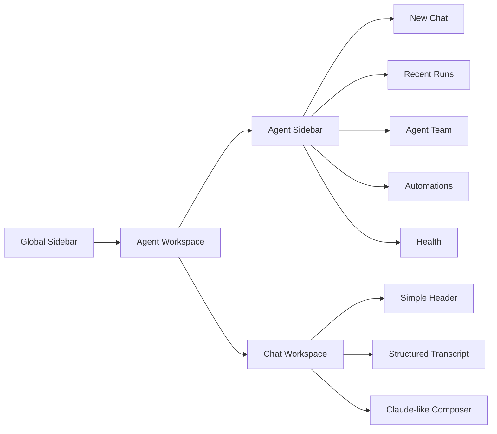
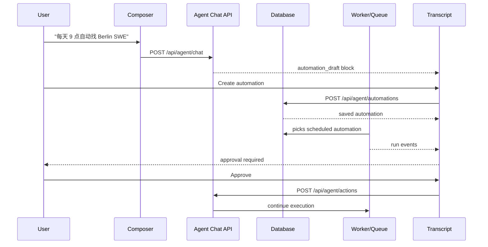

# Agent Workspace Redesign — Claude-Style AI Agent UI

> **Status:** Draft v1 · 2026-06-17
> **Audience:** Product, Design, Codex, Claude reviewer, future contributors
> **Related:** [`2026-06-18-agent-session-quality-auto-apply-redesign.md`](./2026-06-18-agent-session-quality-auto-apply-redesign.md), [`scraping-autoapply-design.md`](./scraping-autoapply-design.md), [`scraping-autoapply-dev-guide.md`](./scraping-autoapply-dev-guide.md)

> **Update 2026-06-18:** This UI-first document is extended by the session-quality architecture spec. Use this file for Claude-style page layout and transcript details; use the 2026-06-18 spec for `AgentSession`, `SubAgentTask`, quality gates, liveness, approvals, and the backend-first implementation plan.

This document defines the redesign plan for ApplyMate's web AI Agent page. The goal is to turn the current agent dashboard/playground into a Claude-style agent workspace: left-side runs, agents, automations, and health; right-side structured conversation, agent results, thinking disclosures, choices, approvals, and a Claude-like composer.

---

## 1. Product Goal

The AI Agent page should feel like a focused command workspace, not a settings dashboard.

Users should be able to:

- Chat with the ApplyMate Orchestrator in natural language.
- See agent work as a clearly separated transcript.
- Review collapsed/expandable agent reasoning summaries.
- Choose between agent-proposed strategies.
- Approve or reject sensitive actions before execution.
- Create automations manually from the left pane or conversationally through the agent.
- Review recent agent runs and lightweight observability without leaving the Agent page.

The target interaction model is closer to Claude / Claude Code than a traditional admin dashboard.

---

## 2. Non-Goals

- Do not create a new top-level page for automations.
- Do not keep Agent History as a separate primary navigation item.
- Do not keep Observability as a normal user navigation item.
- Do not add top-right mode controls such as `Interactive`, `Autonomous`, `Scheduled`, `Run`, or `Stop`.
- Do not make the page a marketing hero or dashboard of large cards.
- Do not expose raw chain-of-thought. Thinking disclosures show useful summaries and evidence, not hidden model internals.

---

## 3. Target Layout



### Global Sidebar

The app-level sidebar remains, but primary navigation should remove:

- `Agent History`
- normal-user `Observability`

`Observability` may remain available under `/admin/observability` for admin users.

### Agent Sidebar

The Agent page gets its own internal left pane, approximately `300-320px` wide.

Sections:

```text
New chat

Recent Runs
- Berlin SWE Auto-Apply
  Running · 18 scored · 4 applied
- Amsterdam PM Scout
  Yesterday · 24 found · 6 pending

Agent Team
- Scout        MiniMax M2.7     active
- Analyst      Claude Sonnet    idle
- Writer       MiniMax M2.7     idle
- Reviewer     MiniMax M2.7     idle
- Executor     MiniMax M2.7     idle
- Auditor      MiniMax M2.7     idle

Automations        +
- Weekday 09:00 EU scout     enabled
- Auto-apply 85+             approval
- Gmail follow-up            paused

Health
Success 91% · CAPTCHA 2% · Avg 2m14s · Cache 63%
```

### Chat Workspace

The right pane is a full-height conversation workspace.

Header:

```text
Berlin SWE Auto-Apply
Agent workspace

[Search] [More]
```

The header intentionally does not include run/mode controls. Actions should happen through:

- the composer,
- inline transcript blocks,
- left-pane automation controls.

---

## 4. Transcript Message Model

All transcript content uses one message shape:

```text
Speaker / Agent / State
Message content
Time · duration · metadata
```

Rules:

- Speaker appears above content.
- Time appears below content.
- Messages do not alternate left/right like chat bubbles.
- Each message is a full-width block with clear separation.
- Use subtle row separators and a left accent rail.
- Keep content dense and readable.

Example:

```text
You
每天早上 9 点自动找 Berlin 软件工程岗位，85 分以上自动投，但需要我确认。

10:41
```

```text
Orchestrator
可以。我会创建一个工作日 09:00 的自动化规则，目标是 Berlin 软件工程岗位，匹配分 85+，投递前请求你确认。

10:42 · 1.1s
```

### Message Kinds

```ts
type TranscriptMessageKind =
  | 'user'
  | 'orchestrator'
  | 'agent'
  | 'thinking'
  | 'options'
  | 'approval'
  | 'automation_draft'
  | 'job_results'
  | 'system'
  | 'error'
```

### Visual Accent Rails

| Kind | Accent |
|---|---|
| `user` | muted gray or indigo |
| `orchestrator` | indigo |
| `agent` | blue or green |
| `thinking` | slate |
| `options` | violet |
| `approval` | amber |
| `automation_draft` | indigo |
| `job_results` | green |
| `system` | gray |
| `error` | red |

---

## 5. Special Transcript Blocks

### Thinking Disclosure

Default state is collapsed.

```text
Analyst · Thinking
Checked saved preferences, application limits, and recent run history.
[Expand thinking]

10:43 · 3.2s
```

Expanded state:

```text
Reasoning summary
- User requires approval before submission.
- Existing daily cap is 10.
- Recommended automation cap is 8.
- LinkedIn auto-apply remains excluded.

Evidence checked
- Current AgentConfig
- Last 3 agent runs
- Saved target roles and locations
```

Implementation note: this is a reasoning summary, not raw chain-of-thought. Keep expanded content bounded with `max-height` and internal scrolling.

### Option Choice Block

Used when the Orchestrator asks the user to choose a strategy.

```text
Orchestrator · Options

Conservative
Only apply above 90. Daily cap 5.

Balanced
Apply above 85. Daily cap 8. Approval required.

Aggressive
Apply above 75. Daily cap 15. Approval required.

[Choose Conservative] [Choose Balanced] [Customize]

10:45
```

V1 can append a local transcript event after selection. V2 should persist the choice through an action endpoint.

### Approval Request Block

Sensitive actions are requested inline, not in a modal.

```text
Executor · Approval Required

Ready to submit 4 applications.

Impact
4 applications · 4 cover letters · no LinkedIn

[Approve] [Review jobs] [Cancel]

10:51
```

Approvals should be used for:

- auto-submitting applications,
- sending emails,
- changing automation rules,
- increasing daily caps,
- any action with external side effects.

### Automation Draft Block

Used when a user asks the agent to create an automation.

```text
Orchestrator · Automation Draft

Trigger          Weekdays 09:00
Target           Berlin Software Engineer
Score threshold  85+
Approval         Required
Daily cap        8

[Create automation] [Edit] [Cancel]

10:44
```

### Inline Job Results Block

Used for scored jobs, review queues, or approval previews.

```text
Top matches

Company      Role                 Score   Status
N26          Software Engineer     94     Ready
Spotify      Backend Engineer      88     Ready
HelloFresh   Fullstack Engineer    86     Needs review
SAP          Cloud Engineer        82     Hold
```

---

## 6. Claude-Style Composer

The bottom composer should feel like Claude's input area adapted for ApplyMate.

```text
[Create automation] [Review pending] [Explain score] [Show thinking]

┌────────────────────────────────────────────────────────────┐
│ Ask ApplyMate to search, score, apply, or create automation │
│                                                            │
│ +   MiniMax M2.7 ˅        Resume   Context          Send    │
└────────────────────────────────────────────────────────────┘
```

Required behavior:

- `Enter` sends.
- `Shift+Enter` inserts a newline.
- `+` opens an add menu.
- Model selector uses the existing model catalogue.
- Send button is disabled for empty input.
- Quick chips prefill useful prompts.

Suggested `+` menu:

- Add job URL
- Add resume context
- Create automation
- Attach note

---

## 7. V1 — UI Skeleton Version

### Goal

Ship the new Claude-style page shell and transcript experience without blocking on complete automation infrastructure.

### Scope

V1 includes:

- New internal Agent sidebar.
- Recent runs list from `/api/agent/history`.
- Agent team list from `/api/agent/roles` and `/api/agent/roles/custom`.
- Automations section as UI-backed placeholder or read-only seed data.
- Health strip from a lightweight endpoint if available, otherwise fallback empty state.
- Simplified right header.
- Structured transcript message rendering.
- Thinking, options, approval, automation draft, and job results blocks.
- Claude-style composer with model selector and add button.
- Removal of Agent History and normal Observability from primary nav.

V1 does not require:

- Real scheduled execution.
- Real automation CRUD.
- Real approval continuation.
- Structured SSE blocks from `/api/agent/chat`.

### V1 Component Plan

Create:

```text
apps/web/src/components/agent-workspace/
  AgentWorkspace.tsx
  AgentSidebar.tsx
  RecentRunsList.tsx
  AgentTeamList.tsx
  AutomationList.tsx
  HealthStrip.tsx
  ChatHeader.tsx
  Transcript.tsx
  TranscriptMessage.tsx
  ThinkingDisclosure.tsx
  OptionChoiceBlock.tsx
  ApprovalRequestBlock.tsx
  AutomationDraftBlock.tsx
  InlineJobResultsBlock.tsx
  ClaudeComposer.tsx
```

Refactor:

```text
apps/web/src/components/pages/AgentPlaygroundPage.tsx
```

The page should own data fetching and event handlers, then pass normalized props into the workspace components.

### V1 Data Mapping

Existing SSE events can map into transcript messages:

| Existing event | Transcript kind |
|---|---|
| `agent_plan` | `agent` |
| `agent_action` | `agent` |
| `agent_observation` | `agent` |
| `agent_reflect` | `thinking` or `agent` |
| `agent_question` | `options` |
| `orchestrator_question` | `approval` or `options` |
| `apply_ready` | `job_results` |
| `done` | `system` |
| `error` | `error` |

### V1 Acceptance Criteria

| AC | Requirement |
|---|---|
| V1-AC1 | `Agent History` is no longer visible in the main sidebar. |
| V1-AC2 | normal-user `Observability` is no longer visible in the main sidebar. |
| V1-AC3 | Agent page has internal left pane with Runs, Agent Team, Automations, and Health. |
| V1-AC4 | Right header has no `Run`, `Stop`, `Interactive`, `Autonomous`, or `Scheduled` controls. |
| V1-AC5 | Transcript message speaker is above content. |
| V1-AC6 | Transcript message time is below content. |
| V1-AC7 | Messages are visually separated with clear block boundaries. |
| V1-AC8 | Composer has plus/add button, model selector, textarea, quick chips, and send button. |
| V1-AC9 | Thinking block can collapse and expand. |
| V1-AC10 | Options, Approval, Automation Draft, and Job Results blocks render in the transcript. |

---

## 8. V2 — Automation and Approval Closure Version

### Goal

Make the V1 UI functional end-to-end: users can create automations through chat or manually, approve sensitive actions, and replay run history in the same workspace.

### Scope

V2 includes:

- Automation CRUD.
- Conversational automation draft creation.
- Approval persistence and response handling.
- Structured `/api/agent/chat` block events.
- User-level health endpoint.
- Scheduled automation execution via worker, queue, or cron.
- Recent run replay as transcript.

### Product Flow



### V2 Data Model

Suggested Prisma additions:

```prisma
model AgentAutomation {
  id              String   @id @default(cuid())
  userId          String
  name            String
  enabled         Boolean  @default(true)

  triggerType     String   // daily, weekdays, interval, manual
  cron            String?
  timezone        String   @default("Europe/Berlin")

  targetRoles     String[]
  targetLocations String[]
  minScore        Int      @default(85)
  dailyCap        Int      @default(8)
  requireApproval Boolean  @default(true)
  autoApply       Boolean  @default(false)

  createdBy       String   @default("user") // user, agent
  lastRunAt       DateTime?
  nextRunAt       DateTime?

  createdAt       DateTime @default(now())
  updatedAt       DateTime @updatedAt
}

model AgentApproval {
  id          String   @id @default(cuid())
  userId      String
  runId       String?
  type        String   // apply_jobs, send_email, create_automation
  status      String   @default("pending") // pending, approved, rejected, expired

  title       String
  body        String
  impact      Json?
  payload     Json

  decidedAt   DateTime?
  createdAt   DateTime @default(now())
}
```

If V2 needs to stay smaller, create `AgentAutomation` first and reuse existing question/answer infrastructure for approvals. Long term, `AgentApproval` is cleaner.

### V2 API Plan

Automation endpoints:

```text
GET    /api/agent/automations
POST   /api/agent/automations
PATCH  /api/agent/automations/[id]
DELETE /api/agent/automations/[id]
POST   /api/agent/automations/[id]/run
```

Action endpoint:

```text
POST /api/agent/actions
```

Example approval response:

```json
{
  "type": "approval_response",
  "approvalId": "appr_123",
  "decision": "approve"
}
```

Example create automation action:

```json
{
  "type": "create_automation",
  "draft": {
    "name": "Weekday Berlin SWE Scout",
    "triggerType": "weekdays",
    "cron": "0 9 * * 1-5",
    "timezone": "Europe/Berlin",
    "targetRoles": ["Software Engineer"],
    "targetLocations": ["Berlin"],
    "minScore": 85,
    "dailyCap": 8,
    "requireApproval": true
  }
}
```

Health endpoint:

```text
GET /api/agent/health
```

Example response:

```json
{
  "successRate": 91,
  "captchaRate": 2,
  "avgDurationMs": 134000,
  "patternCacheRate": 63,
  "last24hRuns": 5
}
```

### V2 Structured Chat Events

Upgrade `/api/agent/chat` to emit structured blocks.

```text
event: text
data: {"delta":"我可以帮你创建这个自动化。"}

event: block
data: {
  "type": "automation_draft",
  "draft": {
    "name": "Weekday Berlin SWE Scout",
    "trigger": "Weekdays 09:00",
    "timezone": "Europe/Berlin",
    "targetRoles": ["Software Engineer"],
    "targetLocations": ["Berlin"],
    "minScore": 85,
    "dailyCap": 8,
    "requireApproval": true
  }
}
```

Suggested block type:

```ts
type AgentBlock =
  | { type: 'automation_draft'; draft: AutomationDraft }
  | { type: 'approval'; approval: ApprovalPayload }
  | { type: 'options'; title: string; options: AgentOption[] }
  | { type: 'job_results'; jobs: JobResult[] }
  | { type: 'thinking'; summary: string; details?: string }
```

### V2 Acceptance Criteria

| AC | Requirement |
|---|---|
| V2-AC1 | User can create an automation manually from the left pane. |
| V2-AC2 | User can ask the agent to create an automation from chat. |
| V2-AC3 | Agent returns an Automation Draft block with confirm/edit/cancel actions. |
| V2-AC4 | Confirming an automation persists it and refreshes the left automation list. |
| V2-AC5 | Agent can create an Approval Request block for sensitive actions. |
| V2-AC6 | Approve/reject updates server state and appends a transcript result. |
| V2-AC7 | Recent Runs can be clicked and replayed as transcript messages. |
| V2-AC8 | Health strip uses a user-level endpoint, not the admin page directly. |
| V2-AC9 | `/api/agent/chat` can emit structured block events. |
| V2-AC10 | Scheduled automations can be picked up by the worker, queue, or cron path. |

---

## 9. Implementation Sequence

Recommended sprint plan:

```text
Sprint 1: V1 UI shell
- Add agent-workspace components.
- Refactor AgentPlaygroundPage into workspace layout.
- Add AgentSidebar and ChatHeader.
- Remove Agent History / Observability from main nav.

Sprint 2: V1 transcript and composer
- Add TranscriptMessage and special blocks.
- Map existing SSE events to transcript kinds.
- Add ClaudeComposer with model selector and plus menu.
- Verify message separation, speaker placement, and time placement.

Sprint 3: V2 automation CRUD
- Add AgentAutomation model.
- Add /api/agent/automations routes.
- Wire AutomationList to real data.
- Implement AutomationDraftBlock create/edit/cancel.

Sprint 4: V2 approvals and structured chat
- Add /api/agent/actions.
- Add approval persistence or integrate with existing AgentRunQuestion.
- Update /api/agent/chat to stream structured block events.
- Wire approval actions to server-side state.

Sprint 5: V2 scheduled execution and replay
- Connect automations to worker/queue/cron.
- Add Recent Run transcript replay.
- Add /api/agent/health.
```

---

## 10. File-Level Plan

Primary files to update:

```text
apps/web/src/components/pages/AgentPlaygroundPage.tsx
apps/web/src/components/layout/Sidebar.tsx
apps/web/src/components/layout/AppShell.tsx
apps/web/src/lib/types.ts
```

New UI files:

```text
apps/web/src/components/agent-workspace/AgentWorkspace.tsx
apps/web/src/components/agent-workspace/AgentSidebar.tsx
apps/web/src/components/agent-workspace/RecentRunsList.tsx
apps/web/src/components/agent-workspace/AgentTeamList.tsx
apps/web/src/components/agent-workspace/AutomationList.tsx
apps/web/src/components/agent-workspace/HealthStrip.tsx
apps/web/src/components/agent-workspace/ChatHeader.tsx
apps/web/src/components/agent-workspace/Transcript.tsx
apps/web/src/components/agent-workspace/TranscriptMessage.tsx
apps/web/src/components/agent-workspace/ThinkingDisclosure.tsx
apps/web/src/components/agent-workspace/OptionChoiceBlock.tsx
apps/web/src/components/agent-workspace/ApprovalRequestBlock.tsx
apps/web/src/components/agent-workspace/AutomationDraftBlock.tsx
apps/web/src/components/agent-workspace/InlineJobResultsBlock.tsx
apps/web/src/components/agent-workspace/ClaudeComposer.tsx
```

Potential V2 API files:

```text
apps/web/src/app/api/agent/automations/route.ts
apps/web/src/app/api/agent/automations/[id]/route.ts
apps/web/src/app/api/agent/automations/[id]/run/route.ts
apps/web/src/app/api/agent/actions/route.ts
apps/web/src/app/api/agent/health/route.ts
```

Potential V2 tests:

```text
apps/web/src/components/agent-workspace/*.test.tsx
apps/web/src/app/api/agent/automations/route.test.ts
apps/web/src/app/api/agent/actions/route.test.ts
apps/web/src/app/api/agent/health/route.test.ts
```

---

## 11. Design QA Checklist

Before handoff:

- Text does not clip in message headers, blocks, buttons, or composer.
- Time metadata appears below content in every message kind.
- Speaker label appears above content in every message kind.
- Message boundaries are obvious at normal zoom.
- Left sidebar remains usable at 1024px width.
- Composer remains anchored and usable when transcript scrolls.
- Approval block is visually prominent without becoming a modal.
- Thinking block is collapsed by default.
- No card-in-card clutter.
- No top-right run/mode controls have returned.
- No ordinary user nav entries exist for Agent History or Observability.

---

## 12. Open Questions

1. Should V1 automation rows be mock-only or backed by a minimal `AgentAutomation` table immediately?
2. Should approval state reuse `AgentRunQuestion` first, or should V2 introduce `AgentApproval` from the start?
3. Which model should the composer default to: platform default MiniMax M2.7 or the user's configured `agent` model?
4. Should recent run replay be read-only, or should users be able to continue a historical run as a new chat context?
5. Should `Show thinking` be a per-message disclosure, a composer tool, or both?

---

## 13. Summary

V1 makes the page feel like a polished Claude-style Agent workspace. V2 makes that workspace operational: automations can be created, approvals can be acted on, scheduled jobs can run, and history can be replayed.

The recommended implementation path is V1 first, then V2. This gives users an immediate product-quality UI improvement while keeping the deeper automation and approval infrastructure scoped into follow-up work.

---

## 14. Implementation Progress

> Updated 2026-07-03

Completed in the Agent workspace implementation:

- Internal Agent console is wired with Recent Sessions, Agent Team, Automations, Session Focus, and Health.
- Right workspace uses a simplified header without top-right run/mode/schedule controls.
- Claude-style composer includes quick actions, add menu, model selector, textarea, and send button.
- Manual automation creation is available from the Automations section through an editable form.
- "Ask agent instead" from the manual automation form returns to the live composer with an automation prompt prefilled.
- `/api/agent/chat` structured `automation_draft` blocks render directly in the live transcript.
- Automation Draft actions use the session action endpoint and refresh the left automation/session lists after save.
- `/api/agent/chat` can create live `approval_request` blocks for sensitive apply/submit requests and persist `AgentApproval` rows.
- Automation Draft `Edit` returns users to the live composer with an editable prompt; `Cancel` records a local transcript acknowledgement.
- Scheduled automations can now be picked up through `POST /api/agent/automations/due`, which creates `AgentSession` runs and advances `nextRunAt`.
- Vercel Cron is configured to call `GET /api/agent/automations/due` every 5 minutes; the endpoint also keeps `POST` for worker/manual scheduler callers and accepts `CRON_SECRET` or `AGENT_AUTOMATION_CRON_SECRET`.
- Scheduler pickup uses an atomic claim step (`enabled=true` and `nextRunAt <= now`) before creating the session, so overlapping cron calls do not duplicate runs.
- Automation rows now expose run cadence more clearly in the left console by showing next run and last run metadata.
- Paused automations cannot be started manually; the run endpoint returns a conflict instead of creating a session.
- Automation create, enable/disable, and manual run actions now show inline success/error feedback instead of failing silently.
- Automation `nextRunAt` is now computed from the automation timezone, so schedules like 09:00 Europe/Berlin stay aligned across daylight saving changes.
- Existing automations can now be edited from the left console through the same compact modal used for manual creation.
- Selecting a historical session now shows an explicit replay banner and a clear return-to-live action in both the transcript and left console.
- Approval actions now refresh transcript events, session detail, Recent Sessions, and Session Focus together; handled approval requests stop showing repeat action buttons.
- Composer add menu now connects to real context: recent jobs, saved resumes, manual job URL prompts, automation creation, and file attachment selection.
- AppShell now preserves and syncs the `?page=agent` query parameter, so the real Agent workspace can be opened, refreshed, and browser-tested through a stable direct URL.
- Recent Sessions now has a real status filter for all/running/approval/completed/failed sessions, with a clear empty state when no sessions match.
- The live workspace empty state now renders as a Claude-style starter transcript with separated Orchestrator, Analyst thinking summary, and option blocks; option rows prefill the composer instead of leaving the page as a blank waiting state.
- Live chat messages now render as full-width transcript blocks instead of right-aligned bubbles; model/SSE failures now produce a visible `System / Error` transcript event and mark the chat session failed instead of leaving the user staring at a stuck composer.
- Live orchestrator pause questions and agent option prompts now use the same transcript structure as chat messages: speaker above content, choices in the body, and time metadata below the block.
- Live transcript rendering helpers were split into `LiveTranscriptBlocks.tsx`, reducing the main Agent page surface and keeping message block styling reusable for follow-up visual QA.
- Composer file attachment selection now renders removable chips and includes file names/types as attachment context when sending a message.
- Legacy agent playground UI blocks that are no longer rendered in the Claude-style workspace were removed from `AgentPlaygroundPage.tsx`: old pipeline monitor, old execution log, old inline chat panel, and old global settings panel.
- Agent Team in the left console now exposes an Add action that opens the existing custom Agent creation modal from the redesigned workspace.
- Browser QA verified the logged-in Agent workspace on desktop and mobile widths; the mobile layout now stacks the Agent console and transcript vertically so conversation blocks are no longer squeezed into a narrow column.
- Local demo login was unblocked for QA by pointing `.env.local` at the ApplyMate PostgreSQL instance on port 5433 and making the seed update path reset the demo user's password/plan as well as create it.
- Custom Agent creation was extracted into `AddAgentModal.tsx`, keeping the redesigned left-pane Add action intact while reducing `AgentPlaygroundPage.tsx` surface area for future bug fixes.
- Composer add-menu primitives were extracted into `ComposerParts.tsx`, and live special transcript rendering now lives with the other live transcript helpers in `LiveTranscriptBlocks.tsx`.
- Apply queue job cards were extracted into `ApplyJobCard.tsx`, preserving the existing apply/open/mark-complete behavior while moving the queue item UI out of the main Agent page.
- The Claude-style bottom composer was extracted into `AgentComposer.tsx`, centralizing quick prompts, file chips, add-context menu, model selection, and send controls for follow-up visual refinement.
- The live transcript scroll area was extracted into `AgentLiveStreamBody.tsx`, with shared `live-run-types.ts` for run log and summary contracts; this keeps conversation block, option, approval, live block, and apply queue rendering separate from session/run state logic.
- Agent chat SSE parsing and response-error handling now live in `agent-chat-stream.ts` with focused tests, so the live workspace page no longer owns low-level stream parsing.
- Live chat log appends now use the parent React state updater instead of mutating the `log` array prop in `UnifiedStream`, preventing missed transcript renders and keeping stream scrolling tied to real state changes.
- Live transcript action callbacks now preserve async failures through the button action chain and surface a toast when create-automation or approval actions fail; the agent run scout warmup no longer leaves development `console.log` output in the browser.
- Apply queue cards now reset their loading state in a `finally` block, and the live workspace only marks a job as applied after `/api/jobs/:id/apply` succeeds; failed mark-as-applied calls now show an error toast instead of incorrectly switching the item to "applied".
- Historical session transcript local-only events are cleared when switching sessions, preventing cancelled/edit feedback from one replay from leaking into another; replay action failures now surface the backend error text instead of a generic message.
- Agent chat stream parsing now processes a final `data:` line even when the response stream ends without a trailing newline, preventing the last assistant chunk or terminal stream event from being dropped.
- Agent chat stream decoding now flushes the `TextDecoder` after the reader completes, preserving multibyte characters such as Chinese text when the final character is split across network chunks.
- Historical session replay refresh now reloads both session detail and transcript events, keeping status, quality score, memory summary, and event list in sync after approval or automation actions.
- The live workspace now auto-scrolls when structured live blocks or apply queue cards are added, not only when plain log entries change, so automation drafts, approvals, and newly queued jobs remain visible.
- Starting a new live chat now closes any active agent run `EventSource` before clearing the transcript, preventing old pipeline events from leaking into the fresh conversation.
- Opening a replay session now also closes any active live run `EventSource`, clears the waiting question/current role, and marks the live run stopped so background pipeline events cannot mutate state while the user reviews history.
- Agent run SSE handlers now keep the latest role in a ref, so job result and skip transcript entries are attributed to the active stage instead of reading a stale React `currentRole` closure.
- Agent run SSE listeners are now guarded by a run id, so delayed events from a closed/replaced `EventSource` cannot append logs, queue jobs, or change run state after the user starts a new chat, opens replay, or stops the run.
- The Agent page now closes and invalidates the active run `EventSource` on component unmount, preventing background SSE connections from surviving navigation away from the workspace.
- Orchestrator pause answers and agent option answers now check API mutation errors before clearing the waiting state or marking transcript options as answered; config updates are applied before the resume answer is submitted.
- Chat-triggered agent actions now check API mutation errors before showing success for agent role toggles or config updates, so failed tool actions surface a toast and propagate back to the live chat error path.
- Live composer submissions now restore the draft text and selected attachment chips when chat submission fails, without overwriting newer text/files the user adds while the failed request is pending.
- Custom Agent creation and manual automation create/edit modals now release their saving state through `finally` and surface network/API exceptions inline or via toast, preventing stuck loading buttons after failed requests.
- Live transcript `SmartMessage` now escapes raw HTML before applying lightweight markdown formatting, preventing agent/job text from rendering arbitrary HTML in the Claude-style conversation stream.
- Live automation/approval actions now throw when the chat session is not ready, so transcript action buttons show failure instead of incorrectly reporting that an unsaved action was recorded.
- Live orchestrator and agent option buttons now await async answer handlers, show a `Working...` pending state, disable competing choices while saving, and render inline errors if the answer/config update fails.
- Agent Team in the left console now refreshes from an `applymate:agents-changed` event after custom Agent creation or chat-triggered role toggles, preventing stale enabled/custom-agent state.
- Legacy `ACTION:` line cleanup has been moved out of `AgentPlaygroundPage.tsx` and into the chat stream boundary, so the Claude-style page consumes display-ready text while structured `action` events still drive client behavior.
- Browser smoke test on `http://localhost:3000/?page=agent` confirmed the Claude-style workspace renders with the left console, separated transcript blocks, quick chips, composer, model selector, and add button. Full data-state verification is currently blocked by the local PostgreSQL service being stopped; the page now shows explicit API error states instead of confusing missing-data placeholders.
- Agent Team now renders API failures as an error state instead of incorrectly showing `No agents configured` when `/api/agent/roles` or `/api/agent/roles/custom` fails.
- Left console module failures now use clear, module-specific unavailable states for Recent Sessions, Agent Team, Automations, and Health while preserving the raw API error in the title for debugging.
- Approval action persistence now rejects stale or already-handled approval IDs with `409 Approval is no longer pending` and skips transcript writes, preventing false "approved/cancelled" history entries.
- Agent-created automation actions now update an existing same-name automation for the user instead of blindly creating another row, and record `automation_updated` vs `automation_created` transcript events accordingly.
- Transcript chrome now gives `automation_created`, `automation_updated`, and `automation_cancelled` distinct labels/tones instead of falling back to generic system events.
- Live transcript action confirmations now append the server-returned transcript event when available, keeping live view and replay consistent for `automation_created`, `automation_updated`, and approval response events.
- Manual automation creation now mirrors agent-created automation behavior by updating an existing same-name automation for the user instead of creating duplicate rows.
- Automation run events now have dedicated transcript chrome through `automation_started`, so manual runs and scheduled pickups no longer appear as generic system events.
- Manual automation runs now claim `enabled=true` with an atomic update before creating an AgentSession, matching scheduler behavior and preventing a paused automation from starting during a concurrent state change.
- Transcript event contracts now include automation lifecycle events (`automation_started`, `automation_created`, `automation_updated`, `automation_cancelled`), and replay chrome explicitly labels `session_memory` and `subagent_task_started` events.
- Live transcript approval requests now share the replay approval-response detection, so handled approvals stop showing action buttons as soon as the response event appears.
- Transcript action buttons now leave successful confirmation to the persisted transcript event, show backend error text for failed actions, and avoid refreshing Automations after approval-only responses.
- The composer `Show thinking` chip now acts as a local transcript control instead of sending a redundant model prompt; preview QA also verifies the thinking block expands/collapses with evidence text.
- When no expandable thinking block exists yet, `Show thinking` now pre-fills the composer with a thinking-summary request instead of failing silently.
- The `Show thinking` fallback appends to any existing composer draft instead of replacing it, and expanded thinking blocks are scrolled into view.
- Agent preview mobile layout now hides the desktop app sidebar and stacks the agent console above the transcript, matching the real Agent workspace responsive strategy and avoiding clipped conversation content.
- The live chat/composer orchestration was extracted from `AgentPlaygroundPage.tsx` into `AgentUnifiedStream.tsx`, with header, helpers, and prop contracts split into focused files while preserving transcript, approval, automation, and attachment behavior.
- Safe transcript text rendering was extracted into `SmartMessage.tsx` with its own escaping regression test, keeping `LiveTranscriptBlocks.tsx` under the file-size budget while preserving lightweight markdown rendering.
- `/api/agent/chat` pure parsing helpers were extracted into `route-helpers.ts`; unsupported model-emitted `ACTION:` commands are now ignored instead of being sent to the client or recorded as valid action transcript events.
- `/api/agent` PATCH now validates agent config updates by field type before writing to Prisma, removing unsafe casts and preventing malformed chat-triggered config changes from reaching `AgentConfig`.
- `/api/agent/run` now builds the pipeline `AgentConfigFull` through `run-helpers.ts` instead of casting the Prisma record, preserving the default `throttleMs` while keeping the run context typed.
- Orchestrator retry fixes and option actions now pass through `orchestrator-config.ts`, so only supported config fields with valid value types can mutate the in-memory pipeline config or persist to `AgentConfig`.
- The main agent pipeline no longer casts analyst failure results or `coverTone`; it now relies on the typed `AcceptResult` union and `AgentConfigFull` contract directly.

Still to harden:

- Run a full production-like auth/OAuth pass once real Google credentials are available.
- Re-run full browser QA with PostgreSQL available so Recent Sessions, Agent Team, Automations, Health, replay, and approval persistence can be verified with real data.
